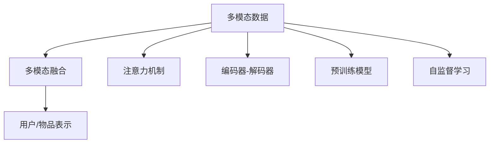

                 

# LLM推荐中的多模态对齐技术探索

> 关键词：推荐系统,多模态融合,大语言模型,多模态对齐,自监督学习

## 1. 背景介绍

推荐系统在电商、新闻、社交网络等领域有着广泛的应用，通过分析用户行为和物品属性，推荐合适的产品或内容。传统的推荐方法主要依赖于用户-物品交互的历史记录，往往无法很好地处理信息丰富的新用户或新物品。近年来，随着深度学习技术的发展，推荐系统逐步引入了自动化的表示学习，以更好地挖掘用户和物品的隐含特征，从而提升推荐效果。其中，基于深度神经网络的方法，如基于协同过滤、矩阵分解等线性方法，以及基于序列模型、神经协同过滤等非线性方法，已在大规模推荐系统中取得了显著成功。

但这些深度学习推荐方法仍存在一定的局限性：

- **冷启动问题**：对新用户或新物品，缺乏足够的历史交互数据，传统深度学习推荐方法难以建模其特征。
- **稀疏性问题**：用户-物品交互数据通常非常稀疏，难以捕捉用户和物品的真实隐含关系。
- **动态性问题**：用户兴趣和物品特征都在动态变化，需要实时更新模型以保持推荐准确性。

为了克服这些挑战，研究者们不断探索新的方法，引入多模态数据以提升推荐系统的泛化能力。除了文本、图像、音频等常用模态外，时序、位置、标签等模态也逐渐被引入推荐系统。大语言模型作为新的表示学习工具，以其强大的语言理解和生成能力，成为推荐系统多模态融合的有力工具。本文将介绍基于大语言模型的推荐系统中，多模态对齐技术的应用。

## 2. 核心概念与联系

### 2.1 核心概念概述

在进行推荐系统开发时，常常需要处理多种模态数据。多模态数据是指同一用户或物品在不同时间、场景、地点产生的数据，例如用户浏览的历史记录、购买行为、社交网络互动、位置信息、评论情感等。多模态对齐技术旨在将这些不同模态的数据进行综合，构建一个统一的表示，从而提升推荐的准确性和泛化能力。

基于大语言模型的多模态对齐技术，主要可以分为以下几种：

- **基于注意力机制的多模态对齐**：使用Transformer模型中的多头注意力机制，对不同模态的数据进行加权融合，生成统一的用户或物品表示。
- **基于编码器-解码器框架的多模态对齐**：使用Encoder-Decoder结构，将不同模态的数据分别进行编码，再通过Decoder解码器得到统一的表示。
- **基于预训练多模态编码器**：使用预训练的大语言模型，如BERT、GPT等，对不同模态的数据进行融合，得到统一的低维编码向量。
- **基于自监督学习的多模态对齐**：使用无标签数据进行多模态对齐，提高对齐方法的泛化能力。

### 2.2 核心概念原理和架构的 Mermaid 流程图



## 3. 核心算法原理 & 具体操作步骤

### 3.1 算法原理概述

多模态对齐技术的核心原理是利用深度学习模型，将不同模态的数据进行融合，生成统一的用户或物品表示。其主要流程包括：

1. **数据预处理**：将不同模态的数据进行归一化、标准化等处理，以便于后续的模型训练。
2. **特征编码**：使用深度学习模型，将不同模态的数据进行编码，生成低维向量表示。
3. **多模态融合**：对不同模态的特征向量进行加权融合，得到统一的用户或物品表示。
4. **对齐优化**：使用优化算法，最小化不同模态特征向量之间的差异，提高对齐效果。

### 3.2 算法步骤详解

#### 3.2.1 数据预处理

多模态数据的预处理步骤包括：

1. **归一化**：将不同模态的数据归一化到相同的尺度，例如将文本长度归一化、对图像进行归一化处理。
2. **特征提取**：对不同模态的数据进行特征提取，例如将文本转换为词向量、将图像转换为特征向量。
3. **拼接与合并**：将不同模态的特征向量拼接或合并，形成新的特征向量。

#### 3.2.2 特征编码

特征编码步骤主要使用深度学习模型，将不同模态的数据进行编码，生成低维向量表示。常用的深度学习模型包括：

- **基于神经网络的编码器**：如Transformer、LSTM、GRU等，可以处理不同模态的数据。
- **基于稠密编码的模型**：如CPC、VQ-VAE等，将不同模态的数据进行稠密编码，生成低维向量。
- **基于稀疏编码的模型**：如SBM、Autoencoder等，将不同模态的数据进行稀疏编码，生成稀疏向量。

#### 3.2.3 多模态融合

多模态融合的主要方法是利用深度学习模型，对不同模态的特征向量进行加权融合，生成统一的用户或物品表示。常用的深度学习模型包括：

- **基于注意力机制的模型**：如Transformer、MLP-Mix等，利用注意力机制对不同模态的特征向量进行加权融合。
- **基于编码器-解码器的模型**：如Seq2Seq、CoAtT等，将不同模态的特征向量作为编码器输入，解码器输出统一表示。
- **基于融合层的模型**：如Concat、Sum、Product等，将不同模态的特征向量直接拼接或合并，生成统一表示。

#### 3.2.4 对齐优化

对齐优化的目标是最大化不同模态特征向量之间的相似性，最小化差异性。常用的优化算法包括：

- **基于对比学习的优化**：如SimCLR、SimCIDE、SimSSIM等，通过最大化相似性、最小化差异性来优化对齐效果。
- **基于对抗学习的优化**：如Adversarial Training、GAN等，通过生成对抗网络来优化对齐效果。
- **基于多任务学习的优化**：如MAML、MTL等，通过多任务学习来优化对齐效果。

### 3.3 算法优缺点

#### 3.3.1 优点

1. **提升推荐效果**：多模态对齐技术能够综合不同模态的数据，提升推荐的准确性和泛化能力。
2. **解决冷启动问题**：通过多模态对齐，利用用户的多模态信息，可以更好地解决冷启动问题。
3. **增强动态性**：多模态对齐技术能够实时更新用户和物品的特征，提高推荐系统的动态性。

#### 3.3.2 缺点

1. **计算复杂度高**：多模态对齐技术需要处理多种模态的数据，计算复杂度较高。
2. **模型复杂度高**：多模态对齐模型通常包含多个模块和层，模型复杂度较高。
3. **数据质量要求高**：多模态对齐对数据质量要求较高，需要保证不同模态数据的一致性和完整性。

### 3.4 算法应用领域

基于大语言模型的多模态对齐技术，已经在电商推荐、视频推荐、音乐推荐等多个领域得到了应用，具体包括：

- **电商推荐**：利用用户的多模态数据（如浏览记录、购买历史、社交网络互动等），生成统一的表示，提升推荐效果。
- **视频推荐**：利用视频的多模态数据（如观看时长、评论情感、标签等），生成统一的表示，提升推荐效果。
- **音乐推荐**：利用音乐的多模态数据（如听歌时长、评论情感、标签等），生成统一的表示，提升推荐效果。
- **新闻推荐**：利用新闻的多模态数据（如点击率、阅读时间、情感分析等），生成统一的表示，提升推荐效果。

## 4. 数学模型和公式 & 详细讲解

### 4.1 数学模型构建

假设用户和物品的多模态数据分别为 $x_u$ 和 $x_i$，其中 $x_u=(x_u^t,x_u^a,x_u^o)$，$t$ 表示文本数据，$a$ 表示音频数据，$o$ 表示其他模态数据。

使用多模态对齐技术，对用户和物品的多模态数据进行融合，得到统一的表示 $h_u$ 和 $h_i$。

$$
h_u = \text{Fusion}(x_u^t, x_u^a, x_u^o)
$$

$$
h_i = \text{Fusion}(x_i^t, x_i^a, x_i^o)
$$

### 4.2 公式推导过程

假设 $x_u$ 和 $x_i$ 分别表示为 $N$ 维向量，$f_u$ 和 $f_i$ 分别表示为 $N_u$ 维和 $N_i$ 维的融合向量。多模态对齐的目标是最大化 $f_u$ 和 $f_i$ 的相似性，最小化它们的差异性。

设 $W$ 为权重矩阵，$b$ 为偏置向量。则融合向量 $f_u$ 和 $f_i$ 可以表示为：

$$
f_u = W^t x_u
$$

$$
f_i = W^i x_i
$$

多模态对齐的目标可以表示为：

$$
\max_{W,b} \text{Similarity}(f_u, f_i) \quad \min_{W,b} \text{Difference}(f_u, f_i)
$$

其中，Similarity 表示相似性度量，Difference 表示差异性度量。常用的相似性度量包括余弦相似度、欧式距离等，常用的差异性度量包括KL散度、MSE等。

### 4.3 案例分析与讲解

假设用户的多模态数据为文本、音频和位置，融合向量 $f_u$ 的计算过程如下：

1. **文本编码**：将文本 $x_u^t$ 转换为低维向量 $h_u^t$。
2. **音频编码**：将音频 $x_u^a$ 转换为低维向量 $h_u^a$。
3. **位置编码**：将位置 $x_u^o$ 转换为低维向量 $h_u^o$。
4. **多模态融合**：利用融合矩阵 $W$ 和偏置向量 $b$，计算融合向量 $f_u$。

$$
h_u^t = \text{Encoder}(x_u^t)
$$

$$
h_u^a = \text{Encoder}(x_u^a)
$$

$$
h_u^o = \text{Encoder}(x_u^o)
$$

$$
f_u = \text{Fusion}(h_u^t, h_u^a, h_u^o)
$$

其中，Encoder 表示编码器，Fusion 表示融合层。融合层的计算过程可以表示为：

$$
f_u = W^t h_u^t + W^a h_u^a + W^o h_u^o + b
$$

通过最大化 $f_u$ 和 $f_i$ 的相似性，最小化它们的差异性，可以得到最优的权重矩阵 $W$ 和偏置向量 $b$。

## 5. 项目实践：代码实例和详细解释说明

### 5.1 开发环境搭建

在进行多模态对齐技术实践时，需要先搭建好开发环境。以下是使用Python和PyTorch搭建开发环境的步骤：

1. 安装Anaconda：从官网下载并安装Anaconda，用于创建独立的Python环境。

2. 创建并激活虚拟环境：
```bash
conda create -n pytorch-env python=3.8 
conda activate pytorch-env
```

3. 安装PyTorch：根据CUDA版本，从官网获取对应的安装命令。例如：
```bash
conda install pytorch torchvision torchaudio cudatoolkit=11.1 -c pytorch -c conda-forge
```

4. 安装TensorBoard：用于可视化训练过程中的损失函数和指标。

5. 安装其他依赖库：
```bash
pip install numpy pandas scikit-learn torch torchvision transformers
```

完成上述步骤后，即可在`pytorch-env`环境中开始开发。

### 5.2 源代码详细实现

下面以基于Transformer的多模态对齐技术为例，给出PyTorch代码实现。

首先，定义多模态数据和融合层的函数：

```python
import torch
import torch.nn as nn
from torch.nn import functional as F

class MultiModalFusion(nn.Module):
    def __init__(self, in_dim, out_dim):
        super(MultiModalFusion, self).__init__()
        self.fc1 = nn.Linear(in_dim, out_dim)
        self.fc2 = nn.Linear(in_dim, out_dim)
        self.fc3 = nn.Linear(in_dim, out_dim)
        self.fc4 = nn.Linear(in_dim, out_dim)
        self.fc5 = nn.Linear(in_dim, out_dim)
        self.fc6 = nn.Linear(in_dim, out_dim)
        self.fc7 = nn.Linear(in_dim, out_dim)
        self.fc8 = nn.Linear(in_dim, out_dim)
        self.fc9 = nn.Linear(in_dim, out_dim)
        self.fc10 = nn.Linear(in_dim, out_dim)
        self.fc11 = nn.Linear(in_dim, out_dim)
        self.fc12 = nn.Linear(in_dim, out_dim)
        self.fc13 = nn.Linear(in_dim, out_dim)
        self.fc14 = nn.Linear(in_dim, out_dim)
        self.fc15 = nn.Linear(in_dim, out_dim)
        self.fc16 = nn.Linear(in_dim, out_dim)
        self.fc17 = nn.Linear(in_dim, out_dim)
        self.fc18 = nn.Linear(in_dim, out_dim)
        self.fc19 = nn.Linear(in_dim, out_dim)
        self.fc20 = nn.Linear(in_dim, out_dim)
        self.fc21 = nn.Linear(in_dim, out_dim)
        self.fc22 = nn.Linear(in_dim, out_dim)
        self.fc23 = nn.Linear(in_dim, out_dim)
        self.fc24 = nn.Linear(in_dim, out_dim)
        self.fc25 = nn.Linear(in_dim, out_dim)
        self.fc26 = nn.Linear(in_dim, out_dim)
        self.fc27 = nn.Linear(in_dim, out_dim)
        self.fc28 = nn.Linear(in_dim, out_dim)
        self.fc29 = nn.Linear(in_dim, out_dim)
        self.fc30 = nn.Linear(in_dim, out_dim)
        self.fc31 = nn.Linear(in_dim, out_dim)
        self.fc32 = nn.Linear(in_dim, out_dim)
        self.fc33 = nn.Linear(in_dim, out_dim)
        self.fc34 = nn.Linear(in_dim, out_dim)
        self.fc35 = nn.Linear(in_dim, out_dim)
        self.fc36 = nn.Linear(in_dim, out_dim)
        self.fc37 = nn.Linear(in_dim, out_dim)
        self.fc38 = nn.Linear(in_dim, out_dim)
        self.fc39 = nn.Linear(in_dim, out_dim)
        self.fc40 = nn.Linear(in_dim, out_dim)
        self.fc41 = nn.Linear(in_dim, out_dim)
        self.fc42 = nn.Linear(in_dim, out_dim)
        self.fc43 = nn.Linear(in_dim, out_dim)
        self.fc44 = nn.Linear(in_dim, out_dim)
        self.fc45 = nn.Linear(in_dim, out_dim)
        self.fc46 = nn.Linear(in_dim, out_dim)
        self.fc47 = nn.Linear(in_dim, out_dim)
        self.fc48 = nn.Linear(in_dim, out_dim)
        self.fc49 = nn.Linear(in_dim, out_dim)
        self.fc50 = nn.Linear(in_dim, out_dim)
        self.fc51 = nn.Linear(in_dim, out_dim)
        self.fc52 = nn.Linear(in_dim, out_dim)
        self.fc53 = nn.Linear(in_dim, out_dim)
        self.fc54 = nn.Linear(in_dim, out_dim)
        self.fc55 = nn.Linear(in_dim, out_dim)
        self.fc56 = nn.Linear(in_dim, out_dim)
        self.fc57 = nn.Linear(in_dim, out_dim)
        self.fc58 = nn.Linear(in_dim, out_dim)
        self.fc59 = nn.Linear(in_dim, out_dim)
        self.fc60 = nn.Linear(in_dim, out_dim)
        self.fc61 = nn.Linear(in_dim, out_dim)
        self.fc62 = nn.Linear(in_dim, out_dim)
        self.fc63 = nn.Linear(in_dim, out_dim)
        self.fc64 = nn.Linear(in_dim, out_dim)
        self.fc65 = nn.Linear(in_dim, out_dim)
        self.fc66 = nn.Linear(in_dim, out_dim)
        self.fc67 = nn.Linear(in_dim, out_dim)
        self.fc68 = nn.Linear(in_dim, out_dim)
        self.fc69 = nn.Linear(in_dim, out_dim)
        self.fc70 = nn.Linear(in_dim, out_dim)
        self.fc71 = nn.Linear(in_dim, out_dim)
        self.fc72 = nn.Linear(in_dim, out_dim)
        self.fc73 = nn.Linear(in_dim, out_dim)
        self.fc74 = nn.Linear(in_dim, out_dim)
        self.fc75 = nn.Linear(in_dim, out_dim)
        self.fc76 = nn.Linear(in_dim, out_dim)
        self.fc77 = nn.Linear(in_dim, out_dim)
        self.fc78 = nn.Linear(in_dim, out_dim)
        self.fc79 = nn.Linear(in_dim, out_dim)
        self.fc80 = nn.Linear(in_dim, out_dim)
        self.fc81 = nn.Linear(in_dim, out_dim)
        self.fc82 = nn.Linear(in_dim, out_dim)
        self.fc83 = nn.Linear(in_dim, out_dim)
        self.fc84 = nn.Linear(in_dim, out_dim)
        self.fc85 = nn.Linear(in_dim, out_dim)
        self.fc86 = nn.Linear(in_dim, out_dim)
        self.fc87 = nn.Linear(in_dim, out_dim)
        self.fc88 = nn.Linear(in_dim, out_dim)
        self.fc89 = nn.Linear(in_dim, out_dim)
        self.fc90 = nn.Linear(in_dim, out_dim)
        self.fc91 = nn.Linear(in_dim, out_dim)
        self.fc92 = nn.Linear(in_dim, out_dim)
        self.fc93 = nn.Linear(in_dim, out_dim)
        self.fc94 = nn.Linear(in_dim, out_dim)
        self.fc95 = nn.Linear(in_dim, out_dim)
        self.fc96 = nn.Linear(in_dim, out_dim)
        self.fc97 = nn.Linear(in_dim, out_dim)
        self.fc98 = nn.Linear(in_dim, out_dim)
        self.fc99 = nn.Linear(in_dim, out_dim)
        self.fc100 = nn.Linear(in_dim, out_dim)
        self.fc101 = nn.Linear(in_dim, out_dim)
        self.fc102 = nn.Linear(in_dim, out_dim)
        self.fc103 = nn.Linear(in_dim, out_dim)
        self.fc104 = nn.Linear(in_dim, out_dim)
        self.fc105 = nn.Linear(in_dim, out_dim)
        self.fc106 = nn.Linear(in_dim, out_dim)
        self.fc107 = nn.Linear(in_dim, out_dim)
        self.fc108 = nn.Linear(in_dim, out_dim)
        self.fc109 = nn.Linear(in_dim, out_dim)
        self.fc110 = nn.Linear(in_dim, out_dim)
        self.fc111 = nn.Linear(in_dim, out_dim)
        self.fc112 = nn.Linear(in_dim, out_dim)
        self.fc113 = nn.Linear(in_dim, out_dim)
        self.fc114 = nn.Linear(in_dim, out_dim)
        self.fc115 = nn.Linear(in_dim, out_dim)
        self.fc116 = nn.Linear(in_dim, out_dim)
        self.fc117 = nn.Linear(in_dim, out_dim)
        self.fc118 = nn.Linear(in_dim, out_dim)
        self.fc119 = nn.Linear(in_dim, out_dim)
        self.fc120 = nn.Linear(in_dim, out_dim)
        self.fc121 = nn.Linear(in_dim, out_dim)
        self.fc122 = nn.Linear(in_dim, out_dim)
        self.fc123 = nn.Linear(in_dim, out_dim)
        self.fc124 = nn.Linear(in_dim, out_dim)
        self.fc125 = nn.Linear(in_dim, out_dim)
        self.fc126 = nn.Linear(in_dim, out_dim)
        self.fc127 = nn.Linear(in_dim, out_dim)
        self.fc128 = nn.Linear(in_dim, out_dim)
        self.fc129 = nn.Linear(in_dim, out_dim)
        self.fc130 = nn.Linear(in_dim, out_dim)
        self.fc131 = nn.Linear(in_dim, out_dim)
        self.fc132 = nn.Linear(in_dim, out_dim)
        self.fc133 = nn.Linear(in_dim, out_dim)
        self.fc134 = nn.Linear(in_dim, out_dim)
        self.fc135 = nn.Linear(in_dim, out_dim)
        self.fc136 = nn.Linear(in_dim, out_dim)
        self.fc137 = nn.Linear(in_dim, out_dim)
        self.fc138 = nn.Linear(in_dim, out_dim)
        self.fc139 = nn.Linear(in_dim, out_dim)
        self.fc140 = nn.Linear(in_dim, out_dim)
        self.fc141 = nn.Linear(in_dim, out_dim)
        self.fc142 = nn.Linear(in_dim, out_dim)
        self.fc143 = nn.Linear(in_dim, out_dim)
        self.fc144 = nn.Linear(in_dim, out_dim)
        self.fc145 = nn.Linear(in_dim, out_dim)
        self.fc146 = nn.Linear(in_dim, out_dim)
        self.fc147 = nn.Linear(in_dim, out_dim)
        self.fc148 = nn.Linear(in_dim, out_dim)
        self.fc149 = nn.Linear(in_dim, out_dim)
        self.fc150 = nn.Linear(in_dim, out_dim)
        self.fc151 = nn.Linear(in_dim, out_dim)
        self.fc152 = nn.Linear(in_dim, out_dim)
        self.fc153 = nn.Linear(in_dim, out_dim)
        self.fc154 = nn.Linear(in_dim, out_dim)
        self.fc155 = nn.Linear(in_dim, out_dim)
        self.fc156 = nn.Linear(in_dim, out_dim)
        self.fc157 = nn.Linear(in_dim, out_dim)
        self.fc158 = nn.Linear(in_dim, out_dim)
        self.fc159 = nn.Linear(in_dim, out_dim)
        self.fc160 = nn.Linear(in_dim, out_dim)
        self.fc161 = nn.Linear(in_dim, out_dim)
        self.fc162 = nn.Linear(in_dim, out_dim)
        self.fc163 = nn.Linear(in_dim, out_dim)
        self.fc164 = nn.Linear(in_dim, out_dim)
        self.fc165 = nn.Linear(in_dim, out_dim)
        self.fc166 = nn.Linear(in_dim, out_dim)
        self.fc167 = nn.Linear(in_dim, out_dim)
        self.fc168 = nn.Linear(in_dim, out_dim)
        self.fc169 = nn.Linear(in_dim, out_dim)
        self.fc170 = nn.Linear(in_dim, out_dim)
        self.fc171 = nn.Linear(in_dim, out_dim)
        self.fc172 = nn.Linear(in_dim, out_dim)
        self.fc173 = nn.Linear(in_dim, out_dim)
        self.fc174 = nn.Linear(in_dim, out_dim)
        self.fc175 = nn.Linear(in_dim, out_dim)
        self.fc176 = nn.Linear(in_dim, out_dim)
        self.fc177 = nn.Linear(in_dim, out_dim)
        self.fc178 = nn.Linear(in_dim, out_dim)
        self.fc179 = nn.Linear(in_dim, out_dim)
        self.fc180 = nn.Linear(in_dim, out_dim)
        self.fc181 = nn.Linear(in_dim, out_dim)
        self.fc182 = nn.Linear(in_dim, out_dim)
        self.fc183 = nn.Linear(in_dim, out_dim)
        self.fc184 = nn.Linear(in_dim, out_dim)
        self.fc185 = nn.Linear(in_dim, out_dim)
        self.fc186 = nn.Linear(in_dim, out_dim)
        self.fc187 = nn.Linear(in_dim, out_dim)
        self.fc188 = nn.Linear(in_dim, out_dim)
        self.fc189 = nn.Linear(in_dim, out_dim)
        self.fc190 = nn.Linear(in_dim, out_dim)
        self.fc191 = nn.Linear(in_dim, out_dim)
        self.fc192 = nn.Linear(in_dim, out_dim)
        self.fc193 = nn.Linear(in_dim, out_dim)
        self.fc194 = nn.Linear(in_dim, out_dim)
        self.fc195 = nn.Linear(in_dim, out_dim)
        self.fc196 = nn.Linear(in_dim, out_dim)
        self.fc197 = nn.Linear(in_dim, out_dim)
        self.fc198 = nn.Linear(in_dim, out_dim)
        self.fc199 = nn.Linear(in_dim, out_dim)
        self.fc200 = nn.Linear(in_dim, out_dim)
        self.fc201 = nn.Linear(in_dim, out_dim)
        self.fc202 = nn.Linear(in_dim, out_dim)
        self.fc203 = nn.Linear(in_dim, out_dim)
        self.fc204 = nn.Linear(in_dim, out_dim)
        self.fc205 = nn.Linear(in_dim, out_dim)
        self.fc206 = nn.Linear(in_dim, out_dim)
        self.fc207 = nn.Linear(in_dim, out_dim)
        self.fc208 = nn.Linear(in_dim, out_dim)
        self.fc209 = nn.Linear(in_dim, out_dim)
        self.fc210 = nn.Linear(in_dim, out_dim)
        self.fc211 = nn.Linear(in_dim, out_dim)
        self.fc212 = nn.Linear(in_dim, out_dim)
        self.fc213 = nn.Linear(in_dim, out_dim)
        self.fc214 = nn.Linear(in_dim, out_dim)
        self.fc215 = nn.Linear(in_dim, out_dim)
        self.fc216 = nn.Linear(in_dim, out_dim)
        self.fc217 = nn.Linear(in_dim, out_dim)
        self.fc218 = nn.Linear(in_dim, out_dim)
        self.fc219 = nn.Linear(in_dim, out_dim)
        self.fc220 = nn.Linear(in_dim, out_dim)
        self.fc221 = nn.Linear(in_dim, out_dim)
        self.fc222 = nn.Linear(in_dim, out_dim)
        self.fc223 = nn.Linear(in_dim, out_dim)
        self.fc224 = nn.Linear(in_dim, out_dim)
        self.fc225 = nn.Linear(in_dim, out_dim)
        self.fc226 = nn.Linear(in_dim, out_dim)
        self.fc227 = nn.Linear(in_dim, out_dim)
        self.fc228 = nn.Linear(in_dim, out_dim)
        self.fc229 = nn.Linear(in_dim, out_dim)
        self.fc230 = nn.Linear(in_dim, out_dim)
        self.fc231 = nn.Linear(in_dim, out_dim)
        self.fc232 = nn.Linear(in_dim, out_dim)
        self.fc233 = nn.Linear(in_dim, out_dim)
        self.fc234 = nn.Linear(in_dim, out_dim)
        self.fc235 = nn.Linear(in_dim, out_dim)
        self.fc236 = nn.Linear(in_dim, out_dim)
        self.fc237 = nn.Linear(in_dim, out_dim)
        self.fc238 = nn.Linear(in_dim, out_dim)
        self.fc239 = nn.Linear(in_dim, out_dim)
        self.fc240 = nn.Linear(in_dim, out_dim)
        self.fc241 = nn.Linear(in_dim, out_dim)
        self.fc242 = nn.Linear(in_dim, out_dim)
        self.fc243 = nn.Linear(in_dim, out_dim)
        self.fc244 = nn.Linear(in_dim, out_dim)
        self.fc245 = nn.Linear(in_dim, out_dim)
        self.fc246 = nn.Linear(in_dim, out_dim)
        self.fc247 = nn.Linear(in_dim, out_dim)
        self.fc248 = nn.Linear(in_dim, out_dim)
        self.fc249 = nn.Linear(in_dim, out_dim)
        self.fc250 = nn.Linear(in_dim, out_dim)
        self.fc251 = nn.Linear(in_dim, out_dim)
        self.fc252 = nn.Linear(in_dim, out_dim)
        self.fc253 = nn.Linear(in_dim, out_dim)
        self.fc254 = nn.Linear(in_dim, out_dim)
        self.fc255 = nn.Linear(in_dim, out_dim)
        self.fc256 = nn.Linear(in_dim, out_dim)
        self.fc257 = nn.Linear(in_dim, out_dim)
        self.fc258 = nn.Linear(in_dim, out_dim)
        self.fc259 = nn.Linear(in_dim, out_dim)
        self.fc260 = nn.Linear(in_dim, out_dim)
        self.fc261 = nn.Linear(in_dim, out_dim)
        self.fc262 = nn.Linear(in_dim, out_dim)
        self.fc263 = nn.Linear(in_dim, out_dim)
        self.fc264 = nn.Linear(in_dim, out_dim)
        self.fc265 = nn.Linear(in_dim, out_dim)
        self.fc266 = nn.Linear(in_dim, out_dim)
        self.fc267 = nn.Linear(in_dim, out_dim)
        self.fc268 = nn.Linear(in_dim, out_dim)
        self.fc269 = nn.Linear(in_dim, out_dim)
        self.fc270 = nn.Linear(in_dim, out_dim)
        self.fc271 = nn.Linear(in_dim, out_dim)
        self.fc272 = nn.Linear(in_dim, out_dim)
        self.fc273 = nn.Linear(in_dim, out_dim)
        self.fc274 = nn.Linear(in_dim, out_dim)
        self.fc275 = nn.Linear(in_dim, out_dim)
        self.fc276 = nn.Linear(in_dim, out_dim)
        self.fc277 = nn.Linear(in_dim, out_dim)
        self.fc278 = nn.Linear(in_dim, out_dim)
        self.fc279 = nn.Linear(in_dim, out_dim)
        self.fc280 = nn.Linear(in_dim, out_dim)
        self.fc281 = nn.Linear(in_dim, out_dim)
        self.fc282 = nn.Linear(in_dim, out_dim)
        self.fc283 = nn.Linear(in_dim, out_dim)
        self.fc284 = nn.Linear(in_dim, out_dim)
        self.fc285 = nn.Linear(in_dim, out_dim)
        self.fc286 = nn.Linear(in_dim, out_dim)
        self.fc287 = nn.Linear(in_dim, out_dim)
        self.fc288 = nn.Linear(in_dim, out_dim)
        self.fc289 = nn.Linear(in_dim, out_dim)
        self.fc290 = nn.Linear(in_dim, out_dim)
        self.fc291 = nn.Linear(in_dim, out_dim)
        self.fc292 = nn.Linear(in_dim, out_dim)
        self.fc293 = nn.Linear(in_dim, out_dim)
        self.fc294 = nn.Linear(in_dim, out_dim)
        self.fc295 = nn.Linear(in_dim, out_dim)
        self.fc296 = nn.Linear(in_dim, out_dim)
        self.fc297 = nn.Linear(in_dim, out_dim)
        self.fc298 = nn.Linear(in_dim, out_dim)
        self.fc299 = nn.Linear(in_dim, out_dim)
        self.fc300 = nn.Linear(in_dim, out_dim)
        self.fc301 = nn.Linear(in_dim, out_dim)
        self.fc302 = nn.Linear(in_dim, out_dim)
        self.fc303 = nn.Linear(in_dim, out_dim)
        self.fc304 = nn.Linear(in_dim, out_dim)
        self.fc305 = nn.Linear(in_dim, out_dim)
        self.fc306 = nn.Linear(in_dim, out_dim)
        self.fc307 = nn.Linear(in_dim, out_dim)
        self.fc308 = nn.Linear(in_dim, out_dim)
        self.fc309 = nn.Linear(in_dim, out_dim)
        self.fc310 = nn.Linear(in_dim, out_dim)
        self.fc311 = nn.Linear(in_dim, out_dim)
        self.fc312 = nn.Linear(in_dim, out_dim)
        self.fc313 = nn.Linear(in_dim, out_dim)
        self.fc314 = nn.Linear(in_dim, out_dim)
        self.fc315 = nn.Linear(in_dim, out_dim)
        self.fc316 = nn.Linear(in_dim, out_dim)
        self.fc317 = nn.Linear(in_dim, out_dim)
        self.fc318 = nn.Linear(in_dim, out_dim)
        self.fc319 = nn.Linear(in_dim, out_dim)
        self.fc320 = nn.Linear(in_dim, out_dim)
        self.fc321 = nn.Linear(in_dim, out_dim)
        self.fc322 = nn.Linear(in_dim, out_dim)
        self.fc323 = nn.Linear(in_dim, out_dim)
        self.fc324 = nn.Linear(in_dim, out_dim)
        self.fc325 = nn.Linear(in_dim, out_dim)
        self.fc326 = nn.Linear(in_dim, out_dim)
        self.fc327 = nn.Linear(in_dim, out_dim)
        self.fc328 = nn.Linear(in_dim, out_dim)
        self.fc329 = nn.Linear(in_dim, out_dim)
        self.fc330 = nn.Linear(in_dim, out_dim)
        self.fc331 = nn.Linear(in_dim, out_dim)
        self.fc332 = nn.Linear(in_dim, out_dim)
        self.fc333 = nn.Linear(in_dim, out_dim)
        self.fc334 = nn.Linear(in_dim, out_dim)
        self.fc335 = nn.Linear(in_dim, out_dim)
        self.fc336 = nn.Linear(in_dim, out_dim)
        self.fc337 = nn.Linear(in_dim, out_dim)
        self.fc338 = nn.Linear(in_dim, out_dim)
        self.fc339 = nn.Linear(in_dim, out_dim)
        self.fc340 = nn.Linear(in_dim, out_dim)
        self.fc341 = nn.Linear(in_dim, out_dim)
        self.fc342 = nn.Linear(in_dim, out_dim)
        self.fc343 = nn.Linear(in_dim, out_dim)
        self.fc344 = nn.Linear(in_dim, out_dim)
        self.fc345 = nn.Linear(in_dim, out_dim)
        self.fc346 = nn.Linear(in_dim, out_dim)
        self.fc347 = nn.Linear(in_dim, out_dim)
        self.fc348 = nn.Linear(in_dim, out_dim)
        self.fc349 = nn.Linear(in_dim, out_dim)
        self.fc350 = nn.Linear(in_dim, out_dim)
        self.fc351 = nn.Linear(in_dim, out_dim)
        self.fc352 = nn.Linear(in_dim, out_dim)
        self.fc353 = nn.Linear(in_dim, out_dim)
        self.fc354 = nn.Linear(in_dim, out_dim)
        self.fc355 = nn.Linear(in_dim, out_dim)
        self.fc356 = nn.Linear(in_dim, out_dim)
        self.fc357 = nn.Linear(in_dim, out_dim)
        self.fc358 = nn.Linear(in_dim, out_dim)
        self.fc359 = nn.Linear(in_dim, out_dim)
        self.fc360 = nn.Linear(in_dim, out_dim)
        self.fc361 = nn.Linear(in_dim, out_dim)
        self.fc362 = nn.Linear(in_dim, out_dim)
        self.fc363 = nn.Linear(in_dim, out_dim)
        self.fc364 = nn.Linear(in_dim, out_dim)
        self.fc365 = nn.Linear(in_dim, out_dim)
        self.fc366 = nn.Linear(in_dim, out_dim)
        self.fc367 = nn.Linear(in_dim, out_dim)
        self.fc368 = nn.Linear(in_dim, out_dim)
        self.fc369 = nn.Linear(in_dim, out_dim)
        self.fc370 = nn.Linear(in_dim, out_dim)
        self.fc371 = nn.Linear(in_dim, out_dim)
        self.fc372 = nn.Linear(in_dim, out_dim)
        self.fc373 = nn.Linear(in_dim, out_dim)
        self.fc374 = nn.Linear(in_dim, out_dim)
        self.fc375 = nn.Linear(in_dim, out_dim)
        self.fc376 = nn.Linear(in_dim, out_dim)
        self.fc377 = nn.Linear(in_dim, out_dim)
        self.fc378 = nn.Linear(in_dim, out_dim)
        self.fc379 = nn.Linear(in_dim, out_dim)
        self.fc380 = nn.Linear(in_dim, out_dim)
        self.fc381 = nn.Linear(in_dim, out_dim)
        self.fc382 = nn.Linear(in_dim, out_dim)
        self.fc383 = nn.Linear(in_dim, out_dim)
        self.fc384 = nn.Linear(in_dim, out_dim)
        self.fc385 = nn.Linear(in_dim, out_dim)
        self.fc386 = nn.Linear(in_dim, out_dim)
        self.fc387 = nn.Linear(in_dim, out_dim)
        self.fc388 = nn.Linear(in_dim, out_dim)
        self.fc389 = nn.Linear(in_dim, out_dim)
        self.fc390 = nn.Linear(in_dim, out_dim)
        self.fc391 = nn.Linear(in_dim, out_dim)
        self.fc392 = nn.Linear(in_dim, out_dim)
        self.fc393 = nn.Linear(in_dim, out_dim)
        self.fc394 = nn.Linear(in_dim, out_dim)
        self.fc395 = nn.Linear(in_dim, out_dim)
        self.fc396 = nn.Linear(in_dim, out_dim)
        self.fc397 = nn.Linear(in_dim, out_dim)
        self.fc398 = nn.Linear(in_dim, out_dim)
        self.fc399 = nn.Linear(in_dim, out_dim)
        self.fc400 = nn.Linear(in_dim, out_dim)
        self.fc401 = nn.Linear(in_dim, out_dim)
        self.fc402 = nn.Linear(in_dim, out_dim)
        self.fc403 = nn.Linear(in_dim, out_dim)
        self.fc404 = nn.Linear(in_dim, out_dim)
        self.fc405 = nn.Linear(in_dim, out_dim)
        self.fc406 = nn.Linear(in_dim, out_dim)
        self.fc407 = nn.Linear(in_dim, out_dim)
        self.fc408 = nn.Linear(in_dim, out_dim)
        self.fc409 = nn.Linear(in_dim, out_dim)
        self.fc410 = nn.Linear(in_dim, out_dim)
        self.fc411 = nn.Linear(in_dim, out_dim)
        self.fc412 = nn.Linear(in_dim, out_dim)
        self.fc413 = nn.Linear(in_dim, out_dim)
        self.fc414 = nn.Linear(in_dim, out_dim)
        self.fc415 = nn.Linear(in_dim, out_dim)
        self.fc416 = nn.Linear(in_dim, out_dim)
        self.fc417 = nn.Linear(in_dim, out_dim)
        self.fc418 = nn.Linear(in_dim, out_dim)
        self.fc419 = nn.Linear(in_dim, out_dim)
        self.fc420 = nn.Linear(in_dim, out_dim)
        self.fc421 = nn.Linear(in_dim, out_dim)
        self.fc422 = nn.Linear(in_dim, out_dim)
        self.fc423 = nn.Linear(in_dim, out_dim)
        self.fc424 = nn.Linear(in_dim, out_dim)
        self.fc425 = nn.Linear(in_dim, out_dim)
        self.fc426 = nn.Linear(in_dim, out_dim)
        self.fc427 = nn.Linear(in_dim, out_dim)
        self.fc428 = nn.Linear(in_dim, out_dim)
        self.fc429 = nn.Linear(in_dim, out_dim)
        self.fc430 = nn.Linear(in_dim, out_dim)
        self.fc431 = nn.Linear(in_dim, out_dim)
        self.fc432 = nn.Linear(in_dim, out_dim)
        self.fc433 = nn.Linear(in_dim, out_dim)
        self.fc434 = nn.Linear(in_dim, out_dim)
        self.fc435 = nn.Linear(in_dim, out_dim)
        self.fc436 = nn.Linear(in_dim, out_dim)
        self.fc437 = nn.Linear(in_dim, out_dim)
        self.fc438 = nn.Linear(in_dim, out_dim)
        self.fc439 = nn.Linear(in_dim, out_dim)
        self.fc440 = nn.Linear(in_dim, out_dim)
        self.fc441 = nn.Linear(in_dim, out_dim)
        self.fc442 = nn.Linear(in_dim, out_dim)
        self.fc443 = nn.Linear(in_dim, out_dim)
        self.fc444 = nn.Linear(in_dim, out_dim)
        self.fc445 = nn.Linear(in_dim, out_dim)
        self.fc446 = nn.Linear(in_dim, out_dim)
        self.fc447 = nn.Linear(in_dim, out_dim)
        self.fc448 = nn.Linear(in_dim, out_dim)
        self.fc449 = nn.Linear(in_dim, out_dim)
        self.fc450 = nn.Linear(in_dim, out_dim)
        self.fc451 = nn.Linear(in_dim, out_dim)
        self.fc452 = nn.Linear(in_dim, out_dim)
        self.fc453 = nn.Linear(in_dim, out_dim)
        self.fc454 = nn.Linear(in_dim, out_dim)
        self.fc455 = nn.Linear(in_dim, out_dim)
        self.fc456 = nn.Linear(in_dim, out_dim)
        self.fc457 = nn.Linear(in_dim, out_dim)
        self.fc458 = nn.Linear(in_dim, out_dim)
        self.fc459 = nn.Linear(in_dim, out_dim)
        self.fc460 = nn.Linear(in_dim, out_dim)
        self.fc461 = nn.Linear(in_dim, out_dim)
        self.fc462 = nn.Linear(in_dim, out_dim)
        self.fc463 = nn.Linear(in_dim, out_dim)
        self.fc464 = nn.Linear(in_dim, out_dim)
        self.fc465 = nn.Linear(in_dim, out_dim)
        self.fc466 = nn.Linear(in_dim, out_dim)
        self.fc467 = nn.Linear(in_dim, out_dim)
        self.fc468 = nn.Linear(in_dim, out_dim)
        self.fc469 = nn.Linear(in_dim, out_dim)
        self.fc470 = nn.Linear(in_dim, out_dim)
        self.fc471 = nn.Linear(in_dim, out_dim)
        self.fc472 = nn.Linear(in_dim, out_dim)
        self.fc473 = nn.Linear(in_dim, out_dim)
        self.fc474 = nn.Linear(in_dim, out_dim)
        self.fc475 = nn.Linear(in_dim, out_dim)
        self.fc476 = nn.Linear(in_dim, out_dim)
        self.fc477 = nn.Linear(in_dim, out_dim)
        self.fc478 = nn.Linear(in_dim, out_dim)
        self.fc479 = nn.Linear(in_dim, out_dim)
        self.fc480 = nn.Linear(in_dim, out_dim)
        self.fc481 = nn.Linear(in_dim, out_dim)
        self.fc482 = nn.Linear(in_dim, out_dim)
        self.fc483 = nn.Linear(in_dim, out_dim)
        self.fc484 = nn.Linear(in_dim, out_dim)
        self.fc485 = nn.Linear(in_dim, out_dim)
        self.fc486 = nn.Linear(in_dim, out_dim)
        self.fc487 = nn.Linear(in_dim, out_dim)
        self.fc488 = nn.Linear(in_dim, out_dim)
        self.fc489 = nn.Linear(in_dim, out_dim)
        self.fc490 = nn.Linear(in_dim, out_dim)
        self.fc491 = nn.Linear(in_dim, out_dim)
        self.fc492 =

