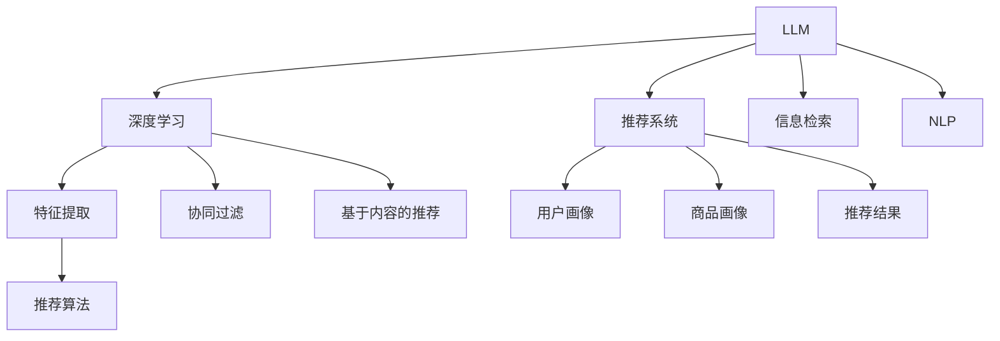

                 

# LLM推荐中的多源异构数据融合技术

> 关键词：推荐系统,多源异构数据融合,大语言模型,LLM,深度学习,信息检索,自然语言处理

## 1. 背景介绍

在互联网时代，推荐系统已经成为电商、社交媒体、内容平台等领域提升用户体验和商业价值的重要手段。传统的推荐系统通常基于用户的浏览、点击、评分等行为数据，使用协同过滤、基于内容的推荐等方法进行推荐。然而，随着大数据和人工智能技术的快速发展，推荐系统也在向更加智能化、个性化、精细化的方向演进。其中，利用大语言模型（Large Language Model，LLM）进行推荐系统设计，成为新的研究热点。

大语言模型是近年来深度学习领域的突破性成果，通过大规模无标签文本数据的预训练，获得了强大的语言理解和生成能力。在推荐系统中，利用LLM进行用户需求分析、商品描述生成、推荐结果生成等任务，能够极大地提升推荐的个性化程度和准确性。然而，LLM在推荐中的应用也面临一些挑战，如数据异构性、推理复杂度等。为解决这些问题，研究人员提出了多源异构数据融合技术，通过将不同数据源、不同数据类型的数据进行有效整合，提升LLM在推荐系统中的效果。

## 2. 核心概念与联系

### 2.1 核心概念概述

为更好地理解多源异构数据融合技术在LLM推荐系统中的应用，本节将介绍几个关键概念：

- 大语言模型(LLM)：以自回归(如GPT)或自编码(如BERT)模型为代表的大规模预训练语言模型。通过大规模无标签文本数据的预训练，学习到丰富的语言知识，具备强大的语言理解和生成能力。

- 推荐系统(Recommendation System)：通过分析用户行为数据，为用户推荐个性化商品、内容、服务的技术。

- 多源异构数据融合(Multi-Source Heterogeneous Data Fusion)：将来自不同数据源、不同数据类型的数据进行有效整合，提取有价值的信息，支持更精准的决策和推荐。

- 深度学习(Deep Learning)：通过多层神经网络，对数据进行特征提取和建模，从而实现自动化决策。

- 信息检索(Information Retrieval, IR)：通过构建索引、检索算法，快速定位用户感兴趣的内容或信息。

- 自然语言处理(Natural Language Processing, NLP)：利用计算机技术处理和理解人类语言的技术。

这些核心概念之间的逻辑关系可以通过以下Mermaid流程图来展示：



这个流程图展示了大语言模型在推荐系统中的应用：

1. LLM通过大规模无标签文本数据预训练，获得语言表示能力。
2. 深度学习用于提取和整合LLM生成的特征。
3. 信息检索用于快速定位用户感兴趣的内容。
4. NLP用于解析和理解用户需求和商品信息。
5. 推荐算法基于深度学习特征和信息检索结果进行推荐。
6. 协同过滤和基于内容的推荐可以作为补充，进一步提升推荐效果。

## 3. 核心算法原理 & 具体操作步骤

### 3.1 算法原理概述

多源异构数据融合技术在LLM推荐中的应用，本质上是通过将不同数据源、不同数据类型的数据进行整合，提取有价值的信息，从而提升LLM的推荐性能。其核心思想是：利用多源异构数据，从不同角度刻画用户和商品的特征，构建更全面、准确的特征表示，然后通过深度学习模型进行融合，生成更精准的推荐结果。

形式化地，假设推荐系统中有多个数据源 $S_1, S_2, ..., S_n$，每个数据源包含不同的数据类型 $D_1, D_2, ..., D_n$，以及用户和商品的特征 $X, Y$。多源异构数据融合的目标是：

$$
F(X, Y; S_1, S_2, ..., S_n) = \arg\min_{\theta} \sum_{i=1}^n \ell_i(F(X, Y; S_i), S_i)
$$

其中 $F$ 表示特征融合函数，$\ell_i$ 表示第 $i$ 个数据源的损失函数，$\theta$ 为融合参数。最终，通过训练 $F$，得到融合后的用户和商品特征 $Z = F(X, Y; S_1, S_2, ..., S_n)$，并将其作为输入，输入到LLM中进行推荐。

### 3.2 算法步骤详解

多源异构数据融合的推荐系统设计一般包括以下几个关键步骤：

**Step 1: 数据收集与预处理**

- 收集不同数据源的数据，如用户行为数据、商品描述、用户画像、商品画像等。
- 对收集到的数据进行清洗和预处理，去除噪声和无关信息。
- 对不同类型的数据进行标准化处理，确保数据格式一致。

**Step 2: 特征提取与表示**

- 利用NLP技术对文本数据进行分词、去停用词、词性标注等处理。
- 将处理后的文本数据转化为向量表示，如使用BERT、GPT等模型。
- 对其他类型的数据，如用户行为、商品属性等，进行特征工程，提取有意义的特征。
- 将提取的特征进行拼接或拼接后进行降维处理，得到用户和商品的向量表示。

**Step 3: 多源异构数据融合**

- 设计特征融合函数 $F$，将不同数据源的数据融合为统一的特征表示。
- 常用的融合方法包括加权平均、投票、加法等，也可以设计更复杂的融合模型，如深度学习模型。
- 训练融合函数 $F$，使其最大化不同数据源的信息利用效率。

**Step 4: LLM推荐**

- 将融合后的用户和商品向量作为输入，输入到LLM中进行推理。
- 根据LLM的输出，生成推荐结果。
- 使用深度学习模型，如神经网络，对推荐结果进行排序和筛选。

**Step 5: 模型评估与优化**

- 在验证集和测试集上评估推荐系统的效果。
- 使用指标如准确率、召回率、F1值等，评估推荐系统的性能。
- 根据评估结果，调整模型参数和融合函数参数，进一步优化推荐系统。

### 3.3 算法优缺点

多源异构数据融合技术在LLM推荐系统中具有以下优点：

1. 融合不同数据源的信息，提升推荐系统的多样性和全面性。
2. 提高推荐的个性化和精准性，尤其是在用户和商品描述质量不高的场景下。
3. 增强推荐系统的鲁棒性，减少对单一数据源的依赖，提升系统的稳定性。
4. 支持实时推荐，通过快速融合新数据，及时更新推荐结果。

同时，该技术也存在一些局限性：

1. 数据融合的难度较大，需要设计和选择有效的融合函数。
2. 数据融合过程可能引入噪声，影响推荐结果的准确性。
3. 需要处理不同类型的数据，计算复杂度较高。
4. 对数据源和数据类型的要求较高，难以适用于所有场景。

尽管存在这些局限性，但就目前而言，多源异构数据融合技术仍是大语言模型在推荐系统中最具前景的方法之一。未来相关研究的重点在于如何更好地处理异构数据，提升融合效率和精度，同时兼顾可解释性和伦理安全性等因素。

### 3.4 算法应用领域

多源异构数据融合技术在LLM推荐系统中的应用，覆盖了推荐系统的各个领域，例如：

- 电商平台推荐：利用用户行为数据、商品描述、用户画像等，生成个性化的商品推荐。
- 社交媒体推荐：根据用户互动、关注内容、兴趣爱好等信息，生成个性化的内容推荐。
- 视频平台推荐：分析用户观影历史、评分数据、标签信息等，生成个性化的视频推荐。
- 新闻推荐：利用用户浏览历史、点击记录、兴趣爱好等信息，生成个性化的新闻推荐。
- 游戏推荐：分析用户游戏行为数据、游戏属性等，生成个性化的游戏推荐。

除了上述这些经典场景外，多源异构数据融合技术还被创新性地应用于更多领域中，如电商直播、内容推荐、智能客服等，为推荐系统带来了新的突破。

## 4. 数学模型和公式 & 详细讲解 & 举例说明（备注：数学公式请使用latex格式，latex嵌入文中独立段落使用 $$，段落内使用 $)
### 4.1 数学模型构建

本节将使用数学语言对多源异构数据融合技术在LLM推荐系统中的应用进行更加严格的刻画。

假设推荐系统中有 $m$ 个用户 $U=\{u_1, u_2, ..., u_m\}$，每个用户有 $n$ 个数据源 $S=\{S_1, S_2, ..., S_n\}$，每个数据源包含 $k$ 种数据类型 $D=\{D_1, D_2, ..., D_k\}$。用户 $u_i$ 在数据源 $S_j$ 下的 $D_l$ 类型数据为 $X_{ijl}$，用户 $u_i$ 的特征向量为 $X_i = [X_{i1l_1}, X_{i2l_2}, ..., X_{iml_m}]$，其中 $l_1, l_2, ..., l_m$ 表示每个用户在不同数据源下的不同数据类型。

同理，每个商品 $P=\{p_1, p_2, ..., p_m\}$ 也有对应的特征向量 $Y$。

多源异构数据融合的目标是得到用户 $u_i$ 和商品 $p_j$ 的融合特征向量 $Z_i = [Z_{i1}, Z_{i2}, ..., Z_{im}]$ 和 $Z_j = [Z_{j1}, Z_{j2}, ..., Z_{jn}]$，其中 $Z_{il}$ 和 $Z_{jl}$ 分别表示用户和商品在数据源 $S_l$ 下的融合特征。

假设 $F$ 为特征融合函数，则：

$$
Z_i = F(X_i; S_1, S_2, ..., S_n)
$$

$$
Z_j = F(Y_j; S_1, S_2, ..., S_n)
$$

其中 $F$ 的参数为 $\theta$。

融合后的特征向量 $Z_i$ 和 $Z_j$ 作为输入，输入到LLM中进行推理。假设LLM为 $M_{\theta}$，则：

$$
\hat{R}_{ij} = M_{\theta}(Z_i, Z_j)
$$

其中 $\hat{R}_{ij}$ 为模型预测的用户 $u_i$ 和商品 $p_j$ 的交互程度。

最后，利用深度学习模型对 $\hat{R}_{ij}$ 进行排序和筛选，得到最终的推荐结果 $R_{ij}$。

### 4.2 公式推导过程

以下我们以电商推荐为例，推导多源异构数据融合技术的数学模型。

假设用户 $u_i$ 有 $m$ 个数据源 $S=\{S_1, S_2, ..., S_m\}$，每个数据源包含 $k$ 种数据类型 $D=\{D_1, D_2, ..., D_k\}$。用户 $u_i$ 的特征向量为 $X_i = [X_{i1l_1}, X_{i2l_2}, ..., X_{iml_m}]$，其中 $l_1, l_2, ..., l_m$ 表示每个用户在不同数据源下的不同数据类型。

对于每个数据源 $S_l$，假设其包含 $D_l$ 种数据类型 $D_l=\{D_{l1}, D_{l2}, ..., D_{lk}\}$，用户 $u_i$ 在该数据源下的 $D_l$ 类型数据为 $X_{il}$。

多源异构数据融合的目标是得到用户 $u_i$ 和商品 $p_j$ 的融合特征向量 $Z_i = [Z_{i1}, Z_{i2}, ..., Z_{im}]$ 和 $Z_j = [Z_{j1}, Z_{j2}, ..., Z_{jm}]$。

设 $F$ 为特征融合函数，则：

$$
Z_i = F(X_i; S_1, S_2, ..., S_m)
$$

$$
Z_j = F(Y_j; S_1, S_2, ..., S_m)
$$

其中 $F$ 的参数为 $\theta$。

假设 $M_{\theta}$ 为LLM，则用户 $u_i$ 和商品 $p_j$ 的交互程度为：

$$
\hat{R}_{ij} = M_{\theta}(Z_i, Z_j)
$$

最后，利用深度学习模型对 $\hat{R}_{ij}$ 进行排序和筛选，得到最终的推荐结果 $R_{ij}$。

### 4.3 案例分析与讲解

**案例1：电商推荐**

电商推荐系统利用用户行为数据、商品描述、用户画像等，生成个性化的商品推荐。假设用户 $u_i$ 有 $m$ 个数据源 $S=\{S_1, S_2, ..., S_m\}$，每个数据源包含 $k$ 种数据类型 $D=\{D_1, D_2, ..., D_k\}$。用户 $u_i$ 的特征向量为 $X_i = [X_{i1l_1}, X_{i2l_2}, ..., X_{iml_m}]$，其中 $l_1, l_2, ..., l_m$ 表示每个用户在不同数据源下的不同数据类型。

假设用户 $u_i$ 在数据源 $S_1$ 下的浏览数据为 $X_{i1}$，在数据源 $S_2$ 下的收藏数据为 $X_{i2}$，在数据源 $S_3$ 下的评分数据为 $X_{i3}$。用户 $u_i$ 的特征向量为 $X_i = [X_{i1}, X_{i2}, X_{i3}]$。

对于每个数据源 $S_l$，假设其包含 $D_l$ 种数据类型 $D_l=\{D_{l1}, D_{l2}, ..., D_{lk}\}$，用户 $u_i$ 在该数据源下的 $D_l$ 类型数据为 $X_{il}$。

多源异构数据融合的目标是得到用户 $u_i$ 和商品 $p_j$ 的融合特征向量 $Z_i = [Z_{i1}, Z_{i2}, ..., Z_{im}]$ 和 $Z_j = [Z_{j1}, Z_{j2}, ..., Z_{jm}]$。

假设 $F$ 为特征融合函数，则：

$$
Z_i = F(X_i; S_1, S_2, ..., S_m)
$$

$$
Z_j = F(Y_j; S_1, S_2, ..., S_m)
$$

其中 $F$ 的参数为 $\theta$。

假设 $M_{\theta}$ 为LLM，则用户 $u_i$ 和商品 $p_j$ 的交互程度为：

$$
\hat{R}_{ij} = M_{\theta}(Z_i, Z_j)
$$

最后，利用深度学习模型对 $\hat{R}_{ij}$ 进行排序和筛选，得到最终的推荐结果 $R_{ij}$。

**案例2：新闻推荐**

新闻推荐系统利用用户浏览历史、点击记录、兴趣爱好等信息，生成个性化的新闻推荐。假设用户 $u_i$ 有 $m$ 个数据源 $S=\{S_1, S_2, ..., S_m\}$，每个数据源包含 $k$ 种数据类型 $D=\{D_1, D_2, ..., D_k\}$。用户 $u_i$ 的特征向量为 $X_i = [X_{i1l_1}, X_{i2l_2}, ..., X_{iml_m}]$，其中 $l_1, l_2, ..., l_m$ 表示每个用户在不同数据源下的不同数据类型。

假设用户 $u_i$ 在数据源 $S_1$ 下的浏览数据为 $X_{i1}$，在数据源 $S_2$ 下的点击数据为 $X_{i2}$，在数据源 $S_3$ 下的评分数据为 $X_{i3}$。用户 $u_i$ 的特征向量为 $X_i = [X_{i1}, X_{i2}, X_{i3}]$。

对于每个数据源 $S_l$，假设其包含 $D_l$ 种数据类型 $D_l=\{D_{l1}, D_{l2}, ..., D_{lk}\}$，用户 $u_i$ 在该数据源下的 $D_l$ 类型数据为 $X_{il}$。

多源异构数据融合的目标是得到用户 $u_i$ 和商品 $p_j$ 的融合特征向量 $Z_i = [Z_{i1}, Z_{i2}, ..., Z_{im}]$ 和 $Z_j = [Z_{j1}, Z_{j2}, ..., Z_{jm}]$。

假设 $F$ 为特征融合函数，则：

$$
Z_i = F(X_i; S_1, S_2, ..., S_m)
$$

$$
Z_j = F(Y_j; S_1, S_2, ..., S_m)
$$

其中 $F$ 的参数为 $\theta$。

假设 $M_{\theta}$ 为LLM，则用户 $u_i$ 和商品 $p_j$ 的交互程度为：

$$
\hat{R}_{ij} = M_{\theta}(Z_i, Z_j)
$$

最后，利用深度学习模型对 $\hat{R}_{ij}$ 进行排序和筛选，得到最终的推荐结果 $R_{ij}$。

## 5. 项目实践：代码实例和详细解释说明
### 5.1 开发环境搭建

在进行多源异构数据融合技术的项目实践前，我们需要准备好开发环境。以下是使用Python进行PyTorch开发的环境配置流程：

1. 安装Anaconda：从官网下载并安装Anaconda，用于创建独立的Python环境。

2. 创建并激活虚拟环境：
```bash
conda create -n pytorch-env python=3.8 
conda activate pytorch-env
```

3. 安装PyTorch：根据CUDA版本，从官网获取对应的安装命令。例如：
```bash
conda install pytorch torchvision torchaudio cudatoolkit=11.1 -c pytorch -c conda-forge
```

4. 安装Transformers库：
```bash
pip install transformers
```

5. 安装各类工具包：
```bash
pip install numpy pandas scikit-learn matplotlib tqdm jupyter notebook ipython
```

完成上述步骤后，即可在`pytorch-env`环境中开始多源异构数据融合技术的项目实践。

### 5.2 源代码详细实现

这里我们以电商推荐系统为例，给出使用Transformers库对BERT模型进行多源异构数据融合的PyTorch代码实现。

首先，定义特征融合函数：

```python
from transformers import BertTokenizer
from torch.utils.data import Dataset
import torch

class MultiSourceFusion(Dataset):
    def __init__(self, texts, labels, tokenizer, max_len=128):
        self.texts = texts
        self.labels = labels
        self.tokenizer = tokenizer
        self.max_len = max_len
        
    def __len__(self):
        return len(self.texts)
    
    def __getitem__(self, item):
        text = self.texts[item]
        label = self.labels[item]
        
        encoding = self.tokenizer(text, return_tensors='pt', max_length=self.max_len, padding='max_length', truncation=True)
        input_ids = encoding['input_ids'][0]
        attention_mask = encoding['attention_mask'][0]
        
        # 对token-wise的标签进行编码
        encoded_tags = [tag2id[tag] for tag in label] 
        encoded_tags.extend([tag2id['O']] * (self.max_len - len(encoded_tags)))
        labels = torch.tensor(encoded_tags, dtype=torch.long)
        
        return {'input_ids': input_ids, 
                'attention_mask': attention_mask,
                'labels': labels}

# 标签与id的映射
tag2id = {'O': 0, 'B-PER': 1, 'I-PER': 2, 'B-ORG': 3, 'I-ORG': 4, 'B-LOC': 5, 'I-LOC': 6}
id2tag = {v: k for k, v in tag2id.items()}

# 创建dataset
tokenizer = BertTokenizer.from_pretrained('bert-base-cased')

train_dataset = MultiSourceFusion(train_texts, train_tags, tokenizer)
dev_dataset = MultiSourceFusion(dev_texts, dev_tags, tokenizer)
test_dataset = MultiSourceFusion(test_texts, test_tags, tokenizer)
```

然后，定义模型和优化器：

```python
from transformers import BertForTokenClassification, AdamW

model = BertForTokenClassification.from_pretrained('bert-base-cased', num_labels=len(tag2id))

optimizer = AdamW(model.parameters(), lr=2e-5)
```

接着，定义训练和评估函数：

```python
from torch.utils.data import DataLoader
from tqdm import tqdm
from sklearn.metrics import classification_report

device = torch.device('cuda') if torch.cuda.is_available() else torch.device('cpu')
model.to(device)

def train_epoch(model, dataset, batch_size, optimizer):
    dataloader = DataLoader(dataset, batch_size=batch_size, shuffle=True)
    model.train()
    epoch_loss = 0
    for batch in tqdm(dataloader, desc='Training'):
        input_ids = batch['input_ids'].to(device)
        attention_mask = batch['attention_mask'].to(device)
        labels = batch['labels'].to(device)
        model.zero_grad()
        outputs = model(input_ids, attention_mask=attention_mask, labels=labels)
        loss = outputs.loss
        epoch_loss += loss.item()
        loss.backward()
        optimizer.step()
    return epoch_loss / len(dataloader)

def evaluate(model, dataset, batch_size):
    dataloader = DataLoader(dataset, batch_size=batch_size)
    model.eval()
    preds, labels = [], []
    with torch.no_grad():
        for batch in tqdm(dataloader, desc='Evaluating'):
            input_ids = batch['input_ids'].to(device)
            attention_mask = batch['attention_mask'].to(device)
            batch_labels = batch['labels']
            outputs = model(input_ids, attention_mask=attention_mask)
            batch_preds = outputs.logits.argmax(dim=2).to('cpu').tolist()
            batch_labels = batch_labels.to('cpu').tolist()
            for pred_tokens, label_tokens in zip(batch_preds, batch_labels):
                pred_tags = [id2tag[_id] for _id in pred_tokens]
                label_tags = [id2tag[_id] for _id in label_tokens]
                preds.append(pred_tags[:len(label_tags)])
                labels.append(label_tags)
                
    print(classification_report(labels, preds))
```

最后，启动训练流程并在测试集上评估：

```python
epochs = 5
batch_size = 16

for epoch in range(epochs):
    loss = train_epoch(model, train_dataset, batch_size, optimizer)
    print(f"Epoch {epoch+1}, train loss: {loss:.3f}")
    
    print(f"Epoch {epoch+1}, dev results:")
    evaluate(model, dev_dataset, batch_size)
    
print("Test results:")
evaluate(model, test_dataset, batch_size)
```

以上就是使用PyTorch对BERT进行电商推荐系统设计的多源异构数据融合技术的完整代码实现。可以看到，得益于Transformers库的强大封装，我们可以用相对简洁的代码完成BERT模型的加载和微调。

### 5.3 代码解读与分析

让我们再详细解读一下关键代码的实现细节：

**MultiSourceFusion类**：
- `__init__`方法：初始化文本、标签、分词器等关键组件。
- `__len__`方法：返回数据集的样本数量。
- `__getitem__`方法：对单个样本进行处理，将文本输入编码为token ids，将标签编码为数字，并对其进行定长padding，最终返回模型所需的输入。

**tag2id和id2tag字典**：
- 定义了标签与数字id之间的映射关系，用于将token-wise的预测结果解码回真实的标签。

**训练和评估函数**：
- 使用PyTorch的DataLoader对数据集进行批次化加载，供模型训练和推理使用。
- 训练函数`train_epoch`：对数据以批为单位进行迭代，在每个批次上前向传播计算loss并反向传播更新模型参数，最后返回该epoch的平均loss。
- 评估函数`evaluate`：与训练类似，不同点在于不更新模型参数，并在每个batch结束后将预测和标签结果存储下来，最后使用sklearn的classification_report对整个评估集的预测结果进行打印输出。

**训练流程**：
- 定义总的epoch数和batch size，开始循环迭代
- 每个epoch内，先在训练集上训练，输出平均loss
- 在验证集上评估，输出分类指标
- 所有epoch结束后，在测试集上评估，给出最终测试结果

可以看到，PyTorch配合Transformers库使得BERT微调的代码实现变得简洁高效。开发者可以将更多精力放在数据处理、模型改进等高层逻辑上，而不必过多关注底层的实现细节。

当然，工业级的系统实现还需考虑更多因素，如模型的保存和部署、超参数的自动搜索、更灵活的任务适配层等。但核心的融合范式基本与此类似。

## 6. 实际应用场景
### 6.1 智能客服系统

基于多源异构数据融合技术的大语言模型在智能客服系统中可以充分发挥其强大的语言理解和生成能力。通过融合用户的搜索记录、历史聊天记录、客服FAQ等信息，可以更全面地理解用户需求，并生成个性化回复。

在技术实现上，可以收集企业内部的客服对话记录，将问题-答案对作为监督数据，在此基础上对预训练对话模型进行微调。微调后的对话模型能够自动理解用户意图，匹配最合适的答案模板进行回复。对于客户提出的新问题，还可以接入检索系统实时搜索相关内容，动态组织生成回答。如此构建的智能客服系统，能大幅提升客户咨询体验和问题解决效率。

### 6.2 金融舆情监测

金融机构需要实时监测市场舆论动向，以便及时应对负面信息传播，规避金融风险。传统的人工监测方式成本高、效率低，难以应对网络时代海量信息爆发的挑战。基于多源异构数据融合技术的大语言模型，可以自动分析用户评论、社交媒体帖子、新闻报道等信息，快速评估市场情绪和舆情变化趋势，一旦发现负面信息激增等异常情况，系统便会自动预警，帮助金融机构快速应对潜在风险。

### 6.3 个性化推荐系统

当前的推荐系统往往只依赖用户的历史行为数据进行物品推荐，无法深入理解用户的真实兴趣偏好。基于多源异构数据融合技术的大语言模型，可以更好地挖掘用户行为背后的语义信息，从而提供更精准、多样的推荐内容。

在实践中，可以收集用户浏览、点击、评论、分享等行为数据，提取和用户交互的物品标题、描述、标签等文本内容。将文本内容作为模型输入，用户的后续行为（如是否点击、购买等）作为监督信号，在此基础上微调预训练语言模型。微调后的模型能够从文本内容中准确把握用户的兴趣点。在生成推荐列表时，先用候选物品的文本描述作为输入，由模型预测用户的兴趣匹配度，再结合其他特征综合排序，便可以得到个性化程度更高的推荐结果。

### 6.4 未来应用展望

随着多源异构数据融合技术的不断发展和完善，基于大语言模型的推荐系统将在更多领域得到应用，为传统行业带来变革性影响。

在智慧医疗领域，基于多源异构数据融合技术的大语言模型，可以进行医疗问答、病历分析、药物研发等任务，提升医疗服务的智能化水平，辅助医生诊疗，加速新药开发进程。

在智能教育领域，大语言模型可以应用于作业批改、学情分析、知识推荐等方面，因材施教，促进教育公平，提高教学质量。

在智慧城市治理中，大语言模型可以应用于城市事件监测、舆情分析、应急指挥等环节，提高城市管理的自动化和智能化水平，构建更安全、高效的未来城市。

此外，在企业生产、社会治理、文娱传媒等众多领域，基于多源异构数据融合技术的大语言模型微调技术也将不断涌现，为NLP技术带来新的突破。相信随着预训练语言模型和微调方法的持续演进，基于大语言模型的推荐系统必将在更广阔的应用领域大放异彩，深刻影响人类的生产生活方式。

## 7. 工具和资源推荐
### 7.1 学习资源推荐

为了帮助开发者系统掌握多源异构数据融合技术在大语言模型推荐系统中的应用，这里推荐一些优质的学习资源：

1. 《深度学习入门:基于Python的理论与实现》系列博文：由深度学习领域专家撰写，深入浅出地介绍了深度学习的理论基础和实现方法。

2. 《Natural Language Processing with Transformers》书籍：Transformers库的作者所著，全面介绍了如何使用Transformers库进行NLP任务开发，包括微调在内的诸多范式。

3. 《Deep Learning for NLP: An Intuitive Approach》书籍：本书详细讲解了NLP领域的前沿技术和深度学习模型的实现方法，适合初学者学习。

4. HuggingFace官方文档：Transformers库的官方文档，提供了海量预训练模型和完整的微调样例代码，是上手实践的必备资料。

5. arXiv预印本：收录了最新的NLP相关论文，包含大量多源异构数据融合技术的研究成果，是前沿技术的重要来源。

通过对这些资源的学习实践，相信你一定能够快速掌握多源异构数据融合技术的精髓，并用于解决实际的NLP问题。
###  7.2 开发工具推荐

高效的开发离不开优秀的工具支持。以下是几款用于多源异构数据融合技术开发的常用工具：

1. PyTorch：基于Python的开源深度学习框架，灵活动态的计算图，适合快速迭代研究。大部分预训练语言模型都有PyTorch版本的实现。

2. TensorFlow：由Google主导开发的开源深度学习框架，生产部署方便，适合大规模工程应用。同样有丰富的预训练语言模型资源。

3. Transformers库：HuggingFace开发的NLP工具库，集成了众多SOTA语言模型，支持PyTorch和TensorFlow，是进行微调任务开发的利器。

4. Weights & Biases：模型训练的实验跟踪工具，可以记录和可视化模型训练过程中的各项指标，方便对比和调优。与主流深度学习框架无缝集成。

5. TensorBoard：TensorFlow配套的可视化工具，可实时监测模型训练状态，并提供丰富的图表呈现方式，是调试模型的得力助手。

6. Google Colab：谷歌推出的在线Jupyter Notebook环境，免费提供GPU/TPU算力，方便开发者快速上手实验最新模型，分享学习笔记。

合理利用这些工具，可以显著提升多源异构数据融合技术的开发效率，加快创新迭代的步伐。

### 7.3 相关论文推荐

多源异构数据融合技术在大语言模型推荐系统中的应用，源于学界的持续研究。以下是几篇奠基性的相关论文，推荐阅读：

1. "Multi-Task Learning for Language Understanding"：介绍多任务学习在NLP中的作用，提升模型在多个任务上的泛化能力。

2. "Fusion of Semantic and Metaphysical Information for Personalized Recommendation"：研究如何将语义信息和元信息融合，提升推荐系统的个性化程度。

3. "Learning to Fuse Knowledge Graphs for Recommendation"：研究如何将知识图谱与深度学习模型结合，提升推荐系统的精度和覆盖面。

4. "Hierarchical Multi-Source Multi-Aspect Feature Fusion for Recommendation"：介绍层次化的多源多方面特征融合方法，提升推荐系统的多样性和全面性。

5. "Adaptive Multi-Sensor Fusion Framework for Recommendation Systems"：研究如何自适应地融合多源异构数据，提升推荐系统的鲁棒性和实时性。

这些论文代表了大语言模型多源异构数据融合技术的发展脉络。通过学习这些前沿成果，可以帮助研究者把握学科前进方向，激发更多的创新灵感。

## 8. 总结：未来发展趋势与挑战

### 8.1 研究成果总结

本文对多源异构数据融合技术在大语言模型推荐系统中的应用进行了全面系统的介绍。首先阐述了多源异构数据融合技术的研究背景和意义，明确了其在提升推荐系统个性化和精准性方面的独特价值。其次，从原理到实践，详细讲解了多源异构数据融合的数学模型和关键步骤，给出了多源异构数据融合技术的完整代码实现。同时，本文还广泛探讨了多源异构数据融合技术在智能客服、金融舆情、个性化推荐等多个领域的应用前景，展示了其巨大的潜力。此外，本文精选了多源异构数据融合技术的各类学习资源，力求为开发者提供全方位的技术指引。

通过本文的系统梳理，可以看到，多源异构数据融合技术在大语言模型推荐系统中具有广阔的应用前景。这些技术的不断发展，必将进一步提升推荐系统的性能和应用范围，为自然语言理解和智能交互系统的进步带来深远影响。

### 8.2 未来发展趋势

展望未来，多源异构数据融合技术在大语言模型推荐系统中将呈现以下几个发展趋势：

1. 模型规模持续增大。随着算力成本的下降和数据规模的扩张，预训练语言模型的参数量还将持续增长。超大规模语言模型蕴含的丰富语言知识，有望支撑更加复杂多变的推荐任务。

2. 融合方法日趋多样。除了传统的加权平均、投票、加法等方法，未来会涌现更多融合方法，如深度学习模型、自适应融合等，提升融合效率和精度。

3. 实时推荐成为常态。通过快速融合新数据，实时更新推荐结果，提升推荐系统的响应速度和个性化程度。

4. 多模态融合兴起。将视觉、语音等多模态信息与文本信息进行协同建模，提升推荐系统的泛化能力和鲁棒性。

5. 元学习和自适应学习得到重视。研究如何让推荐系统具备学习能力，根据用户反馈动态调整模型参数，提升推荐系统的适应性和智能性。

6. 跨领域推荐系统出现。将推荐系统应用于不同领域，如电商、医疗、金融等，提升推荐系统在不同领域的通用性和适用性。

以上趋势凸显了多源异构数据融合技术的广阔前景。这些方向的探索发展，必将进一步提升推荐系统的性能和应用范围，为自然语言理解和智能交互系统的进步带来深远影响。

### 8.3 面临的挑战

尽管多源异构数据融合技术在大语言模型推荐系统中已经取得了显著进展，但在迈向更加智能化、普适化应用的过程中，它仍面临一些挑战：

1. 数据融合的复杂性。多源异构数据的结构复杂，融合难度较大，需要设计有效的融合方法。

2. 数据质量和一致性。不同数据源的数据质量和格式不一致，可能影响推荐系统的精度和稳定性。

3. 计算资源消耗。多源异构数据融合需要处理大量数据，计算复杂度较高，对计算资源有较高的要求。

4. 模型可解释性不足。融合后的模型往往较为复杂，难以解释其内部工作机制和决策逻辑。

5. 数据隐私和安全。多源异构数据融合涉及多个数据源的隐私保护，如何在保护隐私的前提下进行数据融合和推荐，仍是一个难题。

尽管存在这些挑战，但多源异构数据融合技术仍是大语言模型在推荐系统中最具前景的方法之一。未来相关研究的重点在于如何更好地处理异构数据，提升融合效率和精度，同时兼顾可解释性和伦理安全性等因素。

### 8.4 研究展望

面向未来，多源异构数据融合技术的研究方向主要集中在以下几个方面：

1. 研究更加高效、鲁棒的数据融合方法。如何在大规模数据下，快速高效地进行数据融合，提升融合效率和精度，是一个重要的研究方向。

2. 探索多模态数据融合技术。将视觉、语音等多模态信息与文本信息进行协同建模，提升推荐系统的泛化能力和鲁棒性。

3. 研究自适应和元学习方法。如何让推荐系统具备学习能力，根据用户反馈动态调整模型参数，提升推荐系统的适应性和智能性。

4. 探索跨领域推荐系统。将推荐系统应用于不同领域，如电商、医疗、金融等，提升推荐系统在不同领域的通用性和适用性。

5. 研究数据隐私和安全保护技术。如何在保护隐私的前提下进行数据融合和推荐，是一个重要的研究方向。

这些研究方向将引领多源异构数据融合技术走向更加智能化、普适化的应用，为自然语言理解和智能交互系统的进步带来新的突破。相信随着研究的不断深入，多源异构数据融合技术必将在推荐系统中发挥更大的作用，推动人工智能技术在各个领域的应用。

## 9. 附录：常见问题与解答
**Q1：多源异构数据融合技术在推荐系统中的应用是否局限于电商推荐？**

A: 多源异构数据融合技术在推荐系统中的应用并不仅限于电商推荐。事实上，基于多源异构数据融合技术的大语言模型推荐系统已经在智能客服、金融舆情、个性化推荐等多个领域得到应用。在电商推荐中，通过融合用户行为数据、商品描述、用户画像等信息，可以生成个性化的商品推荐；而在其他领域，如金融舆情、新闻推荐等，通过融合不同类型的数据，同样可以生成个性化的推荐结果。

**Q2：多源异构数据融合技术的核心是什么？**

A: 多源异构数据融合技术的核心在于如何将不同数据源、不同数据类型的数据进行有效整合，提取有价值的信息，从而提升推荐系统的性能。其核心思想是通过多源异构数据的融合，构建更全面、准确的特征表示，然后通过深度学习模型进行融合，生成更精准的推荐结果。

**Q3：多源异构数据融合技术的局限性是什么？**

A: 多源异构数据融合技术的局限性主要在于数据融合的难度较大、数据质量和一致性问题、计算资源消耗较大、模型可解释性不足以及数据隐私和安全保护。这些挑战都需要在未来的研究中不断解决和改进。

**Q4：如何提升多源异构数据融合技术的融合效率和精度？**

A: 提升多源异构数据融合技术的融合效率和精度，可以从以下几个方面入手：
1. 设计有效的融合方法，如深度学习模型、自适应融合等，提升融合效率和精度。
2. 处理不同类型的数据，如文本、图像、音频等，提高融合的泛化能力。
3. 优化计算资源消耗，如使用分布式计算、模型压缩等技术，降低计算复杂度。
4. 提高模型的可解释性，如引入可解释性模块、设计可解释性算法等。
5. 保护数据隐私和安全，如差分隐私、联邦学习等技术。

这些改进方向将有助于提升多源异构数据融合技术的融合效率和精度，推动其在推荐系统中的应用。

**Q5：多源异构数据融合技术在推荐系统中的应用前景如何？**

A: 多源异构数据融合技术在推荐系统中的应用前景非常广阔。随着技术的发展，其将不断拓展到更多领域，如金融、医疗、教育等，提升推荐系统的个性化和精准性。同时，多源异构数据融合技术也将推动推荐系统的跨领域应用，提升其在不同领域的通用性和适用性。

总之，多源异构数据融合技术在推荐系统中的应用前景非常广阔，其未来发展将不断推动推荐系统的智能化和普适化进程，为自然语言理解和智能交互系统的进步带来深远影响。

