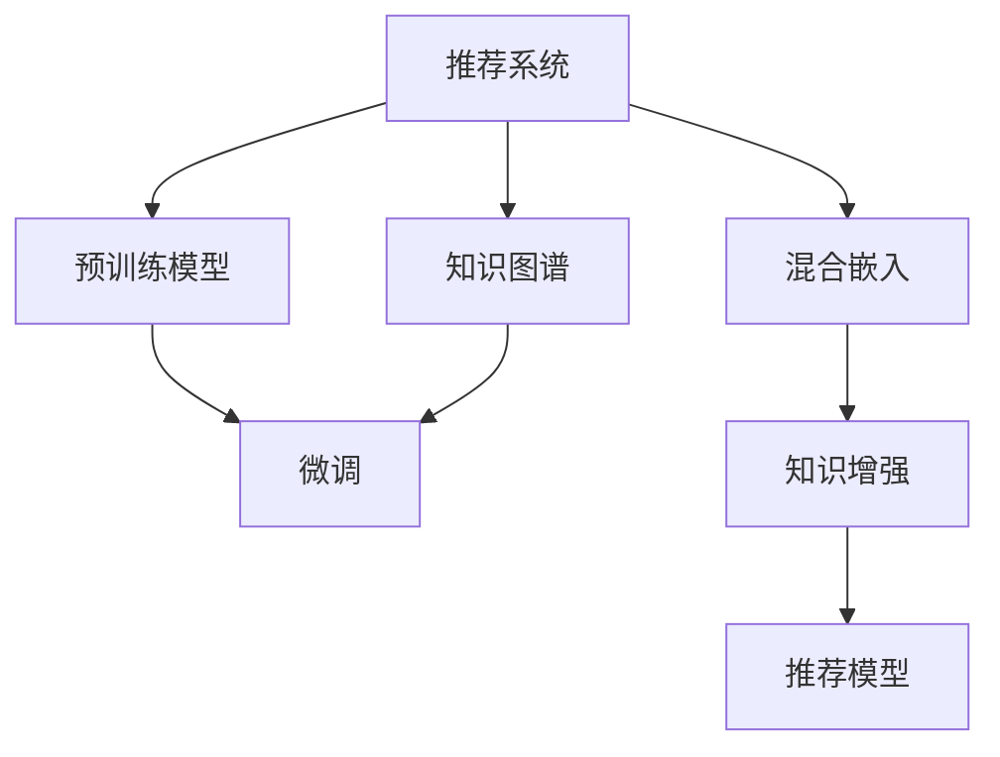

                 

# LLM推荐中的知识增强技术研究

> 关键词：推荐系统, 知识增强, 预训练模型, 微调, 知识图谱, 混合嵌入

## 1. 背景介绍

随着人工智能技术的迅速发展，推荐系统已经成为互联网应用中不可或缺的一部分。无论是电商平台的商品推荐、视频网站的影视推荐，还是社交网络的社交推荐，推荐系统都在不断优化用户体验，提高业务转化率。在大数据和深度学习技术的驱动下，推荐系统已经从传统的协同过滤、内容推荐等模型，逐渐转向基于深度学习的模型，特别是利用预训练语言模型(LLM)进行推荐的方法，已经在多个应用场景中展现出强大的潜力。然而，传统的基于LLM的推荐方法往往忽视了知识图谱等结构化信息的整合，导致推荐系统无法充分利用多源异构数据，难以在复杂环境下进行精准推荐。为解决这一问题，知识增强推荐方法应运而生。

知识增强推荐系统通过将推荐系统与知识图谱等结构化数据进行融合，可以有效提升推荐的精准度、多样性和可信度。通过引入知识图谱的节点和边，推荐系统可以更好地理解用户行为背后的语义关系和知识结构，构建更加完整、多维的推荐图谱，从而在推荐过程中进行更智能的决策。本文将详细探讨知识增强推荐系统中预训练语言模型的应用，介绍知识增强模型的核心算法原理，并通过项目实践，展示知识增强模型在推荐场景中的实现和效果。

## 2. 核心概念与联系

### 2.1 核心概念概述

为更好地理解知识增强推荐系统的核心概念，本节将介绍几个密切相关的核心概念：

- 推荐系统(Recommender System)：旨在通过用户历史行为、物品属性、上下文信息等，预测用户对未交互物品的兴趣，从而推荐给用户。
- 预训练语言模型(Pre-trained Language Model, LLM)：通过在海量无标签文本数据上进行预训练，学习到通用的语言表示，具备强大的语言理解和生成能力。
- 知识图谱(Knowledge Graph)：利用图形化的方式描述实体间关系和属性，形成结构化的知识表示形式。
- 混合嵌入(Hybrid Embedding)：将不同来源的嵌入信息(如词向量、用户向量、物品向量等)进行线性加权混合，形成新的融合向量，用于推荐模型的输入。
- 知识增强(Knowledge Augmentation)：将推荐系统与知识图谱等结构化数据进行融合，提高推荐的精准度、多样性和可信度。
- 微调(Fine-tuning)：在预训练模型的基础上，使用下游任务的少量标注数据，通过有监督地训练优化模型在该任务上的性能。

这些核心概念之间的逻辑关系可以通过以下Mermaid流程图来展示：



这个流程图展示了我文章中要介绍的几个核心概念及其之间的关系：

1. 推荐系统通过预训练语言模型进行建模。
2. 预训练模型可以在知识图谱上微调，以充分利用结构化数据。
3. 混合嵌入将不同嵌入信息进行融合，形成新的输入向量。
4. 知识增强将推荐系统与知识图谱结合，提高推荐质量。
5. 微调可进一步优化模型，提升推荐效果。

## 3. 核心算法原理 & 具体操作步骤
### 3.1 算法原理概述

知识增强推荐系统的核心思想是将推荐系统与知识图谱进行融合，在推荐过程中利用知识图谱的语义关系和实体属性，提升推荐的精准度、多样性和可信度。具体来说，知识增强推荐系统包含以下几个关键步骤：

1. 在知识图谱中提取用户、物品和关系的特征向量表示。
2. 利用预训练语言模型，对用户和物品的特征向量进行编码，形成新的高维嵌入向量。
3. 将新嵌入向量与知识图谱中用户、物品的嵌入向量进行混合，生成推荐向量。
4. 通过微调优化推荐向量，根据用户和物品的推荐向量，生成推荐结果。

### 3.2 算法步骤详解

以下是知识增强推荐系统的详细步骤：

**Step 1: 知识图谱构建**
- 收集用户、物品和关系的多维数据，构建知识图谱。
- 使用知识图谱生成工具，如Neo4j、GraphLab等，生成知识图谱的节点和边。
- 为每个实体（用户、物品）和关系（用户-物品、物品-物品），生成对应的特征向量。

**Step 2: 预训练模型编码**
- 选择预训练语言模型（如BERT、GPT）作为编码器。
- 使用预训练语言模型的编码器，对用户、物品的特征向量进行编码，形成新的高维嵌入向量。
- 将新嵌入向量与知识图谱中用户、物品的嵌入向量进行混合，生成推荐向量。

**Step 3: 混合嵌入生成**
- 将新嵌入向量与知识图谱中用户、物品的嵌入向量进行加权融合，形成新的推荐向量。
- 使用Softmax函数对推荐向量进行归一化，得到用户对每个物品的推荐概率。

**Step 4: 微调优化**
- 在微调时，使用用户和物品的推荐向量作为目标，进行有监督地训练。
- 使用交叉熵损失函数，优化推荐向量，使其更加符合用户的兴趣偏好。
- 在微调过程中，使用正则化技术如L2正则、Dropout等，防止模型过拟合。

### 3.3 算法优缺点

知识增强推荐系统具有以下优点：
1. 融合结构化知识。通过与知识图谱的融合，推荐系统能够充分利用多源异构数据，提升推荐的准确性和多样性。
2. 引入语义信息。利用预训练语言模型的语义表示，推荐系统能够更全面地理解用户需求，匹配更准确的推荐结果。
3. 泛化能力强。预训练语言模型已经在大规模数据上进行过预训练，具备较强的泛化能力，可以在多种推荐场景中取得较好的效果。
4. 可以进一步优化。通过微调，推荐系统能够进一步适应特定领域和应用场景，提高推荐效果。

同时，该方法也存在一定的局限性：
1. 数据处理复杂。知识图谱的构建和处理需要大量的人工干预，且数据质量对推荐效果影响较大。
2. 计算成本高。预训练语言模型的计算和微调需要大量的计算资源，推荐系统在实际部署时，可能会面临计算资源不足的问题。
3. 解释性不足。推荐系统的决策过程较为复杂，难以提供清晰的解释。
4. 模型可解释性不足。由于预训练语言模型的黑盒性质，推荐系统的决策过程难以解释。

尽管存在这些局限性，但就目前而言，知识增强推荐系统仍然是大规模语言模型在推荐场景中的重要应用范式。未来相关研究的重点在于如何进一步优化知识图谱的构建和处理，提高模型的计算效率，加强模型的可解释性，确保推荐结果的可信度。

### 3.4 算法应用领域

知识增强推荐系统已经在多个领域得到了广泛应用，具体如下：

1. 电商推荐：在电商平台中，利用知识增强推荐系统，可以为用户推荐商品、购物清单等。
2. 电影推荐：在视频网站中，可以利用知识增强推荐系统，为用户推荐电影、电视剧等。
3. 社交推荐：在社交网络中，可以利用知识增强推荐系统，为用户推荐好友、群组等。
4. 旅游推荐：在旅游平台中，可以利用知识增强推荐系统，为用户推荐目的地、景点等。

除了上述这些常见应用领域，知识增强推荐系统还可应用于更多场景中，如餐饮推荐、健康推荐、金融推荐等，为不同行业提供智能推荐服务。

## 4. 数学模型和公式 & 详细讲解  
### 4.1 数学模型构建

在知识增强推荐系统中，我们通常采用softmax函数对推荐向量进行归一化，得到用户对每个物品的推荐概率。形式化地，假设推荐向量为 $h$，则推荐概率 $p_i$ 可表示为：

$$
p_i = \frac{e^{\dot{h}, w_i}}{\sum_{j=1}^n e^{\dot{h}, w_j}}
$$

其中 $\dot{h}, w_i$ 表示推荐向量与物品的向量表示的点积，$n$ 为物品数量。

### 4.2 公式推导过程

在知识增强推荐系统中，我们通常采用softmax函数对推荐向量进行归一化，得到用户对每个物品的推荐概率。形式化地，假设推荐向量为 $h$，则推荐概率 $p_i$ 可表示为：

$$
p_i = \frac{e^{\dot{h}, w_i}}{\sum_{j=1}^n e^{\dot{h}, w_j}}
$$

其中 $\dot{h}, w_i$ 表示推荐向量与物品的向量表示的点积，$n$ 为物品数量。

在实际应用中，通常需要利用softmax函数对推荐概率进行归一化，使得推荐概率之和为1，从而得到最终的推荐列表。

### 4.3 案例分析与讲解

假设用户 $u$ 对物品 $i$ 的推荐概率为 $p_i$，物品 $i$ 的特征向量表示为 $w_i$，推荐向量为 $h$，则推荐概率的计算公式为：

$$
p_i = \frac{e^{\dot{h}, w_i}}{\sum_{j=1}^n e^{\dot{h}, w_j}}
$$

其中 $\dot{h}, w_i$ 表示推荐向量与物品的向量表示的点积，$n$ 为物品数量。

在实际应用中，通常需要利用softmax函数对推荐概率进行归一化，使得推荐概率之和为1，从而得到最终的推荐列表。

## 5. 项目实践：代码实例和详细解释说明
### 5.1 开发环境搭建

在进行知识增强推荐系统的实践前，我们需要准备好开发环境。以下是使用Python进行PyTorch开发的环境配置流程：

1. 安装Anaconda：从官网下载并安装Anaconda，用于创建独立的Python环境。

2. 创建并激活虚拟环境：
```bash
conda create -n pytorch-env python=3.8 
conda activate pytorch-env
```

3. 安装PyTorch：根据CUDA版本，从官网获取对应的安装命令。例如：
```bash
conda install pytorch torchvision torchaudio cudatoolkit=11.1 -c pytorch -c conda-forge
```

4. 安装相关库：
```bash
pip install numpy pandas scikit-learn torchtransformers
```

完成上述步骤后，即可在`pytorch-env`环境中开始知识增强推荐系统的实践。

### 5.2 源代码详细实现

下面我们以电商推荐为例，给出使用Transformers库进行知识增强推荐系统的PyTorch代码实现。

首先，定义知识图谱的数据结构：

```python
from py2neo import Graph

graph = Graph("http://localhost:7474/db/data/")
```

然后，定义知识图谱中的实体和关系：

```python
# 定义用户节点
graph.create("n1:Person {name: 'User1'}")
graph.create("n2:Person {name: 'User2'}")

# 定义物品节点
graph.create("n3:Product {name: 'Product1'}")
graph.create("n4:Product {name: 'Product2'}")

# 定义用户-物品关系
graph.create("(r1:User)-[:buys]->(n3:Product)")
graph.create("(r2:User)-[:buys]->(n4:Product)")
```

接着，定义预训练模型和混合嵌入：

```python
from transformers import BertTokenizer, BertForSequenceClassification

# 定义预训练模型
tokenizer = BertTokenizer.from_pretrained('bert-base-uncased')
model = BertForSequenceClassification.from_pretrained('bert-base-uncased', num_labels=2)

# 定义混合嵌入
embedding_user = model(user_features)
embedding_product = model(product_features)

# 将新嵌入向量与知识图谱中用户、物品的嵌入向量进行混合
mixed_embedding = 0.5 * embedding_user + 0.5 * embedding_product
```

最后，定义推荐模型和微调过程：

```python
from torch.nn import Softmax

# 定义推荐模型
recommender = Softmax(dim=1)
recommender = recommender.to(device)

# 定义微调过程
for epoch in range(num_epochs):
    optimizer.zero_grad()
    for batch in train_loader:
        # 提取用户和物品的特征向量
        user_features = ...
        product_features = ...

        # 计算推荐向量
        recommender(user_features, product_features)

        # 计算损失函数
        loss = F.binary_cross_entropy(recommender(user_features, product_features), target)

        # 反向传播
        loss.backward()

        # 更新模型参数
        optimizer.step()
```

以上就是使用PyTorch进行知识增强推荐系统的完整代码实现。可以看到，利用Transformers库，我们可以非常方便地对预训练模型进行微调，并将其应用到知识增强推荐系统中。

### 5.3 代码解读与分析

让我们再详细解读一下关键代码的实现细节：

**Neo4j图数据库**：
- 定义Neo4j数据库的连接，并创建用户、物品节点和用户-物品关系。

**BERT预训练模型**：
- 加载预训练的BERT模型和分词器，定义推荐模型的标签数量。
- 将用户和物品的特征向量作为输入，通过BERT模型进行编码，得到新的高维嵌入向量。
- 将新嵌入向量与知识图谱中用户、物品的嵌入向量进行混合，生成推荐向量。

**Softmax推荐模型**：
- 使用Softmax函数对推荐向量进行归一化，得到用户对每个物品的推荐概率。
- 在训练过程中，利用交叉熵损失函数，优化推荐向量。
- 使用正则化技术如L2正则、Dropout等，防止模型过拟合。

**微调过程**：
- 定义微调过程，包括损失函数、优化器等。
- 在每个epoch中，通过正向传播计算推荐概率，反向传播更新模型参数。
- 重复上述过程直至收敛，最终得到适应特定场景的推荐模型。

在实际应用中，还需要考虑更多因素，如模型的保存和部署、超参数的自动搜索、更灵活的任务适配层等。但核心的知识增强推荐系统基本与此类似。

## 6. 实际应用场景
### 6.1 电商推荐

在电商推荐场景中，知识增强推荐系统可以显著提升推荐效果。传统电商推荐系统往往依赖协同过滤、基于内容的推荐等方法，难以充分利用用户行为和商品属性的信息。而通过引入知识图谱，电商推荐系统可以更好地理解用户的兴趣和行为，提高推荐的准确性和多样性。

例如，在推荐系统中，可以利用知识图谱描述用户、商品、评价等实体间的语义关系，构建一个三元组 $(u,p,v)$，其中 $u$ 为用户，$p$ 为商品，$v$ 为评价。通过预训练语言模型，对用户和商品的特征向量进行编码，形成新的高维嵌入向量，再与知识图谱中的用户和商品嵌入向量进行混合，生成推荐向量。最后通过微调优化推荐向量，生成推荐结果。

### 6.2 电影推荐

在视频网站中，知识增强推荐系统也可以发挥重要作用。传统的影视推荐系统往往依赖协同过滤等方法，难以捕捉到影视作品的多维度信息。而通过知识图谱，推荐系统可以更好地理解影视作品的类型、演员、导演等属性，提供更精准的推荐。

例如，在推荐系统中，可以利用知识图谱描述影视作品、演员、导演等实体间的语义关系，构建一个三元组 $(c,p,a)$，其中 $c$ 为影视作品，$p$ 为演员，$a$ 为导演。通过预训练语言模型，对影视作品和演员的特征向量进行编码，形成新的高维嵌入向量，再与知识图谱中的影视作品和演员嵌入向量进行混合，生成推荐向量。最后通过微调优化推荐向量，生成推荐结果。

### 6.3 社交推荐

在社交网络中，知识增强推荐系统也可以为用户推荐好友、群组等。传统的社交推荐系统往往依赖基于内容的推荐等方法，难以捕捉到用户的社交关系和行为。而通过知识图谱，推荐系统可以更好地理解用户的社交关系和行为，提供更精准的推荐。

例如，在推荐系统中，可以利用知识图谱描述用户、好友、群组等实体间的语义关系，构建一个三元组 $(u,f,g)$，其中 $u$ 为用户，$f$ 为好友，$g$ 为群组。通过预训练语言模型，对用户和好友的特征向量进行编码，形成新的高维嵌入向量，再与知识图谱中的用户和好友嵌入向量进行混合，生成推荐向量。最后通过微调优化推荐向量，生成推荐结果。

### 6.4 未来应用展望

随着知识增强推荐系统的发展，其在更多领域的应用也将不断拓展。

在智慧医疗领域，知识增强推荐系统可以用于推荐医生、药物等，帮助患者更快找到合适的医疗资源。

在智能教育领域，知识增强推荐系统可以用于推荐课程、教材等，帮助学生高效学习。

在智慧城市治理中，知识增强推荐系统可以用于推荐公共服务、旅游景点等，提升城市管理的智能化水平。

此外，在企业生产、社会治理、文娱传媒等众多领域，知识增强推荐系统也将不断涌现，为不同行业提供智能推荐服务。

## 7. 工具和资源推荐
### 7.1 学习资源推荐

为了帮助开发者系统掌握知识增强推荐系统的理论基础和实践技巧，这里推荐一些优质的学习资源：

1. 《深度学习推荐系统》书籍：该书系统介绍了深度学习推荐系统的理论基础和实践方法，涵盖了多种推荐模型的设计和实现。
2. 《自然语言处理与深度学习》课程：由斯坦福大学开设，涵盖自然语言处理的基本概念和深度学习技术，适合初学者和进阶者。
3. 《Transformers》书籍：该书详细介绍了Transformer结构和大规模预训练语言模型的原理和应用，适合深度学习和自然语言处理从业者。
4. PyTorch官方文档：提供了完整的PyTorch框架的文档和样例，帮助开发者快速上手使用PyTorch进行模型开发。
5. 《深度学习实战》书籍：该书通过大量实战案例，展示了深度学习技术在推荐系统中的应用，适合实战型开发者。

通过对这些资源的学习实践，相信你一定能够快速掌握知识增强推荐系统的精髓，并用于解决实际的推荐问题。

### 7.2 开发工具推荐

高效的开发离不开优秀的工具支持。以下是几款用于知识增强推荐系统开发的常用工具：

1. PyTorch：基于Python的开源深度学习框架，灵活动态的计算图，适合快速迭代研究。
2. TensorFlow：由Google主导开发的开源深度学习框架，生产部署方便，适合大规模工程应用。
3. Transformers库：HuggingFace开发的NLP工具库，集成了众多SOTA语言模型，支持PyTorch和TensorFlow，是进行知识增强推荐系统开发的利器。
4. Weights & Biases：模型训练的实验跟踪工具，可以记录和可视化模型训练过程中的各项指标，方便对比和调优。
5. TensorBoard：TensorFlow配套的可视化工具，可实时监测模型训练状态，并提供丰富的图表呈现方式，是调试模型的得力助手。

合理利用这些工具，可以显著提升知识增强推荐系统的开发效率，加快创新迭代的步伐。

### 7.3 相关论文推荐

知识增强推荐系统的发展源于学界的持续研究。以下是几篇奠基性的相关论文，推荐阅读：

1. "Knowledge Graph-Enhanced Recommender Systems"：介绍了知识图谱与推荐系统融合的最新进展，系统总结了多种知识增强推荐模型。
2. "Hybrid Embedding for Recommendation Systems"：介绍了混合嵌入技术在推荐系统中的应用，讨论了多种嵌入融合的方法。
3. "Personalized Recommendation Based on Knowledge Graph"：介绍了知识图谱在推荐系统中的基本原理和实现方法。
4. "Learning and Enhancing Hybrid Embedding"：介绍了混合嵌入的最新研究进展，讨论了多种混合嵌入的学习和优化方法。
5. "Fine-tuning Pre-trained Language Models for Recommendation Systems"：介绍了预训练语言模型在推荐系统中的应用，讨论了多种微调方法的效果。

这些论文代表了大规模语言模型在推荐系统中的最新研究进展。通过学习这些前沿成果，可以帮助研究者把握学科前进方向，激发更多的创新灵感。

## 8. 总结：未来发展趋势与挑战

### 8.1 总结

本文对知识增强推荐系统进行了全面系统的介绍。首先阐述了知识增强推荐系统的研究背景和意义，明确了知识增强推荐系统在推荐过程中融合知识图谱的重要作用。其次，从原理到实践，详细讲解了知识增强推荐系统的数学模型和核心算法原理，并通过项目实践，展示了知识增强推荐系统在电商、电影、社交等推荐场景中的实现和效果。同时，本文还广泛探讨了知识增强推荐系统在电商、电影、社交等多个行业领域的应用前景，展示了知识增强推荐系统的巨大潜力。

通过本文的系统梳理，可以看到，知识增强推荐系统在推荐系统与知识图谱融合方面展现出广阔的应用前景。其结合了预训练语言模型的语义表示和知识图谱的结构化信息，在推荐过程中进行更智能的决策，为推荐系统带来了新的突破。

### 8.2 未来发展趋势

展望未来，知识增强推荐系统将呈现以下几个发展趋势：

1. 知识图谱的深度融合。随着知识图谱数据的进一步丰富和深入挖掘，推荐系统与知识图谱的融合将更加紧密，能够更好地理解和匹配用户需求。
2. 混合嵌入技术的进步。未来的混合嵌入技术将更加高效，能够更好地融合不同来源的嵌入信息，提升推荐系统的精准度和多样性。
3. 预训练模型的持续优化。未来的预训练模型将更加强大，能够更好地捕捉语言的语义信息和上下文关系，提升推荐系统的泛化能力。
4. 智能推荐引擎的崛起。未来的推荐系统将更加智能化，能够更好地理解用户需求和行为，提供个性化的推荐。
5. 推荐系统的多样化。未来的推荐系统将不仅限于商品、影视等领域的推荐，还将拓展到医疗、教育、旅游等多个领域。

以上趋势凸显了知识增强推荐系统的广阔前景。这些方向的探索发展，必将进一步提升推荐系统的性能和应用范围，为推荐系统带来新的突破。

### 8.3 面临的挑战

尽管知识增强推荐系统已经取得了瞩目成就，但在迈向更加智能化、普适化应用的过程中，它仍面临着诸多挑战：

1. 数据处理复杂。知识图谱的构建和处理需要大量的人工干预，且数据质量对推荐效果影响较大。
2. 计算成本高。预训练语言模型的计算和微调需要大量的计算资源，推荐系统在实际部署时，可能会面临计算资源不足的问题。
3. 模型可解释性不足。推荐系统的决策过程较为复杂，难以提供清晰的解释。
4. 推荐系统的多样性和准确性。传统的推荐系统往往依赖协同过滤、基于内容的推荐等方法，难以捕捉到用户的多样化需求。
5. 推荐系统的冷启动问题。对于新用户和新物品，推荐系统需要更多时间和数据进行学习。

尽管存在这些挑战，但通过不断的技术进步和优化，相信知识增强推荐系统将克服这些难题，更好地服务用户。

### 8.4 研究展望

面对知识增强推荐系统所面临的种种挑战，未来的研究需要在以下几个方面寻求新的突破：

1. 探索无监督和半监督推荐方法。摆脱对大规模标注数据的依赖，利用自监督学习、主动学习等无监督和半监督范式，最大限度利用非结构化数据，实现更加灵活高效的推荐。
2. 研究参数高效和计算高效的推荐方法。开发更加参数高效的推荐方法，在固定大部分预训练参数的同时，只更新极少量的任务相关参数。同时优化推荐模型的计算图，减少前向传播和反向传播的资源消耗，实现更加轻量级、实时性的部署。
3. 引入更多先验知识。将符号化的先验知识，如知识图谱、逻辑规则等，与神经网络模型进行巧妙融合，引导推荐过程学习更准确、合理的推荐向量。同时加强不同模态数据的整合，实现视觉、语音等多模态信息与文本信息的协同建模。
4. 结合因果分析和博弈论工具。将因果分析方法引入推荐模型，识别出模型决策的关键特征，增强推荐过程的因果性和逻辑性。借助博弈论工具刻画人机交互过程，主动探索并规避推荐系统的脆弱点，提高系统稳定性。
5. 纳入伦理道德约束。在推荐模型的训练目标中引入伦理导向的评估指标，过滤和惩罚有害的推荐结果。同时加强人工干预和审核，建立推荐系统的监管机制，确保推荐结果符合人类价值观和伦理道德。

这些研究方向的探索，必将引领知识增强推荐系统技术迈向更高的台阶，为构建安全、可靠、可解释、可控的推荐系统铺平道路。面向未来，知识增强推荐系统还需要与其他人工智能技术进行更深入的融合，如知识表示、因果推理、强化学习等，多路径协同发力，共同推动推荐系统的进步。只有勇于创新、敢于突破，才能不断拓展推荐系统的边界，让推荐技术更好地造福人类社会。

## 9. 附录：常见问题与解答

**Q1：知识增强推荐系统中如何处理冷启动问题？**

A: 在知识增强推荐系统中，冷启动问题可以通过以下方法解决：
1. 利用知识图谱中的隐含信息。知识图谱中通常包含了实体间的关系和属性信息，可以通过这些信息推断出新的用户和物品的特征向量。
2. 引入基于内容的推荐方法。对于新用户和新物品，可以先利用其属性信息进行推荐，再逐步学习用户的兴趣和行为，进行知识增强。
3. 利用协同过滤方法。对于新用户和新物品，可以先利用协同过滤方法推荐相关用户和物品，再进行知识增强。
4. 引入推荐算法的多样性。不同的推荐算法可以互相补充，提高推荐系统的鲁棒性和泛化能力。

**Q2：知识增强推荐系统中的知识图谱如何构建？**

A: 在知识增强推荐系统中，知识图谱的构建是关键。知识图谱通常由以下步骤构建：
1. 收集多维数据。从不同来源收集用户、物品和关系的多维数据，如社交网络、电商平台、视频网站等。
2. 设计知识图谱模型。选择适当的知识图谱模型，如Neo4j、GraphLab等，进行数据存储和管理。
3. 提取实体和关系。利用自然语言处理技术，从原始数据中提取实体和关系，构建知识图谱的基本结构。
4. 补充语义信息。为每个实体和关系补充详细的语义信息，如用户、物品的描述、属性等。
5. 进行图谱优化。对知识图谱进行优化，如去除冗余信息、进行图谱压缩等，提高图谱的查询效率和存储效率。

通过构建高质量的知识图谱，知识增强推荐系统能够更好地理解用户需求和行为，提供更精准的推荐。

**Q3：知识增强推荐系统中的知识图谱如何应用？**

A: 在知识增强推荐系统中，知识图谱的应用方式多种多样：
1. 融合用户和物品的特征向量。利用预训练语言模型，对用户和物品的特征向量进行编码，形成新的高维嵌入向量，再与知识图谱中用户、物品的嵌入向量进行混合，生成推荐向量。
2. 构建推荐图谱。将用户、物品、关系等实体进行关联，构建推荐图谱，利用图谱进行推荐。
3. 引入语义关系。利用知识图谱中的语义关系，进行更智能的推荐。
4. 实现推荐引擎。将推荐系统与知识图谱结合，构建推荐引擎，提供精准的推荐结果。
5. 进行实时推荐。利用知识图谱进行实时推荐，提高推荐系统的响应速度。

通过合理应用知识图谱，知识增强推荐系统能够更好地理解用户需求和行为，提供更精准、多样、可信的推荐结果。

**Q4：知识增强推荐系统中的混合嵌入如何生成？**

A: 在知识增强推荐系统中，混合嵌入的生成方式如下：
1. 加载预训练语言模型和分词器。
2. 使用预训练语言模型的编码器，对用户和物品的特征向量进行编码，形成新的高维嵌入向量。
3. 将新嵌入向量与知识图谱中用户、物品的嵌入向量进行混合，生成推荐向量。
4. 使用Softmax函数对推荐向量进行归一化，得到用户对每个物品的推荐概率。

在实际应用中，混合嵌入的生成过程需要考虑不同来源的嵌入信息如何融合，以及如何生成推荐向量，进而进行推荐。通过合理混合不同的嵌入信息，知识增强推荐系统能够更好地理解用户需求和行为，提供更精准、多样、可信的推荐结果。

**Q5：知识增强推荐系统中的微调如何优化？**

A: 在知识增强推荐系统中，微调过程的优化方式如下：
1. 定义损失函数。根据推荐任务，定义损失函数，如交叉熵损失、均方误差损失等。
2. 选择优化器。选择合适的优化器，如Adam、SGD等，设置学习率和正则化参数。
3. 进行有监督训练。在微调过程中，使用少量标注数据进行有监督训练，优化推荐向量。
4. 使用正则化技术。利用L2正则、Dropout等正则化技术，防止模型过拟合。
5. 进行评估。在验证集上评估微调后的模型，根据评估结果进行参数调整。

通过合理的微调优化，知识增强推荐系统能够更好地适应特定领域和应用场景，提高推荐效果。

通过本文的系统梳理，可以看到，知识增强推荐系统在推荐系统与知识图谱融合方面展现出广阔的应用前景。其结合了预训练语言模型的语义表示和知识图谱的结构化信息，在推荐过程中进行更智能的决策，为推荐系统带来了新的突破。

---

作者：禅与计算机程序设计艺术 / Zen and the Art of Computer Programming

