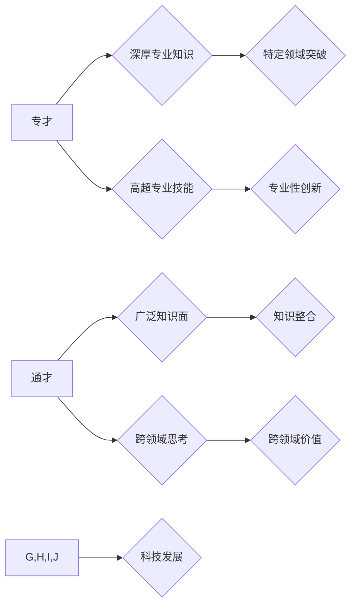

                 

## 知识的深度与广度：专才与通才的平衡

> 关键词：人工智能、专才、通才、知识深度、知识广度、技术发展、跨领域合作、未来趋势

## 1. 背景介绍

在当今科技飞速发展的时代，知识的积累和应用显得尤为重要。然而，知识的获取和应用并非一成不变，而是呈现出越来越多元化的趋势。一方面，随着科技领域的不断细分，专业领域内的知识变得越来越深奥，对专精领域的深入理解和掌握显得至关重要。另一方面，科技发展日新月异，不同领域之间的交叉融合日益频繁，对跨领域知识的整合和应用提出了更高的要求。

在这种背景下，"专才"和"通才"的概念再次被提上议程，引发了广泛的讨论。专才是指在特定领域拥有深厚知识和技能的人才，他们对某一领域的专业知识和技能有着精湛的掌握，能够在该领域做出卓越的贡献。通才则是指在多个领域拥有广泛的知识和技能的人才，他们能够跨领域思考和解决问题，并能够将不同领域的知识整合起来创造新的价值。

## 2. 核心概念与联系

专才和通才并非对立的概念，而是两种不同的知识结构和应用模式。

**专才**

* **特点:** 深入理解和掌握特定领域知识，拥有高超的专业技能。
* **优势:** 在特定领域具有核心竞争力，能够做出专业性的突破和创新。
* **劣势:** 知识局限于特定领域，难以适应跨领域合作和快速变化的科技环境。

**通才**

* **特点:** 拥有广泛的知识面，能够跨领域思考和解决问题。
* **优势:** 能够整合不同领域的知识，创造新的价值，适应快速变化的科技环境。
* **劣势:** 在特定领域可能缺乏专精的深度，难以做出突破性的创新。

**专才与通才的平衡**

* **互补性:** 专才和通才在各自领域发挥着重要的作用，两者相互补充，共同推动科技发展。
* **协同合作:** 专才和通才可以通过协同合作，将各自的优势发挥到极致，实现更大的价值创造。
* **知识迁移:** 通才可以通过学习和吸收专才的知识，提升自身在特定领域的专业能力。

**Mermaid 流程图**



## 3. 核心算法原理 & 具体操作步骤

### 3.1  算法原理概述

在人工智能领域，深度学习算法是实现知识深度和广度的关键技术之一。深度学习算法通过多层神经网络结构，模拟人类大脑的学习机制，能够从海量数据中自动提取特征和规律，从而实现对复杂问题的理解和解决。

### 3.2  算法步骤详解

1. **数据预处理:** 收集和清洗数据，将其转换为深度学习算法可以理解的格式。
2. **网络结构设计:** 根据具体任务需求，设计多层神经网络结构，包括输入层、隐藏层和输出层。
3. **参数初始化:** 为神经网络中的参数进行随机初始化。
4. **前向传播:** 将输入数据通过神经网络层层传递，最终得到输出结果。
5. **反向传播:** 计算输出结果与真实值的误差，并根据误差反向调整神经网络参数。
6. **迭代训练:** 重复前向传播和反向传播的过程，不断调整参数，直到模型达到预期的性能。

### 3.3  算法优缺点

**优点:**

* 能够自动提取特征，无需人工特征工程。
* 能够处理海量数据，学习复杂模式。
* 在图像识别、自然语言处理等领域取得了突破性进展。

**缺点:**

* 训练数据量大，计算资源消耗高。
* 模型解释性差，难以理解模型的决策过程。
* 对数据质量要求高，容易受到噪声数据的影响。

### 3.4  算法应用领域

深度学习算法广泛应用于人工智能领域，例如：

* **图像识别:** 人脸识别、物体检测、图像分类。
* **自然语言处理:** 机器翻译、文本摘要、情感分析。
* **语音识别:** 语音转文本、语音助手。
* **推荐系统:** 商品推荐、内容推荐。
* **医疗诊断:** 病情预测、疾病诊断。

## 4. 数学模型和公式 & 详细讲解 & 举例说明

### 4.1  数学模型构建

深度学习算法的核心是神经网络模型，其数学模型可以表示为多层感知机（MLP）。

**MLP 模型**

* **输入层:**  接收原始数据，每个节点代表一个特征。
* **隐藏层:**  对输入数据进行非线性变换，提取特征。
* **输出层:**  输出最终结果。

**激活函数:**

激活函数用于引入非线性，使神经网络能够学习复杂模式。常见的激活函数包括 sigmoid 函数、ReLU 函数等。

**损失函数:**

损失函数用于衡量模型预测结果与真实值的差异。常见的损失函数包括均方误差（MSE）、交叉熵损失等。

**优化算法:**

优化算法用于更新神经网络参数，使模型损失最小化。常见的优化算法包括梯度下降法、Adam 算法等。

### 4.2  公式推导过程

**前向传播公式:**

$$
y = f(W^L x^L + b^L)
$$

其中:

* $y$ 是输出结果
* $f$ 是激活函数
* $W^L$ 是第 L 层权重矩阵
* $x^L$ 是第 L 层输入
* $b^L$ 是第 L 层偏置向量

**反向传播公式:**

$$
\frac{\partial L}{\partial W^L} = \frac{\partial L}{\partial y} \cdot \frac{\partial y}{\partial x^L} \cdot \frac{\partial x^L}{\partial W^L}
$$

其中:

* $L$ 是损失函数
* $\frac{\partial L}{\partial y}$ 是损失函数对输出结果的梯度
* $\frac{\partial y}{\partial x^L}$ 是激活函数对输入的梯度
* $\frac{\partial x^L}{\partial W^L}$ 是输入对权重的梯度

### 4.3  案例分析与讲解

**图像分类案例:**

假设我们训练一个图像分类模型，用于识别猫和狗的图片。

* **输入数据:** 猫和狗的图片，每个图片经过预处理后，转换为一维向量。
* **网络结构:** 可以使用卷积神经网络（CNN）作为模型架构，CNN 擅长提取图像特征。
* **损失函数:** 可以使用交叉熵损失函数，用于衡量模型预测结果与真实标签的差异。
* **优化算法:** 可以使用 Adam 算法，用于更新模型参数。

通过训练，模型能够学习到猫和狗的特征，并能够准确地识别出图片中是猫还是狗。

## 5. 项目实践：代码实例和详细解释说明

### 5.1  开发环境搭建

* **操作系统:** Linux 或 macOS
* **编程语言:** Python
* **深度学习框架:** TensorFlow 或 PyTorch
* **其他工具:** Jupyter Notebook、Git

### 5.2  源代码详细实现

以下是一个简单的图像分类代码示例，使用 TensorFlow 框架实现：

```python
import tensorflow as tf

# 定义模型架构
model = tf.keras.models.Sequential([
  tf.keras.layers.Conv2D(32, (3, 3), activation='relu', input_shape=(28, 28, 1)),
  tf.keras.layers.MaxPooling2D((2, 2)),
  tf.keras.layers.Conv2D(64, (3, 3), activation='relu'),
  tf.keras.layers.MaxPooling2D((2, 2)),
  tf.keras.layers.Flatten(),
  tf.keras.layers.Dense(10, activation='softmax')
])

# 编译模型
model.compile(optimizer='adam',
              loss='sparse_categorical_crossentropy',
              metrics=['accuracy'])

# 训练模型
model.fit(x_train, y_train, epochs=5)

# 评估模型
loss, accuracy = model.evaluate(x_test, y_test)
print('Test loss:', loss)
print('Test accuracy:', accuracy)
```

### 5.3  代码解读与分析

* **模型架构:** 代码定义了一个简单的卷积神经网络模型，包含两层卷积层、两层池化层、一层全连接层和一层输出层。
* **编译模型:** 使用 Adam 优化器、交叉熵损失函数和准确率作为评估指标编译模型。
* **训练模型:** 使用训练数据训练模型，训练 epochs=5 次。
* **评估模型:** 使用测试数据评估模型的性能，输出测试损失和准确率。

### 5.4  运行结果展示

运行代码后，会输出模型的训练过程和测试结果，包括训练损失、训练准确率、测试损失和测试准确率。

## 6. 实际应用场景

深度学习算法在各个领域都有广泛的应用，例如：

* **医疗诊断:** 利用深度学习算法分析医学影像，辅助医生诊断疾病。
* **金融风险控制:** 利用深度学习算法识别金融欺诈和风险行为。
* **智能客服:** 利用深度学习算法构建智能聊天机器人，提供24小时在线客服服务。
* **自动驾驶:** 利用深度学习算法识别道路场景，辅助车辆自动驾驶。

### 6.4  未来应用展望

随着人工智能技术的不断发展，深度学习算法的应用场景将会更加广泛，例如：

* **个性化教育:** 利用深度学习算法分析学生的学习情况，提供个性化的学习方案。
* **精准农业:** 利用深度学习算法分析农业数据，提高农业生产效率。
* **科学研究:** 利用深度学习算法加速科学研究，例如药物研发、材料科学等。

## 7. 工具和资源推荐

### 7.1  学习资源推荐

* **书籍:**
    * 深度学习 (Deep Learning) - Ian Goodfellow, Yoshua Bengio, Aaron Courville
    * 构建深度学习模型 (Hands-On Machine Learning with Scikit-Learn, Keras & TensorFlow) - Aurélien Géron
* **在线课程:**
    * Coursera: 深度学习 Specialization
    * Udacity: 深度学习 Nanodegree
    * fast.ai: 深度学习课程

### 7.2  开发工具推荐

* **深度学习框架:** TensorFlow, PyTorch, Keras
* **编程语言:** Python
* **数据处理工具:** Pandas, NumPy
* **可视化工具:** Matplotlib, Seaborn

### 7.3  相关论文推荐

* **AlexNet:** ImageNet Classification with Deep Convolutional Neural Networks
* **VGGNet:** Very Deep Convolutional Networks for Large-Scale Image Recognition
* **ResNet:** Deep Residual Learning for Image Recognition
* **InceptionNet:** Inception-v3, Inception-ResNet v2

## 8. 总结：未来发展趋势与挑战

### 8.1  研究成果总结

深度学习算法取得了显著的成果，在图像识别、自然语言处理等领域取得了突破性进展。

### 8.2  未来发展趋势

* **模型更深更广:** 研究更深层次、更广范围的神经网络模型，提高模型的表达能力和泛化能力。
* **数据更丰富更有效:** 探索新的数据来源，提高数据质量和效率，例如利用多模态数据、联邦学习等技术。
* **算法更智能更高效:** 研究更智能、更有效的深度学习算法，例如自监督学习、强化学习等。
* **解释性更强:** 研究深度学习模型的解释性，提高模型的可理解性和可信任性。

### 8.3  面临的挑战

* **数据隐私和安全:** 深度学习算法对大量数据依赖，如何保护数据隐私和安全是一个重要挑战。
* **算法偏见:** 深度学习算法容易受到训练数据中的偏见影响，如何解决算法偏见是一个重要的研究方向。
* **计算资源消耗:** 深度学习算法训练需要大量的计算资源，如何降低计算成本是一个重要的挑战。

### 8.4  研究展望

未来，深度学习算法将继续推动人工智能技术的发展，并应用于更多领域，为人类社会带来更多福祉。


## 9. 附录：常见问题与解答

**Q1: 深度学习算法和传统机器学习算法有什么区别？**

**A1:** 深度学习算法是一种更高级的机器学习算法，它使用多层神经网络结构，能够自动提取特征，而传统机器学习算法需要人工特征工程。

**Q2: 如何选择合适的深度学习框架？**

**A2:** TensorFlow 和 PyTorch 是两个主流的深度学习框架， TensorFlow 更适合于生产环境，PyTorch 更适合于研究和开发。

**Q3: 如何解决深度学习算法的过拟合问题？**

**A3:** 过拟合是指模型在训练数据上表现很好，但在测试数据上表现较差。解决过拟合的方法包括：增加训练数据、使用正则化技术、Dropout 技术等。


作者：禅与计算机程序设计艺术 / Zen and the Art of Computer Programming 
<end_of_turn>

