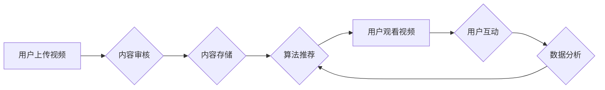

                 

## 短视频创业：碎片化时代的内容革命

> 关键词：短视频、算法推荐、内容分发、移动互联网、用户行为分析、数据驱动、人工智能

### 1. 背景介绍

21世纪，互联网的普及和移动设备的兴起，深刻地改变了人们获取信息和消费内容的方式。碎片化时代来临，人们的注意力越来越分散，对信息的需求更加碎片化。在这种背景下，短视频作为一种新兴的视频形式，凭借其内容简洁、易于传播、观看体验流畅等特点，迅速崛起，成为内容创作和消费的新趋势。

短视频平台的出现，为创作者提供了新的表达和创作平台，也为用户带来了更加便捷、高效的娱乐和信息获取方式。从抖音、快手到B站、小红书，短视频平台的蓬勃发展，催生了一批新的内容创作者和商业模式，也引发了对短视频产业生态、用户行为、内容创作模式等方面的深入思考。

### 2. 核心概念与联系

#### 2.1 短视频平台架构

短视频平台的核心功能包括：

* **内容上传和存储:** 用户可以通过手机或电脑上传短视频内容，平台负责存储和管理这些视频数据。
* **内容分发和推荐:** 平台利用算法推荐机制，将用户感兴趣的内容推送给用户，提高用户粘性和活跃度。
* **用户互动和社区建设:** 平台提供点赞、评论、分享等互动功能，鼓励用户参与互动，构建社区氛围。
* **直播和互动:** 部分平台支持直播功能，用户可以通过直播与粉丝互动，增强用户粘性和参与感。
* **广告和商业化:** 平台通过广告投放、电商直播等方式实现商业化，为创作者和平台自身带来收益。

#### 2.2 短视频推荐算法

短视频推荐算法是平台的核心技术之一，其目的是根据用户的兴趣偏好，推荐用户感兴趣的内容。常见的推荐算法包括：

* **基于内容的推荐:** 根据视频内容的标签、描述、关键词等信息，推荐与用户历史观看内容相似的视频。
* **基于协同过滤的推荐:** 根据用户与其他用户的观看行为相似性，推荐其他用户观看过的视频。
* **深度学习推荐:** 利用深度学习模型，从用户的观看历史、点赞、评论等行为数据中学习用户兴趣偏好，推荐更精准的内容。

#### 2.3 短视频平台架构流程图



### 3. 核心算法原理 & 具体操作步骤

#### 3.1 算法原理概述

短视频推荐算法的核心是预测用户对特定视频的兴趣。这通常涉及以下几个步骤：

1. **数据收集:** 收集用户观看历史、点赞、评论、分享等行为数据，以及视频内容的标签、描述、关键词等信息。
2. **特征提取:** 从用户行为数据和视频内容信息中提取特征，例如用户观看时长、点赞率、评论内容、视频类型、主题标签等。
3. **模型训练:** 利用机器学习算法，训练一个预测模型，将用户特征和视频特征作为输入，输出用户对视频的兴趣评分。
4. **推荐排序:** 根据模型预测的兴趣评分，对视频进行排序，推荐给用户。

#### 3.2 算法步骤详解

**基于内容的推荐算法:**

1. **视频内容分析:** 对视频内容进行文本分析和图像识别，提取视频的主题标签、关键词、人物、场景等信息。
2. **用户兴趣建模:** 根据用户的观看历史和点赞记录，构建用户的兴趣模型，例如用户喜欢的视频类型、主题标签、创作者等。
3. **相似度计算:** 计算视频内容和用户兴趣模型之间的相似度，例如使用余弦相似度或TF-IDF算法。
4. **推荐排序:** 根据相似度排序，推荐与用户兴趣相符的视频。

**基于协同过滤的推荐算法:**

1. **用户-视频交互矩阵构建:** 将用户和视频的交互行为（观看、点赞、评论等）存储在一个矩阵中，例如用户在行，视频在列，交互行为用1表示，否则用0表示。
2. **相似用户/视频查找:** 根据用户的交互行为，找到与该用户观看行为相似的其他用户，或者找到与该视频相关的其他视频。
3. **推荐视频:** 推荐与相似用户观看过的视频，或者推荐与相似视频相关的视频。

**深度学习推荐算法:**

1. **数据预处理:** 对用户行为数据和视频内容信息进行预处理，例如文本向量化、图像特征提取等。
2. **模型构建:** 利用深度学习模型，例如神经网络、循环神经网络等，构建一个预测用户兴趣的模型。
3. **模型训练:** 利用训练数据，训练深度学习模型，学习用户兴趣的复杂模式。
4. **推荐排序:** 根据模型预测的兴趣评分，对视频进行排序，推荐给用户。

#### 3.3 算法优缺点

| 算法类型 | 优点 | 缺点 |
|---|---|---|
| 基于内容的推荐 | 能够推荐与用户兴趣相符的视频，无需用户历史数据 | 难以捕捉用户隐性兴趣，推荐结果可能不够精准 |
| 基于协同过滤的推荐 | 能够发现用户之间的潜在关联，推荐用户可能感兴趣但未接触过的视频 | 数据稀疏问题，难以推荐新用户或新视频 |
| 深度学习推荐 | 能够学习用户兴趣的复杂模式，推荐结果更加精准 | 需要大量数据进行训练，模型训练成本较高 |

#### 3.4 算法应用领域

短视频推荐算法广泛应用于各种短视频平台，例如抖音、快手、B站、小红书等。

### 4. 数学模型和公式 & 详细讲解 & 举例说明

#### 4.1 数学模型构建

**基于协同过滤的推荐算法**

假设用户集合为U，视频集合为V，用户-视频交互矩阵为R，其中R(u,v)表示用户u对视频v的交互行为（例如观看、点赞）。

**用户相似度计算:**

可以使用余弦相似度计算用户之间的相似度:

$$
Sim(u,u') = \frac{u \cdot u'}{||u|| ||u'||}
$$

其中，u和u'分别表示用户u和u'的特征向量，u·u'表示两个向量之间的点积，||u||和||u'||分别表示两个向量的模长。

**视频相似度计算:**

可以使用余弦相似度计算视频之间的相似度:

$$
Sim(v,v') = \frac{v \cdot v'}{||v|| ||v'||}
$$

其中，v和v'分别表示视频v和v'的特征向量，v·v'表示两个向量之间的点积，||v||和||v'||分别表示两个向量的模长。

#### 4.2 公式推导过程

**基于内容的推荐算法**

可以使用TF-IDF算法计算视频内容和用户兴趣模型之间的相似度:

$$
TF-IDF(t,d) = TF(t,d) \cdot IDF(t)
$$

其中，t表示视频内容中的一个词，d表示视频内容，TF(t,d)表示词t在视频d中出现的频率，IDF(t)表示词t在整个语料库中出现的逆向文档频率。

#### 4.3 案例分析与讲解

**案例:**

假设用户A喜欢观看美食视频，用户B喜欢观看旅游视频。

**基于协同过滤的推荐:**

如果用户A和用户B都观看过一个美食旅游视频，那么可以认为这两个用户之间存在一定的相似性，平台可以推荐用户A观看用户B观看过的其他旅游视频，或者推荐用户B观看用户A观看过的其他美食视频。

**基于内容的推荐:**

如果用户A观看过一个关于意大利面制作的视频，平台可以根据视频内容中的关键词（例如意大利面、烹饪、食谱等）推荐用户A观看其他与意大利面相关的视频。

### 5. 项目实践：代码实例和详细解释说明

#### 5.1 开发环境搭建

* **操作系统:** Linux/macOS/Windows
* **编程语言:** Python
* **框架:** Flask/Django
* **数据库:** MySQL/MongoDB
* **工具:** Git、Docker

#### 5.2 源代码详细实现

```python
# 基于协同过滤的推荐算法示例代码

import numpy as np

# 用户-视频交互矩阵
R = np.array([
    [1, 0, 1, 0],
    [0, 1, 1, 1],
    [1, 1, 0, 1],
    [0, 1, 0, 0]
])

# 计算用户相似度
def cosine_similarity(u1, u2):
    return np.dot(u1, u2) / (np.linalg.norm(u1) * np.linalg.norm(u2))

# 获取用户u1的相似用户
def get_similar_users(u1, top_k=3):
    similarities = [cosine_similarity(u1, u2) for u2 in range(R.shape[0])]
    sorted_indices = np.argsort(similarities)[::-1]
    return sorted_indices[:top_k]

# 推荐视频
def recommend_videos(u1, top_k=3):
    similar_users = get_similar_users(u1)
    recommended_videos = []
    for u2 in similar_users:
        if R[u2, :] != R[u1, :]:
            for v in range(R.shape[1]):
                if R[u2, v] == 1 and R[u1, v] == 0:
                    recommended_videos.append(v)
    return recommended_videos[:top_k]

# 示例使用
user_id = 0
recommended_videos = recommend_videos(user_id)
print(f"推荐给用户 {user_id} 的视频：{recommended_videos}")
```

#### 5.3 代码解读与分析

* **用户-视频交互矩阵:** 存储了用户对视频的交互行为，例如观看、点赞、评论等。
* **余弦相似度:** 用于计算用户之间的相似度，以及视频之间的相似度。
* **获取相似用户:** 根据用户u1的交互行为，找到与之相似度最高的k个用户。
* **推荐视频:** 从相似用户的交互行为中，找到用户u1未观看过的视频，并推荐给用户u1。

#### 5.4 运行结果展示

运行上述代码，可以得到用户0的推荐视频列表。

### 6. 实际应用场景

#### 6.1 短视频平台内容推荐

短视频平台利用推荐算法，根据用户的观看历史、点赞、评论等行为，推荐用户感兴趣的视频，提高用户粘性和活跃度。

#### 6.2 内容创作者内容创作指导

短视频平台可以利用算法分析用户观看偏好，为创作者提供内容创作指导，帮助创作者创作更受欢迎的视频。

#### 6.3 广告投放精准化

短视频平台可以利用算法分析用户兴趣，精准投放广告，提高广告效果。

#### 6.4 未来应用展望

* **个性化内容推荐:** 利用深度学习算法，更加精准地预测用户兴趣，提供更加个性化的内容推荐。
* **跨平台内容推荐:** 利用用户跨平台行为数据，实现跨平台内容推荐，提升用户体验。
* **内容创作辅助:** 利用人工智能技术，辅助创作者创作视频，例如自动生成字幕、剪辑视频等。

### 7. 工具和资源推荐

#### 7.1 学习资源推荐

* **书籍:**
    * 《推荐系统实践》
    * 《深度学习》
* **在线课程:**
    * Coursera: Recommender Systems
    * Udacity: Deep Learning Nanodegree

#### 7.2 开发工具推荐

* **Python:** 
    * Scikit-learn
    * TensorFlow
    * PyTorch
* **框架:**
    * Flask
    * Django
* **数据库:**
    * MySQL
    * MongoDB

#### 7.3 相关论文推荐

* **Collaborative Filtering for Implicit Feedback Datasets**
* **Deep Learning for Recommender Systems**

### 8. 总结：未来发展趋势与挑战

#### 8.1 研究成果总结

短视频推荐算法取得了显著的成果，能够有效地推荐用户感兴趣的内容，提升用户体验。

#### 8.2 未来发展趋势

* **个性化推荐:** 利用深度学习算法，更加精准地预测用户兴趣，提供更加个性化的内容推荐。
* **跨平台推荐:** 利用用户跨平台行为数据，实现跨平台内容推荐，提升用户体验。
* **内容创作辅助:** 利用人工智能技术，辅助创作者创作视频，例如自动生成字幕、剪辑视频等。

#### 8.3 面临的挑战

* **数据稀疏性:** 用户行为数据往往是稀疏的，难以训练有效的推荐模型。
* **冷启动问题:** 新用户和新视频难以获得推荐，需要新的算法和策略来解决。
* **用户隐私保护:** 用户行为数据涉及隐私问题，需要采取措施保护用户隐私。

#### 8.4 研究展望

未来，短视频推荐算法的研究将更加注重个性化、跨平台、内容创作辅助等方面，并更加重视用户隐私保护。

### 9. 附录：常见问题与解答

* **Q: 如何解决数据稀疏性问题？**

* **A:** 可以利用协同过滤算法，从用户之间的相似性中挖掘潜在的推荐信息。也可以利用矩阵分解技术，将用户-视频交互矩阵分解成低维向量，降低数据维度。

* **Q: 如何解决冷启动问题？**

* **A:** 可以利用用户画像、内容特征等信息，对新用户和新视频进行初始化推荐。也可以利用基于内容的推荐算法，根据视频内容推荐给用户。

* **Q: 如何保护用户隐私？**

* **A:** 可以采用数据匿名化、差分隐私等技术，保护用户隐私。


作者：禅与计算机程序设计艺术 / Zen and the Art of Computer Programming 
<end_of_turn>

