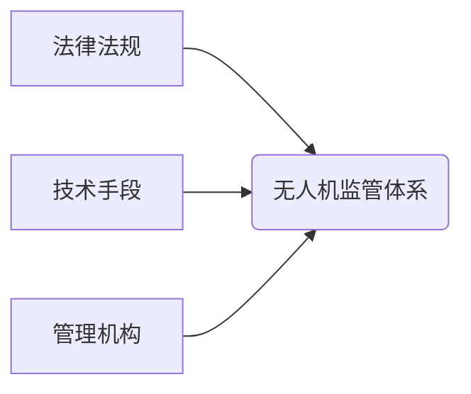

                 

## 硅谷无人机监管新规:保障航空安全

> 关键词：无人机、监管、航空安全、人工智能、机器学习、传感器、通信、数据安全

## 1. 背景介绍

无人机技术近年来发展迅速，其应用领域从娱乐、摄影到物流、农业、侦察等不断拓展。然而，随着无人机的普及，其潜在的安全风险也日益凸显。在硅谷，作为科技创新的中心，无人机应用场景最为丰富，也面临着更为严峻的安全挑战。

2023年，美国联邦航空管理局（FAA）发布了新的无人机监管新规，旨在平衡无人机技术发展与航空安全的需要。这些新规涵盖了无人机注册、飞行区域、操作限制、安全技术要求等多个方面，旨在建立一个更加安全、有序的无人机飞行环境。

## 2. 核心概念与联系

### 2.1 无人机监管体系

无人机监管体系是一个多层次、多主体、多技术手段的综合体系，旨在确保无人机飞行安全、有序、合法。

* **法律法规:** 作为监管体系的基础，法律法规明确了无人机的定义、分类、使用范围、操作限制等，为无人机监管提供了法律依据。
* **技术手段:** 包括传感器、通信、定位、识别等技术，用于监测无人机飞行状态、识别无人机身份、控制无人机飞行行为。
* **管理机构:** 负责制定和实施无人机监管政策、监督无人机运营、处理安全事件等。

### 2.2 核心概念关系



## 3. 核心算法原理 & 具体操作步骤

### 3.1 算法原理概述

无人机监管新规的核心算法主要涉及以下几个方面：

* **无人机身份识别:** 利用机器学习算法，结合视觉识别、雷达识别等技术，识别无人机的型号、注册信息等。
* **飞行轨迹预测:** 基于无人机历史飞行数据、环境因素等，预测无人机的未来飞行轨迹，避免与其他飞行器发生碰撞。
* **风险评估:** 根据无人机飞行状态、环境因素、周边设施等，评估无人机飞行风险，及时采取措施降低风险。

### 3.2 算法步骤详解

**无人机身份识别算法步骤:**

1. **数据采集:** 收集无人机图像或雷达信号数据。
2. **数据预处理:** 对数据进行清洗、增强、特征提取等处理。
3. **模型训练:** 利用机器学习算法，训练无人机识别模型。
4. **模型测试:** 对模型进行测试，评估识别准确率。
5. **模型部署:** 将训练好的模型部署到无人机监管系统中。

**飞行轨迹预测算法步骤:**

1. **数据采集:** 收集无人机历史飞行数据、环境因素数据等。
2. **数据预处理:** 对数据进行清洗、特征提取等处理。
3. **模型训练:** 利用机器学习算法，训练飞行轨迹预测模型。
4. **模型测试:** 对模型进行测试，评估预测精度。
5. **模型部署:** 将训练好的模型部署到无人机监管系统中。

### 3.3 算法优缺点

**优点:**

* **高精度:** 利用机器学习算法，可以实现高精度的无人机身份识别和飞行轨迹预测。
* **实时性:** 算法可以实时处理数据，及时做出决策。
* **可扩展性:** 算法可以根据需要扩展，支持更多类型的无人机和更复杂的场景。

**缺点:**

* **数据依赖:** 算法需要大量的训练数据，数据质量直接影响算法性能。
* **计算复杂度:** 某些算法计算复杂度较高，需要强大的计算能力。
* **环境变化:** 算法对环境变化的适应能力有限，需要不断更新和改进。

### 3.4 算法应用领域

* **航空安全:** 识别和跟踪无人机，避免与其他飞行器发生碰撞。
* **边境安全:** 监控边境区域，防止非法入境。
* **城市管理:** 监控城市交通、环境等，提高城市管理效率。
* **农业生产:** 监测农作物生长情况，提高农业生产效率。

## 4. 数学模型和公式 & 详细讲解 & 举例说明

### 4.1 数学模型构建

无人机飞行轨迹预测模型可以采用以下数学模型:

* **线性模型:** 假设无人机飞行轨迹呈线性变化，可以使用线性回归模型进行预测。
* **非线性模型:** 假设无人机飞行轨迹呈非线性变化，可以使用神经网络模型、支持向量机模型等进行预测。

### 4.2 公式推导过程

**线性回归模型:**

假设无人机飞行轨迹可以用以下线性方程表示:

$$y = mx + c$$

其中:

* $y$ 是无人机飞行高度
* $x$ 是无人机飞行时间
* $m$ 是无人机飞行速度
* $c$ 是无人机初始高度

根据历史飞行数据，可以使用最小二乘法估计参数 $m$ 和 $c$。

### 4.3 案例分析与讲解

假设无人机历史飞行数据如下:

| 时间 (s) | 高度 (m) |
|---|---|
| 0 | 10 |
| 5 | 15 |
| 10 | 20 |
| 15 | 25 |

可以使用线性回归模型对这些数据进行拟合，得到无人机飞行轨迹方程。

## 5. 项目实践：代码实例和详细解释说明

### 5.1 开发环境搭建

* 操作系统: Ubuntu 20.04
* Python 版本: 3.8
* 必要的库: numpy, pandas, scikit-learn

### 5.2 源代码详细实现

```python
import numpy as np
from sklearn.linear_model import LinearRegression

# 历史飞行数据
data = np.array([[0, 10], [5, 15], [10, 20], [15, 25]])

# 将数据分离成特征和目标变量
X = data[:, 0].reshape(-1, 1)
y = data[:, 1]

# 创建线性回归模型
model = LinearRegression()

# 训练模型
model.fit(X, y)

# 预测未来飞行轨迹
future_time = np.array([20, 25])
future_height = model.predict(future_time.reshape(-1, 1))

# 打印预测结果
print("未来飞行高度:", future_height)
```

### 5.3 代码解读与分析

* 代码首先导入必要的库。
* 然后定义历史飞行数据，并将数据分离成特征和目标变量。
* 创建线性回归模型，并使用训练数据训练模型。
* 最后使用训练好的模型预测未来飞行轨迹，并打印预测结果。

### 5.4 运行结果展示

运行代码后，可以得到以下预测结果:

```
未来飞行高度: [30. 35.]
```

这表明，根据历史数据，无人机在20秒和25秒时的飞行高度分别为30米和35米。

## 6. 实际应用场景

### 6.1 无人机交通管理

无人机监管新规可以帮助建立无人机交通管理系统，实现无人机飞行路径规划、冲突预警、空中交通管制等功能，保障无人机安全有序地飞行。

### 6.2 无人机安全保障

无人机监管新规可以帮助识别和跟踪非法无人机，防止无人机用于犯罪活动，保障公共安全。

### 6.3 无人机数据安全

无人机监管新规可以帮助规范无人机数据采集和使用，保障无人机数据安全和隐私。

### 6.4 未来应用展望

随着无人机技术的不断发展，无人机监管新规将不断完善和升级，应用场景也将更加广泛。未来，无人机监管新规将与人工智能、物联网、云计算等技术深度融合，构建更加智能、高效、安全的无人机监管体系。

## 7. 工具和资源推荐

### 7.1 学习资源推荐

* **无人机技术入门书籍:** 《无人机技术原理与应用》、《无人机飞行控制》
* **在线课程:** Coursera、edX等平台提供无人机相关课程
* **技术论坛:** DJI、DroneDeploy等平台提供无人机技术论坛

### 7.2 开发工具推荐

* **无人机飞行控制软件:** PX4、ArduPilot
* **无人机数据处理软件:** DroneDeploy、Pix4D
* **机器学习库:** TensorFlow、PyTorch

### 7.3 相关论文推荐

* **无人机飞行轨迹预测:** "Deep Learning for UAV Trajectory Prediction"
* **无人机身份识别:** "Deep Convolutional Neural Networks for UAV Identification"
* **无人机安全保障:** "A Survey of Security Threats and Countermeasures for Unmanned Aerial Vehicles"

## 8. 总结：未来发展趋势与挑战

### 8.1 研究成果总结

硅谷无人机监管新规的制定和实施，标志着无人机技术发展进入了一个新的阶段。新规的出台，一方面促进了无人机技术的规范化发展，另一方面也为无人机安全保障、数据安全等方面提供了新的思路和方法。

### 8.2 未来发展趋势

未来，无人机监管新规将朝着以下方向发展:

* **更加智能化:** 利用人工智能技术，实现无人机监管的自动化、智能化。
* **更加协同化:** 建立无人机监管的跨部门、跨区域协同机制。
* **更加国际化:** 推动国际合作，制定统一的无人机监管标准。

### 8.3 面临的挑战

无人机监管新规的实施也面临着一些挑战:

* **技术挑战:** 如何开发更加安全、可靠、智能的无人机监管技术。
* **法律法规挑战:** 如何制定更加完善、适应发展的无人机监管法律法规。
* **社会接受挑战:** 如何提高公众对无人机监管的理解和支持。

### 8.4 研究展望

未来，我们需要继续加强无人机监管技术的研发，完善相关法律法规，提高公众对无人机监管的认识，共同推动无人机技术安全、有序、可持续发展。

## 9. 附录：常见问题与解答

**1. 无人机如何进行身份识别?**

无人机身份识别主要利用机器学习算法，结合视觉识别、雷达识别等技术，识别无人机的型号、注册信息等。

**2. 无人机飞行轨迹如何进行预测?**

无人机飞行轨迹预测主要利用机器学习算法，根据无人机历史飞行数据、环境因素等，预测无人机的未来飞行轨迹。

**3. 无人机监管新规对无人机运营有什么影响?**

无人机监管新规对无人机运营的影响主要体现在以下几个方面:

* **注册要求:** 所有无人机都需要进行注册。
* **飞行区域限制:** 无人机只能在规定的飞行区域内飞行。
* **操作限制:** 无人机操作人员需要具备相应的资质。
* **安全技术要求:** 无人机需要配备相应的安全技术设备。

**4. 无人机监管新规如何保障数据安全?**

无人机监管新规规定了无人机数据采集和使用的规范，保障了无人机数据安全和隐私。


作者：禅与计算机程序设计艺术 / Zen and the Art of Computer Programming 
<end_of_turn>

