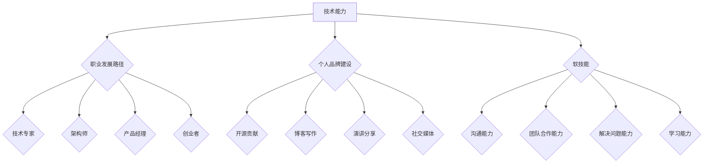

                 

## 程序员如何进行长期职业规划

> 关键词：职业规划、程序员、技术发展、学习路径、未来趋势、个人品牌、软技能

## 1. 背景介绍

在科技日新月异的时代，程序员这个职业正经历着前所未有的变革。随着人工智能、云计算、大数据等技术的快速发展，编程语言、框架和工具也在不断更新迭代。对于程序员来说，如何进行长期职业规划，才能在激烈的竞争中脱颖而出，不断提升自身价值，成为一个关键问题。

传统的职业规划模式往往侧重于短期目标，例如升职加薪、换工作等。然而，对于程序员来说，技术发展速度之快，短期目标可能在未来很快失去意义。因此，我们需要一种更加长远、更加灵活的职业规划模式，能够适应不断变化的技术环境，并帮助我们持续学习和成长。

## 2. 核心概念与联系

**2.1 程序员职业发展路径**

程序员的职业发展路径并非一条单一的道路，而是多条并行的路径，可以根据个人兴趣、能力和目标选择不同的方向。常见的程序员职业发展路径包括：

* **技术专家:** 深入研究某个特定领域的技术，成为技术领域的专家，例如人工智能、云计算、区块链等。
* **架构师:** 负责设计和构建大型软件系统，拥有全局视野和系统架构能力。
* **产品经理:** 负责产品的设计、开发和运营，需要具备市场洞察力和用户需求分析能力。
* **创业者:** 利用自身的技术能力和经验，创办自己的公司，成为技术创业者。

**2.2 技术发展趋势与职业规划**

了解技术发展趋势是进行长期职业规划的关键。以下是一些未来几年可能影响程序员职业发展的关键技术趋势：

* **人工智能 (AI):** AI 将在各个领域广泛应用，例如自动驾驶、医疗诊断、金融分析等。程序员需要学习 AI 相关技术，例如机器学习、深度学习等。
* **云计算:** 云计算将成为主流的计算模式，程序员需要学习云平台相关的技术，例如 AWS、Azure、GCP 等。
* **大数据:** 大数据分析将成为越来越重要的技能，程序员需要学习大数据处理和分析技术，例如 Hadoop、Spark 等。
* **区块链:** 区块链技术将应用于越来越多的领域，例如金融、供应链、医疗等。程序员需要学习区块链相关的技术，例如 Solidity、Go 等。

**2.3 个人品牌建设与职业发展**

在互联网时代，个人品牌建设对于程序员的职业发展至关重要。可以通过以下方式建设个人品牌：

* **开源贡献:** 参与开源项目，展示自己的技术能力和团队合作能力。
* **博客写作:** 分享自己的技术经验和见解，建立个人影响力。
* **演讲分享:** 参加技术会议和活动，分享自己的技术成果和经验。
* **社交媒体:** 利用社交媒体平台，与其他程序员交流学习，建立人脉关系。

**2.4 软技能的重要性**

除了技术能力之外，软技能也对程序员的职业发展至关重要。例如：

* **沟通能力:** 能够清晰地表达自己的想法，并与团队成员有效沟通。
* **团队合作能力:** 能够与团队成员协作完成项目，并尊重他人的意见。
* **解决问题能力:** 能够分析问题，并找到有效的解决方案。
* **学习能力:** 能够不断学习新的技术和知识，适应不断变化的技术环境。

**Mermaid 流程图**



## 3. 核心算法原理 & 具体操作步骤

**3.1 算法原理概述**

在程序员职业规划中，算法思维是至关重要的。算法思维是指用逻辑和步骤来解决问题的能力。程序员需要能够分析问题，分解成一个个小的步骤，并设计出高效的算法来解决问题。

**3.2 算法步骤详解**

一个算法通常包含以下步骤：

1. **问题分析:** 首先需要明确要解决的问题是什么，以及问题的输入和输出是什么。
2. **算法设计:** 根据问题的特点，设计出解决问题的算法步骤。
3. **算法实现:** 将算法步骤转化为具体的代码实现。
4. **算法测试:** 对算法进行测试，确保算法能够正确地解决问题。
5. **算法优化:** 如果算法效率不高，可以进行优化，提高算法的效率。

**3.3 算法优缺点**

不同的算法有不同的优缺点，需要根据具体问题选择合适的算法。例如，排序算法有冒泡排序、插入排序、快速排序等，每种算法都有不同的时间复杂度和空间复杂度。

**3.4 算法应用领域**

算法应用领域非常广泛，例如：

* **搜索引擎:** 使用算法来对网页进行排名，并返回用户搜索结果。
* **推荐系统:** 使用算法来推荐用户可能感兴趣的内容，例如商品、电影、音乐等。
* **图像识别:** 使用算法来识别图像中的物体，例如人脸、车辆、场景等。
* **自然语言处理:** 使用算法来理解和处理自然语言，例如机器翻译、文本摘要等。

## 4. 数学模型和公式 & 详细讲解 & 举例说明

**4.1 数学模型构建**

数学模型是用于描述和分析问题的抽象表示。在程序员职业规划中，可以使用数学模型来分析职业发展路径、技术趋势和个人能力等因素。例如，可以使用决策树模型来分析不同职业发展路径的优劣，可以使用回归模型来预测未来技术趋势。

**4.2 公式推导过程**

在构建数学模型时，需要使用数学公式来描述模型的结构和关系。例如，可以使用线性回归模型来预测薪资水平，公式如下：

$$
y = mx + c
$$

其中：

* $y$ 是薪资水平
* $x$ 是工作经验
* $m$ 是斜率，表示工作经验对薪资水平的影响
* $c$ 是截距，表示没有工作经验时的薪资水平

**4.3 案例分析与讲解**

假设我们想要预测程序员的薪资水平，可以使用线性回归模型。我们可以收集一些程序员的工作经验和薪资水平的数据，然后使用这些数据训练线性回归模型。训练完成后，我们可以使用模型来预测其他程序员的薪资水平。

## 5. 项目实践：代码实例和详细解释说明

**5.1 开发环境搭建**

程序员需要选择合适的开发环境，例如：

* **操作系统:** Windows、macOS、Linux 等
* **编程语言:** Python、Java、C++ 等
* **IDE:** Eclipse、IntelliJ IDEA、VS Code 等

**5.2 源代码详细实现**

以下是一个简单的 Python 代码示例，用于计算两个数字的和：

```python
def sum_two_numbers(a, b):
  """
  计算两个数字的和。

  Args:
    a: 第一个数字。
    b: 第二个数字。

  Returns:
    两个数字的和。
  """
  return a + b

# 获取用户输入
num1 = float(input("请输入第一个数字: "))
num2 = float(input("请输入第二个数字: "))

# 计算和
sum = sum_two_numbers(num1, num2)

# 打印结果
print("两个数字的和为:", sum)
```

**5.3 代码解读与分析**

这段代码定义了一个名为 `sum_two_numbers` 的函数，该函数接受两个数字作为参数，并返回这两个数字的和。代码还获取了用户的输入，并调用了 `sum_two_numbers` 函数计算和，最后打印结果。

**5.4 运行结果展示**

当用户输入两个数字，例如 5 和 3 时，程序会输出：

```
两个数字的和为: 8.0
```

## 6. 实际应用场景

程序员的职业规划可以应用于各种实际场景，例如：

* **职场晋升:** 通过学习新的技术和提升软技能，程序员可以争取晋升的机会。
* **职业转换:** 程序员可以根据自身兴趣和能力，选择转换到其他相关领域，例如产品经理、数据科学家等。
* **创业:** 程序员可以利用自身的技术能力和经验，创办自己的公司。

**6.4 未来应用展望**

随着人工智能、云计算、大数据等技术的不断发展，程序员的职业规划将更加灵活和多元化。未来，程序员需要具备更强的学习能力、适应能力和创新能力，才能在激烈的竞争中脱颖而出。

## 7. 工具和资源推荐

**7.1 学习资源推荐**

* **在线学习平台:** Coursera、edX、Udemy 等
* **技术博客:** Hacker News、Medium、Stack Overflow 等
* **开源项目:** GitHub、GitLab 等

**7.2 开发工具推荐**

* **代码编辑器:** VS Code、Sublime Text、Atom 等
* **版本控制系统:** Git、SVN 等
* **云平台:** AWS、Azure、GCP 等

**7.3 相关论文推荐**

* **人工智能:** Deep Learning by Ian Goodfellow
* **云计算:** Cloud Computing: Concepts, Technology & Architecture by Thomas Erl
* **大数据:** Hadoop: The Definitive Guide by Tom White

## 8. 总结：未来发展趋势与挑战

**8.1 研究成果总结**

本文探讨了程序员长期职业规划的关键概念和方法，包括技术发展趋势、个人品牌建设、算法思维、数学模型等。

**8.2 未来发展趋势**

未来，程序员职业发展将更加灵活和多元化，需要具备更强的学习能力、适应能力和创新能力。

**8.3 面临的挑战**

程序员面临着技术更新迭代快、竞争激烈等挑战，需要不断学习和提升自身能力。

**8.4 研究展望**

未来研究可以进一步探讨程序员职业规划的个性化定制、人工智能辅助职业规划等方面。

## 9. 附录：常见问题与解答

**9.1 如何选择合适的职业发展路径？**

选择职业发展路径需要根据自身兴趣、能力和目标进行综合考虑。可以参考职业规划指南、咨询行业专家、与同行交流学习等方式。

**9.2 如何提升个人品牌建设？**

可以通过开源贡献、博客写作、演讲分享、社交媒体等方式提升个人品牌建设。

**9.3 如何应对技术更新迭代快带来的挑战？**

需要保持持续学习，关注技术发展趋势，积极参与开源项目，并不断提升自身能力。


作者：禅与计算机程序设计艺术 / Zen and the Art of Computer Programming 
<end_of_turn>

