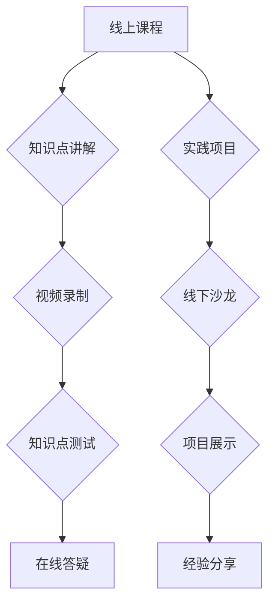

                 

## 程序员知识付费：打造线上线下融合课程

> 关键词：程序员知识付费、线上线下融合、课程设计、技术社区、实战项目、职业发展

### 1. 背景介绍

在当今科技飞速发展的时代，程序员的需求量持续增长，而优质的程序员人才却显得愈加稀缺。面对这一现状，程序员知识付费市场蓬勃发展，成为一种重要的学习和提升技能的方式。线上课程平台、技术社区、线下培训机构等纷纷涌现，为程序员提供丰富的学习资源和交流平台。

然而，单纯依靠线上课程或线下培训难以满足程序员多样化的学习需求。线上课程缺乏互动性和实践性，线下培训成本高昂且时间限制多。因此，如何打造线上线下融合的程序员知识付费课程，成为行业发展的新趋势。

### 2. 核心概念与联系

线上线下融合课程的核心概念在于将线上课程的便捷性和线下培训的互动性相结合，打造一个完整的学习生态系统。

**课程架构：**



**线上课程:** 提供理论知识讲解、视频录制、知识点测试、在线答疑等服务，方便程序员随时随地学习。

**线下培训:**  组织线下沙龙、项目展示、经验分享等活动，加强学员之间的互动和交流，提升学习效果。

**联系:** 线上课程为线下培训提供理论基础和知识储备，线下培训则为线上课程提供实践应用和互动交流的机会。两者相互补充，共同打造一个完整的学习体系。

### 3. 核心算法原理 & 具体操作步骤

**3.1 算法原理概述**

线上线下融合课程的开发需要结合多种算法原理，例如推荐算法、内容分发算法、社区运营算法等。

* **推荐算法:** 根据学员的学习历史、兴趣偏好等信息，推荐合适的课程和学习资源。
* **内容分发算法:** 根据学员的学习进度、学习风格等信息，优化课程内容的展示顺序和学习路径。
* **社区运营算法:**  根据学员的活跃度、参与度等信息，构建活跃的学习社区，促进学员之间的互动和交流。

**3.2 算法步骤详解**

* **数据收集:** 收集学员的学习数据、兴趣偏好、行为轨迹等信息。
* **数据预处理:** 对收集到的数据进行清洗、转换、特征提取等处理，以便于算法模型的训练。
* **模型训练:** 选择合适的算法模型，并利用训练数据进行模型训练。
* **模型评估:**  评估模型的性能，并进行模型调优。
* **模型部署:** 将训练好的模型部署到线上平台，为学员提供个性化的学习服务。

**3.3 算法优缺点**

* **优点:** 能够根据学员的个性化需求提供定制化的学习服务，提高学习效率和效果。
* **缺点:** 需要大量的学习数据和计算资源，算法模型的训练和维护需要专业技术人员。

**3.4 算法应用领域**

* **在线教育平台:** 推荐课程、个性化学习路径、智能答疑等。
* **技术社区:**  用户兴趣推荐、内容分发、社区运营等。
* **职业发展平台:**  职业规划推荐、技能提升建议、求职资源匹配等。

### 4. 数学模型和公式 & 详细讲解 & 举例说明

**4.1 数学模型构建**

推荐算法通常采用基于用户的协同过滤模型，该模型基于用户的历史行为数据，预测用户对特定课程的兴趣。

**4.2 公式推导过程**

用户对课程的评分可以表示为：

$$
r_{ui} = \beta_u + \beta_i + \gamma_{ui}
$$

其中：

* $r_{ui}$ 表示用户 $u$ 对课程 $i$ 的评分。
* $\beta_u$ 表示用户 $u$ 的平均评分偏置。
* $\beta_i$ 表示课程 $i$ 的平均评分偏置。
* $\gamma_{ui}$ 表示用户 $u$ 对课程 $i$ 的特定评分偏置。

**4.3 案例分析与讲解**

假设用户 $A$ 对课程 $X$ 评分为 4，用户 $B$ 对课程 $X$ 评分为 5，用户 $A$ 对课程 $Y$ 评分为 3，用户 $B$ 对课程 $Y$ 评分为 4。

根据协同过滤模型，可以推导出用户 $A$ 对课程 $Z$ 的评分预测值，以及用户 $B$ 对课程 $Z$ 的评分预测值。

### 5. 项目实践：代码实例和详细解释说明

**5.1 开发环境搭建**

* 操作系统: Ubuntu 20.04 LTS
* 编程语言: Python 3.8
* 开发框架: Django 3.2
* 数据库: PostgreSQL 13

**5.2 源代码详细实现**

```python
# models.py
from django.db import models

class Course(models.Model):
    title = models.CharField(max_length=255)
    description = models.TextField()
    # ...其他字段

class User(models.Model):
    username = models.CharField(max_length=255)
    # ...其他字段

class Rating(models.Model):
    user = models.ForeignKey(User, on_delete=models.CASCADE)
    course = models.ForeignKey(Course, on_delete=models.CASCADE)
    rating = models.IntegerField()
```

**5.3 代码解读与分析**

* `models.py` 文件定义了课程、用户和评分模型。
* `Course` 模型表示课程信息，包括标题、描述等。
* `User` 模型表示用户信息，包括用户名等。
* `Rating` 模型表示用户对课程的评分信息。

**5.4 运行结果展示**

通过运行代码，可以建立一个简单的课程评分系统，用户可以对课程进行评分，系统会记录用户的评分信息。

### 6. 实际应用场景

**6.1 在线教育平台**

线上线下融合课程可以应用于在线教育平台，为学员提供更丰富的学习体验。例如，平台可以提供线上课程讲解，线下组织线下沙龙和项目展示活动，帮助学员更好地理解和应用知识。

**6.2 技术社区**

技术社区可以利用线上线下融合课程，打造更活跃的学习氛围。例如，社区可以提供线上技术文档和教程，线下组织技术分享会和项目合作活动，促进学员之间的交流和学习。

**6.3 职业发展平台**

职业发展平台可以利用线上线下融合课程，帮助用户提升职业技能和找到理想工作。例如，平台可以提供线上职业规划指导和技能培训课程，线下组织招聘会和职业发展沙龙，帮助用户实现职业发展目标。

**6.4 未来应用展望**

随着人工智能、虚拟现实等技术的不断发展，线上线下融合课程将更加智能化、个性化和沉浸式。未来，线上线下融合课程将成为程序员学习和提升技能的重要方式。

### 7. 工具和资源推荐

**7.1 学习资源推荐**

* **在线课程平台:** Coursera, Udemy, edX, Udacity
* **技术社区:** Stack Overflow, GitHub, Reddit
* **书籍:** 《代码的艺术》、《设计模式》

**7.2 开发工具推荐**

* **代码编辑器:** VS Code, Sublime Text, Atom
* **版本控制系统:** Git
* **云平台:** AWS, Azure, GCP

**7.3 相关论文推荐**

* **协同过滤推荐算法:** "Collaborative Filtering for Implicit Feedback Datasets"
* **深度学习推荐算法:** "Deep Learning for Recommender Systems"
* **个性化学习路径:** "Personalized Learning Paths: A Survey"

### 8. 总结：未来发展趋势与挑战

**8.1 研究成果总结**

线上线下融合课程的开发已经取得了一定的成果，为程序员提供了更便捷、更有效的学习方式。

**8.2 未来发展趋势**

* **智能化:** 利用人工智能技术，实现课程内容的智能推荐、学习路径的个性化定制、学习效果的智能评估。
* **沉浸式体验:** 利用虚拟现实、增强现实等技术，打造更加沉浸式的学习体验。
* **社区化:** 构建更加活跃的学习社区，促进学员之间的互动和交流。

**8.3 面临的挑战**

* **数据安全:** 线上线下融合课程需要收集和处理大量的用户数据，如何保障数据安全和隐私保护是一个重要的挑战。
* **技术复杂性:** 开发线上线下融合课程需要整合多种技术，例如人工智能、云计算、虚拟现实等，技术复杂性是一个需要克服的挑战。
* **成本控制:** 线下培训活动需要投入一定的成本，如何控制成本，提高课程的性价比是一个需要考虑的问题。

**8.4 研究展望**

未来，线上线下融合课程将朝着更加智能化、个性化、沉浸式和社区化的方向发展。研究者需要不断探索新的技术和模式，为程序员提供更优质的学习体验。

### 9. 附录：常见问题与解答

**9.1 如何选择合适的线上线下融合课程？**

* 确定自己的学习目标和需求。
* 了解课程内容、教学方式、师资力量等信息。
* 阅读学员评价和反馈。

**9.2 线上线下融合课程的学习效果如何？**

线上线下融合课程的学习效果取决于学员的学习态度、学习方法和课程质量等因素。一般来说，线上线下融合课程能够提供更丰富的学习体验，提高学习效率和效果。

**9.3 线上线下融合课程的费用如何？**

线上线下融合课程的费用因课程内容、时长、平台和机构等因素而异。

**9.4 如何参与线上线下融合课程的学习活动？**

可以通过课程平台、技术社区、线下培训机构等渠道参与线上线下融合课程的学习活动。


作者：禅与计算机程序设计艺术 / Zen and the Art of Computer Programming 
<end_of_turn>

