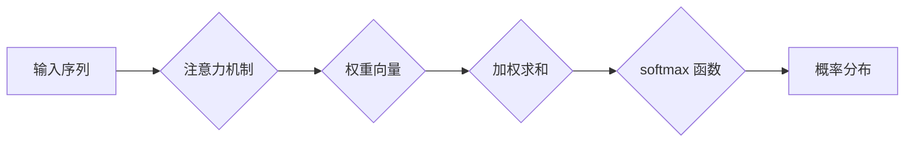

                 

## 第四章：注意力机制和 softmax 函数

> 关键词：注意力机制、softmax 函数、深度学习、自然语言处理、计算机视觉、概率分布、权重分配

### 1. 背景介绍

深度学习的蓬勃发展离不开许多关键技术，其中注意力机制和 softmax 函数是两个至关重要的组成部分。它们共同作用，赋予深度学习模型更强大的学习能力和更精准的预测精度。

**1.1  softmax 函数**

softmax 函数是深度学习中常用的激活函数，它将一个向量映射到一个概率分布。在多分类问题中，softmax 函数可以将神经网络的输出转换为每个类别的概率，从而实现对多个类别的预测。

**1.2  注意力机制**

注意力机制模拟了人类的注意力机制，它允许模型在处理输入序列时，对不同位置的元素给予不同的权重，从而聚焦于最重要的信息。注意力机制在自然语言处理、计算机视觉等领域取得了显著的成果，例如机器翻译、文本摘要、图像识别等。

### 2. 核心概念与联系

**2.1  softmax 函数的作用**

softmax 函数的作用是将一个向量中的每个元素映射到一个介于0到1之间的值，并且所有值的总和等于1。这种映射方式将向量转换为一个概率分布，每个元素代表了对应类别出现的概率。

**2.2  注意力机制的作用**

注意力机制的作用是学习一个权重向量，该向量用于对输入序列中的每个元素进行加权。权重向量中的每个元素代表了模型对该元素的关注程度。通过对输入序列进行加权，注意力机制可以帮助模型聚焦于最重要的信息，从而提高模型的性能。

**2.3  softmax 函数与注意力机制的联系**

softmax 函数和注意力机制在深度学习模型中密切相关。注意力机制通常会生成一个权重向量，然后将这个权重向量与输入序列进行加权求和。最终的输出结果再通过 softmax 函数转换为概率分布，用于预测最终的类别或结果。

**2.4  Mermaid 流程图**



### 3. 核心算法原理 & 具体操作步骤

**3.1  算法原理概述**

注意力机制的核心思想是学习一个权重向量，该向量用于对输入序列中的每个元素进行加权。权重向量中的每个元素代表了模型对该元素的关注程度。通过对输入序列进行加权，注意力机制可以帮助模型聚焦于最重要的信息，从而提高模型的性能。

**3.2  算法步骤详解**

1. **计算查询 (Query)、键 (Key) 和值 (Value) 向量:** 将输入序列映射到三个不同的向量空间，分别称为查询空间、键空间和值空间。
2. **计算注意力分数:** 使用查询向量和键向量之间的相似度计算注意力分数。常用的计算方法包括点积、余弦相似度等。
3. **归一化注意力分数:** 使用 softmax 函数将注意力分数转换为概率分布。
4. **加权求和:** 将值向量与归一化后的注意力分数进行加权求和，得到最终的输出。

**3.3  算法优缺点**

**优点:**

* 可以学习到输入序列中重要的信息，提高模型的性能。
* 可以处理长序列数据，克服传统 RNN 模型的梯度消失问题。

**缺点:**

* 计算复杂度较高，训练时间较长。
* 需要大量的训练数据才能有效学习。

**3.4  算法应用领域**

注意力机制在自然语言处理、计算机视觉等领域取得了显著的成果，例如：

* **机器翻译:** 关注源语言和目标语言之间的对应关系。
* **文本摘要:** 关注文本中最关键的信息。
* **图像识别:** 关注图像中最显著的特征。

### 4. 数学模型和公式 & 详细讲解 & 举例说明

**4.1  数学模型构建**

设输入序列为 $X = \{x_1, x_2, ..., x_n\}$, 其中 $x_i$ 为序列中的第 $i$ 个元素。

* **查询向量 (Query):** $Q = W_q X$
* **键向量 (Key):** $K = W_k X$
* **值向量 (Value):** $V = W_v X$

其中，$W_q$, $W_k$, $W_v$ 为可学习的权重矩阵。

**4.2  公式推导过程**

注意力分数计算公式:

$$
\text{Attention}(Q, K, V) = \text{softmax}(\frac{Q K^T}{\sqrt{d_k}}) V
$$

其中，$d_k$ 为键向量的维度，$K^T$ 为键向量的转置。

**4.3  案例分析与讲解**

假设我们有一个句子 "The cat sat on the mat"，我们想要使用注意力机制来学习每个单词对句子的重要程度。

1. 将句子中的每个单词映射到查询空间、键空间和值空间。
2. 计算每个单词之间的注意力分数。
3. 使用 softmax 函数将注意力分数转换为概率分布。
4. 将值向量与归一化后的注意力分数进行加权求和，得到最终的输出。

通过这种方式，我们可以学习到每个单词对句子的重要程度，例如，"cat" 和 "sat" 的注意力分数可能较高，因为它们是句子的核心信息。

### 5. 项目实践：代码实例和详细解释说明

**5.1  开发环境搭建**

使用 Python 3.x 环境，安装 TensorFlow 或 PyTorch 等深度学习框架。

**5.2  源代码详细实现**

```python
import tensorflow as tf

# 定义注意力机制层
class AttentionLayer(tf.keras.layers.Layer):
    def __init__(self, units):
        super(AttentionLayer, self).__init__()
        self.Wq = tf.keras.layers.Dense(units)
        self.Wk = tf.keras.layers.Dense(units)
        self.Wv = tf.keras.layers.Dense(units)
        self.softmax = tf.keras.layers.Softmax()

    def call(self, inputs):
        # 分别计算查询、键和值向量
        query = self.Wq(inputs)
        key = self.Wk(inputs)
        value = self.Wv(inputs)

        # 计算注意力分数
        attention_scores = tf.matmul(query, key, transpose_b=True) / tf.math.sqrt(tf.cast(key.shape[-1], tf.float32))
        attention_weights = self.softmax(attention_scores)

        # 加权求和
        context_vector = tf.matmul(attention_weights, value)

        return context_vector

# 实例化注意力机制层
attention_layer = AttentionLayer(units=128)

# 输入数据
inputs = tf.random.normal(shape=(1, 10, 512))

# 通过注意力机制层进行处理
outputs = attention_layer(inputs)

print(outputs.shape)
```

**5.3  代码解读与分析**

* 代码首先定义了一个 `AttentionLayer` 类，该类继承自 `tf.keras.layers.Layer`，实现了注意力机制的计算过程。
* `__init__` 方法中定义了三个权重矩阵 `Wq`, `Wk`, `Wv`，用于计算查询、键和值向量。
* `call` 方法中计算注意力分数，使用 softmax 函数将其转换为概率分布，然后对值向量进行加权求和，得到最终的输出。
* 代码实例化了一个 `AttentionLayer` 对象，并使用随机数据进行测试。

**5.4  运行结果展示**

运行代码后，输出结果的形状为 `(1, 10, 128)`，表示注意力机制层将输入序列的每个元素映射到一个 128 维的向量。

### 6. 实际应用场景

**6.1  自然语言处理**

* **机器翻译:** 注意力机制可以帮助模型关注源语言和目标语言之间的对应关系，提高翻译质量。
* **文本摘要:** 注意力机制可以帮助模型识别文本中最关键的信息，生成简洁准确的摘要。
* **问答系统:** 注意力机制可以帮助模型关注问题和答案之间的相关信息，提高问答准确率。

**6.2  计算机视觉**

* **图像识别:** 注意力机制可以帮助模型关注图像中最显著的特征，提高识别精度。
* **目标检测:** 注意力机制可以帮助模型定位图像中的目标，提高检测准确率。
* **图像 Captioning:** 注意力机制可以帮助模型生成图像的描述，提高描述的准确性和流畅度。

**6.3  其他领域**

* **语音识别:** 注意力机制可以帮助模型关注语音信号中的关键信息，提高识别准确率。
* **时间序列分析:** 注意力机制可以帮助模型学习时间序列中的长期依赖关系，提高预测精度。

**6.4  未来应用展望**

随着深度学习技术的不断发展，注意力机制的应用场景将会更加广泛。例如，注意力机制可以应用于药物研发、金融预测、医疗诊断等领域，为人类社会带来更多福祉。

### 7. 工具和资源推荐

**7.1  学习资源推荐**

* **论文:** "Attention Is All You Need" (Vaswani et al., 2017)
* **博客:** "Attention Is All You Need: A Deep Dive" (Jay Alammar)
* **课程:** "Deep Learning Specialization" (Andrew Ng)

**7.2  开发工具推荐**

* **TensorFlow:** https://www.tensorflow.org/
* **PyTorch:** https://pytorch.org/

**7.3  相关论文推荐**

* "BERT: Pre-training of Deep Bidirectional Transformers for Language Understanding" (Devlin et al., 2018)
* "Transformer-XL: Attentive Language Models Beyond a Fixed-Length Context" (Dai et al., 2019)
* "XLNet: Generalized Autoregressive Pretraining for Language Understanding" (Yang et al., 2019)

### 8. 总结：未来发展趋势与挑战

**8.1  研究成果总结**

注意力机制和 softmax 函数是深度学习领域的重要技术，它们共同作用，赋予深度学习模型更强大的学习能力和更精准的预测精度。

**8.2  未来发展趋势**

* **更有效的注意力机制:** 研究更有效的注意力机制，例如自注意力机制、多头注意力机制等，提高模型的性能。
* **注意力机制的应用扩展:** 将注意力机制应用到更多领域，例如药物研发、金融预测、医疗诊断等。
* **注意力机制的可解释性:** 研究注意力机制的可解释性，帮助人们更好地理解模型的决策过程。

**8.3  面临的挑战**

* **计算复杂度:** 注意力机制的计算复杂度较高，需要更高效的算法和硬件支持。
* **数据需求:** 注意力机制需要大量的训练数据才能有效学习。
* **可解释性:** 注意力机制的决策过程相对复杂，难以解释，这限制了其在一些应用场景中的应用。

**8.4  研究展望**

未来，注意力机制和 softmax 函数的研究将继续深入，并与其他深度学习技术相结合，推动深度学习技术的进一步发展。


### 9. 附录：常见问题与解答

**9.1  Q: softmax 函数的输出是什么？**

**A:** softmax 函数的输出是一个概率分布，每个元素代表了对应类别的概率。

**9.2  Q: 注意力机制的计算复杂度如何？**

**A:** 注意力机制的计算复杂度较高，与输入序列长度和模型参数数量有关。

**9.3  Q: 注意力机制有哪些应用场景？**

**A:** 注意力机制在自然语言处理、计算机视觉等领域有广泛的应用场景，例如机器翻译、文本摘要、图像识别等。


作者：禅与计算机程序设计艺术 / Zen and the Art of Computer Programming 
<end_of_turn>

