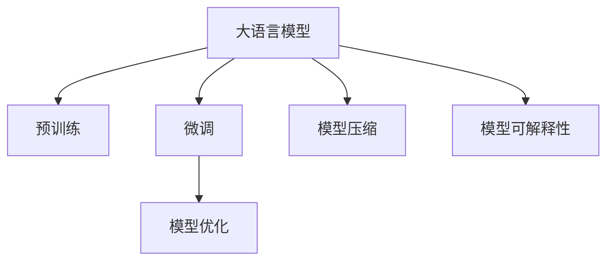

                 

## 1. 背景介绍

### 1.1 问题由来

在人工智能(AI)领域，语言模型(Language Model, LM)已经由传统的统计语言模型(如N-gram模型)发展到了深度学习驱动的神经语言模型。特别是随着Transformer架构的引入，基于深度学习的语言模型在自然语言处理(Natural Language Processing, NLP)任务上取得了前所未有的进展。

从20世纪90年代起，语言模型就成为了AI研究的热点领域。传统的统计语言模型虽然简单高效，但只能处理固定长度的上下文，无法很好地理解语义和语境。而深度学习的语言模型，如循环神经网络(RNN)和卷积神经网络(CNN)，虽然能够处理变长的上下文，但计算复杂度高，训练和推理效率低下。

2008年，Hinton等人提出的神经语言模型BERT，以大规模预训练加微调的方式，将自然语言处理推向了新的高度。随后，GPT、T5等大语言模型(Big Language Models, LLMs)也相继出现，并取得了显著的性能提升。

在实际应用中，大语言模型已被广泛应用于翻译、问答、摘要、文本生成等NLP任务中，并展现出了强大的通用能力和泛化能力。然而，随着大语言模型的日益普及，其在应用层面也暴露出了一些问题。

首先，大语言模型通常需要大量的标注数据进行微调，这在许多应用场景中难以满足。其次，模型训练和推理所需的计算资源和存储资源巨大，难以在资源受限的环境中应用。最后，大语言模型输出结果的可解释性和鲁棒性还有待提升。

为了解决这些问题，大语言模型的生态圈开始涌现出一系列新理念和新方法，旨在构建一个更加开放、灵活和高效的语言处理系统。这些方法包括模型压缩、迁移学习、微调、参数高效微调、提示学习、自监督学习、少样本学习等。

### 1.2 问题核心关键点

构建大语言模型的生态圈，核心在于如何在大规模预训练模型的基础上，通过有效的微调和优化方法，提升模型的应用性能，同时降低资源消耗，提升模型可解释性和鲁棒性。具体来说，主要包括以下几个关键点：

- **大模型预训练**：在大规模无标签语料上预训练语言模型，学习到语言知识，为后续微调打下基础。
- **模型微调**：在特定任务上对预训练模型进行有监督的微调，提升模型的任务适配性。
- **模型压缩**：通过剪枝、量化、知识蒸馏等技术，减小模型尺寸，降低计算资源和存储资源的消耗。
- **模型优化**：应用高效的优化算法和参数调度策略，加速模型的训练和推理，提升性能。
- **模型可解释性**：通过引入因果分析、对抗训练等方法，提升模型的可解释性，使模型的决策过程透明、可信。

这些关键点共同构成了大语言模型生态圈的基础框架，为构建高效、鲁棒的自然语言处理系统提供了重要的方法论。

## 2. 核心概念与联系

### 2.1 核心概念概述

大语言模型生态圈由多个相互关联的核心概念组成，这些概念共同支撑了语言模型的训练、优化、部署和应用。

- **大语言模型(Large Language Models, LLMs)**：以Transformer架构为代表的深度神经网络模型，在大规模无标签数据上进行预训练，学习到通用语言知识，能够在各种NLP任务中发挥出色的性能。

- **预训练(Pre-training)**：在大规模无标签语料上，通过自监督学习任务训练语言模型，学习到语言的知识表示。预训练的模型可以应用于多个下游任务，提升模型的泛化能力。

- **微调(Fine-tuning)**：在预训练模型的基础上，使用下游任务的少量标注数据，通过有监督学习优化模型在特定任务上的性能。微调是提高模型任务适配性的关键手段。

- **模型压缩(Compression)**：通过剪枝、量化、知识蒸馏等技术，减小模型尺寸，降低计算资源和存储资源的消耗，提升模型的实时性和效率。

- **模型优化(Optimization)**：应用高效的优化算法和参数调度策略，加速模型的训练和推理，提升性能。

- **模型可解释性(Interpretability)**：通过引入因果分析、对抗训练等方法，提升模型的可解释性，使模型的决策过程透明、可信。

这些概念之间的逻辑关系可以通过以下Mermaid流程图来展示：



### 2.2 核心概念原理和架构

#### 2.2.1 大语言模型

大语言模型基于Transformer架构，主要由编码器和解码器两部分组成。编码器对输入文本进行编码，生成一系列隐藏表示，解码器根据隐藏表示生成输出文本。Transformer的核心创新在于引入了自注意力机制，能够高效地捕捉长距离依赖关系，提升了模型的语言理解和生成能力。

以BERT为例，其架构主要由多层Transformer组成，每一层包含多个注意力头和多头注意力机制。BERT在大规模语料上进行掩码语言模型预训练，学习到词嵌入和句子表示，并具有泛化的能力。


#### 2.2.2 预训练

预训练的目的是在无标签数据上训练语言模型，学习到语言的通用知识表示。常见的预训练任务包括掩码语言模型、下位表示预测、句子分类等。预训练的模型可以应用于多个下游任务，提升模型的泛化能力。

以掩码语言模型为例，模型需要预测被掩码的单词，从而学习到词语之间的关系和语境。通过在大规模语料上进行掩码语言模型预训练，BERT能够学习到丰富的语言知识，提升其在各种NLP任务上的性能。


#### 2.2.3 微调

微调的目的是在特定任务上对预训练模型进行有监督学习，优化模型的任务适配性。微调通常需要少量标注数据，能够快速提升模型在特定任务上的性能。

以文本分类任务为例，模型需要学习文本与类别之间的映射关系。通过在文本分类数据集上进行微调，BERT能够学习到具体的任务知识，提升其在文本分类任务上的表现。


#### 2.2.4 模型压缩

模型压缩的目的是减小模型尺寸，降低计算资源和存储资源的消耗，提升模型的实时性和效率。常见的压缩技术包括剪枝、量化、知识蒸馏等。

以剪枝为例，通过删除模型中冗余和不重要的参数，可以减小模型尺寸，降低计算和存储资源消耗。剪枝后的模型可以更快速地进行推理，提升实时性。


#### 2.2.5 模型优化

模型优化是指通过高效的优化算法和参数调度策略，加速模型的训练和推理，提升性能。常见的优化算法包括Adam、SGD等，参数调度策略包括学习率衰减、动量等。

以Adam算法为例，通过自适应学习率调整，可以更快地收敛到最优解，提升训练效率。Adam算法在大规模语言模型上表现出色，能够高效地训练复杂的神经网络模型。


#### 2.2.6 模型可解释性

模型可解释性的目的是通过引入因果分析、对抗训练等方法，提升模型的可解释性，使模型的决策过程透明、可信。

以因果分析为例，通过引入因果关系，可以更好地理解模型的决策过程，提升模型的可解释性。因果分析可以帮助模型识别出重要的特征和决策点，提高模型的透明度和可信度。


### 2.3 核心概念之间的联系

大语言模型生态圈中的各个核心概念相互关联，共同构成了语言模型的训练、优化、部署和应用的全流程。具体来说，它们之间的关系如下：

- 预训练是大语言模型的基础，通过大规模无标签语料训练，学习到语言的知识表示。
- 微调是在预训练模型的基础上，通过有监督学习优化模型在特定任务上的性能，提升模型的任务适配性。
- 模型压缩是通过剪枝、量化、知识蒸馏等技术，减小模型尺寸，降低计算资源和存储资源的消耗，提升模型的实时性和效率。
- 模型优化是通过高效的优化算法和参数调度策略，加速模型的训练和推理，提升性能。
- 模型可解释性是通过引入因果分析、对抗训练等方法，提升模型的可解释性，使模型的决策过程透明、可信。

## 3. 核心算法原理 & 具体操作步骤

### 3.1 算法原理概述

大语言模型的生态圈包含了多个核心算法，这些算法相互配合，共同提升了语言模型的应用性能。

- **预训练算法**：通过大规模无标签语料训练语言模型，学习到语言的知识表示。常见的预训练算法包括掩码语言模型、下位表示预测等。
- **微调算法**：在特定任务上对预训练模型进行有监督学习，优化模型在特定任务上的性能。微调算法通常需要少量标注数据，能够快速提升模型在特定任务上的表现。
- **模型压缩算法**：通过剪枝、量化、知识蒸馏等技术，减小模型尺寸，降低计算资源和存储资源的消耗，提升模型的实时性和效率。
- **模型优化算法**：通过高效的优化算法和参数调度策略，加速模型的训练和推理，提升性能。常见的优化算法包括Adam、SGD等。
- **模型可解释性算法**：通过引入因果分析、对抗训练等方法，提升模型的可解释性，使模型的决策过程透明、可信。

### 3.2 算法步骤详解

#### 3.2.1 预训练算法步骤

1. 准备大规模无标签语料：收集大规模的文本数据，作为预训练模型的训练数据。
2. 设计预训练任务：设计预训练任务，如掩码语言模型、下位表示预测等。
3. 训练语言模型：在预训练数据上进行训练，学习到语言的知识表示。
4. 评估模型性能：在预训练数据上评估模型性能，确保模型学习到了足够的语言知识。

#### 3.2.2 微调算法步骤

1. 准备下游任务标注数据：收集下游任务的少量标注数据，作为微调的训练数据。
2. 设计任务适配层：设计任务适配层，将预训练模型的输出映射到下游任务的任务空间。
3. 微调模型：在标注数据上对预训练模型进行微调，优化模型在特定任务上的性能。
4. 评估模型性能：在测试数据上评估模型性能，确保微调后的模型在特定任务上表现良好。

#### 3.2.3 模型压缩算法步骤

1. 剪枝：删除模型中冗余和不重要的参数，减小模型尺寸。
2. 量化：将浮点模型转为定点模型，压缩存储空间，提高计算效率。
3. 知识蒸馏：将大型模型与小型模型结合，传递知识，提高小型模型的性能。

#### 3.2.4 模型优化算法步骤

1. 选择优化算法：选择高效的优化算法，如Adam、SGD等。
2. 设计参数调度策略：设计学习率、动量等参数的调度策略，优化模型的训练过程。
3. 加速模型训练：通过优化算法和参数调度策略，加速模型的训练和推理过程。

#### 3.2.5 模型可解释性算法步骤

1. 引入因果分析：引入因果关系，理解模型的决策过程。
2. 对抗训练：通过对抗样本训练，提升模型的鲁棒性和泛化能力。
3. 可解释性评估：通过可解释性评估方法，评估模型的可解释性，提升模型的透明度和可信度。

### 3.3 算法优缺点

#### 3.3.1 预训练算法的优缺点

**优点**：
- 能够学习到大规模无标签语料中的语言知识。
- 适用于多种NLP任务，泛化能力较强。

**缺点**：
- 需要大量计算资源和存储资源，训练和推理效率较低。
- 难以学习到特定领域或任务的特定知识。

#### 3.3.2 微调算法的优缺点

**优点**：
- 能够快速提升模型在特定任务上的性能。
- 适用于多种NLP任务，易于实现。

**缺点**：
- 需要少量标注数据，数据获取成本较高。
- 微调过程容易过拟合，需要设置合适的正则化策略。

#### 3.3.3 模型压缩算法的优缺点

**优点**：
- 能够减小模型尺寸，降低计算资源和存储资源的消耗。
- 提升模型的实时性和效率，适用于大规模部署场景。

**缺点**：
- 压缩后的模型性能可能有所下降，需要进一步优化。
- 压缩技术复杂，实现难度较大。

#### 3.3.4 模型优化算法的优缺点

**优点**：
- 能够加速模型的训练和推理过程，提升性能。
- 适用于多种NLP任务，易于实现。

**缺点**：
- 需要调整超参数，寻找最优参数组合。
- 优化算法复杂，实现难度较大。

#### 3.3.5 模型可解释性算法的优缺点

**优点**：
- 能够提升模型的可解释性，使模型的决策过程透明、可信。
- 适用于多种NLP任务，易于实现。

**缺点**：
- 可解释性提升有限，模型决策过程仍难以完全理解。
- 可解释性方法复杂，实现难度较大。

### 3.4 算法应用领域

大语言模型的生态圈在多个领域中得到了广泛应用，包括自然语言处理、机器翻译、语音识别、智能客服、智慧医疗等。

- **自然语言处理**：大语言模型在文本分类、命名实体识别、关系抽取等NLP任务中表现出色，提升了文本处理的自动化水平。
- **机器翻译**：大语言模型在机器翻译任务中取得了显著进展，提升了文本的翻译质量和效率。
- **语音识别**：大语言模型在语音识别和语音合成中得到了应用，提升了人机交互的智能化水平。
- **智能客服**：大语言模型在智能客服中得到了应用，提升了客户咨询的响应速度和满意度。
- **智慧医疗**：大语言模型在医疗问答、病历分析、药物研发等医疗任务中得到了应用，提升了医疗服务的智能化水平。

## 4. 数学模型和公式 & 详细讲解 & 举例说明

### 4.1 数学模型构建

大语言模型的生态圈中涉及多个数学模型，这些模型共同支撑了语言模型的训练、优化、部署和应用的全流程。

- **预训练模型**：通过大规模无标签语料训练语言模型，学习到语言的知识表示。常用的预训练模型包括BERT、GPT等。
- **微调模型**：在特定任务上对预训练模型进行有监督学习，优化模型在特定任务上的性能。常用的微调模型包括AdaLoRA等。
- **模型压缩模型**：通过剪枝、量化、知识蒸馏等技术，减小模型尺寸，降低计算资源和存储资源的消耗。常用的模型压缩技术包括知识蒸馏、剪枝等。
- **模型优化模型**：通过高效的优化算法和参数调度策略，加速模型的训练和推理，提升性能。常用的优化算法包括Adam、SGD等。
- **模型可解释性模型**：通过引入因果分析、对抗训练等方法，提升模型的可解释性，使模型的决策过程透明、可信。常用的可解释性方法包括因果分析、对抗训练等。

### 4.2 公式推导过程

#### 4.2.1 预训练模型公式

预训练模型通常基于自注意力机制进行训练，以大规模无标签语料为输入，学习到语言的知识表示。以BERT为例，其预训练模型的训练公式如下：

$$
L = -\frac{1}{N} \sum_{i=1}^{N} \sum_{j=1}^{M} \log \frac{e^{s(x_i, h_j)}}{\sum_{k=1}^{M} e^{s(x_i, h_k)}}
$$

其中，$x_i$ 为输入文本，$h_j$ 为模型输出，$s$ 为注意力函数，$N$ 和 $M$ 分别为训练样本数和注意力机制头数。

#### 4.2.2 微调模型公式

微调模型的训练公式与预训练模型类似，但在下游任务上增加了任务适配层，以优化模型在特定任务上的性能。以文本分类任务为例，微调模型的训练公式如下：

$$
L = -\frac{1}{N} \sum_{i=1}^{N} \log p(y_i|x_i)
$$

其中，$y_i$ 为标签，$x_i$ 为输入文本，$p$ 为条件概率函数。

#### 4.2.3 模型压缩模型公式

模型压缩模型的目标是减小模型尺寸，降低计算资源和存储资源的消耗。以剪枝为例，剪枝模型的训练公式如下：

$$
L = L_{pre-training} + \lambda \sum_{k=1}^{K} W_k
$$

其中，$W_k$ 为第 $k$ 层的参数大小，$\lambda$ 为正则化系数。

#### 4.2.4 模型优化模型公式

模型优化模型的目标是加速模型的训练和推理过程，提升性能。以Adam算法为例，其优化公式如下：

$$
m_t = \beta_1 m_{t-1} + (1-\beta_1) g_t
$$

$$
v_t = \beta_2 v_{t-1} + (1-\beta_2) g_t^2
$$

$$
\theta_{t+1} = \theta_t - \eta (\frac{m_t}{\sqrt{v_t}+\epsilon} + \frac{\lambda}{2} \theta_t)
$$

其中，$m_t$ 和 $v_t$ 分别为梯度和平方梯度的一阶矩估计和二阶矩估计，$\eta$ 为学习率，$\lambda$ 为正则化系数。

#### 4.2.5 模型可解释性模型公式

模型可解释性模型的目标是提升模型的可解释性，使模型的决策过程透明、可信。以因果分析为例，其训练公式如下：

$$
L = L_{pre-training} + \lambda \sum_{i=1}^{N} \sum_{j=1}^{M} (y_j - s(x_i, h_j))
$$

其中，$y_j$ 为预测结果，$h_j$ 为模型输出，$s$ 为因果关系函数，$N$ 和 $M$ 分别为训练样本数和模型输出维数。

### 4.3 案例分析与讲解

#### 4.3.1 BERT预训练案例

BERT的预训练模型基于Transformer架构，通过掩码语言模型和下位表示预测等任务进行训练，学习到语言的知识表示。以掩码语言模型为例，其训练过程如下：

1. 随机掩盖输入文本中的部分单词，生成掩码语言模型任务。
2. 将掩码后的文本输入BERT模型，预测被掩盖的单词。
3. 计算预测结果与真实标签之间的交叉熵损失，反向传播更新模型参数。
4. 重复上述过程，直至模型收敛。

#### 4.3.2 AdaLoRA微调案例

AdaLoRA是一种参数高效微调方法，可以在不增加模型参数量的情况下，提升微调效果。以文本分类任务为例，AdaLoRA的微调过程如下：

1. 选择预训练模型BERT作为初始化参数。
2. 设计任务适配层，将BERT的输出映射到下游任务的标签空间。
3. 在少量标注数据上对BERT进行微调，优化任务适配层的参数。
4. 在测试数据上评估微调后的模型性能，确保微调效果良好。

#### 4.3.3 剪枝模型压缩案例

剪枝是一种常见的模型压缩方法，可以通过删除冗余和不重要的参数，减小模型尺寸。以BERT剪枝为例，其压缩过程如下：

1. 计算BERT模型的各个参数的重要性，选择重要性较低的参数进行剪枝。
2. 将剪枝后的模型保存，进行测试评估，确保压缩后的模型性能不受影响。

#### 4.3.4 Adam优化模型案例

Adam算法是一种高效的优化算法，可以通过自适应学习率调整，加速模型的训练和推理过程。以BERT优化为例，其优化过程如下：

1. 选择Adam算法作为优化算法。
2. 设计学习率、动量等参数的调度策略，优化模型的训练过程。
3. 在训练数据上训练BERT模型，调整学习率等参数。
4. 在测试数据上评估优化后的模型性能，确保优化效果良好。

#### 4.3.5 因果分析模型可解释性案例

因果分析是一种提升模型可解释性的方法，可以通过引入因果关系，理解模型的决策过程。以BERT因果分析为例，其可解释性过程如下：

1. 在训练数据中引入因果关系，计算模型对因果关系的预测。
2. 分析因果关系的预测结果，理解模型的决策过程。
3. 在测试数据上评估因果分析的准确性，确保可解释性提升有效。

## 5. 项目实践：代码实例和详细解释说明

### 5.1 开发环境搭建

在进行项目实践前，我们需要准备好开发环境。以下是使用Python进行PyTorch开发的环境配置流程：

1. 安装Anaconda：从官网下载并安装Anaconda，用于创建独立的Python环境。

2. 创建并激活虚拟环境：
```bash
conda create -n pytorch-env python=3.8 
conda activate pytorch-env
```

3. 安装PyTorch：根据CUDA版本，从官网获取对应的安装命令。例如：
```bash
conda install pytorch torchvision torchaudio cudatoolkit=11.1 -c pytorch -c conda-forge
```

4. 安装Transformer库：
```bash
pip install transformers
```

5. 安装各类工具包：
```bash
pip install numpy pandas scikit-learn matplotlib tqdm jupyter notebook ipython
```

完成上述步骤后，即可在`pytorch-env`环境中开始项目实践。

### 5.2 源代码详细实现

这里以BERT微调案例为例，给出使用Transformers库进行微调的PyTorch代码实现。

首先，定义数据处理函数：

```python
from transformers import BertTokenizer
from torch.utils.data import Dataset
import torch

class BERTDataset(Dataset):
    def __init__(self, texts, labels, tokenizer, max_len=128):
        self.texts = texts
        self.labels = labels
        self.tokenizer = tokenizer
        self.max_len = max_len
        
    def __len__(self):
        return len(self.texts)
    
    def __getitem__(self, item):
        text = self.texts[item]
        label = self.labels[item]
        
        encoding = self.tokenizer(text, return_tensors='pt', max_length=self.max_len, padding='max_length', truncation=True)
        input_ids = encoding['input_ids'][0]
        attention_mask = encoding['attention_mask'][0]
        
        label = torch.tensor(label, dtype=torch.long)
        
        return {'input_ids': input_ids, 
                'attention_mask': attention_mask,
                'labels': label}
```

然后，定义模型和优化器：

```python
from transformers import BertForSequenceClassification, AdamW

model = BertForSequenceClassification.from_pretrained('bert-base-cased', num_labels=2)

optimizer = AdamW(model.parameters(), lr=2e-5)
```

接着，定义训练和评估函数：

```python
from torch.utils.data import DataLoader
from tqdm import tqdm
from sklearn.metrics import classification_report

device = torch.device('cuda') if torch.cuda.is_available() else torch.device('cpu')
model.to(device)

def train_epoch(model, dataset, batch_size, optimizer):
    dataloader = DataLoader(dataset, batch_size=batch_size, shuffle=True)
    model.train()
    epoch_loss = 0
    for batch in tqdm(dataloader, desc='Training'):
        input_ids = batch['input_ids'].to(device)
        attention_mask = batch['attention_mask'].to(device)
        labels = batch['labels'].to(device)
        model.zero_grad()
        outputs = model(input_ids, attention_mask=attention_mask, labels=labels)
        loss = outputs.loss
        epoch_loss += loss.item()
        loss.backward()
        optimizer.step()
    return epoch_loss / len(dataloader)

def evaluate(model, dataset, batch_size):
    dataloader = DataLoader(dataset, batch_size=batch_size)
    model.eval()
    preds, labels = [], []
    with torch.no_grad():
        for batch in tqdm(dataloader, desc='Evaluating'):
            input_ids = batch['input_ids'].to(device)
            attention_mask = batch['attention_mask'].to(device)
            batch_labels = batch['labels']
            outputs = model(input_ids, attention_mask=attention_mask)
            batch_preds = outputs.logits.argmax(dim=2).to('cpu').tolist()
            batch_labels = batch_labels.to('cpu').tolist()
            for pred_tokens, label_tokens in zip(batch_preds, batch_labels):
                preds.append(pred_tokens[:len(label_tokens)])
                labels.append(label_tokens)
                
    print(classification_report(labels, preds))
```

最后，启动训练流程并在测试集上评估：

```python
epochs = 5
batch_size = 16

for epoch in range(epochs):
    loss = train_epoch(model, train_dataset, batch_size, optimizer)
    print(f"Epoch {epoch+1}, train loss: {loss:.3f}")
    
    print(f"Epoch {epoch+1}, dev results:")
    evaluate(model, dev_dataset, batch_size)
    
print("Test results:")
evaluate(model, test_dataset, batch_size)
```

以上就是使用PyTorch对BERT进行文本分类任务微调的完整代码实现。可以看到，得益于Transformer库的强大封装，我们可以用相对简洁的代码完成BERT模型的加载和微调。

### 5.3 代码解读与分析

让我们再详细解读一下关键代码的实现细节：

**BERTDataset类**：
- `__init__`方法：初始化文本、标签、分词器等关键组件。
- `__len__`方法：返回数据集的样本数量。
- `__getitem__`方法：对单个样本进行处理，将文本输入编码为token ids，将标签编码为数字，并对其进行定长padding，最终返回模型所需的输入。

**训练和评估函数**：
- 使用PyTorch的DataLoader对数据集进行批次化加载，供模型训练和推理使用。
- 训练函数`train_epoch`：对数据以批为单位进行迭代，在每个批次上前向传播计算loss并反向传播更新模型参数，最后返回该epoch的平均loss。
- 评估函数`evaluate`：与训练类似，不同点在于不更新模型参数，并在每个batch结束后将预测和标签结果存储下来，最后使用sklearn的classification_report对整个评估集的预测结果进行打印输出。

**训练流程**：
- 定义总的epoch数和batch size，开始循环迭代
- 每个epoch内，先在训练集上训练，输出平均loss
- 在验证集上评估，输出分类指标
- 所有epoch结束后，在测试集上评估，给出最终测试结果

可以看到，PyTorch配合Transformer库使得BERT微调的代码实现变得简洁高效。开发者可以将更多精力放在数据处理、模型改进等高层逻辑上，而不必过多关注底层的实现细节。

当然，工业级的系统实现还需考虑更多因素，如模型的保存和部署、超参数的自动搜索、更灵活的任务适配层等。但核心的微调范式基本与此类似。

## 6. 实际应用场景

### 6.1 智能客服系统

基于大语言模型微调的对话技术，可以广泛应用于智能客服系统的构建。传统客服往往需要配备大量人力，高峰期响应缓慢，且一致性和专业性难以保证。而使用微调后的对话模型，可以7x24小时不间断服务，快速响应客户咨询，用自然流畅的语言解答各类常见问题。

在技术实现上，可以收集企业内部的历史客服对话记录，将问题和最佳答复构建成监督数据，在此基础上对预训练对话模型进行微调。微调后的对话模型能够自动理解用户意图，匹配最合适的答案模板进行回复。对于客户提出的新问题，还可以接入检索系统实时搜索相关内容，动态组织生成回答。如此构建的智能客服系统，能大幅提升客户咨询体验和问题解决效率。

### 6.2 金融舆情监测

金融机构需要实时监测市场舆论动向，以便及时应对负面信息传播，规避金融风险。传统的人工监测方式成本高、效率低，难以应对网络时代海量信息爆发的挑战。基于大语言模型微调的文本分类和情感分析技术，为金融舆情监测提供了新的解决方案。

具体而言，可以收集金融领域相关的新闻、报道、评论等文本数据，并对其进行主题标注和情感标注。在此基础上对预训练语言模型进行微调，使其能够自动判断文本属于何种主题，情感倾向是正面、中性还是负面。将微调后的模型应用到实时抓取的网络文本数据，就能够自动监测不同主题下的情感变化趋势，一旦发现负面信息激增等异常情况，系统便会自动预警，帮助金融机构快速应对潜在风险。

### 6.3 个性化推荐系统

当前的推荐系统往往只依赖用户的历史行为数据进行物品推荐，无法深入理解用户的真实兴趣偏好。基于大语言模型微调技术，个性化推荐系统可以更好地挖掘用户行为背后的语义信息，从而提供更精准、多样的推荐内容。

在实践中，可以收集用户浏览、点击、评论、分享等行为数据，提取和用户交互的物品标题、描述、标签等文本内容。将文本内容作为模型输入，用户的后续行为（如是否点击、购买等）作为监督信号，在此基础上微调预训练语言模型。微调后的模型能够从文本内容中准确把握用户的兴趣点。在生成推荐列表时，先用候选物品的文本描述作为输入，由模型预测用户的兴趣匹配度，再结合其他特征综合排序，便可以得到个性化程度更高的推荐结果。

### 6.4 未来应用展望

随着大语言模型微调方法的发展，其在NLP领域的应用场景将不断拓展。以下是未来可能出现的一些新应用方向：

1. **医疗领域**：基于微调的对话模型可以用于医疗问答、病历分析、药物研发等任务，辅助医生诊疗，加速新药开发进程。
2. **教育领域**：微调技术可以应用于作业批改、学情分析、知识推荐等方面，因材施教，促进教育公平，提高教学质量。
3. **金融领域**：微调模型可以用于舆情监测、情感分析、金融预测等任务，提升金融服务的智能化水平。
4. **智能交通**：基于微调的语音识别和对话模型可以用于智能交通导航、语音控制等任务，提升交通系统的智能化水平。
5. **智慧家居**：微调模型可以用于智能语音交互、智能场景识别等任务，提升智慧家居的智能化水平。

## 7. 工具和资源推荐

### 7.1 学习资源推荐

为了帮助开发者系统掌握大语言模型微调的理论基础和实践技巧，这里推荐一些优质的学习资源：

1. 《Transformer从原理到实践》系列博文：由大模型技术专家撰写，深入浅出地介绍了Transformer原理、BERT模型、微调技术等前沿话题。

2. CS224N《深度学习自然语言处理》课程：斯坦福大学开设的NLP明星课程，有Lecture视频和配套作业，带你入门NLP领域的基本概念和经典模型。

3. 《Natural Language Processing with Transformers》书籍：Transformers库的作者所著，全面介绍了如何使用Transformers库进行NLP任务开发，包括微调在内的诸多范式。

4. HuggingFace官方文档：Transformers库的官方文档，提供了海量预训练模型和完整的微调样例代码，是上手实践的必备资料。

5. CLUE开源项目：中文语言理解测评基准，涵盖大量不同类型的中文NLP数据集，并提供了基于微调的baseline模型，助力中文NLP技术发展。

通过对这些资源的学习实践，相信你一定能够快速掌握大语言模型微调的精髓，并用于解决实际的NLP问题。

### 7.2 开发工具推荐

高效的开发离不开优秀的工具支持。以下是几款用于大语言模型微调开发的常用工具：

1. PyTorch：基于Python的开源深度学习框架，灵活动态的计算图，适合快速迭代研究。大部分预训练语言模型都有PyTorch版本的实现。

2. TensorFlow：由Google主导开发的开源深度学习框架，生产部署方便，适合大规模工程应用。同样有丰富的预训练语言模型资源。

3. Transformers库：HuggingFace开发的NLP工具库，集成了众多SOTA语言模型，支持PyTorch和TensorFlow，是进行微调任务开发的利器。

4. Weights & Biases：模型训练的实验跟踪工具，可以记录和可视化模型训练过程中的各项指标，方便对比和调优。与主流深度学习框架无缝集成。

5. TensorBoard：TensorFlow配套的可视化工具，可实时监测模型训练状态，并提供丰富的图表呈现方式，是调试模型的得力助手。

6. Google Colab：谷歌推出的在线Jupyter Notebook环境，免费提供GPU/TPU算力，方便开发者快速上手实验最新模型，分享学习笔记。

合理利用这些工具，可以显著提升大语言模型微调任务的开发效率，加快创新迭代的步伐。

### 7.3 相关论文推荐

大语言模型和微调技术的发展源于学界的持续研究。以下是几篇奠基性的相关论文，推荐阅读：

1. Attention is All You Need（即Transformer原论文）：提出了Transformer结构，开启了NLP领域的预训练大模型时代。

2. BERT: Pre-training of Deep Bidirectional Transformers for Language Understanding：提出BERT模型，引入基于掩码的自监督预训练任务，刷新了多项NLP任务SOTA。

3. Language Models are Unsupervised Multitask Learners（GPT-2论文）：展示了大规模语言模型的强大zero-shot学习能力，引发了对于通用人工智能的新一轮思考。

4. Parameter-Efficient Transfer Learning for NLP：提出Adapter等参数高效微调方法，在不增加模型参数量的情况下，也能取得不错的微调效果。

5. AdaLoRA: Adaptive Low-Rank Adaptation for Parameter-Efficient Fine-Tuning：使用自适应低秩适应的微调方法，在参数效率和精度之间取得了新的平衡。

6. Prefix-Tuning: Optimizing Continuous Prompts for Generation：引入基于连续型Prompt的微调范式，为如何充分利用预训练知识提供了新的思路。

这些论文代表了大语言模型微调技术的发展脉络。通过学习这些前沿成果，可以帮助研究者把握学科前进方向，激发更多的创新灵感。

## 8. 总结：未来发展趋势与挑战

### 8.1 研究成果总结

大语言模型的生态圈近年来取得了显著进展，预训练和微调技术在多个NLP任务上刷新了最先进的性能指标。通过大模型预训练和微调，可以实现高效、鲁棒的自然语言处理，提升模型的任务适配性和泛化能力。

### 8.2 未来发展趋势

展望未来，大语言模型生态圈的发展趋势如下：

1. **模型规模不断增大**：随着算力成本的下降和数据规模的扩张，预训练语言模型的参数量还将持续增长。超大规模语言模型蕴含的丰富语言知识，有望支撑更加复杂多变的下游任务微调。

2. **微调方法更加多样化**：除了传统的全参数微调外，未来将涌现更多参数高效的微调方法，如Prefix-Tuning、LoRA等，在节省计算资源的同时也能保证微调精度。

3. **持续学习成为常态**：随着数据分布的不断变化，微调模型也需要持续学习新知识以保持性能。如何在不遗忘原有知识的同时，高效吸收新样本信息，将成为重要的研究课题。

4. **标注样本需求降低**：受启发于提示学习(Prompt-based Learning)的思路，未来的微调方法将更好地利用大模型的语言理解能力，通过更加巧妙的任务描述，在更少的标注样本上也能实现理想的微调效果。

5. **多模态微调崛起**：当前的微调主要聚焦于纯文本数据，未来会进一步拓展到图像、视频、语音等多模态数据微调。多模态信息的融合，将显著提升语言模型对现实世界的理解和建模能力。

6. **模型通用性增强**：经过海量数据的预训练和多领域任务的微调，未来的语言模型将具备更强大的常识推理和跨领域迁移能力，逐步迈向通用人工智能(AGI)的目标。

以上趋势凸显了大语言模型生态圈的发展前景。这些方向的探索发展，必将进一步提升NLP系统的性能和应用范围，为人类认知智能的进化带来深远影响。

### 8.3 面临的挑战

尽管大语言模型生态圈取得了显著进展，但在迈向更加智能化、普适化应用的过程中，它仍面临诸多挑战：

1. **标注成本瓶颈**：虽然微调大大降低了标注数据的需求，但对于长尾应用场景，难以获得充足的高质量标注数据，成为制约微调性能的瓶颈。如何进一步降低微调对标注样本的依赖，将是一大难题。

2. **模型鲁棒性不足**：当前微调模型面对域外数据时，泛化性能往往大打折扣。对于测试样本的微小扰动，微调模型的预测也容易发生波动。如何提高微调模型的鲁棒性，避免灾难性遗忘，还需要更多理论和实践的积累。

3. **推理效率有待提高**：大规模语言模型虽然精度高，但在实际部署时往往面临推理速度慢、内存占用大等效率问题。如何在保证性能的同时，简化模型结构，提升推理速度，优化资源占用，将是重要的优化方向。

4. **可解释性亟需加强**：当前微调模型更像是"黑盒"系统，难以解释其内部工作机制和决策逻辑。对于医疗、金融等高风险应用，算法的可解释性和可审计性尤为重要。如何赋予微调模型更强的可解释性，将是亟待攻克的难题。

5. **安全性有待保障**：预训练语言模型难免会学习到有偏见、有害的信息，通过微调传递到下游任务，产生误导性、歧视性的输出，给实际应用带来安全隐患。如何从数据和算法层面消除模型偏见，避免恶意用途，确保输出的安全性，也将是重要的研究课题。

6. **知识整合能力不足**：现有的微调模型往往局限于任务内数据，难以灵活吸收和运用更广泛的先验知识。如何让微调过程更好地与外部知识库、规则库等专家知识结合，形成更加全面、准确的信息整合能力，还有很大的想象空间。

正视微调面临的这些挑战，积极应对并寻求突破，将是大语言模型生态圈走向成熟的必由之路。相信随着学界和产业界的共同努力，这些挑战终将一一被克服，大语言模型生态圈必将在构建安全、可靠、可解释、可控的智能系统中扮演越来越重要的角色。

### 8.4 研究展望

未来，大语言模型生态圈的研究将从以下几个方向进行探索：

1. **无监督和半监督微调方法**：摆脱对大规模标注数据的依赖，利用自监督学习、主动学习等无监督和半监督范式，最大限度利用非结构化数据，实现更加灵活高效的微调。

2. **参数高效和计算高效的微调范式**：开发更加参数高效的微调方法，在固定大部分预训练参数的同时，只更新极少量的任务相关参数。同时优化微调模型的计算图，减少前向传播和反向传播的资源消耗，实现更加轻量级、实时性的部署。

3. **因果分析和对比学习范式**：通过引入因果推断和对比学习思想，增强微调模型建立稳定因果关系的能力，学习更加普适、鲁棒的语言表征，从而提升模型泛化性和抗干扰能力。

4. **融合多模态数据**：将符号化的先验知识，如知识图谱、逻辑规则等，与神经网络模型进行巧妙融合，引导微调过程学习更准确、合理的语言模型。同时加强不同模态数据的整合，实现视觉、语音等多模态信息与文本信息的协同建模。

5. **结合因果分析和博弈论工具**：将因果分析方法引入微调模型，识别出模型决策的关键特征，增强输出解释的因果性和逻辑性。借助博弈论工具刻画人机交互过程，主动探索并规避模型的脆弱点，提高系统稳定性。

6. **纳入伦理道德约束**：在模型训练目标中引入伦理导向的评估指标，过滤和惩罚有偏见、有害的输出倾向。同时加强人工干预和审核，建立模型行为的监管机制，确保输出符合人类价值观和伦理道德。

这些研究方向的探索，必将引领大语言模型生态圈迈向更高的台阶，为构建安全、可靠、可解释、可控的智能系统铺平道路。面向未来，大语言模型生态圈还需要与其他人工智能技术进行更深入的融合，如知识表示、因果推理、强化学习等，多路径协同发力，共同推动自然语言理解和智能交互系统的进步。只有勇于创新、敢于突破，才能不断拓展语言模型的边界，让智能技术更好地造福人类社会。

