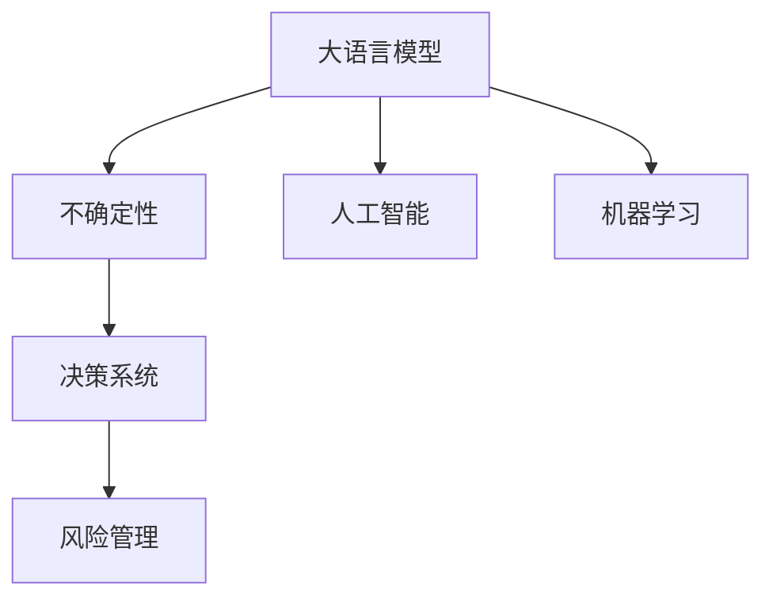

                 

# LLM的不确定性：AI决策中的风险与管理

> 关键词：大语言模型,不确定性,风险管理,决策系统,人工智能,机器学习

## 1. 背景介绍

### 1.1 问题由来
人工智能（AI），尤其是自然语言处理（NLP）领域的大语言模型（Large Language Models, LLMs），正逐步走向实用化。这些模型基于大规模数据进行预训练，通过微调可适应各种NLP任务。然而，它们在决策过程和输出结果上存在一定的不确定性，这不仅影响了模型性能的可靠性，也带来了一系列潜在风险。如何评估和管控这些不确定性，成为AI决策系统设计者亟需解决的问题。

### 1.2 问题核心关键点
本研究聚焦于LLM在决策系统中的应用中，如何评估和管控其不确定性。通过深入分析不确定性的来源和特点，提出了一套风险管理策略，以增强LLM的决策稳定性和可靠性。

### 1.3 问题研究意义
本研究有助于揭示LLM在实际应用中的不确定性机制，指导未来AI决策系统的设计和改进，促进人工智能技术的稳健发展。

## 2. 核心概念与联系

### 2.1 核心概念概述

为更好地理解LLM在决策系统中的不确定性，本节将介绍几个关键概念：

- **大语言模型 (LLM)**：指通过自监督预训练获得通用语言能力的模型，如GPT、BERT等。这些模型通过学习大规模文本数据，具备强大的语言理解和生成能力。
- **不确定性 (Uncertainty)**：指在模型预测中存在的多种可能结果，这些结果概率分布具有多样性。如分类任务中多分类结果，生成任务中的多种可能的生成结果。
- **风险管理 (Risk Management)**：指评估和管理模型决策带来的潜在损失，如决策偏差、对抗攻击等。
- **决策系统 (Decision System)**：使用AI模型进行决策的系统，常见于金融、医疗、司法等领域。
- **人工智能 (AI)**：基于算法、数据、计算等技术，模拟人类智能活动的领域。
- **机器学习 (ML)**：指通过算法和统计模型，利用数据进行学习和决策的领域。

这些概念之间的逻辑关系可以通过以下Mermaid流程图来展示：



这个流程图展示了大语言模型在AI决策系统中的应用框架，从预训练到微调再到风险管理的过程。

## 3. 核心算法原理 & 具体操作步骤
### 3.1 算法原理概述

LLM的不确定性源自其复杂多变的决策过程。在处理自然语言输入时，LLM通过概率模型进行决策，这意味着模型可能输出多种结果，每种结果有一定概率。这些不确定性因素主要来源于：

1. **数据多样性**：预训练和微调数据的多样性和噪声。
2. **模型结构复杂性**：大模型通常包含大量参数，导致决策过程复杂。
3. **参数微调带来的影响**：微调过程可能改变模型原始分布，引入新的不确定性。

因此，评估和管控LLM的不确定性，需要从数据、模型和决策过程等多个角度进行考量。

### 3.2 算法步骤详解

评估和管控LLM的不确定性，通常分为以下步骤：

**Step 1: 数据收集与预处理**
- 收集多源、多类型的数据，确保数据多样性和代表性。
- 对数据进行清洗、归一化等预处理，减少噪声影响。

**Step 2: 不确定性评估**
- 使用模型诊断工具，如敏感度分析、影响度分析、梯度分析等，评估模型在不同输入和参数变化下的不确定性。
- 构建不确定性图谱，可视化不同输入和参数对不确定性的影响。

**Step 3: 风险评估**
- 基于模型不确定性，评估潜在的决策风险，如偏差、错误分类、对抗攻击等。
- 利用风险度量模型，计算决策系统在不同情境下的损失期望值。

**Step 4: 风险控制**
- 采用正则化技术、对抗训练、参数固定等手段，降低模型的不确定性。
- 引入多样性约束，确保模型对多种可能的输入都能做出稳定决策。
- 设计鲁棒性评估机制，定期检测和修复模型缺陷。

**Step 5: 模型部署与监控**
- 将模型集成到实际应用系统，进行部署和监控。
- 定期回溯和评估模型性能，持续改进决策系统。

### 3.3 算法优缺点

基于LLM的不确定性评估和管理方法，具有以下优点：

1. **增强系统鲁棒性**：通过量化不确定性和风险，提高系统的鲁棒性和决策稳定性。
2. **提升模型可解释性**：通过可视化不确定性图谱，帮助理解和解释模型的决策过程。
3. **优化资源使用**：通过正则化和对抗训练，减少模型冗余，提高计算效率。
4. **降低潜在风险**：通过风险评估和控制，预防和缓解模型决策的偏差和攻击。

但同时，这些方法也存在一些局限性：

1. **计算复杂性**：不确定性和风险评估需要大量计算资源，可能导致性能瓶颈。
2. **数据依赖性**：评估模型的质量很大程度上取决于数据的多样性和质量。
3. **动态变化**：模型的行为可能会随着数据分布的变化而变化，需要持续监测和调整。
4. **主观性**：风险评估和控制依赖于模型的定义和选择，可能存在主观性。

## 4. 数学模型和公式 & 详细讲解 & 举例说明

### 4.1 数学模型构建

LLM的不确定性评估，通常使用贝叶斯网络(Bayesian Network)进行建模。贝叶斯网络是一种概率图模型，用于描述变量之间的依赖关系。假设模型输出为$Y$，输入为$X$，贝叶斯网络可表示为：

$$
P(Y|X) = \frac{P(Y)P(X|Y)}{P(X)}
$$

其中$P(X)$为边缘概率，表示在给定输入条件下，模型输出为$Y$的概率。

### 4.2 公式推导过程

以分类任务为例，假设模型输出为$n$个类别。根据贝叶斯定理，模型对每个类别的后验概率为：

$$
P(y_i|x) = \frac{P(x|y_i)P(y_i)}{\sum_{j=1}^n P(x|y_j)P(y_j)}
$$

其中$P(x|y_i)$为输入$x$在类别$y_i$下的条件概率，$P(y_i)$为类别$y_i$的先验概率。利用最大后验概率原则，模型最终预测输出为：

$$
\hat{y} = \arg\max_{i=1,...,n} P(y_i|x)
$$

### 4.3 案例分析与讲解

假设有一个多分类任务，模型输出3个类别。给定输入$x_1$，模型计算3个类别的后验概率如下：

- $P(y_1|x_1) = 0.5$
- $P(y_2|x_1) = 0.3$
- $P(y_3|x_1) = 0.2$

最大后验概率为$y_1$，因此模型预测$\hat{y} = y_1$。

然而，模型实际输出的可能是$y_1$或$y_2$，这种不确定性需要通过贝叶斯网络进行建模和评估。

## 5. 项目实践：代码实例和详细解释说明
### 5.1 开发环境搭建

在进行LLM不确定性评估和风险管理实践前，需要先准备好开发环境。以下是使用Python进行PyTorch开发的环境配置流程：

1. 安装Anaconda：从官网下载并安装Anaconda，用于创建独立的Python环境。

2. 创建并激活虚拟环境：
```bash
conda create -n pytorch-env python=3.8 
conda activate pytorch-env
```

3. 安装PyTorch：根据CUDA版本，从官网获取对应的安装命令。例如：
```bash
conda install pytorch torchvision torchaudio cudatoolkit=11.1 -c pytorch -c conda-forge
```

4. 安装Transformers库：
```bash
pip install transformers
```

5. 安装各类工具包：
```bash
pip install numpy pandas scikit-learn matplotlib tqdm jupyter notebook ipython
```

完成上述步骤后，即可在`pytorch-env`环境中开始开发实践。

### 5.2 源代码详细实现

以下给出使用PyTorch和Transformers库对BERT模型进行不确定性评估的Python代码实现。

```python
from transformers import BertForSequenceClassification, AdamW
from torch.utils.data import DataLoader
import torch

# 加载模型
model = BertForSequenceClassification.from_pretrained('bert-base-uncased', num_labels=2)
model.eval()

# 加载测试数据
tokenizer = BertTokenizer.from_pretrained('bert-base-uncased')
test_dataset = ...  # 加载测试集数据
test_dataloader = DataLoader(test_dataset, batch_size=16, shuffle=False)

# 评估模型不确定性
with torch.no_grad():
    uncertainty_list = []
    for batch in test_dataloader:
        input_ids = batch['input_ids'].to(device)
        attention_mask = batch['attention_mask'].to(device)
        labels = batch['labels'].to(device)
        
        outputs = model(input_ids, attention_mask=attention_mask)
        logits = outputs.logits
        
        # 计算不确定性
        entropies = torch.softmax(logits, dim=-1)
        uncertainty_list.append(entropies.mean(dim=-1).tolist())
    
    # 可视化不确定性图谱
    import matplotlib.pyplot as plt
    plt.bar(range(2), uncertainty_list, color='blue')
    plt.xlabel('类别')
    plt.ylabel('不确定性')
    plt.title('测试集的不确定性评估')
    plt.show()
```

### 5.3 代码解读与分析

**BertForSequenceClassification类**：
- 继承自BertModel，指定模型为序列分类任务。
- 通过`from_pretrained`方法加载预训练的BERT模型，并指定输出类别数为2。

**数据加载与模型评估**：
- 使用PyTorch的`DataLoader`对测试数据进行批处理，并设置批大小。
- 模型设置为评估模式，不更新参数。
- 通过前向传播获取模型输出，并计算每个类别的熵值（即不确定性）。
- 统计所有批次的平均不确定性，并可视化结果。

**不确定性评估**：
- 利用softmax函数将模型输出转化为概率分布，计算每个类别的熵值。
- 熵值越大，模型的不确定性越高。
- 通过可视化熵值分布，观察模型在不同类别上的不确定性变化情况。

## 6. 实际应用场景
### 6.1 金融风险管理

在金融领域，模型的不确定性评估尤为重要。金融市场变化莫测，模型需要准确评估各种潜在的风险。通过LLM对金融数据进行建模和分析，可以更好地预测市场趋势和风险变化。

具体而言，可以收集历史交易数据、新闻、公告等文本信息，构建金融风险评估系统。通过对模型输出不确定性的量化评估，及时发现和预测市场风险，提前采取防御措施。

### 6.2 医疗诊断系统

在医疗领域，模型的不确定性管理直接关系到患者生命安全。医学诊断系统需要高可靠性和低误判率。通过LLM对患者病历、症状、检测结果等文本数据进行建模和分析，可以有效提升诊断准确性。

在训练和测试过程中，需要对模型的不确定性进行严格评估和控制。通过构建基于贝叶斯网络的风险管理系统，实时监控和调整模型输出，确保诊断结果的稳定性和可靠性。

### 6.3 司法判决系统

司法判决系统需要模型具备高准确性和公正性。通过LLM对案情记录、法律条文等文本信息进行建模和分析，可以辅助法官快速准确地做出判决。

在实际应用中，需要对模型的不确定性进行严格管控，防止因模型不确定性导致的误判。通过引入风险评估和控制机制，及时发现和纠正模型缺陷，确保判决的公正性和可信度。

## 7. 工具和资源推荐
### 7.1 学习资源推荐

为了帮助开发者系统掌握LLM不确定性评估和风险管理的技术，这里推荐一些优质的学习资源：

1. 《深度学习理论与实践》系列博文：由大模型技术专家撰写，详细介绍了深度学习模型的不确定性评估方法。

2. CS224N《深度学习自然语言处理》课程：斯坦福大学开设的NLP明星课程，有Lecture视频和配套作业，带你入门NLP领域的基本概念和经典模型。

3. 《贝叶斯网络与统计推断》书籍：介绍贝叶斯网络的理论基础和应用方法，是理解和建模不确定性的重要参考书。

4. PyTorch官方文档：详细介绍了PyTorch框架的使用方法，包括模型构建、优化、训练等各个环节。

5. Weights & Biases：模型训练的实验跟踪工具，可以记录和可视化模型训练过程中的各项指标，方便对比和调优。

6. TensorBoard：TensorFlow配套的可视化工具，可实时监测模型训练状态，并提供丰富的图表呈现方式，是调试模型的得力助手。

通过对这些资源的学习实践，相信你一定能够快速掌握LLM不确定性评估和风险管理的精髓，并用于解决实际的NLP问题。

### 7.2 开发工具推荐

高效的开发离不开优秀的工具支持。以下是几款用于LLM不确定性评估和风险管理开发的常用工具：

1. PyTorch：基于Python的开源深度学习框架，灵活动态的计算图，适合快速迭代研究。

2. TensorFlow：由Google主导开发的开源深度学习框架，生产部署方便，适合大规模工程应用。

3. Transformers库：HuggingFace开发的NLP工具库，集成了众多SOTA语言模型，支持PyTorch和TensorFlow，是进行模型评估和风险管理的利器。

4. Weights & Biases：模型训练的实验跟踪工具，可以记录和可视化模型训练过程中的各项指标，方便对比和调优。

5. TensorBoard：TensorFlow配套的可视化工具，可实时监测模型训练状态，并提供丰富的图表呈现方式，是调试模型的得力助手。

6. Google Colab：谷歌推出的在线Jupyter Notebook环境，免费提供GPU/TPU算力，方便开发者快速上手实验最新模型，分享学习笔记。

合理利用这些工具，可以显著提升LLM不确定性评估和风险管理的开发效率，加快创新迭代的步伐。

### 7.3 相关论文推荐

LLM不确定性评估和风险管理的研究源于学界的持续研究。以下是几篇奠基性的相关论文，推荐阅读：

1. Deep Uncertainty for Deep Learning：综述了深度学习模型不确定性的评估和处理技术。

2. Bayesian Deep Learning for Healthcare Diagnosis：介绍贝叶斯网络在医疗诊断中的应用，探讨如何通过贝叶斯网络提升诊断准确性。

3. Robustness of Deep Neural Networks for Medical Decision Making：研究深度学习模型在医疗决策中的应用，探讨如何降低模型不确定性，提高决策可靠性。

4. A Probabilistic Framework for Robustness in Deep Learning Models：提出概率框架，用于评估和提升深度学习模型的鲁棒性。

5. Anomaly Detection with Generative Adversarial Networks：介绍生成对抗网络在异常检测中的应用，探讨如何通过生成模型提升异常检测的准确性和鲁棒性。

这些论文代表了大模型不确定性评估和风险管理的发展脉络。通过学习这些前沿成果，可以帮助研究者把握学科前进方向，激发更多的创新灵感。

## 8. 总结：未来发展趋势与挑战

### 8.1 总结

本文对基于大语言模型的决策系统中的不确定性评估和风险管理方法进行了全面系统的介绍。首先阐述了LLM不确定性的来源和特点，明确了不确定性评估和风险管理的意义。其次，从原理到实践，详细讲解了LLM不确定性评估和风险管理的数学原理和具体操作步骤，给出了模型评估和风险控制的代码实例。同时，本文还广泛探讨了LLM不确定性评估和风险管理在金融、医疗、司法等多个行业领域的应用前景，展示了其广阔的应用前景。此外，本文精选了相关学习资源，力求为读者提供全方位的技术指引。

通过本文的系统梳理，可以看到，基于大语言模型的决策系统在评估和管控不确定性方面，已经取得了一定进展，但仍面临诸多挑战。LLM不确定性评估和风险管理还需要不断探索和创新，才能更好地适应未来AI决策系统的需求。

### 8.2 未来发展趋势

展望未来，LLM不确定性评估和风险管理技术将呈现以下几个发展趋势：

1. **更高效的计算方法**：未来将开发更加高效的计算模型和算法，降低不确定性评估的计算复杂度，提升系统响应速度。
2. **更精确的不确定性建模**：通过引入更多先验知识和后验约束，提升模型对不确定性的建模精度，提高决策的稳定性和可靠性。
3. **更鲁棒的决策系统**：引入更多鲁棒性评估和控制机制，如对抗训练、多样性约束等，确保模型在不同情境下都能稳定运行。
4. **更可解释的决策过程**：通过可视化不确定性图谱，增强决策过程的可解释性和透明度，帮助理解模型行为。
5. **更灵活的应用场景**：结合不同领域的具体需求，开发定制化的不确定性评估和风险管理解决方案，提升应用效果。

以上趋势凸显了LLM不确定性评估和风险管理技术的广阔前景。这些方向的探索发展，必将进一步提升决策系统的性能和可靠性，为AI决策系统带来新的突破。

### 8.3 面临的挑战

尽管LLM不确定性评估和风险管理技术已经取得了瞩目成就，但在迈向更加智能化、普适化应用的过程中，它仍面临诸多挑战：

1. **计算资源瓶颈**：评估不确定性和风险需要大量计算资源，可能导致性能瓶颈。如何在保持性能的同时，降低计算成本，还需要进一步优化。
2. **数据依赖性强**：评估模型的质量很大程度上取决于数据的多样性和质量。如何获取高质量、多样性的标注数据，是亟需解决的问题。
3. **模型动态变化**：模型的行为可能会随着数据分布的变化而变化，需要持续监测和调整。如何在动态变化的情况下，保持模型的不确定性评估效果，还需要更多研究和实践。
4. **模型偏见问题**：LLM可能会学习到有偏见的信息，导致决策偏差。如何避免模型偏见，确保公平性和公正性，还需要进一步研究。
5. **系统安全性**：模型的不确定性评估可能会带来安全风险，如误判、攻击等。如何保障系统的安全性，确保模型输出稳定可靠，还需要更多技术手段。

这些挑战需要学术界和产业界共同努力，才能逐步克服。相信通过不断的探索和创新，LLM不确定性评估和风险管理技术将变得更加成熟和稳健。

### 8.4 研究展望

面对LLM不确定性评估和风险管理所面临的挑战，未来的研究需要在以下几个方面寻求新的突破：

1. **更高效的不确定性评估方法**：探索更高效的不确定性评估技术，如稀疏表示、概率图模型等，降低计算复杂度，提升系统响应速度。
2. **更鲁棒的模型构建方法**：研究更鲁棒的模型构建技术，如融合对抗训练、多样性约束等，提升模型在不同情境下的稳定性。
3. **更灵活的不确定性管理策略**：引入更灵活的不确定性管理手段，如动态更新、自适应调整等，确保模型在动态变化环境下的适应性。
4. **更全面的系统风险评估**：引入更全面的风险评估技术，如多维度风险评估、系统鲁棒性分析等，确保系统的安全性。
5. **更强的模型解释能力**：研究更强的模型解释技术，如因果推断、图神经网络等，增强决策过程的可解释性和透明度。

这些研究方向将推动LLM不确定性评估和风险管理技术的不断进步，为构建稳健的AI决策系统奠定坚实基础。

## 9. 附录：常见问题与解答

**Q1：LLM的不确定性评估和风险管理是否适用于所有NLP任务？**

A: LLM不确定性评估和风险管理在大多数NLP任务上都能取得不错的效果，特别是对于数据量较小的任务。但对于一些特定领域的任务，如医学、法律等，仅仅依靠通用语料预训练的模型可能难以很好地适应。此时需要在特定领域语料上进一步预训练，再进行微调，才能获得理想效果。

**Q2：如何选择合适的学习率？**

A: 学习率的选择一般需要根据具体任务和数据特点进行调整。一般来说，LLM微调的学习率要比预训练时小1-2个数量级，如2e-5。在实际应用中，可以先使用较小的学习率，如1e-5，逐步减小，直至收敛。也可以使用warmup策略，在开始阶段使用较小的学习率，再逐渐过渡到预设值。

**Q3：LLM不确定性评估和风险管理是否需要标注数据？**

A: 是的，LLM不确定性评估和风险管理需要标注数据。标注数据的质量和多样性直接影响评估结果的准确性。因此，在实际应用中，需要投入大量人力物力进行数据标注和处理。

**Q4：如何在LLM决策系统中引入风险管理机制？**

A: 引入风险管理机制需要结合具体应用场景，进行针对性设计。一般来说，可以采用以下方法：
1. 数据增强：通过数据增强技术，丰富训练集多样性，减少过拟合风险。
2. 正则化：引入L2正则、Dropout等正则化技术，防止模型过拟合。
3. 对抗训练：引入对抗样本，提高模型鲁棒性。
4. 多样性约束：通过多样性约束，确保模型对多种可能的输入都能做出稳定决策。
5. 风险评估：利用风险度量模型，计算决策系统在不同情境下的损失期望值，进行风险评估。
6. 风险控制：根据风险评估结果，及时调整模型参数，控制决策系统风险。

**Q5：LLM不确定性评估和风险管理是否需要定期更新和维护？**

A: 是的，LLM不确定性评估和风险管理需要定期更新和维护。随着数据分布的变化和模型性能的提升，需要持续监测和调整模型，确保其稳定性和可靠性。

---

作者：禅与计算机程序设计艺术 / Zen and the Art of Computer Programming

