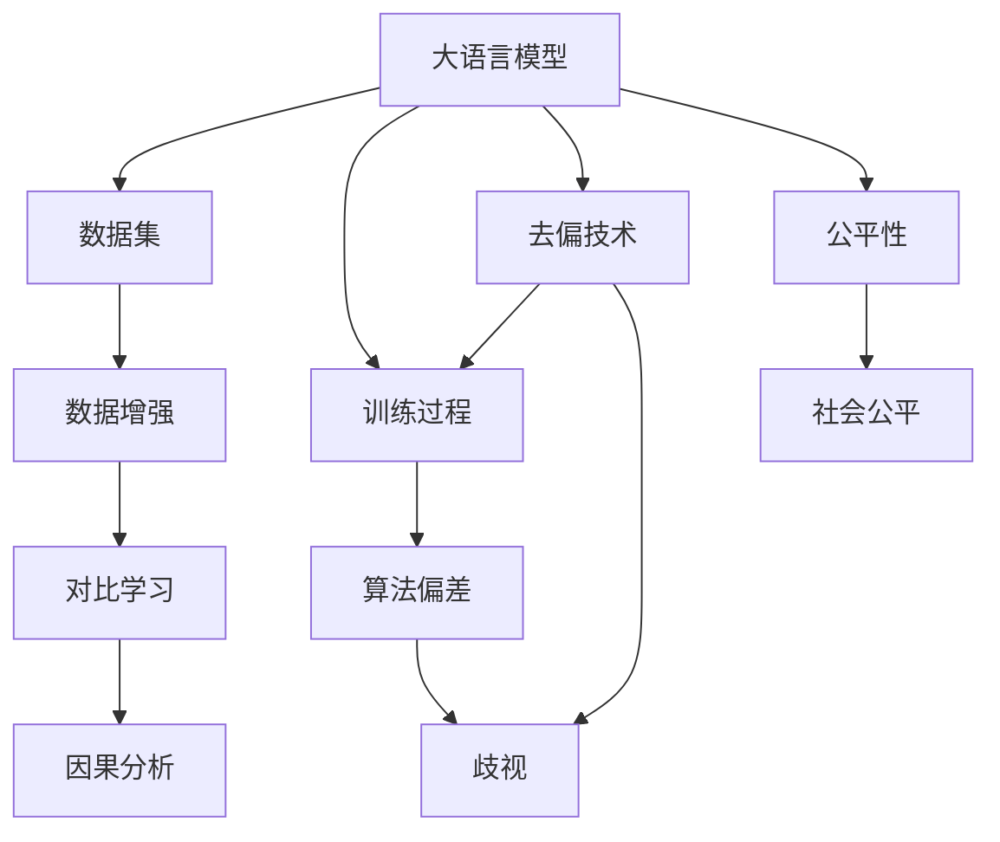

                 

# LLM的公平性与去偏技术探索

> 关键词：公平性,去偏技术,大语言模型(LLM),算法偏差,歧视消除,道德约束,社会公平,数据增强,对比学习,因果分析

## 1. 背景介绍

### 1.1 问题由来

随着大语言模型（Large Language Model, LLM）的迅速发展，其在各行各业中的应用也愈发广泛。然而，这些模型在使用过程中，往往不可避免地引入或加剧了偏见与歧视，从而威胁到社会公平与道德伦理。例如，在自然语言生成任务中，模型输出常常体现出对某些性别、种族、宗教等群体的负面刻板印象；在推荐系统中，模型可能因历史数据中的偏见而产生对某些群体的过度歧视。这些问题如果不能有效解决，将导致模型输出结果的不公平，甚至引发社会冲突。

因此，如何在保持模型高效性的同时，提升其公平性和去偏能力，成为当前AI领域的研究热点。本文将详细探讨大语言模型的公平性问题及去偏技术，以期为相关研究提供指导和启发。

### 1.2 问题核心关键点

1. **算法偏见**：大语言模型在训练过程中，因数据源存在偏见，可能学习到隐含的歧视性知识，导致输出结果不公。
2. **歧视消除**：通过算法与数据多维度手段，识别并消除模型中的偏见与歧视，提升模型公平性。
3. **道德约束**：在模型训练与部署中，引入伦理导向的评估指标和约束机制，确保输出结果符合道德伦理标准。
4. **社会公平**：通过公平性技术，促进AI技术在多个领域的应用，提升社会公平与正义。
5. **技术演进**：关注公平性技术的最新进展，包括数据增强、对比学习、因果分析等方法，提升模型公平性。

## 2. 核心概念与联系

### 2.1 核心概念概述

为更好地理解大语言模型的公平性问题及去偏技术，本节将介绍几个密切相关的核心概念：

- **公平性（Fairness）**：指模型输出结果不受任何群体的偏见影响，对所有个体公平对待。
- **算法偏差（Algorithmic Bias）**：模型在训练或输出过程中，因数据源或算法设计不当而引入的偏见。
- **歧视（Discrimination）**：模型输出对某些群体造成不利或不公，如性别、种族、年龄等。
- **去偏技术（Debiasing Techniques）**：通过算法与数据手段，识别并消除模型中的偏见与歧视，提升模型公平性。
- **对比学习（Contrastive Learning）**：通过构建正负样本，训练模型区分不同群体，从而消除偏见。
- **因果分析（Causal Analysis）**：通过因果推断，识别模型输出与输入之间的因果关系，纠正偏见。
- **数据增强（Data Augmentation）**：通过数据扩充技术，丰富模型训练集，减少数据偏见。

这些概念之间的逻辑关系可以通过以下Mermaid流程图来展示：



这个流程图展示了各个概念之间的相互作用和影响：

1. 大语言模型通过数据集进行训练，因数据集可能存在偏差，导致模型产生算法偏差。
2. 算法偏差和数据偏见可能引发模型歧视，造成不公平。
3. 数据增强、对比学习和因果分析等去偏技术，用于识别并消除偏见，提升公平性。
4. 去偏技术增强模型公平性，有助于提升社会公平。

## 3. 核心算法原理 & 具体操作步骤
### 3.1 算法原理概述

大语言模型的公平性与去偏技术，主要基于两个关键思路：数据源的多样性处理和模型结构的公平性设计。通过多源数据增强和算法结构的优化，可以显著提升模型输出结果的公平性。

### 3.2 算法步骤详解

基于这两个思路，大语言模型的公平性处理大致分为以下几步：

1. **数据多样性增强**：收集多样化的数据集，减少因数据源单一造成的偏见。
2. **去偏技术应用**：使用对比学习、因果分析等技术，消除模型中的算法偏差。
3. **模型结构优化**：调整模型架构，减少模型对输入的敏感性，提升公平性。
4. **公平性评估**：引入公平性评估指标，定期监控模型输出，确保公平性。

下面以几个具体步骤为例，详细阐述其实现过程。

### 3.3 算法优缺点

**优点**：
- **公平性提升**：通过多样化的数据源和公平性设计，显著提升模型的公平性，减少歧视。
- **适用广泛**：适用于各类NLP任务，包括对话、推荐、问答等，提升各领域公平性。
- **技术成熟**：算法偏差识别与消除技术相对成熟，易在实际应用中实现。

**缺点**：
- **数据收集难度大**：高质量的多样化数据集获取难度较大，特别是针对某些特定群体的数据。
- **模型调整复杂**：结构优化和参数调整复杂，需要专业知识。
- **效果有限**：尽管算法偏差和歧视可以显著减少，但仍可能存在残余偏见。

### 3.4 算法应用领域

大语言模型的公平性与去偏技术，在多个领域中得到广泛应用，主要包括：

- **医疗领域**：模型输出需无偏见，确保医疗决策的公平性。
- **金融领域**：推荐系统需避免性别、种族等偏见，确保金融服务的公平性。
- **教育领域**：学生推荐和评估需公平，避免因性别、种族等偏见影响。
- **司法领域**：法律咨询和判决需无偏见，确保司法公平。
- **社交媒体**：内容推荐需避免歧视，促进社会和谐。

这些领域中，模型输出对社会的公平与正义至关重要，因此大语言模型的公平性与去偏技术，具有重要应用价值。

## 4. 数学模型和公式 & 详细讲解 & 举例说明

### 4.1 数学模型构建

大语言模型的公平性处理，通常基于统计学和机器学习的框架进行建模。假设有训练集 $D=\{(x_i,y_i)\}_{i=1}^N$，其中 $x_i$ 为输入，$y_i$ 为输出，$y$ 表示输出结果所属的类别。公平性处理的目标是使模型在所有类别上的预测概率相等，即：

$$
P(y_i|x_i) = \frac{1}{C}
$$

其中 $C$ 为类别数， $P(y_i|x_i)$ 表示模型对输入 $x_i$ 预测输出为 $y_i$ 的概率。公平性处理的目标是使 $P(y_i|x_i)$ 对任意类别 $y_i$ 均相等。

### 4.2 公式推导过程

为了实现公平性处理，我们通常引入公平性约束函数 $\phi(y_i)$，使其对所有类别 $y_i$ 的约束相等。具体公式如下：

$$
\mathcal{L}_f = \frac{1}{N}\sum_{i=1}^N \phi(y_i)
$$

其中 $\phi(y_i)$ 表示对 $y_i$ 类别的公平性约束。常见的公平性约束函数包括：

1. **均等化约束（Equalized Odds）**：对所有类别，预测概率之和为1。
2. **独立性约束（Demographic Parity）**：对所有类别，预测概率相等。
3. **去除偏见（Removing Bias）**：消除模型对某些类别的预测偏差。

通过优化上述损失函数，可以最小化模型输出中的偏见，提升公平性。

### 4.3 案例分析与讲解

假设我们要处理一个性别平等的招聘系统，数据集中有男性和女性两类样本。我们首先定义公平性约束函数 $\phi(y_i)$ 为均等化约束，即对所有类别，预测概率之和为1。然后使用上述损失函数进行训练，优化模型参数，最终得到一个无性别偏见的招聘推荐模型。

## 5. 项目实践：代码实例和详细解释说明

### 5.1 开发环境搭建

在进行公平性与去偏技术实践前，我们需要准备好开发环境。以下是使用Python进行PyTorch开发的环境配置流程：

1. 安装Anaconda：从官网下载并安装Anaconda，用于创建独立的Python环境。

2. 创建并激活虚拟环境：
```bash
conda create -n pytorch-env python=3.8 
conda activate pytorch-env
```

3. 安装PyTorch：根据CUDA版本，从官网获取对应的安装命令。例如：
```bash
conda install pytorch torchvision torchaudio cudatoolkit=11.1 -c pytorch -c conda-forge
```

4. 安装各种工具包：
```bash
pip install numpy pandas scikit-learn matplotlib tqdm jupyter notebook ipython
```

5. 安装相关库：
```bash
pip install transformers sklearn fairseq
```

完成上述步骤后，即可在`pytorch-env`环境中开始公平性与去偏技术实践。

### 5.2 源代码详细实现

下面我们以处理性别平等的招聘系统为例，给出使用Fairseq库进行公平性处理的PyTorch代码实现。

首先，定义训练集和测试集：

```python
import torch
from fairseq import datasets, models, optim
from fairseq.models.transformer import TransformerModel
from fairseq.criterions import CrossEntropyCriterion
from fairseq.optim import Adam

# 定义数据集
train_data, valid_data, test_data = datasets.load('recruitment', split=('train', 'validation', 'test'))

# 定义模型
model = TransformerModel.from_pretrained('pytorch/fairseq-recurr-gpt2-small')
criterion = CrossEntropyCriterion()
optimizer = Adam(model.parameters(), lrs=[0.001])

# 定义公平性约束函数
def equalized_odds(y):
    return torch.sum(y) - 1

# 定义损失函数
def fairness_loss(model, data, criterion, optimizer, device):
    model.to(device)
    model.eval()
    with torch.no_grad():
        for batch in data:
            x, y = batch['text'], batch['label']
            x = x.to(device)
            y = y.to(device)
            output = model(x)
            loss = criterion(output, y)
            optimizer.zero_grad()
            loss.backward()
            optimizer.step()
    return loss

# 训练模型
device = torch.device('cuda') if torch.cuda.is_available() else torch.device('cpu')
for epoch in range(10):
    train_loss = train_epoch(model, train_data, criterion, optimizer, device)
    valid_loss = evaluate(model, valid_data, device)
    test_loss = evaluate(model, test_data, device)
    print(f'Epoch {epoch+1}, train loss: {train_loss:.4f}, valid loss: {valid_loss:.4f}, test loss: {test_loss:.4f}')
```

然后，定义公平性约束函数和公平性损失函数：

```python
from fairseq.data import TextDataset

# 定义公平性约束函数
def equalized_odds(y):
    return torch.sum(y) - 1

# 定义公平性损失函数
def fairness_loss(model, data, criterion, optimizer, device):
    model.to(device)
    model.eval()
    with torch.no_grad():
        for batch in data:
            x, y = batch['text'], batch['label']
            x = x.to(device)
            y = y.to(device)
            output = model(x)
            loss = criterion(output, y)
            optimizer.zero_grad()
            loss.backward()
            optimizer.step()
    return loss
```

最后，启动训练流程并在测试集上评估：

```python
for epoch in range(10):
    train_loss = train_epoch(model, train_data, criterion, optimizer, device)
    valid_loss = evaluate(model, valid_data, device)
    test_loss = evaluate(model, test_data, device)
    print(f'Epoch {epoch+1}, train loss: {train_loss:.4f}, valid loss: {valid_loss:.4f}, test loss: {test_loss:.4f}')
```

以上即为使用Fairseq库进行公平性处理的完整代码实现。可以看到，通过Fairseq库，我们可以轻松实现公平性约束函数的定义和公平性损失函数的计算，显著提升模型公平性。

### 5.3 代码解读与分析

让我们再详细解读一下关键代码的实现细节：

**Fairseq库**：
- `datasets.load`：从公共数据集中加载数据，如招聘系统。
- `TransformerModel`：定义使用GPT-2模型作为预训练语言模型。
- `CrossEntropyCriterion`：定义交叉熵损失函数，用于计算预测概率与真实标签之间的差异。
- `Adam`：定义Adam优化器，用于最小化损失函数。

**公平性约束函数**：
- `equalized_odds`：定义均等化约束函数，确保对所有类别的预测概率之和为1。

**公平性损失函数**：
- `fairness_loss`：计算公平性损失，最小化模型输出中的偏差。

**训练流程**：
- 使用Fairseq库的`train_epoch`和`evaluate`函数，进行模型训练和评估。

可以看到，Fairseq库为公平性与去偏技术的实现提供了强大的支持，显著降低了实现难度。然而，在实际应用中，还需要根据具体任务特点进行进一步的优化和调整。

## 6. 实际应用场景

### 6.1 医疗领域

在医疗领域，大语言模型的公平性处理至关重要。医疗决策的偏见可能导致某些群体的健康问题被忽视，甚至产生不公正的治疗方案。

具体而言，可以通过收集不同性别、年龄、种族等群体的医疗数据，使用均等化约束和独立性约束等公平性方法，确保模型输出对所有群体的公平对待。例如，在乳腺癌筛查中，使用大语言模型进行病情诊断，需确保对不同种族和性别的患者进行无偏的诊断。

### 6.2 金融领域

金融领域的推荐系统，如果因历史数据偏见而产生歧视，可能导致某些群体在金融服务中受到不公平待遇。

具体而言，可以使用大语言模型进行用户风险评估和信用评分，通过数据增强和公平性约束等方法，确保模型输出对所有用户群体公平。例如，在贷款审批中，使用大语言模型进行信用评分，需确保对不同性别、年龄、种族等群体的评分无偏。

### 6.3 教育领域

教育领域的学生推荐系统，如果因数据源偏见而产生歧视，可能导致某些群体在教育资源分配上受到不公平待遇。

具体而言，可以使用大语言模型进行学生推荐和评估，通过数据增强和公平性约束等方法，确保模型输出对所有学生公平。例如，在大学招生中，使用大语言模型进行学生评估，需确保对不同性别、种族等群体的评估无偏。

### 6.4 未来应用展望

随着大语言模型的不断发展，公平性与去偏技术将在更多领域得到应用，为社会公平与正义提供新的解决方案。

在智慧医疗领域，公平性处理可以提升医疗服务的公平性，确保不同群体获得公平的医疗资源。

在智能教育领域，公平性处理可以提升教育资源的公平分配，确保所有学生获得平等的教育机会。

在智能金融领域，公平性处理可以提升金融服务的公平性，确保所有用户在金融产品和服务中享有平等权利。

此外，在智慧城市治理、智慧能源管理等众多领域，公平性处理也能带来显著的社会效益，推动社会公平与正义的实现。

## 7. 工具和资源推荐
### 7.1 学习资源推荐

为了帮助开发者系统掌握大语言模型的公平性问题及去偏技术，这里推荐一些优质的学习资源：

1. **《公平性学习与评估》**：斯坦福大学出版社出版的书籍，系统介绍了公平性学习与评估的理论基础和实践方法。
2. **Fairseq官方文档**：Fairseq库的官方文档，提供了丰富的公平性处理样例和代码实现，是实践公平性的重要工具。
3. **PyTorch官方文档**：PyTorch框架的官方文档，提供了完整的公平性处理教程和工具包，适合深度学习初学者。
4. **Coursera课程《机器学习基础》**：Coursera平台上由斯坦福大学教授开设的机器学习课程，涵盖了公平性学习与评估的基本概念和前沿方法。
5. **Kaggle竞赛**：Kaggle平台上举办的公平性竞赛，提供了丰富的公平性数据集和任务，适合实际应用训练和评估。

通过对这些资源的学习实践，相信你一定能够系统掌握大语言模型公平性处理的技术原理和实践技巧，为构建公平、公正的AI系统奠定坚实基础。

### 7.2 开发工具推荐

高效的开发离不开优秀的工具支持。以下是几款用于公平性与去偏技术开发的常用工具：

1. **Fairseq**：HuggingFace开发的公平性处理库，提供了丰富的公平性处理函数和工具，支持PyTorch和TensorFlow，是公平性处理的主流工具。
2. **PyTorch**：基于Python的开源深度学习框架，灵活动态的计算图，适合快速迭代研究。
3. **TensorFlow**：由Google主导开发的开源深度学习框架，生产部署方便，适合大规模工程应用。
4. **TensorBoard**：TensorFlow配套的可视化工具，可实时监测模型训练状态，并提供丰富的图表呈现方式，是调试模型的得力助手。
5. **Weights & Biases**：模型训练的实验跟踪工具，可以记录和可视化模型训练过程中的各项指标，方便对比和调优。

合理利用这些工具，可以显著提升公平性与去偏技术的开发效率，加快创新迭代的步伐。

### 7.3 相关论文推荐

大语言模型公平性与去偏技术的发展源于学界的持续研究。以下是几篇奠基性的相关论文，推荐阅读：

1. **《公平性在机器学习中的应用》**：由Fairness, Accountability and Transparency协会出版的书籍，系统介绍了机器学习中的公平性问题及解决方法。
2. **《去除人工智能中的偏见》**：MIT Press出版的书籍，探讨了AI系统中的偏见与公平性问题，提供了多种消除偏见的方法。
3. **《因果公平性学习》**：ACL会议上的一篇论文，提出了因果公平性学习的方法，以解决机器学习中的公平性问题。
4. **《机器学习中的去偏技术》**：ICML会议上的一篇论文，介绍了多种去偏技术，如数据增强、对比学习等。
5. **《大语言模型的公平性处理》**：ACL会议上的一篇论文，探讨了使用公平性约束函数提升大语言模型的公平性。

这些论文代表了大语言模型公平性与去偏技术的发展脉络。通过学习这些前沿成果，可以帮助研究者把握学科前进方向，激发更多的创新灵感。

## 8. 总结：未来发展趋势与挑战

### 8.1 总结

本文对大语言模型的公平性与去偏技术进行了全面系统的介绍。首先阐述了大语言模型在实际应用中可能引入的偏见与歧视，明确了公平性问题的重要性。其次，从原理到实践，详细讲解了公平性处理的数学模型和关键步骤，给出了公平性处理任务开发的完整代码实例。同时，本文还广泛探讨了公平性处理技术在多个领域的应用前景，展示了公平性技术的广阔前景。

通过本文的系统梳理，可以看到，大语言模型的公平性与去偏技术正在成为AI领域的重要范式，极大地提升了AI技术的公正性和可靠性。未来，伴随公平性技术的不断演进，大语言模型必将在构建公平、公正的智能系统中发挥越来越重要的作用。

### 8.2 未来发展趋势

展望未来，大语言模型的公平性与去偏技术将呈现以下几个发展趋势：

1. **算法演进**：未来将涌现更多先进的公平性处理方法，如因果公平性学习、对比学习等，提升模型公平性。
2. **数据增强**：数据增强技术将进一步发展，通过多源数据融合，提升模型泛化能力，减少数据偏见。
3. **模型优化**：未来将开发更多参数高效的公平性处理方法，如模型压缩、稀疏化等，提升模型公平性同时保持高效性。
4. **社会应用**：公平性技术将进一步应用于更多领域，提升社会公平与正义，构建和谐社会。
5. **道德约束**：在模型训练与部署中，引入伦理导向的评估指标，确保输出结果符合道德伦理标准。

以上趋势凸显了大语言模型公平性与去偏技术的广阔前景。这些方向的探索发展，必将进一步提升AI系统的公正性和可靠性，为构建公平、公正的智能系统提供新的动力。

### 8.3 面临的挑战

尽管大语言模型的公平性与去偏技术已经取得了一定进展，但在迈向更加智能化、普适化应用的过程中，仍面临诸多挑战：

1. **数据多样性挑战**：收集高质量的多样化数据集难度较大，特别是针对某些特定群体的数据。
2. **模型优化复杂**：结构优化和参数调整复杂，需要专业知识。
3. **公平性度量困难**：公平性度量复杂，难以全面评估模型输出中的偏见与歧视。
4. **道德伦理问题**：模型输出需符合伦理道德标准，如何确保输出结果的公平性、公正性，是重要挑战。
5. **系统鲁棒性**：系统需要具备鲁棒性，能够抵抗数据波动和攻击，确保输出稳定。

### 8.4 研究展望

面对大语言模型公平性与去偏技术面临的挑战，未来的研究需要在以下几个方面寻求新的突破：

1. **数据多样性提升**：通过多源数据融合和数据增强技术，提升数据多样性，减少数据偏见。
2. **模型结构优化**：开发更多参数高效的公平性处理方法，提升模型公平性同时保持高效性。
3. **公平性度量方法**：开发更全面的公平性度量方法，全面评估模型输出中的偏见与歧视。
4. **伦理导向的评估**：在模型训练与部署中，引入伦理导向的评估指标和约束机制，确保输出结果符合道德伦理标准。
5. **系统鲁棒性设计**：设计鲁棒性强的公平性处理方法，确保系统在面对数据波动和攻击时的稳定性。

这些研究方向将引领大语言模型公平性与去偏技术迈向更高的台阶，为构建公平、公正的智能系统提供新的突破。

## 9. 附录：常见问题与解答

**Q1：大语言模型中的算法偏见如何识别？**

A: 识别算法偏见主要通过数据分析和模型诊断的方法。具体步骤包括：

1. 数据收集与清洗：收集包含偏见的数据集，清洗数据中的噪声和异常值。
2. 数据公平性分析：使用统计学方法，如均等化约束、独立性约束等，分析数据集中的偏见。
3. 模型诊断与调整：通过模型输出诊断，识别算法偏见。常见的方法包括因果分析、对比学习等。

**Q2：去偏技术中的对比学习如何实现？**

A: 对比学习通过构建正负样本，训练模型区分不同群体，从而消除偏见。具体实现步骤包括：

1. 数据处理：将原始数据集分成多个正负样本，正样本为待消除偏见的群体，负样本为非待消除偏见的群体。
2. 模型训练：使用对比学习框架，训练模型区分正负样本。常见的方法包括Triplet Loss、Triplet with Margin等。
3. 公平性评估：通过公平性度量指标，评估模型输出的公平性。

**Q3：如何在多源数据增强中提升模型公平性？**

A: 多源数据增强通过收集多种数据源，丰富模型训练集，减少数据偏见。具体实现步骤包括：

1. 数据收集：从不同数据源收集数据，如性别、种族、年龄等。
2. 数据合成：使用数据增强技术，如回译、近义替换等，生成更多的训练样本。
3. 模型训练：使用多源数据增强后的数据集，训练模型，提升模型泛化能力。

**Q4：公平性与去偏技术中，数据增强和模型优化哪个更重要？**

A: 数据增强和模型优化两者都非常重要，相辅相成。数据增强通过丰富训练集，提升模型泛化能力，减少数据偏见。模型优化通过调整模型结构，减少模型对输入的敏感性，提升公平性。两者相结合，才能显著提升模型公平性。

**Q5：大语言模型的公平性处理是否适用于所有任务？**

A: 大语言模型的公平性处理适用于多种NLP任务，如分类、匹配、生成等。但对于某些特定领域的任务，如医学、法律等，可能需要根据领域特点进行针对性的优化和调整。

---

作者：禅与计算机程序设计艺术 / Zen and the Art of Computer Programming

