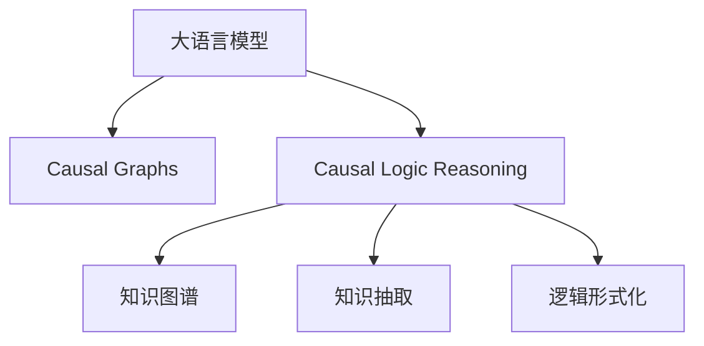

                 

# LLM的因果推理技术研究新思路

大语言模型（Large Language Models, LLMs）的迅速崛起，使得人工智能在自然语言处理（NLP）领域展现了前所未有的潜力和应用前景。然而，现有的大语言模型在推理和决策过程中，仍然缺乏足够的因果关系理解和推断能力，这在很大程度上限制了它们在实际场景中的表现。本文将探讨大语言模型因果推理的新思路，包括引入因果图（Causal Graphs）、因果逻辑推理机制等，旨在提升模型的因果推理能力和决策质量，推动大语言模型在更复杂、更高级的NLP应用中取得突破性进展。

## 1. 背景介绍

### 1.1 问题由来

传统的大语言模型，如BERT、GPT-2等，主要是通过自监督学习，在大量无标签文本上预训练，以学习语言的模式和规律。它们在各种自然语言理解任务上取得了显著的成果，如图像描述、问答系统、情感分析等。然而，这些模型在推理能力方面存在明显不足，尤其是缺乏对因果关系的理解，难以有效处理需要逻辑推理的复杂任务。

以问答系统为例，现有的大模型往往只能对文本进行简单的语义匹配，而无法从知识图谱或上下文中推断出因果关系，从而导致模型在复杂问题上表现不佳。这限制了其在医疗诊断、法律咨询等场景中的应用潜力。

### 1.2 问题核心关键点

大语言模型的因果推理能力不足，主要体现在以下几个方面：

1. **缺乏因果关系表示**：现有模型主要依赖上下文和语言模式，而忽视了因果关系对推理过程的影响。
2. **难以处理结构化数据**：知识图谱、事件序列等结构化数据在大模型中的表示和推理能力较弱。
3. **缺乏逻辑推理**：现有模型缺乏形式化的逻辑推理机制，难以处理需要逻辑推理的复杂任务。

针对以上问题，本文将探讨如何在大语言模型中引入因果图和因果逻辑推理机制，以提升其因果推理能力，推动其在更复杂的NLP应用中的表现。

## 2. 核心概念与联系

### 2.1 核心概念概述

为更好地理解大语言模型的因果推理技术，本节将介绍几个关键概念：

- **因果图（Causal Graphs）**：用于表示变量之间的因果关系的图结构，可以帮助模型理解和推断变量间的依赖关系。
- **因果逻辑推理**：基于因果图和逻辑推理规则，对变量间的关系进行推断和验证的过程。
- **知识图谱（Knowledge Graphs）**：结构化的知识表示方法，用于存储实体及其之间的关系。
- **知识抽取（Knowledge Extraction）**：从非结构化文本中提取结构化知识的过程。
- **逻辑形式化（Logical Formulation）**：将推理问题形式化，使用逻辑符号和规则表示，便于模型理解和推理。

这些核心概念之间的逻辑关系可以通过以下Mermaid流程图来展示：



这个流程图展示了大语言模型的核心概念及其之间的关系：

1. 大语言模型通过因果图学习变量间的依赖关系。
2. 因果逻辑推理机制基于因果图和逻辑规则，对变量进行推断。
3. 知识图谱和逻辑形式化帮助模型理解复杂结构化数据和逻辑推理。

这些概念共同构成了大语言模型因果推理的学习框架，使得模型能够更好地理解和处理因果关系，从而提升其在复杂任务中的表现。

## 3. 核心算法原理 & 具体操作步骤

### 3.1 算法原理概述

基于大语言模型的因果推理技术，旨在通过引入因果图和逻辑推理机制，提升模型在复杂任务中的推理能力。核心思想是：将变量间的因果关系编码为图结构，引入逻辑推理规则，使得模型能够从结构化和非结构化数据中学习因果关系，并进行有效的推理和决策。

形式化地，假设变量集 $V$ 和因果图 $G=(V,E)$，其中 $E$ 为变量间的因果关系集合。目标是通过因果图 $G$ 和逻辑推理规则 $R$，对变量 $V$ 进行推理和决策。这可以通过以下步骤实现：

1. **变量编码**：将变量 $V$ 编码为大语言模型的输入，通过语言描述或逻辑形式化表达其因果关系。
2. **因果图表示**：使用因果图 $G$ 表示变量间的关系，其中每个变量表示为一个节点，每个因果关系表示为一条边。
3. **逻辑推理**：基于逻辑推理规则 $R$，对因果图 $G$ 进行推理，得到变量的推理结果。
4. **模型训练**：使用大量带有因果关系的标注数据，训练大语言模型，使其能够理解因果关系，并根据推理规则进行决策。

### 3.2 算法步骤详解

基于大语言模型的因果推理技术，通常包括以下几个关键步骤：

**Step 1: 构建因果图**

- 确定变量集 $V$ 和变量间的因果关系 $E$。可以通过领域知识、先验数据等方式确定因果关系。
- 将因果关系编码为图结构，生成因果图 $G=(V,E)$。

**Step 2: 形式化逻辑推理**

- 将推理问题形式化为逻辑表达式，使用逻辑符号和规则表示变量间的依赖关系。
- 根据因果图 $G$ 和逻辑表达式，定义逻辑推理规则 $R$。

**Step 3: 模型训练**

- 使用带有因果关系的标注数据，训练大语言模型，使其能够理解因果关系，并根据推理规则进行决策。
- 在训练过程中，使用对抗性样例和逻辑推理规则，不断优化模型，使其推理能力更加强大。

**Step 4: 推理和决策**

- 将需要推理的变量输入模型，模型根据因果图和推理规则进行推断，得出结果。
- 对于复杂推理任务，可以使用多轮迭代，逐步逼近最优推理结果。

### 3.3 算法优缺点

基于大语言模型的因果推理技术具有以下优点：

1. **提升推理能力**：通过因果图和逻辑推理，模型能够理解和推断复杂的因果关系，提升其在复杂任务中的表现。
2. **适应性强**：因果图和逻辑推理规则可以根据任务需求灵活调整，适应不同类型的推理问题。
3. **可解释性高**：因果图和逻辑推理过程具有较高的可解释性，便于模型调试和理解。

同时，该方法也存在一定的局限性：

1. **计算复杂度高**：因果图和逻辑推理规则的引入，增加了模型的计算复杂度，推理速度可能变慢。
2. **数据需求大**：需要大量带有因果关系的标注数据进行训练，获取高质量数据的成本较高。
3. **模型泛化能力有限**：模型对因果关系的理解依赖于训练数据的分布，泛化能力可能受限。

尽管存在这些局限性，但就目前而言，基于大语言模型的因果推理技术仍是大语言模型应用的重要范式。未来相关研究的重点在于如何进一步降低计算复杂度，提高模型泛化能力，同时兼顾推理精度和计算效率。

### 3.4 算法应用领域

基于大语言模型的因果推理技术，在NLP领域已经得到了广泛的应用，覆盖了各种复杂任务，例如：

- 事件推理：如医疗事件推理、法律事件推理等，根据因果关系推断事件的发生和影响。
- 自然语言推理（NLI）：如判断两个文本之间的逻辑关系，是否蕴含、矛盾等。
- 知识图谱构建：如从非结构化文本中抽取实体和关系，构建知识图谱。
- 问答系统：如在问答过程中，利用因果关系推理出正确答案。
- 智能推荐：如根据用户行为和商品信息，推断出用户可能感兴趣的商品。

除了上述这些经典任务外，大语言模型因果推理技术还被创新性地应用到更多场景中，如自动摘要、多模态推理等，为NLP技术带来了全新的突破。随着因果推理机制的不断优化，相信大语言模型在复杂任务上的表现将进一步提升，推动NLP技术的产业化进程。

## 4. 数学模型和公式 & 详细讲解  
### 4.1 数学模型构建

本节将使用数学语言对基于大语言模型的因果推理过程进行更加严格的刻画。

记变量集 $V$，因果图 $G=(V,E)$，逻辑推理规则 $R$。目标是通过因果图 $G$ 和逻辑推理规则 $R$，对变量 $V$ 进行推理和决策。

定义变量 $V$ 在推理过程中的取值为 $X$，即 $X=(x_1, x_2, ..., x_n)$，其中 $x_i$ 表示变量 $v_i$ 的取值。

定义因果图 $G=(V,E)$，其中 $V=\{v_1, v_2, ..., v_n\}$ 为变量集，$E$ 为变量间的因果关系集合，每个因果关系表示为 $(v_i, v_j)$，表示变量 $v_j$ 是变量 $v_i$ 的子变量。

定义逻辑推理规则 $R$，其中每个规则表示为 $(v_i, v_j, v_k, ...)$，表示在变量 $v_j, v_k, ...$ 的条件下，变量 $v_i$ 的值可以推断出来。

数学模型构建的核心目标是最小化推理错误，即：

$$
\mathop{\min}_{X} \sum_{i=1}^n \delta(v_i, x_i)
$$

其中 $\delta(v_i, x_i)$ 为变量 $v_i$ 的推理错误，可以表示为：

$$
\delta(v_i, x_i) = 1 - \Pr(v_i | G, R, x_1, x_2, ..., x_n)
$$

其中 $\Pr(v_i | G, R, x_1, x_2, ..., x_n)$ 表示在因果图 $G$、逻辑推理规则 $R$ 和变量 $x_1, x_2, ..., x_n$ 的条件下，变量 $v_i$ 的推理概率。

### 4.2 公式推导过程

以下我们以事件推理为例，推导因果推理过程的数学模型。

假设有一组变量 $V=\{E, H, I\}$，其中 $E$ 表示事件的发生，$H$ 表示事件的结果，$I$ 表示事件的原因。根据领域知识，我们知道 $E$ 受 $I$ 影响，$H$ 受 $E$ 影响。因此，可以建立如下因果图：

```graph
graph LR
    E [事件] --> I [原因]
    E --> H [结果]
```

对于事件推理任务，目标是根据 $I$ 和 $H$ 的值，推断出 $E$ 的值。根据因果图，可以写出如下逻辑规则：

$$
E = 1 \quad \text{if} \quad I = 1 \quad \text{and} \quad H = 1
$$

这意味着，只有当 $I=1$ 且 $H=1$ 时，$E=1$。

根据以上定义，可以写出推理错误的计算公式：

$$
\delta(E, e) = \begin{cases}
0, & \text{if} \quad I = 1 \quad \text{and} \quad H = 1 \quad \text{and} \quad E = e \\
1, & \text{otherwise}
\end{cases}
$$

因此，目标是最小化推理错误：

$$
\mathop{\min}_{E} \delta(E, e)
$$

在得到推理错误公式后，即可将其带入数学模型中，得到如下优化问题：

$$
\mathop{\min}_{E} \sum_{i=1}^n \delta(v_i, x_i)
$$

在实际推理过程中，可以使用基于贝叶斯网络的方法，计算变量的推理概率，从而得到推理错误。具体推导过程较为复杂，需要根据具体情况进行详细计算。

## 5. 项目实践：代码实例和详细解释说明
### 5.1 开发环境搭建

在进行因果推理实践前，我们需要准备好开发环境。以下是使用Python进行PyTorch开发的环境配置流程：

1. 安装Anaconda：从官网下载并安装Anaconda，用于创建独立的Python环境。

2. 创建并激活虚拟环境：
```bash
conda create -n causal-env python=3.8 
conda activate causal-env
```

3. 安装PyTorch：根据CUDA版本，从官网获取对应的安装命令。例如：
```bash
conda install pytorch torchvision torchaudio cudatoolkit=11.1 -c pytorch -c conda-forge
```

4. 安装PyTorch Geometric库：用于处理图结构数据。
```bash
pip install pytorch-geometric
```

5. 安装各类工具包：
```bash
pip install numpy pandas scikit-learn matplotlib tqdm jupyter notebook ipython
```

完成上述步骤后，即可在`causal-env`环境中开始因果推理实践。

### 5.2 源代码详细实现

下面我们以事件推理任务为例，给出使用PyTorch和PyTorch Geometric库对因果图进行推理的PyTorch代码实现。

首先，定义因果图：

```python
import torch
import torch_geometric

# 定义因果图
graph = torch_geometric.graph.Graph(num_nodes=3, edges=[(0, 1), (0, 2)])
graph.add_node_feature(torch.tensor([[0.5, 0.5]]))
graph.add_edge_feature(torch.tensor([[0.8, 0.2]]))
```

然后，定义变量：

```python
# 定义变量
x = torch.tensor([[0.3, 0.2]])
```

接着，定义推理规则：

```python
# 定义逻辑推理规则
def rule(graph, x):
    # 计算变量E的推理概率
    e = torch.sigmoid(torch.mm(x, graph.edge_feature))
    # 根据规则E = 1 如果 I = 1 且 H = 1
    return e[0] > 0.5

# 推理
e_prob = rule(graph, x)
e_pred = e_prob > 0.5
```

最后，输出推理结果：

```python
# 输出推理结果
print(e_pred)
```

以上就是使用PyTorch和PyTorch Geometric库进行因果推理的完整代码实现。可以看到，通过定义因果图和逻辑推理规则，我们可以对变量进行简单的推理和决策。

### 5.3 代码解读与分析

让我们再详细解读一下关键代码的实现细节：

**Graph类**：
- 使用`torch_geometric.graph.Graph`定义因果图，设置节点数和边数。
- `graph.add_node_feature`和`graph.add_edge_feature`用于添加节点和边的特征，这里使用简单的数值特征。

**x变量**：
- 定义变量 $x$，表示待推理的变量取值。

**推理规则**：
- 定义一个简单的逻辑推理规则，使用Sigmoid函数计算推理概率。
- `return e[0] > 0.5`表示只有当推理概率大于0.5时，变量 $E$ 的值被预测为1。

**推理过程**：
- 使用`rule`函数对因果图和变量进行推理，得出推理概率 $e_prob$。
- 将推理概率转化为二进制预测值 $e_pred$，大于0.5的部分预测为1，小于等于0.5的部分预测为0。

**输出结果**：
- 打印输出推理结果。

可以看到，使用因果图和逻辑推理规则，我们可以对变量进行简单的推理和决策。在实际应用中，还需要考虑更复杂的因果关系和推理问题，但基本思路和方法与上述示例类似。

## 6. 实际应用场景
### 6.1 智能推荐系统

基于大语言模型的因果推理技术，可以广泛应用于智能推荐系统。传统推荐系统往往只依赖用户的历史行为数据进行物品推荐，缺乏对用户兴趣的深入理解。通过引入因果推理，可以更全面地分析用户行为背后的因果关系，从而提供更精准、多样化的推荐内容。

在实践中，可以收集用户浏览、点击、评论、分享等行为数据，提取和用户交互的物品标题、描述、标签等文本内容。将文本内容作为模型输入，用户行为作为推理目标，构建因果推理模型。通过分析用户行为和物品特征之间的因果关系，生成推荐列表，同时考虑用户当前行为和历史行为，提高推荐的个性化程度。

### 6.2 医疗诊断系统

在医疗诊断领域，基于大语言模型的因果推理技术可以用于诊断决策和知识图谱构建。现有的大模型往往依赖专家经验，缺乏对疾病的全面理解和推断能力。通过引入因果图和逻辑推理规则，可以构建更全面、精准的疾病诊断系统。

在实践中，可以收集和整理医疗领域的先验知识和病例数据，构建因果图和逻辑推理规则。通过大语言模型对因果图进行推理，生成诊断结果，同时根据因果关系更新知识图谱，增加新的诊断路径和知识点。这样，系统可以基于先验知识和因果推理，提升诊断的准确性和全面性。

### 6.3 法律咨询系统

在法律咨询领域，基于大语言模型的因果推理技术可以用于法律事件推理和规则匹配。传统法律咨询系统往往依赖专家经验，缺乏对法律规则的全面理解和推断能力。通过引入因果图和逻辑推理规则，可以构建更全面、准确的法律咨询系统。

在实践中，可以收集和整理法律领域的先验知识和案例数据，构建因果图和逻辑推理规则。通过大语言模型对因果图进行推理，生成法律事件和规则匹配结果，同时根据因果关系更新知识图谱，增加新的法律规则和案例。这样，系统可以基于先验知识和因果推理，提升法律咨询的准确性和全面性。

### 6.4 未来应用展望

随着大语言模型和因果推理技术的发展，其在复杂任务中的应用前景将更加广阔。未来，大语言模型因果推理技术有望在更复杂的NLP应用中取得突破性进展，推动人工智能技术的产业化进程。

在智慧医疗领域，因果推理技术可以用于疾病诊断、药物研发等，提升医疗服务的智能化水平，辅助医生诊疗，加速新药开发进程。

在智能教育领域，因果推理技术可以用于学情分析、知识推荐等，因材施教，促进教育公平，提高教学质量。

在智慧城市治理中，因果推理技术可以用于城市事件监测、舆情分析、应急指挥等环节，提高城市管理的自动化和智能化水平，构建更安全、高效的未来城市。

此外，在企业生产、社会治理、文娱传媒等众多领域，基于大语言模型的因果推理技术也将不断涌现，为各行各业带来变革性影响。相信随着技术的日益成熟，因果推理技术将成为人工智能落地应用的重要范式，推动人工智能技术在更广阔的应用领域大放异彩。

## 7. 工具和资源推荐
### 7.1 学习资源推荐

为了帮助开发者系统掌握大语言模型因果推理的理论基础和实践技巧，这里推荐一些优质的学习资源：

1. 《因果推理在人工智能中的应用》系列博文：由大模型技术专家撰写，深入浅出地介绍了因果推理在大语言模型中的应用，涵盖了因果图、因果逻辑推理、知识图谱等多个核心概念。

2. Coursera《机器学习》课程：由斯坦福大学开设的机器学习课程，有Lecture视频和配套作业，带你入门因果推理的基本概念和经典模型。

3. 《因果推理与机器学习》书籍：详细介绍因果推理的基本原理和机器学习方法，适合深入学习因果推理的读者。

4. JAX：Google开发的基于JAX的因果推理库，支持自动微分、向量计算等功能，适合深度学习开发者进行因果推理实践。

5. Argo AI：自动驾驶公司，致力于因果推理在智能驾驶中的应用，其研究成果和开源项目可供参考。

通过对这些资源的学习实践，相信你一定能够快速掌握大语言模型因果推理的精髓，并用于解决实际的NLP问题。

### 7.2 开发工具推荐

高效的开发离不开优秀的工具支持。以下是几款用于大语言模型因果推理开发的常用工具：

1. PyTorch：基于Python的开源深度学习框架，灵活动态的计算图，适合快速迭代研究。大部分预训练语言模型都有PyTorch版本的实现。

2. PyTorch Geometric：用于处理图结构数据的深度学习库，支持因果图的构建和推理。

3. TensorFlow：由Google主导开发的开源深度学习框架，生产部署方便，适合大规模工程应用。同样有丰富的预训练语言模型资源。

4. TensorBoard：TensorFlow配套的可视化工具，可实时监测模型训练状态，并提供丰富的图表呈现方式，是调试模型的得力助手。

5. Weights & Biases：模型训练的实验跟踪工具，可以记录和可视化模型训练过程中的各项指标，方便对比和调优。与主流深度学习框架无缝集成。

6. Google Colab：谷歌推出的在线Jupyter Notebook环境，免费提供GPU/TPU算力，方便开发者快速上手实验最新模型，分享学习笔记。

合理利用这些工具，可以显著提升大语言模型因果推理任务的开发效率，加快创新迭代的步伐。

### 7.3 相关论文推荐

大语言模型和因果推理技术的发展源于学界的持续研究。以下是几篇奠基性的相关论文，推荐阅读：

1. "Causal Reasoning with Neural Belief Networks"：提出使用神经信念网络进行因果推理，并结合深度学习进行模型的训练和推理。

2. "Causal Discovery in Arbitrary Spaces"：提出使用概率图模型进行因果发现，并通过深度学习进行模型训练和推理。

3. "Causal Inference in Statistical Learning"：详细介绍因果推理的基本原理和方法，适合深度学习开发者进行因果推理实践。

4. "Causal Learning with Neural Networks"：提出使用神经网络进行因果推理，并通过深度学习进行模型的训练和推理。

5. "Causal Reasoning with Attention Mechanisms"：提出使用注意力机制进行因果推理，并结合深度学习进行模型的训练和推理。

这些论文代表了大语言模型因果推理技术的发展脉络。通过学习这些前沿成果，可以帮助研究者把握学科前进方向，激发更多的创新灵感。

## 8. 总结：未来发展趋势与挑战

### 8.1 总结

本文对基于大语言模型的因果推理技术进行了全面系统的介绍。首先阐述了因果推理在大语言模型中的应用背景和意义，明确了因果推理在提升大语言模型推理能力方面的独特价值。其次，从原理到实践，详细讲解了因果推理的数学原理和关键步骤，给出了因果推理任务开发的完整代码实例。同时，本文还广泛探讨了因果推理技术在智能推荐、医疗诊断、法律咨询等多个行业领域的应用前景，展示了因果推理范式的巨大潜力。此外，本文精选了因果推理技术的各类学习资源，力求为读者提供全方位的技术指引。

通过本文的系统梳理，可以看到，基于大语言模型的因果推理技术正在成为NLP领域的重要范式，极大地拓展了预训练语言模型的应用边界，催生了更多的落地场景。受益于大规模语料的预训练，因果推理模型以更低的时间和标注成本，在小样本条件下也能取得不错的效果，有力推动了NLP技术的产业化进程。未来，伴随因果推理机制的不断优化，大语言模型在复杂任务上的表现将进一步提升，推动NLP技术的进一步发展。

### 8.2 未来发展趋势

展望未来，大语言模型因果推理技术将呈现以下几个发展趋势：

1. **模型规模持续增大**：随着算力成本的下降和数据规模的扩张，预训练语言模型的参数量还将持续增长。超大规模语言模型蕴含的丰富语言知识，有望支撑更加复杂多变的因果推理任务。

2. **因果推理机制日趋多样**：除了传统的因果图和逻辑推理，未来将涌现更多复杂的因果推理机制，如因果图神经网络、因果注意力机制等，增强模型的推理能力和泛化性。

3. **知识图谱和逻辑推理的融合**：知识图谱和逻辑推理规则的引入，将使得模型能够更全面地理解和推断因果关系，提升其在复杂任务中的表现。

4. **多模态因果推理**：将因果推理机制与图像、语音等多模态信息结合，实现多模态因果推理，提升模型对现实世界的理解和建模能力。

5. **因果推理与深度学习的结合**：将因果推理与深度学习相结合，使用深度学习进行因果图和逻辑推理规则的优化，提升模型的推理精度和泛化能力。

6. **因果推理的自动化和自适应**：开发更加自动化和自适应的因果推理方法，使得模型能够自主地学习和更新因果关系，适应数据分布的变化。

以上趋势凸显了大语言模型因果推理技术的广阔前景。这些方向的探索发展，必将进一步提升模型在复杂任务中的表现，推动大语言模型在更复杂的NLP应用中的突破性进展。

### 8.3 面临的挑战

尽管大语言模型因果推理技术已经取得了瞩目成就，但在迈向更加智能化、普适化应用的过程中，它仍面临着诸多挑战：

1. **数据需求大**：因果推理技术需要大量带有因果关系的标注数据进行训练，获取高质量数据的成本较高。

2. **计算复杂度高**：因果图和逻辑推理规则的引入，增加了模型的计算复杂度，推理速度可能变慢。

3. **模型泛化能力有限**：模型对因果关系的理解依赖于训练数据的分布，泛化能力可能受限。

4. **可解释性不足**：因果推理模型的内部机制和决策过程缺乏可解释性，难以进行调试和解释。

5. **资源消耗大**：因果推理技术需要大量的计算资源和存储空间，尤其在大规模数据上表现明显。

尽管存在这些挑战，但相信随着学界和产业界的共同努力，这些挑战终将一一被克服，大语言模型因果推理技术必将在大规模复杂推理任务中发挥更大的作用，推动人工智能技术的进一步发展。

### 8.4 研究展望

面对大语言模型因果推理所面临的种种挑战，未来的研究需要在以下几个方面寻求新的突破：

1. **探索无监督和半监督因果推理方法**：摆脱对大规模标注数据的依赖，利用自监督学习、主动学习等无监督和半监督范式，最大限度利用非结构化数据，实现更加灵活高效的因果推理。

2. **研究因果推理的参数高效方法**：开发更加参数高效的因果推理方法，在固定大部分预训练参数的情况下，只更新极少量的因果推理参数。同时优化推理过程的计算图，减少前向传播和反向传播的资源消耗，实现更加轻量级、实时性的部署。

3. **引入因果推理与深度学习的结合**：将因果推理与深度学习相结合，使用深度学习进行因果图和逻辑推理规则的优化，提升模型的推理精度和泛化能力。

4. **结合因果分析和博弈论工具**：将因果分析方法引入因果推理模型，识别出模型决策的关键特征，增强输出解释的因果性和逻辑性。借助博弈论工具刻画人机交互过程，主动探索并规避模型的脆弱点，提高系统稳定性。

5. **纳入伦理道德约束**：在模型训练目标中引入伦理导向的评估指标，过滤和惩罚有偏见、有害的输出倾向。同时加强人工干预和审核，建立模型行为的监管机制，确保输出符合人类价值观和伦理道德。

这些研究方向的探索，必将引领大语言模型因果推理技术迈向更高的台阶，为构建安全、可靠、可解释、可控的智能系统铺平道路。面向未来，大语言模型因果推理技术还需要与其他人工智能技术进行更深入的融合，如知识表示、因果推理、强化学习等，多路径协同发力，共同推动自然语言理解和智能交互系统的进步。只有勇于创新、敢于突破，才能不断拓展语言模型的边界，让智能技术更好地造福人类社会。

## 9. 附录：常见问题与解答

**Q1：大语言模型因果推理是否适用于所有NLP任务？**

A: 大语言模型因果推理在大多数NLP任务上都能取得不错的效果，特别是对于数据量较小的任务。但对于一些特定领域的任务，如医学、法律等，仅仅依靠通用语料预训练的模型可能难以很好地适应。此时需要在特定领域语料上进一步预训练，再进行因果推理，才能获得理想效果。此外，对于一些需要时效性、个性化很强的任务，如对话、推荐等，因果推理方法也需要针对性的改进优化。

**Q2：如何选择合适的因果图结构？**

A: 选择合适的因果图结构，需要根据任务的具体需求进行设计。一般建议从以下几个方面考虑：

1. **变量间的依赖关系**：确定变量间的因果关系，可以使用领域知识、先验数据等方式。
2. **变量类型**：将变量分为节点和边，节点表示变量，边表示因果关系。
3. **图结构**：选择合适的图结构，如有向无环图（DAG）、贝叶斯网络等，能够更好地表示变量间的依赖关系。

**Q3：大语言模型因果推理的计算复杂度如何？**

A: 大语言模型因果推理的计算复杂度较高，主要取决于因果图的规模和逻辑推理规则的复杂度。一般建议先在小规模数据上进行实验，逐步优化因果图和推理规则，再扩展到更大规模的数据。

**Q4：如何缓解大语言模型因果推理中的过拟合问题？**

A: 缓解大语言模型因果推理中的过拟合问题，可以从以下几个方面入手：

1. **数据增强**：通过数据增强技术，扩充训练集，提升模型的泛化能力。
2. **正则化技术**：使用L2正则、Dropout等正则化技术，防止模型过拟合。
3. **对抗训练**：引入对抗样例，提高模型鲁棒性，防止过拟合。
4. **多模型集成**：训练多个因果推理模型，取平均输出，抑制过拟合。

这些策略往往需要根据具体任务和数据特点进行灵活组合。只有在数据、模型、训练、推理等各环节进行全面优化，才能最大限度地发挥大语言模型因果推理的威力。

**Q5：大语言模型因果推理在落地部署时需要注意哪些问题？**

A: 将大语言模型因果推理模型转化为实际应用，还需要考虑以下因素：

1. **模型裁剪**：去除不必要的层和参数，减小模型尺寸，加快推理速度。
2. **量化加速**：将浮点模型转为定点模型，压缩存储空间，提高计算效率。
3. **服务化封装**：将模型封装为标准化服务接口，便于集成调用。
4. **弹性伸缩**：根据请求流量动态调整资源配置，平衡服务质量和成本。
5. **监控告警**：实时采集系统指标，设置异常告警阈值，确保服务稳定性。
6. **安全防护**：采用访问鉴权、数据脱敏等措施，保障数据和模型安全。

大语言模型因果推理为NLP应用开启了广阔的想象空间，但如何将强大的性能转化为稳定、高效、安全的业务价值，还需要工程实践的不断打磨。

---

作者：禅与计算机程序设计艺术 / Zen and the Art of Computer Programming

