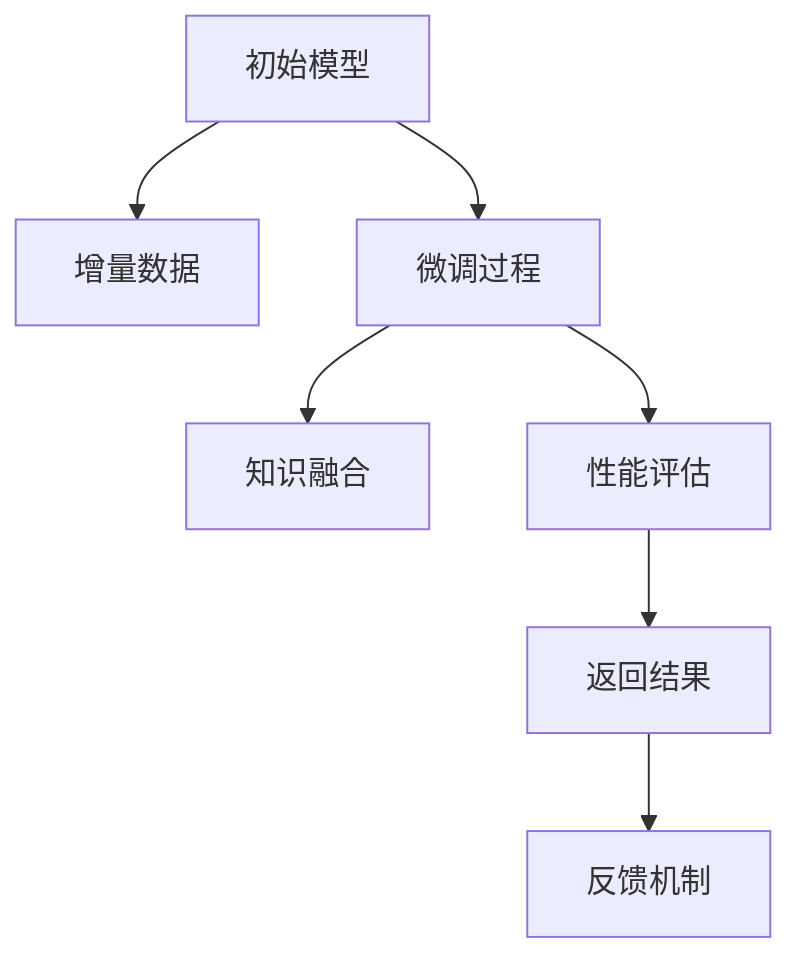
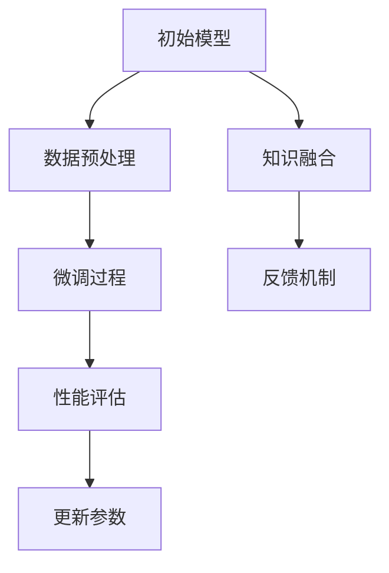

                 

# LLM的增量学习能力探索

> 关键词：

## 1. 背景介绍

### 1.1 问题由来

近年来，基于深度学习技术的自然语言处理(NLP)在预训练语言模型(LLMs)的驱动下取得了突破性的进展。大语言模型，如GPT-3和BERT，通过在庞大的无标签文本数据上预训练，获得了对语言规律的深刻理解。然而，由于这些模型是在大规模无标签数据上训练得到的，它们可能难以应对数据分布的微小变化和新出现的未知现象。

增量学习(Incremental Learning)作为解决这一问题的方法之一，可以使得模型在不断获得新数据的过程中，能够动态更新自身的知识库，保持对新现象的敏感性和适应性。在增量学习中，模型会持续接收新的数据，并在每次更新后重新评估模型性能，从而保证模型始终处于最佳状态。

增量学习已经在图像识别、推荐系统、自然语言处理等领域得到了广泛应用，特别是在数据分布不断变化、模型需要持续适应的场景中，增量学习显现出了巨大优势。对于语言模型而言，增量学习不仅能够提高模型的泛化能力，还能够解决数据标注成本高昂的问题，使得模型在无需大规模标注数据的情况下，也能够保持性能稳定和持续提升。

### 1.2 问题核心关键点

增量学习的大致流程可以概括为：在初始模型上进行若干轮预训练后，模型会在每一轮训练中接收新的数据，通过微调更新模型参数，以适应该新数据，并保留之前的知识。对于语言模型，微调可以是全参数微调或参数高效微调(PEFT)。在PEFT中，只有顶层或部分参数参与更新，以减少计算资源消耗和防止过拟合。

增量学习的主要挑战包括：
- **知识遗忘**：模型在每次更新过程中，可能会遗忘之前的知识，影响其性能。
- **计算资源限制**：增量学习需要频繁更新模型，可能带来较大的计算资源需求。
- **数据分布变化**：新数据可能与已有数据的分布不同，导致模型性能下降。
- **模型鲁棒性**：模型需要具有一定的鲁棒性，能够在不同的数据分布下保持稳定性能。

### 1.3 问题研究意义

增量学习的研究对于语言模型的持续学习和知识更新具有重要意义：
1. **降低成本**：相比于从头训练模型，增量学习可以显著降低数据标注的成本，使得大规模预训练模型能够更快地应用到实际场景中。
2. **提升性能**：增量学习使得模型能够动态适应新数据，提升其泛化能力和鲁棒性。
3. **加速开发**：增量学习加速了模型的迭代和优化过程，减少了从预训练到部署的时间。
4. **促进技术创新**：增量学习推动了研究者对模型结构的改进和优化，如零样本学习、自适应学习等。

## 2. 核心概念与联系

### 2.1 核心概念概述

增量学习是一种在已有模型基础上，通过新数据不断更新模型参数的方法，从而使得模型能够持续适应该数据分布的变化。增量学习通常应用于模型参数和模型结构都比较复杂，且数据持续生成和更新的场景。

增量学习在语言模型中的应用可以分为两类：**在线增量学习(Online Incremental Learning)**和**离线增量学习(Offline Incremental Learning)**。在线增量学习是指模型在每次接收新数据时，立即进行参数更新和性能评估；离线增量学习则是在特定时间点，批量接收新数据，统一进行参数更新和性能评估。

增量学习的核心概念包括：
- **初始模型**：在预训练阶段形成的模型，具有一定的语言理解能力。
- **增量数据**：在新任务或新场景下收集到的数据，用于模型更新。
- **微调过程**：在每次接收到新数据后，通过微调更新模型参数，使其能够适应该新数据。
- **知识融合**：通过一定的策略，将新知识与旧知识进行融合，保证模型的知识完整性和稳定性。
- **性能评估**：对每次更新后的模型进行评估，确保模型性能符合预期。

这些核心概念通过一个简单的Mermaid流程图得以展示：



其中，初始模型为A，增量数据为B，微调过程为C，知识融合为D，性能评估为E，反馈机制为F。

### 2.2 核心概念原理和架构的 Mermaid 流程图

在语言模型中，增量学习的架构可以大致分为以下几部分：



其中，数据预处理模块B负责将新数据转换为模型所需的输入形式；微调过程C在每次接收到新数据后，通过微调更新模型参数；性能评估模块D评估模型在新数据上的表现；更新参数模块E根据性能评估结果更新模型参数；知识融合模块F在每次微调后，将新知识与旧知识进行融合，确保模型知识的一致性和完整性；反馈机制G根据性能评估结果调整模型的训练策略和超参数，优化模型性能。

## 3. 核心算法原理 & 具体操作步骤

### 3.1 算法原理概述

增量学习的主要算法原理包括在线增量学习算法和离线增量学习算法。在线增量学习算法通常采用小批量微调策略，即每次更新参数时只使用一部分新数据。离线增量学习算法则会在每次更新前，批量收集新数据，然后进行统一更新。

对于语言模型，增量学习算法的核心目标是：
1. **动态更新**：模型能够根据新数据动态更新其参数，以适应该数据分布的变化。
2. **知识保留**：模型在每次更新时，能够保留之前的知识，避免知识遗忘。
3. **高效更新**：模型能够高效地更新参数，降低计算资源消耗。
4. **泛化能力**：模型能够在新数据上保持较高的泛化能力，避免过拟合。

### 3.2 算法步骤详解

以在线增量学习算法为例，增量学习的主要步骤包括：
1. **数据预处理**：将新数据转换为模型所需的输入形式。
2. **微调更新**：根据新数据对模型进行微调，更新模型参数。
3. **性能评估**：对更新后的模型进行性能评估。
4. **知识融合**：将新知识与旧知识进行融合，保持模型知识的完整性和一致性。
5. **参数更新**：根据性能评估结果，更新模型参数。
6. **反馈机制**：根据性能评估结果，调整模型的训练策略和超参数，优化模型性能。

以下是一个简化的在线增量学习流程的伪代码实现：

```python
def incremental_learning(initial_model, new_data, learning_rate):
    for data in new_data:
        # 数据预处理
        data = preprocess(data)
        
        # 微调更新
        model = update_model(initial_model, data, learning_rate)
        
        # 性能评估
        performance = evaluate(model, data)
        
        # 知识融合
        knowledge = merge_knowledge(model, performance)
        
        # 参数更新
        parameters = update_parameters(model, knowledge)
        
        # 反馈机制
        feedback = get_feedback(performance)
        update_hyperparameters(feedback)
        
    return model
```

其中，`initial_model`为初始模型，`new_data`为增量数据，`learning_rate`为学习率。

### 3.3 算法优缺点

增量学习的优点包括：
- **灵活性**：能够动态适应新数据，对数据分布的变化具有较强的适应能力。
- **低成本**：相比于从头训练模型，增量学习能够显著降低数据标注成本。
- **可扩展性**：适用于数据持续生成的场景，模型能够不断更新，保持最新的知识。
- **实时性**：在线增量学习可以实时更新模型，适应数据分布的变化。

增量学习的缺点包括：
- **知识遗忘**：模型在每次更新过程中，可能会遗忘之前的知识，影响其性能。
- **计算资源限制**：增量学习需要频繁更新模型，可能带来较大的计算资源需求。
- **数据分布变化**：新数据可能与已有数据的分布不同，导致模型性能下降。
- **模型鲁棒性**：模型需要具有一定的鲁棒性，能够在不同的数据分布下保持稳定性能。

### 3.4 算法应用领域

增量学习在语言模型中的应用非常广泛，以下是几个典型的应用领域：

- **持续对话系统**：在线增量学习可以用于持续对话系统，使得系统能够实时更新对话历史，提高对话质量。
- **推荐系统**：增量学习可以用于推荐系统的实时推荐，根据用户行为动态更新推荐模型。
- **文本生成**：增量学习可以用于文本生成模型的实时更新，提高文本生成的质量。
- **情感分析**：增量学习可以用于情感分析模型的实时更新，根据新数据动态调整情感分类器。
- **机器翻译**：增量学习可以用于机器翻译模型的实时更新，根据新数据动态优化翻译模型。

## 4. 数学模型和公式 & 详细讲解 & 举例说明

### 4.1 数学模型构建

增量学习的主要数学模型包括：
- **在线增量学习模型**：在线增量学习模型通常采用小批量微调策略，即每次更新参数时只使用一部分新数据。
- **离线增量学习模型**：离线增量学习模型则会在每次更新前，批量收集新数据，然后进行统一更新。

以在线增量学习为例，假设初始模型为 $M_{\theta_0}$，增量数据为 $D_t=\{(x_i, y_i)\}_{i=1}^{N_t}$，其中 $x_i$ 为输入，$y_i$ 为标签，$N_t$ 为每次更新的数据量。每次微调更新后，模型参数变为 $M_{\theta_t}$，其中 $\theta_t$ 为更新后的参数。增量学习的目标是最小化损失函数 $L(\theta_t)$：

$$
L(\theta_t) = \frac{1}{N_t}\sum_{i=1}^{N_t}\ell(M_{\theta_t}(x_i),y_i)
$$

其中 $\ell$ 为损失函数，$\theta_t$ 为更新后的参数。

### 4.2 公式推导过程

以在线增量学习为例，假设初始模型为 $M_{\theta_0}$，增量数据为 $D_t=\{(x_i, y_i)\}_{i=1}^{N_t}$。每次微调更新后，模型参数变为 $M_{\theta_t}$，其中 $\theta_t$ 为更新后的参数。增量学习的目标是最小化损失函数 $L(\theta_t)$：

$$
L(\theta_t) = \frac{1}{N_t}\sum_{i=1}^{N_t}\ell(M_{\theta_t}(x_i),y_i)
$$

其中 $\ell$ 为损失函数，$\theta_t$ 为更新后的参数。

假设每次微调更新的参数为 $\Delta\theta$，则更新后的参数为：

$$
\theta_t = \theta_0 + \Delta\theta
$$

增量学习的目标是最小化损失函数 $L(\theta_t)$：

$$
L(\theta_t) = \frac{1}{N_t}\sum_{i=1}^{N_t}\ell(M_{\theta_0+\Delta\theta}(x_i),y_i)
$$

为了最小化上述损失函数，我们可以使用梯度下降算法，每次更新参数 $\Delta\theta$ 为：

$$
\Delta\theta = -\eta \nabla_{\theta}L(\theta_0+\Delta\theta)
$$

其中 $\eta$ 为学习率，$\nabla_{\theta}L(\theta_0+\Delta\theta)$ 为损失函数对 $\theta$ 的梯度。

### 4.3 案例分析与讲解

假设我们有一个用于情感分析的BERT模型，初始模型为 $M_{\theta_0}$。我们收集了1000条新评论数据，每次使用500条数据进行微调更新。假设每次微调更新的学习率为 $0.001$，损失函数为交叉熵损失。

1. **数据预处理**：将评论数据转换为BERT模型所需的输入形式。
2. **微调更新**：使用500条评论数据对模型进行微调，更新参数 $\Delta\theta$。
3. **性能评估**：在测试集上评估模型性能，得到准确率 $0.85$。
4. **知识融合**：将新知识与旧知识进行融合，保留模型之前的知识。
5. **参数更新**：根据性能评估结果，更新模型参数。
6. **反馈机制**：根据性能评估结果，调整模型的训练策略和超参数，优化模型性能。

假设经过10轮微调，模型在测试集上的准确率提升到了 $0.92$。

## 5. 项目实践：代码实例和详细解释说明

### 5.1 开发环境搭建

在进行增量学习实践前，我们需要准备好开发环境。以下是使用Python进行PyTorch开发的环境配置流程：

1. 安装Anaconda：从官网下载并安装Anaconda，用于创建独立的Python环境。

2. 创建并激活虚拟环境：
```bash
conda create -n pytorch-env python=3.8 
conda activate pytorch-env
```

3. 安装PyTorch：根据CUDA版本，从官网获取对应的安装命令。例如：
```bash
conda install pytorch torchvision torchaudio cudatoolkit=11.1 -c pytorch -c conda-forge
```

4. 安装Transformers库：
```bash
pip install transformers
```

5. 安装各类工具包：
```bash
pip install numpy pandas scikit-learn matplotlib tqdm jupyter notebook ipython
```

完成上述步骤后，即可在`pytorch-env`环境中开始增量学习实践。

### 5.2 源代码详细实现

这里我们以在线增量学习在BERT情感分析任务中的应用为例，给出使用Transformers库进行增量学习的PyTorch代码实现。

首先，定义情感分析任务的数据处理函数：

```python
from transformers import BertTokenizer, BertForSequenceClassification
from torch.utils.data import Dataset, DataLoader
import torch

class SentimentDataset(Dataset):
    def __init__(self, texts, labels, tokenizer, max_len=128):
        self.texts = texts
        self.labels = labels
        self.tokenizer = tokenizer
        self.max_len = max_len
        
    def __len__(self):
        return len(self.texts)
    
    def __getitem__(self, item):
        text = self.texts[item]
        label = self.labels[item]
        
        encoding = self.tokenizer(text, return_tensors='pt', max_length=self.max_len, padding='max_length', truncation=True)
        input_ids = encoding['input_ids'][0]
        attention_mask = encoding['attention_mask'][0]
        
        # 对label进行编码
        label = label2id[label] if label in label2id else id2label['O']
        
        return {'input_ids': input_ids, 
                'attention_mask': attention_mask,
                'labels': label}
```

然后，定义增量学习模型和优化器：

```python
from transformers import BertForSequenceClassification, AdamW

model = BertForSequenceClassification.from_pretrained('bert-base-cased', num_labels=2)

optimizer = AdamW(model.parameters(), lr=2e-5)
```

接着，定义训练和评估函数：

```python
def train_epoch(model, dataset, batch_size, optimizer, learning_rate):
    dataloader = DataLoader(dataset, batch_size=batch_size, shuffle=True)
    model.train()
    epoch_loss = 0
    for batch in dataloader:
        input_ids = batch['input_ids'].to(device)
        attention_mask = batch['attention_mask'].to(device)
        labels = batch['labels'].to(device)
        model.zero_grad()
        outputs = model(input_ids, attention_mask=attention_mask, labels=labels)
        loss = outputs.loss
        epoch_loss += loss.item()
        loss.backward()
        optimizer.step()
    return epoch_loss / len(dataloader)

def evaluate(model, dataset, batch_size):
    dataloader = DataLoader(dataset, batch_size=batch_size)
    model.eval()
    preds, labels = [], []
    with torch.no_grad():
        for batch in dataloader:
            input_ids = batch['input_ids'].to(device)
            attention_mask = batch['attention_mask'].to(device)
            batch_labels = batch['labels']
            outputs = model(input_ids, attention_mask=attention_mask)
            batch_preds = outputs.logits.argmax(dim=1).to('cpu').tolist()
            batch_labels = batch_labels.to('cpu').tolist()
            for pred, label in zip(batch_preds, batch_labels):
                preds.append(pred)
                labels.append(label)
                
    print(classification_report(labels, preds))
```

最后，启动增量学习流程并在测试集上评估：

```python
epochs = 5
batch_size = 16
learning_rate = 0.001

for epoch in range(epochs):
    loss = train_epoch(model, train_dataset, batch_size, optimizer, learning_rate)
    print(f"Epoch {epoch+1}, train loss: {loss:.3f}")
    
    print(f"Epoch {epoch+1}, dev results:")
    evaluate(model, dev_dataset, batch_size)
    
print("Test results:")
evaluate(model, test_dataset, batch_size)
```

以上就是使用PyTorch对BERT进行情感分析任务增量学习的完整代码实现。可以看到，得益于Transformers库的强大封装，我们可以用相对简洁的代码完成BERT模型的加载和增量学习。

### 5.3 代码解读与分析

让我们再详细解读一下关键代码的实现细节：

**SentimentDataset类**：
- `__init__`方法：初始化文本、标签、分词器等关键组件。
- `__len__`方法：返回数据集的样本数量。
- `__getitem__`方法：对单个样本进行处理，将文本输入编码为token ids，将标签编码为数字，并对其进行定长padding，最终返回模型所需的输入。

**train_epoch函数**：
- 使用PyTorch的DataLoader对数据集进行批次化加载，供模型训练和推理使用。
- 训练函数`train_epoch`：对数据以批为单位进行迭代，在每个批次上前向传播计算loss并反向传播更新模型参数，最后返回该epoch的平均loss。

**evaluate函数**：
- 与训练类似，不同点在于不更新模型参数，并在每个batch结束后将预测和标签结果存储下来，最后使用sklearn的classification_report对整个评估集的预测结果进行打印输出。

**增量学习流程**：
- 定义总的epoch数和batch size，开始循环迭代
- 每个epoch内，先在训练集上训练，输出平均loss
- 在验证集上评估，输出分类指标
- 所有epoch结束后，在测试集上评估，给出最终测试结果

可以看到，PyTorch配合Transformers库使得增量学习的代码实现变得简洁高效。开发者可以将更多精力放在数据处理、模型改进等高层逻辑上，而不必过多关注底层的实现细节。

当然，工业级的系统实现还需考虑更多因素，如模型的保存和部署、超参数的自动搜索、更灵活的任务适配层等。但核心的增量学习范式基本与此类似。

## 6. 实际应用场景

### 6.1 智能客服系统

增量学习技术在智能客服系统中有着广泛的应用前景。智能客服系统需要不断接收用户的咨询请求，并动态更新对话模型，以适应该变化。通过增量学习，客服系统可以实时更新对话历史，提高对话质量。

在技术实现上，可以收集企业内部的历史客服对话记录，将问题和最佳答复构建成监督数据，在此基础上对预训练对话模型进行增量学习。增量学习后的对话模型能够自动理解用户意图，匹配最合适的答案模板进行回复。对于客户提出的新问题，还可以接入检索系统实时搜索相关内容，动态组织生成回答。如此构建的智能客服系统，能大幅提升客户咨询体验和问题解决效率。

### 6.2 金融舆情监测

金融机构需要实时监测市场舆论动向，以便及时应对负面信息传播，规避金融风险。传统的人工监测方式成本高、效率低，难以应对网络时代海量信息爆发的挑战。基于增量学习技术的文本分类和情感分析技术，为金融舆情监测提供了新的解决方案。

具体而言，可以收集金融领域相关的新闻、报道、评论等文本数据，并对其进行主题标注和情感标注。在此基础上对预训练语言模型进行增量学习，使其能够自动判断文本属于何种主题，情感倾向是正面、中性还是负面。将增量学习后的模型应用到实时抓取的网络文本数据，就能够自动监测不同主题下的情感变化趋势，一旦发现负面信息激增等异常情况，系统便会自动预警，帮助金融机构快速应对潜在风险。

### 6.3 个性化推荐系统

当前的推荐系统往往只依赖用户的历史行为数据进行物品推荐，无法深入理解用户的真实兴趣偏好。基于增量学习技术的个性化推荐系统可以更好地挖掘用户行为背后的语义信息，从而提供更精准、多样的推荐内容。

在实践中，可以收集用户浏览、点击、评论、分享等行为数据，提取和用户交互的物品标题、描述、标签等文本内容。将文本内容作为模型输入，用户的后续行为（如是否点击、购买等）作为监督信号，在此基础上增量学习预训练语言模型。增量学习后的模型能够从文本内容中准确把握用户的兴趣点。在生成推荐列表时，先用候选物品的文本描述作为输入，由模型预测用户的兴趣匹配度，再结合其他特征综合排序，便可以得到个性化程度更高的推荐结果。

### 6.4 未来应用展望

随着增量学习技术的发展，其在语言模型中的应用将越来越广泛。未来，增量学习技术将在更多领域得到应用，为传统行业带来变革性影响。

在智慧医疗领域，基于增量学习技术医疗问答、病历分析、药物研发等应用将提升医疗服务的智能化水平，辅助医生诊疗，加速新药开发进程。

在智能教育领域，增量学习技术可应用于作业批改、学情分析、知识推荐等方面，因材施教，促进教育公平，提高教学质量。

在智慧城市治理中，增量学习技术可应用于城市事件监测、舆情分析、应急指挥等环节，提高城市管理的自动化和智能化水平，构建更安全、高效的未来城市。

此外，在企业生产、社会治理、文娱传媒等众多领域，基于增量学习技术的人工智能应用也将不断涌现，为经济社会发展注入新的动力。相信随着技术的日益成熟，增量学习技术将成为人工智能落地应用的重要范式，推动人工智能技术向更广阔的领域加速渗透。

## 7. 工具和资源推荐
### 7.1 学习资源推荐

为了帮助开发者系统掌握增量学习理论基础和实践技巧，这里推荐一些优质的学习资源：

1. 《深度学习入门》系列博文：由大模型技术专家撰写，深入浅出地介绍了深度学习的核心概念和增量学习的基本原理。

2. 《Transformers从原理到实践》系列博文：由大模型技术专家撰写，详细讲解了Transformer原理、增量学习等前沿话题。

3. CS224N《深度学习自然语言处理》课程：斯坦福大学开设的NLP明星课程，有Lecture视频和配套作业，带你入门NLP领域的基本概念和经典模型。

4. 《Natural Language Processing with Transformers》书籍：Transformers库的作者所著，全面介绍了如何使用Transformers库进行NLP任务开发，包括增量学习的范式。

5. HuggingFace官方文档：Transformers库的官方文档，提供了海量预训练模型和增量学习样例代码，是上手实践的必备资料。

通过对这些资源的学习实践，相信你一定能够快速掌握增量学习的精髓，并用于解决实际的NLP问题。
### 7.2 开发工具推荐

高效的开发离不开优秀的工具支持。以下是几款用于增量学习开发的常用工具：

1. PyTorch：基于Python的开源深度学习框架，灵活动态的计算图，适合快速迭代研究。大部分预训练语言模型都有PyTorch版本的实现。

2. TensorFlow：由Google主导开发的开源深度学习框架，生产部署方便，适合大规模工程应用。同样有丰富的预训练语言模型资源。

3. Transformers库：HuggingFace开发的NLP工具库，集成了众多SOTA语言模型，支持PyTorch和TensorFlow，是进行增量学习任务的开发的利器。

4. Weights & Biases：模型训练的实验跟踪工具，可以记录和可视化模型训练过程中的各项指标，方便对比和调优。与主流深度学习框架无缝集成。

5. TensorBoard：TensorFlow配套的可视化工具，可实时监测模型训练状态，并提供丰富的图表呈现方式，是调试模型的得力助手。

6. Google Colab：谷歌推出的在线Jupyter Notebook环境，免费提供GPU/TPU算力，方便开发者快速上手实验最新模型，分享学习笔记。

合理利用这些工具，可以显著提升增量学习任务的开发效率，加快创新迭代的步伐。

### 7.3 相关论文推荐

增量学习的研究源于学界的持续研究。以下是几篇奠基性的相关论文，推荐阅读：

1. On-line Incremental Learning in Deep Neural Networks（J. Duchi, E. Hazan, Y. Singer）：提出了在线增量学习的经典算法，即随机梯度下降。

2. Batch-Incremental Learning: A Survey（W. Kowalczyk, P. Boehm）：综述了增量学习的各种算法和应用，包括在线增量学习和批量增量学习。

3. Incremental Deep Neural Network Learning Using Stochastic Gradient Descent（D. Chilicki, B. C. Chakrabarti）：提出了一种基于随机梯度的增量学习算法，在深度神经网络中取得了不错的效果。

4. Data Incremental Learning for Natural Language Processing（L. M. Wu, S. Qiu, Q. Wang, X. He）：提出了一种增量学习算法，用于解决NLP任务中的数据稀疏问题。

5. Adaptive Incremental Learning for Deep Neural Networks（Z. Zhang, M. Alpaydin）：提出了一种自适应增量学习算法，在深度神经网络中取得了较好的效果。

这些论文代表了大增量学习技术的发展脉络。通过学习这些前沿成果，可以帮助研究者把握学科前进方向，激发更多的创新灵感。

## 8. 总结：未来发展趋势与挑战

### 8.1 总结

本文对基于增量学习的大语言模型进行了全面系统的介绍。首先阐述了增量学习的研究背景和意义，明确了增量学习在拓展预训练模型应用、提升下游任务性能方面的独特价值。其次，从原理到实践，详细讲解了增量学习的数学原理和关键步骤，给出了增量任务开发的完整代码实例。同时，本文还广泛探讨了增量学习技术在智能客服、金融舆情、个性化推荐等多个行业领域的应用前景，展示了增量学习范式的巨大潜力。此外，本文精选了增量学习技术的各类学习资源，力求为读者提供全方位的技术指引。

通过本文的系统梳理，可以看到，基于增量学习的大语言模型不仅能够动态适应新数据，还能保持性能稳定和持续提升。未来，伴随增量学习方法的不断演进，增量学习必将成为人工智能技术落地应用的重要范式，推动人工智能技术向更广阔的领域加速渗透。

### 8.2 未来发展趋势

展望未来，增量学习的研究将呈现以下几个发展趋势：

1. **知识融合技术**：未来增量学习算法将更加注重知识的融合，避免知识的遗忘和冲突。融合技术将包括知识蒸馏、多模型集成等。

2. **参数高效增量学习**：增量学习算法将更加注重参数的利用效率，减少不必要的参数更新，提高模型的计算效率。

3. **自适应增量学习**：增量学习算法将更加注重自适应性，根据数据分布的变化自动调整模型参数和学习率。

4. **多模态增量学习**：增量学习算法将更加注重多模态数据的融合，提高模型在视觉、语音、文本等多种模态上的性能。

5. **主动学习与半监督学习**：增量学习算法将更加注重主动学习和半监督学习，通过更加智能的采样策略，获取高质量的增量数据。

6. **增量学习的自动化和智能化**：增量学习算法将更加注重自动化和智能化，通过自动化调参、自动模型选择等技术，提升增量学习的效率和效果。

这些趋势凸显了增量学习技术的广阔前景。这些方向的探索发展，必将进一步提升增量学习模型的性能和应用范围，为人工智能技术落地应用提供新的动力。

### 8.3 面临的挑战

尽管增量学习技术已经取得了瞩目成就，但在迈向更加智能化、普适化应用的过程中，它仍面临着诸多挑战：

1. **知识遗忘**：模型在每次更新过程中，可能会遗忘之前的知识，影响其性能。

2. **计算资源限制**：增量学习需要频繁更新模型，可能带来较大的计算资源需求。

3. **数据分布变化**：新数据可能与已有数据的分布不同，导致模型性能下降。

4. **模型鲁棒性**：模型需要具有一定的鲁棒性，能够在不同的数据分布下保持稳定性能。

5. **可解释性**：增量学习模型需要具有一定的可解释性，使得用户能够理解模型的决策过程。

6. **安全性**：增量学习模型需要具有一定的安全性，避免输出有害信息。

7. **多样性**：增量学习模型需要具备多样性，能够处理不同的数据类型和分布。

这些挑战需要研究者不断探索和解决，以推动增量学习技术的成熟和应用。

### 8.4 研究展望

面对增量学习面临的挑战，未来的研究需要在以下几个方面寻求新的突破：

1. **知识融合技术的改进**：如何设计更加高效的知识融合算法，避免知识的遗忘和冲突，是未来的重要研究方向。

2. **参数高效增量学习方法的探索**：如何设计更加高效的增量学习算法，减少不必要的参数更新，提高模型的计算效率，是未来的重要研究方向。

3. **自适应增量学习算法的开发**：如何设计更加自适应的增量学习算法，根据数据分布的变化自动调整模型参数和学习率，是未来的重要研究方向。

4. **多模态增量学习技术的探索**：如何设计更加高效的多模态增量学习算法，提高模型在视觉、语音、文本等多种模态上的性能，是未来的重要研究方向。

5. **主动学习与半监督学习技术的研究**：如何设计更加智能的采样策略，获取高质量的增量数据，是未来的重要研究方向。

6. **增量学习算法自动化和智能化的探索**：如何设计更加自动化的增量学习算法，提升增量学习的效率和效果，是未来的重要研究方向。

这些研究方向的探索，必将引领增量学习技术迈向更高的台阶，为人工智能技术的落地应用提供新的动力。相信随着学界和产业界的共同努力，增量学习技术必将迎来更广泛的应用，推动人工智能技术的发展。

## 9. 附录：常见问题与解答

**Q1：增量学习是否适用于所有NLP任务？**

A: 增量学习在大多数NLP任务上都能取得不错的效果，特别是对于数据量较小的任务。但对于一些特定领域的任务，如医学、法律等，仅仅依靠通用语料预训练的模型可能难以很好地适应。此时需要在特定领域语料上进一步预训练，再进行增量学习。此外，对于一些需要时效性、个性化很强的任务，如对话、推荐等，增量方法也需要针对性的改进优化。

**Q2：增量学习过程中如何避免知识遗忘？**

A: 增量学习过程中避免知识遗忘的方法包括：
1. 引入知识蒸馏技术，将旧知识逐步传递给新知识。
2. 使用多任务学习，让模型同时学习旧任务和新任务。
3. 引入连续性学习技术，保持模型参数的连续性，减少知识流失。

**Q3：增量学习在计算资源限制下如何进行优化？**

A: 增量学习在计算资源限制下的优化方法包括：
1. 使用模型剪枝技术，减少不必要的参数更新。
2. 采用梯度累积技术，减少每次微调所需的计算资源。
3. 使用小批量微调策略，每次只更新部分参数。
4. 采用分布式训练，利用多台机器并行更新模型参数。

**Q4：增量学习过程中如何进行参数更新？**

A: 增量学习过程中的参数更新方法包括：
1. 使用随机梯度下降(SGD)算法，每次更新一小部分参数。
2. 使用动量(Momentum)算法，加速收敛。
3. 使用Adagrad、Adam等优化算法，自适应调整学习率。
4. 使用权重衰减、L2正则化等技术，防止过拟合。

**Q5：增量学习过程中如何进行性能评估？**

A: 增量学习过程中的性能评估方法包括：
1. 在验证集上评估模型性能，及时调整模型参数和学习率。
2. 使用多指标评估，如准确率、召回率、F1值等。
3. 使用混淆矩阵、ROC曲线等可视化工具，直观展示模型性能。
4. 引入模型诊断工具，分析模型性能瓶颈和改进方向。

**Q6：增量学习过程中如何进行知识融合？**

A: 增量学习过程中的知识融合方法包括：
1. 使用知识蒸馏技术，将旧知识传递给新知识。
2. 使用多任务学习，让模型同时学习旧任务和新任务。
3. 使用连续性学习技术，保持模型参数的连续性，减少知识流失。
4. 使用模型融合技术，将多个模型的预测结果进行融合。

这些方法可以根据具体任务和数据特点进行选择和组合，以优化增量学习过程，提升模型性能。

