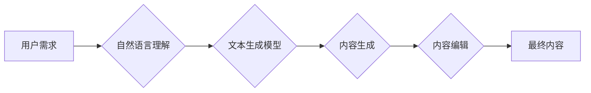

                 

## 聊天机器人写作助手：内容生成和编辑

> 关键词：聊天机器人、自然语言处理、文本生成、内容创作、写作辅助、人工智能、深度学习、Transformer模型

## 1. 背景介绍

在当今数字时代，高质量的内容创作需求日益增长。无论是企业营销、个人博客还是学术研究，人们都需要能够快速、高效地生成高质量的文本内容。然而，传统的写作方式往往耗时费力，且难以保证内容的原创性和质量。

聊天机器人技术近年来取得了长足进步，尤其是在自然语言处理（NLP）领域。这些机器人能够理解和生成人类语言，具备了强大的文本处理能力。基于此，聊天机器人写作助手应运而生，旨在利用人工智能技术辅助用户进行内容创作和编辑。

## 2. 核心概念与联系

聊天机器人写作助手的核心概念包括：

* **自然语言处理（NLP）：** 聊天机器人写作助手依赖于NLP技术来理解用户的写作需求，分析文本结构和语义，并生成符合语法和语法的文本内容。
* **文本生成模型：** 这些模型能够根据输入的文本提示或上下文生成新的文本内容。常见的文本生成模型包括RNN、LSTM和Transformer模型。
* **内容创作流程：** 聊天机器人写作助手通常可以协助用户完成整个内容创作流程，从构思主题、生成草稿到编辑和润色。

**核心概念架构图：**



## 3. 核心算法原理 & 具体操作步骤

### 3.1  算法原理概述

聊天机器人写作助手通常采用基于深度学习的文本生成模型，例如Transformer模型，来实现内容生成功能。这些模型通过训练大量的文本数据，学习语言的语法规则、语义关系和写作风格，从而能够生成流畅、自然的文本内容。

### 3.2  算法步骤详解

1. **数据预处理：** 将原始文本数据进行清洗、分词、标记等预处理操作，使其能够被模型理解和训练。
2. **模型训练：** 使用预处理后的文本数据训练Transformer模型，通过调整模型参数，使其能够准确地预测下一个词的出现概率。
3. **文本生成：** 根据用户的写作需求，输入文本提示或上下文到训练好的模型中，模型会根据训练数据和输入信息，预测并生成新的文本内容。
4. **内容编辑：** 聊天机器人写作助手可以提供一些内容编辑功能，例如语法检查、风格调整、重复语句检测等，帮助用户完善和优化生成的文本内容。

### 3.3  算法优缺点

**优点：**

* **生成高质量内容：** 基于深度学习的文本生成模型能够生成流畅、自然的文本内容，并具备一定的原创性。
* **提高写作效率：** 聊天机器人写作助手可以帮助用户快速生成草稿，节省写作时间和精力。
* **个性化定制：** 可以根据用户的写作风格和需求进行模型训练和参数调整，生成个性化的文本内容。

**缺点：**

* **数据依赖性强：** 文本生成模型的性能取决于训练数据的质量和数量。
* **缺乏逻辑推理能力：** 聊天机器人写作助手主要依赖于统计模式，难以进行复杂的逻辑推理和深度思考。
* **伦理风险：** 文本生成模型可能被用于生成虚假信息或进行恶意攻击，需要谨慎使用。

### 3.4  算法应用领域

聊天机器人写作助手在以下领域具有广泛的应用前景：

* **内容营销：** 自动生成广告文案、社交媒体内容、博客文章等。
* **教育培训：** 辅助学生写作、生成学习材料、提供个性化辅导。
* **新闻报道：** 自动生成新闻稿件、总结新闻事件。
* **客户服务：** 自动回复客户咨询、生成常见问题解答。

## 4. 数学模型和公式 & 详细讲解 & 举例说明

### 4.1  数学模型构建

Transformer模型的核心是**自注意力机制（Self-Attention）**，它能够捕捉文本序列中不同词之间的关系，从而更好地理解上下文信息。

**自注意力机制公式：**

$$
Attention(Q, K, V) = \frac{exp(Q \cdot K^T / \sqrt{d_k})}{exp(Q \cdot K^T / \sqrt{d_k})} \cdot V
$$

其中：

* $Q$：查询矩阵
* $K$：键矩阵
* $V$：值矩阵
* $d_k$：键向量的维度

### 4.2  公式推导过程

自注意力机制通过计算查询向量 $Q$ 与键向量 $K$ 的点积，并将其归一化，得到每个词对其他词的注意力权重。然后，将注意力权重与值向量 $V$ 进行加权求和，得到最终的输出向量。

### 4.3  案例分析与讲解

假设我们有一个句子：“我爱吃苹果”。

* $Q$、$K$ 和 $V$ 都是句子中每个词对应的向量表示。
* 当计算“我”对其他词的注意力权重时，会发现“我”与“爱”和“吃”的注意力权重较高，因为它们在语义上相关。
* 因此，最终的输出向量会包含“我”与其他词的关系信息，从而更好地理解句子的语义。

## 5. 项目实践：代码实例和详细解释说明

### 5.1  开发环境搭建

* Python 3.7+
* TensorFlow 或 PyTorch 深度学习框架
* NLTK 自然语言处理库
* HuggingFace Transformers 库

### 5.2  源代码详细实现

```python
from transformers import pipeline

# 初始化文本生成器
generator = pipeline("text-generation", model="gpt2")

# 输入文本提示
prompt = "写一篇关于人工智能的文章"

# 生成文本内容
output = generator(prompt, max_length=200, num_return_sequences=3)

# 打印生成结果
for text in output:
    print(text["generated_text"])
```

### 5.3  代码解读与分析

* 使用HuggingFace Transformers库加载预训练的GPT-2模型。
* 使用pipeline函数初始化文本生成器。
* 设置文本提示和生成参数，例如最大长度和生成数量。
* 调用generator函数生成文本内容。
* 打印生成的文本内容。

### 5.4  运行结果展示

```
人工智能是近年来发展迅速的领域，它涉及到计算机科学、数学、逻辑学等多个学科。人工智能的目标是创造能够像人类一样思考和学习的机器。

人工智能技术已经应用于各个领域，例如医疗保健、金融、交通运输等。在医疗保健领域，人工智能可以帮助医生诊断疾病、预测患者风险。在金融领域，人工智能可以用于欺诈检测、风险管理等。

人工智能的发展对人类社会具有深远的影响，它将改变我们的生活方式、工作方式和社会结构。

人工智能技术的发展还面临着一些挑战，例如伦理问题、安全问题等。我们需要认真思考人工智能的发展方向，确保其能够造福人类。
```

## 6. 实际应用场景

### 6.1  内容营销

聊天机器人写作助手可以帮助企业自动生成广告文案、社交媒体内容、博客文章等，提高营销效率，并根据用户数据进行个性化定制。

### 6.2  教育培训

聊天机器人写作助手可以辅助学生写作，生成学习材料，提供个性化辅导，帮助学生提高写作能力和学习效率。

### 6.3  新闻报道

聊天机器人写作助手可以自动生成新闻稿件，总结新闻事件，帮助新闻机构提高报道效率，并及时发布新闻信息。

### 6.4  未来应用展望

随着人工智能技术的不断发展，聊天机器人写作助手将拥有更强大的功能和更广泛的应用场景。例如，未来可能能够生成更具创意和原创性的内容，并具备更强的逻辑推理能力和情感理解能力。

## 7. 工具和资源推荐

### 7.1  学习资源推荐

* **斯坦福大学CS224N自然语言处理课程：** https://web.stanford.edu/class/cs224n/
* **HuggingFace Transformers文档：** https://huggingface.co/docs/transformers/index

### 7.2  开发工具推荐

* **TensorFlow：** https://www.tensorflow.org/
* **PyTorch：** https://pytorch.org/
* **HuggingFace Transformers库：** https://huggingface.co/transformers/

### 7.3  相关论文推荐

* **Attention Is All You Need：** https://arxiv.org/abs/1706.03762
* **BERT: Pre-training of Deep Bidirectional Transformers for Language Understanding：** https://arxiv.org/abs/1810.04805

## 8. 总结：未来发展趋势与挑战

### 8.1  研究成果总结

聊天机器人写作助手是人工智能技术与自然语言处理技术的结合，能够帮助用户高效地生成高质量的文本内容。

### 8.2  未来发展趋势

未来，聊天机器人写作助手将朝着以下方向发展：

* **更强大的生成能力：** 模型将能够生成更具创意、原创性和复杂性的文本内容。
* **更强的理解能力：** 模型将能够更好地理解用户的写作需求和上下文信息。
* **更个性化的定制：** 模型将能够根据用户的写作风格和需求进行个性化定制。

### 8.3  面临的挑战

聊天机器人写作助手也面临着一些挑战：

* **数据安全和隐私问题：** 模型的训练数据可能包含敏感信息，需要采取措施保护数据安全和隐私。
* **伦理问题：** 文本生成模型可能被用于生成虚假信息或进行恶意攻击，需要制定相应的伦理规范和监管机制。
* **可解释性问题：** 模型的决策过程难以理解，需要提高模型的可解释性。

### 8.4  研究展望

未来，研究者将继续探索新的算法和模型，提高聊天机器人写作助手的生成能力、理解能力和个性化定制能力，并解决其面临的挑战，使其能够更好地服务于人类社会。

## 9. 附录：常见问题与解答

**Q1：聊天机器人写作助手可以完全替代人类作家吗？**

**A1：** 目前，聊天机器人写作助手还无法完全替代人类作家。虽然它能够生成高质量的文本内容，但它缺乏人类的创造力和情感理解能力。

**Q2：如何确保聊天机器人写作助手生成的文本内容原创性？**

**A2：** 

可以使用一些技术手段来提高文本原创性，例如：

* 使用不同的训练数据
* 对模型进行微调
* 使用文本相似度检测工具

**Q3：聊天机器人写作助手会带来哪些伦理风险？**

**A3：** 

聊天机器人写作助手可能被用于生成虚假信息、进行恶意攻击等，需要制定相应的伦理规范和监管机制。

**作者：禅与计算机程序设计艺术 / Zen and the Art of Computer Programming**<end_of_turn>

