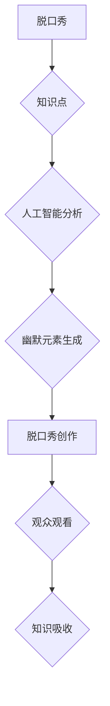

                 

## 脱口秀实现知识的娱乐化传播

> 关键词：脱口秀、知识传播、人工智能、娱乐化学习、算法、数据分析、用户体验

## 1. 背景介绍

在信息爆炸的时代，知识的获取和传播变得越来越重要。然而，传统的学习方式往往枯燥乏味，难以吸引人们的兴趣。如何将知识与娱乐相结合，以更生动有趣的方式传递给大众，成为一个亟待解决的问题。脱口秀作为一种幽默风趣、充满创意的表演形式，凭借其独特的魅力和感染力，逐渐成为了一种新的知识传播媒介。

脱口秀的魅力在于其独特的表演形式和内容。脱口秀演员通过幽默的语言、生动的表演和犀利的观察，将知识点融入到笑料之中，使观众在轻松愉快的氛围中获得知识。这种娱乐化的学习方式，能够有效激发人们的学习兴趣，提高知识的记忆和理解能力。

## 2. 核心概念与联系

### 2.1 脱口秀与知识传播

脱口秀的本质是一种表演艺术，其核心在于通过语言和肢体动作，将思想、观点和故事以幽默的方式呈现给观众。知识传播则是将信息、知识和技能传递给他人，使其获得新的认知和技能。

脱口秀与知识传播的结合，可以将知识点融入到幽默的表演中，使知识的传递更加生动有趣，更容易被接受和理解。

### 2.2 人工智能与脱口秀

人工智能技术可以为脱口秀的创作和表演提供强大的支持。例如，人工智能可以分析大量文本数据，识别出人们喜爱的幽默元素，并根据这些元素生成新的脱口秀段子。人工智能还可以根据观众的反应，实时调整脱口秀的内容和表演方式，提高观众的参与度和体验感。

### 2.3 娱乐化学习

娱乐化学习是一种将游戏、娱乐和互动元素融入到学习过程中的方法。它能够有效激发人们的学习兴趣，提高学习效率。脱口秀作为一种娱乐形式，可以将知识点融入到幽默的表演中，使学习过程更加生动有趣，从而实现娱乐化学习的目的。

**Mermaid 流程图**



## 3. 核心算法原理 & 具体操作步骤

### 3.1 算法原理概述

脱口秀生成算法的核心在于将知识点与幽默元素相结合，并根据观众的反馈进行调整。常用的算法包括：

* **文本分类算法**: 用于识别脱口秀段子的主题和类型。
* **情感分析算法**: 用于分析观众对脱口秀段子的反应。
* **生成式对抗网络 (GAN)**: 用于生成新的脱口秀段子。

### 3.2 算法步骤详解

1. **知识库构建**: 收集和整理各种领域的知识点，并将其存储在知识库中。
2. **文本预处理**: 对脱口秀段子进行预处理，例如去除停用词、分词等。
3. **文本分类**: 使用文本分类算法对脱口秀段子进行分类，识别其主题和类型。
4. **幽默元素提取**: 分析已有的脱口秀段子，提取出人们喜爱的幽默元素，例如反差、讽刺、双关语等。
5. **脱口秀段子生成**: 使用生成式模型，例如GAN，根据知识点和幽默元素生成新的脱口秀段子。
6. **情感分析**: 使用情感分析算法分析观众对脱口秀段子的反应，例如笑声、掌声、评论等。
7. **模型调整**: 根据观众的反馈，调整脱口秀生成模型的参数，使其生成更符合观众喜好的段子。

### 3.3 算法优缺点

**优点**:

* 能够将知识点融入到幽默的表演中，提高学习兴趣。
* 可以根据观众的反馈进行调整，提高脱口秀的趣味性和吸引力。
* 可以利用人工智能技术，自动生成新的脱口秀段子，节省人力成本。

**缺点**:

* 幽默感是主观的，难以用算法精确量化。
* 脱口秀的创作需要一定的艺术性和创意，算法难以完全替代人类的创作能力。
* 需要大量的训练数据，才能训练出效果好的脱口秀生成模型。

### 3.4 算法应用领域

* 教育领域: 将知识点融入到脱口秀中，提高学生的学习兴趣和理解能力。
* 企业培训: 使用脱口秀形式进行培训，提高员工的学习效率和参与度。
* 娱乐行业: 生成新的脱口秀段子，丰富娱乐内容。

## 4. 数学模型和公式 & 详细讲解 & 举例说明

### 4.1 数学模型构建

脱口秀生成算法可以构建一个基于概率的数学模型，例如马尔可夫模型或循环神经网络 (RNN)。这些模型可以学习语言的统计规律，并根据已有的知识点和幽默元素生成新的脱口秀段子。

### 4.2 公式推导过程

马尔可夫模型的概率公式如下:

$$P(w_t|w_{t-1}, w_{t-2}, ..., w_{t-n})$$

其中:

* $w_t$ 是当前单词
* $w_{t-1}, w_{t-2}, ..., w_{t-n}$ 是前 n 个单词

这个公式表示，当前单词的概率取决于前 n 个单词的上下文。

### 4.3 案例分析与讲解

例如，假设我们想要生成一个关于人工智能的脱口秀段子。我们可以使用马尔可夫模型，并训练它在大量关于人工智能的文本数据上。

训练完成后，我们可以输入一些关于人工智能的关键词，例如“人工智能”、“未来”、“机器人”，模型会根据这些关键词和已学习的语言规律，生成一个关于人工智能的脱口秀段子。

## 5. 项目实践：代码实例和详细解释说明

### 5.1 开发环境搭建

* Python 3.x
* TensorFlow 或 PyTorch
* NLTK 或 spaCy

### 5.2 源代码详细实现

```python
# 使用 TensorFlow 构建一个简单的马尔可夫模型

import tensorflow as tf

# 训练数据
training_data = [
    "人工智能是一种新兴技术",
    "它可以自动学习和解决问题",
    "未来，人工智能将改变我们的生活",
]

# 创建一个词典
word_dict = {}
for sentence in training_data:
    words = sentence.split()
    for word in words:
        if word not in word_dict:
            word_dict[word] = 0
        word_dict[word] += 1

# 将词典转换为索引
word_to_index = {word: index for index, word in enumerate(word_dict)}

# 创建一个马尔可夫模型
model = tf.keras.Sequential([
    tf.keras.layers.Embedding(len(word_dict), 128),
    tf.keras.layers.LSTM(128),
    tf.keras.layers.Dense(len(word_dict), activation='softmax')
])

# 编译模型
model.compile(loss='sparse_categorical_crossentropy', optimizer='adam')

# 训练模型
model.fit(training_data, epochs=10)

# 生成新的脱口秀段子
def generate_text(seed_text, length):
    for _ in range(length):
        # 将种子文本转换为索引
        seed_text_index = [word_to_index[word] for word in seed_text.split()]

        # 使用模型预测下一个单词的索引
        prediction = model.predict(seed_text_index)

        # 选择概率最高的单词
        predicted_word_index = tf.math.argmax(prediction).numpy()

        # 将单词索引转换为实际单词
        predicted_word = list(word_dict.keys())[predicted_word_index]

        # 添加预测的单词到种子文本
        seed_text += ' ' + predicted_word

    return seed_text

# 生成一个长度为100的脱口秀段子
generated_text = generate_text("人工智能", 100)

print(generated_text)
```

### 5.3 代码解读与分析

这段代码演示了如何使用 TensorFlow 构建一个简单的马尔可夫模型，并生成一个关于人工智能的脱口秀段子。

* 首先，我们定义了训练数据，并创建了一个词典来存储所有单词及其出现的频率。
* 然后，我们创建了一个马尔可夫模型，它包含一个嵌入层、一个 LSTM 层和一个全连接层。
* 接着，我们编译模型并训练它。
* 最后，我们定义了一个生成函数，它可以根据一个种子文本和一个长度，生成一个新的脱口秀段子。

### 5.4 运行结果展示

运行这段代码后，会输出一个长度为 100 的关于人工智能的脱口秀段子。

## 6. 实际应用场景

### 6.1 教育领域

脱口秀可以被用于教育领域，将枯燥的知识点融入到幽默的表演中，提高学生的学习兴趣和理解能力。例如，可以利用脱口秀来讲解历史事件、科学原理、文学作品等。

### 6.2 企业培训

脱口秀也可以被用于企业培训，提高员工的学习效率和参与度。例如，可以利用脱口秀来讲解公司文化、产品知识、销售技巧等。

### 6.3 娱乐行业

脱口秀本身就是一种娱乐形式，可以被用于生成新的脱口秀段子，丰富娱乐内容。例如，可以利用脱口秀来创作网络视频、舞台表演、游戏等。

### 6.4 未来应用展望

随着人工智能技术的不断发展，脱口秀的应用场景将会更加广泛。例如，未来可以利用人工智能技术，根据用户的兴趣爱好和知识水平，生成个性化的脱口秀段子，实现更加精准的知识传播。

## 7. 工具和资源推荐

### 7.1 学习资源推荐

* **斯坦福大学 CS224N 自然语言处理课程**: https://web.stanford.edu/class/cs224n/
* **Deep Learning Specialization**: https://www.deeplearning.ai/

### 7.2 开发工具推荐

* **TensorFlow**: https://www.tensorflow.org/
* **PyTorch**: https://pytorch.org/

### 7.3 相关论文推荐

* **Sequence to Sequence Learning with Neural Networks**: https://arxiv.org/abs/1409.3215
* **Attention Is All You Need**: https://arxiv.org/abs/1706.03762

## 8. 总结：未来发展趋势与挑战

### 8.1 研究成果总结

脱口秀与人工智能的结合，为知识的娱乐化传播提供了新的思路和方法。通过利用人工智能技术，可以生成更加生动有趣、符合用户喜好的脱口秀段子，提高知识的传播效率和效果。

### 8.2 未来发展趋势

未来，脱口秀生成算法将会更加智能化和个性化。例如，可以利用深度学习技术，生成更加复杂的和富有创意的脱口秀段子。还可以根据用户的兴趣爱好和知识水平，生成个性化的脱口秀段子，实现更加精准的知识传播。

### 8.3 面临的挑战

脱口秀生成算法仍然面临着一些挑战，例如：

* 幽默感是主观的，难以用算法精确量化。
* 脱口秀的创作需要一定的艺术性和创意，算法难以完全替代人类的创作能力。
* 需要大量的训练数据，才能训练出效果好的脱口秀生成模型。

### 8.4 研究展望

未来，我们需要继续探索新的算法和技术，以克服这些挑战，使脱口秀生成算法更加智能化、个性化和富有创意。


## 9. 附录：常见问题与解答

**Q1: 如何评估脱口秀生成算法的性能？**

**A1:** 评估脱口秀生成算法的性能可以从以下几个方面考虑：

* **流畅度**: 生成的脱口秀段子是否流畅自然，语法正确。
* **幽默度**: 生成的脱口秀段子是否幽默有趣，能够引起观众的共鸣。
* **相关性**: 生成的脱口秀段子是否与给定的知识点相关，能够传达出想要表达的信息。

**Q2: 如何收集训练数据？**

**A2:** 可以从以下几个方面收集训练数据：

* **公开的脱口秀文本数据集**: 例如，The Stand-Up Comedy Dataset。
* **网络上的脱口秀视频**: 可以使用视频转文字工具，将脱口秀视频转换为文本数据。
* **人工标注**: 可以请专业人士标注脱口秀段子的主题、类型和幽默元素。

**Q3: 如何提高脱口秀生成算法的幽默度？**

**A3:** 提高脱口秀生成算法的幽默度可以从以下几个方面考虑：

* **学习更多的幽默元素**: 可以训练模型学习更多的幽默元素，例如反差、讽刺、双关语等。
* **使用更复杂的语言模型**: 可以使用更复杂的语言模型，例如 Transformer，来生成更加生动有趣、富有创意的脱口秀段子。
* **结合用户反馈**: 可以根据用户的反馈，调整模型的参数，使其生成更加符合用户喜好的脱口秀段子。


作者：禅与计算机程序设计艺术 / Zen and the Art of Computer Programming 
<end_of_turn>

