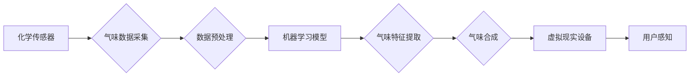

                 

## 虚拟嗅觉：AI创造的气味世界

> 关键词：人工智能、虚拟现实、嗅觉、气味识别、化学传感器、机器学习、神经网络、多模态感知

## 1. 背景介绍

人类五感中，嗅觉是最与记忆和情感紧密相连的感官之一。它能够唤起强烈的回忆，影响情绪，甚至引导行为。然而，与视觉、听觉等感官相比，嗅觉在计算机领域的研究相对滞后。传统的计算机无法直接感知气味，这限制了虚拟现实、增强现实等技术的沉浸式体验，也阻碍了嗅觉在医疗诊断、食品安全等领域的应用。

近年来，随着人工智能技术的飞速发展，虚拟嗅觉的研究取得了突破性进展。通过结合化学传感器、机器学习和神经网络等技术，科学家们正在努力构建能够识别和模拟气味的虚拟系统，为人类带来全新的感知体验。

## 2. 核心概念与联系

虚拟嗅觉的核心概念是将气味信息转化为计算机可理解的数字信号，并通过算法模拟和生成气味。

**架构图：**



**核心概念解释：**

* **化学传感器:** 用于检测气味分子，并将气味信息转化为电信号。
* **气味数据采集:** 收集化学传感器输出的电信号，并进行数字化处理。
* **数据预处理:** 对采集到的气味数据进行清洗、去噪等处理，提高数据质量。
* **机器学习模型:** 利用机器学习算法，训练模型识别不同气味特征。
* **气味特征提取:** 将气味数据转化为计算机可理解的特征向量。
* **气味合成:** 根据提取的气味特征，模拟和生成虚拟气味。
* **虚拟现实设备:** 用于输出虚拟气味，例如气味喷雾器、气味耳机等。
* **用户感知:** 用户通过虚拟现实设备感知到模拟的气味。

## 3. 核心算法原理 & 具体操作步骤

### 3.1  算法原理概述

虚拟嗅觉的核心算法主要包括气味识别和气味合成两个部分。

* **气味识别:** 利用机器学习算法，训练模型识别不同气味特征。常见的算法包括支持向量机、决策树、神经网络等。
* **气味合成:** 根据识别出的气味特征，模拟和生成虚拟气味。常用的方法包括混合气味、调制气味等。

### 3.2  算法步骤详解

**气味识别算法步骤:**

1. **数据采集:** 收集不同气味的样本数据，并将其数字化。
2. **数据预处理:** 对采集到的数据进行清洗、去噪等处理，提高数据质量。
3. **特征提取:** 利用特征提取算法，将气味数据转化为计算机可理解的特征向量。
4. **模型训练:** 利用机器学习算法，训练模型识别不同气味特征。
5. **模型评估:** 利用测试数据评估模型的识别精度。

**气味合成算法步骤:**

1. **气味特征分析:** 分析识别出的气味特征，确定其组成成分和比例。
2. **气味混合:** 根据气味特征，混合不同气味成分，生成虚拟气味。
3. **气味调制:** 利用调制技术，调整气味强度、持续时间等参数，模拟真实气味。
4. **气味输出:** 通过虚拟现实设备输出模拟的气味。

### 3.3  算法优缺点

**气味识别算法:**

* **优点:** 识别精度高，能够识别复杂的气味混合物。
* **缺点:** 需要大量的训练数据，训练时间长，算法复杂度高。

**气味合成算法:**

* **优点:** 可以生成逼真的虚拟气味，能够模拟多种气味类型。
* **缺点:** 现有的气味合成技术还无法完全模拟真实气味，气味种类和强度有限。

### 3.4  算法应用领域

虚拟嗅觉算法在多个领域具有广泛的应用前景，例如：

* **虚拟现实和增强现实:** 为虚拟世界增添更丰富的感官体验，提升沉浸感。
* **医疗诊断:** 利用气味识别技术，辅助诊断疾病，例如癌症、糖尿病等。
* **食品安全:** 检测食品中的有害物质，例如腐败、变质等。
* **环境监测:** 检测空气污染物，监测环境质量。
* **情感识别:** 通过识别用户的气味反应，了解用户的真实情绪。

## 4. 数学模型和公式 & 详细讲解 & 举例说明

### 4.1  数学模型构建

气味识别和合成算法通常基于数学模型进行构建。

**气味识别模型:**

常用的气味识别模型是多层感知机 (MLP)，其结构如下：

```
输入层 --> 隐藏层1 --> 隐藏层2 --> ... --> 输出层
```

每个神经元接收来自前一层神经元的输入，并通过激活函数进行处理，输出到下一层神经元。

**气味合成模型:**

气味合成模型通常基于混合模型，例如线性混合模型 (LMM) 或非线性混合模型 (NLMM)。

**LMM:**

$$
y = \sum_{i=1}^{n} w_i x_i + b
$$

其中：

* $y$ 是合成气味信号
* $x_i$ 是第 $i$ 个气味成分的信号
* $w_i$ 是第 $i$ 个气味成分的权重
* $b$ 是偏置项

**NLMM:**

$$
y = f(\sum_{i=1}^{n} w_i x_i + b)
$$

其中：

* $f$ 是非线性激活函数

### 4.2  公式推导过程

气味识别模型的训练过程是通过最小化损失函数来实现的。常用的损失函数是交叉熵损失函数。

**交叉熵损失函数:**

$$
L = -\sum_{i=1}^{N} y_i \log(\hat{y}_i) + (1-y_i) \log(1-\hat{y}_i)
$$

其中：

* $N$ 是样本数量
* $y_i$ 是第 $i$ 个样本的真实标签
* $\hat{y}_i$ 是第 $i$ 个样本的预测标签

### 4.3  案例分析与讲解

假设我们训练一个气味识别模型，用于识别三种气味：花香、水果香和咖啡香。

训练数据包括三种气味的样本数据，以及对应的标签。模型训练完成后，可以利用测试数据评估模型的识别精度。

例如，如果模型对测试数据中的花香样本的识别精度为95%，则说明模型能够较准确地识别花香气味。

## 5. 项目实践：代码实例和详细解释说明

### 5.1  开发环境搭建

虚拟嗅觉项目开发环境通常包括以下软件：

* **操作系统:** Linux、Windows或macOS
* **编程语言:** Python、C++或Java
* **机器学习库:** TensorFlow、PyTorch或Scikit-learn
* **数据处理库:** NumPy、Pandas或SciPy
* **虚拟现实库:** OpenVR、Unity或Unreal Engine

### 5.2  源代码详细实现

以下是一个简单的虚拟嗅觉气味识别模型的Python代码示例，使用TensorFlow框架实现：

```python
import tensorflow as tf

# 定义模型结构
model = tf.keras.models.Sequential([
  tf.keras.layers.Dense(64, activation='relu', input_shape=(10,)),
  tf.keras.layers.Dense(32, activation='relu'),
  tf.keras.layers.Dense(3, activation='softmax')
])

# 编译模型
model.compile(optimizer='adam',
              loss='sparse_categorical_crossentropy',
              metrics=['accuracy'])

# 训练模型
model.fit(x_train, y_train, epochs=10)

# 评估模型
loss, accuracy = model.evaluate(x_test, y_test)
print('Loss:', loss)
print('Accuracy:', accuracy)
```

### 5.3  代码解读与分析

* **模型结构:** 该模型是一个简单的多层感知机，包含三个全连接层。
* **激活函数:** 使用ReLU激活函数，可以提高模型的表达能力。
* **损失函数:** 使用交叉熵损失函数，适合多分类问题。
* **优化器:** 使用Adam优化器，可以快速收敛。
* **训练过程:** 使用训练数据训练模型，并评估模型的性能。

### 5.4  运行结果展示

训练完成后，可以利用测试数据评估模型的识别精度。

## 6. 实际应用场景

### 6.1  虚拟现实游戏

虚拟嗅觉可以为虚拟现实游戏增添更丰富的体验，例如：

* 在烹饪游戏中，玩家可以闻到食物的香味。
* 在探险游戏中，玩家可以闻到森林、海洋等自然气息。
* 在恐怖游戏中，玩家可以闻到血腥、腐烂等恐怖气味。

### 6.2  医疗诊断

虚拟嗅觉可以辅助医生诊断疾病，例如：

* 癌症患者的呼气中会释放出特定的气味，虚拟嗅觉可以帮助医生早期发现癌症。
* 糖尿病患者的呼气中也会释放出特定的气味，虚拟嗅觉可以帮助医生监测血糖水平。

### 6.3  食品安全

虚拟嗅觉可以检测食品中的有害物质，例如：

* 腐败的食品会释放出特定的气味，虚拟嗅觉可以帮助检测食品的安全性。
* 变质的食品也会释放出特定的气味，虚拟嗅觉可以帮助避免食品中毒。

### 6.4  未来应用展望

虚拟嗅觉技术的发展前景广阔，未来可能应用于更多领域，例如：

* 情感识别：通过识别用户的气味反应，了解用户的真实情绪。
* 个性化体验：根据用户的喜好，定制不同的气味体验。
* 环境监测：监测空气质量，预警环境污染。

## 7. 工具和资源推荐

### 7.1  学习资源推荐

* **书籍:**

    * "Artificial Intelligence: A Modern Approach" by Stuart Russell and Peter Norvig
    * "Deep Learning" by Ian Goodfellow, Yoshua Bengio, and Aaron Courville

* **在线课程:**

    * Coursera: Machine Learning by Andrew Ng
    * Udacity: Deep Learning Nanodegree

### 7.2  开发工具推荐

* **编程语言:** Python, C++, Java
* **机器学习库:** TensorFlow, PyTorch, Scikit-learn
* **数据处理库:** NumPy, Pandas, SciPy
* **虚拟现实库:** OpenVR, Unity, Unreal Engine

### 7.3  相关论文推荐

* "Electronic Nose" by Gardner, J. W. (1991)
* "Artificial Olfaction: A Review" by Wilson, R. C. (2007)
* "Deep Learning for Electronic Nose Applications" by Wang, Y. et al. (2019)

## 8. 总结：未来发展趋势与挑战

### 8.1  研究成果总结

虚拟嗅觉技术近年来取得了显著进展，能够识别和模拟多种气味，并应用于多个领域。

### 8.2  未来发展趋势

未来虚拟嗅觉技术的发展趋势包括：

* **提高气味识别精度:** 开发更先进的算法和传感器，提高气味识别精度。
* **扩展气味种类:** 开发新的气味合成技术，扩展虚拟气味种类和强度。
* **降低成本:** 降低虚拟嗅觉系统的成本，使其更易于普及。
* **增强交互性:** 开发更智能的虚拟嗅觉系统，实现与用户的交互。

### 8.3  面临的挑战

虚拟嗅觉技术还面临一些挑战，例如：

* **气味感知的复杂性:** 气味感知是一个复杂的过程，涉及多种因素，例如气味分子结构、浓度、温度等。
* **气味数据的获取和标注:** 气味数据的获取和标注难度较大，需要大量的专业知识和技术支持。
* **虚拟气味输出的真实性:** 目前虚拟气味输出的真实性还无法完全模拟真实气味。

### 8.4  研究展望

虚拟嗅觉技术的发展前景广阔，未来将为人类带来全新的感知体验，并应用于更多领域。


## 9. 附录：常见问题与解答

**Q1: 虚拟嗅觉技术与电子鼻有什么区别？**

**A1:** 电子鼻是一种能够检测气味并将其转化为数字信号的传感器设备，而虚拟嗅觉技术则是利用人工智能算法模拟和生成气味。

**Q2: 虚拟嗅觉技术目前有哪些应用场景？**

**A2:** 虚拟嗅觉技术目前应用于虚拟现实游戏、医疗诊断、食品安全等领域。

**Q3: 虚拟嗅觉技术未来发展趋势是什么？**

**A3:** 未来虚拟嗅觉技术将朝着提高气味识别精度、扩展气味种类、降低成本、增强交互性等方向发展。


作者：禅与计算机程序设计艺术 / Zen and the Art of Computer Programming 
<end_of_turn>

