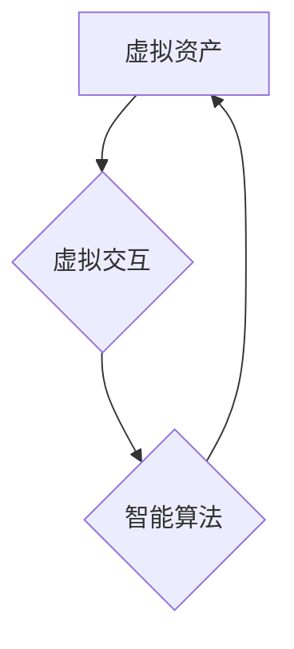

                 

## 虚拟经济模型：AI驱动的新型价值交换系统

> 关键词：虚拟经济、人工智能、价值交换、区块链、去中心化、智能合约、数字资产、算法经济学

## 1. 背景介绍

随着互联网和数字技术的飞速发展，虚拟世界与现实世界之间的界限逐渐模糊。虚拟现实、增强现实、元宇宙等新兴技术正在构建更加沉浸式、交互式的数字体验，为人们创造新的生活方式和价值创造模式。在这个背景下，虚拟经济作为一种基于数字资产、虚拟交互和智能算法的新型经济体系，逐渐成为人们关注的焦点。

传统经济体系以物质资源和货币作为主要价值交换媒介，而虚拟经济则以数字资产、虚拟商品和服务作为主要价值载体。虚拟经济的出现，打破了传统经济体系的地域限制和时间限制，为人们提供了更加便捷、高效、透明的价值交换方式。

## 2. 核心概念与联系

虚拟经济的核心概念包括：

* **虚拟资产:** 指在虚拟世界中具有价值的数字资源，例如虚拟货币、虚拟土地、虚拟物品等。
* **虚拟交互:** 指在虚拟世界中用户之间进行的各种互动行为，例如交易、合作、竞争等。
* **智能算法:** 指用于管理和调节虚拟经济运行的算法，例如价格算法、交易算法、资源分配算法等。

**核心概念架构图:**

虚拟经济的运行机制是通过虚拟资产、虚拟交互和智能算法相互作用而形成的。虚拟资产作为价值载体，通过虚拟交互进行流通和交换，而智能算法则负责管理和调节整个过程，确保虚拟经济的稳定运行和价值分配的公平性。

## 3. 核心算法原理 & 具体操作步骤

### 3.1  算法原理概述

虚拟经济的核心算法通常基于以下几个原理：

* **去中心化:** 虚拟经济的决策和运行不受任何单一实体控制，而是由参与者共同协商和决定。
* **透明度:** 虚拟经济的所有交易和操作都记录在公开的区块链上，任何人都可以查询和验证。
* **自动化:** 智能合约可以自动执行预先设定好的交易规则，减少人为干预和风险。
* **激励机制:** 通过奖励机制鼓励用户参与虚拟经济，促进其健康发展。

### 3.2  算法步骤详解

虚拟经济算法的具体操作步骤通常包括以下几个阶段：

1. **虚拟资产创建:** 用户可以通过各种方式获得虚拟资产，例如购买、挖矿、参与游戏等。
2. **虚拟交互:** 用户可以通过虚拟平台进行各种交互行为，例如交易、租赁、拍卖等。
3. **智能合约执行:** 当用户进行虚拟交互时，智能合约会自动执行预先设定好的交易规则，确保交易的公平性和安全性。
4. **价值分配:** 虚拟经济的算法会根据参与者的贡献和行为进行价值分配，例如奖励参与者、惩罚恶意行为等。
5. **系统维护:** 虚拟经济平台需要进行持续维护和升级，以确保其稳定运行和安全性。

### 3.3  算法优缺点

**优点:**

* **去中心化:** 避免单一实体控制，提高系统安全性。
* **透明度:** 所有交易记录公开透明，增强用户信任。
* **自动化:** 智能合约自动执行交易规则，提高效率。
* **激励机制:** 鼓励用户参与，促进系统发展。

**缺点:**

* **技术复杂性:** 虚拟经济算法的开发和维护需要高水平的技术人才。
* **监管挑战:** 虚拟经济的去中心化特性给监管带来挑战。
* **安全风险:** 虚拟资产和智能合约的安全问题需要得到有效解决。

### 3.4  算法应用领域

虚拟经济算法的应用领域非常广泛，包括：

* **游戏虚拟经济:** 游戏中的虚拟货币、虚拟物品和虚拟土地等。
* **数字内容交易:** 数字音乐、数字艺术、数字书籍等内容的交易和分发。
* **供应链管理:** 提高供应链的透明度和效率。
* **金融服务:** 提供新的金融产品和服务，例如去中心化金融 (DeFi)。

## 4. 数学模型和公式 & 详细讲解 & 举例说明

### 4.1  数学模型构建

虚拟经济的数学模型通常基于以下几个方面：

* **价值模型:** 描述虚拟资产的价值形成和变化规律。
* **交易模型:** 描述虚拟资产的交易行为和市场机制。
* **资源分配模型:** 描述虚拟资源的分配和利用方式。

**价值模型:**

一个简单的价值模型可以采用以下公式：

$$V = f(S, D, T)$$

其中：

* $V$ 表示虚拟资产的价值。
* $S$ 表示虚拟资产的稀缺性。
* $D$ 表示虚拟资产的需求量。
* $T$ 表示虚拟资产的交易成本。

**举例说明:**

假设一种虚拟货币，其稀缺性较高，需求量较大，交易成本较低，则其价值较高。

### 4.2  公式推导过程

虚拟经济的数学模型可以根据具体应用场景进行推导和完善。例如，可以引入用户行为、网络效应、市场竞争等因素，构建更加复杂的模型。

### 4.3  案例分析与讲解

通过对实际案例的分析，可以验证虚拟经济模型的有效性，并进一步完善模型。例如，可以分析虚拟游戏中的虚拟货币市场，研究其价值波动规律和交易机制。

## 5. 项目实践：代码实例和详细解释说明

### 5.1  开发环境搭建

虚拟经济项目开发通常需要以下开发环境：

* **编程语言:** Python、JavaScript、C++等。
* **区块链平台:** Ethereum、Hyperledger Fabric等。
* **数据库:** MongoDB、PostgreSQL等。
* **云服务平台:** AWS、Azure、GCP等。

### 5.2  源代码详细实现

虚拟经济项目的源代码实现涉及多个模块，例如：

* **虚拟资产管理模块:** 用于创建、管理和交易虚拟资产。
* **智能合约模块:** 用于定义和执行虚拟经济的交易规则。
* **用户交互模块:** 用于用户登录、注册、交易等操作。
* **数据分析模块:** 用于收集和分析虚拟经济运行数据。

### 5.3  代码解读与分析

代码解读需要分析代码结构、算法逻辑和数据流，理解代码的功能和工作机制。

### 5.4  运行结果展示

虚拟经济项目的运行结果可以包括：

* **虚拟资产价格波动:** 分析虚拟资产的价格变化趋势和波动规律。
* **交易量和活跃度:** 统计虚拟经济平台的交易量和用户活跃度。
* **价值分配情况:** 分析虚拟经济中不同参与者的价值分配情况。

## 6. 实际应用场景

虚拟经济已经开始在多个领域得到实际应用，例如：

* **游戏虚拟经济:** 许多游戏都采用了虚拟经济机制，例如《魔兽世界》、《堡垒之夜》等。
* **数字内容交易平台:** 许多平台提供数字内容的交易和分发服务，例如Steam、Epic Games Store等。
* **去中心化金融 (DeFi):** DeFi 平台利用区块链技术和智能合约，提供去中心化的金融服务，例如借贷、投资等。

### 6.4  未来应用展望

虚拟经济的未来应用前景广阔，例如：

* **元宇宙经济:** 元宇宙将构建更加沉浸式和交互式的虚拟世界，虚拟经济将成为元宇宙的核心组成部分。
* **数字身份和信用体系:** 虚拟经济可以帮助构建数字身份和信用体系，提高用户身份认证和信用评估的效率。
* **数据经济:** 虚拟经济可以帮助用户更好地管理和利用自己的数据，促进数据经济的发展。

## 7. 工具和资源推荐

### 7.1  学习资源推荐

* **书籍:** 《虚拟经济学》、《区块链技术入门》等。
* **在线课程:** Coursera、edX等平台提供虚拟经济和区块链相关的在线课程。
* **社区论坛:** 许多虚拟经济和区块链相关的社区论坛，例如BitcoinTalk、Ethereum Stack Exchange等。

### 7.2  开发工具推荐

* **智能合约开发平台:** Remix、Truffle Suite等。
* **区块链浏览器:** Etherscan、Blockchair等。
* **数据分析工具:** Python、R等编程语言，以及Tableau、Power BI等数据可视化工具。

### 7.3  相关论文推荐

* **"A Survey of Virtual Economies"**
* **"Blockchain Technology: A Primer"**
* **"Decentralized Finance: A Comprehensive Overview"**

## 8. 总结：未来发展趋势与挑战

### 8.1  研究成果总结

虚拟经济研究取得了显著进展，构建了多种数学模型和算法，并实现了多个实际应用场景。

### 8.2  未来发展趋势

虚拟经济的发展趋势包括：

* **去中心化和透明化:** 虚拟经济将更加去中心化和透明，用户将拥有更多的自主权和控制权。
* **智能化和自动化:** 虚拟经济将更加智能化和自动化，智能算法将发挥更大的作用。
* **融合和扩展:** 虚拟经济将与其他技术融合，例如人工智能、物联网、大数据等，扩展应用场景。

### 8.3  面临的挑战

虚拟经济发展还面临一些挑战，例如：

* **监管挑战:** 虚拟经济的去中心化特性给监管带来挑战，需要制定相应的法律法规。
* **安全风险:** 虚拟资产和智能合约的安全问题需要得到有效解决。
* **技术复杂性:** 虚拟经济算法的开发和维护需要高水平的技术人才。

### 8.4  研究展望

未来虚拟经济研究将重点关注以下几个方面：

* **更完善的数学模型和算法:** 构建更加精确、高效、鲁棒的虚拟经济模型和算法。
* **更安全的虚拟经济系统:** 研究和开发更安全的虚拟资产和智能合约，保障用户资产安全。
* **更广泛的应用场景:** 将虚拟经济应用于更多领域，例如教育、医疗、文化等。

## 9. 附录：常见问题与解答

**常见问题:**

* **什么是虚拟经济？**
* **虚拟经济有哪些特点？**
* **虚拟经济有哪些应用场景？**
* **虚拟经济有哪些发展趋势？**
* **虚拟经济有哪些挑战？**

**解答:**

...

作者：禅与计算机程序设计艺术 / Zen and the Art of Computer Programming 
<end_of_turn>

