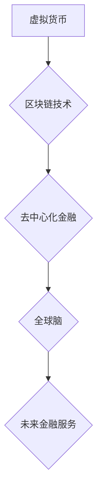

                 

## 虚拟货币与全球脑:去中心化金融的未来图景

> 关键词：虚拟货币、去中心化金融、区块链、全球脑、人工智能、金融科技、加密货币、数字资产

## 1. 背景介绍

近年来，虚拟货币和区块链技术迅速发展，掀起了金融科技领域的革命浪潮。虚拟货币，作为一种基于加密算法的数字资产，打破了传统金融体系的中心化模式，为人们提供了新的金融服务和投资机会。而全球脑，作为一种将人类意识与计算机网络相连接的未来科技概念，则蕴含着更深层次的变革潜力。

传统金融体系以银行、政府和金融机构为中心，存在着效率低下、成本高昂、监管难度大等问题。虚拟货币的出现，通过去中心化、透明化和安全化的特点，为金融服务提供了新的解决方案。区块链技术作为虚拟货币的基础，保障了交易的不可篡改性和安全性，为金融体系的去中心化转型提供了技术支撑。

全球脑的出现，将进一步推动虚拟货币和去中心化金融的发展。通过将人类意识与计算机网络相连接，全球脑可以实现更快速、更智能的金融决策，并为虚拟货币创造新的应用场景。

## 2. 核心概念与联系

### 2.1 虚拟货币

虚拟货币是一种基于加密算法的数字资产，不依赖于任何中央机构的管理和发行。其特点包括：

* **去中心化:** 虚拟货币的交易和管理由网络上的参与者共同维护，不受任何单一实体控制。
* **透明化:** 虚拟货币的交易记录公开透明，任何人都可以查看交易历史。
* **安全性:** 虚拟货币的交易使用加密算法进行保护，确保交易的安全性。

### 2.2 区块链

区块链是一种分布式账本技术，用于记录和验证虚拟货币交易。其特点包括：

* **分布式:** 区块链数据存储在网络上的多个节点上，任何节点都可以访问和验证数据。
* **不可篡改:** 区块链上的数据一旦写入，就无法被修改，确保交易的不可篡改性。
* **安全可靠:** 区块链的加密算法和共识机制保障了数据的安全性和可靠性。

### 2.3 全球脑

全球脑是一种将人类意识与计算机网络相连接的未来科技概念。其目标是实现人类与机器的深度融合，从而提升人类认知能力和创造力。

### 2.4 核心概念联系

虚拟货币、区块链和全球脑之间存在着密切的联系。区块链技术为虚拟货币提供了安全可靠的基础设施，而全球脑则可以进一步推动虚拟货币的应用和发展。

**Mermaid 流程图**

## 3. 核心算法原理 & 具体操作步骤

### 3.1 算法原理概述

虚拟货币的交易和管理基于一系列复杂的算法，包括加密算法、哈希算法、共识机制等。这些算法共同保障了虚拟货币的安全性、透明性和去中心化特性。

* **加密算法:** 用于保护虚拟货币交易的私钥和公钥，确保交易的安全性。
* **哈希算法:** 用于生成区块的唯一标识，并确保区块链数据的不可篡改性。
* **共识机制:** 用于验证交易的有效性和达成共识，确保区块链的稳定性和安全性。

### 3.2 算法步骤详解

虚拟货币交易的具体操作步骤如下：

1. **发起交易:** 用户使用私钥签署交易请求，并发送到网络上。
2. **广播交易:** 网络节点接收交易请求并将其广播到整个网络。
3. **验证交易:** 网络节点验证交易的合法性和有效性，包括检查交易者的余额、签名是否有效等。
4. **打包交易:** 验证通过的交易被打包成区块。
5. **生成区块:** 区块生成者使用哈希算法生成区块的唯一标识，并将其添加到区块链中。
6. **确认交易:** 区块被添加到区块链后，交易被视为确认完成。

### 3.3 算法优缺点

**优点:**

* **安全性:** 加密算法和哈希算法保障了交易的安全性。
* **透明度:** 交易记录公开透明，任何人都可以查看交易历史。
* **去中心化:** 虚拟货币不受任何单一实体控制，更加公平和透明。

**缺点:**

* **技术复杂:** 虚拟货币的算法原理和操作步骤较为复杂，需要一定的技术基础才能理解和使用。
* **波动性:** 虚拟货币价格波动较大，存在一定的投资风险。
* **监管不完善:** 虚拟货币的监管制度尚不完善，存在一定的法律风险。

### 3.4 算法应用领域

虚拟货币的算法原理和技术应用领域广泛，包括：

* **金融服务:** 支付、借贷、投资等。
* **供应链管理:** 物流追踪、产品溯源等。
* **身份认证:** 电子身份验证、数据安全等。
* **游戏开发:** 游戏资产交易、虚拟经济等。

## 4. 数学模型和公式 & 详细讲解 & 举例说明

### 4.1 数学模型构建

虚拟货币的交易和管理可以抽象为一个数学模型，其中涉及到以下几个关键要素：

* **交易者:** 参与虚拟货币交易的个体或实体。
* **虚拟货币:** 数字资产，其价值由市场供求关系决定。
* **区块链:** 分布式账本，记录和验证虚拟货币交易。
* **共识机制:** 用于验证交易的有效性和达成共识的算法。

### 4.2 公式推导过程

虚拟货币的价值可以根据以下公式推导：

$$
V = \frac{S}{D}
$$

其中：

* $V$ 表示虚拟货币的价值。
* $S$ 表示虚拟货币的总供应量。
* $D$ 表示虚拟货币的总需求量。

### 4.3 案例分析与讲解

假设一种虚拟货币的总供应量为1000个，总需求量为2000个，则其价值为：

$$
V = \frac{1000}{2000} = 0.5
$$

这意味着，每1个虚拟货币的价值为0.5单位。

## 5. 项目实践：代码实例和详细解释说明

### 5.1 开发环境搭建

虚拟货币开发环境搭建需要以下软件和工具：

* **编程语言:** Python、C++、Go等。
* **区块链框架:** Ethereum、Hyperledger Fabric等。
* **开发工具:** IDE、调试器、版本控制系统等。

### 5.2 源代码详细实现

虚拟货币的源代码实现涉及到多个模块，包括：

* **钱包模块:** 用于管理用户的私钥和公钥。
* **交易模块:** 用于创建、发送和接收虚拟货币交易。
* **区块链模块:** 用于连接区块链网络并验证交易。
* **智能合约模块:** 用于实现虚拟货币的特定功能，例如代币发行、投票等。

### 5.3 代码解读与分析

虚拟货币的源代码需要进行详细解读和分析，才能理解其工作原理和安全机制。

### 5.4 运行结果展示

虚拟货币的运行结果需要进行测试和验证，确保其功能正常运行。

## 6. 实际应用场景

### 6.1 支付和转账

虚拟货币可以用于支付商品和服务，以及进行跨境转账。

### 6.2 投资和交易

虚拟货币可以作为一种投资资产，进行买卖交易。

### 6.3 供应链管理

虚拟货币可以用于追踪商品的来源和流通路径，提高供应链的透明度和效率。

### 6.4 未来应用展望

随着全球脑的到来，虚拟货币将有更广泛的应用场景，例如：

* **数字身份认证:** 虚拟货币可以作为数字身份的载体，实现身份验证和数据安全。
* **去中心化自治组织 (DAO):** 虚拟货币可以用于支持 DAO 的运作，实现去中心化的组织管理。
* **元宇宙经济:** 虚拟货币可以作为元宇宙中的虚拟资产，推动元宇宙经济的发展。

## 7. 工具和资源推荐

### 7.1 学习资源推荐

* **书籍:** 《比特币：数字货币的革命》
* **网站:** Bitcoin.org、Ethereum.org
* **课程:** Coursera、edX

### 7.2 开发工具推荐

* **IDE:** Visual Studio Code、Atom
* **区块链框架:** Ethereum、Hyperledger Fabric
* **钱包软件:** MetaMask、MyEtherWallet

### 7.3 相关论文推荐

* **比特币白皮书:** https://bitcoin.org/bitcoin.pdf
* **以太坊白皮书:** https://ethereum.org/en/whitepaper/

## 8. 总结：未来发展趋势与挑战

### 8.1 研究成果总结

虚拟货币和区块链技术的发展取得了显著成果，为金融科技领域带来了革命性的变革。

### 8.2 未来发展趋势

未来，虚拟货币和区块链技术将继续发展，并与人工智能、物联网等技术融合，创造更多新的应用场景。

### 8.3 面临的挑战

虚拟货币和区块链技术还面临着一些挑战，例如：

* **监管不完善:** 虚拟货币的监管制度尚不完善，需要进一步完善。
* **技术复杂性:** 虚拟货币的算法原理和技术应用较为复杂，需要进一步简化和普及。
* **可持续发展:** 虚拟货币的能源消耗问题需要得到解决，需要探索更可持续的解决方案。

### 8.4 研究展望

未来，需要进一步研究虚拟货币和区块链技术的应用场景、安全机制、监管制度等方面，推动其健康可持续发展。

## 9. 附录：常见问题与解答

### 9.1 什么是虚拟货币？

虚拟货币是一种基于加密算法的数字资产，不依赖于任何中央机构的管理和发行。

### 9.2 区块链是什么？

区块链是一种分布式账本技术，用于记录和验证虚拟货币交易。

### 9.3 全球脑是什么？

全球脑是一种将人类意识与计算机网络相连接的未来科技概念。

### 9.4 虚拟货币的未来发展趋势是什么？

未来，虚拟货币将继续发展，并与人工智能、物联网等技术融合，创造更多新的应用场景。

作者：禅与计算机程序设计艺术 / Zen and the Art of Computer Programming 
<end_of_turn>

