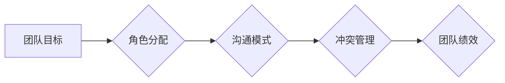

                 

## 行为科学在团队建设中的应用

> 关键词：团队建设、行为科学、心理学、沟通、协作、效率、领导力、文化

## 1. 背景介绍

在当今快速发展的科技时代，软件开发团队的效率和协作能力至关重要。传统的团队管理模式往往难以应对复杂项目的需求，而行为科学的研究为我们提供了新的视角和工具，帮助我们更好地理解团队成员的行为模式，从而构建更高效、更具凝聚力的团队。

行为科学是一门研究人类行为规律的学科，它涵盖了心理学、社会学、经济学等多个领域。在团队建设中，行为科学可以帮助我们：

* **理解团队成员的动机和行为模式：** 通过了解团队成员的性格、价值观、认知偏见等因素，我们可以更好地预测他们的行为，并采取相应的策略来引导他们的行为。
* **优化团队沟通和协作：** 行为科学的研究表明，有效的沟通和协作是团队成功的重要因素。我们可以利用行为科学的原理，设计更有效的沟通机制，提高团队成员之间的协作效率。
* **提升团队领导力和文化建设：** 行为科学可以帮助我们理解领导力的不同类型，以及如何有效地激励和管理团队成员。同时，我们可以利用行为科学的原理，构建积极向上的团队文化，增强团队凝聚力和归属感。

## 2. 核心概念与联系

### 2.1  团队动力学

团队动力学研究团队成员之间相互作用的规律，包括团队目标、角色分配、沟通模式、冲突管理等方面。

**Mermaid 流程图：**



### 2.2  认知偏差

认知偏差是指人们在处理信息时，由于认知能力有限，会产生一些系统性的错误判断。常见的认知偏差包括：

* **确认偏差：** 倾向于寻找和解释支持自己现有观点的信息，而忽略或淡化与之相悖的信息。
* **锚定效应：** 在做出判断时，会过度依赖第一个获得的信息（锚点），即使该信息并不完全准确。
* **群体思维：** 集体决策过程中，为了迎合群体，成员会抑制自己的独立思考，导致错误的决策。

### 2.3  激励机制

激励机制是指通过奖励、惩罚等手段，引导团队成员的行为，使其朝着预期的目标方向发展。常见的激励机制包括：

* **物质激励：** 薪酬、奖金、股票等。
* **精神激励：** 认可、赞赏、晋升等。
* **目标激励：** 设置明确的目标，并提供相应的支持和资源。

## 3. 核心算法原理 & 具体操作步骤

### 3.1  算法原理概述

在团队建设中，我们可以利用行为科学的原理，设计一些算法来优化团队成员的行为和互动。例如，我们可以利用认知偏差的原理，设计一些机制来减少团队成员的确认偏差和群体思维，从而提高团队决策的质量。

### 3.2  算法步骤详解

具体的操作步骤取决于所要解决的问题和团队的具体情况。以下是一个通用的算法框架：

1. **识别问题：** 首先要明确团队需要解决的问题，例如沟通效率低、协作不畅、决策不准确等。
2. **分析原因：** 利用行为科学的理论和工具，分析问题的根源，例如团队成员的认知偏差、沟通模式、激励机制等。
3. **设计解决方案：** 根据问题的分析结果，设计相应的解决方案，例如改进沟通机制、调整角色分配、优化激励机制等。
4. **实施和评估：** 将解决方案实施到团队中，并定期评估其效果，根据评估结果进行调整和优化。

### 3.3  算法优缺点

* **优点：**

    * 基于科学原理，更有效地解决团队问题。
    * 可以量化评估效果，提高解决方案的可靠性。
    * 能够持续优化团队运作，提升团队效率和绩效。

* **缺点：**

    * 需要投入时间和精力进行分析和设计。
    * 需要团队成员的积极配合和参与。
    * 算法的适用性需要根据具体情况进行调整。

### 3.4  算法应用领域

* **软件开发团队：** 优化沟通协作、提高代码质量、加速项目进度。
* **营销团队：** 提升团队创意和执行力、提高营销活动效果。
* **销售团队：** 提升团队销售业绩、增强客户关系。
* **管理团队：** 提升团队领导力和决策能力、增强团队凝聚力和归属感。

## 4. 数学模型和公式 & 详细讲解 & 举例说明

### 4.1  数学模型构建

在团队建设中，我们可以利用数学模型来量化团队成员的行为和互动，例如：

* **团队绩效模型：** 可以用数学公式来描述团队绩效与团队成员个体能力、协作效率、沟通质量等因素之间的关系。
* **冲突管理模型：** 可以用数学模型来分析团队冲突的类型、强度和影响因素，并设计相应的冲突管理策略。

### 4.2  公式推导过程

例如，我们可以用以下公式来描述团队绩效与团队成员个体能力和协作效率之间的关系：

$$
Team Performance = f(Individual Ability, Collaboration Efficiency)
$$

其中：

* **Team Performance:** 团队绩效
* **Individual Ability:** 团队成员个体能力
* **Collaboration Efficiency:** 团队协作效率

这个公式表明，团队绩效不仅取决于团队成员的个体能力，也取决于团队成员之间的协作效率。

### 4.3  案例分析与讲解

假设我们有一个软件开发团队，团队成员的个体能力水平比较平均，但协作效率较低。我们可以通过以下措施来提高团队协作效率，从而提升团队绩效：

* **改进沟通机制：** 定期召开团队会议，及时沟通项目进展和遇到的问题，使用协作工具提高沟通效率。
* **明确角色分配：** 为每个团队成员明确职责和任务，避免职责不清和重复工作。
* **建立信任机制：** 鼓励团队成员互相帮助、互相支持，营造良好的团队氛围。

通过这些措施，我们可以提高团队协作效率，从而提升团队绩效。

## 5. 项目实践：代码实例和详细解释说明

### 5.1  开发环境搭建

为了更好地理解行为科学在团队建设中的应用，我们可以开发一个简单的项目来模拟团队协作过程。

开发环境：

* 操作系统：Windows/macOS/Linux
* 编程语言：Python
* 工具：

    * Jupyter Notebook
    * Matplotlib

### 5.2  源代码详细实现

```python
import random

class TeamMember:
    def __init__(self, name, ability):
        self.name = name
        self.ability = ability

    def work(self):
        return random.randint(1, self.ability)

class Team:
    def __init__(self, members):
        self.members = members

    def collaborate(self):
        total_work = 0
        for member in self.members:
            total_work += member.work()
        return total_work

# 创建一个团队
members = [TeamMember("Alice", 5), TeamMember("Bob", 4), TeamMember("Charlie", 6)]
team = Team(members)

# 模拟团队协作
work_output = team.collaborate()
print(f"团队工作产出：{work_output}")
```

### 5.3  代码解读与分析

这段代码模拟了一个简单的团队协作场景。

* `TeamMember` 类代表团队成员，每个成员都有一个名字和能力值。
* `Team` 类代表团队，包含多个团队成员。
* `collaborate()` 方法模拟团队成员协作完成任务，每个成员的贡献值随机生成，并累加计算团队总产出。

### 5.4  运行结果展示

运行这段代码，会输出团队成员协作完成的任务产出值。

## 6. 实际应用场景

### 6.1  案例分析

* **谷歌团队建设：** 谷歌在团队建设方面非常注重行为科学的研究，他们建立了完善的团队文化和激励机制，并利用数据分析来评估团队绩效，不断优化团队运作模式。
* **亚马逊团队协作：** 亚马逊采用“两星级”评价机制，鼓励团队成员互相反馈和改进，并通过数据分析来识别团队协作中的瓶颈，并采取相应的措施进行改进。

### 6.2  未来应用展望

随着人工智能和数据分析技术的不断发展，行为科学在团队建设中的应用将更加广泛和深入。

* **个性化团队建设：** 利用人工智能技术，可以根据团队成员的个性特点和行为模式，定制个性化的团队建设方案。
* **智能团队协作工具：** 开发智能团队协作工具，可以帮助团队成员更好地沟通、协作和管理项目。
* **数据驱动的团队管理：** 利用数据分析技术，可以实时监控团队成员的行为和绩效，并根据数据反馈进行调整和优化。

## 7. 工具和资源推荐

### 7.1  学习资源推荐

* **书籍：**

    * 《Thinking, Fast and Slow》 by Daniel Kahneman
    * 《Influence: The Psychology of Persuasion》 by Robert Cialdini
    * 《The Power of Habit》 by Charles Duhigg

* **在线课程：**

    * Coursera: Behavioral Science
    * edX: Psychology of Decision Making

### 7.2  开发工具推荐

* **协作工具：**

    * Slack
    * Microsoft Teams
    * Asana

* **项目管理工具：**

    * Jira
    * Trello
    * GitHub

### 7.3  相关论文推荐

* **The Impact of Team Composition on Team Performance**
* **The Role of Trust in Team Effectiveness**
* **The Effects of Conflict on Team Performance**

## 8. 总结：未来发展趋势与挑战

### 8.1  研究成果总结

行为科学的研究为我们提供了许多宝贵的 insights，帮助我们更好地理解团队成员的行为模式，并设计更有效的团队建设策略。

### 8.2  未来发展趋势

未来，行为科学在团队建设中的应用将更加深入和广泛，例如：

* **个性化团队建设：** 利用人工智能技术，可以根据团队成员的个性特点和行为模式，定制个性化的团队建设方案。
* **智能团队协作工具：** 开发智能团队协作工具，可以帮助团队成员更好地沟通、协作和管理项目。
* **数据驱动的团队管理：** 利用数据分析技术，可以实时监控团队成员的行为和绩效，并根据数据反馈进行调整和优化。

### 8.3  面临的挑战

* **数据隐私和安全：** 利用行为科学数据进行团队管理，需要考虑数据隐私和安全问题。
* **算法的公平性和可解释性：** 确保算法的公平性和可解释性，避免算法歧视或产生不可预知的负面影响。
* **团队成员的接受度：** 团队成员需要接受行为科学的理念和方法，并积极参与到团队建设过程中。

### 8.4  研究展望

未来，我们需要继续深入研究行为科学与团队建设之间的关系，开发更有效的团队建设方法和工具，帮助团队成员更好地协作，实现更高的目标。

## 9. 附录：常见问题与解答

* **Q1：行为科学与传统管理理论有什么区别？**

    A1：传统管理理论往往基于理性假设，认为人们是理性的决策者。而行为科学则更关注人类的认知偏差、情绪和社会影响等因素，认为人们的行为并非总是理性的。

* **Q2：如何将行为科学的原理应用到实际团队建设中？**

    A2：可以利用行为科学的理论和工具，分析团队成员的行为模式和团队运作机制，并根据分析结果设计相应的解决方案，例如改进沟通机制、调整角色分配、优化激励机制等。

* **Q3：行为科学在团队建设中的应用有哪些局限性？**

    A3：行为科学的研究结果并非适用于所有团队和所有情况，需要根据具体团队的文化、环境和目标进行调整和优化。


作者：禅与计算机程序设计艺术 / Zen and the Art of Computer Programming 
<end_of_turn>

