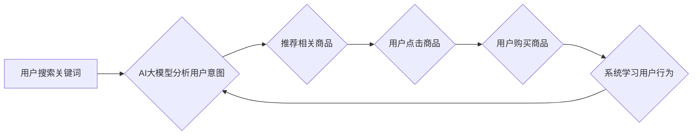

                 

## AI 大模型在电商搜索推荐中的实时推荐策略：抓住用户瞬时需求与购买意图

> 关键词：电商搜索推荐、AI大模型、实时推荐、用户需求、购买意图、推荐算法、深度学习

## 1. 背景介绍

在当今数字经济时代，电商平台已成为人们购物的首选方式。用户在电商平台上搜索商品时，往往会遇到海量商品信息，难以快速找到心仪的产品。因此，精准的搜索推荐系统成为电商平台的核心竞争力之一。传统的搜索推荐系统主要依赖于基于规则的算法和协同过滤算法，但这些算法难以捕捉用户复杂的需求和瞬时的购买意图。

近年来，随着深度学习技术的快速发展，AI大模型在电商搜索推荐领域展现出巨大的潜力。AI大模型能够学习用户行为、商品特征和市场趋势等海量数据，并生成更精准、更个性化的推荐结果。实时推荐策略则是基于AI大模型，利用用户在搜索过程中的实时行为数据，动态调整推荐策略，以满足用户瞬时的需求和购买意图。

## 2. 核心概念与联系

### 2.1  AI大模型

AI大模型是指在海量数据上训练的深度学习模型，拥有强大的泛化能力和学习能力。常见的AI大模型包括Transformer、BERT、GPT等。这些模型能够理解和生成自然语言，并从文本数据中提取丰富的语义信息。

### 2.2  实时推荐

实时推荐是指根据用户在搜索过程中的实时行为数据，动态调整推荐策略，以提供更精准、更个性化的推荐结果。实时推荐系统需要具备以下特点：

* **低延迟:** 推荐结果需要在用户搜索后立即返回，以满足用户对即时信息的需求。
* **高准确率:** 推荐结果需要尽可能准确地匹配用户的需求和购买意图。
* **个性化:** 推荐结果需要根据用户的历史行为、偏好和上下文信息进行个性化定制。

### 2.3  用户瞬时需求与购买意图

用户在电商平台上搜索商品时，往往会经历以下几个阶段：

* **信息探索:** 用户通过关键词搜索、浏览商品分类等方式，获取相关商品信息。
* **需求筛选:** 用户根据自己的需求和偏好，筛选出符合条件的商品。
* **购买决策:** 用户最终选择购买心仪的商品。

用户在每个阶段都有不同的需求和购买意图。实时推荐系统需要能够捕捉这些瞬时变化，并提供相应的推荐结果。

**Mermaid 流程图**



## 3. 核心算法原理 & 具体操作步骤

### 3.1  算法原理概述

实时推荐算法的核心是利用AI大模型对用户行为数据进行分析，并根据分析结果动态调整推荐策略。常见的实时推荐算法包括：

* **基于用户的协同过滤:** 

根据用户的历史行为数据，推荐与用户兴趣相似的其他用户的商品。

* **基于内容的推荐:** 

根据商品的特征信息，推荐与用户搜索关键词或浏览历史相关的商品。
* **混合推荐:** 

结合基于用户的协同过滤和基于内容的推荐，提高推荐的准确率和个性化程度。

### 3.2  算法步骤详解

1. **数据收集:** 收集用户搜索关键词、浏览历史、购买记录、评分等行为数据。
2. **数据预处理:** 对收集到的数据进行清洗、转换和特征提取。
3. **模型训练:** 利用AI大模型对预处理后的数据进行训练，学习用户行为模式和商品特征关系。
4. **实时推荐:** 当用户进行搜索或浏览商品时，根据用户的实时行为数据，利用训练好的模型生成推荐结果。
5. **结果评估:** 对推荐结果进行评估，并根据评估结果不断优化推荐算法。

### 3.3  算法优缺点

**优点:**

* **精准度高:** AI大模型能够学习用户复杂的需求和购买意图，提供更精准的推荐结果。
* **个性化强:** 推荐结果根据用户的历史行为和偏好进行个性化定制，提升用户体验。
* **实时性强:** 实时推荐系统能够根据用户的实时行为数据动态调整推荐策略，满足用户对即时信息的需要。

**缺点:**

* **数据依赖性强:** AI大模型需要海量数据进行训练，否则难以学习到有效的用户行为模式。
* **计算资源消耗大:** 训练和部署AI大模型需要大量的计算资源，成本较高。
* **算法解释性差:** AI大模型的决策过程较为复杂，难以解释其推荐结果背后的逻辑。

### 3.4  算法应用领域

实时推荐算法广泛应用于电商平台、社交媒体、新闻资讯、音乐娱乐等领域，例如：

* **电商平台:** 商品推荐、个性化促销、跨界推荐等。
* **社交媒体:** 内容推荐、好友推荐、兴趣小组推荐等。
* **新闻资讯:** 新闻推荐、个性化订阅、热点话题推荐等。
* **音乐娱乐:** 歌曲推荐、音乐人推荐、音乐活动推荐等。

## 4. 数学模型和公式 & 详细讲解 & 举例说明

### 4.1  数学模型构建

在实时推荐系统中，常用的数学模型包括协同过滤模型、内容推荐模型和混合推荐模型。

**协同过滤模型:**

协同过滤模型基于用户的历史行为数据，预测用户对特定商品的评分或购买意愿。常用的协同过滤算法包括基于用户的协同过滤和基于物品的协同过滤。

**基于用户的协同过滤:**

假设用户u对商品i的评分为r(u,i)，则可以使用以下公式计算用户u对商品j的评分预测值:

$$
\hat{r}(u,j) = \bar{r}_u + \frac{\sum_{i \in N(u)} \frac{r(u,i) - \bar{r}_u}{\sigma(u,i)}}{\sum_{i \in N(u)} \frac{1}{\sigma(u,i)}}
$$

其中:

* $\bar{r}_u$ 是用户u的平均评分。
* $N(u)$ 是用户u评分过的商品集合。
* $\sigma(u,i)$ 是用户u对商品i评分的标准差。

**基于物品的协同过滤:**

假设商品i和商品j的相似度为sim(i,j)，则可以使用以下公式计算商品i对用户u的评分预测值:

$$
\hat{r}(u,i) = \bar{r}_i + \frac{\sum_{j \in N(i)} \frac{r(u,j) - \bar{r}_j}{\sigma(i,j)}}{\sum_{j \in N(i)} \frac{1}{\sigma(i,j)}}
$$

其中:

* $\bar{r}_i$ 是商品i的平均评分。
* $N(i)$ 是与商品i相似度高的商品集合。
* $\sigma(i,j)$ 是商品i和商品j的相似度。

**内容推荐模型:**

内容推荐模型基于商品的特征信息，推荐与用户搜索关键词或浏览历史相关的商品。常用的内容推荐算法包括TF-IDF、Word2Vec、BERT等。

**混合推荐模型:**

混合推荐模型结合了协同过滤模型和内容推荐模型的优点，提高推荐的准确率和个性化程度。

### 4.2  公式推导过程

上述公式的推导过程涉及到线性回归、矩阵分解、相似度计算等数学概念。

### 4.3  案例分析与讲解

可以结合实际电商平台的数据，分析不同推荐算法的性能，并进行对比分析。

## 5. 项目实践：代码实例和详细解释说明

### 5.1  开发环境搭建

使用Python语言开发实时推荐系统，需要搭建以下开发环境:

* Python 3.x
* TensorFlow/PyTorch深度学习框架
* Scikit-learn机器学习库
* Numpy数值计算库
* Pandas数据处理库

### 5.2  源代码详细实现

以下是一个基于协同过滤的实时推荐系统的代码示例:

```python
import numpy as np
from sklearn.metrics.pairwise import cosine_similarity

# 用户行为数据
user_ratings = np.array([
    [5, 4, 3, 2, 1],
    [4, 5, 2, 1, 3],
    [3, 2, 5, 4, 1],
    [2, 1, 4, 5, 3],
    [1, 3, 1, 3, 5]
])

# 计算用户-用户相似度矩阵
user_similarity = cosine_similarity(user_ratings)

# 用户u的ID
user_id = 0

# 获取用户u评分过的商品集合
rated_items = np.where(user_ratings[user_id] != 0)[0]

# 计算用户u对未评分商品的推荐评分
for item_id in range(user_ratings.shape[1]):
    if user_ratings[user_id, item_id] == 0:
        # 计算用户u与其他用户的相似度
        similarities = user_similarity[user_id]
        # 计算用户u对未评分商品的推荐评分
        predicted_rating = np.sum(similarities[rated_items] * user_ratings[rated_items, item_id]) / np.sum(similarities[rated_items])
        print(f"用户{user_id}对商品{item_id}的推荐评分: {predicted_rating}")
```

### 5.3  代码解读与分析

该代码示例实现了基于用户-用户协同过滤的实时推荐算法。

* 首先，定义了用户行为数据，并使用cosine_similarity函数计算用户-用户相似度矩阵。
* 然后，根据用户ID获取用户评分过的商品集合。
* 最后，循环遍历未评分的商品，计算用户对该商品的推荐评分。

### 5.4  运行结果展示

运行该代码示例，可以得到用户对未评分商品的推荐评分结果。

## 6. 实际应用场景

### 6.1  电商平台

实时推荐算法在电商平台的应用场景非常广泛，例如：

* **商品推荐:** 根据用户的搜索关键词、浏览历史、购买记录等数据，推荐与用户兴趣相关的商品。
* **个性化促销:** 根据用户的购买偏好和行为模式，推送个性化的促销信息和优惠券。
* **跨界推荐:** 根据用户的购买历史和兴趣爱好，推荐与当前商品相关的其他商品，例如，如果用户购买了运动鞋，可以推荐运动服、运动耳机等相关商品。

### 6.2  社交媒体

实时推荐算法在社交媒体平台的应用场景包括：

* **内容推荐:** 根据用户的兴趣爱好和浏览历史，推荐与用户相关的新闻、视频、图片等内容。
* **好友推荐:** 根据用户的社交关系和兴趣爱好，推荐与用户可能感兴趣的潜在好友。
* **兴趣小组推荐:** 根据用户的兴趣爱好，推荐与用户相关的兴趣小组和社群。

### 6.3  新闻资讯

实时推荐算法在新闻资讯平台的应用场景包括：

* **新闻推荐:** 根据用户的阅读历史和兴趣爱好，推荐与用户相关的新闻资讯。
* **个性化订阅:** 根据用户的阅读偏好，自动生成个性化的新闻订阅列表。
* **热点话题推荐:** 根据用户的阅读行为和社会热点，推荐与用户相关的热点话题和讨论。

### 6.4  未来应用展望

随着AI技术的不断发展，实时推荐算法将在更多领域得到应用，例如：

* **医疗保健:** 根据用户的病史和症状，推荐相关的医疗服务和药品。
* **教育培训:** 根据用户的学习进度和兴趣爱好，推荐相关的学习资源和课程。
* **金融理财:** 根据用户的投资偏好和风险承受能力，推荐相关的理财产品和投资策略。

## 7. 工具和资源推荐

### 7.1  学习资源推荐

* **书籍:**
    * 《深度学习》
    * 《机器学习》
    * 《推荐系统实战》
* **在线课程:**
    * Coursera: 深度学习
    * Udacity: 机器学习工程师
    * edX: 推荐系统

### 7.2  开发工具推荐

* **Python:** 
    * TensorFlow
    * PyTorch
    * Scikit-learn
* **数据库:**
    * MySQL
    * PostgreSQL
    * MongoDB

### 7.3  相关论文推荐

* **Collaborative Filtering for Implicit Feedback Datasets**
* **Deep Learning for Recommender Systems**
* **Hybrid Recommender Systems: A Survey**

## 8. 总结：未来发展趋势与挑战

### 8.1  研究成果总结

AI大模型在电商搜索推荐领域的应用取得了显著成果，实时推荐算法能够提供更精准、更个性化的推荐结果，提升用户体验和商业价值。

### 8.2  未来发展趋势

* **模型更深更广:** 探索更深层次的AI大模型，例如Transformer-XL、GPT-3等，并将其应用于实时推荐系统。
* **多模态融合:** 将文本、图像、视频等多模态数据融合到推荐模型中，提升推荐的准确性和个性化程度。
* **解释性增强:** 研究更易解释的推荐算法，帮助用户理解推荐结果背后的逻辑。
* **隐私保护:** 开发更有效的隐私保护机制，保障用户数据安全。

### 8.3  面临的挑战

* **数据质量:** 实时推荐算法依赖于高质量的数据，数据不完整、不准确会影响推荐效果。
* **计算资源:** 训练和部署AI大模型需要大量的计算资源，成本较高。
* **算法解释性:** AI大模型的决策过程较为复杂，难以解释其推荐结果背后的逻辑，这可能会导致用户信任度下降。

### 8.4  研究展望

未来，实时推荐算法将继续朝着更精准、更个性化、更解释性强、更隐私保护的方向发展。


## 9. 附录：常见问题与解答

**Q1: 实时推荐算法的延迟是多少？**

A1: 实时推荐算法的延迟取决于多种因素，例如模型复杂度、数据处理速度、服务器性能等。一般来说，实时推荐算法的延迟可以控制在几毫秒到几秒钟之间。

**Q2: 实时推荐算法如何处理冷启动问题？**

A2: 冷启动问题是指对于新用户或新商品，由于缺乏历史数据，难以进行准确的推荐。针对冷启动问题，可以采用以下方法：

* **基于内容的推荐:** 利用商品的特征信息进行推荐。
* **基于流行度的推荐:** 推荐热门商品或用户喜欢的商品。
* **用户反馈引导:** 鼓励用户对新商品进行评分或评价，收集更多数据。

**Q3: 实时推荐算法如何保证用户隐私？**

A3: 实时推荐算法需要处理大量用户数据，因此隐私保护非常重要。可以采用以下方法保证用户隐私：

* **数据匿名化:** 将用户数据进行匿名处理，去除个人识别信息。
* **联邦学习:** 在不共享原始数据的情况下，利用分布式训练的方式进行模型训练。
* **差分隐私:** 添加噪声到数据中，保护用户隐私的同时保证模型的准确性。


作者：禅与计算机程序设计艺术 / Zen and the Art of Computer Programming 
<end_of_turn>

