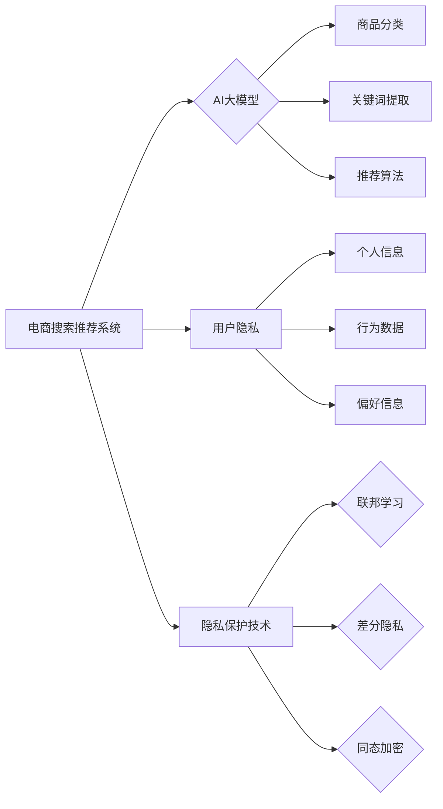

                 

## AI 大模型在电商搜索推荐中的用户隐私保护：尊重用户权利与安全

> 关键词：AI大模型、电商搜索推荐、用户隐私、联邦学习、差分隐私、数据安全、隐私保护技术

## 1. 背景介绍

电商平台作为现代商业的重要组成部分，其搜索推荐系统扮演着至关重要的角色。通过分析用户行为、商品信息等数据，AI大模型能够精准推荐用户感兴趣的商品，提升用户体验，促进交易。然而，在追求精准推荐的同时，也引发了用户隐私保护的关注。

AI大模型的训练需要海量数据，而这些数据往往包含用户的敏感信息，如姓名、地址、购买历史等。如果这些信息被泄露或滥用，将严重损害用户的隐私权和安全。因此，如何在保证推荐精准度的同时有效保护用户隐私，成为电商平台亟待解决的关键问题。

## 2. 核心概念与联系

### 2.1  电商搜索推荐系统

电商搜索推荐系统旨在帮助用户快速找到所需商品，并根据用户的兴趣和偏好进行个性化推荐。其核心功能包括：

* **商品搜索：** 根据用户输入的关键词，从海量商品库中检索出相关商品。
* **商品推荐：** 基于用户的历史行为、浏览记录、购买偏好等信息，推荐用户可能感兴趣的商品。
* **个性化展示：** 根据用户的不同属性和行为，个性化展示商品排序、推荐内容等。

### 2.2  AI大模型

AI大模型是指具有强大学习能力和泛化能力的深度学习模型，能够处理海量数据，学习复杂模式，并进行预测和决策。在电商搜索推荐系统中，AI大模型常用于：

* **商品分类：** 自动识别商品类别，提高搜索效率。
* **关键词提取：** 从商品描述中提取关键词，增强搜索精准度。
* **推荐算法：** 基于用户的行为数据，学习用户偏好，进行个性化推荐。

### 2.3  用户隐私

用户隐私是指个人信息在收集、使用、存储和处理过程中受到保护的权利。在电商平台，用户隐私涉及到：

* **个人信息：** 用户姓名、地址、联系方式、购买历史等。
* **行为数据：** 用户浏览记录、搜索历史、点击行为等。
* **偏好信息：** 用户对商品的评价、收藏、购买等行为。

### 2.4  隐私保护技术

为了保护用户隐私，在电商搜索推荐系统中需要采用多种隐私保护技术，例如：

* **联邦学习：** 将模型训练分散到多个设备上，避免数据集中存储，保护用户数据安全。
* **差分隐私：** 在数据处理过程中加入噪声，保护用户数据敏感信息。
* **同态加密：** 对数据进行加密，即使被泄露，也无法直接读取，保护数据安全。

**核心概念与联系流程图**



## 3. 核心算法原理 & 具体操作步骤

### 3.1  算法原理概述

联邦学习是一种分布式机器学习方法，旨在训练机器学习模型，而无需将原始数据集中存储。它通过将模型参数在参与者之间进行迭代更新，从而在保护数据隐私的同时实现模型训练。

### 3.2  算法步骤详解

1. **模型初始化：** 所有参与者都从一个相同的初始模型开始。
2. **本地训练：** 每个参与者使用自己的本地数据对模型进行训练，并计算出模型参数的梯度。
3. **参数更新：** 每个参与者将模型参数的梯度发送到一个中央服务器。
4. **全局模型更新：** 中央服务器将所有参与者的梯度聚合，并更新全局模型参数。
5. **模型分发：** 中央服务器将更新后的全局模型参数分发给所有参与者。
6. **重复步骤 2-5：** 迭代执行上述步骤，直到模型达到预设的精度或训练次数。

### 3.3  算法优缺点

**优点：**

* **保护数据隐私：** 数据始终在本地存储，不会被集中收集，有效保护用户隐私。
* **提高数据安全：** 即使中央服务器被攻击，也无法获取原始数据，提高数据安全。
* **利用数据多样性：** 可以利用来自多个参与者的异构数据，提高模型泛化能力。

**缺点：**

* **通信成本高：** 每个参与者需要频繁地与中央服务器通信，传输模型参数，通信成本较高。
* **训练效率低：** 由于参数更新需要经过多个参与者的迭代，训练效率相对较低。
* **模型性能受限：** 由于数据分布不均匀，模型性能可能受到限制。

### 3.4  算法应用领域

联邦学习在医疗、金融、电商等领域具有广泛的应用前景，例如：

* **医疗领域：** 训练疾病诊断模型，保护患者隐私。
* **金融领域：** 训练欺诈检测模型，保护用户资金安全。
* **电商领域：** 训练个性化推荐模型，保护用户隐私。

## 4. 数学模型和公式 & 详细讲解 & 举例说明

### 4.1  数学模型构建

在联邦学习中，每个参与者拥有自己的本地数据集 $D_i$，模型参数 $w_i$。目标是训练一个全局模型参数 $w^*$，使得其在所有参与者的本地数据集上表现最佳。

### 4.2  公式推导过程

假设损失函数为 $L(w, D)$，则每个参与者的目标是最小化其本地数据集上的损失函数：

$$
\min_{w_i} L(w_i, D_i)
$$

使用梯度下降算法，每个参与者更新其模型参数：

$$
w_i^{t+1} = w_i^t - \eta \nabla_{w_i} L(w_i^t, D_i)
$$

其中，$\eta$ 为学习率，$\nabla_{w_i} L(w_i^t, D_i)$ 为损失函数对模型参数 $w_i^t$ 的梯度。

在联邦学习中，每个参与者将其更新后的模型参数 $w_i^{t+1}$ 发送到中央服务器。中央服务器将所有参与者的模型参数聚合，得到全局模型参数 $w^{t+1}$：

$$
w^{t+1} = \frac{1}{N} \sum_{i=1}^{N} w_i^{t+1}
$$

其中，$N$ 为参与者的数量。

### 4.3  案例分析与讲解

假设有两个参与者，每个参与者拥有自己的本地数据集，并使用相同的模型架构和学习率。

参与者 1 的本地数据集包含 100 个样本，参与者 2 的本地数据集包含 200 个样本。

在第一次迭代中，每个参与者根据其本地数据集训练模型，并计算出模型参数的梯度。

参与者 1 将其模型参数的梯度发送到中央服务器，参与者 2 也将其模型参数的梯度发送到中央服务器。

中央服务器将两个参与者的梯度聚合，并更新全局模型参数。

在第二次迭代中，每个参与者使用更新后的全局模型参数，再次训练模型，并计算出模型参数的梯度。

重复上述步骤，直到模型达到预设的精度或训练次数。

## 5. 项目实践：代码实例和详细解释说明

### 5.1  开发环境搭建

* **操作系统：** Ubuntu 20.04
* **Python 版本：** 3.8
* **深度学习框架：** TensorFlow 2.x
* **其他依赖库：** numpy, pandas, matplotlib

### 5.2  源代码详细实现

```python
# 联邦学习模型训练代码示例

import tensorflow as tf

# 定义模型
model = tf.keras.models.Sequential([
    tf.keras.layers.Dense(128, activation='relu'),
    tf.keras.layers.Dense(10, activation='softmax')
])

# 定义损失函数和优化器
loss_fn = tf.keras.losses.SparseCategoricalCrossentropy()
optimizer = tf.keras.optimizers.SGD(learning_rate=0.01)

# 定义联邦学习训练函数
def federated_train(clients, epochs, local_epochs):
    for epoch in range(epochs):
        for client in clients:
            # 每个客户端本地训练模型
            client.train(local_epochs)
        # 聚合客户端模型参数
        global_model = aggregate_parameters(clients)
        # 更新全局模型
        model.set_weights(global_model)
        print(f'Epoch {epoch+1}/{epochs}, Global Loss: {loss_fn(model(data), labels).numpy()}')

# 聚合客户端模型参数
def aggregate_parameters(clients):
    # ...

# 客户端训练函数
class Client:
    def __init__(self, data, labels):
        self.data = data
        self.labels = labels
        self.model = model

    def train(self, local_epochs):
        # ...

# 创建客户端实例
clients = [Client(data_1, labels_1), Client(data_2, labels_2)]

# 训练联邦学习模型
federated_train(clients, epochs=10, local_epochs=1)
```

### 5.3  代码解读与分析

* **模型定义：** 使用 TensorFlow 的 Keras API 定义一个简单的多层感知机模型。
* **损失函数和优化器：** 使用稀疏分类交叉熵损失函数和随机梯度下降优化器。
* **联邦学习训练函数：** 迭代训练模型，每个迭代周期包含以下步骤：
    * 每个客户端本地训练模型。
    * 聚合客户端模型参数。
    * 更新全局模型。
* **聚合客户端模型参数：** 将所有客户端的模型参数平均合并，得到全局模型参数。
* **客户端训练函数：** 每个客户端使用其本地数据训练模型，并计算模型参数的梯度。

### 5.4  运行结果展示

运行上述代码后，会输出每个迭代周期后的全局模型损失值。

## 6. 实际应用场景

### 6.1  电商搜索推荐

在电商平台，AI大模型可以根据用户的浏览历史、购买记录等数据，推荐用户可能感兴趣的商品。

### 6.2  个性化广告

AI大模型可以根据用户的兴趣爱好、行为特征等数据，精准推送个性化广告，提高广告点击率和转化率。

### 6.3  内容推荐

AI大模型可以根据用户的阅读习惯、点赞记录等数据，推荐用户可能感兴趣的文章、视频等内容。

### 6.4  未来应用展望

随着AI技术的不断发展，AI大模型在电商搜索推荐等领域的应用场景将更加广泛，例如：

* **多模态推荐：** 基于文本、图像、视频等多模态数据进行推荐。
* **实时推荐：** 基于用户的实时行为数据进行动态推荐。
* **跨平台推荐：** 在不同平台（例如网站、APP、小程序）之间进行个性化推荐。

## 7. 工具和资源推荐

### 7.1  学习资源推荐

* **书籍：**
    * 深度学习
    * 人工智能：一种现代方法
* **在线课程：**
    * Coursera: 深度学习
    * edX: 人工智能
* **博客和论坛：**
    * TensorFlow Blog
    * PyTorch Blog
    * Kaggle

### 7.2  开发工具推荐

* **深度学习框架：** TensorFlow, PyTorch
* **数据处理工具：** Pandas, NumPy
* **可视化工具：** Matplotlib, Seaborn

### 7.3  相关论文推荐

* **联邦学习：**
    * Federated Learning: Strategies for Improving Communication Efficiency
    * Federated Learning: Challenges, Methods, and Future Directions
* **差分隐私：**
    * Differential Privacy
    * A Survey of Differential Privacy

## 8. 总结：未来发展趋势与挑战

### 8.1  研究成果总结

近年来，AI大模型在电商搜索推荐领域的应用取得了显著进展，例如：

* **推荐精度提升：** AI大模型能够学习用户更复杂的偏好，提高推荐精度。
* **个性化推荐增强：** AI大模型能够根据用户的不同属性和行为，提供更个性化的推荐。
* **数据利用效率提高：** 联邦学习等隐私保护技术，能够有效利用分散的数据，提高数据利用效率。

### 8.2  未来发展趋势

* **多模态推荐：** 将文本、图像、视频等多模态数据融合，进行更精准的推荐。
* **实时推荐：** 基于用户的实时行为数据，进行动态的推荐。
* **跨平台推荐：** 在不同平台之间进行个性化的推荐。
* **可解释性增强：** 提高AI模型的透明度和可解释性，增强用户对推荐结果的信任。

### 8.3  面临的挑战

* **数据安全：** 如何有效保护用户隐私，防止数据泄露和滥用。
* **模型性能：** 如何提高模型在异构数据上的泛化能力，保证推荐效果。
* **计算资源：** 训练大型AI模型需要大量的计算资源，如何降低训练成本。

### 8.4  研究展望

未来，AI大模型在电商搜索推荐领域的应用将更加广泛和深入，需要进一步研究以下问题：

* **更有效的隐私保护技术：** 开发更安全、更有效的隐私保护技术，保障用户隐私安全。
* **更鲁棒的模型训练方法：** 研究更鲁棒的模型训练方法，提高模型在异构数据上的泛化能力。
* **更可解释的AI模型：** 开发更可解释的AI模型，增强用户对推荐结果的理解和信任。


## 9. 附录：常见问题与解答

### 9.1  Q1：联邦学习与传统机器学习有什么区别？

**A1：** 传统的机器学习需要将所有数据集中存储在中央服务器上，而联邦学习则将模型参数在参与者之间进行迭代更新，数据始终在本地存储，避免了数据集中存储的风险。

### 9.2  Q2：差分隐私是如何保护用户隐私的？

**A2：** 差分隐私通过在数据处理过程中加入噪声，使得即使攻击者获得了数据，也无法准确推断出任何单个用户的隐私信息。

### 9.3  Q3：AI大模型在电商搜索推荐中有哪些应用场景？

**A3：** AI大模型在电商搜索推荐中可以用于商品分类、关键词提取、个性化推荐等。

### 9.4  Q4：如何评估AI大模型在电商搜索推荐中的性能？

**A4：** 可以使用准确率、召回率、点击率、转化率等指标来评估AI大模型在电商搜索推荐中的性能。


作者：禅与计算机程序设计艺术 / Zen and the Art of Computer Programming<end_of_turn>

