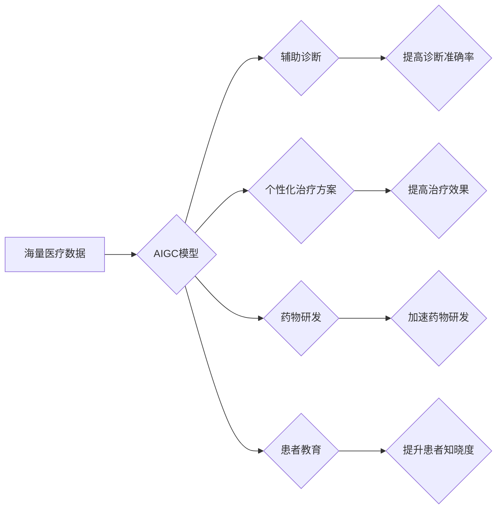

                 

## AIGC助力个性化医疗发展

> 关键词：AIGC、个性化医疗、深度学习、自然语言处理、医疗影像分析、药物研发、医疗诊断

## 1. 背景介绍

医疗领域正处于一场深刻变革之中，从传统的“一刀切”式治疗模式向更加精准、个性化的医疗服务方向迈进。个性化医疗的核心在于根据患者的个体差异，如基因、生活方式、病史等，制定最适合其的治疗方案，以提高治疗效果，降低副作用。而近年来兴起的AIGC（人工智能生成内容）技术，凭借其强大的数据处理和模式识别能力，为个性化医疗的发展提供了前所未有的机遇。

AIGC技术能够从海量医疗数据中挖掘隐藏的规律和模式，为医生提供更精准的诊断建议，辅助药物研发，甚至帮助患者更好地理解自己的病情。

## 2. 核心概念与联系

### 2.1  AIGC概述

AIGC是指利用人工智能技术，自动生成各种类型的文本、图像、音频、视频等内容。其核心技术包括深度学习、自然语言处理、计算机视觉等。

### 2.2  个性化医疗概述

个性化医疗是指根据患者的个体差异，如基因、生活方式、病史等，制定最适合其的治疗方案，以提高治疗效果，降低副作用。

### 2.3  AIGC与个性化医疗的联系

AIGC技术可以为个性化医疗提供以下方面的支持：

* **辅助诊断:** AIGC模型可以分析患者的病历、影像资料等数据，辅助医生进行诊断，提高诊断的准确性和效率。
* **个性化治疗方案:** AIGC可以根据患者的基因信息、生活方式、病史等数据，预测患者对不同治疗方案的反应，帮助医生制定个性化的治疗方案。
* **药物研发:** AIGC可以加速药物研发过程，例如预测药物的活性、安全性等，缩短药物研发的周期和成本。
* **患者教育:** AIGC可以生成个性化的患者教育内容，帮助患者更好地理解自己的病情和治疗方案。

**Mermaid 流程图**



## 3. 核心算法原理 & 具体操作步骤

### 3.1  算法原理概述

AIGC技术在个性化医疗领域的应用主要依赖于以下核心算法：

* **深度学习:** 深度学习算法能够从海量医疗数据中学习复杂的模式和关系，例如用于图像识别、自然语言处理等任务。
* **自然语言处理 (NLP):** NLP算法能够理解和处理自然语言文本，例如用于分析患者病历、生成患者教育内容等任务。
* **计算机视觉:** 计算机视觉算法能够理解和分析图像数据，例如用于分析医学影像、识别病灶等任务。

### 3.2  算法步骤详解

以辅助诊断为例，AIGC模型的具体操作步骤如下：

1. **数据收集:** 收集患者的病历、影像资料等数据。
2. **数据预处理:** 对数据进行清洗、格式化、标注等处理，使其能够被模型理解。
3. **模型训练:** 利用深度学习算法，训练AIGC模型，使其能够从数据中学习诊断知识。
4. **模型评估:** 使用测试数据评估模型的性能，例如准确率、召回率等。
5. **模型部署:** 将训练好的模型部署到临床环境中，用于辅助医生进行诊断。

### 3.3  算法优缺点

**优点:**

* **提高诊断准确率:** AIGC模型能够分析海量数据，识别复杂的模式，提高诊断的准确率。
* **提高诊断效率:** AIGC模型能够自动分析数据，节省医生的时间和精力。
* **个性化诊断:** AIGC模型可以根据患者的个体差异，提供个性化的诊断建议。

**缺点:**

* **数据依赖:** AIGC模型的性能依赖于训练数据的质量和数量。
* **解释性问题:** AIGC模型的决策过程往往是复杂的，难以解释，这可能会导致医生对模型的信任度降低。
* **伦理问题:** AIGC模型的应用可能会引发一些伦理问题，例如数据隐私、算法偏见等。

### 3.4  算法应用领域

AIGC技术在个性化医疗领域的应用领域非常广泛，包括：

* **疾病诊断:** 辅助医生诊断各种疾病，例如癌症、心血管疾病等。
* **治疗方案制定:** 根据患者的个体差异，制定个性化的治疗方案。
* **药物研发:** 预测药物的活性、安全性等，加速药物研发过程。
* **患者教育:** 生成个性化的患者教育内容，帮助患者更好地理解自己的病情和治疗方案。

## 4. 数学模型和公式 & 详细讲解 & 举例说明

### 4.1  数学模型构建

在AIGC辅助诊断中，常用的数学模型包括：

* **逻辑回归:** 用于预测患者是否患有某种疾病。
* **支持向量机 (SVM):** 用于分类不同类型的疾病。
* **深度神经网络 (DNN):** 用于分析复杂的医疗数据，例如医学影像。

### 4.2  公式推导过程

以逻辑回归为例，其目标函数为：

$$
L(w,b) = -\frac{1}{N}\sum_{i=1}^{N} y_i \log(p_i) + (1-y_i) \log(1-p_i)
$$

其中：

* $w$ 和 $b$ 是模型的参数。
* $N$ 是样本数量。
* $y_i$ 是第 $i$ 个样本的真实标签 (0 或 1)。
* $p_i$ 是模型预测第 $i$ 个样本属于正类的概率。

通过梯度下降算法，可以求解出最优的参数 $w$ 和 $b$。

### 4.3  案例分析与讲解

假设我们想要训练一个AIGC模型，用于预测患者是否患有糖尿病。我们可以收集患者的病历、血糖水平、体重等数据，并将其作为训练数据。

训练完成后，我们可以使用测试数据评估模型的性能。例如，我们可以计算模型的准确率、召回率等指标。

## 5. 项目实践：代码实例和详细解释说明

### 5.1  开发环境搭建

* **操作系统:** Ubuntu 20.04
* **编程语言:** Python 3.8
* **深度学习框架:** TensorFlow 2.0
* **其他工具:** Jupyter Notebook、Git

### 5.2  源代码详细实现

```python
import tensorflow as tf

# 定义模型结构
model = tf.keras.models.Sequential([
    tf.keras.layers.Dense(64, activation='relu', input_shape=(10,)),
    tf.keras.layers.Dense(32, activation='relu'),
    tf.keras.layers.Dense(1, activation='sigmoid')
])

# 编译模型
model.compile(optimizer='adam',
              loss='binary_crossentropy',
              metrics=['accuracy'])

# 训练模型
model.fit(x_train, y_train, epochs=10)

# 评估模型
loss, accuracy = model.evaluate(x_test, y_test)
print('Loss:', loss)
print('Accuracy:', accuracy)
```

### 5.3  代码解读与分析

* **模型结构:** 代码定义了一个简单的多层感知机模型，包含三个全连接层和一个sigmoid激活函数的输出层。
* **模型编译:** 使用Adam优化器、二分类交叉熵损失函数和准确率作为评估指标编译模型。
* **模型训练:** 使用训练数据训练模型，训练10个epoch。
* **模型评估:** 使用测试数据评估模型的性能，打印损失和准确率。

### 5.4  运行结果展示

运行代码后，会输出模型的训练损失和准确率，以及测试损失和准确率。

## 6. 实际应用场景

### 6.1  辅助诊断

AIGC模型可以辅助医生诊断各种疾病，例如癌症、心血管疾病等。例如，AIGC模型可以分析患者的医学影像，识别病灶，帮助医生做出更准确的诊断。

### 6.2  个性化治疗方案

AIGC模型可以根据患者的个体差异，制定个性化的治疗方案。例如，AIGC模型可以分析患者的基因信息、生活方式、病史等数据，预测患者对不同治疗方案的反应，帮助医生制定最适合患者的治疗方案。

### 6.3  药物研发

AIGC模型可以加速药物研发过程，例如预测药物的活性、安全性等，缩短药物研发的周期和成本。例如，AIGC模型可以分析药物的分子结构，预测其对特定疾病的疗效。

### 6.4  未来应用展望

AIGC技术在个性化医疗领域的应用前景广阔，未来可能在以下方面得到进一步发展：

* **更精准的诊断:** AIGC模型将能够分析更复杂、更丰富的医疗数据，提高诊断的准确率。
* **更个性化的治疗:** AIGC模型将能够根据患者的个体差异，制定更个性化的治疗方案，提高治疗效果。
* **更快速的药物研发:** AIGC模型将能够加速药物研发过程，缩短药物研发的周期和成本。
* **更便捷的患者服务:** AIGC模型将能够提供更便捷的患者服务，例如在线咨询、远程诊断等。

## 7. 工具和资源推荐

### 7.1  学习资源推荐

* **书籍:**
    * 《深度学习》 by Ian Goodfellow, Yoshua Bengio, and Aaron Courville
    * 《自然语言处理》 by Dan Jurafsky and James H. Martin
* **在线课程:**
    * Coursera: Deep Learning Specialization
    * Udacity: Artificial Intelligence Nanodegree
* **博客和论坛:**
    * TensorFlow Blog
    * PyTorch Blog
    * Kaggle

### 7.2  开发工具推荐

* **深度学习框架:** TensorFlow, PyTorch, Keras
* **数据处理工具:** Pandas, NumPy
* **可视化工具:** Matplotlib, Seaborn

### 7.3  相关论文推荐

* **A Survey of Transfer Learning** by Pan, S. J., & Yang, Q. (2010).
* **Attention Is All You Need** by Vaswani, A., Shazeer, N., Parmar, N., Uszkoreit, J., Jones, L., Gomez, A. N., ... & Polosukhin, I. (2017).
* **BERT: Pre-training of Deep Bidirectional Transformers for Language Understanding** by Devlin, J., Chang, M. W., Lee, K., & Toutanova, K. (2018).

## 8. 总结：未来发展趋势与挑战

### 8.1  研究成果总结

AIGC技术在个性化医疗领域的应用取得了显著进展，例如在疾病诊断、治疗方案制定、药物研发等方面都展现出了巨大的潜力。

### 8.2  未来发展趋势

* **模型更加精准:** AIGC模型将能够分析更复杂、更丰富的医疗数据，提高诊断的准确率。
* **个性化程度更高:** AIGC模型将能够根据患者的个体差异，制定更个性化的治疗方案。
* **应用场景更加广泛:** AIGC技术将应用于更多个性化医疗场景，例如远程诊断、患者教育等。

### 8.3  面临的挑战

* **数据隐私和安全:** AIGC模型的训练和应用需要大量医疗数据，如何保护患者的隐私和安全是一个重要的挑战。
* **算法解释性和可信度:** AIGC模型的决策过程往往是复杂的，难以解释，这可能会导致医生对模型的信任度降低。
* **伦理问题:** AIGC技术在个性化医疗领域的应用可能会引发一些伦理问题，例如算法偏见、医疗资源分配等。

### 8.4  研究展望

未来，需要进一步研究如何解决AIGC技术在个性化医疗领域的挑战，例如开发更安全、更可解释、更公平的AIGC模型，并制定相应的伦理规范。


## 9. 附录：常见问题与解答

**Q1: AIGC技术与传统医疗诊断方法相比，有哪些优势？**

**A1:** AIGC技术能够分析海量数据，识别复杂的模式，提高诊断的准确率和效率。同时，AIGC技术可以根据患者的个体差异，提供个性化的诊断建议。

**Q2: AIGC技术在个性化医疗领域的应用有哪些伦理问题？**

**A2:** AIGC技术在个性化医疗领域的应用可能会引发一些伦理问题，例如算法偏见、医疗资源分配等。例如，如果AIGC模型的训练数据存在偏见，那么模型可能会对某些患者群体做出不公平的诊断。

**Q3: 如何确保AIGC模型的安全性？**

**A3:** 确保AIGC模型的安全性需要从多个方面入手，例如：

* 使用高质量的训练数据，避免数据偏差。
* 开发可解释的AIGC模型，以便医生能够理解模型的决策过程。
* 对AIGC模型进行严格的测试和评估，确保其性能可靠。
* 制定相应的伦理规范，规范AIGC技术在医疗领域的应用。

**作者：禅与计算机程序设计艺术 / Zen and the Art of Computer Programming**<end_of_turn>

