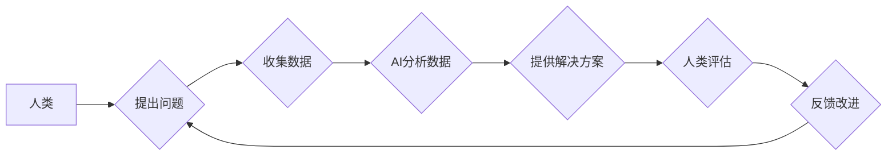

                 

## AI与人类计算：打造可持续的创新

> 关键词：人工智能、人类计算、协同创新、可持续发展、算法优化、机器学习、深度学习、数据驱动

### 1. 背景介绍

人工智能（AI）的快速发展正在深刻地改变着我们生活和工作的方式。从自动驾驶汽车到个性化医疗，AI技术正在各个领域展现出强大的应用潜力。然而，AI的发展也面临着一些挑战，例如数据孤岛、算法偏见、伦理道德等。

人类计算，作为一种与AI相辅相成的计算模式，近年来也逐渐受到关注。人类计算是指利用人类的智慧、创造力和洞察力来解决复杂问题，并与机器智能相结合，发挥协同效应。

在可持续发展的背景下，AI与人类计算的融合显得尤为重要。它可以帮助我们更高效地利用资源，解决社会问题，并推动人类文明的进步。

### 2. 核心概念与联系

#### 2.1 人工智能（AI）

人工智能是指模拟人类智能行为的计算机系统。它涵盖了多个领域，例如机器学习、深度学习、自然语言处理、计算机视觉等。

#### 2.2 人类计算

人类计算是指利用人类的智慧、创造力和洞察力来解决复杂问题。它强调人类在计算过程中的主动参与和决策作用。

#### 2.3 AI与人类计算的融合

AI与人类计算的融合是指将人工智能技术与人类计算模式相结合，发挥两者各自优势，实现协同创新。

**Mermaid 流程图**



### 3. 核心算法原理 & 具体操作步骤

#### 3.1 算法原理概述

在AI与人类计算的融合中，常用的算法包括机器学习、深度学习、强化学习等。这些算法可以帮助AI系统从数据中学习，并根据学习到的知识解决问题。

#### 3.2 算法步骤详解

**机器学习算法步骤：**

1. 数据收集和预处理：收集相关数据，并进行清洗、转换等预处理工作。
2. 模型选择：根据问题类型选择合适的机器学习模型，例如线性回归、逻辑回归、决策树等。
3. 模型训练：使用训练数据训练模型，调整模型参数，使其能够准确地预测或分类。
4. 模型评估：使用测试数据评估模型的性能，例如准确率、召回率、F1-score等。
5. 模型部署：将训练好的模型部署到实际应用场景中，用于预测或分类新的数据。

**深度学习算法步骤：**

1. 数据收集和预处理：与机器学习类似，需要收集和预处理数据。
2. 网络结构设计：设计深度神经网络的结构，包括层数、节点数、激活函数等。
3. 模型训练：使用训练数据训练深度神经网络，调整网络参数，使其能够学习到更复杂的特征。
4. 模型评估：使用测试数据评估模型的性能，例如准确率、召回率、F1-score等。
5. 模型部署：将训练好的深度神经网络部署到实际应用场景中，用于预测或分类新的数据。

#### 3.3 算法优缺点

**机器学习算法：**

* **优点：**
    * 能够从数据中学习，并不断改进预测或分类能力。
    * 适用于各种类型的问题，例如回归、分类、聚类等。
* **缺点：**
    * 需要大量的训练数据才能达到较好的性能。
    * 对数据质量要求较高，数据噪声或偏差会影响模型性能。

**深度学习算法：**

* **优点：**
    * 能够学习到更复杂的特征，从而提高预测或分类精度。
    * 适用于图像识别、自然语言处理等领域。
* **缺点：**
    * 需要更多的计算资源和训练时间。
    * 对数据质量要求更高，更容易受到过拟合的影响。

#### 3.4 算法应用领域

机器学习和深度学习算法广泛应用于各个领域，例如：

* **医疗保健：**疾病诊断、药物研发、个性化治疗
* **金融服务：**欺诈检测、风险评估、投资决策
* **零售业：**商品推荐、客户画像、库存管理
* **交通运输：**自动驾驶、交通流量预测、物流优化
* **教育：**个性化学习、智能辅导、自动批改

### 4. 数学模型和公式 & 详细讲解 & 举例说明

#### 4.1 数学模型构建

在AI与人类计算的融合中，数学模型是描述算法原理和关系的关键工具。例如，机器学习算法中常用的线性回归模型可以表示为：

$$y = mx + c$$

其中：

* $y$ 是预测值
* $x$ 是输入特征
* $m$ 是斜率
* $c$ 是截距

#### 4.2 公式推导过程

线性回归模型的训练过程就是通过最小化预测值与真实值的误差来调整参数 $m$ 和 $c$。常用的误差函数是均方误差（MSE）：

$$MSE = \frac{1}{n} \sum_{i=1}^{n} (y_i - \hat{y}_i)^2$$

其中：

* $n$ 是样本数量
* $y_i$ 是真实值
* $\hat{y}_i$ 是预测值

通过梯度下降算法，可以迭代地更新 $m$ 和 $c$ 的值，使得MSE最小化。

#### 4.3 案例分析与讲解

假设我们想要预测房屋价格，输入特征包括房屋面积、房间数量等。我们可以使用线性回归模型来建立房屋价格预测模型。

通过收集房屋数据，训练线性回归模型，得到模型参数 $m$ 和 $c$。然后，我们可以使用这个模型来预测新房子的价格。

### 5. 项目实践：代码实例和详细解释说明

#### 5.1 开发环境搭建

为了实现AI与人类计算的融合，我们需要搭建一个合适的开发环境。常用的开发环境包括：

* **Python:** 作为最流行的AI编程语言，Python拥有丰富的AI库和工具，例如TensorFlow、PyTorch、Scikit-learn等。
* **Jupyter Notebook:** 提供交互式编程环境，方便进行数据分析、模型训练和可视化。
* **云计算平台:** 例如AWS、Azure、GCP等，提供强大的计算资源和存储服务，支持大规模数据处理和模型训练。

#### 5.2 源代码详细实现

以下是一个使用Python和Scikit-learn库实现线性回归模型的代码示例：

```python
from sklearn.linear_model import LinearRegression
from sklearn.model_selection import train_test_split
from sklearn.metrics import mean_squared_error

# 加载数据
data = ...

# 将数据分为训练集和测试集
X_train, X_test, y_train, y_test = train_test_split(data.drop('price', axis=1), data['price'], test_size=0.2)

# 创建线性回归模型
model = LinearRegression()

# 训练模型
model.fit(X_train, y_train)

# 预测测试集数据
y_pred = model.predict(X_test)

# 计算模型性能
mse = mean_squared_error(y_test, y_pred)
print(f'Mean Squared Error: {mse}')
```

#### 5.3 代码解读与分析

这段代码首先加载数据，然后将数据分为训练集和测试集。接着，创建线性回归模型并使用训练集训练模型。最后，使用测试集数据预测价格，并计算模型性能。

#### 5.4 运行结果展示

运行代码后，会输出模型的均方误差值，该值越小，模型性能越好。

### 6. 实际应用场景

#### 6.1 智能客服

AI与人类计算的融合可以打造更智能的客服系统。AI可以处理简单的客户问题，例如查询订单状态、退换货流程等。而人类客服可以接管更复杂的问题，例如解决客户投诉、提供个性化建议等。

#### 6.2 个性化教育

AI可以根据学生的学习进度和能力，提供个性化的学习内容和辅导。人类教师可以根据学生的学习情况，提供更有效的指导和帮助。

#### 6.3 医疗诊断辅助

AI可以辅助医生进行疾病诊断，例如分析医学影像、识别病症等。人类医生可以根据AI的分析结果，做出更准确的诊断和治疗方案。

#### 6.4 未来应用展望

AI与人类计算的融合将应用于更多领域，例如：

* **自动驾驶:** AI可以控制车辆行驶，而人类驾驶员可以监控路况，并做出紧急决策。
* **科学研究:** AI可以帮助科学家分析大规模数据，发现新的规律和知识。
* **艺术创作:** AI可以辅助艺术家创作新的作品，例如绘画、音乐、写作等。

### 7. 工具和资源推荐

#### 7.1 学习资源推荐

* **在线课程:** Coursera、edX、Udacity等平台提供丰富的AI课程。
* **书籍:** 《深度学习》、《机器学习实战》等书籍是学习AI的基础教材。
* **博客和论坛:** AI相关的博客和论坛可以获取最新的技术资讯和交流经验。

#### 7.2 开发工具推荐

* **Python:** 作为最流行的AI编程语言，Python拥有丰富的AI库和工具。
* **Jupyter Notebook:** 提供交互式编程环境，方便进行数据分析、模型训练和可视化。
* **TensorFlow、PyTorch:** 两种流行的深度学习框架。

#### 7.3 相关论文推荐

* **《ImageNet Classification with Deep Convolutional Neural Networks》:** 介绍了AlexNet模型，标志着深度学习在图像识别领域的突破。
* **《Attention Is All You Need》:** 介绍了Transformer模型，在自然语言处理领域取得了重大进展。

### 8. 总结：未来发展趋势与挑战

#### 8.1 研究成果总结

AI与人类计算的融合取得了显著成果，例如在智能客服、个性化教育、医疗诊断辅助等领域取得了应用。

#### 8.2 未来发展趋势

* **更强大的AI算法:** 研究人员将继续开发更强大的AI算法，例如更复杂的深度学习模型、强化学习算法等。
* **更广泛的应用场景:** AI与人类计算的融合将应用于更多领域，例如自动驾驶、科学研究、艺术创作等。
* **更注重伦理道德:** 随着AI技术的进步，伦理道德问题将更加重要，需要制定相应的规范和制度。

#### 8.3 面临的挑战

* **数据孤岛:** 数据分散在不同的系统和平台，难以整合和共享。
* **算法偏见:** AI算法可能受到训练数据的影响，导致算法偏见。
* **可解释性:** 许多AI算法难以解释其决策过程，这可能会导致信任问题。

#### 8.4 研究展望

未来，我们需要继续研究AI与人类计算的融合，解决上述挑战，并推动AI技术朝着更安全、更可持续的方向发展。

### 9. 附录：常见问题与解答

**Q1: AI与人类计算的融合会取代人类工作吗？**

A1: AI与人类计算的融合不会完全取代人类工作，而是会改变工作方式。AI可以帮助人类完成重复性、繁琐的工作，而人类可以专注于更需要创造力和决策能力的工作。

**Q2: 如何确保AI算法的公平性和公正性？**

A2: 为了确保AI算法的公平性和公正性，需要从以下几个方面入手：

* 使用多元化的训练数据，避免算法偏见。
* 定期评估算法的公平性，并进行调整。
* 制定相应的法律法规，规范AI算法的应用。


作者：禅与计算机程序设计艺术 / Zen and the Art of Computer Programming 
<end_of_turn>

