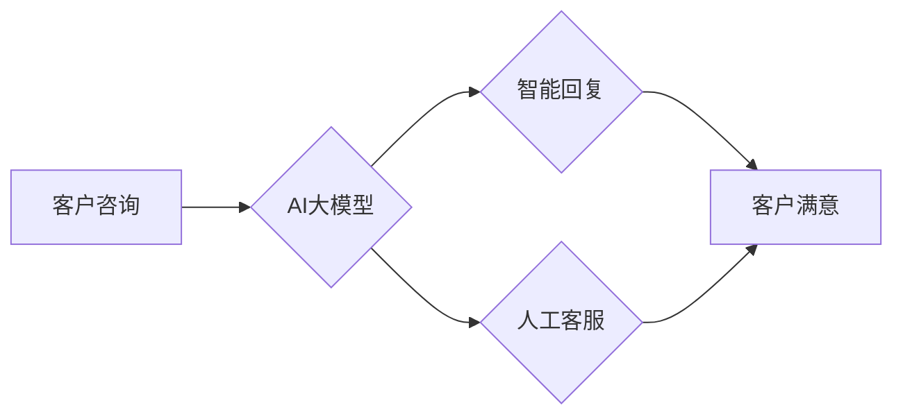

                 

## AI大模型如何改善电商客户服务体验

> 关键词：电商客户服务、AI大模型、自然语言处理、对话系统、机器学习、个性化推荐、智能客服

## 1. 背景介绍

电子商务的蓬勃发展为消费者带来了便捷的购物体验，但也带来了新的挑战，其中之一就是客户服务。随着电商平台用户规模的不断扩大，传统的人工客服模式面临着难以满足用户需求的困境。客户服务人员数量有限，处理能力受限，无法及时响应海量客户咨询，导致客户等待时间长、服务体验差。

近年来，人工智能（AI）技术突飞猛进，特别是大模型技术的出现，为电商客户服务带来了新的希望。AI大模型凭借其强大的语义理解、文本生成和知识推理能力，能够有效解决传统客服模式的痛点，提升客户服务体验。

## 2. 核心概念与联系

### 2.1  电商客户服务

电商客户服务是指电商平台为客户提供售前、售中、售后等全流程的咨询、帮助和支持服务。传统的电商客户服务主要依靠人工客服，通过电话、邮件、在线聊天等方式与客户沟通。

### 2.2  AI大模型

AI大模型是指在海量数据上训练的深度学习模型，具有强大的泛化能力和学习能力。它能够理解和生成人类语言，并完成复杂的认知任务，例如文本分类、情感分析、机器翻译、对话生成等。

### 2.3  联系

AI大模型可以应用于电商客户服务，构建智能客服系统，自动处理客户咨询，提升服务效率和体验。

**Mermaid 流程图**



## 3. 核心算法原理 & 具体操作步骤

### 3.1  算法原理概述

AI大模型在电商客户服务中的核心算法主要包括：

* **自然语言处理（NLP）:** 用于理解和处理客户的自然语言输入，例如文本、语音等。
* **机器学习（ML）:** 用于训练模型，使其能够识别客户意图、提取关键信息、生成智能回复。
* **对话系统:** 用于构建与客户进行交互的对话流程，例如问答、聊天机器人等。

### 3.2  算法步骤详解

1. **数据收集与预处理:** 收集电商平台的客户咨询数据，进行清洗、标注和格式化，构建训练数据集。
2. **模型训练:** 使用NLP和ML算法，训练AI大模型，使其能够理解客户意图、提取关键信息、生成智能回复。
3. **模型评估与优化:** 使用测试数据集评估模型性能，并根据评估结果进行模型调优，提高模型准确率和效率。
4. **部署与维护:** 将训练好的模型部署到电商平台，并进行持续监控和维护，确保模型的稳定性和有效性。

### 3.3  算法优缺点

**优点:**

* **提高服务效率:** 自动处理大量客户咨询，释放人工客服资源。
* **提升服务质量:** 提供24/7小时不间断服务，快速响应客户需求。
* **个性化服务:** 根据客户历史数据和行为特征，提供个性化的服务建议。
* **降低服务成本:** 减少人工客服成本，提高运营效率。

**缺点:**

* **模型准确率:** AI大模型的理解和生成能力仍存在局限性，可能无法准确理解所有客户咨询。
* **数据安全:** 客户咨询数据涉及隐私信息，需要采取措施保障数据安全。
* **技术复杂性:** 建设和维护AI大模型系统需要专业的技术人员和资源。

### 3.4  算法应用领域

* **智能客服:** 自动处理客户咨询，提供快速、高效的服务。
* **个性化推荐:** 根据客户喜好和购买历史，推荐相关商品。
* **订单处理:** 自动处理订单信息，例如确认订单、物流跟踪等。
* **售后服务:** 自动处理退换货、投诉等售后问题。

## 4. 数学模型和公式 & 详细讲解 & 举例说明

### 4.1  数学模型构建

在电商客户服务场景中，可以使用基于Transformer的语言模型，例如BERT、GPT等，构建AI大模型。这些模型利用深度学习技术，学习语言的语义和结构，能够理解和生成自然语言文本。

### 4.2  公式推导过程

Transformer模型的核心是注意力机制，它能够学习文本中不同词语之间的关系，并赋予每个词语不同的权重。注意力机制的计算公式如下：

$$
Attention(Q, K, V) = softmax(\frac{QK^T}{\sqrt{d_k}})V
$$

其中：

* $Q$：查询矩阵
* $K$：键矩阵
* $V$：值矩阵
* $d_k$：键向量的维度
* $softmax$：softmax函数，用于归一化注意力权重

### 4.3  案例分析与讲解

例如，当客户咨询“如何退换货？”时，AI大模型会使用注意力机制分析客户咨询中的关键词“退换货”，并根据训练数据中的相关信息，生成相应的回复，例如“您可以通过以下步骤进行退换货操作……”

## 5. 项目实践：代码实例和详细解释说明

### 5.1  开发环境搭建

* Python 3.7+
* TensorFlow/PyTorch
* NLTK/SpaCy
* 其他依赖库

### 5.2  源代码详细实现

```python
# 使用BERT模型进行文本分类
from transformers import BertTokenizer, BertForSequenceClassification

# 加载预训练模型和词典
tokenizer = BertTokenizer.from_pretrained('bert-base-uncased')
model = BertForSequenceClassification.from_pretrained('bert-base-uncased', num_labels=2)

# 预处理文本
text = "如何退换货？"
inputs = tokenizer(text, return_tensors="pt")

# 进行预测
outputs = model(**inputs)
predicted_class = outputs.logits.argmax().item()

# 输出结果
if predicted_class == 0:
    print("客户咨询是关于退换货的")
else:
    print("客户咨询不是关于退换货的")
```

### 5.3  代码解读与分析

* 使用预训练的BERT模型进行文本分类。
* 使用BERTTokenizer对文本进行预处理，转换为模型可理解的格式。
* 使用模型进行预测，并根据预测结果输出相应的回复。

### 5.4  运行结果展示

```
客户咨询是关于退换货的
```

## 6. 实际应用场景

### 6.1  智能客服

AI大模型可以构建智能客服系统，自动处理客户咨询，例如：

* 回答常见问题
* 提供产品信息
* 处理订单查询
* 协助退换货

### 6.2  个性化推荐

AI大模型可以分析客户的购买历史、浏览记录和喜好，提供个性化的商品推荐，提升客户购物体验。

### 6.3  售后服务

AI大模型可以自动处理售后问题，例如：

* 处理退换货申请
* 回答售后咨询
* 提供维修服务

### 6.4  未来应用展望

* 更智能的对话系统，能够理解更复杂的客户需求。
* 更个性化的服务体验，根据客户的具体情况提供定制化的服务。
* 更广泛的应用场景，例如营销推广、客户关系管理等。

## 7. 工具和资源推荐

### 7.1  学习资源推荐

* **书籍:**
    * 《深度学习》
    * 《自然语言处理》
    * 《机器学习实战》
* **在线课程:**
    * Coursera
    * edX
    * Udacity

### 7.2  开发工具推荐

* **TensorFlow:** 开源深度学习框架
* **PyTorch:** 开源深度学习框架
* **Hugging Face Transformers:** 预训练模型库

### 7.3  相关论文推荐

* BERT: Pre-training of Deep Bidirectional Transformers for Language Understanding
* GPT: Generative Pre-trained Transformer
* Transformer: Attention Is All You Need

## 8. 总结：未来发展趋势与挑战

### 8.1  研究成果总结

AI大模型在电商客户服务领域取得了显著的成果，能够有效提升服务效率和体验。

### 8.2  未来发展趋势

* 模型能力提升：模型将更加智能，能够理解更复杂的客户需求。
* 应用场景拓展：AI大模型将应用于更多电商场景，例如营销推广、客户关系管理等。
* 跨模态交互：AI大模型将支持多模态交互，例如文本、语音、图像等。

### 8.3  面临的挑战

* 模型准确率：AI大模型的理解和生成能力仍存在局限性，需要进一步提升模型准确率。
* 数据安全：客户咨询数据涉及隐私信息，需要采取措施保障数据安全。
* 伦理问题：AI大模型的应用需要考虑伦理问题，例如公平性、透明度等。

### 8.4  研究展望

未来，研究者将继续探索AI大模型在电商客户服务领域的应用，提升模型能力，解决面临的挑战，为消费者提供更智能、更便捷的购物体验。

## 9. 附录：常见问题与解答

### 9.1  常见问题

* AI大模型是否会取代人工客服？
* AI大模型如何保证数据安全？
* 如何评估AI大模型的性能？

### 9.2  解答

* AI大模型可以辅助人工客服，提高服务效率，但不会完全取代人工客服。
* AI大模型需要采用数据加密、访问控制等措施保障数据安全。
* 可以使用准确率、召回率、F1-score等指标评估AI大模型的性能。


作者：禅与计算机程序设计艺术 / Zen and the Art of Computer Programming 
<end_of_turn>

