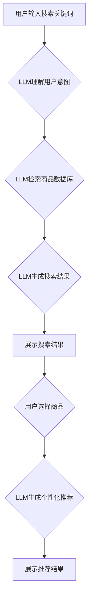

                 

## AI大模型赋能电商搜索推荐的用户体验优化策略

> 关键词：AI大模型、电商搜索、推荐系统、用户体验、自然语言处理、深度学习

## 1. 背景介绍

随着电商行业的蓬勃发展，用户对商品搜索和推荐的需求日益增长。传统的基于关键词匹配和协同过滤的搜索推荐系统，在面对海量商品和用户多样化的需求时，逐渐显露出局限性。 

用户体验的提升成为电商平台竞争的关键。如何利用人工智能技术，构建更智能、更精准、更个性化的搜索推荐系统，以满足用户多样化的需求，提升用户体验，成为电商平台亟需解决的难题。

近年来，大规模语言模型（LLM）的快速发展为电商搜索推荐带来了新的机遇。LLM 拥有强大的文本理解和生成能力，能够理解用户搜索意图，挖掘商品之间的语义关联，并生成更精准、更个性化的推荐结果。

## 2. 核心概念与联系

### 2.1  电商搜索推荐系统

电商搜索推荐系统是电商平台的核心功能之一，旨在帮助用户快速找到所需商品，并提供个性化的商品推荐。传统的电商搜索推荐系统主要基于以下两种方法：

* **关键词匹配:** 根据用户输入的关键词，从商品数据库中匹配出相关的商品。
* **协同过滤:** 根据用户的历史购买行为和相似用户的购买行为，推荐用户可能感兴趣的商品。

### 2.2  大规模语言模型（LLM）

大规模语言模型（LLM）是一种基于深度学习的强大人工智能模型，通过训练海量文本数据，学习语言的语法、语义和上下文关系。LLM 能够理解和生成人类语言，并具备以下优势：

* **强大的文本理解能力:** 能够理解用户搜索意图，识别关键词和隐含含义。
* **精准的语义匹配:** 能够挖掘商品之间的语义关联，推荐更相关的商品。
* **个性化的推荐:** 能够根据用户的历史行为和偏好，生成个性化的推荐结果。

### 2.3  LLM 在电商搜索推荐中的应用

将 LLM 应用于电商搜索推荐系统，可以有效提升用户体验，主要体现在以下方面：

* **更精准的搜索结果:** LLM 可以理解用户搜索意图，即使用户输入的关键词不完整或模糊，也能找到更精准的商品。
* **更个性化的推荐:** LLM 可以根据用户的历史行为和偏好，推荐更符合用户需求的商品。
* **更丰富的搜索体验:** LLM 可以生成更丰富的搜索结果，例如商品描述、用户评价、相关商品等，为用户提供更全面的信息。

**Mermaid 流程图**



## 3. 核心算法原理 & 具体操作步骤

### 3.1  算法原理概述

LLM 在电商搜索推荐中的应用主要基于以下核心算法：

* **BERT (Bidirectional Encoder Representations from Transformers):** BERT 是一种基于 Transformer 架构的预训练语言模型，能够理解上下文关系，并生成商品的语义向量表示。
* **Transformer:** Transformer 是一种新型的深度学习架构，能够有效处理长文本序列，并捕捉文本中的长距离依赖关系。
* **协同过滤算法:** 协同过滤算法可以根据用户的历史行为和相似用户的行为，推荐用户可能感兴趣的商品。

### 3.2  算法步骤详解

1. **数据预处理:** 收集电商平台的商品数据、用户行为数据等，并进行清洗、格式化等预处理工作。
2. **LLM 预训练:** 使用 BERT 等预训练语言模型，对商品描述、用户评论等文本数据进行预训练，学习商品的语义表示。
3. **特征提取:** 使用预训练好的 LLM，提取商品的语义特征，例如商品标题、描述、类别等。
4. **用户画像构建:** 根据用户的历史购买行为、浏览记录等数据，构建用户的兴趣画像。
5. **搜索结果排序:** 使用 LLM 生成的商品语义特征和用户的兴趣画像，对搜索结果进行排序，推荐与用户需求更匹配的商品。
6. **个性化推荐:** 使用协同过滤算法，根据用户的历史行为和相似用户的行为，推荐个性化的商品。

### 3.3  算法优缺点

**优点:**

* **更精准的搜索结果:** LLM 可以理解用户搜索意图，即使用户输入的关键词不完整或模糊，也能找到更精准的商品。
* **更个性化的推荐:** LLM 可以根据用户的历史行为和偏好，推荐更符合用户需求的商品。
* **更丰富的搜索体验:** LLM 可以生成更丰富的搜索结果，例如商品描述、用户评价、相关商品等，为用户提供更全面的信息。

**缺点:**

* **计算资源消耗大:** LLM 的训练和推理过程需要大量的计算资源。
* **数据依赖性强:** LLM 的性能取决于训练数据的质量和数量。
* **可解释性差:** LLM 的决策过程比较复杂，难以解释其推荐结果背后的逻辑。

### 3.4  算法应用领域

LLM 在电商搜索推荐领域的应用前景广阔，除了上述提到的应用场景，还可以应用于以下领域：

* **商品分类:** 利用 LLM 的语义理解能力，自动对商品进行分类。
* **商品描述生成:** 利用 LLM 的文本生成能力，自动生成商品的描述信息。
* **用户评论分析:** 利用 LLM 分析用户评论，了解用户对商品的评价和反馈。

## 4. 数学模型和公式 & 详细讲解 & 举例说明

### 4.1  数学模型构建

LLM 的核心数学模型是 Transformer 架构，其主要包含以下几个模块：

* **Encoder:** 用于编码输入文本序列，提取文本的语义特征。
* **Decoder:** 用于解码编码后的语义特征，生成输出文本序列。
* **Attention 机制:** 用于捕捉文本中的长距离依赖关系，提高模型的理解能力。

### 4.2  公式推导过程

Transformer 架构的数学公式比较复杂，这里只列举其中一个关键公式：

**Attention 机制计算公式:**

$$
Attention(Q, K, V) = \frac{exp(Q \cdot K^T / \sqrt{d_k})}{exp(Q \cdot K^T / \sqrt{d_k})} \cdot V
$$

其中：

* $Q$: 查询矩阵
* $K$: 键矩阵
* $V$: 值矩阵
* $d_k$: 键向量的维度

### 4.3  案例分析与讲解

假设我们有一个商品描述： "这款智能手机拥有强大的性能，拍照效果出色，屏幕清晰明亮。"

使用 Transformer 架构的 LLM，可以将这个商品描述编码成一个语义向量表示。这个语义向量包含了商品的多个特征，例如 "智能手机", "性能", "拍照", "屏幕" 等。

当用户搜索 "性能好的手机" 时，LLM 可以根据用户的搜索意图，提取相关的语义特征，并与商品语义向量进行匹配，从而推荐与用户需求更匹配的商品。

## 5. 项目实践：代码实例和详细解释说明

### 5.1  开发环境搭建

* **操作系统:** Ubuntu 20.04
* **Python 版本:** 3.8
* **深度学习框架:** TensorFlow 2.x
* **其他依赖库:** numpy, pandas, matplotlib

### 5.2  源代码详细实现

```python
# 导入必要的库
import tensorflow as tf
from tensorflow.keras.layers import Embedding, LSTM, Dense

# 定义模型
model = tf.keras.Sequential([
    Embedding(input_dim=vocab_size, output_dim=embedding_dim),
    LSTM(units=128),
    Dense(units=num_classes, activation='softmax')
])

# 编译模型
model.compile(optimizer='adam',
              loss='sparse_categorical_crossentropy',
              metrics=['accuracy'])

# 训练模型
model.fit(x_train, y_train, epochs=10)

# 评估模型
loss, accuracy = model.evaluate(x_test, y_test)
print('Loss:', loss)
print('Accuracy:', accuracy)
```

### 5.3  代码解读与分析

* **Embedding 层:** 将单词转换为稠密的向量表示。
* **LSTM 层:** 用于处理文本序列，捕捉文本中的长距离依赖关系。
* **Dense 层:** 全连接层，用于分类商品。

### 5.4  运行结果展示

训练完成后，可以将模型应用于实际场景，例如：

* **商品搜索:** 根据用户的搜索关键词，预测用户可能感兴趣的商品。
* **商品推荐:** 根据用户的历史行为和偏好，推荐个性化的商品。

## 6. 实际应用场景

### 6.1  电商平台搜索推荐

LLM 可以应用于电商平台的搜索推荐系统，提升用户体验，例如：

* **精准搜索:** 理解用户搜索意图，即使用户输入的关键词不完整或模糊，也能找到更精准的商品。
* **个性化推荐:** 根据用户的历史行为和偏好，推荐更符合用户需求的商品。
* **智能客服:** 利用 LLM 的自然语言理解能力，构建智能客服系统，帮助用户解决购物问题。

### 6.2  内容电商平台

LLM 可以应用于内容电商平台，例如：

* **商品描述生成:** 利用 LLM 自动生成商品的描述信息，提高商品的吸引力。
* **用户评论分析:** 利用 LLM 分析用户评论，了解用户对商品的评价和反馈，帮助商家改进商品。

### 6.3  社交电商平台

LLM 可以应用于社交电商平台，例如：

* **商品推荐:** 根据用户的社交关系和兴趣爱好，推荐个性化的商品。
* **内容创作:** 利用 LLM 生成商品相关的创意内容，吸引用户的关注。

### 6.4  未来应用展望

随着 LLM 技术的不断发展，其在电商搜索推荐领域的应用场景将更加广泛，例如：

* **多模态搜索:** 将文本、图像、视频等多模态数据融合，实现更精准的商品搜索。
* **场景化推荐:** 根据用户的购物场景，推荐更合适的商品。
* **个性化营销:** 利用 LLM 分析用户的需求和偏好，进行个性化的营销推广。

## 7. 工具和资源推荐

### 7.1  学习资源推荐

* **书籍:**
    * 《深度学习》 by Ian Goodfellow, Yoshua Bengio, Aaron Courville
    * 《自然语言处理》 by Dan Jurafsky, James H. Martin
* **在线课程:**
    * Coursera: Deep Learning Specialization
    * Stanford CS224N: Natural Language Processing with Deep Learning

### 7.2  开发工具推荐

* **TensorFlow:** 开源深度学习框架
* **PyTorch:** 开源深度学习框架
* **Hugging Face Transformers:** 提供预训练的 LLM 模型和工具

### 7.3  相关论文推荐

* BERT: Pre-training of Deep Bidirectional Transformers for Language Understanding
* Attention Is All You Need
* Transformer-XL: Attentive Language Modeling Beyond Millions of Tokens

## 8. 总结：未来发展趋势与挑战

### 8.1  研究成果总结

LLM 在电商搜索推荐领域的应用取得了显著成果，能够有效提升用户体验，但仍存在一些挑战。

### 8.2  未来发展趋势

* **模型规模和性能提升:** 随着计算资源的不断发展，LLM 的规模和性能将不断提升，能够处理更复杂的任务。
* **多模态融合:** 将文本、图像、视频等多模态数据融合，实现更精准的商品搜索和推荐。
* **场景化推荐:** 根据用户的购物场景，推荐更合适的商品。
* **个性化营销:** 利用 LLM 分析用户的需求和偏好，进行个性化的营销推广。

### 8.3  面临的挑战

* **数据安全和隐私:** LLM 的训练需要大量的用户数据，如何保证数据安全和隐私是一个重要的挑战。
* **模型可解释性:** LLM 的决策过程比较复杂，难以解释其推荐结果背后的逻辑，如何提高模型的可解释性是一个重要的研究方向。
* **计算资源消耗:** LLM 的训练和推理过程需要大量的计算资源，如何降低计算成本是一个重要的挑战。

### 8.4  研究展望

未来，LLM 在电商搜索推荐领域的应用将更加广泛，并与其他人工智能技术融合，例如强化学习、知识图谱等，构建更智能、更精准、更个性化的电商搜索推荐系统。


## 9. 附录：常见问题与解答

**Q1: LLM 的训练需要多少数据？**

A1: LLM 的训练需要大量的文本数据，通常需要数十亿甚至数百亿个单词。

**Q2: 如何评估 LLM 的性能？**

A2: LLM 的性能可以评估指标，例如准确率、召回率、F1-score等。

**Q3: 如何部署 LLM 模型？**

A3: LLM 模型可以部署在云服务器、边缘设备等平台上。

**作者：禅与计算机程序设计艺术 / Zen and the Art of Computer Programming**<end_of_turn>

