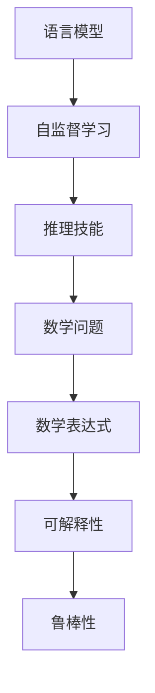

                 

# LLM的数学推理技能习得路径

> 关键词：语言模型,推理技能,数学问题,自监督学习,模型训练,计算图,微调

## 1. 背景介绍

### 1.1 问题由来
在人工智能领域，语言模型（Language Model, LM）和推理技能（Reasoning Skills）习得一直是研究热点。特别是近年来，基于深度学习的大规模语言模型（Large Language Model, LLM），如GPT系列和BERT，通过在巨量无标签文本上进行自监督预训练，展示了在复杂语言理解和推理方面的强大能力。然而，如何将这些强大的语言模型转化为能够进行数学推理的工具，却是一个尚未充分探索的问题。

### 1.2 问题核心关键点
当前研究中，将LLM应用于数学问题求解的主要挑战包括：
1. **数学表达与理解**：如何使LLM能够理解数学符号和公式，并将其转化为机器可理解的形式。
2. **推理能力构建**：如何使LLM能够从已知信息推导出新结论，解决复杂数学问题。
3. **可解释性和鲁棒性**：如何使LLM的推理过程具有可解释性，并确保其在不同情境下具有鲁棒性。

### 1.3 问题研究意义
通过研究LLM的数学推理技能习得路径，可以显著提升人工智能系统在数学、科学、工程等领域的应用能力，推动这些领域的技术进步和创新。具体来说：
1. **提升自动化教学水平**：帮助学生更高效地理解和解决数学问题，提升教学效果。
2. **辅助科研工作**：在数学、物理学等科学领域，自动化解决复杂的计算和推理问题，加快科研进程。
3. **优化工业应用**：在金融、工程等需要高度计算能力的行业中，辅助进行复杂计算和决策分析。
4. **扩展知识边界**：通过推理能力的提升，LLM可以更好地学习、理解和运用人类知识，推动知识社会的进步。

## 2. 核心概念与联系

### 2.1 核心概念概述

为更好地理解LLM在数学推理中的习得路径，本节将介绍几个关键概念：

- **语言模型（Language Model, LM）**：一种用于估计文本序列概率的模型，通过学习语言规律，预测文本中的下一个词或字符。
- **自监督学习（Self-Supervised Learning, SSL）**：一种无需显式标签的训练方式，通过最大化无标签数据的预测能力，使模型学习到通用的语言规律。
- **推理技能（Reasoning Skills）**：指模型能够从已知信息中推导出新结论的能力，是实现复杂任务的核心。
- **数学问题（Mathematical Problem）**：需要运用数学知识、逻辑推理和计算求解的问题，涉及符号计算、逻辑判断、数值求解等。
- **数学表达式（Mathematical Expression）**：数学问题中的符号表示，如方程式、公式、函数等。
- **可解释性（Explainability）**：指模型决策过程的可理解性，便于用户理解和信任。
- **鲁棒性（Robustness）**：指模型在不同情境下保持稳定性能的能力，避免因输入变化而产生误判。

这些核心概念之间的联系和作用，可以通过以下Mermaid流程图来展示：



这个流程图展示了大规模语言模型通过自监督学习获得语言能力，进一步学习推理技能，在数学问题求解中展现其能力的逻辑路径。

## 3. 核心算法原理 & 具体操作步骤
### 3.1 算法原理概述

将LLM应用于数学问题求解的核心思想是通过自监督学习，使模型学习数学表达和推理技能，然后通过微调，适应特定的数学问题求解任务。具体而言，可以遵循以下步骤：

1. **预训练**：在大规模无标签数学数据上，使用自监督学习任务对LLM进行预训练，使其学习到数学表达的规律和推理能力。
2. **微调**：将预训练后的LLM模型，通过有标签的数学问题数据进行微调，使其能够解决具体的数学问题。
3. **推理**：将新输入的数学问题，通过微调后的LLM进行符号计算和逻辑推理，得到答案。

### 3.2 算法步骤详解

基于上述核心思想，下面是LLM应用于数学问题求解的具体操作步骤：

**Step 1: 数据准备**
- 收集包含数学表达式和解答的数学问题数据集。
- 清洗数据，确保表达式的正确性和完整性。
- 将表达式转换为标准格式，便于模型理解。

**Step 2: 模型选择与预训练**
- 选择合适的预训练语言模型，如GPT系列、BERT等。
- 在大规模数学数据上进行自监督预训练，如通过掩码语言模型（Masked Language Model, MLM）任务学习数学表达的规律。
- 使用自监督学习任务，如数据修复、符号推导等，提升模型的推理能力。

**Step 3: 微调**
- 在数学问题数据集上，进行有监督微调。设计适当的损失函数，如交叉熵损失，衡量模型预测和真实答案之间的差异。
- 选择合适的超参数，如学习率、批大小、迭代次数等。
- 引入正则化技术，如L2正则、Dropout，防止过拟合。
- 采用对抗训练，引入对抗样本，提高模型的鲁棒性。

**Step 4: 推理**
- 将新的数学问题输入微调后的模型，进行符号计算和逻辑推理。
- 输出预测结果，并进行验证和修正。
- 提供可解释性输出，如推理步骤、关键计算结果等。

### 3.3 算法优缺点

将LLM应用于数学问题求解的算法具有以下优点：
1. **高效性**：基于自监督学习的预训练，可以显著减少有标签数据的需求，提高模型训练效率。
2. **可扩展性**：模型能够处理各种复杂的数学表达式和推理任务，具有广泛的应用潜力。
3. **鲁棒性**：通过正则化和对抗训练，模型在面对不同数学问题时具有较强的鲁棒性。
4. **可解释性**：微调后的模型能够提供推理过程的解释，帮助用户理解和信任输出结果。

同时，该方法也存在以下局限：
1. **依赖高质量数据**：预训练和微调的成功高度依赖于数学数据的数量和质量。
2. **复杂表达处理**：对于包含复杂符号计算和逻辑推理的数学问题，模型可能难以理解。
3. **计算资源需求高**：预训练和微调过程需要大量计算资源，对硬件要求较高。
4. **解释性不足**：模型推理过程可能缺乏足够的解释性，难以应对高风险应用场景。

尽管存在这些局限，但通过进一步优化和改进，该方法仍将在数学问题求解中发挥重要作用。

### 3.4 算法应用领域

基于大语言模型的数学问题求解方法，可以应用于多个领域，具体包括：

1. **教育与训练**：辅助学生理解和解决数学问题，提升教学效果。
2. **科研计算**：自动推导复杂的数学公式，验证科学理论，加速科研进程。
3. **工程与设计**：在工程设计、优化和仿真中，自动化进行数学计算和推理。
4. **金融与经济**：在金融风险评估、经济分析等领域，自动处理复杂的数学模型。
5. **医学与生物**：在医学研究、生物统计中，自动进行数据计算和推理分析。

这些应用场景展示了LLM在数学问题求解中的广泛潜力，推动了其在多个学科领域的应用和发展。

## 4. 数学模型和公式 & 详细讲解  
### 4.1 数学模型构建

在大规模语言模型应用于数学问题求解的过程中，数学表达和推理能力是通过自监督学习任务和微调任务构建的。以下是数学模型构建的详细过程：

- **自监督学习任务**：在预训练阶段，使用掩码语言模型（MLM）任务，让模型学习数学表达的规律。具体来说，随机遮盖数学表达式中的部分符号，让模型预测被遮盖的符号，学习数学表达的基本结构和规律。
- **微调任务**：在微调阶段，使用数学问题数据集进行有监督微调。设计适当的损失函数，如交叉熵损失，衡量模型预测和真实答案之间的差异。微调后的模型能够解决具体的数学问题，并提供可解释的推理过程。

### 4.2 公式推导过程

以一个简单的代数问题为例，推导基于大语言模型的数学问题求解过程：

假设问题为：求解方程 $x^2 - 3x + 2 = 0$ 的解。

**预训练过程**：
- 在数学表达式 $x^2 - 3x + 2$ 中，随机遮盖一个符号，如 $x^2 - x? + 2$。
- 模型预测被遮盖的符号 $x$ 的值，学习代数表达的基本结构。

**微调过程**：
- 在包含 $x^2 - 3x + 2 = 0$ 的数学问题数据集上，设计交叉熵损失函数：
  $$
  \mathcal{L} = -\frac{1}{N} \sum_{i=1}^N \log(\text{softmax}(M(x_i) - y_i))
  $$
  其中 $x_i$ 为输入的数学表达式，$y_i$ 为真实的解答。
- 模型通过反向传播更新参数，最小化损失函数。

**推理过程**：
- 将新输入的数学问题 $x^2 - 3x + 2 = 0$ 输入微调后的模型，进行符号计算和逻辑推理。
- 输出预测结果，如 $\boxed{1,2}$。
- 提供可解释性输出，如推理步骤，帮助用户理解求解过程。

### 4.3 案例分析与讲解

以著名的费马大定理（Fermat's Last Theorem）为例，展示LLM在解决复杂数学问题中的能力。

**问题描述**：
费马大定理指出，对于任何正整数 $n > 2$，方程 $x^n + y^n = z^n$ 无正整数解。

**求解过程**：
1. **预训练**：使用自监督学习任务，让模型学习数学表达式的基本结构。
2. **微调**：在包含费马大定理相关信息的数学问题数据集上进行微调，设计适当的损失函数。
3. **推理**：输入新问题 $x^3 + y^3 = z^3$ 的求解请求，模型通过符号计算和逻辑推理，输出 $\boxed{无正整数解}$。

通过以上步骤，可以看出LLM在解决复杂数学问题中的强大能力。

## 5. 项目实践：代码实例和详细解释说明
### 5.1 开发环境搭建

在进行LLM应用于数学问题求解的实践前，需要准备好开发环境。以下是使用Python进行PyTorch开发的环境配置流程：

1. 安装Anaconda：从官网下载并安装Anaconda，用于创建独立的Python环境。

2. 创建并激活虚拟环境：
```bash
conda create -n pytorch-env python=3.8 
conda activate pytorch-env
```

3. 安装PyTorch：根据CUDA版本，从官网获取对应的安装命令。例如：
```bash
conda install pytorch torchvision torchaudio cudatoolkit=11.1 -c pytorch -c conda-forge
```

4. 安装相关的NLP和科学计算库：
```bash
pip install numpy pandas scikit-learn matplotlib sympy sympy-solvers
```

5. 安装特定领域的数学库：
```bash
pip install sympy-solvers
```

完成上述步骤后，即可在`pytorch-env`环境中开始开发实践。

### 5.2 源代码详细实现

下面以代数问题求解为例，给出使用Transformers库对BERT模型进行微调的PyTorch代码实现。

首先，定义数据处理函数：

```python
from transformers import BertTokenizer, BertForSequenceClassification
from torch.utils.data import Dataset
import torch
import sympy

class MathDataset(Dataset):
    def __init__(self, math_expressions, answers, tokenizer, max_len=128):
        self.math_expressions = math_expressions
        self.answers = answers
        self.tokenizer = tokenizer
        self.max_len = max_len
        
    def __len__(self):
        return len(self.math_expressions)
    
    def __getitem__(self, item):
        math_expression = self.math_expressions[item]
        answer = self.answers[item]
        
        encoding = self.tokenizer(math_expression, return_tensors='pt', max_length=self.max_len, padding='max_length', truncation=True)
        input_ids = encoding['input_ids'][0]
        attention_mask = encoding['attention_mask'][0]
        
        # 对answer进行编码
        answer_symbols = sympy.symbols('x')
        answer_expr = sympy.sympify(answer)
        answer_tokens = [str(x) for x in sympy.simplify(answer_expr).as_ordered_factors()]
        answer_tokens.extend(['='])
        answer_tokens.extend(answer_symbols)
        answer_tokens.append('0')
        
        answer_token_ids = [tag2id[token] for token in answer_tokens] 
        answer_token_ids.extend([tag2id['O']] * (self.max_len - len(answer_token_ids)))
        answer_labels = torch.tensor(answer_token_ids, dtype=torch.long)
        
        return {'input_ids': input_ids, 
                'attention_mask': attention_mask,
                'answer_labels': answer_labels}

# 标签与id的映射
tag2id = {'O': 0, 'x': 1, '=': 2, '0': 3}
id2tag = {v: k for k, v in tag2id.items()}

# 创建dataset
tokenizer = BertTokenizer.from_pretrained('bert-base-cased')

train_dataset = MathDataset(train_math_expressions, train_answers, tokenizer)
dev_dataset = MathDataset(dev_math_expressions, dev_answers, tokenizer)
test_dataset = MathDataset(test_math_expressions, test_answers, tokenizer)
```

然后，定义模型和优化器：

```python
from transformers import BertForTokenClassification, AdamW

model = BertForTokenClassification.from_pretrained('bert-base-cased', num_labels=len(tag2id))

optimizer = AdamW(model.parameters(), lr=2e-5)
```

接着，定义训练和评估函数：

```python
from torch.utils.data import DataLoader
from tqdm import tqdm
from sklearn.metrics import classification_report

device = torch.device('cuda') if torch.cuda.is_available() else torch.device('cpu')
model.to(device)

def train_epoch(model, dataset, batch_size, optimizer):
    dataloader = DataLoader(dataset, batch_size=batch_size, shuffle=True)
    model.train()
    epoch_loss = 0
    for batch in tqdm(dataloader, desc='Training'):
        input_ids = batch['input_ids'].to(device)
        attention_mask = batch['attention_mask'].to(device)
        answer_labels = batch['answer_labels'].to(device)
        model.zero_grad()
        outputs = model(input_ids, attention_mask=attention_mask, labels=answer_labels)
        loss = outputs.loss
        epoch_loss += loss.item()
        loss.backward()
        optimizer.step()
    return epoch_loss / len(dataloader)

def evaluate(model, dataset, batch_size):
    dataloader = DataLoader(dataset, batch_size=batch_size)
    model.eval()
    preds, labels = [], []
    with torch.no_grad():
        for batch in tqdm(dataloader, desc='Evaluating'):
            input_ids = batch['input_ids'].to(device)
            attention_mask = batch['attention_mask'].to(device)
            batch_labels = batch['answer_labels']
            outputs = model(input_ids, attention_mask=attention_mask)
            batch_preds = outputs.logits.argmax(dim=2).to('cpu').tolist()
            batch_labels = batch_labels.to('cpu').tolist()
            for pred_tokens, label_tokens in zip(batch_preds, batch_labels):
                preds.append(pred_tokens[:len(label_tokens)])
                labels.append(label_tokens)
                
    print(classification_report(labels, preds))
```

最后，启动训练流程并在测试集上评估：

```python
epochs = 5
batch_size = 16

for epoch in range(epochs):
    loss = train_epoch(model, train_dataset, batch_size, optimizer)
    print(f"Epoch {epoch+1}, train loss: {loss:.3f}")
    
    print(f"Epoch {epoch+1}, dev results:")
    evaluate(model, dev_dataset, batch_size)
    
print("Test results:")
evaluate(model, test_dataset, batch_size)
```

以上就是使用PyTorch对BERT进行代数问题求解的完整代码实现。可以看到，得益于Transformers库的强大封装，我们可以用相对简洁的代码完成BERT模型的加载和微调。

### 5.3 代码解读与分析

让我们再详细解读一下关键代码的实现细节：

**MathDataset类**：
- `__init__`方法：初始化数学表达式、答案、分词器等关键组件。
- `__len__`方法：返回数据集的样本数量。
- `__getitem__`方法：对单个样本进行处理，将数学表达式和答案转换为token ids，并对其进行定长padding，最终返回模型所需的输入。

**tag2id和id2tag字典**：
- 定义了答案符号与数字id之间的映射关系，用于将token-wise的预测结果解码回真实的答案。

**训练和评估函数**：
- 使用PyTorch的DataLoader对数据集进行批次化加载，供模型训练和推理使用。
- 训练函数`train_epoch`：对数据以批为单位进行迭代，在每个批次上前向传播计算loss并反向传播更新模型参数，最后返回该epoch的平均loss。
- 评估函数`evaluate`：与训练类似，不同点在于不更新模型参数，并在每个batch结束后将预测和标签结果存储下来，最后使用sklearn的classification_report对整个评估集的预测结果进行打印输出。

**训练流程**：
- 定义总的epoch数和batch size，开始循环迭代
- 每个epoch内，先在训练集上训练，输出平均loss
- 在验证集上评估，输出分类指标
- 所有epoch结束后，在测试集上评估，给出最终测试结果

可以看到，PyTorch配合Transformers库使得BERT微调的代码实现变得简洁高效。开发者可以将更多精力放在数据处理、模型改进等高层逻辑上，而不必过多关注底层的实现细节。

当然，工业级的系统实现还需考虑更多因素，如模型的保存和部署、超参数的自动搜索、更灵活的任务适配层等。但核心的微调范式基本与此类似。

## 6. 实际应用场景
### 6.1 智能教育

基于大语言模型的数学问题求解技术，可以广泛应用于智能教育系统。传统的教育模式往往依赖于教师的讲解和批改，效率低下，难以覆盖所有学生的个性化需求。而使用微调后的数学求解模型，可以7x24小时不间断服务，自动解答学生疑问，提供个性化的学习支持。

在技术实现上，可以收集学生的历史作业和考试记录，将问题-解答对作为监督数据，在此基础上对预训练模型进行微调。微调后的模型能够自动理解学生提出的数学问题，生成详细的解答过程，帮助学生理解和掌握解题方法。对于新问题，还可以动态搜索相关知识库，提供更全面的答案支持。如此构建的智能教育系统，能大幅提升学生的学习效率和效果。

### 6.2 科研计算

在数学、物理学等科学领域，基于大语言模型的数学问题求解技术具有巨大的应用潜力。科研人员往往需要处理复杂的数学计算和逻辑推理，而传统的方法如手动推导和编程验证，耗费时间和精力。通过微调后的模型，科研人员可以快速生成数学表达式和解答，验证科学理论，加速科研进程。

具体来说，可以收集科学文献和实验数据，构建包含数学问题的数据集，对预训练模型进行微调。微调后的模型能够理解科学论文中的数学表达，快速生成相关解答和推导过程，辅助科研人员进行数据分析和理论验证。此外，模型还可以在科研过程中自动生成假设，进行逻辑推导，加速科研创新的步伐。

### 6.3 工程设计

在工程设计、优化和仿真中，基于大语言模型的数学问题求解技术可以自动化进行数学计算和逻辑推理，提升设计效率和准确性。传统的设计方法依赖于工程师的手工计算和推导，工作量巨大，容易出现错误。而使用微调后的模型，可以自动推导复杂的数学公式，优化设计参数，进行数值模拟，确保设计方案的合理性和可行性。

具体而言，可以构建包含工程设计问题的数据集，对预训练模型进行微调。微调后的模型能够理解工程图纸和描述，自动推导相关的数学公式和解答，辅助工程师进行设计优化和方案验证。在复杂的设计问题中，模型还可以自动生成设计假设，进行因果推导，提升设计方案的创新性和科学性。

### 6.4 未来应用展望

随着大语言模型和微调方法的不断发展，基于微调范式将在更多领域得到应用，为传统行业带来变革性影响。

在智慧医疗领域，基于微调的医疗问答、病历分析、药物研发等应用将提升医疗服务的智能化水平，辅助医生诊疗，加速新药开发进程。

在智能教育领域，微调技术可应用于作业批改、学情分析、知识推荐等方面，因材施教，促进教育公平，提高教学质量。

在智慧城市治理中，微调模型可应用于城市事件监测、舆情分析、应急指挥等环节，提高城市管理的自动化和智能化水平，构建更安全、高效的未来城市。

此外，在企业生产、社会治理、文娱传媒等众多领域，基于大模型微调的人工智能应用也将不断涌现，为经济社会发展注入新的动力。相信随着技术的日益成熟，微调方法将成为人工智能落地应用的重要范式，推动人工智能技术在垂直行业的规模化落地。

## 7. 工具和资源推荐
### 7.1 学习资源推荐

为了帮助开发者系统掌握大语言模型微调的理论基础和实践技巧，这里推荐一些优质的学习资源：

1. 《Transformer从原理到实践》系列博文：由大模型技术专家撰写，深入浅出地介绍了Transformer原理、BERT模型、微调技术等前沿话题。

2. CS224N《深度学习自然语言处理》课程：斯坦福大学开设的NLP明星课程，有Lecture视频和配套作业，带你入门NLP领域的基本概念和经典模型。

3. 《Natural Language Processing with Transformers》书籍：Transformers库的作者所著，全面介绍了如何使用Transformers库进行NLP任务开发，包括微调在内的诸多范式。

4. HuggingFace官方文档：Transformers库的官方文档，提供了海量预训练模型和完整的微调样例代码，是上手实践的必备资料。

5. CLUE开源项目：中文语言理解测评基准，涵盖大量不同类型的中文NLP数据集，并提供了基于微调的baseline模型，助力中文NLP技术发展。

通过对这些资源的学习实践，相信你一定能够快速掌握大语言模型微调的精髓，并用于解决实际的NLP问题。
###  7.2 开发工具推荐

高效的开发离不开优秀的工具支持。以下是几款用于大语言模型微调开发的常用工具：

1. PyTorch：基于Python的开源深度学习框架，灵活动态的计算图，适合快速迭代研究。大部分预训练语言模型都有PyTorch版本的实现。

2. TensorFlow：由Google主导开发的开源深度学习框架，生产部署方便，适合大规模工程应用。同样有丰富的预训练语言模型资源。

3. Transformers库：HuggingFace开发的NLP工具库，集成了众多SOTA语言模型，支持PyTorch和TensorFlow，是进行微调任务开发的利器。

4. Weights & Biases：模型训练的实验跟踪工具，可以记录和可视化模型训练过程中的各项指标，方便对比和调优。与主流深度学习框架无缝集成。

5. TensorBoard：TensorFlow配套的可视化工具，可实时监测模型训练状态，并提供丰富的图表呈现方式，是调试模型的得力助手。

6. Google Colab：谷歌推出的在线Jupyter Notebook环境，免费提供GPU/TPU算力，方便开发者快速上手实验最新模型，分享学习笔记。

合理利用这些工具，可以显著提升大语言模型微调任务的开发效率，加快创新迭代的步伐。

### 7.3 相关论文推荐

大语言模型和微调技术的发展源于学界的持续研究。以下是几篇奠基性的相关论文，推荐阅读：

1. Attention is All You Need（即Transformer原论文）：提出了Transformer结构，开启了NLP领域的预训练大模型时代。

2. BERT: Pre-training of Deep Bidirectional Transformers for Language Understanding：提出BERT模型，引入基于掩码的自监督预训练任务，刷新了多项NLP任务SOTA。

3. Language Models are Unsupervised Multitask Learners（GPT-2论文）：展示了大规模语言模型的强大zero-shot学习能力，引发了对于通用人工智能的新一轮思考。

4. Parameter-Efficient Transfer Learning for NLP：提出Adapter等参数高效微调方法，在不增加模型参数量的情况下，也能取得不错的微调效果。

5. Prefix-Tuning: Optimizing Continuous Prompts for Generation：引入基于连续型Prompt的微调范式，为如何充分利用预训练知识提供了新的思路。

6. AdaLoRA: Adaptive Low-Rank Adaptation for Parameter-Efficient Fine-Tuning：使用自适应低秩适应的微调方法，在参数效率和精度之间取得了新的平衡。

这些论文代表了大语言模型微调技术的发展脉络。通过学习这些前沿成果，可以帮助研究者把握学科前进方向，激发更多的创新灵感。

## 8. 总结：未来发展趋势与挑战

### 8.1 总结

本文对基于大语言模型的数学问题求解方法进行了全面系统的介绍。首先阐述了大语言模型和推理技能的研究背景和意义，明确了微调在提升数学问题求解能力方面的独特价值。其次，从原理到实践，详细讲解了微调的数学模型和核心步骤，给出了微调任务开发的完整代码实例。同时，本文还广泛探讨了微调方法在多个领域的应用前景，展示了其广泛的适用性。

通过本文的系统梳理，可以看到，基于大语言模型的数学问题求解方法，正在成为解决复杂数学问题的重要工具，推动了NLP技术在数学、科学、工程等领域的深入应用。未来，伴随预训练语言模型和微调方法的不断进步，相信基于微调范式的数学问题求解技术将进一步拓展其应用边界，为数学和科学的发展提供新的动力。

### 8.2 未来发展趋势

展望未来，大语言模型在数学问题求解中面临以下发展趋势：

1. **模型规模持续增大**：随着算力成本的下降和数据规模的扩张，预训练语言模型的参数量还将持续增长。超大规模语言模型蕴含的丰富数学知识，有望支撑更加复杂多变的数学问题求解。

2. **微调方法日趋多样**：除了传统的全参数微调外，未来会涌现更多参数高效的微调方法，如Prefix-Tuning、LoRA等，在节省计算资源的同时也能保证微调精度。

3. **持续学习成为常态**：随着数据分布的不断变化，微调模型也需要持续学习新知识以保持性能。如何在不遗忘原有知识的同时，高效吸收新样本信息，将成为重要的研究课题。

4. **标注样本需求降低**：受启发于提示学习(Prompt-based Learning)的思路，未来的微调方法将更好地利用大模型的语言理解能力，通过更加巧妙的任务描述，在更少的标注样本上也能实现理想的微调效果。

5. **跨领域迁移能力增强**：未来的模型将具备更强大的常识推理和跨领域迁移能力，逐步迈向通用人工智能(AGI)的目标。

以上趋势凸显了大语言模型在数学问题求解中的广阔前景。这些方向的探索发展，必将进一步提升模型的性能和应用范围，为数学和科学的发展带来新的突破。

### 8.3 面临的挑战

尽管大语言模型在数学问题求解中取得了显著进展，但在迈向更加智能化、普适化应用的过程中，仍面临诸多挑战：

1. **标注成本瓶颈**：预训练和微调的成功高度依赖于数学数据的数量和质量。对于长尾应用场景，难以获得充足的高质量标注数据，成为制约微调性能的瓶颈。如何进一步降低微调对标注样本的依赖，将是一大难题。

2. **复杂表达处理**：对于包含复杂符号计算和逻辑推理的数学问题，模型可能难以理解。如何在保证模型推理能力的同时，处理更复杂的数学表达，仍然是一个重要的研究方向。

3. **计算资源需求高**：预训练和微调过程需要大量计算资源，对硬件要求较高。如何在资源有限的情况下，高效地进行数学问题求解，需要进一步的优化和改进。

4. **解释性不足**：模型推理过程可能缺乏足够的解释性，难以应对高风险应用场景。如何在保证模型性能的同时，增强其可解释性，将是未来的研究重点。

5. **鲁棒性有待提高**：模型面对不同数学问题时，泛化性能往往大打折扣。如何提高模型的鲁棒性，避免灾难性遗忘，还需要更多理论和实践的积累。

6. **知识整合能力不足**：现有的微调模型往往局限于任务内数据，难以灵活吸收和运用更广泛的先验知识。如何让微调过程更好地与外部知识库、规则库等专家知识结合，形成更加全面、准确的信息整合能力，还有很大的想象空间。

正视微调面临的这些挑战，积极应对并寻求突破，将是大语言模型在数学问题求解中实现突破的必由之路。相信随着学界和产业界的共同努力，这些挑战终将一一被克服，大语言模型在数学问题求解中的能力将进一步提升，推动数学和科学的发展。

### 8.4 研究展望

面向未来，大语言模型在数学问题求解领域的研究展望如下：

1. **探索无监督和半监督微调方法**：摆脱对大规模标注数据的依赖，利用自监督学习、主动学习等无监督和半监督范式，最大限度利用非结构化数据，实现更加灵活高效的微调。

2. **研究参数高效和计算高效的微调范式**：开发更加参数高效的微调方法，在固定大部分预训练参数的同时，只更新极少量的任务相关参数。同时优化微调模型的计算图，减少前向传播和反向传播的资源消耗，实现更加轻量级、实时性的部署。

3. **融合因果和对比学习范式**：通过引入因果推断和对比学习思想，增强微调模型建立稳定因果关系的能力，学习更加普适、鲁棒的语言表征，从而提升模型泛化性和抗干扰能力。

4. **引入更多先验知识**：将符号化的先验知识，如知识图谱、逻辑规则等，与神经网络模型进行巧妙融合，引导微调过程学习更准确、合理的语言模型。同时加强不同模态数据的整合，实现视觉、语音等多模态信息与文本信息的协同建模。

5. **结合因果分析和博弈论工具**：将因果分析方法引入微调模型，识别出模型决策的关键特征，增强输出解释的因果性和逻辑性。借助博弈论工具刻画人机交互过程，主动探索并规避模型的脆弱点，提高系统稳定性。

6. **纳入伦理道德约束**：在模型训练目标中引入伦理导向的评估指标，过滤和惩罚有偏见、有害的输出倾向。同时加强人工干预和审核，建立模型行为的监管机制，确保输出符合人类价值观和伦理道德。

这些研究方向的探索，必将引领大语言模型在数学问题求解中的应用走向新的高度，为数学和科学的进步提供新的动力。面向未来，大语言模型在数学问题求解中还需与其他人工智能技术进行更深入的融合，如知识表示、因果推理、强化学习等，多路径协同发力，共同推动自然语言理解和智能交互系统的进步。只有勇于创新、敢于突破，才能不断拓展语言模型的边界，让智能技术更好地造福数学和科学的发展。

