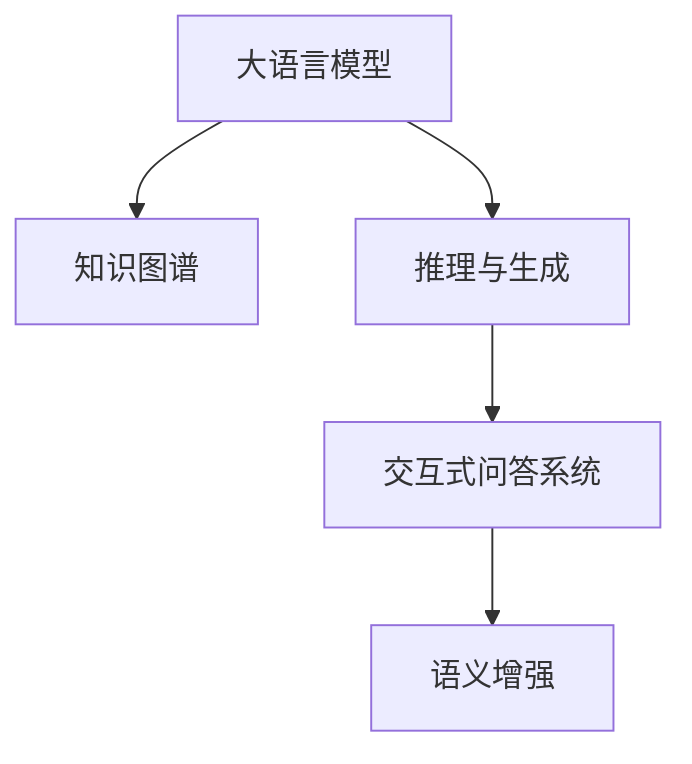

                 

# LLM的知识图谱：构建AI的认知世界

> 关键词：知识图谱,人工智能,认知智能,预训练模型,语言理解,推理与生成

## 1. 背景介绍

### 1.1 问题由来
随着人工智能(AI)技术的不断发展，大语言模型(Large Language Model, LLM)已成为当前NLP领域的明星技术。LLM通过在大规模无标签文本数据上进行预训练，获得了丰富的语言表示能力，能够进行高效的文本生成、理解、推理等任务。然而，这些模型虽然在语言知识和语法上表现优异，但在逻辑推理、常识推理、知识整合等方面仍存在显著缺陷。因此，将知识图谱(Knowledge Graph, KG)与LLM进行有效结合，成为近年来AI领域的重要研究方向。

知识图谱是一种结构化的语义知识表示方法，通过将实体、关系、属性等信息以图的形式组织，能够进行更加精确和高效的推理与生成。将知识图谱与LLM结合，利用图结构化语义信息，增强模型的认知智能，从而在复杂场景下更好地发挥作用。本文将详细介绍如何通过知识图谱构建LLM的认知世界，提升其推理与生成能力。

### 1.2 问题核心关键点
本文的核心问题是如何构建基于知识图谱的大语言模型，即如何在语言理解的基础上，引入结构化的语义信息，使得LLM能够进行更加智能的推理与生成。关键问题包括：

- 知识图谱如何与预训练模型结合？
- 如何引入图结构化信息？
- 知识图谱对模型的推理与生成能力有何提升？
- 如何在实际应用中构建、训练和使用知识图谱增强的模型？

这些问题涉及知识图谱与自然语言处理(NLP)技术的深度融合，旨在将LLM的强大语言理解能力与知识图谱的精确推理能力相结合，形成更加强大的人机交互系统。

### 1.3 问题研究意义
知识图谱与LLM的结合，将为NLP技术带来新的突破，推动认知智能技术的发展。其研究意义在于：

1. 提升LLM的推理能力。知识图谱通过结构化的语义信息，可以为LLM提供更加精确的推理依据，增强其解决复杂问题、逻辑推理的能力。
2. 扩展LLM的应用范围。知识图谱的知识库覆盖广泛，能够为LLM提供更多元的背景信息，使其能够在更多领域发挥作用。
3. 促进AI技术落地。知识图谱增强的LLM模型，能够更好地理解用户需求，提供更加智能和定制化的服务，加速AI技术的产业化进程。
4. 提高系统可解释性。知识图谱结构化的语义信息，能够帮助LLM产生更加可解释的推理过程，增强系统的透明度和可理解性。
5. 推动认知智能发展。知识图谱与LLM的结合，将提升模型的认知智能水平，为构建更高级别的认知系统提供技术支持。

## 2. 核心概念与联系

### 2.1 核心概念概述

为更好地理解知识图谱增强的LLM模型，本节将介绍几个密切相关的核心概念：

- 大语言模型(Large Language Model, LLM)：以自回归(如GPT)或自编码(如BERT)模型为代表的大规模预训练语言模型。通过在大规模无标签文本数据上进行预训练，学习通用的语言表示，具备强大的语言理解和生成能力。

- 知识图谱(Knowledge Graph, KG)：一种结构化的语义知识表示方法，通过将实体、关系、属性等信息以图的形式组织，能够进行更加精确和高效的推理与生成。

- 推理与生成：知识图谱的核心功能，即通过结构化的语义信息，进行逻辑推理和知识生成，解决复杂问题。

- 语义增强：利用知识图谱结构化的语义信息，增强LLM的语义理解能力，提升其推理与生成的效果。

- 交互式问答系统：通过LLM和知识图谱的结合，构建具有强推理与生成能力的交互式问答系统，提升用户体验和应用效果。

这些核心概念之间的逻辑关系可以通过以下Mermaid流程图来展示：



这个流程图展示了大语言模型、知识图谱、推理与生成以及交互式问答系统之间的关系：

1. 大语言模型通过预训练获得基础能力。
2. 知识图谱提供结构化的语义信息。
3. 推理与生成使得模型能够通过结构化知识进行复杂推理和生成。
4. 交互式问答系统通过LLM和知识图谱的结合，提供智能的问答服务。
5. 语义增强利用知识图谱增强LLM的语义理解，提升模型效果。

## 3. 核心算法原理 & 具体操作步骤
### 3.1 算法原理概述

知识图谱增强的LLM模型构建，本质上是一个多模态学习过程，即在语言模型的基础上，引入知识图谱结构化语义信息，提升模型在推理与生成方面的能力。其核心思想是：将预训练语言模型视为一种特征提取器，通过图结构的语义信息引导模型进行更精确的推理与生成。

形式化地，假设预训练语言模型为 $M_{\theta}$，其中 $\theta$ 为预训练得到的模型参数。给定知识图谱 $\mathcal{G}=(\mathcal{E},\mathcal{R},\mathcal{A})$，其中 $\mathcal{E}$ 为实体集，$\mathcal{R}$ 为关系集，$\mathcal{A}$ 为属性集。推理与生成任务的目标是：

- 给定输入文本 $x$，模型需从知识图谱中提取信息，推理生成答案 $y$。
- 推理过程遵循知识图谱的规则，确保生成的答案合理且符合逻辑。

### 3.2 算法步骤详解

知识图谱增强的LLM模型构建，一般包括以下几个关键步骤：

**Step 1: 准备知识图谱和预训练模型**
- 选择合适的知识图谱 $\mathcal{G}$，确保其覆盖目标领域的关键实体和关系。
- 选择合适的预训练语言模型 $M_{\theta}$，如BERT、GPT等。

**Step 2: 模型初始化**
- 在预训练模型的基础上，初始化推理与生成的模块。
- 可以添加一个图结构解码器，利用知识图谱进行推理。

**Step 3: 定义推理与生成函数**
- 定义推理与生成函数 $f: \mathcal{X} \rightarrow \mathcal{Y}$，其中 $\mathcal{X}$ 为输入文本，$\mathcal{Y}$ 为推理生成的答案。
- 函数 $f$ 应能够通过知识图谱 $\mathcal{G}$ 进行推理，生成符合逻辑的答案。

**Step 4: 微调模型**
- 使用标注数据集 $\mathcal{D}$ 对模型进行微调，最小化推理与生成误差。
- 微调时，应根据推理与生成任务的特点，选择合适的优化算法和超参数。

**Step 5: 测试与部署**
- 在测试集上评估模型性能，确保推理与生成效果符合预期。
- 使用微调后的模型对新样本进行推理与生成，集成到实际应用系统中。

### 3.3 算法优缺点

知识图谱增强的LLM模型构建，具有以下优点：
1. 提升推理能力。知识图谱提供精确的语义信息，能够增强LLM的推理与生成能力，解决复杂问题。
2. 增强知识整合。知识图谱的知识库覆盖广泛，LLM能够整合更多元化的背景信息。
3. 提升系统可解释性。知识图谱结构化的语义信息，能够帮助LLM产生更加可解释的推理过程。
4. 扩展应用范围。知识图谱增强的LLM能够应用于更多领域，提升系统的智能化水平。

同时，该方法也存在一定的局限性：
1. 知识图谱构建复杂。构建高质量的知识图谱需要大量的人力和时间，且难以覆盖所有领域。
2. 数据标注难度高。知识图谱增强的推理与生成任务，需要大量的标注数据进行微调，标注成本较高。
3. 模型可解释性不足。知识图谱增强的模型，推理过程复杂，难以完全解释。
4. 模型泛化能力有限。知识图谱结构化的信息，有时难以适应新的、未知的领域。

尽管存在这些局限性，但就目前而言，知识图谱增强的LLM模型仍是大语言模型应用的重要范式。未来相关研究的重点在于如何进一步降低知识图谱构建和微调的成本，提高模型的泛化能力，同时兼顾可解释性和鲁棒性等因素。

### 3.4 算法应用领域

知识图谱增强的LLM模型，在NLP领域已经得到了广泛的应用，覆盖了以下典型应用场景：

- 交互式问答系统：如IBM Watson、微软小冰等。通过LLM和知识图谱的结合，构建具备强推理与生成能力的问答系统。
- 知识推荐系统：如Amazon、豆瓣电影等。利用知识图谱增强的LLM模型，为用户推荐个性化内容。
- 医疗诊断系统：如IBM Watson Health、Zebra Medical Vision等。结合知识图谱增强的LLM模型，辅助医生进行疾病诊断和推荐。
- 金融智能投顾：如Robo-Advisor等。利用知识图谱增强的LLM模型，为用户提供智能化的投资建议和风险评估。
- 教育智能辅导：如Khan Academy等。结合知识图谱增强的LLM模型，为学生提供个性化的学习路径和答疑服务。

这些应用场景展示了知识图谱增强的LLM模型的广泛应用，为不同领域的智能化升级提供了新的可能性。

## 4. 数学模型和公式 & 详细讲解 & 举例说明
### 4.1 数学模型构建

知识图谱增强的LLM模型构建，涉及知识图谱、自然语言处理、推理与生成等多个领域。本节将使用数学语言对模型构建过程进行严格刻画。

记预训练语言模型为 $M_{\theta}$，其中 $\theta$ 为模型参数。假设知识图谱 $\mathcal{G}=(\mathcal{E},\mathcal{R},\mathcal{A})$，其中 $\mathcal{E}$ 为实体集，$\mathcal{R}$ 为关系集，$\mathcal{A}$ 为属性集。推理与生成任务的目标是：给定输入文本 $x$，推理生成答案 $y$。

定义模型 $M_{\theta}$ 在输入 $x$ 上的推理与生成损失函数为 $\ell(M_{\theta}(x),y)$，则在训练集 $\mathcal{D}$ 上的经验风险为：

$$
\mathcal{L}(\theta) = \frac{1}{N}\sum_{(x,y)\in\mathcal{D}} \ell(M_{\theta}(x),y)
$$

其中 $N$ 为训练集 $\mathcal{D}$ 的大小。模型的优化目标是最小化经验风险，即找到最优参数 $\theta^*$：

$$
\theta^* = \mathop{\arg\min}_{\theta} \mathcal{L}(\theta)
$$

在实践中，我们通常使用基于梯度的优化算法（如AdamW、SGD等）来近似求解上述最优化问题。设 $\eta$ 为学习率，$\lambda$ 为正则化系数，则参数的更新公式为：

$$
\theta \leftarrow \theta - \eta \nabla_{\theta}\mathcal{L}(\theta) - \eta\lambda\theta
$$

其中 $\nabla_{\theta}\mathcal{L}(\theta)$ 为损失函数对参数 $\theta$ 的梯度，可通过反向传播算法高效计算。

### 4.2 公式推导过程

以下我们以知识图谱增强的问答系统为例，推导推理与生成损失函数的计算公式。

假设模型 $M_{\theta}$ 在输入 $x$ 上的推理与生成输出为 $\hat{y}=M_{\theta}(x) \in \mathcal{Y}$，表示模型对输入文本 $x$ 的推理与生成结果。真实标签 $y \in \mathcal{Y}$，表示正确的推理与生成结果。定义推理与生成损失函数为交叉熵损失：

$$
\ell(M_{\theta}(x),y) = -y\log M_{\theta}(x) - (1-y)\log (1-M_{\theta}(x))
$$

将其代入经验风险公式，得：

$$
\mathcal{L}(\theta) = -\frac{1}{N}\sum_{(x,y)\in\mathcal{D}} [y\log M_{\theta}(x)+(1-y)\log(1-M_{\theta}(x))]
$$

根据链式法则，损失函数对参数 $\theta_k$ 的梯度为：

$$
\frac{\partial \mathcal{L}(\theta)}{\partial \theta_k} = -\frac{1}{N}\sum_{(x,y)\in\mathcal{D}} \frac{\partial}{\partial \theta_k}[\log M_{\theta}(x) - y\log (1-M_{\theta}(x))]
$$

其中 $\frac{\partial}{\partial \theta_k}[\log M_{\theta}(x)]$ 可以通过自动微分技术计算。

在得到损失函数的梯度后，即可带入参数更新公式，完成模型的迭代优化。重复上述过程直至收敛，最终得到适应推理与生成任务的模型参数 $\theta^*$。

## 5. 项目实践：代码实例和详细解释说明
### 5.1 开发环境搭建

在进行项目实践前，我们需要准备好开发环境。以下是使用Python进行PyTorch开发的环境配置流程：

1. 安装Anaconda：从官网下载并安装Anaconda，用于创建独立的Python环境。

2. 创建并激活虚拟环境：
```bash
conda create -n pytorch-env python=3.8 
conda activate pytorch-env
```

3. 安装PyTorch：根据CUDA版本，从官网获取对应的安装命令。例如：
```bash
conda install pytorch torchvision torchaudio cudatoolkit=11.1 -c pytorch -c conda-forge
```

4. 安装Transformers库：
```bash
pip install transformers
```

5. 安装各类工具包：
```bash
pip install numpy pandas scikit-learn matplotlib tqdm jupyter notebook ipython
```

完成上述步骤后，即可在`pytorch-env`环境中开始项目实践。

### 5.2 源代码详细实现

这里以知识图谱增强的问答系统为例，给出使用Transformers库对BERT模型进行微调的PyTorch代码实现。

首先，定义问答任务的数据处理函数：

```python
from transformers import BertTokenizer
from torch.utils.data import Dataset
import torch

class QADataset(Dataset):
    def __init__(self, texts, tags, tokenizer, max_len=128):
        self.texts = texts
        self.tags = tags
        self.tokenizer = tokenizer
        self.max_len = max_len
        
    def __len__(self):
        return len(self.texts)
    
    def __getitem__(self, item):
        text = self.texts[item]
        tags = self.tags[item]
        
        encoding = self.tokenizer(text, return_tensors='pt', max_length=self.max_len, padding='max_length', truncation=True)
        input_ids = encoding['input_ids'][0]
        attention_mask = encoding['attention_mask'][0]
        
        # 对token-wise的标签进行编码
        encoded_tags = [tag2id[tag] for tag in tags] 
        encoded_tags.extend([tag2id['O']] * (self.max_len - len(encoded_tags)))
        labels = torch.tensor(encoded_tags, dtype=torch.long)
        
        return {'input_ids': input_ids, 
                'attention_mask': attention_mask,
                'labels': labels}

# 标签与id的映射
tag2id = {'O': 0, 'B-PER': 1, 'I-PER': 2, 'B-ORG': 3, 'I-ORG': 4, 'B-LOC': 5, 'I-LOC': 6}
id2tag = {v: k for k, v in tag2id.items()}

# 创建dataset
tokenizer = BertTokenizer.from_pretrained('bert-base-cased')

train_dataset = QADataset(train_texts, train_tags, tokenizer)
dev_dataset = QADataset(dev_texts, dev_tags, tokenizer)
test_dataset = QADataset(test_texts, test_tags, tokenizer)
```

然后，定义模型和优化器：

```python
from transformers import BertForTokenClassification, AdamW

model = BertForTokenClassification.from_pretrained('bert-base-cased', num_labels=len(tag2id))

optimizer = AdamW(model.parameters(), lr=2e-5)
```

接着，定义训练和评估函数：

```python
from torch.utils.data import DataLoader
from tqdm import tqdm
from sklearn.metrics import classification_report

device = torch.device('cuda') if torch.cuda.is_available() else torch.device('cpu')
model.to(device)

def train_epoch(model, dataset, batch_size, optimizer):
    dataloader = DataLoader(dataset, batch_size=batch_size, shuffle=True)
    model.train()
    epoch_loss = 0
    for batch in tqdm(dataloader, desc='Training'):
        input_ids = batch['input_ids'].to(device)
        attention_mask = batch['attention_mask'].to(device)
        labels = batch['labels'].to(device)
        model.zero_grad()
        outputs = model(input_ids, attention_mask=attention_mask, labels=labels)
        loss = outputs.loss
        epoch_loss += loss.item()
        loss.backward()
        optimizer.step()
    return epoch_loss / len(dataloader)

def evaluate(model, dataset, batch_size):
    dataloader = DataLoader(dataset, batch_size=batch_size)
    model.eval()
    preds, labels = [], []
    with torch.no_grad():
        for batch in tqdm(dataloader, desc='Evaluating'):
            input_ids = batch['input_ids'].to(device)
            attention_mask = batch['attention_mask'].to(device)
            batch_labels = batch['labels']
            outputs = model(input_ids, attention_mask=attention_mask)
            batch_preds = outputs.logits.argmax(dim=2).to('cpu').tolist()
            batch_labels = batch_labels.to('cpu').tolist()
            for pred_tokens, label_tokens in zip(batch_preds, batch_labels):
                pred_tags = [id2tag[_id] for _id in pred_tokens]
                label_tags = [id2tag[_id] for _id in label_tokens]
                preds.append(pred_tags[:len(label_tags)])
                labels.append(label_tags)
                
    print(classification_report(labels, preds))
```

最后，启动训练流程并在测试集上评估：

```python
epochs = 5
batch_size = 16

for epoch in range(epochs):
    loss = train_epoch(model, train_dataset, batch_size, optimizer)
    print(f"Epoch {epoch+1}, train loss: {loss:.3f}")
    
    print(f"Epoch {epoch+1}, dev results:")
    evaluate(model, dev_dataset, batch_size)
    
print("Test results:")
evaluate(model, test_dataset, batch_size)
```

以上就是使用PyTorch对BERT进行知识图谱增强的问答系统微调的完整代码实现。可以看到，得益于Transformers库的强大封装，我们可以用相对简洁的代码完成BERT模型的加载和微调。

### 5.3 代码解读与分析

让我们再详细解读一下关键代码的实现细节：

**QADataset类**：
- `__init__`方法：初始化文本、标签、分词器等关键组件。
- `__len__`方法：返回数据集的样本数量。
- `__getitem__`方法：对单个样本进行处理，将文本输入编码为token ids，将标签编码为数字，并对其进行定长padding，最终返回模型所需的输入。

**tag2id和id2tag字典**：
- 定义了标签与数字id之间的映射关系，用于将token-wise的预测结果解码回真实的标签。

**训练和评估函数**：
- 使用PyTorch的DataLoader对数据集进行批次化加载，供模型训练和推理使用。
- 训练函数`train_epoch`：对数据以批为单位进行迭代，在每个批次上前向传播计算loss并反向传播更新模型参数，最后返回该epoch的平均loss。
- 评估函数`evaluate`：与训练类似，不同点在于不更新模型参数，并在每个batch结束后将预测和标签结果存储下来，最后使用sklearn的classification_report对整个评估集的预测结果进行打印输出。

**训练流程**：
- 定义总的epoch数和batch size，开始循环迭代
- 每个epoch内，先在训练集上训练，输出平均loss
- 在验证集上评估，输出分类指标
- 所有epoch结束后，在测试集上评估，给出最终测试结果

可以看到，PyTorch配合Transformers库使得BERT微调的代码实现变得简洁高效。开发者可以将更多精力放在数据处理、模型改进等高层逻辑上，而不必过多关注底层的实现细节。

当然，工业级的系统实现还需考虑更多因素，如模型的保存和部署、超参数的自动搜索、更灵活的任务适配层等。但核心的微调范式基本与此类似。

## 6. 实际应用场景
### 6.1 交互式问答系统

基于知识图谱增强的问答系统，可以广泛应用于智能客服、金融咨询、医疗诊断等领域。传统问答系统依赖人工知识库和规则库，更新维护成本高，难以覆盖所有领域。利用知识图谱增强的LLM模型，可以动态构建知识库，提升系统的智能水平。

在技术实现上，可以收集领域相关的知识信息，构建结构化的知识图谱，将知识图谱与LLM模型结合。微调后的模型能够自动理解用户提问，通过推理与生成，从知识图谱中抽取信息，给出精准的回复。对于用户提出的新问题，还可以动态检索知识图谱，生成动态的回复结果。

### 6.2 知识推荐系统

知识推荐系统通过用户的浏览、点击、评分等行为数据，为用户推荐感兴趣的内容。传统推荐系统依赖用户历史数据进行推荐，难以覆盖用户的潜在兴趣。利用知识图谱增强的LLM模型，可以整合更多元化的背景信息，进行更加精准的推荐。

具体而言，可以将用户行为数据、物品描述、标签等信息构建知识图谱，将其与LLM模型结合。微调后的模型能够从图谱中提取用户兴趣和物品属性信息，生成个性化的推荐结果。对于新物品，还可以利用知识图谱进行推理，生成可能的推荐标签，提高推荐效果。

### 6.3 医疗智能诊断

医学领域知识复杂，传统医生诊断依赖经验丰富的专家。利用知识图谱增强的LLM模型，可以为医生提供智能化的辅助诊断工具。

在技术实现上，可以构建医学知识图谱，整合医学教材、文献、病例等信息。微调后的模型能够理解病人的症状描述，通过推理与生成，从知识图谱中抽取相关疾病信息，生成可能的诊断结果。对于疑难病例，还可以结合专家知识库，进行多重推理，提高诊断的准确性和全面性。

### 6.4 未来应用展望

随着知识图谱与LLM的深度结合，基于知识图谱增强的LLM模型将有望在更多领域发挥作用，为智能化升级带来新的可能性。

在智慧城市治理中，知识图谱增强的LLM模型可以用于城市事件监测、舆情分析、应急指挥等环节，提高城市管理的自动化和智能化水平。在金融智能投顾、教育智能辅导等领域，知识图谱增强的LLM模型也能够提供更加个性化、智能化的服务，提升用户体验和应用效果。

此外，知识图谱增强的LLM模型在企业决策支持、科学研究、安全监控等众多领域，也有广泛的应用前景。相信随着技术的发展，知识图谱与LLM的结合将带来更多的创新，推动智能技术的落地应用。

## 7. 工具和资源推荐
### 7.1 学习资源推荐

为了帮助开发者系统掌握知识图谱增强的LLM模型的理论基础和实践技巧，这里推荐一些优质的学习资源：

1. 《图网络与知识图谱》系列博文：由大模型技术专家撰写，深入浅出地介绍了图网络、知识图谱的基本概念和应用场景。

2. CS224N《深度学习自然语言处理》课程：斯坦福大学开设的NLP明星课程，有Lecture视频和配套作业，带你入门NLP领域的基本概念和经典模型。

3. 《Knowledge-Driven Neural Networks for Natural Language Processing》书籍：专注于知识图谱增强的NLP研究，介绍如何利用知识图谱提升LLM模型的性能。

4. Graph Neural Network in NLP、KG与LLM论文：重点关注如何将图网络、知识图谱与LLM模型结合，提升模型的推理与生成能力。

5. Zaimo项目：开源的基于知识图谱的问答系统，展示了知识图谱增强的LLM模型的实际应用。

通过对这些资源的学习实践，相信你一定能够快速掌握知识图谱增强的LLM模型的精髓，并用于解决实际的NLP问题。
###  7.2 开发工具推荐

高效的开发离不开优秀的工具支持。以下是几款用于知识图谱增强的LLM模型开发的常用工具：

1. PyTorch：基于Python的开源深度学习框架，灵活动态的计算图，适合快速迭代研究。大部分预训练语言模型都有PyTorch版本的实现。

2. TensorFlow：由Google主导开发的开源深度学习框架，生产部署方便，适合大规模工程应用。同样有丰富的预训练语言模型资源。

3. Transformers库：HuggingFace开发的NLP工具库，集成了众多SOTA语言模型，支持PyTorch和TensorFlow，是进行LLM模型微调和推理的利器。

4. Gensim：开源的自然语言处理库，提供高效的图结构和知识图谱构建工具，能够快速构建知识图谱。

5. Neo4j：开源的图形数据库，支持大规模的图结构存储和查询，适合构建复杂知识图谱。

6. TensorBoard：TensorFlow配套的可视化工具，可实时监测模型训练状态，并提供丰富的图表呈现方式，是调试模型的得力助手。

合理利用这些工具，可以显著提升知识图谱增强的LLM模型的开发效率，加快创新迭代的步伐。

### 7.3 相关论文推荐

知识图谱与LLM的结合，涉及自然语言处理、图网络、认知智能等多个前沿领域。以下是几篇奠基性的相关论文，推荐阅读：

1. "The Graph Neural Network Approach to Generalizing Over Conceptual Knowledge"：提出图网络(GNN)方法，将知识图谱与深度学习结合，提升模型的推理能力。

2. "Knowledge-Enhanced Neural Networks for Question Answering"：介绍如何利用知识图谱增强的LLM模型，构建智能问答系统。

3. "A Survey on Knowledge Graphs for Question Answering"：综述了知识图谱在问答系统中的应用，包括LLM模型、推理与生成等关键技术。

4. "Leveraging Knowledge Graphs for Query Answering: A Survey"：详细介绍了知识图谱在查询与推理中的应用，涵盖图结构、推理算法等技术。

5. "Knowledge Graph Neural Networks: A Survey"：介绍图网络在知识图谱中的应用，涵盖GNN模型、推理算法等技术。

这些论文代表了大语言模型与知识图谱结合的研究脉络。通过学习这些前沿成果，可以帮助研究者把握学科前进方向，激发更多的创新灵感。

## 8. 总结：未来发展趋势与挑战
### 8.1 总结

本文对知识图谱增强的LLM模型构建过程进行了全面系统的介绍。首先阐述了知识图谱与LLM结合的背景和意义，明确了推理与生成任务的核心问题。其次，从原理到实践，详细讲解了模型的构建过程，包括数据准备、模型初始化、推理与生成函数定义、微调等关键步骤，给出了完整的代码实现。同时，本文还广泛探讨了知识图谱增强的LLM模型在多个领域的实际应用，展示了其广阔的应用前景。此外，本文精选了知识图谱与LLM结合的各类学习资源，力求为读者提供全方位的技术指引。

通过本文的系统梳理，可以看到，知识图谱与LLM的结合，将为NLP技术带来新的突破，推动认知智能技术的发展。受益于知识图谱结构化语义信息的引入，LLM模型能够进行更加智能的推理与生成，解决复杂问题，提升系统的智能化水平。

### 8.2 未来发展趋势

展望未来，知识图谱增强的LLM模型将呈现以下几个发展趋势：

1. 推理能力提升。知识图谱结构化的语义信息，能够显著提升LLM模型的推理能力，解决复杂问题，提供精准的推理结果。

2. 多模态融合。结合知识图谱与图像、语音等多模态数据，增强LLM模型的信息整合能力，提升模型的综合性能。

3. 跨领域知识整合。知识图谱覆盖广泛，能够整合不同领域的知识，提升LLM模型的通用性和泛化能力。

4. 实时推理与生成。利用流式推理与生成技术，实现知识图谱增强的LLM模型实时处理输入，提供动态的推理与生成结果。

5. 可解释性增强。知识图谱结构化的语义信息，能够帮助LLM模型产生更加可解释的推理过程，增强系统的透明度和可理解性。

6. 模型优化与加速。优化模型结构，利用高效推理算法，提升知识图谱增强的LLM模型的计算速度和效率。

以上趋势凸显了知识图谱增强的LLM模型的广阔前景。这些方向的探索发展，必将进一步提升LLM模型的推理与生成能力，为系统智能化升级提供更强大的技术支持。

### 8.3 面临的挑战

尽管知识图谱增强的LLM模型已经取得了瞩目成就，但在迈向更加智能化、普适化应用的过程中，仍面临诸多挑战：

1. 知识图谱构建复杂。构建高质量的知识图谱需要大量的人力和时间，且难以覆盖所有领域。

2. 数据标注难度高。知识图谱增强的推理与生成任务，需要大量的标注数据进行微调，标注成本较高。

3. 模型可解释性不足。知识图谱增强的模型，推理过程复杂，难以完全解释。

4. 模型泛化能力有限。知识图谱结构化的信息，有时难以适应新的、未知的领域。

5. 计算资源消耗大。知识图谱结构化信息的引入，使得模型计算复杂度增大，需要更多的计算资源。

尽管存在这些局限性，但就目前而言，知识图谱增强的LLM模型仍是大语言模型应用的重要范式。未来相关研究的重点在于如何进一步降低知识图谱构建和微调的成本，提高模型的泛化能力，同时兼顾可解释性和鲁棒性等因素。

### 8.4 研究展望

面对知识图谱增强的LLM模型所面临的挑战，未来的研究需要在以下几个方面寻求新的突破：

1. 探索无监督和半监督推理与生成方法。摆脱对大规模标注数据的依赖，利用自监督学习、主动学习等无监督和半监督范式，最大限度利用非结构化数据，实现更加灵活高效的推理与生成。

2. 研究高效推理与生成算法。开发更加高效的推理与生成算法，在保证推理效果的同时，减少计算资源的消耗。

3. 引入更多先验知识。将符号化的先验知识，如知识图谱、逻辑规则等，与神经网络模型进行巧妙融合，引导知识图谱增强的LLM模型学习更准确、合理的语言模型。

4. 结合因果分析和博弈论工具。将因果分析方法引入知识图谱增强的LLM模型，识别出模型决策的关键特征，增强输出解释的因果性和逻辑性。借助博弈论工具刻画人机交互过程，主动探索并规避模型的脆弱点，提高系统稳定性。

5. 纳入伦理道德约束。在模型训练目标中引入伦理导向的评估指标，过滤和惩罚有偏见、有害的输出倾向。同时加强人工干预和审核，建立模型行为的监管机制，确保输出符合人类价值观和伦理道德。

这些研究方向的探索，必将引领知识图谱与LLM的结合技术迈向更高的台阶，为构建安全、可靠、可解释、可控的智能系统铺平道路。面向未来，知识图谱与LLM的结合技术还需要与其他人工智能技术进行更深入的融合，如知识表示、因果推理、强化学习等，多路径协同发力，共同推动自然语言理解和智能交互系统的进步。只有勇于创新、敢于突破，才能不断拓展知识图谱增强的LLM模型的边界，让智能技术更好地造福人类社会。

## 9. 附录：常见问题与解答

**Q1：如何构建高质量的知识图谱？**

A: 构建高质量的知识图谱，需要多学科的协作，涵盖领域专家、数据工程师、知识图谱专家等。具体步骤包括：

1. 领域调研：了解领域知识结构和关键实体关系，确定图谱的覆盖范围和粒度。
2. 数据收集：从文献、网页、数据库等多种渠道收集相关数据，构建实体、关系、属性等基本元素。
3. 数据清洗：对收集的数据进行去重、格式化、缺失值填充等处理，确保数据质量。
4. 知识抽取：利用自然语言处理技术，从文本中提取实体和关系，构建知识图谱。
5. 图谱构建：使用图结构表示工具，将实体、关系、属性等信息组织成图谱。
6. 验证与评估：对构建的知识图谱进行验证和评估，确保其准确性和完备性。

通过以上步骤，可以构建高质量的知识图谱，为知识图谱增强的LLM模型提供可靠的推理与生成基础。

**Q2：如何利用知识图谱增强的LLM模型进行推理与生成？**

A: 利用知识图谱增强的LLM模型进行推理与生成，主要涉及以下关键步骤：

1. 模型初始化：在预训练模型的基础上，初始化推理与生成的模块，如图结构解码器。
2. 图谱嵌入：将知识图谱嵌入到预训练模型中，形成知识-语言融合的模型。
3. 推理与生成函数定义：定义推理与生成函数，实现从图谱中提取信息，进行推理与生成。
4. 模型微调：使用标注数据对模型进行微调，优化推理与生成效果。
5. 推理与生成：将输入文本输入模型，通过推理与生成函数，从知识图谱中抽取信息，生成推理与生成结果。

通过以上步骤，可以实现知识图谱增强的LLM模型在推理与生成任务中的高效应用。

**Q3：知识图谱增强的LLM模型在实际应用中需要注意哪些问题？**

A: 知识图谱增强的LLM模型在实际应用中，需要注意以下关键问题：

1. 数据标注成本高：推理与生成任务需要大量的标注数据进行微调，标注成本较高。应考虑利用半监督、主动学习等方法，降低数据标注需求。
2. 模型计算资源消耗大：知识图谱结构化信息的引入，使得模型计算复杂度增大。应考虑优化模型结构，提升推理与生成效率。
3. 模型泛化能力有限：知识图谱结构化的信息，有时难以适应新的、未知的领域。应考虑引入更多先验知识，增强模型的泛化能力。
4. 推理过程复杂：知识图谱结构化信息的引入，使得推理过程复杂，难以完全解释。应考虑增强模型的可解释性，提供透明化的推理过程。
5. 模型安全性问题：知识图谱增强的LLM模型可能引入外部知识，存在安全隐患。应考虑模型的安全性，避免有害知识的传播。

通过以上措施，可以最大限度地发挥知识图谱增强的LLM模型的优势，减少应用中的风险和成本。

**Q4：如何优化知识图谱增强的LLM模型的推理与生成效果？**

A: 优化知识图谱增强的LLM模型的推理与生成效果，可以从以下几个方面入手：

1. 数据增强：通过回译、近义替换等方式扩充训练集，增强模型的泛化能力。
2. 正则化技术：应用L2正则、Dropout、Early Stopping等正则化技术，防止模型过度适应训练集。
3. 对抗训练：引入对抗样本，提高模型的鲁棒性，减少推理过程中的误差。
4. 参数高效微调：采用参数高效微调方法，如Adapter、Prefix等，减少微调参数，提升模型性能。
5. 推理与生成算法优化：研究高效的推理与生成算法，如Transformer解码器、图网络等，提升推理与生成效率。

通过以上措施，可以显著提升知识图谱增强的LLM模型的推理与生成效果，增强系统的智能化水平。

**Q5：知识图谱增强的LLM模型在实际应用中如何部署？**

A: 知识图谱增强的LLM模型在实际应用中，需要考虑以下关键问题：

1. 模型裁剪：去除不必要的层和参数，减小模型尺寸，加快推理速度。
2. 量化加速：将浮点模型转为定点模型，压缩存储空间，提高计算效率。
3. 服务化封装：将模型封装为标准化服务接口，便于集成调用。
4. 弹性伸缩：根据请求流量动态调整资源配置，平衡服务质量和成本。
5. 监控告警：实时采集系统指标，设置异常告警阈值，确保服务稳定性。

通过以上措施，可以确保知识图谱增强的LLM模型在实际应用中能够高效、稳定地运行。

---

作者：禅与计算机程序设计艺术 / Zen and the Art of Computer Programming

