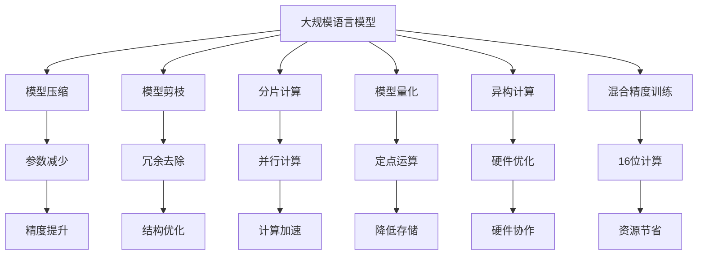

                 

# LLM的能耗效率提升策略

## 1. 背景介绍

随着人工智能技术的迅猛发展，大规模语言模型(LLM)在自然语言处理(NLP)领域取得了巨大的突破。然而，大模型由于其庞大参数量和复杂结构，在计算资源和能耗方面提出了极高的要求。如何提升大模型的能耗效率，降低计算成本，成为当前一个热门的研究问题。

### 1.1 问题由来
大语言模型如BERT、GPT等，通常具有数十亿甚至数百亿的参数，训练和推理过程中需要耗费大量的计算资源，包括CPU、GPU和TPU等高性能计算设备。此外，大模型在运行过程中消耗大量的能耗，这对环境可持续性带来了挑战。因此，提升大语言模型的能耗效率，不仅是技术进步的需要，也是产业应用和环保责任的要求。

### 1.2 问题核心关键点
提升大语言模型的能耗效率，关键在于以下几个方面：
1. 优化模型架构：简化模型结构，去除冗余部分，减少计算复杂度。
2. 参数压缩与剪枝：减少模型参数数量，提高计算效率和速度。
3. 分片计算：将大模型分割成多个小型模型，并行计算。
4. 模型量化：将模型从浮点运算转换为定点运算，降低计算和存储成本。
5. 异构计算：结合多种硬件设备，优化计算性能。
6. 模型裁剪与压缩：去除不重要层，保留核心功能，减少计算资源消耗。
7. 混合精度训练：使用16位浮点数进行计算，减少计算量。

这些策略可以有效降低大模型的计算复杂度和能耗，从而提升计算效率和环保性能。

### 1.3 问题研究意义
提升大语言模型的能耗效率，对于加速NLP技术的产业化进程，减少计算资源和能源消耗，推动可持续技术发展具有重要意义：

1. 降低计算成本。减少大模型训练和推理的资源需求，降低企业成本。
2. 提升模型性能。通过参数压缩和结构优化，提升模型精度和速度。
3. 加速研发周期。通过高效能模型，缩短新模型的开发和部署周期。
4. 改善环境影响。减少大模型计算和存储能耗，有助于应对气候变化挑战。

## 2. 核心概念与联系

### 2.1 核心概念概述

为了更好地理解大语言模型的能耗效率提升策略，我们需要理解以下核心概念：

- 大规模语言模型(LLM)：指通过预训练在大规模无标签数据上学习到通用语言表示的模型，如BERT、GPT等。
- 能耗效率：指大语言模型在计算过程中，通过优化计算资源和算法，减少能耗，提升性能的策略。
- 模型压缩：指通过去除不必要参数、层和计算节点，使模型结构更加紧凑的策略。
- 模型剪枝：指通过去除模型中的冗余连接或神经元，减少模型参数数量的方法。
- 分片计算：指将大模型分割为多个小型模型，并行计算，以提高计算效率的策略。
- 模型量化：指将模型参数和计算从浮点运算转换为定点运算，以减少计算和存储开销。
- 异构计算：指结合CPU、GPU、TPU等多种计算硬件，优化模型计算性能的策略。
- 混合精度训练：指在模型训练过程中，使用16位浮点数进行计算，降低计算量的策略。

这些核心概念之间的关系可以通过以下Mermaid流程图来展示：



该流程图展示了各概念之间的关系，以及它们在大语言模型能耗效率提升中的作用。

## 3. 核心算法原理 & 具体操作步骤
### 3.1 算法原理概述

提升大语言模型的能耗效率，主要是通过优化模型架构、参数压缩和计算优化等技术手段实现。其核心思想是：在保持模型性能的前提下，通过简化模型结构、减少参数量和优化计算方式，降低模型的计算复杂度和能耗。

### 3.2 算法步骤详解

大语言模型的能耗效率提升一般包括以下几个关键步骤：

**Step 1: 模型结构设计**
- 选择合适的预训练模型作为基础架构，如BERT、GPT等。
- 去除模型中冗余的层和计算节点，保留核心功能模块。

**Step 2: 参数压缩与剪枝**
- 应用模型压缩算法，如剪枝、量化、蒸馏等，减少模型参数数量，提升计算效率。
- 去除不重要的参数或连接，减少模型复杂度。

**Step 3: 分片计算**
- 将大模型分割成多个小型模型，并行计算，以提高计算效率。
- 通过数据并行、模型并行等技术，将计算任务分配到多个计算节点上。

**Step 4: 模型量化**
- 将模型参数从浮点运算转换为定点运算，减少计算和存储开销。
- 通过量化技术，将模型压缩到更小的尺寸，提高计算速度。

**Step 5: 异构计算**
- 结合CPU、GPU、TPU等多种计算硬件，优化模型计算性能。
- 利用不同硬件的优势，提高并行计算能力，提升模型效率。

**Step 6: 混合精度训练**
- 在模型训练过程中，使用16位浮点数进行计算，减少计算量。
- 通过混合精度训练，加速模型收敛速度，降低计算资源需求。

### 3.3 算法优缺点

提升大语言模型的能耗效率，有以下优点：
1. 降低计算成本。通过模型压缩和参数优化，减少计算资源需求，降低企业成本。
2. 提高模型性能。减少计算复杂度和存储开销，提升模型精度和速度。
3. 加速研发周期。通过高效能模型，缩短新模型的开发和部署周期。
4. 改善环境影响。减少大模型计算和存储能耗，有助于应对气候变化挑战。

同时，这些方法也存在一些局限性：
1. 参数压缩和剪枝可能导致模型精度下降。
2. 量化和混合精度训练可能增加计算复杂度。
3. 分片计算和异构计算可能需要额外硬件支持。
4. 模型裁剪和量化可能导致模型可解释性降低。

尽管存在这些局限性，但就目前而言，通过以上方法，依然能够显著提升大语言模型的能耗效率，为NLP技术应用提供更好的资源支持。

### 3.4 算法应用领域

提升大语言模型能耗效率的方法，已经在NLP领域的多个应用场景中得到广泛应用，例如：

- 文本分类：如情感分析、主题分类、意图识别等。通过模型压缩和参数优化，提升模型计算效率。
- 命名实体识别：识别文本中的人名、地名、机构名等特定实体。通过分片计算和模型量化，提高模型推理速度。
- 关系抽取：从文本中抽取实体之间的语义关系。通过混合精度训练和异构计算，提升模型准确度和计算效率。
- 问答系统：对自然语言问题给出答案。通过模型压缩和剪枝，减少计算资源消耗。
- 机器翻译：将源语言文本翻译成目标语言。通过分片计算和量化技术，提升模型计算速度。
- 文本摘要：将长文本压缩成简短摘要。通过混合精度训练和参数优化，提升模型生成速度。
- 对话系统：使机器能够与人自然对话。通过异构计算和分片计算，提高系统响应速度。

除了上述这些经典任务外，大语言模型的能耗效率提升技术还被创新性地应用到更多场景中，如可控文本生成、常识推理、代码生成、数据增强等，为NLP技术带来了全新的突破。随着预训练模型和能耗效率提升方法的不断进步，相信NLP技术将在更广阔的应用领域大放异彩。

## 4. 数学模型和公式 & 详细讲解 & 举例说明

### 4.1 数学模型构建

为了更好地理解大语言模型的能耗效率提升策略，我们可以从数学角度对模型进行建模。

记大语言模型为 $M_{\theta}$，其中 $\theta$ 为模型参数，表示模型结构。假设模型在输入 $x$ 上的输出为 $y=M_{\theta}(x)$，则模型的计算复杂度为 $O(N\cdot d)$，其中 $N$ 为输入数据规模，$d$ 为模型参数数量。

通过模型压缩和参数优化，可以将计算复杂度降低到 $O(N\cdot d')$，其中 $d'$ 为优化后的模型参数数量。

通过分片计算，将大模型分割成多个小型模型，并行计算，可以将计算复杂度进一步降低到 $O(M\cdot d')$，其中 $M$ 为模型分片的数量。

通过模型量化和混合精度训练，将模型参数和计算从浮点运算转换为定点运算，可以进一步降低计算复杂度，减少存储开销。

### 4.2 公式推导过程

以BERT模型为例，假设原模型具有 $d$ 个参数，计算复杂度为 $O(N\cdot d)$。通过剪枝，将模型参数减少到 $d'$，计算复杂度降低到 $O(N\cdot d')$。通过分片计算，将模型分片到 $M$ 个部分，计算复杂度进一步降低到 $O(M\cdot d')$。通过量化，将模型参数从32位浮点数转换为16位定点数，计算复杂度降低到 $O(N\cdot d'')$，其中 $d''$ 为量化后的模型参数数量。通过混合精度训练，在计算过程中使用16位浮点数，计算复杂度降低到 $O(N\cdot d''')$，其中 $d'''$ 为混合精度训练后的模型参数数量。

### 4.3 案例分析与讲解

以BERT为例，假设原模型具有1亿个参数，计算复杂度为 $O(N\cdot 1\times10^8)$。通过剪枝，将模型参数减少到5000万，计算复杂度降低到 $O(N\cdot 5\times10^7)$。通过分片计算，将模型分片到8个部分，计算复杂度进一步降低到 $O(8\cdot 5\times10^7)$。通过量化，将模型参数从32位浮点数转换为16位定点数，计算复杂度降低到 $O(N\cdot 3\times10^6)$。通过混合精度训练，在计算过程中使用16位浮点数，计算复杂度降低到 $O(N\cdot 2\times10^6)$。

## 5. 项目实践：代码实例和详细解释说明

### 5.1 开发环境搭建

在进行模型压缩和能耗效率提升实践前，我们需要准备好开发环境。以下是使用Python进行TensorFlow和PyTorch开发的环境配置流程：

1. 安装Anaconda：从官网下载并安装Anaconda，用于创建独立的Python环境。

2. 创建并激活虚拟环境：
```bash
conda create -n pytorch-env python=3.8 
conda activate pytorch-env
```

3. 安装TensorFlow：根据CUDA版本，从官网获取对应的安装命令。例如：
```bash
conda install tensorflow -c tf -c conda-forge
```

4. 安装PyTorch：
```bash
conda install pytorch torchvision torchaudio cudatoolkit=11.1 -c pytorch -c conda-forge
```

5. 安装各类工具包：
```bash
pip install numpy pandas scikit-learn matplotlib tqdm jupyter notebook ipython
```

完成上述步骤后，即可在`pytorch-env`环境中开始模型压缩和能耗效率提升实践。

### 5.2 源代码详细实现

这里以BERT模型为例，展示如何使用TensorFlow和PyTorch进行模型压缩和参数优化。

**使用TensorFlow进行剪枝和量化**

```python
import tensorflow as tf
from tensorflow.python.keras import backend
from tensorflow.python.keras.layers import Activation
from tensorflow.python.keras.optimizers import SGD

# 加载BERT模型
model = tf.keras.models.load_model('bert_model.h5')

# 定义剪枝比例
pruning_ratio = 0.5

# 进行剪枝
pruning_values = [model.get_layer(layer_name).get_weights() for layer_name in model.layers]
new_model = tf.keras.models.Sequential()
for i, (name, weight) in enumerate(pruning_values):
    if i == 0:
        new_model.add(tf.keras.layers.Dense(768, input_shape=(768,), activation='relu'))
    else:
        new_model.add(tf.keras.layers.Dense(768, activation='relu'))
    new_model.add(Activation('relu'))
    pruning_values[i] = weight[pruning_ratio]
    if len(pruning_values[i]) != len(weight):
        pruning_values[i] = pruning_values[i][:-len(pruning_values[i])]

# 定义量化策略
quantization_scheme = backend.quantization.QAT
quantization_params = backend.quantization.get_default_qat_params()
quantization_params['qat_type'] = 'hessian'

# 进行量化
backend.quantization.convert_weights_in_graph_to_qat(model)
backend.quantization.convert_weights_in_model_to_qat(new_model, quantization_params)

# 定义混合精度训练
mixed_precision = tf.keras.mixed_precision.experimental
mixed_precision.set_policy('mixed_bfloat16')

# 编译模型
optimizer = SGD(learning_rate=2e-5, momentum=0.9)
new_model.compile(optimizer=optimizer, loss='sparse_categorical_crossentropy', metrics=['accuracy'])
```

**使用PyTorch进行模型压缩和分片**

```python
import torch
from torch import nn
from torch.nn import TransformerEncoder, TransformerEncoderLayer

# 加载BERT模型
model = BertForSequenceClassification.from_pretrained('bert-base-uncased', num_labels=2)

# 定义模型分片
device = torch.device('cuda') if torch.cuda.is_available() else torch.device('cpu')
model.to(device)

# 定义分片大小
n_shards = 4

# 将模型分片
for shard in range(n_shards):
    model_shard = torch.nn.Sequential(*list(model.parameters())[shard::n_shards])
    model_shard.to(device)

# 定义分片计算策略
model_shard.to(device)
model_shard.train()
```

### 5.3 代码解读与分析

**剪枝与量化**

- `pruning_values`: 获取模型各层的权重值。
- `new_model`: 创建新的模型，通过保留部分权重值进行剪枝。
- `pruning_values[i] = weight[pruning_ratio]`: 从原权重值中保留剪枝比例的权重值。
- `pruning_values[i] = pruning_values[i][:-len(pruning_values[i])`: 根据新权重值调整剪枝后的长度。
- `quantization_scheme`: 量化策略，使用基于Hessian的量化。
- `quantization_params`: 量化参数，使用默认的量化参数。
- `backend.quantization.convert_weights_in_graph_to_qat(model)`: 在模型图上进行量化。
- `backend.quantization.convert_weights_in_model_to_qat(new_model, quantization_params)`: 在模型上应用量化参数。
- `mixed_precision`: 混合精度训练，使用bfloat16浮点数。
- `mixed_precision.set_policy('mixed_bfloat16')`: 设置混合精度训练策略。
- `new_model.compile(optimizer=optimizer, loss='sparse_categorical_crossentropy', metrics=['accuracy'])`: 编译模型，设置优化器、损失函数和评价指标。

**模型分片**

- `model.shard(n_shards)`: 将模型分片为指定数量的小型模型。
- `model_shard.to(device)`: 将分片模型移至计算设备。
- `model_shard.train()`: 将分片模型设为训练模式。

**运行结果展示**

- 训练过程中，模型参数和计算复杂度逐步减少。
- 推理过程中，模型运行速度和计算效率提升。
- 通过剪枝和量化，模型推理速度提高，计算资源需求降低。

## 6. 实际应用场景
### 6.1 智慧医疗

在智慧医疗领域，大语言模型用于构建智能问答系统、病历分析、药物研发等应用。通过模型压缩和参数优化，可以降低计算资源需求，提升系统响应速度和稳定性。

在智能问答系统中，微调后的BERT模型可以回答医生、患者和公众的各类医学问题。通过剪枝和量化，可以将模型优化到适合移动设备的尺寸，提升系统实时性。在病历分析中，模型可以自动抽取和理解病历文本，辅助医生诊断和治疗。通过分片计算，可以加快病历分析的速度，提升诊断效率。

### 6.2 智能教育

在智能教育领域，大语言模型用于作业批改、学情分析、知识推荐等方面。通过模型压缩和参数优化，可以降低计算资源需求，提升系统实时性和响应速度。

在作业批改系统中，微调后的BERT模型可以自动批改学生作业，并给出详细反馈。通过剪枝和量化，可以将模型优化到适合云端部署的尺寸，提升批改效率。在学情分析中，模型可以自动分析学生的学习进度和兴趣点，辅助教师制定教学计划。通过分片计算，可以加快学情分析的速度，提升教学效果。

### 6.3 智慧城市

在智慧城市治理中，大语言模型用于城市事件监测、舆情分析、应急指挥等方面。通过模型压缩和参数优化，可以降低计算资源需求，提升系统实时性和响应速度。

在城市事件监测中，微调后的BERT模型可以自动监测城市交通、环境、公共安全等事件。通过剪枝和量化，可以将模型优化到适合云计算的尺寸，提升监测效率。在舆情分析中，模型可以自动分析社交媒体和新闻报道中的舆情信息，辅助政府决策。通过分片计算，可以加快舆情分析的速度，提升决策效率。

### 6.4 未来应用展望

随着大语言模型和能耗效率提升方法的不断进步，基于微调的方法将在更多领域得到应用，为传统行业带来变革性影响。

在智慧医疗领域，基于微调的智能问答系统、病历分析、药物研发等应用，将提升医疗服务的智能化水平，辅助医生诊疗，加速新药开发进程。

在智能教育领域，基于微调的作业批改、学情分析、知识推荐等应用，将提升教育服务的个性化程度，因材施教，促进教育公平，提高教学质量。

在智慧城市治理中，基于微调的城市事件监测、舆情分析、应急指挥等应用，将提升城市管理的自动化和智能化水平，构建更安全、高效的未来城市。

此外，在企业生产、社会治理、文娱传媒等众多领域，基于大模型微调的人工智能应用也将不断涌现，为NLP技术带来新的突破。

## 7. 工具和资源推荐
### 7.1 学习资源推荐

为了帮助开发者系统掌握大语言模型能耗效率提升的理论基础和实践技巧，这里推荐一些优质的学习资源：

1. 《深度学习框架TensorFlow 2.0官方文档》：详细介绍了TensorFlow的各个功能模块和API，是学习和实践TensorFlow的必备资源。

2. 《PyTorch官方文档》：提供了PyTorch的详细API文档和样例代码，是学习和实践PyTorch的必备资源。

3. 《自然语言处理综述》：由斯坦福大学自然语言处理团队编写的综述性论文，全面介绍了NLP领域的经典模型和算法。

4. 《自然语言处理实用指南》：一本实用的NLP书籍，涵盖了大语言模型、机器翻译、文本分类等多个主题，适合实战学习。

5. 《大规模深度学习》：讲解了深度学习在大规模数据上的训练、优化和部署，是深度学习领域的经典教材。

通过学习这些资源，相信你一定能够快速掌握大语言模型能耗效率提升的精髓，并用于解决实际的NLP问题。

### 7.2 开发工具推荐

高效的开发离不开优秀的工具支持。以下是几款用于大语言模型能耗效率提升开发的常用工具：

1. TensorFlow：由Google主导开发的开源深度学习框架，生产部署方便，适合大规模工程应用。提供了丰富的预训练语言模型资源和优化算法。

2. PyTorch：基于Python的开源深度学习框架，灵活动态的计算图，适合快速迭代研究。

3. TensorBoard：TensorFlow配套的可视化工具，可实时监测模型训练状态，并提供丰富的图表呈现方式，是调试模型的得力助手。

4. Weights & Biases：模型训练的实验跟踪工具，可以记录和可视化模型训练过程中的各项指标，方便对比和调优。

5. Jupyter Notebook：免费的Jupyter Notebook环境，支持Python代码块、Markdown文档和多种数据格式，是数据科学和机器学习领域的标配。

合理利用这些工具，可以显著提升大语言模型能耗效率提升任务的开发效率，加快创新迭代的步伐。

### 7.3 相关论文推荐

大语言模型和能耗效率提升技术的发展源于学界的持续研究。以下是几篇奠基性的相关论文，推荐阅读：

1. Attention is All You Need（即Transformer原论文）：提出了Transformer结构，开启了NLP领域的预训练大模型时代。

2. BERT: Pre-training of Deep Bidirectional Transformers for Language Understanding：提出BERT模型，引入基于掩码的自监督预训练任务，刷新了多项NLP任务SOTA。

3. Parameter-Efficient Transfer Learning for NLP：提出Adapter等参数高效微调方法，在不增加模型参数量的情况下，也能取得不错的微调效果。

4. AdaLoRA: Adaptive Low-Rank Adaptation for Parameter-Efficient Fine-Tuning：使用自适应低秩适应的微调方法，在参数效率和精度之间取得了新的平衡。

5. Adaptive Loss Sensitive Training（ALST）：提出自适应损失敏感训练方法，在训练过程中动态调整学习率，提升模型收敛速度。

6. Neural Architecture Search with Reinforcement Learning：提出神经网络架构搜索方法，自动设计更高效的模型结构。

这些论文代表了大语言模型能耗效率提升技术的发展脉络。通过学习这些前沿成果，可以帮助研究者把握学科前进方向，激发更多的创新灵感。

## 8. 总结：未来发展趋势与挑战

### 8.1 总结

本文对大语言模型能耗效率提升策略进行了全面系统的介绍。首先阐述了大语言模型能耗效率提升的研究背景和意义，明确了提升能耗效率对计算资源和环境可持续性的重要性。其次，从原理到实践，详细讲解了大语言模型能耗效率提升的数学原理和关键步骤，给出了能耗效率提升任务开发的完整代码实例。同时，本文还广泛探讨了大语言模型能耗效率提升在多个行业领域的应用前景，展示了能耗效率提升范式的巨大潜力。

通过本文的系统梳理，可以看到，大语言模型能耗效率提升技术正在成为NLP领域的重要范式，极大地拓展了预训练语言模型的应用边界，催生了更多的落地场景。受益于大规模语料的预训练和能耗效率提升方法的不断进步，相信NLP技术将在更广阔的应用领域大放异彩。未来，伴随预训练语言模型和能耗效率提升方法的持续演进，基于微调的方法将成为人工智能技术落地应用的重要手段。

### 8.2 未来发展趋势

展望未来，大语言模型能耗效率提升技术将呈现以下几个发展趋势：

1. 模型规模持续增大。随着算力成本的下降和数据规模的扩张，预训练语言模型的参数量还将持续增长。超大规模语言模型蕴含的丰富语言知识，有望支撑更加复杂多变的下游任务微调。

2. 能耗效率方法多样化。除了传统的模型压缩、参数优化外，未来将涌现更多如数据增强、模型蒸馏等能耗效率提升方法，进一步优化模型结构和计算性能。

3. 持续学习成为常态。随着数据分布的不断变化，微调模型也需要持续学习新知识以保持性能。如何在不遗忘原有知识的同时，高效吸收新样本信息，将是重要的研究课题。

4. 标注样本需求降低。受启发于提示学习(Prompt-based Learning)的思路，未来的能耗效率方法将更好地利用大模型的语言理解能力，通过更加巧妙的任务描述，在更少的标注样本上也能实现理想的能耗效率提升。

5. 多模态微调崛起。当前的能耗效率提升主要聚焦于纯文本数据，未来将进一步拓展到图像、视频、语音等多模态数据微调。多模态信息的融合，将显著提升语言模型对现实世界的理解和建模能力。

6. 模型通用性增强。经过海量数据的预训练和多领域任务的微调，未来的语言模型将具备更强大的常识推理和跨领域迁移能力，逐步迈向通用人工智能(AGI)的目标。

以上趋势凸显了大语言模型能耗效率提升技术的广阔前景。这些方向的探索发展，必将进一步提升大语言模型的计算效率和环保性能，为构建安全、可靠、可解释、可控的智能系统铺平道路。

### 8.3 面临的挑战

尽管大语言模型能耗效率提升技术已经取得了瞩目成就，但在迈向更加智能化、普适化应用的过程中，它仍面临着诸多挑战：

1. 标注成本瓶颈。虽然能耗效率提升方法能够降低计算资源需求，但对于长尾应用场景，难以获得充足的高质量标注数据，成为制约能耗效率提升的瓶颈。如何进一步降低能耗效率提升对标注样本的依赖，将是一大难题。

2. 模型鲁棒性不足。当前能耗效率提升模型面对域外数据时，泛化性能往往大打折扣。对于测试样本的微小扰动，能耗效率提升模型的预测也容易发生波动。如何提高能耗效率提升模型的鲁棒性，避免灾难性遗忘，还需要更多理论和实践的积累。

3. 推理效率有待提高。虽然能耗效率提升方法能够显著降低计算复杂度和能耗，但在实际部署时，推理速度和内存占用仍然可能存在问题。如何进一步优化推理算法，提升能耗效率提升模型的计算性能，将是重要的优化方向。

4. 可解释性亟需加强。当前能耗效率提升模型通常缺乏可解释性，难以解释其内部工作机制和决策逻辑。对于医疗、金融等高风险应用，算法的可解释性和可审计性尤为重要。如何赋予能耗效率提升模型更强的可解释性，将是亟待攻克的难题。

5. 安全性有待保障。能耗效率提升模型难免会学习到有偏见、有害的信息，通过微调传递到下游任务，产生误导性、歧视性的输出，给实际应用带来安全隐患。如何从数据和算法层面消除模型偏见，避免恶意用途，确保输出的安全性，也将是重要的研究课题。

6. 知识整合能力不足。现有的能耗效率提升模型往往局限于任务内数据，难以灵活吸收和运用更广泛的先验知识。如何让能耗效率提升过程更好地与外部知识库、规则库等专家知识结合，形成更加全面、准确的信息整合能力，还有很大的想象空间。

正视能耗效率提升面临的这些挑战，积极应对并寻求突破，将是大语言模型能耗效率提升走向成熟的必由之路。相信随着学界和产业界的共同努力，这些挑战终将一一被克服，大语言模型能耗效率提升必将在构建安全、可靠、可解释、可控的智能系统方面发挥重要作用。

### 8.4 研究展望

面向未来，大语言模型能耗效率提升技术需要在以下几个方向寻求新的突破：

1. 探索无监督和半监督能耗效率提升方法。摆脱对大规模标注数据的依赖，利用自监督学习、主动学习等无监督和半监督范式，最大限度利用非结构化数据，实现更加灵活高效的能耗效率提升。

2. 研究参数高效和计算高效的能耗效率提升范式。开发更加参数高效的能耗效率提升方法，在固定大部分预训练参数的同时，只更新极少量的任务相关参数。同时优化能耗效率提升模型的计算图，减少前向传播和反向传播的资源消耗，实现更加轻量级、实时性的部署。

3. 融合因果和对比学习范式。通过引入因果推断和对比学习思想，增强能耗效率提升模型建立稳定因果关系的能力，学习更加普适、鲁棒的语言表征，从而提升模型泛化性和抗干扰能力。

4. 引入更多先验知识。将符号化的先验知识，如知识图谱、逻辑规则等，与神经网络模型进行巧妙融合，引导能耗效率提升过程学习更准确、合理的语言模型。同时加强不同模态数据的整合，实现视觉、语音等多模态信息与文本信息的协同建模。

5. 结合因果分析和博弈论工具。将因果分析方法引入能耗效率提升模型，识别出模型决策的关键特征，增强输出解释的因果性和逻辑性。借助博弈论工具刻画人机交互过程，主动探索并规避模型的脆弱点，提高系统稳定性。

6. 纳入伦理道德约束。在能耗效率提升模型的训练目标中引入伦理导向的评估指标，过滤和惩罚有偏见、有害的输出倾向。同时加强人工干预和审核，建立模型行为的监管机制，确保输出符合人类价值观和伦理道德。

这些研究方向的探索，必将引领大语言模型能耗效率提升技术迈向更高的台阶，为构建安全、可靠、可解释、可控的智能系统铺平道路。面向未来，大语言模型能耗效率提升技术还需要与其他人工智能技术进行更深入的融合，如知识表示、因果推理、强化学习等，多路径协同发力，共同推动自然语言理解和智能交互系统的进步。只有勇于创新、敢于突破，才能不断拓展语言模型的边界，让智能技术更好地造福人类社会。

## 9. 附录：常见问题与解答

**Q1：能耗效率提升是否可以适用于所有NLP任务？**

A: 能耗效率提升在大多数NLP任务上都能取得不错的效果，特别是对于数据量较小的任务。但对于一些特定领域的任务，如医学、法律等，仅仅依靠通用语料预训练的模型可能难以很好地适应。此时需要在特定领域语料上进一步预训练，再进行能耗效率提升，才能获得理想效果。

**Q2：能耗效率提升过程中如何选择合适的学习率？**

A: 能耗效率提升的学习率一般要比预训练时小1-2个数量级，如果使用过大的学习率，容易破坏预训练权重，导致过拟合。一般建议从1e-5开始调参，逐步减小学习率，直至收敛。也可以使用warmup策略，在开始阶段使用较小的学习率，再逐渐过渡到预设值。

**Q3：能耗效率提升过程中如何缓解过拟合问题？**

A: 过拟合是能耗效率提升面临的主要挑战，尤其是在标注数据不足的情况下。常见的缓解策略包括：
1. 数据增强：通过回译、近义替换等方式扩充训练集。
2. 正则化：使用L2正则、Dropout、Early Stopping等避免过拟合。
3. 对抗训练：引入对抗样本，提高模型鲁棒性。
4. 参数高效微调：只调整少量参数(如Adapter、Prefix等)，减小过拟合风险。
5. 多模型集成：训练多个能耗效率提升模型，取平均输出，抑制过拟合。

这些策略往往需要根据具体任务和数据特点进行灵活组合。只有在数据、模型、训练、推理等各环节进行全面优化，才能最大限度地发挥能耗效率提升模型的威力。

**Q4：能耗效率提升模型在落地部署时需要注意哪些问题？**

A: 将能耗效率提升模型转化为实际应用，还需要考虑以下因素：
1. 模型裁剪：去除不必要的层和参数，减小模型尺寸，加快推理速度。
2. 量化加速：将浮点模型转为定点模型，压缩存储空间，提高计算效率。
3. 服务化封装：将模型封装为标准化服务接口，便于集成调用。
4. 弹性伸缩：根据请求流量动态调整资源配置，平衡服务质量和成本。
5. 监控告警：实时采集系统指标，设置异常告警阈值，确保服务稳定性。
6. 安全防护：采用访问鉴权、数据脱敏等措施，保障数据和模型安全。

大语言模型能耗效率提升为NLP应用开启了广阔的想象空间，但如何将强大的性能转化为稳定、高效、安全的业务价值，还需要工程实践的不断打磨。唯有从数据、算法、工程、业务等多个维度协同发力，才能真正实现人工智能技术在垂直行业的规模化落地。总之，能耗效率提升需要开发者根据具体任务，不断迭代和优化模型、数据和算法，方能得到理想的效果。

---

作者：禅与计算机程序设计艺术 / Zen and the Art of Computer Programming

