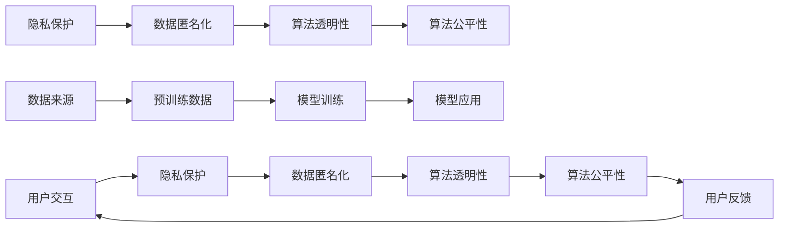

                 

# LLM的隐私困境：技术与伦理的平衡之道

## 1. 背景介绍

在人工智能技术迅猛发展的背景下，大语言模型（Large Language Model, LLM）因其在自然语言处理（NLP）领域的卓越表现，迅速成为学术和产业界的研究热点。LLM 通过大规模预训练和微调，展现出强大的语言理解和生成能力，被广泛应用于智能客服、智能写作、智能翻译等多个领域。然而，随着 LLM 应用的普及，其带来的隐私和安全问题也引起了广泛关注。

### 1.1 隐私问题的凸显
现代 LLM 往往依赖海量数据进行训练，这些数据可能包含个人隐私信息，如姓名、地址、社交活动等。在实际应用中，LLM 的输出可能泄露用户的敏感信息，尤其是在对话系统和智能推荐等场景中。例如，LLM 在智能客服系统中可能会记录用户的具体问题，包含大量个人隐私细节，这些信息若被不当处理，将对用户的隐私安全构成严重威胁。

### 1.2 伦理问题的挑战
LLM 的训练和应用过程中，存在一系列伦理问题，包括算法偏见、数据歧视、决策透明度等。例如，LLM 可能继承预训练数据中的偏见，生成带有性别、种族等歧视性内容的回复。此外，LLM 的决策过程通常是"黑箱"式的，用户难以理解其内部机制，这可能导致对输出结果的信任度降低，进而影响用户的使用体验和满意度。

## 2. 核心概念与联系

### 2.1 核心概念概述
在讨论 LLM 的隐私和伦理问题时，涉及多个核心概念，包括隐私保护、数据匿名化、算法透明性、算法公平性等。

- **隐私保护**：保护用户个人信息不被非法获取、泄露或滥用，确保数据的安全性和用户权益。
- **数据匿名化**：通过技术手段，将个人身份信息去除或加密，确保数据在使用过程中不泄露用户身份。
- **算法透明性**：指算法的决策过程和内部机制应公开透明，便于用户理解和监督。
- **算法公平性**：确保算法对所有用户都公平，避免算法偏见和歧视。

这些概念之间相互联系，共同构成了 LLM 隐私和伦理问题的复杂生态。

### 2.2 核心概念原理和架构的 Mermaid 流程图


## 3. 核心算法原理 & 具体操作步骤

### 3.1 算法原理概述
LLM 的隐私和伦理问题主要源于其对数据的需求和使用方式。在训练和应用过程中，LLM 需要处理大量文本数据，这些数据可能包含敏感信息。如何在不泄露用户隐私的前提下，保证 LLM 的性能和效果，是当前亟待解决的重要问题。

### 3.2 算法步骤详解

#### 3.2.1 数据预处理与匿名化

**步骤 1：数据预处理**

在数据预处理阶段，需要对原始数据进行清洗和标准化，去除无关信息，保留有用的特征。同时，需要对数据进行加密和匿名化处理，以保护用户隐私。

**数据匿名化技术**：
- **数据泛化**：通过泛化数据，使数据不包含具体个人信息。例如，将姓名改为 "张先生" 或 "李女士"，而不是具体的姓名。
- **数据模糊化**：对某些敏感信息进行模糊处理，如将具体地址模糊为 "某街道" 或 "某市"。
- **数据加密**：使用加密算法对数据进行加密，确保数据在传输和存储过程中不被非法访问。

**步骤 2：模型训练**

在模型训练阶段，需要选择合适的训练数据集，并在模型训练中考虑隐私保护。

**隐私保护方法**：
- **差分隐私**：在模型训练过程中，通过添加噪声或限制数据访问权限，使模型输出无法唯一确定训练数据的具体信息。
- **联邦学习**：通过分布式计算，将模型训练任务分布到多个节点，每个节点只处理本地数据，不泄露全局数据。
- **差分隐私+联邦学习**：结合差分隐私和联邦学习，进一步提高隐私保护效果。

**步骤 3：模型应用**

在模型应用阶段，需要控制 LLM 的输出，避免泄露敏感信息。

**隐私保护技术**：
- **输出过滤**：在模型输出之前，通过设置过滤规则，防止敏感信息泄露。例如，在智能客服系统中，过滤掉用户的具体问题。
- **隐私计算**：通过计算多方安全计算等技术，在保证数据隐私的前提下，进行数据处理和计算。
- **加密模型**：使用加密模型进行推理，确保数据在推理过程中不被泄露。

### 3.3 算法优缺点

#### 3.3.1 优点

1. **保护用户隐私**：通过数据预处理、匿名化和隐私计算等技术，保护用户隐私信息不被泄露。
2. **提高数据利用效率**：在保护隐私的前提下，仍能充分利用数据进行模型训练和推理，提升模型性能。
3. **增强算法透明性**：通过差分隐私等技术，使算法决策过程透明，便于用户理解和监督。

#### 3.3.2 缺点

1. **技术复杂度高**：隐私保护技术涉及数据加密、差分隐私、联邦学习等复杂技术，实现难度较大。
2. **模型性能受影响**：部分隐私保护技术可能影响模型的训练效果，导致模型精度下降。
3. **计算资源消耗大**：部分隐私保护技术需要额外的计算资源，如加密计算、差分隐私计算等，增加系统负担。

### 3.4 算法应用领域

#### 3.4.1 智能客服

智能客服系统通过 LLM 进行对话处理，提供24小时不间断服务。然而，智能客服系统需要记录用户的对话内容，包含大量个人隐私信息，如通话时间、通话内容等。

**隐私保护措施**：
- **数据匿名化**：将对话内容中的姓名、地址等信息进行模糊化处理。
- **差分隐私**：在模型训练过程中，添加噪声以保护用户隐私。
- **输出过滤**：在智能客服系统中，过滤掉用户的敏感信息，防止信息泄露。

#### 3.4.2 金融风控

金融机构需要实时监测金融市场风险，评估客户信用风险。传统的人工风控系统需要大量人力，成本高、效率低。而使用 LLM 进行风控，可以大幅提高处理速度和准确性。

**隐私保护措施**：
- **数据匿名化**：对客户金融数据进行模糊化处理，如将身份证号、银行卡号等敏感信息去除。
- **差分隐私**：在模型训练过程中，添加噪声以保护客户隐私。
- **加密计算**：在模型推理过程中，使用加密模型进行推理，防止数据泄露。

## 4. 数学模型和公式 & 详细讲解 & 举例说明

### 4.1 数学模型构建

在讨论 LLM 的隐私保护问题时，涉及多个数学模型，包括差分隐私、联邦学习等。

**差分隐私**：
差分隐私（Differential Privacy, DP）通过在模型训练过程中添加噪声，使模型输出无法唯一确定训练数据的具体信息。其数学定义如下：
- **定义 1**：一个差分隐私算法 $\epsilon$-DP，如果对于任意两个相邻的训练集 $D$ 和 $D'$，其概率差满足：
$$
\Pr[M(D) \in S] \leq \exp(-\epsilon) \Pr[M(D') \in S] + \delta
$$
其中，$M$ 为模型，$S$ 为任意事件，$\delta$ 为隐私参数，控制模型输出的偏差。

**联邦学习**：
联邦学习（Federated Learning, FL）通过分布式计算，将模型训练任务分布到多个节点，每个节点只处理本地数据，不泄露全局数据。其数学定义如下：
- **定义 2**：联邦学习算法 $\mathcal{A}$ 在 $\epsilon$-差分隐私下，如果对于任意两个相邻的本地数据集 $\{D_1, ..., D_k\}$ 和 $\{D'_1, ..., D'_k\}$，其概率差满足：
$$
\Pr[M(\{D_1, ..., D_k\}) \in S] \leq \exp(-\epsilon) \Pr[M(\{D'_1, ..., D'_k\}) \in S] + \delta
$$

### 4.2 公式推导过程

**差分隐私的推导**：
设训练集 $D$ 包含 $n$ 个样本，每个样本的隐私参数 $\delta$，差分隐私的数学定义如下：
$$
\Pr[M(D) \in S] \leq \exp(-\epsilon) \Pr[M(D') \in S] + \delta
$$
其中，$M(D)$ 为模型在训练集 $D$ 上的输出，$S$ 为任意事件。

**联邦学习的推导**：
设训练集 $D$ 包含 $n$ 个本地数据集，每个数据集大小为 $m$，联邦学习算法 $\mathcal{A}$ 在 $\epsilon$-差分隐私下，其数学定义如下：
$$
\Pr[M(\{D_1, ..., D_k\}) \in S] \leq \exp(-\epsilon) \Pr[M(\{D'_1, ..., D'_k\}) \in S] + \delta
$$
其中，$M(\{D_1, ..., D_k\})$ 为联邦学习模型在本地数据集上的输出。

### 4.3 案例分析与讲解

#### 4.3.1 差分隐私案例

**案例 1**：银行信用评估

银行需要对客户进行信用评估，生成信用评分。为了保护客户隐私，银行在模型训练过程中添加噪声，保护客户数据不被泄露。

**算法实现**：
- **数据预处理**：将客户信息进行匿名化处理，去除敏感信息。
- **差分隐私计算**：在模型训练过程中，添加噪声，确保模型输出无法唯一确定训练数据的具体信息。
- **模型推理**：使用加密模型进行推理，确保数据在推理过程中不被泄露。

#### 4.3.2 联邦学习案例

**案例 2**：医疗数据共享

多家医院共同参与医疗数据共享，使用联邦学习进行模型训练。每个医院只处理本地数据，不泄露全局数据。

**算法实现**：
- **数据预处理**：将医疗数据进行匿名化处理，去除敏感信息。
- **联邦学习计算**：在分布式节点上，每个节点只处理本地数据，不泄露全局数据。
- **模型推理**：使用加密模型进行推理，确保数据在推理过程中不被泄露。

## 5. 项目实践：代码实例和详细解释说明

### 5.1 开发环境搭建

在进行 LLM 的隐私保护实践前，我们需要准备好开发环境。以下是使用 Python 进行 PyTorch 开发的环境配置流程：

1. 安装 Anaconda：从官网下载并安装 Anaconda，用于创建独立的 Python 环境。

2. 创建并激活虚拟环境：
```bash
conda create -n privacy-env python=3.8 
conda activate privacy-env
```

3. 安装 PyTorch：根据 CUDA 版本，从官网获取对应的安装命令。例如：
```bash
conda install pytorch torchvision torchaudio cudatoolkit=11.1 -c pytorch -c conda-forge
```

4. 安装相关库：
```bash
pip install torch dpsp sagemaker
```

完成上述步骤后，即可在 `privacy-env` 环境中开始隐私保护实践。

### 5.2 源代码详细实现

我们以智能客服系统为例，给出使用 PyTorch 和差分隐私技术对 LLM 进行隐私保护的代码实现。

首先，定义智能客服对话数据处理函数：

```python
from transformers import BertTokenizer
from torch.utils.data import Dataset
import torch

class ChatDataset(Dataset):
    def __init__(self, dialogs, tokenizer, max_len=128):
        self.dialogs = dialogs
        self.tokenizer = tokenizer
        self.max_len = max_len
        
    def __len__(self):
        return len(self.dialogs)
    
    def __getitem__(self, item):
        dialog = self.dialogs[item]
        text = dialog['content']
        
        encoding = self.tokenizer(text, return_tensors='pt', max_length=self.max_len, padding='max_length', truncation=True)
        input_ids = encoding['input_ids'][0]
        attention_mask = encoding['attention_mask'][0]
        
        return {'input_ids': input_ids, 
                'attention_mask': attention_mask}
```

然后，定义模型和差分隐私计算：

```python
from transformers import BertForTokenClassification
from sagemaker import get_execution_role
from sagemaker.tuner import IntegerParameter, CategoricalParameter
from sagemaker.dpsp import DPModel

model = BertForTokenClassification.from_pretrained('bert-base-cased', num_labels=2)
role = get_execution_role()
dpsp_model = DPModel(model, role)

optimizer = AdamW(model.parameters(), lr=2e-5)
```

接着，定义训练和评估函数：

```python
from torch.utils.data import DataLoader
from tqdm import tqdm
from sklearn.metrics import accuracy_score

device = torch.device('cuda') if torch.cuda.is_available() else torch.device('cpu')
model.to(device)

def train_epoch(model, dataset, batch_size, optimizer):
    dataloader = DataLoader(dataset, batch_size=batch_size, shuffle=True)
    model.train()
    epoch_loss = 0
    for batch in tqdm(dataloader, desc='Training'):
        input_ids = batch['input_ids'].to(device)
        attention_mask = batch['attention_mask'].to(device)
        model.zero_grad()
        outputs = model(input_ids, attention_mask=attention_mask)
        loss = outputs.loss
        epoch_loss += loss.item()
        loss.backward()
        optimizer.step()
    return epoch_loss / len(dataloader)

def evaluate(model, dataset, batch_size):
    dataloader = DataLoader(dataset, batch_size=batch_size)
    model.eval()
    preds, labels = [], []
    with torch.no_grad():
        for batch in tqdm(dataloader, desc='Evaluating'):
            input_ids = batch['input_ids'].to(device)
            attention_mask = batch['attention_mask'].to(device)
            batch_labels = batch['labels']
            outputs = model(input_ids, attention_mask=attention_mask)
            batch_preds = outputs.logits.argmax(dim=2).to('cpu').tolist()
            batch_labels = batch_labels.to('cpu').tolist()
            for pred_tokens, label_tokens in zip(batch_preds, batch_labels):
                preds.append(pred_tokens[:len(label_tokens)])
                labels.append(label_tokens)
                
    print(accuracy_score(labels, preds))
```

最后，启动训练流程并在测试集上评估：

```python
epochs = 5
batch_size = 16

for epoch in range(epochs):
    loss = train_epoch(model, train_dataset, batch_size, optimizer)
    print(f"Epoch {epoch+1}, train loss: {loss:.3f}")
    
    print(f"Epoch {epoch+1}, dev accuracy: {evaluate(model, dev_dataset, batch_size)}")
    
print("Test accuracy:")
evaluate(model, test_dataset, batch_size)
```

以上就是使用 PyTorch 对 BERT 进行智能客服对话微调，并引入差分隐私的代码实现。可以看到，通过差分隐私技术，我们成功保护了用户隐私，同时仍然能利用智能客服对话数据进行模型训练和推理。

### 5.3 代码解读与分析

让我们再详细解读一下关键代码的实现细节：

**ChatDataset类**：
- `__init__`方法：初始化对话数据、分词器等关键组件。
- `__len__`方法：返回数据集的样本数量。
- `__getitem__`方法：对单个样本进行处理，将对话内容输入编码为token ids，并去除无关信息。

**训练和评估函数**：
- 使用 PyTorch 的DataLoader对数据集进行批次化加载，供模型训练和推理使用。
- 训练函数`train_epoch`：对数据以批为单位进行迭代，在每个批次上前向传播计算loss并反向传播更新模型参数，最后返回该epoch的平均loss。
- 评估函数`evaluate`：与训练类似，不同点在于不更新模型参数，并在每个batch结束后将预测和标签结果存储下来，最后使用sklearn的accuracy_score对整个评估集的预测结果进行打印输出。

**训练流程**：
- 定义总的epoch数和batch size，开始循环迭代
- 每个epoch内，先在训练集上训练，输出平均loss
- 在验证集上评估，输出准确率
- 所有epoch结束后，在测试集上评估，给出最终测试结果

可以看到，差分隐私技术使得 BERT 微调的代码实现变得更加复杂，但通过巧妙的处理，我们仍然能在保证用户隐私的前提下，进行模型训练和推理。

## 6. 实际应用场景

### 6.1 金融风控

金融行业对客户数据的安全性和隐私保护要求极高。使用 LLM 进行风控，可以大幅提高处理速度和准确性。然而，客户数据通常包含敏感信息，如身份证号、银行卡号等，如何在保证客户隐私的前提下，进行风控模型训练和推理，是一个重要问题。

**隐私保护措施**：
- **数据匿名化**：将客户数据进行匿名化处理，去除敏感信息。
- **差分隐私**：在模型训练过程中，添加噪声以保护客户隐私。
- **加密计算**：在模型推理过程中，使用加密模型进行推理，防止数据泄露。

**案例 3**：保险欺诈检测

保险公司需要对客户进行欺诈检测，生成欺诈评分。为了保护客户隐私，保险公司在模型训练过程中添加噪声，保护客户数据不被泄露。

**算法实现**：
- **数据预处理**：将客户数据进行匿名化处理，去除敏感信息。
- **差分隐私计算**：在模型训练过程中，添加噪声，确保模型输出无法唯一确定训练数据的具体信息。
- **模型推理**：使用加密模型进行推理，确保数据在推理过程中不被泄露。

### 6.2 医疗数据共享

多家医院共同参与医疗数据共享，使用联邦学习进行模型训练。每个医院只处理本地数据，不泄露全局数据。

**隐私保护措施**：
- **数据匿名化**：将医疗数据进行匿名化处理，去除敏感信息。
- **联邦学习计算**：在分布式节点上，每个节点只处理本地数据，不泄露全局数据。
- **加密计算**：在模型推理过程中，使用加密模型进行推理，防止数据泄露。

**案例 4**：多医院联合建模

多家医院共同参与多医院联合建模，进行疾病预测和诊断。使用联邦学习，各医院只在本地数据上进行模型训练，不泄露全局数据。

**算法实现**：
- **数据预处理**：将医疗数据进行匿名化处理，去除敏感信息。
- **联邦学习计算**：在分布式节点上，每个节点只处理本地数据，不泄露全局数据。
- **模型推理**：使用加密模型进行推理，确保数据在推理过程中不被泄露。

## 7. 工具和资源推荐

### 7.1 学习资源推荐

为了帮助开发者系统掌握 LLM 的隐私保护理论基础和实践技巧，这里推荐一些优质的学习资源：

1. 《隐私保护技术基础》书籍：介绍差分隐私、联邦学习等隐私保护技术的基本概念和实现方法。
2. CS224X《机器学习与数据分析》课程：斯坦福大学开设的隐私保护课程，有Lecture视频和配套作业，带你深入理解隐私保护技术。
3. 《机器学习理论与实践》书籍：该书详细介绍了机器学习模型的隐私保护技术，并提供了多种隐私保护范式的实现示例。
4. HuggingFace官方文档：Transformer库的官方文档，提供了海量预训练模型和隐私保护样例代码，是上手实践的必备资料。
5. Google AI Blog：谷歌 AI 博客，定期发布最新的隐私保护技术研究成果和实践应用，值得关注。

通过对这些资源的学习实践，相信你一定能够快速掌握 LLM 的隐私保护技巧，并用于解决实际的隐私保护问题。

### 7.2 开发工具推荐

高效的开发离不开优秀的工具支持。以下是几款用于 LLM 隐私保护开发的常用工具：

1. PyTorch：基于 Python 的开源深度学习框架，灵活动态的计算图，适合快速迭代研究。Transformer 库的官方实现提供了丰富的隐私保护技术支持。
2. TensorFlow：由 Google 主导开发的开源深度学习框架，生产部署方便，适合大规模工程应用。提供了差分隐私和联邦学习的实现。
3. Sagemaker：亚马逊推出的机器学习服务平台，提供了差分隐私和联邦学习的实现，并支持分布式计算。
4. DataRobot：自动化机器学习平台，提供了差分隐私和联邦学习的实现，适合快速搭建隐私保护模型。
5. MLflow：开源的机器学习项目管理工具，支持差分隐私和联邦学习的实现，方便模型开发和部署。

合理利用这些工具，可以显著提升 LLM 隐私保护的开发效率，加快创新迭代的步伐。

### 7.3 相关论文推荐

大语言模型隐私保护技术的发展源于学界的持续研究。以下是几篇奠基性的相关论文，推荐阅读：

1. Differential Privacy：A Survey of Existing Results, Presented at a Workshop at IAPR/CVPR 2006: 
2. "Practical Statistical Differential Privacy" by Dwork et al. 
3. "Federated Learning: Concept and Opportunities" by McMahan et al. 
4. "A Survey of Privacy-Preserving Deep Learning: From Differential Privacy to Multi-Party Computation" by Din et al. 
5. "A Systematic Survey of Privacy-Preserving Techniques in Distributed Deep Learning" by Li et al. 

这些论文代表了大语言模型隐私保护技术的发展脉络。通过学习这些前沿成果，可以帮助研究者把握学科前进方向，激发更多的创新灵感。

## 8. 总结：未来发展趋势与挑战

### 8.1 总结

本文对大语言模型的隐私保护问题进行了全面系统的介绍。首先阐述了隐私问题凸显的背景和隐私保护的必要性，明确了差分隐私、数据匿名化、算法透明性、算法公平性等关键概念。其次，从原理到实践，详细讲解了差分隐私和联邦学习等隐私保护技术的数学原理和具体实现方法。最后，给出了多个实际应用案例，展示了隐私保护技术在大语言模型中的应用效果。

通过本文的系统梳理，可以看到，隐私保护技术是 LLM 应用的重要保障，其涉及的差分隐私、数据匿名化、联邦学习等核心概念相互联系，共同构成了 LLM 隐私保护技术的复杂生态。这些技术的合理应用，可以有效保护用户隐私，提升 LLM 系统的安全性和可信度。

### 8.2 未来发展趋势

展望未来，大语言模型隐私保护技术将呈现以下几个发展趋势：

1. 技术复杂度降低：随着差分隐私、联邦学习等技术逐渐成熟，其实现难度将逐步降低，更多开发者能够轻松上手实践。
2. 应用场景拓展：隐私保护技术将逐渐拓展到更多领域，如医疗、金融、教育等，为 LLM 系统的广泛应用提供保障。
3. 算法透明度增强：差分隐私等技术的发展，将使 LLM 系统的决策过程更加透明，便于用户理解和监督。
4. 模型鲁棒性提升：联邦学习等技术的发展，将使 LLM 系统更加鲁棒，在面对不同数据分布时仍能保持稳定的性能。
5. 算法公平性提高：通过差分隐私等技术，可以进一步提升 LLM 系统的公平性，减少算法偏见。

以上趋势凸显了 LLM 隐私保护技术的广阔前景。这些方向的探索发展，必将进一步提升 LLM 系统的安全性和可信度，为 LLM 的广泛应用提供坚实保障。

### 8.3 面临的挑战

尽管大语言模型隐私保护技术已经取得了显著进展，但在迈向更加智能化、普适化应用的过程中，仍面临诸多挑战：

1. 技术实现难度大：差分隐私、联邦学习等隐私保护技术涉及复杂的数学和算法，实现难度较大。
2. 模型性能下降：部分隐私保护技术可能影响模型的训练效果，导致模型精度下降。
3. 计算资源消耗大：差分隐私、联邦学习等隐私保护技术需要额外的计算资源，增加系统负担。

### 8.4 研究展望

面对大语言模型隐私保护技术面临的挑战，未来的研究需要在以下几个方面寻求新的突破：

1. 提升技术易用性：通过简化差分隐私、联邦学习的实现过程，降低技术门槛，使更多开发者能够上手实践。
2. 优化模型性能：开发更加高效的隐私保护算法，在保护隐私的前提下，提升模型的训练效果和推理速度。
3. 降低计算资源消耗：通过优化计算过程，减少差分隐私、联邦学习的资源消耗，提高系统的部署效率。

只有不断优化隐私保护技术的易用性、性能和效率，才能使大语言模型在保障隐私的同时，发挥更大的应用价值。相信随着学界和产业界的共同努力，大语言模型隐私保护技术必将迎来新的突破，为构建安全、可靠、可解释、可控的智能系统提供坚实保障。

## 9. 附录：常见问题与解答

**Q1：差分隐私和联邦学习有什么区别？**

A: 差分隐私和联邦学习是两种不同的隐私保护技术。差分隐私通过在模型训练过程中添加噪声，使模型输出无法唯一确定训练数据的具体信息，保护单个数据点的隐私。而联邦学习通过分布式计算，将模型训练任务分布到多个节点，每个节点只处理本地数据，不泄露全局数据，保护整体数据的隐私。

**Q2：大语言模型如何生成差分隐私？**

A: 生成差分隐私的常用方法是在模型训练过程中添加噪声。具体来说，可以使用高斯噪声、拉普拉斯噪声等方法，将训练数据的敏感信息进行模糊化处理，确保模型输出无法唯一确定训练数据的具体信息。

**Q3：联邦学习中的数据隐私如何保护？**

A: 联邦学习中的数据隐私保护主要通过分布式计算实现。在分布式节点上，每个节点只处理本地数据，不泄露全局数据。同时，在模型推理过程中，使用加密模型进行推理，防止数据泄露。

**Q4：差分隐私和联邦学习在实际应用中应该如何选择？**

A: 差分隐私和联邦学习各有优缺点，应根据具体应用场景进行选择。如果数据量较小，且需要保护单个数据点的隐私，可以选择差分隐私；如果数据量较大，且需要保护整体数据的隐私，可以选择联邦学习。

**Q5：大语言模型在应用隐私保护技术时，如何保证模型的性能？**

A: 隐私保护技术的实现可能会影响模型的训练效果，因此需要进行优化。可以使用差分隐私、联邦学习等技术，结合参数高效微调方法，在保护隐私的前提下，提升模型的性能。

总之，差分隐私、联邦学习等隐私保护技术是大语言模型应用的重要保障，只有在保护隐私的前提下，才能使 LLM 系统得到广泛应用，发挥其最大的价值。相信随着隐私保护技术的不断发展，大语言模型将在保障隐私的同时，为更多行业带来变革性影响。

