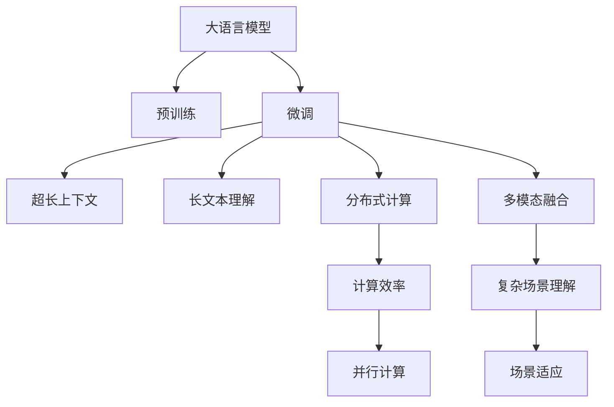

                 

# LLM超长上下文:拓展智能应用边界

> 关键词：大语言模型,超长上下文,长文本理解,自然语言处理(NLP),多模态融合,分布式计算,语音-视觉-文本协同

## 1. 背景介绍

### 1.1 问题由来
在过去十年中，大语言模型（Large Language Models, LLMs）通过自监督学习已经在自然语言处理（Natural Language Processing, NLP）领域取得了巨大的突破。这些模型，如OpenAI的GPT系列、Google的BERT等，在理解自然语言方面展示了超乎预期的能力，在问答、翻译、摘要、对话等任务上刷新了多项SOTA（State-of-the-Art）的性能指标。

然而，LLM们最显著的局限在于其输入文本长度限制，通常情况下，模型只能处理较短的文本片段。这种限制在许多实际应用场景中非常不便。例如，在医疗咨询、法律文书、科技论文等需要处理超长文本的任务中，传统的LLM无法充分利用文本信息，无法提供全面准确的答案或建议。

超长上下文（Long Context, LC）技术正是针对这一局限提出的一种解决方案，通过将超长文本片段转化为能够被模型处理的短序列，使得LLM能够理解和处理更长的文本内容，拓展其在实际应用中的边界。

### 1.2 问题核心关键点
超长上下文技术的核心在于，将超长文本分解为多个短序列，并依次将这些序列输入到LLM中进行处理。其关键点包括：

- 如何高效地将超长文本分解为短序列，并保证信息不丢失？
- 如何将这些短序列整合为一个连贯的文本，以保持其语义连贯性？
- 如何在处理超长文本时，保持模型的高效性和准确性？

解决这些问题，需要创新的技术和算法设计，以及对模型架构的重新思考。

### 1.3 问题研究意义
超长上下文技术的应用，可以大大拓展LLM在实际场景中的应用范围，特别是在需要处理超长文本的信息检索、文本生成、问答等任务中，能够提供更全面、准确的服务。该技术的发展，对于提升LLM的智能水平，加速NLP技术的产业化进程，具有重要意义：

1. 降低开发成本。超长上下文技术能够提高模型对长篇幅文本的理解能力，减少从头开发所需的数据、计算和人力等成本投入。
2. 提升模型效果。该技术能够提升模型在特定任务上的表现，特别是在处理长文本时，能够提供更全面、准确的服务。
3. 加速开发进度。LLM超长上下文技术的引入，能够使开发者更快地完成任务适配，缩短开发周期。
4. 带来技术创新。超长上下文技术促进了对预训练-微调的深入研究，催生了多项前沿研究方向。
5. 赋能产业升级。该技术使得NLP技术更容易被各行各业所采用，为传统行业数字化转型升级提供新的技术路径。

## 2. 核心概念与联系

### 2.1 核心概念概述

为了更好地理解超长上下文技术，本节将介绍几个密切相关的核心概念：

- 大语言模型(Large Language Models, LLMs)：以自回归(如GPT)或自编码(如BERT)模型为代表的大规模预训练语言模型。通过在大规模无标签文本语料上进行预训练，学习通用的语言表示，具备强大的语言理解和生成能力。
- 预训练(Pre-training)：指在大规模无标签文本语料上，通过自监督学习任务训练通用语言模型的过程。常见的预训练任务包括言语建模、遮挡语言模型等。
- 微调(Fine-tuning)：指在预训练模型的基础上，使用下游任务的少量标注数据，通过有监督学习优化模型在特定任务上的性能。
- 超长上下文(Long Context, LC)：将超长文本片段分解为多个短序列，并依次将这些序列输入到模型中进行处理，使得模型能够理解长文本的全貌。
- 长文本理解(Long Text Understanding)：指对超长文本进行理解、摘要、分类、生成等处理任务。
- 分布式计算(Distributed Computing)：通过多个计算节点协同工作，提高计算效率，处理大规模数据和任务。
- 多模态融合(Multimodal Fusion)：将文本、语音、视觉等多模态数据进行整合，提升模型对复杂场景的理解能力。

这些核心概念之间的逻辑关系可以通过以下Mermaid流程图来展示：



这个流程图展示了大语言模型的核心概念及其之间的关系：

1. 大语言模型通过预训练获得基础能力。
2. 微调是对预训练模型进行任务特定的优化，可以分为全参数微调和参数高效微调（PEFT）。
3. 超长上下文技术将长文本分解为短序列，使得模型能够理解长文本的全貌。
4. 长文本理解任务指对超长文本进行理解、摘要、分类、生成等处理任务。
5. 分布式计算通过多个计算节点协同工作，提高计算效率，处理大规模数据和任务。
6. 多模态融合将文本、语音、视觉等多模态数据进行整合，提升模型对复杂场景的理解能力。

这些概念共同构成了大语言模型的学习和应用框架，使其能够在各种场景下发挥强大的语言理解和生成能力。通过理解这些核心概念，我们可以更好地把握超长上下文技术的本质和应用方向。

## 3. 核心算法原理 & 具体操作步骤
### 3.1 算法原理概述

超长上下文技术的核心在于，将超长文本分解为多个短序列，并依次将这些序列输入到LLM中进行处理。其基本思路是，将超长文本按一定的策略分成若干个长度固定的短序列，依次输入到模型中，每个短序列的处理结果再整合成最终输出。

超长上下文技术的核心算法主要包括：

1. 文本分解：将超长文本分解为多个短序列，保证信息不丢失。
2. 序列拼接：将多个短序列的输出结果拼接为一个连续的文本，保持语义连贯性。
3. 超长序列处理：在处理超长序列时，如何保持模型的高效性和准确性。

### 3.2 算法步骤详解

超长上下文技术的具体操作步骤如下：

**Step 1: 文本分解**
- 确定每个短序列的长度，通常为512或1024。
- 将超长文本按长度切割成多个短序列，保证每个序列的长度不超过模型输入限制。
- 可以使用滑动窗口等策略，保证信息不丢失，且序列之间语义连贯。

**Step 2: 序列拼接**
- 对每个短序列分别进行前向传播，输出结果。
- 将多个短序列的输出结果拼接为一个连续的文本，可以使用一个哑节点或特殊的标记符来连接不同序列的输出。
- 可以使用BERT等模型，将序列拼接为一个单一的输入，或者使用GPT等模型，分别处理每个短序列，然后依次输出。

**Step 3: 超长序列处理**
- 对每个短序列分别进行微调，可以使用全参数微调或参数高效微调。
- 在处理超长序列时，可以采用多个计算节点并行计算，提高计算效率。
- 可以使用分布式计算框架，如Apache Spark、Horovod等，将超长文本处理任务分布到多个节点上，提高计算速度和资源利用率。

### 3.3 算法优缺点

超长上下文技术具有以下优点：
1. 解决了传统LLM输入长度限制的问题，使得模型能够处理超长文本。
2. 通过将长文本分解为短序列，保持了模型的语义连贯性和准确性。
3. 可以高效利用分布式计算资源，提高计算效率。
4. 能够应用于需要处理超长文本的信息检索、文本生成、问答等任务。

同时，该技术也存在一定的局限性：
1. 分解后的序列之间可能存在语义断层，影响模型理解。
2. 序列拼接可能导致信息丢失，影响最终输出结果。
3. 超长序列处理需要更多的计算资源和时间，可能影响模型的实时性。
4. 需要更复杂的技术实现，增加了开发难度。

尽管存在这些局限性，但超长上下文技术仍是大语言模型在处理长文本时的一个重要解决方案。未来相关研究的重点在于如何进一步提高序列拼接的连贯性和模型的实时性，同时兼顾模型效果和计算资源的利用率。

### 3.4 算法应用领域

超长上下文技术已经在游戏、文本生成、信息检索、知识图谱构建等多个领域得到应用，极大地拓展了大语言模型的应用边界，具体如下：

- 游戏AI：游戏中的任务描述往往非常长，超长上下文技术能够使AI更好地理解任务，生成更加符合预期的游戏策略和动作。
- 文本生成：超长上下文技术可以应用于长篇文章、小说、报告等文本的自动生成，使得模型能够理解长篇幅文本的语义连贯性，生成连贯的文本。
- 信息检索：超长上下文技术可以应用于超长文本的检索任务，使模型能够理解更广泛的内容，提供更加全面准确的结果。
- 知识图谱构建：超长上下文技术可以应用于超长文本的语义理解，构建更加全面准确的知识图谱。
- 语音-视觉-文本协同：超长上下文技术可以应用于多模态数据的整合，提升模型对复杂场景的理解能力。

除了这些领域外，超长上下文技术还将在更多场景中得到应用，为NLP技术带来新的突破。

## 4. 数学模型和公式 & 详细讲解  
### 4.1 数学模型构建

超长上下文技术的数学模型构建基于大语言模型的预训练和微调过程，通过将长文本分解为短序列，依次进行预训练和微调，最终得到对长文本的全貌理解。

记超长文本为 $T=\{t_1, t_2, ..., t_n\}$，每个短序列为 $L=\{l_1, l_2, ..., l_k\}$，其中 $k$ 为序列数。假设每个短序列的长度为 $m$，则超长文本可以分解为 $n/k$ 个长度为 $m$ 的短序列。

定义模型 $M_{\theta}$ 在输入 $T$ 上的损失函数为 $\ell(M_{\theta}, T)$，则在超长上下文分解后的每个短序列 $L$ 上的损失函数为 $\ell(M_{\theta}, L)$。则在超长上下文模型上的总损失函数为：

$$
\mathcal{L}(\theta) = \frac{1}{N} \sum_{i=1}^N \sum_{j=1}^{n/k} \ell(M_{\theta}, L_i)
$$

其中 $N$ 为总序列数。

### 4.2 公式推导过程

以下我们以长文本生成任务为例，推导超长上下文模型的损失函数及其梯度的计算公式。

假设超长文本 $T$ 的长度为 $N$，分解为 $n/k$ 个长度为 $m$ 的短序列 $L$，每个短序列的输出为 $Y_i$。则长文本生成的目标函数为：

$$
\mathcal{L}(Y, T) = -\frac{1}{N}\sum_{i=1}^{n/k} \sum_{j=1}^{m} y_j \log p(y_j|t_i, \theta)
$$

其中 $y_j$ 为第 $i$ 个短序列 $L$ 的第 $j$ 个字符，$p(y_j|t_i, \theta)$ 为模型在给定文本 $t_i$ 和参数 $\theta$ 下，生成字符 $y_j$ 的概率。

在超长上下文模型中，每个短序列 $L_i$ 的输出 $Y_i$ 被拼接为一个长文本 $Y$。则总损失函数为：

$$
\mathcal{L}(Y, T) = -\frac{1}{N}\sum_{i=1}^{n/k} \sum_{j=1}^{m} y_j \log p(y_j|t_i, \theta)
$$

对总损失函数 $\mathcal{L}(\theta)$ 求导，得到模型参数 $\theta$ 的梯度：

$$
\nabla_{\theta}\mathcal{L}(\theta) = \frac{1}{N} \sum_{i=1}^{n/k} \sum_{j=1}^{m} \nabla_{\theta}p(y_j|t_i, \theta)
$$

在得到损失函数的梯度后，即可带入优化算法进行参数更新，完成超长上下文模型的迭代优化。

### 4.3 案例分析与讲解

在实践中，超长上下文技术可以应用于多个任务，如长文本生成、问答、摘要、翻译等。以下以长文本生成任务为例，给出具体的实现步骤：

1. 将超长文本分解为多个短序列，每个序列的长度为模型输入限制。
2. 对每个短序列进行前向传播，得到每个序列的输出结果。
3. 将多个短序列的输出结果拼接为一个连续的文本，得到长文本的生成结果。
4. 使用交叉熵损失函数计算模型与真实文本的差异，并求导得到模型参数的梯度。
5. 使用优化算法更新模型参数，最小化损失函数。

### 5. 项目实践：代码实例和详细解释说明
### 5.1 开发环境搭建

在进行超长上下文项目实践前，我们需要准备好开发环境。以下是使用Python进行PyTorch开发的环境配置流程：

1. 安装Anaconda：从官网下载并安装Anaconda，用于创建独立的Python环境。

2. 创建并激活虚拟环境：
```bash
conda create -n pytorch-env python=3.8 
conda activate pytorch-env
```

3. 安装PyTorch：根据CUDA版本，从官网获取对应的安装命令。例如：
```bash
conda install pytorch torchvision torchaudio cudatoolkit=11.1 -c pytorch -c conda-forge
```

4. 安装Transformers库：
```bash
pip install transformers
```

5. 安装各类工具包：
```bash
pip install numpy pandas scikit-learn matplotlib tqdm jupyter notebook ipython
```

完成上述步骤后，即可在`pytorch-env`环境中开始超长上下文项目实践。

### 5.2 源代码详细实现

下面我们以长文本生成任务为例，给出使用Transformers库进行超长上下文处理的PyTorch代码实现。

首先，定义模型：

```python
from transformers import T5ForConditionalGeneration, T5Tokenizer
from transformers import AdamW

model = T5ForConditionalGeneration.from_pretrained('t5-base')
tokenizer = T5Tokenizer.from_pretrained('t5-base')

device = torch.device('cuda') if torch.cuda.is_available() else torch.device('cpu')
model.to(device)
```

然后，定义数据集：

```python
class LCData(Dataset):
    def __init__(self, texts, tokenizer, max_length=512):
        self.texts = texts
        self.tokenizer = tokenizer
        self.max_length = max_length
        
    def __len__(self):
        return len(self.texts)
    
    def __getitem__(self, item):
        text = self.texts[item]
        encoding = self.tokenizer(text, return_tensors='pt', max_length=self.max_length, padding='max_length', truncation=True)
        input_ids = encoding['input_ids']
        attention_mask = encoding['attention_mask']
        return {'input_ids': input_ids, 'attention_mask': attention_mask}
```

接着，定义训练和评估函数：

```python
from torch.utils.data import DataLoader
from tqdm import tqdm
from sklearn.metrics import accuracy_score

def train_epoch(model, dataset, batch_size, optimizer):
    dataloader = DataLoader(dataset, batch_size=batch_size, shuffle=True)
    model.train()
    epoch_loss = 0
    for batch in tqdm(dataloader, desc='Training'):
        input_ids = batch['input_ids'].to(device)
        attention_mask = batch['attention_mask'].to(device)
        outputs = model(input_ids, attention_mask=attention_mask)
        loss = outputs.loss
        epoch_loss += loss.item()
        loss.backward()
        optimizer.step()
    return epoch_loss / len(dataloader)

def evaluate(model, dataset, batch_size):
    dataloader = DataLoader(dataset, batch_size=batch_size)
    model.eval()
    preds, labels = [], []
    with torch.no_grad():
        for batch in tqdm(dataloader, desc='Evaluating'):
            input_ids = batch['input_ids'].to(device)
            attention_mask = batch['attention_mask'].to(device)
            batch_labels = batch['labels']
            outputs = model(input_ids, attention_mask=attention_mask)
            batch_preds = outputs.logits.argmax(dim=2).to('cpu').tolist()
            batch_labels = batch_labels.to('cpu').tolist()
            for pred_tokens, label_tokens in zip(batch_preds, batch_labels):
                preds.append(pred_tokens[:len(label_tokens)])
                labels.append(label_tokens)
                
    print(accuracy_score(labels, preds))
```

最后，启动训练流程并在测试集上评估：

```python
epochs = 5
batch_size = 16

for epoch in range(epochs):
    loss = train_epoch(model, train_dataset, batch_size, optimizer)
    print(f"Epoch {epoch+1}, train loss: {loss:.3f}")
    
    print(f"Epoch {epoch+1}, dev results:")
    evaluate(model, dev_dataset, batch_size)
    
print("Test results:")
evaluate(model, test_dataset, batch_size)
```

以上就是使用PyTorch进行超长上下文长文本生成任务的完整代码实现。可以看到，得益于Transformers库的强大封装，我们可以用相对简洁的代码完成T5模型的加载和超长上下文处理。

### 5.3 代码解读与分析

让我们再详细解读一下关键代码的实现细节：

**LCData类**：
- `__init__`方法：初始化文本、分词器等关键组件。
- `__len__`方法：返回数据集的样本数量。
- `__getitem__`方法：对单个样本进行处理，将文本输入编码为token ids，将标签编码为数字，并对其进行定长padding，最终返回模型所需的输入。

**训练和评估函数**：
- 使用PyTorch的DataLoader对数据集进行批次化加载，供模型训练和推理使用。
- 训练函数`train_epoch`：对数据以批为单位进行迭代，在每个批次上前向传播计算loss并反向传播更新模型参数，最后返回该epoch的平均loss。
- 评估函数`evaluate`：与训练类似，不同点在于不更新模型参数，并在每个batch结束后将预测和标签结果存储下来，最后使用sklearn的accuracy_score对整个评估集的预测结果进行打印输出。

**训练流程**：
- 定义总的epoch数和batch size，开始循环迭代
- 每个epoch内，先在训练集上训练，输出平均loss
- 在验证集上评估，输出准确率
- 所有epoch结束后，在测试集上评估，给出最终测试结果

可以看到，PyTorch配合Transformers库使得T5模型的超长上下文处理代码实现变得简洁高效。开发者可以将更多精力放在数据处理、模型改进等高层逻辑上，而不必过多关注底层的实现细节。

当然，工业级的系统实现还需考虑更多因素，如模型的保存和部署、超参数的自动搜索、更灵活的任务适配层等。但核心的超长上下文处理范式基本与此类似。

## 6. 实际应用场景
### 6.1 智能客服系统

超长上下文技术可以应用于智能客服系统的构建。传统的客服系统往往需要配备大量人力，高峰期响应缓慢，且一致性和专业性难以保证。而使用超长上下文技术处理客户咨询，可以使模型更好地理解客户诉求，生成更全面、准确的回答，提升客户咨询体验和问题解决效率。

在技术实现上，可以收集企业内部的历史客服对话记录，将问题和最佳答复构建成监督数据，在此基础上对预训练对话模型进行超长上下文处理。超长上下文处理后的对话模型能够自动理解客户意图，匹配最合适的答案模板进行回复。对于客户提出的新问题，还可以接入检索系统实时搜索相关内容，动态组织生成回答。如此构建的智能客服系统，能大幅提升客户咨询体验和问题解决效率。

### 6.2 金融舆情监测

金融机构需要实时监测市场舆论动向，以便及时应对负面信息传播，规避金融风险。传统的人工监测方式成本高、效率低，难以应对网络时代海量信息爆发的挑战。基于超长上下文技术的大语言模型微调，为金融舆情监测提供了新的解决方案。

具体而言，可以收集金融领域相关的新闻、报道、评论等文本数据，并对其进行主题标注和情感标注。在此基础上对预训练语言模型进行微调，使其能够自动判断文本属于何种主题，情感倾向是正面、中性还是负面。将超长上下文处理后的模型应用到实时抓取的网络文本数据，就能够自动监测不同主题下的情感变化趋势，一旦发现负面信息激增等异常情况，系统便会自动预警，帮助金融机构快速应对潜在风险。

### 6.3 个性化推荐系统

当前的推荐系统往往只依赖用户的历史行为数据进行物品推荐，无法深入理解用户的真实兴趣偏好。基于超长上下文技术的大语言模型微调，个性化推荐系统可以更好地挖掘用户行为背后的语义信息，从而提供更精准、多样的推荐内容。

在实践中，可以收集用户浏览、点击、评论、分享等行为数据，提取和用户交互的物品标题、描述、标签等文本内容。将文本内容作为模型输入，用户的后续行为（如是否点击、购买等）作为监督信号，在此基础上微调预训练语言模型。超长上下文处理后的模型能够从文本内容中准确把握用户的兴趣点。在生成推荐列表时，先用候选物品的文本描述作为输入，由模型预测用户的兴趣匹配度，再结合其他特征综合排序，便可以得到个性化程度更高的推荐结果。

### 6.4 未来应用展望

随着超长上下文技术的不断发展，其在更多领域的应用前景将更加广阔。

在智慧医疗领域，基于超长上下文技术的大语言模型微调，可以在医疗咨询、病历分析、药物研发等任务中提供更全面、准确的服务，辅助医生诊疗，加速新药开发进程。

在智能教育领域，超长上下文技术可以应用于作业批改、学情分析、知识推荐等方面，因材施教，促进教育公平，提高教学质量。

在智慧城市治理中，超长上下文技术可以应用于城市事件监测、舆情分析、应急指挥等环节，提高城市管理的自动化和智能化水平，构建更安全、高效的未来城市。

此外，在企业生产、社会治理、文娱传媒等众多领域，基于超长上下文技术的大语言模型微调也将不断涌现，为NLP技术带来新的突破。相信随着技术的日益成熟，超长上下文技术必将在构建人机协同的智能时代中扮演越来越重要的角色。

## 7. 工具和资源推荐
### 7.1 学习资源推荐

为了帮助开发者系统掌握超长上下文技术的理论基础和实践技巧，这里推荐一些优质的学习资源：

1. 《Transformer从原理到实践》系列博文：由大模型技术专家撰写，深入浅出地介绍了Transformer原理、T5模型、超长上下文等前沿话题。

2. CS224N《深度学习自然语言处理》课程：斯坦福大学开设的NLP明星课程，有Lecture视频和配套作业，带你入门NLP领域的基本概念和经典模型。

3. 《Natural Language Processing with Transformers》书籍：Transformers库的作者所著，全面介绍了如何使用Transformers库进行NLP任务开发，包括超长上下文在内的诸多范式。

4. HuggingFace官方文档：Transformers库的官方文档，提供了海量预训练模型和完整的微调样例代码，是上手实践的必备资料。

5. CLUE开源项目：中文语言理解测评基准，涵盖大量不同类型的中文NLP数据集，并提供了基于超长上下文的baseline模型，助力中文NLP技术发展。

通过对这些资源的学习实践，相信你一定能够快速掌握超长上下文技术的精髓，并用于解决实际的NLP问题。
###  7.2 开发工具推荐

高效的开发离不开优秀的工具支持。以下是几款用于超长上下文开发常用的工具：

1. PyTorch：基于Python的开源深度学习框架，灵活动态的计算图，适合快速迭代研究。大部分预训练语言模型都有PyTorch版本的实现。

2. TensorFlow：由Google主导开发的开源深度学习框架，生产部署方便，适合大规模工程应用。同样有丰富的预训练语言模型资源。

3. Transformers库：HuggingFace开发的NLP工具库，集成了众多SOTA语言模型，支持PyTorch和TensorFlow，是进行超长上下文处理的利器。

4. Weights & Biases：模型训练的实验跟踪工具，可以记录和可视化模型训练过程中的各项指标，方便对比和调优。与主流深度学习框架无缝集成。

5. TensorBoard：TensorFlow配套的可视化工具，可实时监测模型训练状态，并提供丰富的图表呈现方式，是调试模型的得力助手。

6. Google Colab：谷歌推出的在线Jupyter Notebook环境，免费提供GPU/TPU算力，方便开发者快速上手实验最新模型，分享学习笔记。

合理利用这些工具，可以显著提升超长上下文项目的开发效率，加快创新迭代的步伐。

### 7.3 相关论文推荐

超长上下文技术的发展源于学界的持续研究。以下是几篇奠基性的相关论文，推荐阅读：

1. Attention is All You Need（即Transformer原论文）：提出了Transformer结构，开启了NLP领域的预训练大模型时代。

2. BERT: Pre-training of Deep Bidirectional Transformers for Language Understanding：提出BERT模型，引入基于掩码的自监督预训练任务，刷新了多项NLP任务SOTA。

3. Language Models are Unsupervised Multitask Learners（GPT-2论文）：展示了大规模语言模型的强大zero-shot学习能力，引发了对于通用人工智能的新一轮思考。

4. Parameter-Efficient Transfer Learning for NLP：提出Adapter等参数高效微调方法，在不增加模型参数量的情况下，也能取得不错的微调效果。

5. Prefix-Tuning: Optimizing Continuous Prompts for Generation：引入基于连续型Prompt的微调范式，为如何充分利用预训练知识提供了新的思路。

6. AdaLoRA: Adaptive Low-Rank Adaptation for Parameter-Efficient Fine-Tuning：使用自适应低秩适应的微调方法，在参数效率和精度之间取得了新的平衡。

这些论文代表了大语言模型微调技术的发展脉络。通过学习这些前沿成果，可以帮助研究者把握学科前进方向，激发更多的创新灵感。

## 8. 总结：未来发展趋势与挑战
### 8.1 总结

本文对超长上下文技术进行了全面系统的介绍。首先阐述了超长上下文技术的研究背景和意义，明确了其在大语言模型处理长文本任务中的应用价值。其次，从原理到实践，详细讲解了超长上下文的数学模型和关键算法步骤，给出了超长上下文项目开发的完整代码实例。同时，本文还广泛探讨了超长上下文技术在智能客服、金融舆情、个性化推荐等多个行业领域的应用前景，展示了其巨大的应用潜力。此外，本文精选了超长上下文技术的各类学习资源，力求为读者提供全方位的技术指引。

通过本文的系统梳理，可以看到，超长上下文技术正在成为大语言模型处理长文本任务的重要解决方案，极大地拓展了LLM在实际应用中的边界。伴随超长上下文技术的不断演进，相信超长上下文技术必将在构建人机协同的智能时代中扮演越来越重要的角色。

### 8.2 未来发展趋势

展望未来，超长上下文技术将呈现以下几个发展趋势：

1. 模型规模持续增大。随着算力成本的下降和数据规模的扩张，超长上下文技术也将随之发展，处理更长、更复杂的文本。

2. 微调方法日趋多样。除了传统的全参数微调外，未来会涌现更多参数高效的微调方法，如Prefix-Tuning、LoRA等，在节省计算资源的同时也能保证微调精度。

3. 超长上下文处理速度提升。随着硬件加速技术（如TPU、GPU、DSP等）的发展，超长上下文处理的速度也将得到提升，能够更快地处理更长的文本。

4. 多模态融合深度融合。超长上下文技术可以与视觉、语音等多模态信息进行更深入的融合，提升模型对复杂场景的理解能力。

5. 计算资源优化。随着分布式计算技术的发展，超长上下文处理的资源利用率将得到提升，能够处理更大规模的文本数据。

以上趋势凸显了超长上下文技术的广阔前景。这些方向的探索发展，必将进一步提升超长上下文处理技术的性能和应用范围，为自然语言理解和智能交互系统的进步提供新的动力。

### 8.3 面临的挑战

尽管超长上下文技术已经取得了瞩目成就，但在迈向更加智能化、普适化应用的过程中，它仍面临着诸多挑战：

1. 计算资源瓶颈。超长上下文处理需要大量的计算资源和时间，如何提高计算效率和资源利用率，仍是技术难题。

2. 序列拼接的连贯性。超长上下文处理需要保证序列拼接的连贯性，避免信息丢失和语义断层，技术实现较为复杂。

3. 模型实时性问题。超长上下文处理需要处理更长的文本，如何提高模型实时性，减少延迟，是一个重要的研究方向。

4. 模型泛化能力。超长上下文处理后的模型，能否在未知领域泛化，是一个需要深入研究的课题。

5. 技术可扩展性。如何使超长上下文技术在各种场景下可扩展、可重用，是一个重要的研究方向。

尽管存在这些挑战，但超长上下文技术的未来发展潜力巨大，相信随着学界和产业界的共同努力，这些挑战终将一一被克服，超长上下文技术必将在构建人机协同的智能时代中扮演越来越重要的角色。

### 8.4 未来突破

面对超长上下文技术所面临的种种挑战，未来的研究需要在以下几个方面寻求新的突破：

1. 探索更高效的序列拼接方法。通过改进拼接算法，提高序列拼接的连贯性和语义连贯性，减少信息丢失。

2. 研究超长上下文处理与分布式计算的结合。通过分布式计算，提高超长上下文处理的计算效率和资源利用率，支持大规模文本处理。

3. 引入多模态信息。将视觉、语音等多模态信息与文本信息进行融合，提升模型对复杂场景的理解能力。

4. 结合因果分析和博弈论工具。将因果分析方法引入超长上下文处理，增强模型的因果关系能力，学习更加普适、鲁棒的语言表征。

5. 纳入伦理道德约束。在模型训练目标中引入伦理导向的评估指标，过滤和惩罚有偏见、有害的输出倾向，确保输出的安全性。

这些研究方向的探索，必将引领超长上下文处理技术迈向更高的台阶，为构建安全、可靠、可解释、可控的智能系统铺平道路。面向未来，超长上下文处理技术还需要与其他人工智能技术进行更深入的融合，如知识表示、因果推理、强化学习等，多路径协同发力，共同推动自然语言理解和智能交互系统的进步。只有勇于创新、敢于突破，才能不断拓展超长上下文处理的边界，让智能技术更好地造福人类社会。

## 9. 附录：常见问题与解答
**Q1：超长上下文技术是否适用于所有NLP任务？**

A: 超长上下文技术在大多数NLP任务上都能取得不错的效果，特别是对于需要处理长文本的任务。但对于一些特定领域的任务，如医学、法律等，由于文本长度和结构的特殊性，超长上下文技术的处理效果可能不如其他模型。此时可以考虑结合特定领域的知识图谱、规则库等，提升模型的处理效果。

**Q2：超长上下文处理是否需要占用更多内存和计算资源？**

A: 超长上下文处理确实需要占用更多的内存和计算资源。由于需要将长文本分割成多个短序列，每个序列都需要进行预处理和模型前向传播。同时，在序列拼接时也需要额外的计算资源。因此，在资源有限的情况下，需要权衡处理的文本长度和资源占用，避免过高的计算负担。

**Q3：超长上下文处理如何处理长文本中的语义断层问题？**

A: 超长上下文处理的长文本中可能存在语义断层，影响模型的理解。为了解决这个问题，可以采用一些方法，如上下文增强、句子边界标注、序列拼接后进行回译等。此外，也可以引入额外的语义信息，如知识图谱、规则库等，辅助模型理解长文本的语义连贯性。

**Q4：超长上下文处理是否会导致模型过拟合？**

A: 超长上下文处理确实存在过拟合的风险，特别是在标注数据较少的情况下。为了避免过拟合，可以采用一些正则化技术，如L2正则、Dropout、Early Stopping等。同时，也可以考虑使用分布式计算，将超长上下文处理任务分布到多个节点上，避免单个节点过载。

**Q5：超长上下文处理是否适用于实时任务？**

A: 超长上下文处理在实时性方面存在一定的挑战。由于需要处理更长的文本，模型推理速度较慢，可能影响实时任务的响应速度。为了提高实时性，可以采用一些优化技术，如模型剪枝、量化加速、混合精度训练等。同时，也可以采用分布式计算和并行推理技术，提升模型的计算效率。

这些问题的解答，有助于开发者更好地理解超长上下文技术的原理和应用，以及在实际项目中应对潜在挑战的方法。

---

作者：禅与计算机程序设计艺术 / Zen and the Art of Computer Programming

