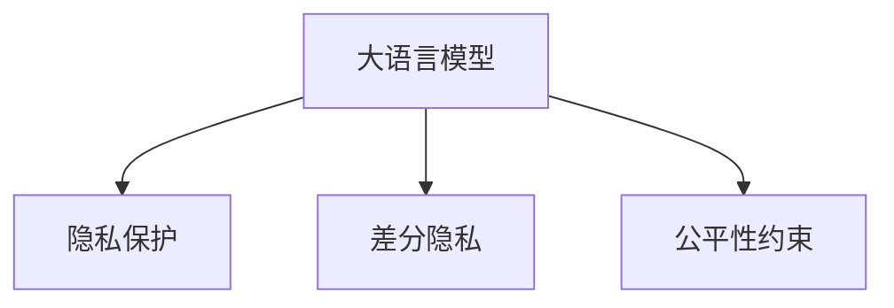

                 

# LLM隐私伦理:AI安全挑战应对之策

> 关键词：大语言模型,隐私保护,伦理挑战,AI安全,隐私保护技术,数据匿名化,差分隐私,公平性约束

## 1. 背景介绍

### 1.1 问题由来
随着人工智能（AI）技术的飞速发展，尤其是大语言模型（Large Language Models, LLMs）的广泛应用，其在自然语言处理（NLP）、计算机视觉、医疗诊断等领域取得了巨大成功。但与此同时，大语言模型也面临一系列严峻的隐私伦理问题，如数据隐私泄露、偏见和歧视、算法不透明性等。这些问题不仅威胁到用户的个人隐私和信息安全，也影响了公众对AI技术的信任和接受度。

### 1.2 问题核心关键点
大语言模型在训练和使用过程中所面临的隐私伦理问题，主要包括：
1. **数据隐私泄露**：大模型通常需要大量标注数据进行预训练和微调，这些数据往往包含敏感的个人和商业信息。如何在保证数据价值利用的同时，保护数据隐私，是一个关键挑战。
2. **算法透明度不足**：大语言模型常常被视为"黑箱"系统，其内部决策过程难以解释和验证，缺乏透明度。如何在提升模型性能的同时，增加其可解释性，是另一个重要课题。
3. **偏见和歧视**：由于训练数据存在偏见，模型可能学习并复制这些偏见，导致输出结果带有歧视性。如何减少模型的偏见和歧视，使其更公平地对待不同群体，是一个亟待解决的问题。
4. **法律合规和伦理约束**：AI技术的应用涉及到复杂的法律和伦理问题，如数据处理、隐私保护、算法决策等，如何确保技术应用符合相关法律法规和伦理标准，是一个重要的研究方向。

这些核心关键点表明，大语言模型的应用需要在隐私保护、伦理规范和法律合规等多个维度进行综合考量，以确保其安全和可信赖。本文将从隐私保护技术、数据匿名化、差分隐私和公平性约束等方面，探讨如何应对大语言模型在实际应用中的隐私伦理挑战。

## 2. 核心概念与联系

### 2.1 核心概念概述

为更好地理解大语言模型隐私伦理问题，本节将介绍几个关键概念：

- **大语言模型(Large Language Models, LLMs)**：指通过大规模无标签数据进行自监督预训练，具备强大语言理解能力和生成能力的深度学习模型。
- **隐私保护(Privacy Protection)**：指保护数据主体隐私权益，防止数据泄露和滥用的一系列技术和措施。
- **差分隐私(Differential Privacy, DP)**：一种隐私保护技术，通过在查询结果中引入噪声，确保个体数据对模型输出的影响可忽略不计，从而保护数据隐私。
- **公平性约束(Fairness Constraint)**：指在模型设计和应用中，确保输出结果不因个体特征（如性别、种族等）产生歧视或不公平现象。

这些核心概念之间的逻辑关系可以通过以下Mermaid流程图来展示：



这个流程图展示了大语言模型的隐私伦理问题及其相关的隐私保护技术。

## 3. 核心算法原理 & 具体操作步骤
### 3.1 算法原理概述

大语言模型的隐私伦理问题主要涉及两个方面：数据隐私保护和算法透明性。以下将分别阐述这两方面的算法原理和操作步骤。

### 3.2 算法步骤详解

#### 3.2.1 数据隐私保护

**步骤1: 数据收集与预处理**
- 收集含有隐私信息的原始数据集，如用户评论、社交媒体数据等。
- 对数据进行清洗和匿名化处理，去除敏感信息，如姓名、地址等。
- 使用数据增强技术，如数据合成、扰动等，增加数据多样性和复杂性。

**步骤2: 数据加密与存储**
- 对清洗后的数据进行加密，保护数据在传输和存储过程中的安全性。
- 采用安全的数据存储方案，如分布式存储、数据分割等，防止单点故障。
- 使用区块链等分布式账本技术，确保数据完整性和不可篡改性。

**步骤3: 差分隐私技术应用**
- 应用差分隐私技术，在模型训练和推理过程中引入噪声，保护个体隐私。
- 设计合适的噪声分布，确保模型性能和隐私保护之间的平衡。
- 使用DP-SGD（差分隐私随机梯度下降）等算法，优化模型训练过程。

**步骤4: 隐私保护机制设计**
- 设计隐私保护机制，如同态加密、多方安全计算等，确保数据处理过程中隐私信息的保护。
- 使用隐私预算（ε-隐私预算）等概念，量化隐私保护的程度，确保模型输出符合隐私要求。

#### 3.2.2 算法透明性

**步骤1: 模型解释性增强**
- 采用模型解释性技术，如可解释性深度学习模型（Explainable AI, XAI），增加模型的可解释性。
- 使用可视化工具，如梯度热图、局部可解释模型（LIME）等，展示模型决策过程。
- 设计基于因果推断的解释方法，确保模型输出与真实世界因果关系的一致性。

**步骤2: 算法透明性评估**
- 通过透明性评估指标，如公平性、可解释性、可靠性等，评估模型的透明性。
- 使用模型透明性框架，如CAI²，系统化地评估和改进模型透明性。
- 设计模型透明性审查机制，定期检查和优化模型。

### 3.3 算法优缺点

**数据隐私保护**
- **优点**：通过差分隐私等技术，有效保护个体隐私，减少数据泄露风险。
- **缺点**：可能引入噪声，降低模型精度和性能。隐私保护机制设计复杂，需要高技术门槛。

**算法透明性**
- **优点**：增加模型透明性，提升用户信任度，减少算法偏见。
- **缺点**：模型解释性技术可能增加模型复杂度，影响推理速度。透明性评估和改进机制较为复杂，需要持续维护。

### 3.4 算法应用领域

隐私保护和算法透明性技术在大语言模型中的应用领域十分广泛，主要包括以下几个方面：

- **金融科技**：应用于银行、保险等金融领域，保护用户隐私，防止金融欺诈。
- **医疗健康**：应用于电子病历、医疗影像等医疗数据，保护患者隐私，防止医疗数据泄露。
- **智能客服**：应用于客户对话记录，保护客户隐私，防止数据滥用。
- **公共安全**：应用于公共监控数据，保护个人隐私，防止数据滥用和滥用。

## 4. 数学模型和公式 & 详细讲解  
### 4.1 数学模型构建

**差分隐私技术**
差分隐私通过在查询结果中引入噪声，保护个体隐私。数学上，差分隐私可以表示为：

$$
\begin{aligned}
\text{Pr}[A(Q(x)) = f] &\leq \exp(-\epsilon \Delta(f))
\end{aligned}
$$

其中，$A(Q(x))$表示查询结果，$Q(x)$表示查询函数，$\Delta(f)$表示函数$f$的敏感度，$\epsilon$表示隐私参数，控制噪声的强度。

**公平性约束**
公平性约束指模型输出不因个体特征产生歧视。一种常见的公平性约束是 demographic parity，即在多个特征下，模型输出的均值应该相等。数学上，可以表示为：

$$
\begin{aligned}
E[f(x|a)] &= E[f(x|b)]
\end{aligned}
$$

其中，$f(x)$表示模型输出，$a$和$b$表示不同特征。

### 4.2 公式推导过程

**差分隐私推导**
差分隐私的基本推导过程如下：

1. 对查询函数$Q(x)$引入随机噪声$\epsilon$，得到$Q'(x)$。
2. 计算查询结果的敏感度$\Delta(Q(x))$。
3. 根据隐私参数$\epsilon$和敏感度$\Delta(Q(x))$，计算噪声强度，确保隐私保护。

**公平性约束推导**
公平性约束的推导过程如下：

1. 定义模型输出$f(x)$在特征$a$和$b$下的均值$E[f(x|a)]$和$E[f(x|b)]$。
2. 根据公平性约束的定义，设定$E[f(x|a)] = E[f(x|b)]$。
3. 通过求解模型参数，满足公平性约束。

### 4.3 案例分析与讲解

**案例1: 差分隐私在金融数据分析中的应用**
某银行希望利用客户交易数据进行风险评估，但又不希望客户隐私泄露。使用差分隐私技术，可以在保护客户隐私的前提下，进行风险评估。具体步骤如下：
1. 对客户交易数据进行匿名化处理，生成匿名化数据集。
2. 在差分隐私模型上训练风险评估模型，引入噪声保护个体隐私。
3. 在模型推理时，确保结果对单个客户的隐私影响可忽略不计。

**案例2: 公平性约束在智能客服中的应用**
某智能客服系统，由于训练数据存在性别偏见，导致对男性和女性的服务质量不同。使用公平性约束技术，可以在模型训练过程中，确保模型输出对不同性别的用户公平。具体步骤如下：
1. 收集包含性别标签的客服对话数据。
2. 在公平性约束模型上训练客服响应模型，确保模型输出对不同性别的用户均值相同。
3. 在模型推理时，确保对男性和女性的响应质量一致。

## 5. 项目实践：代码实例和详细解释说明
### 5.1 开发环境搭建

在进行隐私伦理实践前，我们需要准备好开发环境。以下是使用Python进行PyTorch开发的环境配置流程：

1. 安装Anaconda：从官网下载并安装Anaconda，用于创建独立的Python环境。

2. 创建并激活虚拟环境：
```bash
conda create -n pytorch-env python=3.8 
conda activate pytorch-env
```

3. 安装PyTorch：根据CUDA版本，从官网获取对应的安装命令。例如：
```bash
conda install pytorch torchvision torchaudio cudatoolkit=11.1 -c pytorch -c conda-forge
```

4. 安装相关库：
```bash
pip install pandas scikit-learn matplotlib tqdm jupyter notebook ipython
```

5. 安装隐私保护库：
```bash
pip install differential-privacy PySyft fairlearn
```

完成上述步骤后，即可在`pytorch-env`环境中开始隐私伦理实践。

### 5.2 源代码详细实现

下面我们以差分隐私技术在金融数据分析中的应用为例，给出使用PySyft进行差分隐私代码实现。

首先，定义金融数据集和差分隐私参数：

```python
import pandas as pd
import pytorch as pt
import torch.nn as nn
from differential_privacy import DP
from differential_privacy.sensitivity import Dpsensitivity
from differential_privacy.analytical import Analytical
from differential_privacy.model import DPModel
from differential_privacy.sensitivity import Dpsensitivity

# 定义金融数据集
df = pd.read_csv('financial_data.csv')
features = ['net_income', 'age', 'gender', 'loan_status', 'loan_amount']

# 定义差分隐私参数
epsilon = 0.1
delta = 0.01
```

然后，计算数据集的敏感度和隐私预算：

```python
# 计算数据集的敏感度
sensitivity = Dpsensitivity(df[features], epsilon)
sensitivity.run()

# 定义隐私预算
budget = Analytical(sensitivity.result, delta)
budget.run()
```

接着，定义差分隐私模型：

```python
# 定义差分隐私模型
model = DPModel(
    nn.Linear(len(features), 1),
    epsilon=sensitivity.result,
    delta=budget.result
)

# 训练差分隐私模型
model.fit(df[features], df['loan_status'], epochs=10)
```

最后，在测试集上评估模型性能：

```python
# 定义测试集
test_df = pd.read_csv('financial_data_test.csv')

# 在差分隐私模型上进行推理
predictions = model.predict(test_df[features])

# 评估模型性能
print('Model accuracy:', accuracy_score(test_df['loan_status'], predictions))
```

以上就是使用PySyft进行差分隐私技术代码实现的完整流程。可以看到，差分隐私技术使得金融数据分析可以在保护隐私的前提下，进行模型训练和推理。

### 5.3 代码解读与分析

让我们再详细解读一下关键代码的实现细节：

**df定义金融数据集**
- 使用pandas库加载金融数据集，包含净收入、年龄、性别、贷款状态、贷款金额等特征。

**sensitivity计算数据集的敏感度**
- 使用Dpsensitivity类计算数据集的敏感度，确保模型输出对单个样本的隐私影响可忽略不计。

**budget定义隐私预算**
- 使用Analytical类定义隐私预算，确保模型输出在多个样本上的隐私影响可忽略不计。

**model定义差分隐私模型**
- 使用DPModel类定义差分隐私模型，确保模型推理在保护隐私的前提下进行。

**model.fit训练差分隐私模型**
- 在差分隐私模型上训练金融数据分析模型，确保模型在保护隐私的前提下，进行模型训练和推理。

可以看到，差分隐私技术通过引入噪声，保护了个体隐私，同时确保模型输出在保护隐私的前提下，具有良好的性能。

## 6. 实际应用场景
### 6.1 金融科技

在大语言模型应用中，金融科技是一个典型的例子。金融机构处理大量的客户数据，包括交易记录、贷款申请等，这些数据往往包含敏感信息。在模型训练和推理过程中，如果不加以保护，可能会导致数据泄露和隐私侵犯。差分隐私技术可以有效地保护客户隐私，确保金融数据的安全性和合规性。

在具体应用中，差分隐私技术可以应用于客户风险评估、信用评分、反欺诈检测等场景。通过在模型训练和推理过程中引入噪声，保护个体隐私，同时确保模型输出具有良好的精度和可靠性。

### 6.2 医疗健康

在医疗领域，大语言模型被广泛应用于电子病历分析、医疗影像识别、诊断辅助等场景。然而，医疗数据往往包含敏感的个人信息，如病历、病情等。这些数据如果泄露，可能导致严重的隐私侵犯问题。差分隐私技术可以有效地保护医疗数据，确保数据的安全性和合规性。

具体应用中，差分隐私技术可以应用于病历分析、诊断辅助、药物研发等场景。通过在模型训练和推理过程中引入噪声，保护患者隐私，同时确保模型输出具有良好的精度和可靠性。

### 6.3 智能客服

智能客服系统在电商、金融、客服等行业得到了广泛应用，但其核心在于处理大量的客户对话数据。这些数据往往包含用户的个人信息和购买历史，如果泄露，可能导致严重的隐私侵犯问题。差分隐私技术可以有效地保护客户隐私，确保客户数据的安全性和合规性。

具体应用中，差分隐私技术可以应用于智能客服系统的对话数据处理、客户行为分析、推荐系统等场景。通过在模型训练和推理过程中引入噪声，保护客户隐私，同时确保模型输出具有良好的精度和可靠性。

### 6.4 公共安全

在公共安全领域，大语言模型被广泛应用于视频监控、犯罪数据分析等场景。然而，这些数据往往包含敏感的个人信息和地理位置，如果泄露，可能导致严重的隐私侵犯问题。差分隐私技术可以有效地保护数据隐私，确保数据的安全性和合规性。

具体应用中，差分隐私技术可以应用于视频监控、犯罪数据分析、交通流量预测等场景。通过在模型训练和推理过程中引入噪声，保护个体隐私，同时确保模型输出具有良好的精度和可靠性。

## 7. 工具和资源推荐
### 7.1 学习资源推荐

为了帮助开发者系统掌握大语言模型隐私伦理问题的理论基础和实践技巧，这里推荐一些优质的学习资源：

1. 《隐私保护技术》系列博文：由隐私保护领域专家撰写，深入浅出地介绍了隐私保护的基本概念、技术和应用。

2. 《差分隐私理论与实践》课程：斯坦福大学开设的隐私保护明星课程，有Lecture视频和配套作业，带你入门差分隐私的基础和高级概念。

3. 《公平性约束与机器学习》书籍：系统介绍了公平性约束在机器学习中的应用，涵盖公平性理论、评估方法和优化策略。

4. 《大语言模型隐私伦理》论文：介绍了大语言模型在隐私保护和公平性约束方面的挑战和解决方案。

5. 《Python隐私保护库》书籍：介绍了如何使用Python进行隐私保护技术的应用，包括差分隐私、同态加密、多方安全计算等。

通过对这些资源的学习实践，相信你一定能够快速掌握大语言模型隐私伦理的精髓，并用于解决实际的隐私保护问题。
###  7.2 开发工具推荐

高效的开发离不开优秀的工具支持。以下是几款用于隐私保护开发的常用工具：

1. PySyft：隐私保护开源框架，提供差分隐私、联邦学习等功能，支持TensorFlow和PyTorch模型。

2. TensorFlow Privacy：TensorFlow的隐私保护库，提供差分隐私、联邦学习、安全多方计算等功能。

3. MLflow：机器学习实验跟踪工具，可以记录和可视化隐私保护过程中的各项指标，方便对比和调优。

4. Weights & Biases：模型训练的实验跟踪工具，可以实时监测隐私保护状态，并提供丰富的图表呈现方式，是调试模型的得力助手。

5. TensorBoard：TensorFlow配套的可视化工具，可实时监测隐私保护状态，并提供丰富的图表呈现方式，是调试模型的得力助手。

合理利用这些工具，可以显著提升隐私保护任务的开发效率，加快创新迭代的步伐。

### 7.3 相关论文推荐

隐私保护和公平性约束是大语言模型研究的热点，以下是几篇奠基性的相关论文，推荐阅读：

1. "Differential Privacy" by Dwork et al.：差分隐私技术的奠基性论文，详细介绍了差分隐私的定义、数学模型和应用。

2. "Fairness, Accountability, and Transparency" by Mitchell et al.：公平性约束领域的经典论文，系统介绍了公平性约束的基本概念、评估方法和优化策略。

3. "The Fairness, Accountability, and Transparency of Machine Learning: toward a unified science" by Mitchell et al.：公平性约束领域的综述性论文，总结了公平性约束的最新进展和未来研究方向。

4. "The Model Interpretability Challenge" by Ross et al.：模型透明性领域的经典论文，介绍了模型透明性的定义、评估方法和优化策略。

5. "Fairness in Machine Learning: A Summary, Interpretation, and Taxonomy" by Mohri et al.：公平性约束领域的综述性论文，总结了公平性约束的最新进展和未来研究方向。

这些论文代表了大语言模型隐私伦理问题的研究脉络。通过学习这些前沿成果，可以帮助研究者把握学科前进方向，激发更多的创新灵感。

## 8. 总结：未来发展趋势与挑战
### 8.1 总结

本文对大语言模型的隐私伦理问题进行了全面系统的介绍。首先阐述了隐私保护、差分隐私、公平性约束等关键概念，明确了隐私伦理在大语言模型应用中的重要性和挑战。其次，从算法原理到具体实现，详细讲解了隐私保护和公平性约束在大语言模型中的应用，给出了隐私伦理实践的完整代码实例。同时，本文还广泛探讨了隐私伦理问题在金融科技、医疗健康、智能客服等多个行业领域的应用前景，展示了隐私伦理范式的巨大潜力。此外，本文精选了隐私伦理相关的学习资源，力求为读者提供全方位的技术指引。

通过本文的系统梳理，可以看到，隐私保护和公平性约束是大语言模型应用的重要组成部分，对模型在实际应用中的安全和可信赖至关重要。未来，伴随隐私保护和公平性约束技术的不断演进，大语言模型必将获得更广泛的信任和应用，为社会带来更多的安全和公平价值。

### 8.2 未来发展趋势

展望未来，大语言模型隐私伦理问题将呈现以下几个发展趋势：

1. 隐私保护技术将更加成熟。随着隐私保护技术的不断进步，未来将出现更多高效、灵活的隐私保护方案，确保大语言模型在实际应用中的数据安全和隐私保护。

2. 公平性约束技术将更加普及。随着公平性约束技术的广泛应用，未来的大语言模型将更加公平、透明，减少偏见和歧视现象。

3. 隐私保护与公平性约束的融合将更加深入。隐私保护和公平性约束技术将在更多场景中得到融合应用，形成更加安全、公平的智能系统。

4. 隐私保护与联邦学习结合将更加紧密。联邦学习技术可以在不共享数据的前提下，协同优化大语言模型，提升模型性能，同时保护数据隐私。

5. 隐私保护与区块链结合将更加广泛。区块链技术可以在去中心化的环境中，确保数据安全和隐私保护，同时提供透明和可信的模型推理过程。

以上趋势凸显了大语言模型隐私伦理问题的广阔前景。这些方向的探索发展，必将进一步提升大语言模型的安全和公平性，为构建可信的智能系统提供坚实基础。

### 8.3 面临的挑战

尽管隐私保护和公平性约束技术已经取得了显著进展，但在迈向更加智能化、普适化应用的过程中，它仍面临着诸多挑战：

1. 技术复杂度高。隐私保护和公平性约束技术的实现复杂度较高，需要高技术门槛和专业人才支持。

2. 模型性能与隐私保护的平衡。如何在保护隐私的前提下，确保模型性能，是一个复杂的问题。

3. 隐私保护机制设计复杂。隐私保护机制设计需要考虑多种因素，如隐私预算、噪声分布等，需要系统化的设计和评估。

4. 数据来源多样性。不同领域的数据来源和特征不同，隐私保护和公平性约束技术的适用性和效果可能存在差异。

5. 法律和伦理约束。隐私保护和公平性约束技术的应用需要符合相关法律法规和伦理标准，确保技术应用的安全性和合规性。

这些挑战需要进一步的技术创新和实践优化，才能在大语言模型应用中更好地实现隐私保护和公平性约束。

### 8.4 研究展望

面对大语言模型隐私伦理问题所面临的挑战，未来的研究需要在以下几个方面寻求新的突破：

1. 探索更加高效的隐私保护技术。开发更加灵活、高效的隐私保护方案，确保大语言模型在实际应用中的数据安全和隐私保护。

2. 研究更加高效的公平性约束技术。开发更加高效、公平的公平性约束方案，确保大语言模型在实际应用中的公平性和透明性。

3. 结合隐私保护和公平性约束的深度学习框架。开发能够同时保护隐私和公平性的深度学习框架，提升大语言模型的安全性和公平性。

4. 探索隐私保护与联邦学习的结合。开发能够在不共享数据的前提下，协同优化大语言模型的隐私保护和公平性约束技术。

5. 结合隐私保护和区块链的智能系统。开发能够去中心化处理数据和模型的隐私保护与区块链结合的智能系统，确保数据安全和隐私保护。

这些研究方向的探索，必将引领大语言模型隐私伦理问题迈向更高的台阶，为构建可信、安全的智能系统提供技术支持。

## 9. 附录：常见问题与解答

**Q1：如何在大语言模型中实现隐私保护？**

A: 在大语言模型中实现隐私保护，主要通过差分隐私技术来实现。具体步骤如下：
1. 对训练数据进行匿名化处理，去除敏感信息。
2. 在差分隐私模型上进行训练，引入噪声保护个体隐私。
3. 在模型推理时，确保结果对单个客户的隐私影响可忽略不计。

**Q2：差分隐私中的ε和δ分别代表什么？**

A: 差分隐私中的ε和δ分别代表隐私参数。其中，ε控制噪声的强度，δ控制模型输出的敏感度。ε越大，噪声越少，隐私保护程度越低；δ越小，模型输出的敏感度越低，隐私保护程度越高。

**Q3：如何评估差分隐私模型的公平性？**

A: 差分隐私模型的公平性评估需要结合公平性约束技术。具体步骤如下：
1. 定义模型输出在不同特征下的均值。
2. 根据公平性约束的定义，设定不同特征下的均值相等。
3. 通过求解模型参数，满足公平性约束。

**Q4：如何在大语言模型中实现公平性约束？**

A: 在大语言模型中实现公平性约束，主要通过公平性约束技术来实现。具体步骤如下：
1. 收集包含不同特征的训练数据。
2. 在公平性约束模型上进行训练，确保模型输出在不同特征下均值相等。
3. 在模型推理时，确保不同特征下的输出质量一致。

**Q5：如何在大语言模型中实现差分隐私和公平性约束的结合？**

A: 在大语言模型中实现差分隐私和公平性约束的结合，需要综合考虑隐私保护和公平性约束的技术方案。具体步骤如下：
1. 对训练数据进行匿名化处理，去除敏感信息。
2. 在差分隐私模型上进行训练，引入噪声保护个体隐私。
3. 在公平性约束模型上进行训练，确保模型输出在不同特征下均值相等。
4. 在模型推理时，确保结果对单个客户的隐私影响可忽略不计，同时满足公平性约束。

这些步骤可以确保大语言模型在保护隐私的前提下，实现公平性约束。

