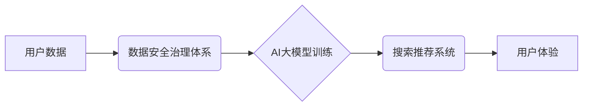

                 

## AI大模型重构电商搜索推荐的数据安全治理体系

> 关键词：AI大模型、电商搜索推荐、数据安全治理、隐私保护、可解释性、安全评估、联邦学习

### 1. 背景介绍

电商平台的搜索推荐系统是用户获取商品信息和完成购买的重要入口，其精准度和效率直接影响着用户体验和平台商业价值。近年来，随着深度学习技术的快速发展，基于AI大模型的搜索推荐系统逐渐成为行业主流趋势。这些模型能够学习用户行为、商品特征等海量数据，提供个性化、精准的推荐结果，显著提升用户满意度和转化率。

然而，AI大模型的训练和应用也带来了新的数据安全挑战。这些模型通常需要训练海量用户数据，存在数据泄露、隐私侵犯、算法偏见等风险。同时，模型本身的复杂性也使得其行为难以解释，难以进行安全评估和责任追溯。

因此，构建一个安全可靠的数据安全治理体系，是保障AI大模型在电商搜索推荐领域的健康发展和可持续应用的关键。

### 2. 核心概念与联系

**2.1 核心概念**

* **AI大模型:** 指规模庞大、参数数量众多的深度学习模型，具备强大的学习和推理能力，能够处理复杂的数据模式和任务。
* **电商搜索推荐:** 指电商平台根据用户搜索行为、浏览历史、购买记录等信息，推荐相关商品的系统。
* **数据安全治理:** 指围绕数据安全进行的管理、控制和保障体系，旨在保护数据安全和隐私，确保数据合法合规的使用。

**2.2 架构关系**



**2.3 核心联系**

电商搜索推荐系统基于AI大模型，需要大量用户数据进行训练和优化。数据安全治理体系是保障用户数据安全和隐私，确保AI大模型安全可靠运行的基础。

### 3. 核心算法原理 & 具体操作步骤

**3.1 算法原理概述**

基于AI大模型的电商搜索推荐系统通常采用以下核心算法：

* **协同过滤:** 根据用户的历史行为和商品的相似度进行推荐。
* **内容过滤:** 根据商品的特征和用户的偏好进行推荐。
* **深度学习:** 利用深度神经网络学习用户行为和商品特征之间的复杂关系，进行个性化推荐。

**3.2 算法步骤详解**

以深度学习算法为例，其具体步骤如下：

1. **数据预处理:** 收集用户行为数据、商品特征数据等，进行清洗、转换、编码等预处理操作。
2. **模型构建:** 选择合适的深度学习模型架构，例如Transformer、BERT等，并根据任务需求进行参数调整。
3. **模型训练:** 利用训练数据训练模型，并通过评估指标（例如准确率、召回率等）进行模型性能评估。
4. **模型部署:** 将训练好的模型部署到线上环境，用于实时推荐。
5. **模型监控:** 持续监控模型的性能和安全，并进行模型更新和维护。

**3.3 算法优缺点**

* **优点:** 能够学习用户行为和商品特征之间的复杂关系，提供个性化、精准的推荐结果。
* **缺点:** 需要海量数据进行训练，训练成本高；模型复杂度高，难以解释和调试；存在数据泄露、隐私侵犯等风险。

**3.4 算法应用领域**

* **电商推荐:** 推荐商品、优惠券、促销活动等。
* **内容推荐:** 推荐新闻、视频、音乐等内容。
* **广告推荐:** 推荐精准广告，提高广告转化率。

### 4. 数学模型和公式 & 详细讲解 & 举例说明

**4.1 数学模型构建**

假设我们有一个电商平台，用户集合为U，商品集合为I。用户u对商品i的评分为r<sub>ui</sub>。我们的目标是构建一个数学模型，能够预测用户u对商品i的评分。

我们可以使用协同过滤算法构建一个矩阵分解模型，将用户评分矩阵分解成两个低维矩阵：用户特征矩阵X和商品特征矩阵Y。

**4.2 公式推导过程**

模型的目标函数为：

$$
L(X, Y) = \sum_{u \in U, i \in I} (r_{ui} - \hat{r}_{ui})^2
$$

其中，$\hat{r}_{ui}$ 为模型预测的用户u对商品i的评分，由用户特征和商品特征的内积计算得到：

$$
\hat{r}_{ui} = x_u^T y_i
$$

模型训练过程就是通过优化目标函数，找到最优的用户特征矩阵X和商品特征矩阵Y。

**4.3 案例分析与讲解**

假设用户A对商品1评分为4，对商品2评分为3，用户B对商品1评分为5，对商品2评分为4。我们可以构建一个用户评分矩阵：

```
     商品1 商品2
用户A  4      3
用户B  5      4
```

通过矩阵分解模型，我们可以将这个矩阵分解成两个低维矩阵，例如：

* 用户特征矩阵X：

```
     特征1 特征2
用户A  0.8  -0.5
用户B  -0.5  0.8
```

* 商品特征矩阵Y：

```
     特征1 特征2
商品1  0.6  0.3
商品2  -0.3  0.6
```

通过计算用户特征和商品特征的内积，我们可以预测用户A对商品2的评分：

$$
\hat{r}_{A2} = x_A^T y_2 = (0.8, -0.5) \cdot (-0.3, 0.6) = -0.24 + 0.3 = 0.06
$$

### 5. 项目实践：代码实例和详细解释说明

**5.1 开发环境搭建**

* 操作系统：Linux
* Python版本：3.7+
* 深度学习框架：TensorFlow或PyTorch
* 其他依赖库：NumPy、pandas、scikit-learn等

**5.2 源代码详细实现**

```python
import tensorflow as tf

# 定义模型架构
model = tf.keras.Sequential([
    tf.keras.layers.Embedding(input_dim=vocab_size, output_dim=embedding_dim),
    tf.keras.layers.LSTM(units=hidden_units),
    tf.keras.layers.Dense(units=1)
])

# 编译模型
model.compile(optimizer='adam', loss='mse')

# 训练模型
model.fit(X_train, y_train, epochs=10, batch_size=32)

# 评估模型
loss = model.evaluate(X_test, y_test)
print('Loss:', loss)
```

**5.3 代码解读与分析**

* 该代码示例使用TensorFlow框架构建了一个基于LSTM的电商推荐模型。
* 模型输入为用户和商品的embedding向量，输出为用户对商品的评分预测。
* 模型使用Adam优化器和均方误差损失函数进行训练。
* 训练完成后，模型可以用于预测用户对新商品的评分。

**5.4 运行结果展示**

训练完成后，可以将模型部署到线上环境，并通过A/B测试等方式评估模型的性能。

### 6. 实际应用场景

**6.1 个性化商品推荐**

AI大模型可以根据用户的历史购买记录、浏览行为、兴趣偏好等信息，推荐个性化的商品，提升用户体验和转化率。

**6.2 内容推荐**

AI大模型可以根据用户的阅读习惯、观看历史、点赞行为等信息，推荐个性化的新闻、视频、音乐等内容，满足用户的个性化需求。

**6.3 广告推荐**

AI大模型可以根据用户的兴趣爱好、消费习惯、行为特征等信息，推荐精准的广告，提高广告转化率。

**6.4 未来应用展望**

随着AI技术的不断发展，AI大模型在电商搜索推荐领域的应用场景将更加广泛，例如：

* **多模态推荐:** 结合文本、图像、视频等多模态数据进行推荐，提供更丰富的用户体验。
* **实时推荐:** 利用实时数据流进行动态推荐，满足用户瞬时需求。
* **跨平台推荐:** 打破平台边界，实现用户在不同平台的个性化推荐。

### 7. 工具和资源推荐

**7.1 学习资源推荐**

* **书籍:**
    * 《深度学习》
    * 《机器学习实战》
    * 《自然语言处理入门》
* **在线课程:**
    * Coursera深度学习课程
    * Udacity机器学习工程师课程
    * fast.ai深度学习课程

**7.2 开发工具推荐**

* **深度学习框架:** TensorFlow、PyTorch、Keras
* **数据处理工具:** Pandas、NumPy
* **云计算平台:** AWS、Azure、GCP

**7.3 相关论文推荐**

* 《Attention Is All You Need》
* 《BERT: Pre-training of Deep Bidirectional Transformers for Language Understanding》
* 《Recurrent Neural Network for Sequence Prediction》

### 8. 总结：未来发展趋势与挑战

**8.1 研究成果总结**

AI大模型在电商搜索推荐领域取得了显著成果，能够提供个性化、精准的推荐结果，提升用户体验和商业价值。

**8.2 未来发展趋势**

* **模型规模和能力提升:** 模型参数规模将进一步扩大，模型能力将更加强大，能够处理更复杂的任务。
* **多模态融合:** 将文本、图像、视频等多模态数据融合，提供更丰富的用户体验。
* **可解释性增强:** 研究更可解释的AI模型，提高模型透明度和可信度。

**8.3 面临的挑战**

* **数据安全和隐私保护:** AI模型训练需要海量数据，如何保障数据安全和隐私是关键挑战。
* **算法偏见和公平性:** AI模型可能存在算法偏见，导致推荐结果不公平，需要研究解决算法偏见的方法。
* **模型可解释性和信任度:** AI模型的复杂性使得其行为难以解释，如何提高模型可解释性和信任度是未来研究方向。

**8.4 研究展望**

未来，AI大模型在电商搜索推荐领域的应用将更加广泛和深入，需要不断探索新的算法、模型和技术，解决数据安全、隐私保护、算法偏见等挑战，构建一个安全可靠、公平公正、可解释透明的AI推荐体系。

### 9. 附录：常见问题与解答

**9.1 如何保障用户数据安全？**

* 数据加密：对用户数据进行加密存储和传输，防止数据泄露。
* 数据匿名化：对用户数据进行匿名处理，保护用户隐私。
* 数据访问控制：对用户数据进行严格的访问控制，防止未授权访问。

**9.2 如何解决算法偏见问题？**

* 数据多样化：使用更加多样化的训练数据，减少算法偏见。
* 算法公平性评估：使用公平性评估指标，评估算法是否存在偏见。
* 算法调优：通过算法调优，减少算法偏见的影响。

**9.3 如何提高模型可解释性？**

* 使用可解释的模型架构：选择更加可解释的模型架构，例如线性模型、决策树等。
* 模型解释方法：使用模型解释方法，例如LIME、SHAP等，解释模型的决策过程。
* 可视化技术：使用可视化技术，展示模型的内部结构和决策过程。


作者：禅与计算机程序设计艺术 / Zen and the Art of Computer Programming 
<end_of_turn>

