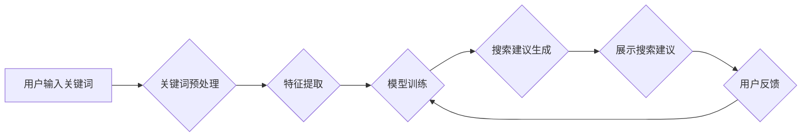

                 

## AI如何优化电商平台的搜索建议功能

> 关键词：电商平台、搜索建议、人工智能、自然语言处理、推荐系统、机器学习、深度学习、用户体验

## 1. 背景介绍

在当今数字经济时代，电商平台已成为人们购物的首选方式。高效便捷的搜索体验是电商平台用户体验的关键因素之一。搜索建议功能作为电商平台搜索体验的重要组成部分，能够帮助用户快速找到所需商品，提升用户购物效率和满意度。传统的搜索建议功能主要依赖于关键词匹配和规则引擎，其推荐结果往往缺乏个性化和精准度，难以满足用户日益增长的需求。

随着人工智能技术的快速发展，特别是自然语言处理（NLP）和推荐系统的进步，AI技术为电商平台搜索建议功能的优化提供了新的机遇。AI驱动的搜索建议功能能够通过分析用户搜索行为、商品信息和平台数据，提供更精准、更个性化的搜索建议，从而提升用户体验和平台商业价值。

## 2. 核心概念与联系

### 2.1 搜索建议系统

搜索建议系统是指在用户输入搜索关键词时，根据用户历史搜索行为、商品信息、平台数据等，实时推荐相关商品或关键词的系统。其核心目标是帮助用户快速找到所需信息，提升用户搜索体验。

### 2.2 人工智能与搜索建议

人工智能技术，特别是机器学习和深度学习，为搜索建议系统的优化提供了强大的工具。

* **机器学习**：通过训练模型，学习用户搜索行为模式，预测用户搜索意图，并推荐相关的商品或关键词。
* **深度学习**：利用神经网络结构，能够更深入地理解用户搜索意图，并提供更精准的搜索建议。

### 2.3 核心架构

**Mermaid 流程图**



**核心架构说明：**

1. **用户输入关键词：** 用户在搜索框中输入关键词。
2. **关键词预处理：** 对用户输入的关键词进行预处理，例如去除停用词、词形还原等，以便后续的特征提取和模型训练。
3. **特征提取：** 从用户输入的关键词、历史搜索行为、商品信息、平台数据等中提取特征，例如关键词频率、商品类别、用户购买历史等。
4. **模型训练：** 利用机器学习或深度学习算法，训练模型，学习用户搜索行为模式和商品特征之间的关系。
5. **搜索建议生成：** 根据训练好的模型，对用户输入的关键词进行预测，并生成相关的商品或关键词建议。
6. **展示搜索建议：** 将生成的搜索建议展示给用户，例如在搜索框下方或搜索结果页面上。
7. **用户反馈：** 用户对搜索建议进行反馈，例如点击、忽略等，这些反馈信息将被收集并用于模型的后续训练，不断优化搜索建议的精准度和个性化程度。

## 3. 核心算法原理 & 具体操作步骤

### 3.1 算法原理概述

搜索建议系统常用的算法包括：

* **基于关键词匹配的算法：** 这种算法简单易实现，主要通过计算用户输入关键词与商品标题、描述等文本的相似度来生成搜索建议。
* **基于统计模型的算法：** 这种算法利用用户历史搜索行为和商品浏览数据，统计出用户搜索关键词和商品之间的关联关系，并根据统计结果生成搜索建议。
* **基于机器学习的算法：** 这种算法利用机器学习算法，例如协同过滤、内容过滤等，学习用户搜索行为模式和商品特征之间的关系，并根据学习到的知识生成更精准的搜索建议。
* **基于深度学习的算法：** 这种算法利用深度学习算法，例如循环神经网络（RNN）、Transformer等，能够更深入地理解用户搜索意图，并生成更个性化的搜索建议。

### 3.2 算法步骤详解

以基于机器学习的协同过滤算法为例，详细说明其步骤：

1. **数据收集：** 收集用户历史搜索行为、商品信息、用户购买历史等数据。
2. **数据预处理：** 对收集到的数据进行清洗、转换、编码等预处理，以便后续的模型训练。
3. **特征提取：** 从用户历史搜索行为、商品信息等数据中提取特征，例如用户喜欢的商品类别、用户浏览过的商品等。
4. **模型训练：** 利用协同过滤算法，训练模型，学习用户和商品之间的关联关系。
5. **搜索建议生成：** 当用户输入关键词时，根据训练好的模型，预测用户可能感兴趣的商品，并生成搜索建议。

### 3.3 算法优缺点

**协同过滤算法的优点：**

* 能够发现用户和商品之间的隐性关联关系。
* 能够生成个性化的搜索建议。

**协同过滤算法的缺点：**

* 需要大量的用户数据才能训练出准确的模型。
* 当新用户或新商品加入平台时，模型的准确性可能会下降。

### 3.4 算法应用领域

协同过滤算法广泛应用于电商平台的搜索建议、推荐系统、用户画像分析等领域。

## 4. 数学模型和公式 & 详细讲解 & 举例说明

### 4.1 数学模型构建

协同过滤算法的核心是构建用户-商品交互矩阵，其中每个元素表示用户对商品的评分或行为。

**用户-商品交互矩阵：**

```
| 用户1 | 商品1 | 商品2 | 商品3 |
|---|---|---|---|
| 5 | 3 | 2 | 4 |
| 4 | 2 | 5 | 1 |
| 3 | 1 | 4 | 3 |
```

其中，数字表示用户对商品的评分或行为，例如购买、收藏、浏览等。

### 4.2 公式推导过程

协同过滤算法的目标是预测用户对未交互过的商品的评分或行为。常用的协同过滤算法包括基于用户的协同过滤和基于物品的协同过滤。

**基于用户的协同过滤：**

预测用户u对商品i的评分，可以使用以下公式：

$$
\hat{r}_{ui} = \bar{r}_u + \frac{\sum_{v \in N(u)} (r_{uv} - \bar{r}_v) \cdot s_{uv}}{\sum_{v \in N(u)} s_{uv}}
$$

其中：

* $\hat{r}_{ui}$：预测用户u对商品i的评分。
* $\bar{r}_u$：用户u的平均评分。
* $r_{uv}$：用户u对商品v的评分。
* $\bar{r}_v$：商品v的平均评分。
* $s_{uv}$：用户u和用户v的相似度。
* $N(u)$：与用户u相似的用户集合。

**基于物品的协同过滤：**

预测用户u对商品i的评分，可以使用以下公式：

$$
\hat{r}_{ui} = \bar{r}_i + \frac{\sum_{v \in N(i)} (r_{uv} - \bar{r}_v) \cdot s_{iv}}{\sum_{v \in N(i)} s_{iv}}
$$

其中：

* $\hat{r}_{ui}$：预测用户u对商品i的评分。
* $\bar{r}_i$：商品i的平均评分。
* $r_{uv}$：用户u对商品v的评分。
* $\bar{r}_v$：商品v的平均评分。
* $s_{iv}$：商品i和商品v的相似度。
* $N(i)$：与商品i相似的商品集合。

### 4.3 案例分析与讲解

假设用户A喜欢商品1和商品3，用户B喜欢商品2和商品3，那么根据协同过滤算法，我们可以预测用户A可能也喜欢商品2，因为用户A和用户B都喜欢商品3。

## 5. 项目实践：代码实例和详细解释说明

### 5.1 开发环境搭建

* Python 3.x
* scikit-learn
* pandas
* numpy

### 5.2 源代码详细实现

```python
import pandas as pd
from sklearn.metrics.pairwise import cosine_similarity

# 加载用户-商品交互数据
data = pd.read_csv('user_item_data.csv')

# 计算用户之间的相似度
user_similarity = cosine_similarity(data.T)

# 预测用户对商品的评分
def predict_rating(user_id, item_id):
    # 获取用户u的相似用户集合
    similar_users = user_similarity[user_id].argsort()[:-10:-1]
    # 计算用户u对商品i的预测评分
    predicted_rating = 0
    for similar_user in similar_users:
        if data.loc[similar_user, item_id] is not None:
            predicted_rating += data.loc[similar_user, item_id] * user_similarity[user_id][similar_user]
    return predicted_rating / sum(user_similarity[user_id][similar_users])

# 示例：预测用户1对商品4的评分
predicted_rating = predict_rating(0, 3)
print(f'用户1对商品4的预测评分：{predicted_rating}')
```

### 5.3 代码解读与分析

* 代码首先加载用户-商品交互数据，并使用cosine_similarity函数计算用户之间的相似度。
* `predict_rating`函数用于预测用户对商品的评分。该函数首先获取用户u的相似用户集合，然后计算用户u对商品i的预测评分，并返回预测评分。
* 示例代码演示了如何使用`predict_rating`函数预测用户1对商品4的评分。

### 5.4 运行结果展示

运行代码后，将输出用户1对商品4的预测评分。

## 6. 实际应用场景

### 6.1 个性化推荐

AI驱动的搜索建议功能能够根据用户的搜索历史、浏览记录、购买行为等数据，个性化推荐商品，提升用户购物体验。

### 6.2 搜索结果优化

AI算法能够分析用户搜索意图，并根据搜索结果的 relevance 和 popularity 进行排序，提升搜索结果的精准度和用户满意度。

### 6.3 新商品推广

AI算法能够分析用户对新商品的潜在兴趣，并推荐新商品给相关用户，帮助电商平台推广新商品。

### 6.4 跨界推荐

AI算法能够分析用户对不同商品类别之间的关联关系，并推荐跨界商品，拓展用户的购物范围。

### 6.4 未来应用展望

未来，AI驱动的搜索建议功能将更加智能化、个性化和精准化。例如：

* 利用自然语言理解技术，更深入地理解用户的搜索意图。
* 利用多模态数据，例如图片、视频等，提供更丰富的搜索建议。
* 利用强化学习算法，不断优化搜索建议的精准度和用户满意度。

## 7. 工具和资源推荐

### 7.1 学习资源推荐

* **书籍：**
    * 《推荐系统实践》
    * 《深度学习》
* **在线课程：**
    * Coursera: Machine Learning
    * Udacity: Deep Learning Nanodegree

### 7.2 开发工具推荐

* **Python:** 
    * scikit-learn
    * TensorFlow
    * PyTorch
* **数据库:** 
    * MySQL
    * MongoDB

### 7.3 相关论文推荐

* **协同过滤算法：**
    * "Collaborative Filtering for Implicit Feedback Datasets"
    * "Matrix Factorization Techniques for Recommender Systems"
* **深度学习推荐系统：**
    * "Deep Learning Recommendations for Everyone"
    * "Neural Collaborative Filtering"

## 8. 总结：未来发展趋势与挑战

### 8.1 研究成果总结

AI技术为电商平台搜索建议功能的优化提供了强大的工具，能够提升用户体验和平台商业价值。协同过滤算法和深度学习算法是常用的搜索建议算法，能够生成个性化、精准的搜索建议。

### 8.2 未来发展趋势

未来，AI驱动的搜索建议功能将更加智能化、个性化和精准化。例如：

* 利用自然语言理解技术，更深入地理解用户的搜索意图。
* 利用多模态数据，例如图片、视频等，提供更丰富的搜索建议。
* 利用强化学习算法，不断优化搜索建议的精准度和用户满意度。

### 8.3 面临的挑战

* 数据质量和隐私保护：AI算法依赖于高质量的数据，而电商平台的数据往往存在噪声、缺失等问题。同时，用户隐私保护也是一个重要的挑战。
* 计算资源和模型复杂度：深度学习算法的训练需要大量的计算资源，并且模型的复杂度也越来越高。
* 算法解释性和可解释性：深度学习算法的决策过程往往难以解释，这可能会导致用户对搜索建议结果的信任度降低。

### 8.4 研究展望

未来，需要进一步研究以下问题：

* 如何提高AI算法对用户搜索意图的理解能力？
* 如何利用多模态数据来提供更丰富的搜索建议？
* 如何设计更简洁、高效、可解释的深度学习模型？
* 如何更好地解决数据质量和隐私保护问题？


## 9. 附录：常见问题与解答

**Q1：协同过滤算法的缺点是什么？**

**A1：** 协同过滤算法的缺点包括：

* 需要大量的用户数据才能训练出准确的模型。
* 当新用户或新商品加入平台时，模型的准确性可能会下降。
* 容易受到数据稀疏性的影响。

**Q2：深度学习推荐系统有哪些优势？**

**A2：** 深度学习推荐系统相比传统推荐系统具有以下优势：

* 能够学习更复杂的特征关系。
* 能够处理海量数据。
* 能够进行个性化推荐。

**Q3：如何解决AI算法的解释性和可解释性问题？**

**A3：** 

* 使用可解释的机器学习模型，例如决策树、线性回归等。
* 使用模型解释技术，例如SHAP值、LIME等，解释模型的决策过程。
* 设计可交互的解释界面，帮助用户理解模型的推荐结果。


作者：禅与计算机程序设计艺术 / Zen and the Art of Computer Programming 
<end_of_turn>

