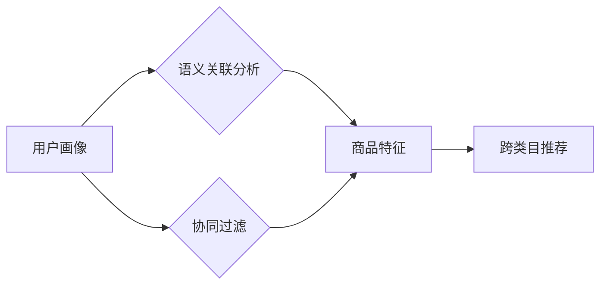

                 

## AI如何改善电商平台的跨类目推荐

> 关键词：跨类目推荐、电商平台、人工智能、协同过滤、深度学习、用户画像、推荐系统

## 1. 背景介绍

电商平台的推荐系统是用户体验和商业成功的关键因素。传统的推荐系统主要基于用户历史行为或商品属性进行单类目推荐，但随着电商平台商品种类和用户需求的多样化，单类目推荐的局限性日益凸显。跨类目推荐，即推荐用户可能感兴趣的跨越不同商品类别或主题的商品，能够有效提升用户购物体验，挖掘潜在需求，促进平台销售额增长。

然而，跨类目推荐面临着诸多挑战：

* **数据稀疏性:** 用户跨类目购买行为数据相对稀疏，难以准确捕捉用户潜在兴趣。
* **类别间语义关联性:** 不同商品类别之间语义关联性较弱，难以挖掘潜在的关联关系。
* **个性化推荐:** 跨类目推荐需要考虑用户个性化偏好，并提供更精准的推荐结果。

## 2. 核心概念与联系

跨类目推荐的核心在于挖掘用户潜在兴趣，并根据用户画像和商品特征进行跨类别商品关联分析。

**2.1 核心概念**

* **用户画像:** 通过用户历史行为、偏好、属性等信息构建用户画像，刻画用户的兴趣、需求和购买习惯。
* **商品特征:**  提取商品的属性、类别、描述、评论等信息，构建商品特征向量，用于描述商品的属性和语义。
* **语义关联分析:**  利用自然语言处理技术，分析商品描述、评论等文本信息，挖掘商品之间的语义关联关系。
* **协同过滤:**  根据用户对不同商品的评分或购买行为，预测用户对其他商品的兴趣。

**2.2 架构图**



## 3. 核心算法原理 & 具体操作步骤

### 3.1 算法原理概述

跨类目推荐算法通常结合协同过滤和深度学习技术，通过挖掘用户行为和商品特征之间的关联关系，预测用户对跨类目商品的兴趣。

* **协同过滤:** 基于用户对商品的评分或购买行为，预测用户对其他商品的兴趣。协同过滤算法可以分为基于用户的协同过滤和基于物品的协同过滤。
* **深度学习:** 利用深度神经网络，学习用户行为和商品特征之间的复杂映射关系，提高推荐精准度。

### 3.2 算法步骤详解

1. **数据预处理:** 收集用户行为数据、商品特征数据，并进行清洗、转换、编码等预处理操作。
2. **用户画像构建:** 利用用户历史行为、偏好、属性等信息，构建用户画像，刻画用户的兴趣、需求和购买习惯。
3. **商品特征提取:**  提取商品的属性、类别、描述、评论等信息，构建商品特征向量，用于描述商品的属性和语义。
4. **语义关联分析:**  利用自然语言处理技术，分析商品描述、评论等文本信息，挖掘商品之间的语义关联关系。
5. **模型训练:**  根据用户画像、商品特征和语义关联关系，训练协同过滤或深度学习模型，预测用户对跨类目商品的兴趣。
6. **推荐结果生成:**  根据模型预测结果，生成跨类目商品推荐列表，并根据用户偏好进行排序。

### 3.3 算法优缺点

**优点:**

* 能够挖掘用户潜在兴趣，推荐更精准的跨类目商品。
* 能够提升用户购物体验，促进平台销售额增长。

**缺点:**

* 数据稀疏性问题难以解决，需要大量数据进行训练。
* 模型训练复杂，需要专业的技术人员进行开发和维护。

### 3.4 算法应用领域

跨类目推荐算法广泛应用于电商平台、内容推荐平台、社交媒体平台等领域，例如：

* **电商平台:**  推荐跨类目商品，例如推荐用户可能感兴趣的服装搭配、电子产品配件等。
* **内容推荐平台:**  推荐跨类别内容，例如推荐用户可能感兴趣的新闻、视频、音乐等。
* **社交媒体平台:**  推荐跨类别好友，例如推荐用户可能感兴趣的兴趣小组、活动等。

## 4. 数学模型和公式 & 详细讲解 & 举例说明

### 4.1 数学模型构建

跨类目推荐算法通常采用矩阵分解模型，将用户-商品交互矩阵分解成用户特征矩阵和商品特征矩阵。

**用户-商品交互矩阵:**

$$
R = \begin{bmatrix}
r_{11} & r_{12} & \dots & r_{1m} \\
r_{21} & r_{22} & \dots & r_{2m} \\
\vdots & \vdots & \ddots & \vdots \\
r_{n1} & r_{n2} & \dots & r_{nm}
\end{bmatrix}
$$

其中，$r_{ij}$ 表示用户 $i$ 对商品 $j$ 的评分或购买行为。

**用户特征矩阵:**

$$
P = \begin{bmatrix}
p_{11} & p_{12} & \dots & p_{1k} \\
p_{21} & p_{22} & \dots & p_{2k} \\
\vdots & \vdots & \ddots & \vdots \\
p_{n1} & p_{n2} & \dots & p_{nk}
\end{bmatrix}
$$

其中，$p_{ij}$ 表示用户 $i$ 在第 $j$ 个特征上的值。

**商品特征矩阵:**

$$
Q = \begin{bmatrix}
q_{11} & q_{12} & \dots & q_{1k} \\
q_{21} & q_{22} & \dots & q_{2k} \\
\vdots & \vdots & \ddots & \vdots \\
q_{m1} & q_{m2} & \dots & q_{mk}
\end{bmatrix}
$$

其中，$q_{ij}$ 表示商品 $j$ 在第 $i$ 个特征上的值。

### 4.2 公式推导过程

目标是学习用户特征矩阵 $P$ 和商品特征矩阵 $Q$，使得预测的用户-商品交互矩阵 $R'$ 与真实的用户-商品交互矩阵 $R$ 的误差最小。

$$
R' = P \cdot Q^T
$$

常用的损失函数是均方误差 (MSE):

$$
Loss = \frac{1}{2} \sum_{i=1}^{n} \sum_{j=1}^{m} (r_{ij} - r'_{ij})^2
$$

通过梯度下降算法，更新 $P$ 和 $Q$ 的值，最小化损失函数。

### 4.3 案例分析与讲解

假设用户 $A$ 对商品 $X$ 和 $Y$ 都评分为 5，而用户 $B$ 对商品 $Y$ 和 $Z$ 都评分为 4。

通过矩阵分解模型，可以学习到用户 $A$ 和 $B$ 的特征，以及商品 $X$、$Y$ 和 $Z$ 的特征。

根据学习到的特征，模型可以预测用户 $A$ 对商品 $Z$ 的评分，以及用户 $B$ 对商品 $X$ 的评分。

## 5. 项目实践：代码实例和详细解释说明

### 5.1 开发环境搭建

* Python 3.x
* TensorFlow 或 PyTorch
* Pandas
* Scikit-learn

### 5.2 源代码详细实现

```python
import tensorflow as tf

# 定义用户-商品交互矩阵
ratings = tf.constant([[5, 5, 0],
                      [0, 4, 4],
                      [0, 0, 5]])

# 定义用户特征矩阵和商品特征矩阵
user_features = tf.Variable(tf.random.normal([3, 2]))
item_features = tf.Variable(tf.random.normal([3, 2]))

# 计算预测评分
predictions = tf.matmul(user_features, tf.transpose(item_features))

# 定义损失函数
loss = tf.reduce_mean(tf.square(ratings - predictions))

# 定义优化器
optimizer = tf.keras.optimizers.Adam()

# 训练模型
for epoch in range(100):
    with tf.GradientTape() as tape:
        loss_value = loss
    gradients = tape.gradient(loss_value, [user_features, item_features])
    optimizer.apply_gradients(zip(gradients, [user_features, item_features]))

# 打印预测结果
print(predictions)
```

### 5.3 代码解读与分析

* 代码首先定义了用户-商品交互矩阵、用户特征矩阵和商品特征矩阵。
* 然后，使用矩阵乘法计算预测评分。
* 定义了均方误差作为损失函数，并使用Adam优化器进行模型训练。
* 训练完成后，打印预测结果。

### 5.4 运行结果展示

运行代码后，可以得到预测评分矩阵，其中每个元素表示模型预测的用户对商品的评分。

## 6. 实际应用场景

跨类目推荐算法在电商平台的实际应用场景非常广泛，例如：

* **商品搭配推荐:**  根据用户购买历史，推荐用户可能感兴趣的搭配商品，例如推荐用户购买的T恤搭配合适的裤子或鞋子。
* **个性化推荐:**  根据用户画像和偏好，推荐用户可能感兴趣的跨类目商品，例如推荐喜欢运动的用户运动装备、户外用品等。
* **新品推荐:**  根据用户兴趣和市场趋势，推荐平台最新上线的跨类目商品，例如推荐用户可能感兴趣的新款手机、电子产品等。

### 6.4 未来应用展望

随着人工智能技术的不断发展，跨类目推荐算法将更加精准、个性化。未来，跨类目推荐算法可能应用于以下领域：

* **个性化内容推荐:**  推荐用户可能感兴趣的跨类别内容，例如推荐用户可能感兴趣的新闻、视频、音乐等。
* **跨平台推荐:**  跨平台推荐用户可能感兴趣的商品或内容，例如推荐用户在电商平台购买的商品，在社交媒体平台上可能感兴趣的同类商品或内容。
* **智能客服:**  利用跨类目推荐算法，帮助智能客服推荐用户可能需要的商品或服务。

## 7. 工具和资源推荐

### 7.1 学习资源推荐

* **书籍:**
    * 《推荐系统实践》
    * 《深度学习》
* **在线课程:**
    * Coursera: Recommender Systems
    * Udacity: Deep Learning Nanodegree

### 7.2 开发工具推荐

* **Python:**  Python 是机器学习和深度学习的常用编程语言。
* **TensorFlow:**  TensorFlow 是 Google 开发的开源机器学习框架。
* **PyTorch:**  PyTorch 是 Facebook 开发的开源机器学习框架。

### 7.3 相关论文推荐

* **Collaborative Filtering for Implicit Feedback Datasets**
* **Deep Learning for Recommender Systems**
* **Neural Collaborative Filtering**

## 8. 总结：未来发展趋势与挑战

### 8.1 研究成果总结

跨类目推荐算法在电商平台的应用取得了显著成果，能够有效提升用户购物体验和平台销售额增长。

### 8.2 未来发展趋势

* **更精准的推荐:**  利用更先进的深度学习算法和个性化模型，提高推荐精准度。
* **更丰富的推荐场景:**  将跨类目推荐应用于更多场景，例如内容推荐、跨平台推荐等。
* **更智能的推荐:**  结合自然语言处理、知识图谱等技术，实现更智能的跨类目推荐。

### 8.3 面临的挑战

* **数据稀疏性:**  跨类目商品数据稀疏性问题仍然是一个挑战，需要探索新的数据挖掘和模型训练方法。
* **模型解释性:**  深度学习模型的解释性较差，需要研究更可解释的跨类目推荐算法。
* **用户隐私保护:**  跨类目推荐算法需要处理大量用户数据，需要加强用户隐私保护。

### 8.4 研究展望

未来，跨类目推荐算法将继续朝着更精准、更智能、更可解释的方向发展，为用户提供更个性化、更丰富的购物体验。


## 9. 附录：常见问题与解答

**1. 跨类目推荐和传统推荐有什么区别？**

传统推荐通常基于用户历史行为或商品属性进行单类目推荐，而跨类目推荐则试图挖掘用户潜在兴趣，推荐跨越不同商品类别或主题的商品。

**2. 如何解决跨类目推荐中的数据稀疏性问题？**

可以采用以下方法解决数据稀疏性问题：

* 利用协同过滤技术，挖掘用户之间和商品之间的关联关系。
* 利用深度学习技术，学习用户行为和商品特征之间的复杂映射关系。
* 利用外部数据，例如商品类别信息、用户画像等，丰富数据信息。

**3. 如何评估跨类目推荐算法的性能？**

常用的评估指标包括：

* **准确率:**  推荐结果与用户真实行为的匹配度。
* **召回率:**  推荐结果覆盖用户真实行为的比例。
* **点击率:**  用户点击推荐结果的比例。
* **转化率:**  用户购买推荐结果的比例。


作者：禅与计算机程序设计艺术 / Zen and the Art of Computer Programming 
<end_of_turn>

