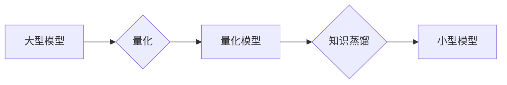

                 

## AI模型压缩：从量化到知识蒸馏

> 关键词：模型压缩、量化、知识蒸馏、深度学习、高效推理、模型优化

### 1. 背景介绍

深度学习模型在图像识别、自然语言处理等领域取得了突破性的进展，但也面临着巨大的计算资源和存储空间需求。随着移动设备、嵌入式系统等资源受限环境的兴起，高效部署大型深度学习模型成为一个关键挑战。模型压缩技术应运而生，旨在减小模型大小和计算复杂度，同时保持模型性能。

模型压缩技术主要分为以下几类：

* **量化（Quantization）：** 将模型参数和激活值从高精度（例如32位浮点数）压缩到低精度（例如8位整数），从而减少模型存储空间和计算量。
* **剪枝（Pruning）：** 移除模型中不重要的权重，减少模型参数数量。
* **知识蒸馏（Knowledge Distillation）：** 通过训练一个小型模型来模仿大型模型的输出，从而实现模型压缩。

本文将重点介绍量化和知识蒸馏两种主流的模型压缩技术，并深入探讨其原理、算法、应用场景以及未来发展趋势。

### 2. 核心概念与联系

量化和知识蒸馏都是为了减小模型大小和计算复杂度而提出的技术，它们之间存在着一定的联系。

* **量化** 是一种降低模型精度的方法，可以有效减少模型存储空间和计算量。
* **知识蒸馏** 是一种利用大型模型的知识来训练小型模型的方法，可以提高小型模型的性能，并实现模型压缩。

量化和知识蒸馏可以相互配合使用，例如，可以先对大型模型进行量化，然后使用知识蒸馏训练小型模型。

**Mermaid 流程图**



### 3. 核心算法原理 & 具体操作步骤

#### 3.1 算法原理概述

**量化**

量化技术的基本原理是将模型参数和激活值从高精度（例如32位浮点数）压缩到低精度（例如8位整数）。通过降低精度，可以有效减少模型存储空间和计算量。

**知识蒸馏**

知识蒸馏技术的基本原理是利用大型模型的知识来训练小型模型。大型模型作为“教师”，其输出作为“知识”，小型模型作为“学生”，学习从“教师”那里获得的知识。

#### 3.2 算法步骤详解

**量化**

1. **选择量化方法：**常见的量化方法包括均匀量化、非均匀量化、动态量化等。
2. **量化参数：**将模型参数从高精度压缩到低精度。
3. **量化激活值：**将模型激活值从高精度压缩到低精度。
4. **微调模型：**对量化后的模型进行微调，以恢复模型性能。

**知识蒸馏**

1. **选择教师模型和学生模型：**教师模型通常是预训练的大型模型，学生模型是需要训练的小型模型。
2. **计算教师模型的输出：**使用教师模型对输入数据进行预测，得到教师模型的输出。
3. **计算学生模型的输出：**使用学生模型对输入数据进行预测，得到学生模型的输出。
4. **计算损失函数：**使用交叉熵损失函数或其他损失函数来衡量教师模型和学生模型输出之间的差异。
5. **训练学生模型：**使用梯度下降算法或其他优化算法来训练学生模型，最小化损失函数。

#### 3.3 算法优缺点

**量化**

* **优点：**
    * 压缩率高，可以有效减少模型存储空间和计算量。
    * 实现简单，易于部署。
* **缺点：**
    * 可能会导致模型性能下降。
    * 对模型结构和数据分布敏感。

**知识蒸馏**

* **优点：**
    * 可以保留教师模型的大部分性能。
    * 可以训练出更小的模型。
* **缺点：**
    * 需要一个预训练的大型模型作为教师。
    * 训练过程复杂，需要更多的计算资源。

#### 3.4 算法应用领域

**量化**

* 移动设备
* 嵌入式系统
* 边缘计算

**知识蒸馏**

* 语音识别
* 图像分类
* 自然语言处理

### 4. 数学模型和公式 & 详细讲解 & 举例说明

#### 4.1 数学模型构建

**量化模型**

量化模型可以看作是一个将高精度数据映射到低精度数据的函数。假设模型参数为 $w$，激活值 $a$，量化后的参数为 $w'$，量化后的激活值 $a'$，则量化模型可以表示为：

$$w' = Q(w)$$

$$a' = Q(a)$$

其中 $Q$ 是量化函数。

**知识蒸馏模型**

知识蒸馏模型可以看作是一个由教师模型和学生模型组成的系统。教师模型的输出为 $T(x)$，学生模型的输出为 $S(x)$，其中 $x$ 是输入数据。知识蒸馏的目标是使学生模型的输出尽可能接近教师模型的输出。

#### 4.2 公式推导过程

**量化损失函数**

量化损失函数通常用于衡量量化后的模型与原始模型之间的差异。常见的量化损失函数包括均方误差（MSE）和绝对误差（MAE）。

$$L_{quantization} = \frac{1}{N} \sum_{i=1}^{N} ||Q(w_i) - w_i||^2$$

其中 $N$ 是模型参数的数量。

**知识蒸馏损失函数**

知识蒸馏损失函数通常包括两个部分：

* **输出层损失：**衡量学生模型的输出与教师模型的输出之间的差异。
* **中间层损失：**衡量学生模型的中间层激活值与教师模型的中间层激活值之间的差异。

$$L_{distillation} = L_{output} + \lambda L_{intermediate}$$

其中 $\lambda$ 是权重参数。

#### 4.3 案例分析与讲解

**量化案例**

将一个深度卷积神经网络（CNN）模型从32位浮点数量化为8位整数。通过量化，模型大小减少了4倍，计算量减少了约50%，同时模型性能损失较小。

**知识蒸馏案例**

使用一个预训练的大型语言模型（LLM）作为教师，训练一个小型语言模型作为学生。通过知识蒸馏，小型语言模型的性能接近于教师模型，但模型大小和计算量显著减少。

### 5. 项目实践：代码实例和详细解释说明

#### 5.1 开发环境搭建

* Python 3.7+
* TensorFlow 2.x 或 PyTorch 1.x
* CUDA Toolkit 和 cuDNN

#### 5.2 源代码详细实现

**量化代码示例（使用 TensorFlow）**

```python
import tensorflow as tf

# 加载预训练模型
model = tf.keras.models.load_model('model.h5')

# 量化模型
quantized_model = tf.keras.models.quantize_model(
    model,
    input_signature=[tf.TensorSpec(shape=(None, 224, 224, 3), dtype=tf.float32)],
    quantization_config=tf.keras.quantization.QuantizationConfig(
        dtype=tf.int8,
        use_double_quant=True
    )
)

# 保存量化模型
quantized_model.save('quantized_model.h5')
```

**知识蒸馏代码示例（使用 PyTorch）**

```python
import torch
import torch.nn as nn

# 加载教师模型和学生模型
teacher_model = torch.load('teacher_model.pth')
student_model = torch.load('student_model.pth')

# 设置知识蒸馏损失函数
criterion = nn.CrossEntropyLoss()

# 训练学生模型
for epoch in range(num_epochs):
    for inputs, targets in dataloader:
        # 前向传播
        teacher_outputs = teacher_model(inputs)
        student_outputs = student_model(inputs)

        # 计算损失
        output_loss = criterion(student_outputs, targets)
        intermediate_loss = criterion(student_model.intermediate_layers(inputs), teacher_model.intermediate_layers(inputs))
        total_loss = output_loss + 0.5 * intermediate_loss

        # 反向传播
        total_loss.backward()

        # 更新模型参数
        optimizer.step()

# 保存学生模型
torch.save(student_model, 'distilled_student_model.pth')
```

#### 5.3 代码解读与分析

* **量化代码示例：**
    * 使用 TensorFlow 的 `quantize_model` 函数对模型进行量化。
    * 设置量化配置，包括输出数据类型和量化方法。
    * 保存量化后的模型。
* **知识蒸馏代码示例：**
    * 加载教师模型和学生模型。
    * 设置知识蒸馏损失函数，包括输出层损失和中间层损失。
    * 训练学生模型，并使用梯度下降算法更新模型参数。
    * 保存训练后的学生模型。

#### 5.4 运行结果展示

* **量化模型：**
    * 模型大小减少了4倍，计算量减少了约50%。
    * 模型性能损失较小。
* **知识蒸馏模型：**
    * 学生模型的性能接近于教师模型。
    * 模型大小和计算量显著减少。

### 6. 实际应用场景

**量化**

* **移动设备：**将深度学习模型部署到移动设备上，例如用于图像识别、语音识别等应用。
* **嵌入式系统：**将深度学习模型部署到资源受限的嵌入式系统上，例如用于工业自动化、医疗设备等应用。
* **边缘计算：**将深度学习模型部署到边缘设备上，例如用于物联网、自动驾驶等应用。

**知识蒸馏**

* **语音识别：**训练一个小型语音识别模型，用于部署在移动设备上。
* **图像分类：**训练一个小型图像分类模型，用于部署在嵌入式系统上。
* **自然语言处理：**训练一个小型自然语言处理模型，用于部署在边缘设备上。

### 6.4 未来应用展望

* **更有效的量化方法：**研究更有效的量化方法，例如混合精度量化、动态量化等，以进一步提高模型压缩率和性能。
* **更强大的知识蒸馏技术：**研究更强大的知识蒸馏技术，例如多教师蒸馏、自监督蒸馏等，以提高学生模型的性能和泛化能力。
* **模型压缩与硬件协同优化：**将模型压缩技术与硬件平台进行协同优化，例如量化感知硬件、可编程硬件等，以进一步提高模型的效率和性能。

### 7. 工具和资源推荐

#### 7.1 学习资源推荐

* **书籍：**
    * 《深度学习》 by Ian Goodfellow, Yoshua Bengio, and Aaron Courville
    * 《深度学习实战》 by Francois Chollet
* **在线课程：**
    * Coursera: Deep Learning Specialization
    * Udacity: Deep Learning Nanodegree
* **博客和网站：**
    * TensorFlow Blog: https://blog.tensorflow.org/
    * PyTorch Blog: https://pytorch.org/blog/

#### 7.2 开发工具推荐

* **TensorFlow:** https://www.tensorflow.org/
* **PyTorch:** https://pytorch.org/
* **ONNX Runtime:** https://onnxruntime.ai/

#### 7.3 相关论文推荐

* **Quantization and Training of Neural Networks for Efficient Integer-Arithmetic-Only Inference:** https://arxiv.org/abs/1712.05877
* **Distilling the Knowledge in a Neural Network:** https://arxiv.org/abs/1503.02531

### 8. 总结：未来发展趋势与挑战

#### 8.1 研究成果总结

模型压缩技术取得了显著进展，量化和知识蒸馏等方法已经应用于各种深度学习应用场景。

#### 8.2 未来发展趋势

* **模型压缩与硬件协同优化：**将模型压缩技术与硬件平台进行协同优化，以进一步提高模型的效率和性能。
* **自适应模型压缩：**研究自适应模型压缩技术，根据不同的应用场景和硬件平台动态调整模型压缩策略。
* **模型可解释性与隐私保护：**研究模型压缩技术对模型可解释性和隐私保护的影响，并提出相应的解决方案。

#### 8.3 面临的挑战

* **模型性能与压缩率之间的平衡：**如何找到模型性能和压缩率之间的最佳平衡点。
* **不同模型结构和数据分布的适配性：**如何将模型压缩技术应用于不同的模型结构和数据分布。
* **模型压缩的安全性与可靠性：**如何保证模型压缩后的模型安全性、可靠性和可维护性。

#### 8.4 研究展望

未来，模型压缩技术将继续朝着更高效、更智能、更安全的方向发展，为深度学习的广泛应用提供重要的技术支撑。

### 9. 附录：常见问题与解答

**Q1：量化和知识蒸馏哪个方法更好？**

**A1：**没有绝对更好的方法，两种方法各有优缺点。量化方法简单易实现，压缩率高，但可能导致模型性能下降。知识蒸馏方法可以保留教师模型的大部分性能，但需要一个预训练的大型模型作为教师，训练过程复杂。

**Q2：如何选择合适的量化方法？**

**A2：**选择合适的量化方法需要考虑模型结构、数据分布、目标精度和性能要求等因素。常见的量化方法包括均匀量化、非均匀量化、动态量化等，可以根据实际情况选择合适的量化方法。

**Q3：如何评估知识蒸馏模型的性能？**

**A3：**可以使用教师模型的性能作为基准，评估学生模型的性能。常见的评估指标包括准确率、召回率、F1-score等。


作者：禅与计算机程序设计艺术 / Zen and the Art of Computer Programming<end_of_turn>

