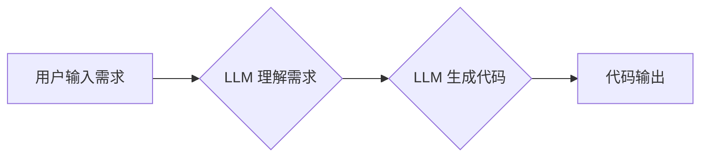

                 

## AI编程新纪元：LLM改变编码方式

> 关键词：LLM, 大语言模型, 代码生成, AI编程, 软件开发, 代码理解, 编程效率

### 1. 背景介绍

软件开发行业正经历着一场前所未有的变革。随着人工智能技术的飞速发展，特别是大语言模型（LLM）的出现，编程方式正在发生根本性的改变。LLM 拥有强大的文本理解和生成能力，能够理解人类的自然语言指令，并将其转化为可执行的代码。这为软件开发带来了前所未有的效率提升和可能性。

传统的软件开发流程通常依赖于人类程序员手动编写代码，这需要大量的学习时间、经验积累和精细操作。而LLM 则可以自动生成代码，简化开发流程，降低开发门槛。

### 2. 核心概念与联系

**2.1  大语言模型 (LLM)**

大语言模型是一种基于深度学习的强大人工智能模型，能够理解和生成人类语言。它们通过训练海量文本数据，学习语言的语法、语义和上下文关系。

**2.2  代码生成**

代码生成是指利用人工智能模型自动生成代码的过程。LLM 通过学习大量的代码数据，能够理解代码的结构和逻辑，并根据用户的需求生成相应的代码。

**2.3  LLM 在代码生成中的应用**

LLM 在代码生成领域展现出巨大的潜力，可以用于以下场景：

* **代码补全:** 根据用户输入的部分代码，自动预测并补全剩余代码。
* **代码生成:** 根据用户描述的功能需求，自动生成完整的代码。
* **代码翻译:** 将代码从一种编程语言翻译成另一种编程语言。
* **代码注释:** 自动生成代码注释，提高代码可读性和维护性。

**2.4  LLM 代码生成流程图**



### 3. 核心算法原理 & 具体操作步骤

**3.1  算法原理概述**

LLM 代码生成的核心算法原理是基于Transformer架构的深度学习模型。Transformer模型通过自注意力机制学习代码的上下文关系，并利用解码器生成代码。

**3.2  算法步骤详解**

1. **数据预处理:** 将代码数据清洗、格式化，并转换为模型可理解的格式。
2. **模型训练:** 使用大量的代码数据训练Transformer模型，使其能够理解代码的语法、语义和上下文关系。
3. **编码阶段:** 将用户输入的需求转换为模型可理解的向量表示。
4. **解码阶段:** 利用训练好的模型解码器，根据编码后的需求生成代码。
5. **代码后处理:** 对生成的代码进行语法检查、格式化等处理，使其成为可执行的代码。

**3.3  算法优缺点**

**优点:**

* **自动化生成代码:** 能够自动生成代码，提高开发效率。
* **降低开发门槛:** 即使没有编程经验的用户也能利用LLM生成代码。
* **代码质量提升:** 通过学习大量的代码数据，LLM 可以生成高质量的代码。

**缺点:**

* **数据依赖:** LLM 的性能依赖于训练数据的质量和数量。
* **可解释性差:** LLM 的决策过程难以理解，难以进行调试和维护。
* **安全风险:** LLM 可能生成包含安全漏洞的代码。

**3.4  算法应用领域**

LLM 代码生成技术在以下领域具有广泛的应用前景:

* **Web 开发:** 自动生成网页代码、API接口代码等。
* **移动应用开发:** 自动生成移动应用代码，跨平台开发。
* **数据科学:** 自动生成数据分析脚本、机器学习模型代码等。
* **游戏开发:** 自动生成游戏场景、游戏逻辑代码等。

### 4. 数学模型和公式 & 详细讲解 & 举例说明

**4.1  数学模型构建**

LLM 代码生成模型通常基于Transformer架构，其核心是自注意力机制。自注意力机制允许模型关注输入序列中的不同位置，学习它们之间的关系。

**4.2  公式推导过程**

自注意力机制的计算公式如下：

$$
Attention(Q, K, V) = softmax(\frac{QK^T}{\sqrt{d_k}})V
$$

其中：

* $Q$：查询矩阵
* $K$：键矩阵
* $V$：值矩阵
* $d_k$：键向量的维度
* $softmax$：softmax 函数

**4.3  案例分析与讲解**

假设我们有一个句子“我爱吃苹果”，将其转换为词向量表示，然后使用自注意力机制计算每个词与其他词之间的注意力权重。

例如，"我" 与 "苹果" 之间的注意力权重可能较高，因为它们在语义上相关。而 "爱" 与 "吃" 之间的注意力权重也可能较高，因为它们在语法上相关。

通过学习这些注意力权重，LLM 可以更好地理解句子的语义和结构。

### 5. 项目实践：代码实例和详细解释说明

**5.1  开发环境搭建**

* 安装 Python 3.7 或更高版本
* 安装 PyTorch 或 TensorFlow 深度学习框架
* 安装必要的库，例如 transformers、datasets 等

**5.2  源代码详细实现**

```python
from transformers import AutoModelForSeq2SeqLM, AutoTokenizer

# 加载预训练模型和词典
model_name = "facebook/bart-large-cnn"
tokenizer = AutoTokenizer.from_pretrained(model_name)
model = AutoModelForSeq2SeqLM.from_pretrained(model_name)

# 用户输入需求
input_text = "编写一个函数，计算两个整数的和。"

# 将文本转换为模型输入格式
input_ids = tokenizer.encode(input_text, return_tensors="pt")

# 使用模型生成代码
output = model.generate(input_ids)

# 将代码解码为文本
generated_code = tokenizer.decode(output[0], skip_special_tokens=True)

# 打印生成的代码
print(generated_code)
```

**5.3  代码解读与分析**

这段代码使用 Hugging Face 的 transformers 库加载预训练的 BART 模型，并使用该模型生成代码。

* `AutoTokenizer.from_pretrained(model_name)`：加载预训练的词典。
* `AutoModelForSeq2SeqLM.from_pretrained(model_name)`：加载预训练的代码生成模型。
* `tokenizer.encode(input_text, return_tensors="pt")`：将用户输入的文本转换为模型输入格式。
* `model.generate(input_ids)`：使用模型生成代码。
* `tokenizer.decode(output[0], skip_special_tokens=True)`：将生成的代码解码为文本。

**5.4  运行结果展示**

运行这段代码后，将输出一个类似于以下的 Python 代码：

```python
def sum_two_integers(a, b):
  return a + b
```

### 6. 实际应用场景

**6.1  代码补全**

在代码编辑器中，LLM 可以根据用户输入的部分代码，自动预测并补全剩余代码，提高开发效率。

**6.2  代码生成**

开发者可以利用LLM 生成代码片段，例如生成函数定义、类结构、数据库操作代码等，节省开发时间。

**6.3  代码翻译**

LLM 可以将代码从一种编程语言翻译成另一种编程语言，方便跨平台开发。

**6.4  未来应用展望**

LLM 代码生成技术在未来将有更广泛的应用场景，例如：

* **自动生成测试代码:** LLM 可以根据代码生成相应的测试用例，提高代码质量。
* **代码安全分析:** LLM 可以识别代码中的安全漏洞，提高代码安全性。
* **代码文档自动生成:** LLM 可以根据代码自动生成文档，提高代码可读性和维护性。

### 7. 工具和资源推荐

**7.1  学习资源推荐**

* **Hugging Face Transformers:** https://huggingface.co/docs/transformers/index
* **OpenAI Codex:** https://openai.com/blog/openai-codex/
* **DeepMind AlphaCode:** https://deepmind.com/blog/alphacode-open-sourcing-our-ai-for-competitive-programming

**7.2  开发工具推荐**

* **VS Code:** https://code.visualstudio.com/
* **PyCharm:** https://www.jetbrains.com/pycharm/
* **Jupyter Notebook:** https://jupyter.org/

**7.3  相关论文推荐**

* **Attention Is All You Need:** https://arxiv.org/abs/1706.03762
* **BERT: Pre-training of Deep Bidirectional Transformers for Language Understanding:** https://arxiv.org/abs/1810.04805
* **CodeBERT: A Pretrained Language Model for Code:** https://arxiv.org/abs/2005.09972

### 8. 总结：未来发展趋势与挑战

**8.1  研究成果总结**

LLM 代码生成技术取得了显著的进展，能够自动生成高质量的代码，提高开发效率。

**8.2  未来发展趋势**

* **模型规模和性能提升:** 未来 LLMs 将更加强大，能够处理更复杂的任务，生成更精细的代码。
* **代码理解和解释能力增强:** LLMs 将能够更好地理解代码的语义和逻辑，并提供更详细的代码解释。
* **代码安全性和可靠性提升:** LLMs 将能够识别代码中的安全漏洞，并生成更可靠的代码。

**8.3  面临的挑战**

* **数据质量和标注问题:** LLM 的性能依赖于训练数据的质量和数量，高质量的代码数据标注仍然是一个挑战。
* **可解释性和透明度问题:** LLM 的决策过程难以理解，难以进行调试和维护。
* **伦理和安全问题:** LLM 可能被用于生成恶意代码，需要加强伦理和安全方面的研究。

**8.4  研究展望**

未来研究将集中在以下几个方面:

* 开发更强大的 LLMs，提高代码生成质量和效率。
* 研究 LLMs 的可解释性和透明度，使其更易于理解和调试。
* 探索 LLMs 在代码安全、代码文档自动生成等领域的应用。


### 9. 附录：常见问题与解答

**9.1  LLM 代码生成是否会取代程序员？**

LLM 代码生成技术可以提高开发效率，但不会完全取代程序员。程序员仍然需要负责代码设计、架构、测试和维护等工作，而 LLMs 则可以帮助程序员完成一些重复性的代码生成任务。

**9.2  LLM 代码生成生成的代码质量如何？**

LLM 代码生成技术已经取得了显著的进展，生成的代码质量越来越高。但由于 LLMs 仍然是机器学习模型，生成的代码可能存在一些错误或缺陷，需要程序员进行检查和修正。

**9.3  如何使用 LLM 代码生成技术？**

可以使用 Hugging Face transformers 库等工具加载预训练的 LLMs，并根据需求生成代码。

**9.4  LLM 代码生成技术有哪些应用场景？**

LLM 代码生成技术可以应用于代码补全、代码生成、代码翻译、代码安全分析等多个场景。


作者：禅与计算机程序设计艺术 / Zen and the Art of Computer Programming 
<end_of_turn>

