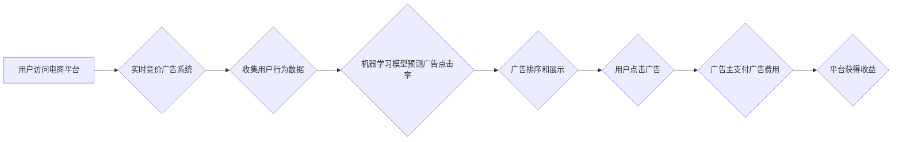

                 

## AI驱动的电商平台实时竞价广告系统优化

> 关键词：实时竞价广告、机器学习、深度学习、推荐系统、电商平台、优化算法、预测模型

## 1. 背景介绍

在当今数字经济时代，电商平台已成为商品交易的主要渠道之一。广告作为电商平台的重要收入来源，其精准性和效率直接影响平台的商业健康。实时竞价广告系统是电商平台广告投放的核心，它通过实时拍卖机制，将广告主与潜在用户连接起来，实现广告精准投放和资源最大化利用。

然而，传统的实时竞价广告系统主要依赖于规则引擎和人工干预，难以适应海量数据和用户行为的复杂变化。随着人工智能技术的快速发展，AI驱动的实时竞价广告系统逐渐成为行业发展趋势。

AI技术能够通过对海量用户数据进行分析和学习，构建更精准的预测模型，从而优化广告投放策略，提高广告转化率和用户体验。

## 2. 核心概念与联系

### 2.1  实时竞价广告系统

实时竞价广告系统是一个基于拍卖机制的广告投放系统，它在用户访问网页或应用程序时，会实时收集用户行为数据，并根据预设的竞价规则，将广告主竞价的广告进行排序和展示。

### 2.2  机器学习在广告系统中的应用

机器学习算法能够从海量数据中学习用户行为模式，并预测用户对特定广告的兴趣和点击率。

常见的机器学习算法应用场景包括：

* **用户画像构建:** 通过分析用户浏览历史、购买记录、兴趣爱好等数据，构建用户画像，以便精准投放广告。
* **广告匹配:** 根据用户画像和广告信息，匹配用户感兴趣的广告，提高广告点击率和转化率。
* **广告排序:** 根据用户行为数据和广告竞价信息，对广告进行排序，展示最相关的广告。
* **欺诈检测:** 通过分析用户行为数据，识别恶意点击和虚假流量，防止广告投放浪费。

### 2.3  深度学习在广告系统中的应用

深度学习算法能够学习更复杂的特征和模式，在广告系统中应用更广泛，例如：

* **自然语言处理:** 对广告文案进行分析和理解，识别用户需求和兴趣。
* **图像识别:** 对广告图片进行识别和分类，提高广告匹配精度。
* **视频理解:** 对广告视频进行分析，识别用户观看行为和兴趣。

**Mermaid 流程图**



## 3. 核心算法原理 & 具体操作步骤

### 3.1  算法原理概述

实时竞价广告系统中常用的算法包括：

* **第一价拍卖:** 广告主出价最高的广告获得展示机会，并支付出价。
* **第二价拍卖:** 广告主出价最高的广告获得展示机会，但支付次高出价的金额。
* **梯度提升算法:** 通过迭代学习多个弱分类器，构建一个强分类器，用于预测广告点击率。
* **深度神经网络:** 通过多层神经网络，学习更复杂的特征和模式，提高广告点击率预测精度。

### 3.2  算法步骤详解

以梯度提升算法为例，其具体操作步骤如下：

1. **数据预处理:** 对用户行为数据进行清洗、转换和特征工程，构建训练数据。
2. **弱分类器训练:** 使用决策树等弱分类器，对训练数据进行训练，构建多个弱分类器模型。
3. **权重分配:** 根据每个弱分类器的预测性能，分配相应的权重。
4. **强分类器构建:** 将多个弱分类器模型进行加权组合，构建一个强分类器模型。
5. **模型评估:** 使用测试数据评估强分类器的预测性能，并进行模型调优。

### 3.3  算法优缺点

**梯度提升算法**

* **优点:** 预测精度高，能够学习复杂的特征关系。
* **缺点:** 训练时间长，容易过拟合。

### 3.4  算法应用领域

梯度提升算法广泛应用于广告点击率预测、欺诈检测、推荐系统等领域。

## 4. 数学模型和公式 & 详细讲解 & 举例说明

### 4.1  数学模型构建

**广告点击率预测模型**

假设广告点击率为 $p$, 用户特征为 $x$, 广告特征为 $a$, 则可以使用以下线性回归模型进行预测:

$$
p = \beta_0 + \beta_1 x + \beta_2 a + \epsilon
$$

其中:

* $\beta_0$, $\beta_1$, $\beta_2$ 为模型参数，需要通过训练数据进行学习。
* $x$ 为用户特征向量。
* $a$ 为广告特征向量。
* $\epsilon$ 为随机误差项。

### 4.2  公式推导过程

梯度提升算法通过迭代学习多个弱分类器，最终构建一个强分类器。其核心思想是通过不断修正预测误差，逐步提高模型预测精度。

**损失函数:**

$$
L(p, y) = (p - y)^2
$$

其中:

* $p$ 为模型预测的点击率。
* $y$ 为真实点击率。

**梯度下降:**

$$
\theta_{t+1} = \theta_t - \eta \frac{\partial L(p, y)}{\partial \theta_t}
$$

其中:

* $\theta_t$ 为模型参数在第 $t$ 次迭代的值。
* $\eta$ 为学习率。

### 4.3  案例分析与讲解

假设我们有一个电商平台，想要预测用户点击某个广告的概率。我们可以使用梯度提升算法构建一个广告点击率预测模型。

**数据:**

* 用户特征: 年龄、性别、兴趣爱好、浏览历史等。
* 广告特征: 广告标题、广告文案、广告图片、广告价格等。
* 点击率: 用户是否点击了该广告。

**模型训练:**

1. 使用梯度提升算法对训练数据进行训练，学习用户特征和广告特征与点击率之间的关系。
2. 评估模型预测精度，并进行模型调优。

**模型应用:**

1. 当用户访问电商平台时，收集用户的特征信息。
2. 根据用户的特征信息和广告信息，使用训练好的模型预测用户点击该广告的概率。
3. 如果预测概率较高，则展示该广告给用户。

## 5. 项目实践：代码实例和详细解释说明

### 5.1  开发环境搭建

* 操作系统: Ubuntu 20.04
* Python 版本: 3.8
* 必要的库: scikit-learn, pandas, numpy, matplotlib

### 5.2  源代码详细实现

```python
import pandas as pd
from sklearn.ensemble import GradientBoostingClassifier
from sklearn.model_selection import train_test_split
from sklearn.metrics import accuracy_score

# 加载数据
data = pd.read_csv('ad_data.csv')

# 划分训练集和测试集
X = data.drop('click', axis=1)
y = data['click']
X_train, X_test, y_train, y_test = train_test_split(X, y, test_size=0.2, random_state=42)

# 训练模型
model = GradientBoostingClassifier(n_estimators=100, learning_rate=0.1, random_state=42)
model.fit(X_train, y_train)

# 预测结果
y_pred = model.predict(X_test)

# 评估模型性能
accuracy = accuracy_score(y_test, y_pred)
print(f'模型准确率: {accuracy}')
```

### 5.3  代码解读与分析

* 首先，我们加载数据并划分训练集和测试集。
* 然后，我们使用梯度提升算法构建一个分类模型，用于预测用户是否点击广告。
* 训练完成后，我们使用测试集评估模型性能，并打印模型准确率。

### 5.4  运行结果展示

运行上述代码后，会输出模型的准确率。

## 6. 实际应用场景

AI驱动的实时竞价广告系统已在许多电商平台广泛应用，例如：

* **淘宝:** 使用机器学习算法进行用户画像构建和广告匹配，提高广告精准度和转化率。
* **京东:** 使用深度学习算法进行广告文案分析和图像识别，提升广告创意和效果。
* **亚马逊:** 使用实时竞价广告系统优化广告投放策略，降低广告成本，提高广告收益。

### 6.4  未来应用展望

未来，AI驱动的实时竞价广告系统将朝着以下方向发展:

* **更精准的广告投放:** 利用更先进的机器学习和深度学习算法，构建更精准的用户画像，实现更精准的广告投放。
* **更个性化的广告体验:** 根据用户的兴趣爱好和行为模式，提供更个性化的广告体验，提高用户满意度。
* **更智能的广告创意:** 利用自然语言处理和图像识别等技术，自动生成更智能的广告创意，提升广告吸引力。
* **更安全的广告生态:** 利用机器学习算法识别和防范广告欺诈，构建更安全的广告生态。

## 7. 工具和资源推荐

### 7.1  学习资源推荐

* **机器学习:**
    * 《机器学习》 - 周志华
    * Andrew Ng 的机器学习课程 (Coursera)
* **深度学习:**
    * 《深度学习》 - Ian Goodfellow, Yoshua Bengio, Aaron Courville
    * fast.ai 深度学习课程
* **广告系统:**
    * 《广告系统设计与实践》 - 孙建华

### 7.2  开发工具推荐

* **Python:** 
    * scikit-learn: 机器学习库
    * TensorFlow: 深度学习库
    * PyTorch: 深度学习库
* **数据处理:**
    * pandas: 数据分析和处理库
    * numpy: 数值计算库
* **可视化:**
    * matplotlib: 数据可视化库
    * seaborn: 数据可视化库

### 7.3  相关论文推荐

* **广告点击率预测:**
    * "Learning to Rank for Sponsored Search" - Liu et al.
    * "Deep Learning for Click-Through Rate Prediction" - Guo et al.
* **广告推荐:**
    * "Collaborative Filtering for Recommender Systems" - Resnick et al.
    * "Neural Collaborative Filtering" - He et al.

## 8. 总结：未来发展趋势与挑战

### 8.1  研究成果总结

AI驱动的实时竞价广告系统已取得显著成果，能够提高广告精准度、转化率和用户体验。

### 8.2  未来发展趋势

未来，AI驱动的实时竞价广告系统将朝着以下方向发展:

* **更精准的用户画像:** 利用更先进的机器学习和深度学习算法，构建更精准的用户画像，实现更精准的广告投放。
* **更个性化的广告体验:** 根据用户的兴趣爱好和行为模式，提供更个性化的广告体验，提高用户满意度。
* **更智能的广告创意:** 利用自然语言处理和图像识别等技术，自动生成更智能的广告创意，提升广告吸引力。
* **更安全的广告生态:** 利用机器学习算法识别和防范广告欺诈，构建更安全的广告生态。

### 8.3  面临的挑战

AI驱动的实时竞价广告系统也面临一些挑战:

* **数据隐私:** 如何保护用户数据隐私，是AI驱动的广告系统面临的重要挑战。
* **算法公平性:** 如何确保AI算法公平公正，避免歧视和偏见，也是一个需要解决的问题。
* **可解释性:** 如何提高AI算法的可解释性，让用户理解算法是如何工作的，也是一个重要的研究方向。

### 8.4  研究展望

未来，我们需要继续加强对AI驱动的实时竞价广告系统的研究，探索更精准、更个性化、更智能、更安全的广告投放模式，为用户和广告主创造更大的价值。

## 9. 附录：常见问题与解答

**Q1: 如何评估AI驱动的实时竞价广告系统的性能？**

**A1:** 常见的评估指标包括点击率 (CTR)、转化率 (CVR)、广告成本 (CPA) 等。

**Q2: 如何解决AI算法的公平性问题？**

**A2:** 可以通过数据预处理、算法设计和模型评估等方式，尽量减少算法的偏见和歧视。

**Q3: 如何提高AI算法的可解释性？**

**A3:** 可以使用可解释机器学习模型，或者通过可视化技术，展示算法的决策过程。

作者：禅与计算机程序设计艺术 / Zen and the Art of Computer Programming 


<end_of_turn>

