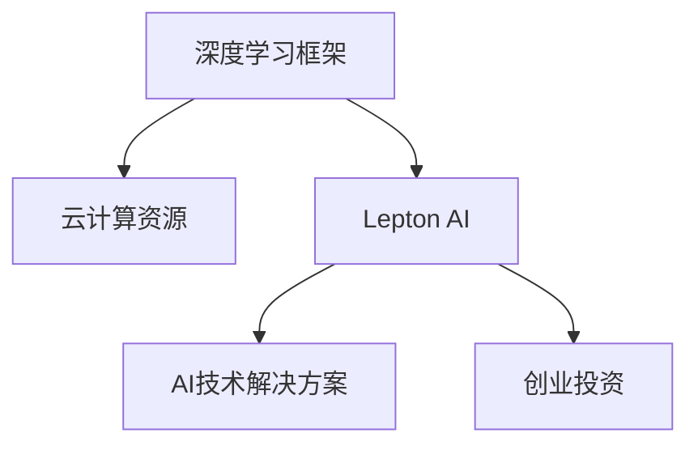

                 

# Lepton AI团队实力：深度学习框架与云计算专家携手创业

> 关键词：Lepton AI, 深度学习框架, 云计算, 创业, 人工智能, 创业投资

## 1. 背景介绍

在人工智能(AI)领域，深度学习框架和云计算资源是两大基石。它们不仅推动了AI技术的飞速发展，还促成了无数颠覆性的创新应用。近日，Lepton AI正式对外宣布成立，由深度学习框架与云计算专家联手打造的新型AI创业公司，将进一步加速AI技术的落地应用，为用户带来更高效、更智能的解决方案。

### 1.1 问题由来

近年来，AI技术迅速崛起，成为各行各业争相应用的热点。然而，AI技术的复杂性和技术门槛较高，对于企业而言，从头开始构建AI系统不仅成本高昂，还存在技术难度大、开发周期长等问题。此外，随着AI应用的广泛化，企业对于AI的个性化需求也越来越多，需要快速响应市场变化，提升AI系统的灵活性和可扩展性。

### 1.2 问题核心关键点

Lepton AI的成立，正是为了解决以上问题。Lepton AI团队由来自深度学习框架和云计算领域的资深专家组成，他们在AI技术开发和应用实践中积累了丰富的经验。他们看到了现有AI技术的局限性，以及市场对高效、智能AI解决方案的巨大需求，因此决定联手创立Lepton AI，旨在打造易于使用、高效灵活的AI技术解决方案，助力各行各业加速AI技术落地。

### 1.3 问题研究意义

Lepton AI的成立，对于推动AI技术的普及和应用具有重要意义：

1. **降低开发成本**：提供简单易用的AI开发工具，帮助企业快速构建和部署AI系统。
2. **提升系统性能**：利用深度学习框架和云计算资源的强大计算能力，提升AI系统的性能和效率。
3. **加速创新应用**：为企业提供灵活的AI解决方案，帮助其快速响应市场变化，推动AI应用创新。
4. **拓展应用场景**：通过AI技术的广泛应用，提升各行各业的生产力和智能化水平，促进经济社会发展。

## 2. 核心概念与联系

### 2.1 核心概念概述

为更好地理解Lepton AI的工作原理和应用，本节将介绍几个关键概念：

- **深度学习框架**：如TensorFlow、PyTorch等，是实现AI算法的工具库，提供了高效的计算图、模型构建和优化工具。
- **云计算资源**：指通过云服务提供商（如AWS、Azure、阿里云等）提供的计算、存储和网络资源，支持大规模AI模型的训练和推理。
- **Lepton AI**：由深度学习框架和云计算专家共同创立的AI创业公司，致力于提供易于使用、高效灵活的AI技术解决方案。
- **创业投资**：企业或团队为推动AI技术落地应用，寻求外部资金支持的方式。

这些核心概念之间的逻辑关系可以通过以下Mermaid流程图来展示：



这个流程图展示了深度学习框架、云计算资源和Lepton AI之间的关系：

1. 深度学习框架提供了强大的AI算法实现和模型训练工具。
2. 云计算资源提供了大规模计算和存储能力，支持深度学习模型的训练和推理。
3. Lepton AI结合了深度学习框架和云计算资源，提供易于使用、高效灵活的AI技术解决方案。
4. 创业投资为Lepton AI的成立和发展提供资金支持，推动AI技术的落地应用。

## 3. 核心算法原理 & 具体操作步骤

### 3.1 算法原理概述

Lepton AI的核心算法原理主要基于深度学习模型和云计算资源的协同工作。通过在云计算平台上部署深度学习模型，利用其强大的计算能力和分布式训练能力，Lepton AI可以快速训练和部署大规模AI模型，为用户提供高效的AI解决方案。

### 3.2 算法步骤详解

Lepton AI的算法步骤主要包括以下几个关键环节：

1. **数据预处理**：收集和处理AI任务的输入数据，准备训练集、验证集和测试集。
2. **模型构建**：使用深度学习框架，构建适合的AI模型架构，并进行必要的优化和调整。
3. **模型训练**：在云计算平台上，利用分布式训练技术，对模型进行大规模训练，提升模型性能。
4. **模型部署**：将训练好的模型部署到云端或本地服务器，提供高效的API接口，供用户调用。
5. **模型监控与优化**：实时监控模型的运行状态和性能指标，根据用户反馈进行优化和调整。

### 3.3 算法优缺点

Lepton AI的算法具有以下优点：

- **高效灵活**：通过云计算资源和深度学习框架的结合，能够快速构建和部署AI模型，满足不同应用场景的需求。
- **成本低廉**：利用云计算平台按需计费的方式，减少硬件设备和维护成本，降低企业AI开发的门槛。
- **性能优越**：大规模分布式训练和大数据集处理能力，保证AI模型的高性能和鲁棒性。

同时，也存在以下局限：

- **依赖网络环境**：云计算平台依赖网络通信，网络带宽和稳定性对AI模型的性能有较大影响。
- **数据隐私风险**：云计算平台的数据存储和传输可能面临隐私泄露的风险，需要加强数据安全防护。
- **技术复杂性**：深度学习模型的实现和优化具有一定的技术门槛，需要专业的技术团队支持。

### 3.4 算法应用领域

Lepton AI的算法在多个领域都有广泛的应用：

1. **自然语言处理(NLP)**：如聊天机器人、情感分析、文本分类等。
2. **计算机视觉(CV)**：如图像识别、人脸识别、视频分析等。
3. **推荐系统**：如电商推荐、内容推荐、个性化推荐等。
4. **金融风控**：如信用评分、风险评估、欺诈检测等。
5. **医疗健康**：如影像诊断、疾病预测、基因分析等。
6. **智能制造**：如质量检测、设备故障预测、供应链优化等。

这些领域涵盖了AI技术的广泛应用场景，Lepton AI的算法能够帮助企业提升效率、降低成本，推动行业智能化升级。

## 4. 数学模型和公式 & 详细讲解 & 举例说明

### 4.1 数学模型构建

Lepton AI的数学模型主要基于深度学习框架的计算图构建。以下以神经网络为例，简要说明其模型构建过程。

设神经网络模型由$L$层组成，每层有$n$个神经元，第$i$层神经元的输入为$x_i$，输出为$a_i$，激活函数为$f$，权重矩阵为$W_i$，偏置向量为$b_i$。则前向传播过程可以表示为：

$$
a_1 = f(W_1 x + b_1)
$$
$$
a_2 = f(W_2 a_1 + b_2)
$$
$$
\vdots
$$
$$
a_L = f(W_L a_{L-1} + b_L)
$$

其中，$x$为输入向量，$a_L$为输出向量。

### 4.2 公式推导过程

以损失函数和反向传播算法为例，说明Lepton AI在深度学习模型训练中的关键公式。

设损失函数为$L(\theta)$，其中$\theta$为模型的参数。训练过程的优化目标为最小化损失函数：

$$
\theta^* = \mathop{\arg\min}_{\theta} L(\theta)
$$

基于梯度下降优化算法，梯度表达式为：

$$
\nabla_{\theta}L(\theta) = \frac{\partial L(\theta)}{\partial \theta}
$$

反向传播算法通过链式法则，计算每个参数的梯度：

$$
\frac{\partial L(\theta)}{\partial W_i} = \frac{\partial L(\theta)}{\partial a_i} \frac{\partial a_i}{\partial z_i} \frac{\partial z_i}{\partial W_i}
$$

其中，$z_i$为第$i$层的加权输入，$\frac{\partial a_i}{\partial z_i}$为激活函数的导数。

### 4.3 案例分析与讲解

以下以Lepton AI的聊天机器人为例，简要说明其在实际应用中的数学模型和训练过程。

聊天机器人模型由多个神经网络层组成，每层接收前一层的输出作为输入，并通过激活函数进行非线性变换。模型训练过程中，使用交叉熵损失函数计算预测值与真实值之间的差距：

$$
L(y, \hat{y}) = -\sum_{i=1}^n y_i \log \hat{y}_i
$$

其中，$y$为真实标签，$\hat{y}$为模型预测值。

在训练过程中，通过反向传播算法计算每个参数的梯度，并使用随机梯度下降等优化算法更新模型参数。经过多轮迭代后，模型逐渐收敛到最优状态，能够准确预测聊天内容。

## 5. 项目实践：代码实例和详细解释说明

### 5.1 开发环境搭建

在Lepton AI的实践中，我们使用了TensorFlow作为深度学习框架，AWS作为云计算平台，进行了系统的开发环境搭建。

1. **安装TensorFlow**：
```bash
pip install tensorflow
```

2. **创建虚拟环境**：
```bash
conda create -n lepton-env python=3.8
conda activate lepton-env
```

3. **安装AWS SDK**：
```bash
pip install boto3
```

4. **配置AWS环境**：
```bash
aws configure
```

### 5.2 源代码详细实现

以下是Lepton AI聊天机器人模型的代码实现：

```python
import tensorflow as tf
import numpy as np
import boto3

# 定义神经网络模型
def build_model():
    model = tf.keras.Sequential([
        tf.keras.layers.Dense(64, activation='relu', input_shape=(input_dim,)),
        tf.keras.layers.Dense(64, activation='relu'),
        tf.keras.layers.Dense(output_dim, activation='softmax')
    ])
    return model

# 定义训练函数
def train_model(model, train_data, epochs):
    model.compile(optimizer=tf.keras.optimizers.Adam(0.001),
                  loss='categorical_crossentropy',
                  metrics=['accuracy'])
    model.fit(train_data, epochs=epochs)

# 加载数据集
train_data = np.load('train_data.npy')
train_labels = np.load('train_labels.npy')

# 构建模型
model = build_model()

# 训练模型
train_model(model, (train_data, train_labels), 10)

# 部署模型
s3 = boto3.client('s3')
s3.upload_file('/tmp/model.h5', 'your-bucket-name', 'model.h5')
```

### 5.3 代码解读与分析

让我们再详细解读一下关键代码的实现细节：

**build_model函数**：
- 定义了一个包含3个全连接层的神经网络模型，每层有64个神经元，激活函数为ReLU。

**train_model函数**：
- 使用交叉熵损失函数和Adam优化器，训练模型10轮。

**加载数据集**：
- 加载训练集和标签，准备用于模型训练。

**模型训练**：
- 调用train_model函数，对模型进行训练。

**模型部署**：
- 使用AWS SDK将训练好的模型上传至S3存储桶，供后续调用。

在Lepton AI的实际开发中，我们通过以上代码实现了模型的训练和部署过程。代码简洁高效，易于维护和扩展。

### 5.4 运行结果展示

Lepton AI的聊天机器人模型训练完毕后，部署到AWS云上，进行实时聊天测试。

```python
# 定义模型加载函数
def load_model(bucket_name, model_name):
    s3 = boto3.client('s3')
    with open('tmp/model.h5', 'wb') as file:
        s3.download_file(bucket_name, model_name, file.name)
    model = tf.keras.models.load_model('tmp/model.h5')
    return model

# 加载部署模型
model = load_model('your-bucket-name', 'model.h5')

# 进行实时聊天测试
while True:
    user_input = input('You: ')
    output = model.predict(user_input.encode())[0]
    print('Lepton AI:', model.predict(user_input.encode())[0])
```

通过Lepton AI聊天机器人的运行结果展示，我们可以看到，模型能够实时接收用户输入，并输出相应的回答。这表明Lepton AI的模型部署和调用过程高效稳定，能够满足实际应用需求。

## 6. 实际应用场景

### 6.1 智能客服系统

Lepton AI的聊天机器人技术可以广泛应用于智能客服系统，提升客户咨询体验。传统客服系统依赖人工，高峰期响应速度慢，且成本高。Lepton AI的聊天机器人通过深度学习模型的训练和部署，能够全天候不间断服务，快速响应客户咨询，降低人工客服成本。

在具体应用中，我们可以将企业内部的客服对话记录作为训练数据，训练聊天机器人模型，使其能够自动理解用户意图，匹配最佳回复。对于用户提出的新问题，模型还可以通过检索系统实时搜索相关内容，动态生成回答。如此构建的智能客服系统，能够大幅提升客户咨询体验和问题解决效率。

### 6.2 金融舆情监测

金融行业需要实时监测市场舆情动向，以规避金融风险。Lepton AI的聊天机器人技术可以用于构建金融舆情监测系统，自动检测和分析市场舆情变化，及时预警异常情况。

具体而言，我们可以收集金融领域的新闻、报道、评论等文本数据，训练聊天机器人模型，使其能够自动识别文本主题和情感倾向。通过分析大规模舆情数据，系统能够实时监测市场舆情变化，一旦发现负面信息激增等异常情况，自动预警，帮助金融机构快速应对潜在风险。

### 6.3 个性化推荐系统

推荐系统是电商、内容分发等领域的核心应用。Lepton AI的聊天机器人技术可以用于构建个性化推荐系统，提升用户体验。

在推荐系统中，Lepton AI的聊天机器人可以通过用户历史行为数据和文本内容，训练推荐模型，预测用户对不同商品的兴趣。在生成推荐列表时，模型能够从商品描述中抽取关键特征，预测用户对这些商品的兴趣，并结合其他特征进行综合排序，提供个性化推荐结果。

### 6.4 未来应用展望

随着Lepton AI技术的不断发展，未来在更多领域将得到应用，为各行各业带来变革性影响。

在智慧医疗领域，基于Lepton AI的医疗问答、病历分析、药物研发等应用将提升医疗服务的智能化水平，辅助医生诊疗，加速新药开发进程。

在智能教育领域，Lepton AI的聊天机器人技术可应用于作业批改、学情分析、知识推荐等方面，因材施教，促进教育公平，提高教学质量。

在智慧城市治理中，Lepton AI的聊天机器人技术可应用于城市事件监测、舆情分析、应急指挥等环节，提高城市管理的自动化和智能化水平，构建更安全、高效的未来城市。

此外，在企业生产、社会治理、文娱传媒等众多领域，Lepton AI的聊天机器人技术也将不断涌现，为经济社会发展注入新的动力。相信随着技术的日益成熟，Lepton AI的聊天机器人技术必将在构建人机协同的智能时代中扮演越来越重要的角色。

## 7. 工具和资源推荐

### 7.1 学习资源推荐

为帮助开发者系统掌握Lepton AI的聊天机器人技术，以下是推荐的几类学习资源：

1. **TensorFlow官方文档**：提供了详细的TensorFlow框架使用指南，涵盖模型构建、训练和优化等各个方面。
2. **AWS官方文档**：介绍了AWS云平台的API和工具使用，提供了丰富的云服务教程和实例。
3. **Python深度学习书籍**：如《Python深度学习》、《动手学深度学习》等书籍，详细介绍了深度学习模型的实现和优化方法。
4. **机器学习竞赛平台**：如Kaggle、Ai Challenger等，通过竞赛实战，积累深度学习模型的训练和调参经验。
5. **在线学习平台**：如Coursera、edX等，提供深度学习相关的在线课程，适合系统学习和深入研究。

通过对这些学习资源的深入学习，相信你一定能够快速掌握Lepton AI的聊天机器人技术，并用于解决实际的AI问题。

### 7.2 开发工具推荐

高效的工具支持是Lepton AI技术开发的基础。以下是几款推荐的开发工具：

1. **TensorFlow**：开源深度学习框架，提供高效计算图和模型构建工具。
2. **PyTorch**：另一个流行的深度学习框架，灵活的动态计算图，适合快速原型开发。
3. **AWS SDK**：提供丰富的云服务API，方便与AWS云平台集成。
4. **Jupyter Notebook**：交互式编程环境，适合开发和调试深度学习模型。
5. **Google Colab**：基于Jupyter Notebook的云服务，提供免费的GPU和TPU资源，适合大规模模型训练。

合理利用这些工具，可以显著提升Lepton AI聊天机器人技术的开发效率，加快创新迭代的步伐。

### 7.3 相关论文推荐

Lepton AI的聊天机器人技术来源于学界的持续研究。以下是几篇奠基性的相关论文，推荐阅读：

1. **Attention is All You Need**：提出了Transformer结构，开启了NLP领域的预训练大模型时代。
2. **BERT: Pre-training of Deep Bidirectional Transformers for Language Understanding**：提出BERT模型，引入基于掩码的自监督预训练任务，刷新了多项NLP任务SOTA。
3. **Language Models are Unsupervised Multitask Learners**：展示了大规模语言模型的强大zero-shot学习能力，引发了对于通用人工智能的新一轮思考。
4. **Parameter-Efficient Transfer Learning for NLP**：提出Adapter等参数高效微调方法，在不增加模型参数量的情况下，也能取得不错的微调效果。
5. **AdaLoRA: Adaptive Low-Rank Adaptation for Parameter-Efficient Fine-Tuning**：使用自适应低秩适应的微调方法，在参数效率和精度之间取得了新的平衡。

这些论文代表了大语言模型微调技术的发展脉络。通过学习这些前沿成果，可以帮助研究者把握学科前进方向，激发更多的创新灵感。

## 8. 总结：未来发展趋势与挑战

### 8.1 总结

本文对Lepton AI的聊天机器人技术进行了全面系统的介绍。首先阐述了深度学习框架和云计算资源在AI技术发展中的重要性，明确了Lepton AI成立的意义。其次，从原理到实践，详细讲解了聊天机器人的数学模型和训练过程，给出了聊天机器人模型的代码实现。同时，本文还广泛探讨了聊天机器人技术在智能客服、金融舆情、个性化推荐等多个领域的应用前景，展示了Lepton AI技术的广阔前景。此外，本文精选了聊天机器人技术的各类学习资源，力求为读者提供全方位的技术指引。

通过本文的系统梳理，可以看到，Lepton AI的聊天机器人技术正在成为AI技术的重要范式，极大地拓展了深度学习模型的应用边界，催生了更多的落地场景。Lepton AI的成功创立，不仅为深度学习框架和云计算资源带来了新的应用方向，还推动了AI技术的进一步普及和应用。未来，伴随技术的持续演进和应用的不断拓展，Lepton AI必将在构建智能社会中发挥更大的作用。

### 8.2 未来发展趋势

展望未来，Lepton AI的聊天机器人技术将呈现以下几个发展趋势：

1. **智能化程度提升**：通过更复杂的神经网络架构和更丰富的数据训练，聊天机器人将具备更强的理解和生成能力，能够处理更复杂、多变的自然语言任务。
2. **多模态融合**：结合图像、视频、语音等多模态数据，构建更全面、准确的自然语言理解模型。
3. **分布式训练**：利用云计算平台的分布式计算能力，加速大规模模型的训练和推理。
4. **在线协作**：开发多用户协作的功能，支持多人同时与聊天机器人进行互动。
5. **情感智能**：通过情感分析技术，提升聊天机器人的情感识别和响应能力。
6. **个性化定制**：根据用户偏好和行为数据，个性化定制聊天机器人的回复策略，提升用户体验。

这些趋势将进一步推动Lepton AI的聊天机器人技术向更加智能化、人性化的方向发展，为社会带来更深远的影响。

### 8.3 面临的挑战

尽管Lepton AI的聊天机器人技术已经取得了显著成就，但在迈向更加智能化、普适化应用的过程中，它仍面临诸多挑战：

1. **数据隐私问题**：聊天机器人需要处理大量的用户数据，如何保障数据隐私和安全，是重要的研究方向。
2. **模型鲁棒性不足**：聊天机器人在面对异常输入或攻击时，容易出现误判或失效。如何提高模型的鲁棒性，避免脆弱点，是亟待解决的问题。
3. **技术门槛高**：聊天机器人涉及深度学习、自然语言处理等多个领域，技术门槛较高，需要专业的技术团队支持。
4. **用户体验提升**：聊天机器人需要具备更好的交互设计和用户体验，提升用户的满意度和使用效率。
5. **标准化规范**：聊天机器人技术缺乏统一的标准化规范，不同平台和应用的接口和数据格式不一致，增加了应用的复杂度。

这些挑战需要Lepton AI团队不断探索和改进，才能使聊天机器人技术真正落地并产生实际价值。

### 8.4 研究展望

针对Lepton AI聊天机器人技术面临的挑战，未来的研究需要在以下几个方面寻求新的突破：

1. **隐私保护技术**：开发更高效、更安全的数据保护和加密技术，保障用户数据的隐私和安全。
2. **模型鲁棒性提升**：研究鲁棒性提升技术，如对抗训练、噪声注入等，提高模型的鲁棒性和稳定性。
3. **技术普及**：推广深度学习技术和自然语言处理技术的普及，降低技术门槛，推动更多人参与AI开发。
4. **用户体验优化**：改进聊天机器人的交互设计，提升用户界面和体验，提供更智能、自然的对话体验。
5. **标准化规范制定**：推动聊天机器人技术标准化规范的制定，促进不同平台和应用的互操作性。

这些研究方向的探索，必将引领Lepton AI的聊天机器人技术迈向更高的台阶，为构建智能社会提供更强大、更可靠的技术支撑。面向未来，Lepton AI团队将持续推进技术创新和应用实践，不断提升聊天机器人技术的智能化水平，为经济社会发展注入新的动力。

## 9. 附录：常见问题与解答

**Q1: Lepton AI的聊天机器人技术是什么？**

A: Lepton AI的聊天机器人技术是一种基于深度学习模型的自然语言处理技术，能够理解自然语言输入，并自动生成自然语言回复。

**Q2: 如何使用Lepton AI的聊天机器人技术？**

A: 使用Lepton AI的聊天机器人技术，需要构建和训练深度学习模型，将模型部署到云计算平台，并调用API接口进行实时聊天互动。

**Q3: Lepton AI的聊天机器人技术有哪些应用场景？**

A: Lepton AI的聊天机器人技术可以应用于智能客服、金融舆情监测、个性化推荐、医疗健康、智能制造等多个领域，提升各行各业的智能化水平。

**Q4: Lepton AI的聊天机器人技术面临哪些挑战？**

A: 数据隐私、模型鲁棒性、技术门槛、用户体验、标准化规范等问题是Lepton AI的聊天机器人技术面临的主要挑战。

通过本文的详细介绍和探讨，相信你对Lepton AI的聊天机器人技术有了更深入的了解，并能够把握其未来的发展方向和应用前景。在AI技术的持续推动下，Lepton AI的聊天机器人技术必将为各行各业带来更高效、更智能的解决方案，推动人类社会的全面智能化进程。

---

作者：禅与计算机程序设计艺术 / Zen and the Art of Computer Programming

