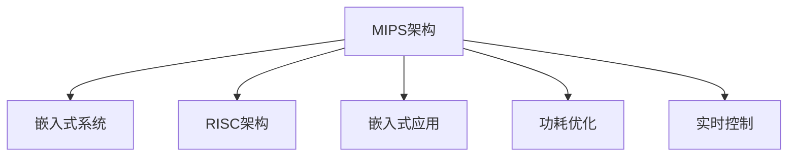

                 

# MIPS架构：嵌入式系统的选择

## 1. 背景介绍

### 1.1 问题由来

在嵌入式系统领域，选择合适的处理器架构对于性能、功耗和成本有着至关重要的影响。目前，业界主流的嵌入式处理器架构包括ARM、MIPS和PowerPC等。其中，ARM架构凭借其广泛的生态系统和较低的功耗成本，成为了最常见的选择。然而，对于特定的应用场景，如高性能计算、实时控制等领域，MIPS架构由于其优越的性能和可定制性，仍然具有不可替代的地位。

### 1.2 问题核心关键点

本文将详细探讨MIPS架构的原理、特点和应用场景，并比较其在嵌入式系统中的优势和局限性，帮助开发者做出明智的选择。

### 1.3 问题研究意义

MIPS架构在嵌入式系统中的应用，不仅能够满足高性能计算和实时控制的需求，还能够为系统设计者提供更灵活的硬件资源配置。了解MIPS架构的特性和适用场景，对于优化系统性能、降低成本和提高可靠性具有重要意义。

## 2. 核心概念与联系

### 2.1 核心概念概述

为更好地理解MIPS架构，本节将介绍几个密切相关的核心概念：

- **MIPS架构**：由MIPS公司开发的精简指令集计算（RISC）架构，以其高效、灵活和可定制性著称。
- **嵌入式系统**：将计算机硬件和软件集成在一个特定的设备中，用于控制和操作其他设备或系统的系统。
- **RISC架构**：与复杂指令集（CISC）架构相对，RISC架构通过减少指令集来提高执行效率和设计复杂性。
- **嵌入式应用**：涉及微控制器、数字信号处理器（DSP）、片上系统（SoC）等多种硬件形态。
- **功耗优化**：在嵌入式系统设计中，降低功耗以延长设备运行时间，是关键的技术需求。
- **实时控制**：嵌入式系统的一个重要应用方向，需要快速响应和精确控制。

这些概念之间的逻辑关系可以通过以下Mermaid流程图来展示：



这个流程图展示了一个MIPS架构在嵌入式系统中的关键角色，通过高效、灵活和低功耗的特性，满足不同应用场景的需求。

## 3. 核心算法原理 & 具体操作步骤

### 3.1 算法原理概述

MIPS架构的核心思想是通过精简指令集来实现高效的执行。其基本工作原理是，将复杂的指令拆分为多个简单的微操作，通过流水线和管道技术来提高指令执行效率。MIPS架构的优势在于，它能够以较低的功耗实现高性能计算，同时提供灵活的可定制性，适应各种不同的嵌入式应用。

### 3.2 算法步骤详解

MIPS架构的嵌入式系统开发步骤如下：

1. **系统需求分析**：确定系统的具体应用场景，包括性能要求、功耗限制和成本预算等。
2. **硬件平台选择**：根据需求选择合适的MIPS处理器，如MIPS64、MIPS32等。
3. **软件开发环境搭建**：配置开发环境，包括编译器、调试工具和操作系统等。
4. **软件开发**：使用C/C++等语言编写嵌入式系统代码，并进行测试和优化。
5. **系统集成和验证**：将软件部署到目标硬件平台，并进行功能测试和性能测试。
6. **系统部署和维护**：将系统部署到实际应用场景，进行持续的监控和维护。

### 3.3 算法优缺点

MIPS架构在嵌入式系统中的主要优点包括：

- **高效性能**：通过精简指令集和流水线技术，MIPS架构能够实现高吞吐量和低延迟。
- **低功耗**：MIPS架构具有较好的能效比，适用于电池供电或低功耗应用。
- **灵活可定制**：MIPS架构提供了丰富的可定制选项，能够根据应用需求进行优化。

同时，MIPS架构也存在一些局限性：

- **生态系统相对较小**：相比于ARM和PowerPC等主流架构，MIPS生态系统较小，导致第三方库和工具支持较少。
- **高性能处理器较少**：MIPS架构的高性能处理器相对较少，限制了其在高端市场的应用。
- **开发成本较高**：MIPS架构的定制化和优化需要较高的开发成本，不适合所有应用场景。

### 3.4 算法应用领域

MIPS架构在嵌入式系统中的应用领域包括但不限于：

- **数字信号处理（DSP）**：MIPS架构的DSP处理器如MIPS32X和MIPS64DX，具有高吞吐量和低功耗的特点，适用于音频、视频和图像处理等应用。
- **嵌入式控制**：MIPS架构的高性能和低功耗特性，使其适用于实时控制和物联网设备，如工业控制、汽车电子等。
- **工业自动化**：MIPS架构的灵活可定制性，使其能够满足工业自动化系统的高性能和可靠性需求。
- **可穿戴设备**：MIPS架构的低功耗和高性能，使其适用于可穿戴设备和移动设备，如智能手表、健康监测设备等。

## 4. 数学模型和公式 & 详细讲解 & 举例说明

### 4.1 数学模型构建

MIPS架构的嵌入式系统开发涉及到计算模型、功耗模型和性能模型等多方面的数学建模。这里以计算模型为例，介绍MIPS架构的基本数学模型。

假设一个MIPS处理器具有N个指令周期，每个周期执行1个指令，指令执行速率为C（指令/秒），则其计算模型可以表示为：

$$
\text{计算能力} = C \times N
$$

其中，N可以通过MIPS架构的指令集和流水线技术来计算。例如，MIPS32X架构的指令集包含了约300个基本指令，通过流水线技术，每个指令周期可以执行多个指令。

### 4.2 公式推导过程

推导MIPS架构的计算模型需要考虑指令集大小、流水线深度和时钟频率等因素。以MIPS32X架构为例，其指令集大小约为300个基本指令，流水线深度为6，时钟频率为200MHz，则每个指令周期可以执行的指令数为：

$$
\text{指令/周期} = \frac{200 \times 10^6}{6 \times 300} \approx 2.78
$$

因此，MIPS32X架构的计算能力可以表示为：

$$
\text{计算能力} = 200 \times 10^6 \times 2.78 = 5.56 \times 10^9 \text{指令/秒}
$$

### 4.3 案例分析与讲解

以MIPS32X处理器为例，分析其在数字信号处理中的应用。假设需要处理一段长度为L的音频数据，采样率为S，则数据处理所需时间为：

$$
\text{数据处理时间} = \frac{L}{S}
$$

假设MIPS32X处理器在处理这段音频数据时，需要执行M个基本指令，每个指令的执行时间为t秒，则处理所需时间为：

$$
\text{处理时间} = M \times t
$$

由于MIPS32X架构的指令集大小为300，每个指令周期可以执行2.78个指令，因此，处理所需指令数为：

$$
\text{处理指令数} = \frac{L}{S} \times \frac{1}{t} \times \frac{S}{2.78} = \frac{L}{2.78t}
$$

因此，处理所需时间为：

$$
\text{处理时间} = \frac{L}{2.78t}
$$

通过这个例子可以看出，MIPS32X架构在处理音频数据时，由于其高效的计算能力和低的指令执行时间，可以显著提高处理效率。

## 5. 项目实践：代码实例和详细解释说明

### 5.1 开发环境搭建

为了在MIPS架构上开发嵌入式系统，需要搭建以下开发环境：

1. **编译器和工具链**：如MIPSPro开发环境、GCC等。
2. **操作系统和库**：如Linux操作系统、MIPS标准库和RTOS等。
3. **调试工具**：如GDB、JTAG调试器等。

### 5.2 源代码详细实现

以MIPS32X架构为例，介绍一个简单的嵌入式系统示例代码。

```c
#include <stdio.h>

int main() {
    int i;
    for (i = 0; i < 1000000000; i++) {
        printf("Hello, MIPS!\n");
    }
    return 0;
}
```

这段代码将在MIPS32X架构上运行，不断输出"Hello, MIPS!"。

### 5.3 代码解读与分析

**编译和链接**：

- 使用MIPSPro编译器编译C代码，生成目标文件。
- 使用MIPSPro链接器将目标文件与库文件链接，生成可执行文件。

**运行和调试**：

- 将可执行文件烧写到MIPS32X处理器中。
- 使用JTAG调试器连接PC和MIPS32X处理器，启动可执行文件。
- 观察输出的"Hello, MIPS!"，确认代码运行正常。

### 5.4 运行结果展示

通过上述步骤，可以在MIPS32X处理器上成功运行这段简单的代码，并观察到"Hello, MIPS!"的输出。

## 6. 实际应用场景

### 6.1 数字信号处理

在数字信号处理领域，MIPS32X和MIPS64DX等处理器被广泛应用于音频和视频处理。这些处理器的高性能和低功耗特性，使其能够在复杂的信号处理任务中表现出色。

### 6.2 嵌入式控制

MIPS架构的灵活可定制性，使其在嵌入式控制领域也有广泛应用。例如，MIPS32X处理器被用于工业控制系统和汽车电子设备中，提供了高效的实时控制能力。

### 6.3 工业自动化

MIPS架构的高性能和可靠性，使其在工业自动化系统中具有重要地位。MIPS64处理器被广泛应用于工业控制、机器人技术和智能制造等领域。

### 6.4 可穿戴设备

MIPS架构的低功耗和高性能，使其在可穿戴设备和移动设备中具有优势。MIPS32X处理器被用于智能手表和健康监测设备，提供了高效的计算能力和低功耗特性。

## 7. 工具和资源推荐

### 7.1 学习资源推荐

为了帮助开发者深入理解MIPS架构和嵌入式系统开发，推荐以下学习资源：

1. **MIPS官方文档**：MIPS公司提供的官方文档，详细介绍了MIPS架构的设计和开发指南。
2. **MIPS64技术白皮书**：MIPS公司发布的技术白皮书，介绍了MIPS64架构的特点和应用场景。
3. **MIPS32X开发手册**：MIPS公司提供的开发手册，介绍了MIPS32X处理器的设计和开发过程。
4. **嵌入式系统开发指南**：多本嵌入式系统开发指南书籍，如《嵌入式系统设计》、《嵌入式系统开发》等。

### 7.2 开发工具推荐

在MIPS架构的嵌入式系统开发中，以下工具是必不可少的：

1. **MIPSPro开发环境**：MIPS公司的集成开发环境，提供了编译、调试和仿真等功能。
2. **GCC编译器**：开源的编译器，支持多种目标平台，包括MIPS架构。
3. **JTAG调试器**：用于连接PC和MIPS处理器，进行调试和监控。
4. **RTOS操作系统**：如μC/OS-II和FreeRTOS，用于实时系统开发。

### 7.3 相关论文推荐

MIPS架构在嵌入式系统中的应用已经吸引了众多学者的关注，以下是几篇重要的相关论文：

1. **MIPS64 architecture: an overview**：MIPS公司发布的MIPS64架构概述，介绍了MIPS64架构的设计和特点。
2. **MIPS32X processor design and implementation**：MIPS公司发布的MIPS32X处理器设计和实现论文，介绍了MIPS32X处理器的设计细节和实现方法。
3. **Performance evaluation of MIPS32X processor in digital signal processing**：研究论文，评估了MIPS32X处理器在数字信号处理中的性能，比较了与其他处理器架构的优劣。

## 8. 总结：未来发展趋势与挑战

### 8.1 总结

本文对MIPS架构在嵌入式系统中的应用进行了全面系统的介绍。通过系统梳理MIPS架构的特点和应用场景，展示了MIPS架构在嵌入式系统中的重要地位和优势。

### 8.2 未来发展趋势

展望未来，MIPS架构在嵌入式系统中的应用将呈现以下几个趋势：

1. **高性能计算**：随着MIPS架构的不断发展，其高性能计算能力将进一步提升，应用于更多高计算需求的应用场景。
2. **低功耗设计**：MIPS架构的低功耗特性将继续得到优化，应用于更多电池供电和低功耗场景。
3. **灵活可定制**：MIPS架构的灵活可定制性将进一步增强，满足更多个性化和定制化需求。
4. **多模态融合**：MIPS架构将与其他模态融合，如视觉、音频和传感器等，实现更全面的系统应用。

### 8.3 面临的挑战

尽管MIPS架构在嵌入式系统中有广泛的应用，但仍面临一些挑战：

1. **生态系统规模**：相比于ARM和PowerPC等主流架构，MIPS生态系统较小，导致第三方库和工具支持较少。
2. **高性能处理器稀缺**：MIPS架构的高性能处理器相对较少，限制了其在高端市场的应用。
3. **开发成本较高**：MIPS架构的定制化和优化需要较高的开发成本，不适合所有应用场景。

### 8.4 研究展望

为了应对这些挑战，未来的研究需要在以下几个方面进行突破：

1. **扩展生态系统**：推动MIPS生态系统的扩展，增加第三方库和工具的支持。
2. **开发高性能处理器**：研发高性能的MIPS处理器，满足高端市场的需求。
3. **降低开发成本**：开发更加灵活和高效的开发工具，降低MIPS架构的开发成本。

总之，MIPS架构在嵌入式系统中的应用前景广阔，但也需要不断突破挑战，才能在未来的应用中发挥更大的作用。

## 9. 附录：常见问题与解答

**Q1：MIPS架构和ARM架构的主要区别是什么？**

A: MIPS架构和ARM架构的主要区别在于指令集、硬件架构和应用领域。MIPS架构采用精简指令集（RISC），指令集规模较小，具有高效的计算能力和灵活的可定制性。而ARM架构则采用复杂指令集（CISC），指令集规模较大，具有广泛的软件生态系统和较低的功耗成本。MIPS架构更适合高性能计算和实时控制等领域，而ARM架构则更适合通用计算和移动设备。

**Q2：MIPS架构的功耗优化有哪些策略？**

A: MIPS架构的功耗优化策略主要包括：

- **动态电压频率调节**：根据负载变化动态调整处理器的电压和频率，降低功耗。
- **功耗感知调度**：通过功耗模型预测任务功耗，优化任务调度，降低系统功耗。
- **硬件辅助节能技术**：如低功耗模式、自动待机等，进一步降低系统功耗。

**Q3：MIPS架构在嵌入式系统中的应用场景有哪些？**

A: MIPS架构在嵌入式系统中的应用场景包括：

- **数字信号处理**：MIPS32X和MIPS64DX处理器适用于音频、视频和图像处理等应用。
- **嵌入式控制**：MIPS32X处理器适用于工业控制和汽车电子等实时控制应用。
- **工业自动化**：MIPS64处理器适用于工业控制、机器人技术和智能制造等领域。
- **可穿戴设备**：MIPS32X处理器适用于智能手表和健康监测设备等可穿戴设备。

**Q4：MIPS架构的开发流程是什么？**

A: MIPS架构的开发流程包括以下步骤：

1. **需求分析**：确定系统应用场景，包括性能要求、功耗限制和成本预算等。
2. **平台选择**：选择合适的MIPS处理器，如MIPS32X、MIPS64等。
3. **环境搭建**：配置编译器、调试工具和操作系统等开发环境。
4. **软件开发**：使用C/C++等语言编写代码，并进行测试和优化。
5. **系统集成**：将软件部署到目标硬件平台，并进行功能测试和性能测试。
6. **系统部署和维护**：将系统部署到实际应用场景，进行持续监控和维护。

**Q5：MIPS架构的性能优化有哪些方法？**

A: MIPS架构的性能优化方法主要包括：

- **指令优化**：通过精简指令集和优化流水线技术，提高指令执行效率。
- **数据访问优化**：通过缓存优化和数据预取等技术，提高数据访问速度。
- **并发处理**：通过多核和并行处理技术，提高系统性能。
- **任务调度优化**：通过任务调度算法优化，提高系统资源利用率。

---

作者：禅与计算机程序设计艺术 / Zen and the Art of Computer Programming

