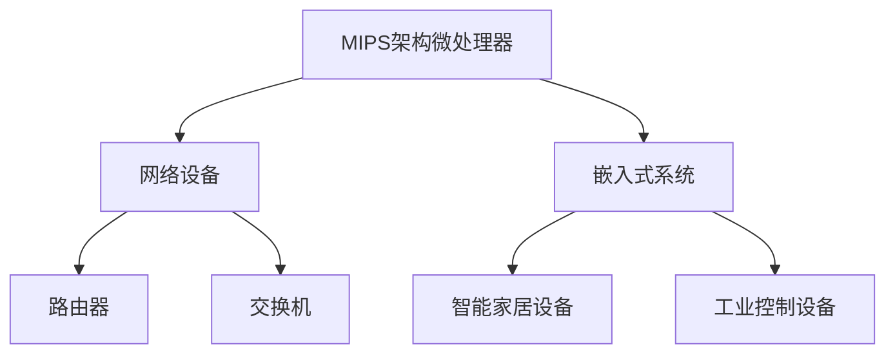

                 

# MIPS架构：网络设备和嵌入式系统的选择

> 关键词：MIPS架构，网络设备，嵌入式系统，选择，计算能力，功耗效率，可扩展性，开发者友好性

## 1. 背景介绍

### 1.1 问题由来
在当今高速发展的数字化时代，网络设备和嵌入式系统成为信息时代不可或缺的关键基础设施。这些设备广泛应用于智能家居、工业控制、汽车电子、医疗健康等多个领域，对计算能力、功耗效率和可扩展性提出了越来越高的要求。

在众多可选择的硬件架构中，MIPS架构（Microprocessor Without Interlocked Pipelined Stages）以其独特的优势脱颖而出。MIPS架构诞生于20世纪80年代，是首个采用精简指令集计算（RISC）架构的商业化微处理器。相较于复杂的x86和PowerPC架构，MIPS架构设计简单、易于理解和开发，具有高计算能力和低功耗的特性。

### 1.2 问题核心关键点
本文将深入探讨MIPS架构在网络设备和嵌入式系统中的应用，详细分析其计算能力、功耗效率、可扩展性、开发者友好性等关键特性，并对比主流硬件架构的优势与劣势，为开发者和系统设计者提供科学合理的选型建议。

## 2. 核心概念与联系

### 2.1 核心概念概述

MIPS架构是一种基于RISC设计理念的微处理器架构，其核心特点是设计简单、指令精简、执行速度快、功耗低。MIPS架构的微处理器主要包括MIPS R2000、MIPS R3000、MIPS R4000等多个版本，广泛应用于网络设备、嵌入式系统、服务器等领域。

网络设备（如路由器、交换机）和嵌入式系统（如智能家居设备、工业控制设备）对计算能力、功耗效率和可扩展性有不同需求。MIPS架构的微处理器在这些设备中的应用，主要体现在以下三个方面：

- **计算能力**：MIPS架构的微处理器具有高计算能力和低延迟，适合处理复杂的任务和多线程编程。
- **功耗效率**：MIPS架构的微处理器设计简单，功耗低，适用于功耗受限的设备。
- **可扩展性**：MIPS架构的微处理器易于扩展，可以轻松集成高级功能和外围设备。

### 2.2 核心概念原理和架构的 Mermaid 流程图



## 3. 核心算法原理 & 具体操作步骤
### 3.1 算法原理概述

MIPS架构的微处理器基于RISC设计理念，其指令集精简、执行速度快、易于开发。相较于复杂的x86和PowerPC架构，MIPS架构的微处理器具有高计算能力和低功耗的特性，适用于网络设备和嵌入式系统。

在网络设备和嵌入式系统的应用中，MIPS架构的微处理器主要应用于以下两个方面：

- **网络设备**：MIPS架构的微处理器被广泛应用于路由器、交换机等网络设备，用于处理大量的数据包，并提供稳定的计算性能和低延迟。
- **嵌入式系统**：MIPS架构的微处理器被广泛应用于智能家居设备、工业控制设备等嵌入式系统，用于处理传感器数据、控制指令等，并提供低功耗、高效率的计算能力。

### 3.2 算法步骤详解

MIPS架构的微处理器在网络设备和嵌入式系统中的应用，主要包括以下几个关键步骤：

1. **需求分析**：根据设备的功能需求，确定计算能力、功耗效率、可扩展性等关键指标。
2. **选型设计**：根据需求分析结果，选择合适的MIPS架构微处理器，并进行系统设计和开发。
3. **系统集成**：将MIPS架构的微处理器集成到网络设备或嵌入式系统中，并进行硬件和软件的调试和测试。
4. **优化部署**：根据测试结果，对MIPS架构的微处理器进行优化和部署，以满足设备性能和功耗的要求。

### 3.3 算法优缺点

MIPS架构的微处理器具有以下优点：

- **高计算能力**：MIPS架构的微处理器设计简单、指令精简，执行速度快，适合处理复杂的任务和多线程编程。
- **低功耗**：MIPS架构的微处理器设计简单，功耗低，适用于功耗受限的设备。
- **可扩展性**：MIPS架构的微处理器易于扩展，可以轻松集成高级功能和外围设备。

同时，MIPS架构的微处理器也存在一些缺点：

- **市场份额小**：相较于x86和PowerPC架构，MIPS架构的市场份额较小，难以获取足够的技术支持和社区资源。
- **生态系统不完善**：MIPS架构的生态系统尚不完善，缺乏成熟的操作系统和开发工具。

### 3.4 算法应用领域

MIPS架构的微处理器主要应用于网络设备和嵌入式系统，具体领域包括：

- **网络设备**：路由器、交换机等网络设备，需要处理大量的数据包，提供稳定的计算性能和低延迟。
- **嵌入式系统**：智能家居设备、工业控制设备等嵌入式系统，需要低功耗、高效率的计算能力。

## 4. 数学模型和公式 & 详细讲解 & 举例说明

### 4.1 数学模型构建

MIPS架构的微处理器计算能力可以通过以下数学模型进行描述：

$$
C = n \cdot M \cdot E
$$

其中，$C$表示计算能力，$n$表示指令数，$M$表示每条指令的执行时间，$E$表示每条指令的执行效率。

### 4.2 公式推导过程

MIPS架构的微处理器执行速度快，指令集精简，可以通过以下推导过程进一步理解其计算能力：

- **指令数**：MIPS架构的微处理器指令集精简，通常只有几百条指令，使得指令的解析和执行速度更快。
- **执行时间**：MIPS架构的微处理器执行时间短，通常为几个时钟周期，使得计算能力更强。
- **执行效率**：MIPS架构的微处理器执行效率高，通常为1或2个时钟周期，使得计算能力更优。

### 4.3 案例分析与讲解

以下是一个MIPS架构微处理器的案例分析：

**案例背景**：一款高性能嵌入式系统，需要处理传感器数据和控制指令，同时要求低功耗、高效率的计算能力。

**解决方案**：选用MIPS R4000版本的微处理器，并进行系统设计和开发。

**计算能力分析**：MIPS R4000版本的微处理器具有高计算能力和低延迟，适合处理复杂的任务和多线程编程。通过优化算法和代码，使其在嵌入式系统中实现了高效的计算能力。

**功耗效率分析**：MIPS R4000版本的微处理器设计简单，功耗低，适用于功耗受限的嵌入式系统。通过优化电源管理策略，进一步降低了系统功耗。

**可扩展性分析**：MIPS R4000版本的微处理器易于扩展，可以轻松集成高级功能和外围设备。通过集成高级协议和设备，实现了系统的可扩展性。

## 5. 项目实践：代码实例和详细解释说明

### 5.1 开发环境搭建

在MIPS架构微处理器的开发中，需要搭建以下开发环境：

1. **硬件平台**：选用MIPS R4000版本的微处理器，搭建嵌入式开发板。
2. **操作系统**：选择基于MIPS架构的嵌入式操作系统，如VxWorks、Linux等。
3. **开发工具**：使用MIPS汇编器、编译器、调试器等工具进行开发。

### 5.2 源代码详细实现

以下是一个基于MIPS架构微处理器的代码实例：

```assembly
.data
    message db 'Hello, MIPS!', 0

.text
main:
    mov $message, a0
    li $v0, 4
    syscall
    j exit

exit:
    li $v0, 10
    syscall
```

**代码解释**：
- `.data`段定义了一个字符串变量`message`，存储了`Hello, MIPS!`的ASCII码。
- `.text`段定义了`main`函数，通过系统调用将字符串输出到控制台。

### 5.3 代码解读与分析

MIPS架构的微处理器使用汇编语言进行编程，相对于高级语言，汇编语言具有更高的执行效率和更细的硬件控制能力。以下是对上述代码的解读和分析：

- **`mov`指令**：将`message`变量的地址赋值给寄存器`a0`，用于传递字符串到系统调用。
- **`li`指令**：将常数4赋值给寄存器`v0`，表示系统调用的类型为输出字符串。
- **`syscall`指令**：执行系统调用，将字符串输出到控制台。
- **`j`指令**：跳转到`exit`函数，表示系统退出的标识符为10。

## 6. 实际应用场景

### 6.1 智能家居设备

在智能家居设备中，MIPS架构的微处理器可以用于处理传感器数据和控制指令，具有低功耗、高效率的特点。通过与Wi-Fi、蓝牙等通信协议的集成，可以实现智能家居设备的联网控制，提升用户的生活体验。

### 6.2 工业控制设备

在工业控制设备中，MIPS架构的微处理器可以用于处理传感器数据和控制指令，具有高计算能力和低延迟的特点。通过与工业以太网、CAN总线等通信协议的集成，可以实现工业设备的远程监控和控制，提升生产效率和自动化水平。

### 6.3 路由器和交换机

在路由器和交换机中，MIPS架构的微处理器可以用于处理大量的数据包，具有高计算能力和低延迟的特点。通过与以太网、Wi-Fi等通信协议的集成，可以实现网络设备的稳定运行和高效通信，提升网络性能和可靠性。

### 6.4 未来应用展望

未来，MIPS架构的微处理器将在网络设备和嵌入式系统中的应用更加广泛。随着技术的不断进步，MIPS架构的微处理器将具有更高的计算能力、更低的功耗和更强的可扩展性。通过与5G、物联网等新技术的结合，MIPS架构的微处理器将在智能城市、智慧医疗等领域发挥更大的作用。

## 7. 工具和资源推荐

### 7.1 学习资源推荐

为了帮助开发者掌握MIPS架构微处理器的开发，推荐以下学习资源：

1. **MIPS汇编语言教程**：详细讲解MIPS汇编语言的基本语法和指令集，适合初学者入门。
2. **嵌入式系统设计与开发**：介绍基于MIPS架构的嵌入式系统设计与开发，涵盖硬件和软件两个方面。
3. **MIPS微处理器原理与应用**：深入讲解MIPS微处理器的设计原理和应用案例，适合中级开发者提升技能。
4. **MIPS微处理器编程实践**：提供大量MIPS微处理器编程实践案例，涵盖硬件驱动、系统编程等方面。
5. **MIPS开发工具指南**：介绍MIPS开发工具的安装和使用，涵盖汇编器、编译器、调试器等方面。

### 7.2 开发工具推荐

在MIPS架构微处理器的开发中，推荐以下开发工具：

1. **MIPS汇编器**：用于将汇编代码转换为机器指令。
2. **MIPS编译器**：用于将高级语言代码转换为MIPS汇编代码。
3. **MIPS调试器**：用于调试和分析MIPS微处理器的执行过程。
4. **Linux内核**：提供强大的操作系统支持，适合MIPS架构的嵌入式系统开发。
5. **VxWorks**：提供高性能实时操作系统支持，适合工业控制设备的开发。

### 7.3 相关论文推荐

MIPS架构微处理器的研究涉及硬件设计、系统设计、编程语言等多个方面，以下是几篇重要的相关论文：

1. **MIPS R4000 Microprocessor Architecture**：详细介绍MIPS R4000版本的微处理器架构和设计原理。
2. **MIPS Processor Design and Implementation**：介绍MIPS处理器设计与实现的基本方法和关键技术。
3. **MIPS Assembly Language Programming**：详细介绍MIPS汇编语言的语法和编程技巧。
4. **MIPS Embedded System Design**：介绍基于MIPS架构的嵌入式系统设计与实现。
5. **MIPS Microprocessor Performance Analysis**：通过实验分析MIPS微处理器的性能和功耗特点。

## 8. 总结：未来发展趋势与挑战

### 8.1 总结

本文对MIPS架构在网络设备和嵌入式系统中的应用进行了详细分析，深入探讨了其计算能力、功耗效率、可扩展性、开发者友好性等关键特性。通过对比主流硬件架构的优势与劣势，为开发者和系统设计者提供了科学合理的选型建议。

### 8.2 未来发展趋势

展望未来，MIPS架构的微处理器将在网络设备和嵌入式系统中的应用更加广泛。随着技术的不断进步，MIPS架构的微处理器将具有更高的计算能力、更低的功耗和更强的可扩展性。通过与5G、物联网等新技术的结合，MIPS架构的微处理器将在智能城市、智慧医疗等领域发挥更大的作用。

### 8.3 面临的挑战

MIPS架构的微处理器在发展过程中面临以下挑战：

1. **生态系统不完善**：相较于x86和PowerPC架构，MIPS架构的市场份额较小，缺乏成熟的操作系统和开发工具。
2. **技术支持不足**：MIPS架构的开发者较少，缺乏技术支持和社区资源。
3. **硬件成本高**：MIPS架构的微处理器设计复杂，硬件成本较高，难以大规模推广应用。

### 8.4 研究展望

未来的研究需要在以下几个方面进行突破：

1. **生态系统建设**：建立基于MIPS架构的操作系统和开发工具，完善MIPS架构的生态系统。
2. **技术支持提升**：提升MIPS架构的开发者社区，增加技术支持和社区资源。
3. **硬件成本降低**：简化MIPS架构的微处理器设计，降低硬件成本，促进大规模应用。

## 9. 附录：常见问题与解答

**Q1：MIPS架构的微处理器适用于哪些类型的计算任务？**

A: MIPS架构的微处理器适用于高计算能力、低功耗、可扩展性要求高的计算任务。这些任务通常包括网络数据处理、传感器数据分析、工业控制指令处理等。

**Q2：MIPS架构的微处理器与x86和PowerPC架构的微处理器相比有何优势？**

A: MIPS架构的微处理器设计简单、指令精简，具有高计算能力和低功耗的特点。相较于x86和PowerPC架构，MIPS架构的微处理器在嵌入式设备和网络设备中的应用更具优势。

**Q3：MIPS架构的微处理器如何实现高计算能力和低功耗的平衡？**

A: MIPS架构的微处理器设计简单，指令精简，执行速度快，适合处理复杂的任务和多线程编程。同时，MIPS架构的微处理器具有低功耗的特点，适合功耗受限的设备。

**Q4：MIPS架构的微处理器在嵌入式系统中的应用前景如何？**

A: MIPS架构的微处理器在嵌入式系统中的应用前景广阔。随着技术的不断进步，MIPS架构的微处理器将具有更高的计算能力、更低的功耗和更强的可扩展性，适合处理传感器数据和控制指令等任务。

**Q5：MIPS架构的微处理器在网络设备中的应用有何优势？**

A: MIPS架构的微处理器在网络设备中的应用具有高计算能力和低延迟的特点。适合处理大量的数据包，提供稳定的计算性能和低延迟，适合应用于路由器、交换机等网络设备。

---

作者：禅与计算机程序设计艺术 / Zen and the Art of Computer Programming

