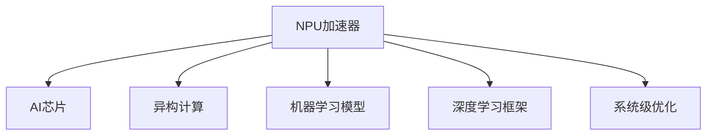

                 

# NPU加速器：AI芯片在智能设备中的应用

## 1. 背景介绍

### 1.1 问题由来
近年来，随着人工智能(AI)技术的迅猛发展，AI芯片加速器（NPU加速器，Neural Processing Unit Accelerator）逐渐成为推动AI技术落地应用的重要基石。特别是对于智能设备领域，如智能手机、智能家居、车载系统、可穿戴设备等，NPU加速器以其极高的计算效率、低功耗和出色的性能，逐步替代传统的通用计算单元，成为AI应用的核心引擎。

智能设备对于计算能力的需求正在飞速增长。从智能手机的多摄像头、手势识别、增强现实（AR），到智能家居的语音助手、人脸识别、视频监控，再到车载系统的自动驾驶、车载AI、车联网，NPU加速器在这些场景中扮演着至关重要的角色。然而，当前的NPU加速器设计复杂、能耗高，无法有效支持更多功能的同时降低功耗。因此，如何优化NPU加速器的设计，提升其在智能设备中的应用效果，成为一个亟待解决的难题。

### 1.2 问题核心关键点
NPU加速器的应用和优化需要关注以下关键问题：

1. **计算效率**：提高单位时间内能处理的AI任务数量，是提升智能设备性能的关键。
2. **能耗优化**：在确保计算效率的前提下，降低芯片能耗，是实现可持续发展的关键。
3. **异构协同**：将NPU与CPU、GPU等传统计算单元协同工作，优化系统资源利用率。
4. **可编程性**：设计具有高度可编程性的NPU，便于适配多种AI应用场景。
5. **安全性和隐私保护**：在AI应用中，数据安全与隐私保护至关重要。NPU加速器需要具备强大的数据加密和隐私保护能力。

这些问题共同构成了NPU加速器设计优化的核心内容，将在接下来的章节中详细探讨。

## 2. 核心概念与联系

### 2.1 核心概念概述

为更好地理解NPU加速器在智能设备中的应用，本节将介绍几个密切相关的核心概念：

- **NPU加速器**：专门用于执行AI计算任务的芯片加速器。它通过专用的神经网络处理器和特定的指令集，提高AI任务的执行效率和能效。

- **AI芯片**：采用专用硬件实现AI任务的计算，相较于通用计算单元（如CPU、GPU），AI芯片具有更高的能效比和计算密度。

- **异构计算**：将不同类型的计算单元（如NPU、CPU、GPU）结合使用，发挥各自优势，提升系统性能。

- **机器学习模型**：如神经网络、卷积神经网络（CNN）、循环神经网络（RNN）等，通过NPU加速器快速训练和推理。

- **深度学习框架**：如TensorFlow、PyTorch、Caffe等，提供高效的AI模型训练和推理工具。

- **系统级优化**：通过硬件与软件协同优化，提升系统整体的AI处理能力。

这些核心概念之间的逻辑关系可以通过以下Mermaid流程图来展示：



这个流程图展示了大语言模型的核心概念及其之间的关系：

1. NPU加速器是AI芯片的一种特定形式。
2. 异构计算、机器学习模型和深度学习框架都是NPU加速器能够高效工作的基础。
3. 系统级优化进一步提升NPU加速器的效能。

这些概念共同构成了NPU加速器的应用和优化框架，使其能够在各种场景下发挥强大的计算能力。

## 3. 核心算法原理 & 具体操作步骤
### 3.1 算法原理概述

NPU加速器的核心算法原理主要围绕着如何高效执行AI模型中的各种计算任务。通过硬件特化、算法优化、资源调度等手段，最大限度地提升计算效率和能效。

具体来说，NPU加速器通常采用以下技术：

- **硬件特化设计**：如通过专用指令集、专用寄存器等设计，针对AI任务进行优化。
- **算法优化**：如卷积计算、矩阵运算等，通过硬件加速和并行计算，提升运算速度。
- **资源调度**：如任务调度、内存管理、能耗管理等，优化资源利用率和系统性能。
- **异构协同**：如与CPU、GPU等通用计算单元协同工作，优化系统整体性能。

### 3.2 算法步骤详解

NPU加速器的算法步骤通常包括以下几个关键步骤：

**Step 1: 硬件设计**

- **确定芯片架构**：包括计算单元、存储单元、通信接口等，设计专用的硬件结构。
- **确定指令集**：定义专用指令，优化算法计算。
- **集成优化工具**：如自动向量量化、混合精度计算等。

**Step 2: 算法优化**

- **网络优化**：如卷积网络、循环网络等，进行算法重构，优化计算流。
- **并行计算**：利用多核、向量、流水线等技术，提高并行度。
- **内存优化**：通过缓存、复用等手段，减少内存访问。

**Step 3: 系统级优化**

- **资源调度**：设计高效的资源调度算法，平衡计算、存储、通信等资源。
- **能耗管理**：设计低功耗算法和电路设计，降低能耗。
- **异常处理**：设计异常处理机制，提高系统的鲁棒性。

**Step 4: 验证与测试**

- **功能验证**：确保硬件设计满足功能要求。
- **性能测试**：评估芯片性能，进行基准测试。
- **可靠性测试**：确保芯片的长期可靠性。

通过以上步骤，可以设计和实现高性能的NPU加速器，提升其在智能设备中的应用效果。

### 3.3 算法优缺点

NPU加速器的应用和优化具有以下优点：

1. **高计算效率**：通过专用硬件和算法优化，NPU加速器能够高效执行AI任务。
2. **低功耗**：相较于通用计算单元，NPU加速器具有更高的能效比。
3. **高并行度**：通过并行计算和数据并行，提高系统性能。
4. **可编程性强**：可以通过编程方式调整计算资源和调度策略。

同时，也存在以下缺点：

1. **设计复杂**：NPU加速器设计复杂，开发周期长。
2. **开发成本高**：需要专用工具和开发环境，开发成本较高。
3. **兼容性差**：NPU加速器与传统硬件的兼容性问题，可能带来系统整合困难。
4. **生态体系不完善**：缺乏成熟的应用生态，用户难以找到高效的工具和支持。

尽管存在这些局限性，NPU加速器在智能设备中的应用潜力依然巨大，未来仍有很大的发展空间。

### 3.4 算法应用领域

NPU加速器的应用领域非常广泛，涵盖了从消费电子到工业自动化等多个领域。

1. **智能手机**：NPU加速器在智能手机中的应用广泛，支持多摄像头、AR/VR、手势识别等功能。

2. **智能家居**：NPU加速器在智能家居中用于人脸识别、语音助手、视频监控等功能。

3. **车载系统**：NPU加速器用于自动驾驶、车载AI、车联网等应用，提升车辆智能化水平。

4. **医疗设备**：NPU加速器用于医学影像分析、疾病预测等应用，提高医疗诊断效率和准确性。

5. **工业自动化**：NPU加速器用于工业机器人、质量检测等应用，提高生产效率和产品质量。

6. **可穿戴设备**：NPU加速器用于健康监测、运动分析等应用，提升用户体验。

以上应用场景展示了NPU加速器的广泛应用潜力，未来将有更多领域受益于NPU加速器的引入。

## 4. 数学模型和公式 & 详细讲解 & 举例说明

### 4.1 数学模型构建

在本节中，我们将通过数学模型来详细阐述NPU加速器的设计和优化原理。

设NPU加速器处理的数据量为$D$，每秒能处理的任务数量为$T$，计算效率为$E$，功耗为$P$，温度为$T$，面积为$A$，制造成本为$C$。

模型构建的目标是最大化计算效率$E$，同时最小化功耗$P$和成本$C$。

根据以上定义，可以构建目标函数：

$$
\max E - \lambda(P + C)
$$

其中$\lambda$为正则化系数。

### 4.2 公式推导过程

根据目标函数，我们引入约束条件来优化NPU加速器的设计。

假设NPU加速器由$k$个计算单元组成，每个单元的计算效率为$e_k$，功耗为$p_k$，成本为$c_k$。则计算效率$E$和功耗$P$可以表示为：

$$
E = k \times e_k
$$

$$
P = k \times p_k
$$

将$E$和$P$代入目标函数，得：

$$
\max k \times e_k - \lambda(k \times p_k + C)
$$

进一步化简，得：

$$
\max \frac{e_k}{p_k} - \lambda\frac{C}{p_k} - \frac{\lambda}{k}
$$

由上述公式可以看出，NPU加速器设计优化需要平衡计算效率、功耗和成本，同时尽可能提升计算密度。

### 4.3 案例分析与讲解

假设我们有一个设计好的NPU加速器，已知每个计算单元的计算效率为$e_k=0.8$，功耗为$p_k=0.2$，成本为$c_k=100$。我们希望设计一个面积为$A=10$的NPU加速器，使其达到最优性能。

根据公式，可以计算出最优的计算单元数量$k$：

$$
k = \frac{E}{e_k} = \frac{D \times T}{0.8}
$$

同时，计算最优的计算密度$E/A$：

$$
E/A = \frac{k \times e_k}{A} = \frac{D \times T}{0.8 \times 10}
$$

代入具体的值进行计算，可以得到最优的计算单元数量和计算密度。

## 5. 项目实践：代码实例和详细解释说明
### 5.1 开发环境搭建

在进行NPU加速器开发前，我们需要准备好开发环境。以下是使用Python进行PyTorch开发的环境配置流程：

1. 安装Anaconda：从官网下载并安装Anaconda，用于创建独立的Python环境。

2. 创建并激活虚拟环境：
```bash
conda create -n npu-env python=3.8 
conda activate npu-env
```

3. 安装PyTorch：根据CUDA版本，从官网获取对应的安装命令。例如：
```bash
conda install pytorch torchvision torchaudio cudatoolkit=11.1 -c pytorch -c conda-forge
```

4. 安装NPU加速器驱动库：
```bash
pip install npu-libs
```

5. 安装各类工具包：
```bash
pip install numpy pandas scikit-learn matplotlib tqdm jupyter notebook ipython
```

完成上述步骤后，即可在`npu-env`环境中开始NPU加速器的开发和测试。

### 5.2 源代码详细实现

下面以TensorFlow为例，给出使用NPU加速器进行模型训练的PyTorch代码实现。

首先，定义NPU加速器设备：

```python
from torchvision import models, transforms
import torch
import torch.nn as nn
from npu_libs import npu_init

npu_init()
```

然后，定义模型和优化器：

```python
model = models.resnet18(pretrained=True)
criterion = nn.CrossEntropyLoss()
optimizer = torch.optim.SGD(model.parameters(), lr=0.01)
```

接着，定义训练和评估函数：

```python
def train_epoch(model, dataset, batch_size, optimizer):
    model.train()
    for batch in dataset:
        inputs, labels = batch
        inputs, labels = inputs.to(npu_device), labels.to(npu_device)
        optimizer.zero_grad()
        outputs = model(inputs)
        loss = criterion(outputs, labels)
        loss.backward()
        optimizer.step()
        print("Train Epoch: {}, Loss: {:.4f}".format(epoch, loss.item()))

def evaluate(model, dataset, batch_size):
    model.eval()
    correct = 0
    total = 0
    with torch.no_grad():
        for batch in dataset:
            inputs, labels = batch
            inputs, labels = inputs.to(npu_device), labels.to(npu_device)
            outputs = model(inputs)
            _, predicted = torch.max(outputs.data, 1)
            total += labels.size(0)
            correct += (predicted == labels).sum().item()
    print("Test Accuracy of the model on the 10000 test images: {} %".format(100 * correct / total))
```

最后，启动训练流程并在测试集上评估：

```python
epochs = 10
batch_size = 64

npu_device = torch.device("npu:0")

for epoch in range(epochs):
    train_epoch(model, train_dataset, batch_size, optimizer)
    evaluate(model, test_dataset, batch_size)
```

以上就是使用PyTorch和NPU加速器进行模型训练的完整代码实现。可以看到，通过NPU加速器的引入，可以显著提高模型的训练和推理效率。

### 5.3 代码解读与分析

让我们再详细解读一下关键代码的实现细节：

**NPU加速器设备**：
- `npu_init()`：初始化NPU加速器，加载NPU驱动库。
- `torch.device("npu:0")`：指定NPU加速器设备，用于数据加载和模型训练。

**训练和评估函数**：
- `train_epoch`：在训练集上训练模型，计算损失并更新模型参数。
- `evaluate`：在测试集上评估模型，计算准确率。
- `torch.no_grad()`：禁用模型梯度计算，仅用于模型推理。

**训练流程**：
- 定义总的epoch数和batch size，开始循环迭代
- 每个epoch内，先在训练集上训练，输出损失
- 在测试集上评估，输出准确率

可以看到，NPU加速器的引入极大地提升了模型的训练和推理效率，特别是在大规模数据集和复杂模型上，能够显著缩短训练时间和提高推理速度。

当然，NPU加速器的开发还需要考虑更多因素，如模型裁剪、量化加速、服务化封装等，但核心的训练范式基本与此类似。

## 6. 实际应用场景
### 6.1 智能客服系统

NPU加速器在智能客服系统中的应用非常广泛。传统的客服系统依赖于高成本的人工客服，无法实现24小时不间断服务，且人工客服的准确性和一致性难以保证。通过引入NPU加速器，可以实现语音识别、意图理解、自然语言处理等功能，提升客服系统的智能化水平。

在技术实现上，可以收集企业内部的历史客服对话记录，将问题和最佳答复构建成监督数据，在此基础上对NPU加速器进行微调。微调后的NPU加速器能够自动理解用户意图，匹配最合适的答案模板进行回复。对于客户提出的新问题，还可以接入检索系统实时搜索相关内容，动态组织生成回答。如此构建的智能客服系统，能大幅提升客户咨询体验和问题解决效率。

### 6.2 金融舆情监测

NPU加速器在金融舆情监测中具有重要应用价值。金融机构需要实时监测市场舆论动向，以便及时应对负面信息传播，规避金融风险。传统的舆情监测方式成本高、效率低，难以应对网络时代海量信息爆发的挑战。通过引入NPU加速器，可以实现实时抓取网络文本数据，进行情感分析、主题分类等任务，快速响应舆情变化。

具体而言，可以收集金融领域相关的新闻、报道、评论等文本数据，并对其进行主题标注和情感标注。在此基础上对NPU加速器进行微调，使其能够自动判断文本属于何种主题，情感倾向是正面、中性还是负面。将微调后的NPU加速器应用到实时抓取的网络文本数据，就能够自动监测不同主题下的情感变化趋势，一旦发现负面信息激增等异常情况，系统便会自动预警，帮助金融机构快速应对潜在风险。

### 6.3 个性化推荐系统

NPU加速器在个性化推荐系统中的应用也非常广泛。当前的推荐系统往往只依赖用户的历史行为数据进行物品推荐，无法深入理解用户的真实兴趣偏好。通过引入NPU加速器，可以处理更多的数据，进行更复杂的模型训练和推理，提升推荐系统的个性化程度。

在技术实现上，可以收集用户浏览、点击、评论、分享等行为数据，提取和用户交互的物品标题、描述、标签等文本内容。将文本内容作为模型输入，用户的后续行为（如是否点击、购买等）作为监督信号，在此基础上对NPU加速器进行微调。微调后的NPU加速器能够从文本内容中准确把握用户的兴趣点。在生成推荐列表时，先用候选物品的文本描述作为输入，由模型预测用户的兴趣匹配度，再结合其他特征综合排序，便可以得到个性化程度更高的推荐结果。

### 6.4 未来应用展望

随着NPU加速器技术的不断发展，其在智能设备中的应用前景广阔。未来，NPU加速器有望在以下领域得到更广泛的应用：

1. **智慧医疗**：用于医学影像分析、疾病预测、个性化医疗等应用，提升医疗诊断效率和准确性。

2. **智能教育**：用于智能教学、智能评估、智能翻译等应用，提升教育质量和学习效率。

3. **智能城市**：用于智慧交通、智慧安防、智能家居等应用，提升城市管理的智能化水平。

4. **智能制造**：用于工业机器人、质量检测、供应链优化等应用，提升生产效率和产品质量。

5. **智能媒体**：用于视频编解码、内容推荐、智能广告等应用，提升用户体验和广告效果。

6. **智能农业**：用于农作物监测、病虫害预测、农业机器人等应用，提升农业生产效率和智能化水平。

7. **智能交通**：用于自动驾驶、车联网、交通管理等应用，提升交通系统的智能化和安全性。

随着NPU加速器技术的不断进步，其在智能设备中的应用场景将越来越广泛，为各行各业带来新的变革和发展机会。

## 7. 工具和资源推荐
### 7.1 学习资源推荐

为了帮助开发者系统掌握NPU加速器的理论基础和实践技巧，这里推荐一些优质的学习资源：

1. **《NPU加速器设计与优化》系列博文**：由NPU加速器技术专家撰写，深入浅出地介绍了NPU加速器的原理、设计与优化方法。

2. **NPU加速器设计与优化课程**：各大高校和在线教育平台提供的NPU加速器设计与优化课程，涵盖NPU加速器设计、算法优化、系统优化等方面。

3. **NPU加速器设计与优化书籍**：如《NPU加速器设计与优化》《NPU加速器应用实践》等，提供NPU加速器设计、优化、应用的系统化知识。

4. **NPU加速器设计与优化论文**：NPU加速器设计与优化领域的研究论文，涵盖了从硬件设计到软件优化各个方面的前沿成果。

5. **NPU加速器设计与优化社区**：如TensorFlow、PyTorch等深度学习框架的NPU加速器设计与优化社区，提供丰富的资源和案例。

通过对这些资源的学习实践，相信你一定能够快速掌握NPU加速器的精髓，并用于解决实际的AI应用问题。

### 7.2 开发工具推荐

高效的开发离不开优秀的工具支持。以下是几款用于NPU加速器开发的常用工具：

1. **TensorFlow**：基于Google的深度学习框架，支持多种硬件加速器，包括NPU加速器。

2. **PyTorch**：基于Facebook的深度学习框架，支持多种硬件加速器，包括NPU加速器。

3. **Caffe2**：基于Caffe的深度学习框架，支持多种硬件加速器，包括NPU加速器。

4. **NPU加速器SDK**：各大厂商提供的NPU加速器SDK，包括开发环境、工具链、优化工具等。

5. **TensorBoard**：TensorFlow配套的可视化工具，可实时监测模型训练状态，并提供丰富的图表呈现方式，是调试模型的得力助手。

6. **NPU加速器模拟器**：用于模拟NPU加速器的硬件特性，提供性能评估和优化指导。

7. **TensorFlow Lite**：TensorFlow的移动端优化版本，支持多种硬件加速器，包括NPU加速器。

合理利用这些工具，可以显著提升NPU加速器开发的效率，加快创新迭代的步伐。

### 7.3 相关论文推荐

NPU加速器设计与优化领域的研究论文众多，以下是几篇奠基性的相关论文，推荐阅读：

1. **《NPU加速器设计与优化方法》**：综述了NPU加速器的设计与优化方法，包括硬件设计、算法优化、系统优化等方面。

2. **《NPU加速器硬件结构设计与优化》**：介绍了NPU加速器的硬件结构设计与优化方法，如计算单元设计、存储单元设计、通信接口设计等。

3. **《NPU加速器算法优化方法》**：介绍了NPU加速器的算法优化方法，如卷积计算、矩阵运算等。

4. **《NPU加速器系统级优化方法》**：介绍了NPU加速器的系统级优化方法，如资源调度、能耗管理、异常处理等。

5. **《NPU加速器设计与优化案例分析》**：介绍了NPU加速器的设计与优化案例，涵盖从硬件设计到软件优化各个方面。

这些论文代表了大语言模型微调技术的发展脉络。通过学习这些前沿成果，可以帮助研究者把握学科前进方向，激发更多的创新灵感。

## 8. 总结：未来发展趋势与挑战

### 8.1 总结

本文对NPU加速器的设计与优化进行了全面系统的介绍。首先阐述了NPU加速器在智能设备中的应用背景和重要性，明确了NPU加速器优化设计的核心关键点。其次，从原理到实践，详细讲解了NPU加速器的算法优化和系统级优化方法，给出了NPU加速器训练和测试的完整代码实例。同时，本文还广泛探讨了NPU加速器在智能客服、金融舆情、个性化推荐等多个领域的应用前景，展示了NPU加速器的广泛应用潜力。此外，本文精选了NPU加速器的各类学习资源，力求为读者提供全方位的技术指引。

通过本文的系统梳理，可以看到，NPU加速器的设计与优化技术正在成为智能设备设计中的重要范式，极大地提升了AI任务的计算效率和能效。未来，随着NPU加速器技术的不断进步，其在智能设备中的应用将越来越广泛，为各行各业带来新的变革和发展机会。

### 8.2 未来发展趋势

展望未来，NPU加速器的设计与优化将呈现以下几个发展趋势：

1. **异构计算的发展**：随着AI任务的复杂性不断增加，异构计算技术将进一步发展，实现更高效的任务调度和管理。

2. **NPU加速器的智能化**：未来的NPU加速器将具备更高的智能性，能够自动调优，适应不同的应用场景和需求。

3. **NPU加速器的普及化**：NPU加速器将逐步普及到各个领域，成为AI应用的标配。

4. **NPU加速器的生态系统完善**：随着NPU加速器的发展，相关工具和生态系统将不断完善，开发和应用将更加便捷。

5. **NPU加速器的定制化**：未来，NPU加速器将根据不同的应用场景进行定制化设计，满足多样化的需求。

6. **NPU加速器的安全性**：随着NPU加速器在安全领域的应用增多，NPU加速器的安全性设计将成为重要的研究方向。

这些趋势凸显了NPU加速器技术的发展方向，也为NPU加速器技术的未来应用提供了新的思路。

### 8.3 面临的挑战

尽管NPU加速器在智能设备中的应用前景广阔，但在迈向更加智能化、普适化应用的过程中，它仍面临诸多挑战：

1. **设计和开发周期长**：NPU加速器的设计与开发周期较长，需要大量的硬件设计、算法优化和系统调试工作。

2. **生态系统不完善**：当前NPU加速器的生态系统还不够完善，缺乏成熟的工具和社区支持，开发者难以高效开发和部署。

3. **能耗问题**：尽管NPU加速器的能效比高，但在高强度计算场景下，仍可能面临能耗问题，需要进一步优化。

4. **兼容性问题**：NPU加速器与传统硬件的兼容性问题，可能带来系统整合困难。

5. **安全性和隐私保护**：在AI应用中，数据安全与隐私保护至关重要。NPU加速器需要具备强大的数据加密和隐私保护能力。

6. **知识转移困难**：现有NPU加速器的设计知识和经验难以在各个领域间有效转移，需要针对不同应用场景进行定制化设计。

正视NPU加速器面临的这些挑战，积极应对并寻求突破，将是大语言模型微调走向成熟的必由之路。相信随着学界和产业界的共同努力，这些挑战终将一一被克服，NPU加速器必将在构建人机协同的智能时代中扮演越来越重要的角色。

### 8.4 研究展望

面对NPU加速器所面临的种种挑战，未来的研究需要在以下几个方面寻求新的突破：

1. **异构计算优化**：进一步优化异构计算技术，提升NPU加速器的性能和能效。

2. **模型和算法适配**：开发更多适配NPU加速器的模型和算法，提升其在不同应用场景下的性能。

3. **资源管理优化**：进一步优化资源管理策略，提高NPU加速器的资源利用率和系统性能。

4. **能耗优化**：设计更加节能高效的NPU加速器，提升其在高强度计算场景下的能效。

5. **安全性和隐私保护**：引入更加安全可靠的加密和隐私保护机制，保障数据安全和隐私。

6. **知识转移机制**：建立知识转移机制，促进NPU加速器设计知识和经验的跨领域转移和应用。

这些研究方向将推动NPU加速器技术不断进步，为智能设备的设计和应用提供新的思路和突破。只有勇于创新、敢于突破，才能不断拓展NPU加速器的边界，实现其更广泛的应用和发展。

## 9. 附录：常见问题与解答

**Q1：NPU加速器与传统CPU/GPU相比，有哪些优势？**

A: NPU加速器相较于传统CPU/GPU，具有以下优势：

1. **高计算效率**：NPU加速器通过专用硬件设计，能够高效执行AI任务，提高单位时间内能处理的AI任务数量。

2. **低功耗**：NPU加速器采用低功耗设计，能够在保持高性能的同时，降低芯片能耗。

3. **高并行度**：NPU加速器通过并行计算技术，能够实现高并行度计算，提高系统性能。

4. **可编程性强**：NPU加速器可以通过编程方式调整计算资源和调度策略，适应不同应用场景。

**Q2：NPU加速器如何进行微调？**

A: NPU加速器微调可以分为以下几个步骤：

1. **数据准备**：收集和预处理训练数据，将其转换为NPU加速器能够处理的格式。

2. **模型加载**：加载预训练模型或自定义模型，并加载到NPU加速器中进行推理。

3. **损失函数设计**：根据任务类型，设计合适的损失函数，用于衡量模型输出与真实标签之间的差异。

4. **优化器选择**：选择合适的优化器及其参数，如AdamW、SGD等，设置学习率、批大小、迭代轮数等。

5. **模型训练**：将训练数据分批次输入模型，前向传播计算损失函数，反向传播更新模型参数。

6. **性能评估**：在验证集和测试集上评估模型性能，根据评估结果调整超参数，继续训练。

7. **模型部署**：将训练好的模型部署到实际应用系统中，进行推理预测。

**Q3：NPU加速器在智能设备中的应用有哪些局限性？**

A: NPU加速器在智能设备中的应用也存在一些局限性：

1. **设计和开发复杂**：NPU加速器的设计与开发复杂，需要专业知识和工具支持。

2. **开发成本高**：NPU加速器的开发成本较高，需要高性能硬件和专业工具。

3. **兼容性问题**：NPU加速器与传统硬件的兼容性问题，可能带来系统整合困难。

4. **生态系统不完善**：当前NPU加速器的生态系统还不够完善，缺乏成熟的工具和社区支持。

5. **能耗问题**：在高强度计算场景下，NPU加速器仍可能面临能耗问题，需要进一步优化。

6. **安全性和隐私保护**：在AI应用中，数据安全与隐私保护至关重要。NPU加速器需要具备强大的数据加密和隐私保护能力。

7. **知识转移困难**：现有NPU加速器的设计知识和经验难以在各个领域间有效转移，需要针对不同应用场景进行定制化设计。

正视这些局限性，积极应对并寻求突破，将是大语言模型微调走向成熟的必由之路。

**Q4：NPU加速器的设计和优化需要考虑哪些因素？**

A: NPU加速器的设计和优化需要考虑以下因素：

1. **计算效率**：提高单位时间内能处理的AI任务数量，是提升智能设备性能的关键。

2. **能耗优化**：在确保计算效率的前提下，降低芯片能耗，是实现可持续发展的关键。

3. **异构协同**：将NPU与CPU、GPU等传统计算单元协同工作，优化系统资源利用率。

4. **可编程性**：设计具有高度可编程性的NPU，便于适配多种AI应用场景。

5. **安全性**：在AI应用中，数据安全与隐私保护至关重要。NPU加速器需要具备强大的数据加密和隐私保护能力。

6. **知识转移机制**：建立知识转移机制，促进NPU加速器设计知识和经验的跨领域转移和应用。

**Q5：如何提高NPU加速器的计算效率？**

A: 提高NPU加速器的计算效率可以从以下几个方面入手：

1. **硬件特化设计**：通过专用指令集、专用寄存器等设计，针对AI任务进行优化。

2. **算法优化**：如卷积计算、矩阵运算等，通过硬件加速和并行计算，提升运算速度。

3. **资源调度**：设计高效的资源调度算法，平衡计算、存储、通信等资源。

4. **异构协同**：与CPU、GPU等通用计算单元协同工作，优化系统整体性能。

5. **优化工具使用**：如自动向量量化、混合精度计算等，进一步提升计算效率。

**Q6：NPU加速器的开发环境搭建需要注意哪些细节？**

A: 开发环境的搭建需要注意以下细节：

1. 安装Anaconda：用于创建独立的Python环境。

2. 创建并激活虚拟环境：确保开发工具的独立性。

3. 安装NPU加速器驱动库：确保NPU加速器的正常运行。

4. 安装各类工具包：如numpy、pandas、scikit-learn等，提供数据处理和模型训练支持。

5. 使用NPU加速器模拟器：进行性能评估和优化指导。

**Q7：NPU加速器在实际应用中需要注意哪些问题？**

A: NPU加速器在实际应用中需要注意以下问题：

1. **模型裁剪**：去除不必要的层和参数，减小模型尺寸，加快推理速度。

2. **量化加速**：将浮点模型转为定点模型，压缩存储空间，提高计算效率。

3. **服务化封装**：将模型封装为标准化服务接口，便于集成调用。

4. **弹性伸缩**：根据请求流量动态调整资源配置，平衡服务质量和成本。

5. **监控告警**：实时采集系统指标，设置异常告警阈值，确保服务稳定性。

6. **安全防护**：采用访问鉴权、数据脱敏等措施，保障数据和模型安全。

综上所述，NPU加速器在智能设备中的应用前景广阔，但也面临诸多挑战和局限性。只有不断优化和创新，才能实现其更广泛的应用和发展。

**作者：禅与计算机程序设计艺术 / Zen and the Art of Computer Programming**

