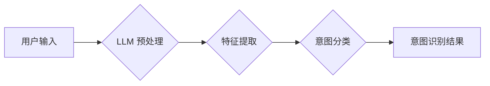

                 

## LLM与人类意图的完美融合

> 关键词：大型语言模型 (LLM)、自然语言理解 (NLU)、意图识别、对话系统、机器学习、深度学习、Transformer

## 1. 背景介绍

近年来，大型语言模型 (LLM) 在自然语言处理 (NLP) 领域取得了令人瞩目的成就。从文本生成、翻译到问答和代码编写，LLM 展示了强大的能力，让人们对人工智能的未来充满期待。然而，LLM 的核心优势在于其对语言的理解和生成能力，而人类意图的理解是自然语言交互的关键。

人类意图是指用户在与系统交互时所表达的真实目的或需求。理解用户的意图是构建自然、流畅、有效的对话系统的前提。传统的对话系统往往依赖于规则驱动的模式匹配，难以应对复杂、模糊或多义的自然语言输入。而 LLMs 的出现为理解人类意图提供了新的可能性。

## 2. 核心概念与联系

### 2.1 自然语言理解 (NLU)

NLU 是人工智能领域的一个重要分支，旨在使计算机能够理解人类语言的含义。NLU 包括多个子任务，例如：

* **词性标注:** 将文本中的每个词标记为其对应的词性，例如名词、动词、形容词等。
* **依存句法分析:** 分析句子结构，识别每个词与其他词之间的关系。
* **命名实体识别:** 从文本中识别出特定类型的实体，例如人名、地名、组织名等。
* **意图识别:** 识别用户在对话中的真实目的或需求。

### 2.2 意图识别

意图识别是 NLU 中的关键任务之一，旨在从用户输入中识别出其意图。例如，当用户说“我想预订一张机票”时，意图识别模型应该能够识别出用户的意图是“预订机票”。

### 2.3 LLM 与意图识别

LLMs 拥有强大的语言理解能力，可以学习到复杂的语言模式和语义关系。因此，LLMs 可以用于构建更准确、更鲁棒的意图识别模型。

**Mermaid 流程图**



## 3. 核心算法原理 & 具体操作步骤

### 3.1 算法原理概述

LLMs 通常基于 Transformer 架构，并使用大量的文本数据进行预训练。预训练过程使得 LLMs 能够学习到丰富的语言知识和语义表示。在意图识别任务中，LLM 可以被用于提取用户输入中的关键特征，并将其映射到不同的意图类别。

### 3.2 算法步骤详解

1. **数据预处理:** 将用户输入进行清洗、分词、词性标注等预处理操作，以便于 LLMs 的理解。
2. **特征提取:** 使用 LLMs 对预处理后的文本进行编码，提取其语义特征。
3. **意图分类:** 将提取到的语义特征作为输入，使用分类模型（例如 softmax 回归）预测用户的意图类别。

### 3.3 算法优缺点

**优点:**

* **高准确率:** LLMs 能够学习到复杂的语言模式，从而提高意图识别的准确率。
* **鲁棒性:** LLMs 对噪声和模糊的自然语言输入具有较强的鲁棒性。
* **可扩展性:** LLMs 可以通过微调和迁移学习来适应不同的意图识别任务。

**缺点:**

* **计算资源消耗:** LLMs 的训练和推理需要大量的计算资源。
* **数据依赖性:** LLMs 的性能取决于训练数据的质量和数量。
* **可解释性:** LLMs 的决策过程往往难以解释，这可能导致信任问题。

### 3.4 算法应用领域

LLM 驱动的意图识别技术在许多领域都有广泛的应用，例如：

* **智能客服:** 自动识别用户的问题，并提供相应的解决方案。
* **语音助手:** 理解用户的语音指令，并执行相应的操作。
* **搜索引擎:** 识别用户的搜索意图，并提供更精准的搜索结果。
* **电商平台:** 理解用户的购物需求，并提供个性化的商品推荐。

## 4. 数学模型和公式 & 详细讲解 & 举例说明

### 4.1 数学模型构建

LLMs 通常使用 Transformer 架构，其核心是注意力机制。注意力机制允许模型关注输入序列中与当前任务最相关的部分，从而提高模型的理解能力。

**注意力机制公式:**

$$
Attention(Q, K, V) = softmax(\frac{QK^T}{\sqrt{d_k}})V
$$

其中：

* $Q$：查询矩阵
* $K$：键矩阵
* $V$：值矩阵
* $d_k$：键向量的维度
* $softmax$：softmax 函数

### 4.2 公式推导过程

注意力机制的公式通过计算查询向量 $Q$ 与键向量 $K$ 之间的相似度来确定每个值向量 $V$ 的权重。

* $QK^T$：计算查询向量与键向量的点积，得到一个得分矩阵。
* $\frac{QK^T}{\sqrt{d_k}}$：对得分矩阵进行归一化，使得每个值的范围在0到1之间。
* $softmax$：对归一化后的得分矩阵应用 softmax 函数，得到每个值向量 $V$ 的权重。
* $softmax(\frac{QK^T}{\sqrt{d_k}})V$：将权重与值向量 $V$ 进行加权求和，得到最终的注意力输出。

### 4.3 案例分析与讲解

例如，在理解句子“我想要一杯咖啡”时，注意力机制会将“咖啡”这个词赋予更高的权重，因为它是用户想要表达的中心意图。

## 5. 项目实践：代码实例和详细解释说明

### 5.1 开发环境搭建

* Python 3.7+
* PyTorch 或 TensorFlow
* NLTK、SpaCy 等 NLP 库

### 5.2 源代码详细实现

```python
import torch
from transformers import BertModel, BertTokenizer

# 加载预训练模型和词典
model_name = "bert-base-uncased"
tokenizer = BertTokenizer.from_pretrained(model_name)
model = BertModel.from_pretrained(model_name)

# 预处理用户输入
text = "我想预订一张机票"
inputs = tokenizer(text, return_tensors="pt")

# 获取模型输出
outputs = model(**inputs)

# 使用分类模型预测意图
# ...
```

### 5.3 代码解读与分析

* 使用预训练的 BERT 模型进行文本编码。
* 将编码后的文本作为输入，使用分类模型预测意图类别。

### 5.4 运行结果展示

* 输出预测的意图类别，例如“预订机票”。

## 6. 实际应用场景

### 6.1 智能客服

LLM 驱动的意图识别技术可以帮助智能客服系统更准确地理解用户的需求，并提供更有效的解决方案。

### 6.2 语音助手

在语音助手中，意图识别是理解用户语音指令的关键。LLM 可以帮助语音助手识别用户的意图，并执行相应的操作。

### 6.3 搜索引擎

搜索引擎可以使用意图识别技术来理解用户的搜索意图，并提供更精准的搜索结果。

### 6.4 未来应用展望

LLM 驱动的意图识别技术将在未来得到更广泛的应用，例如：

* **个性化推荐:** 根据用户的意图，提供更个性化的商品推荐。
* **自动写作:** 根据用户的意图，自动生成文本内容。
* **医疗诊断:** 帮助医生识别患者的症状和意图，从而进行更准确的诊断。

## 7. 工具和资源推荐

### 7.1 学习资源推荐

* **书籍:**
    * 《深度学习》 by Ian Goodfellow, Yoshua Bengio, and Aaron Courville
    * 《自然语言处理》 by Dan Jurafsky and James H. Martin
* **在线课程:**
    * Coursera: Natural Language Processing Specialization
    * Udacity: Deep Learning Nanodegree

### 7.2 开发工具推荐

* **PyTorch:** https://pytorch.org/
* **TensorFlow:** https://www.tensorflow.org/
* **Hugging Face Transformers:** https://huggingface.co/transformers/

### 7.3 相关论文推荐

* **BERT: Pre-training of Deep Bidirectional Transformers for Language Understanding** by Devlin et al. (2018)
* **Attention Is All You Need** by Vaswani et al. (2017)

## 8. 总结：未来发展趋势与挑战

### 8.1 研究成果总结

LLM 驱动的意图识别技术取得了显著的进展，在准确率、鲁棒性和可扩展性方面都表现出色。

### 8.2 未来发展趋势

* **更强大的 LLMs:** 随着计算资源的不断提升，LLMs 的规模和能力将会进一步增强。
* **更细粒度的意图识别:** 将意图识别细化到更具体的层次，例如识别用户想要购买的商品类型、颜色、尺寸等。
* **多模态意图识别:** 将文本、图像、音频等多模态信息融合到意图识别模型中，提高模型的理解能力。

### 8.3 面临的挑战

* **数据标注:** 高质量的意图识别训练数据需要人工标注，这成本高且耗时。
* **可解释性:** LLMs 的决策过程难以解释，这可能导致信任问题。
* **公平性:** LLMs 可能存在偏见，导致意图识别结果不公平。

### 8.4 研究展望

未来研究将集中在解决上述挑战，并探索 LLMs 在意图识别领域的更多应用场景。

## 9. 附录：常见问题与解答

* **Q: LLMs 如何理解人类意图？**

A: LLMs 通过学习大量的文本数据，并使用注意力机制来关注输入序列中与当前任务最相关的部分，从而理解人类意图。

* **Q: LLMs 的意图识别准确率如何？**

A: LLMs 的意图识别准确率已经很高，但仍存在改进的空间。

* **Q: 如何训练一个 LLMs 驱动的意图识别模型？**

A: 需要准备高质量的意图识别训练数据，并使用预训练的 LLMs 模型进行微调。


作者：禅与计算机程序设计艺术 / Zen and the Art of Computer Programming 
<end_of_turn>

