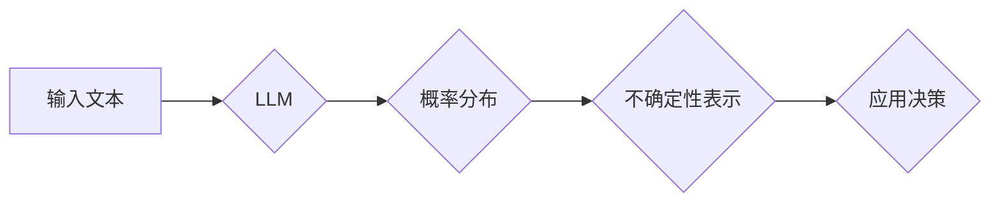

                 

## LLM中的不确定性问题及其解决方案

> 关键词：大型语言模型 (LLM)、不确定性、概率推理、贝叶斯方法、蒙特卡罗采样、鲁棒性、可解释性

## 1. 背景介绍

大型语言模型 (LLM) 在自然语言处理领域取得了显著的进展，展现出强大的文本生成、翻译、摘要和问答能力。然而，LLM 的输出本质上是基于概率分布的，这意味着它们并不能总是给出确定的答案，而是会产生一系列可能的输出及其对应的概率。这种概率性使得 LLMs 的不确定性问题成为一个重要的研究课题。

LLM 的不确定性可以从多个方面理解：

* **数据不确定性:** 训练数据本身可能存在噪声、偏差或不完整性，导致模型在处理新数据时产生不确定的预测。
* **模型不确定性:** 不同的模型架构、训练方法和超参数设置会导致模型对相同输入产生不同的输出，反映了模型本身的不确定性。
* **输入不确定性:** 输入文本的歧义性、模糊性或缺失信息也会导致模型产生不确定的预测。

不确定性问题对 LLMs 的应用带来了诸多挑战：

* **可靠性:** 在一些关键应用场景，例如医疗诊断或法律决策，需要模型能够给出可靠的、确定的预测，而 LLMs 的概率性输出可能无法满足这一需求。
* **可解释性:** LLMs 的决策过程通常是复杂的，难以解释模型为何产生特定的输出，这使得模型的可解释性和信任度降低。
* **鲁棒性:** LLMs 对输入数据中的噪声或偏差较为敏感，容易产生不确定的预测，这降低了模型的鲁棒性。

## 2. 核心概念与联系

LLMs 的不确定性问题本质上是概率推理问题。为了解决这个问题，需要引入概率论和统计学中的相关概念和方法。

**2.1 概率论基础**

* **概率分布:** 描述随机事件发生的可能性。
* **条件概率:** 给定某个事件发生的条件下，另一个事件发生的概率。
* **贝叶斯定理:** 描述概率分布在新的证据出现后的更新。

**2.2 LLMs 与概率推理**

LLMs 通常使用神经网络架构，并通过训练数据学习语言的概率分布。在预测文本时，LLM 会计算每个候选词出现的概率，并选择概率最高的词作为输出。

**2.3  不确定性表示**

LLMs 的不确定性可以通过以下几种方式表示：

* **概率分布:** 直接输出每个候选词出现的概率分布。
* **置信区间:** 给出预测结果的置信区间，表示预测结果的可靠程度。
* **不确定性分数:** 使用一个标量值来量化模型的不确定性。

**2.4  Mermaid 流程图**



## 3. 核心算法原理 & 具体操作步骤

### 3.1  算法原理概述

为了解决 LLMs 的不确定性问题，可以采用以下几种算法和方法：

* **贝叶斯方法:** 利用贝叶斯定理更新模型的概率分布，从而更好地估计不确定性。
* **蒙特卡罗采样:** 通过随机采样来模拟模型的概率分布，并估计不确定性。
* **鲁棒性训练:** 通过训练模型对噪声和偏差更加鲁棒，从而降低不确定性。

### 3.2  算法步骤详解

**3.2.1 贝叶斯方法**

1. **定义先验概率分布:** 根据先验知识或经验，定义模型参数的先验概率分布。
2. **计算似然函数:** 根据训练数据，计算模型参数的似然函数。
3. **更新后验概率分布:** 利用贝叶斯定理，将先验概率分布和似然函数结合起来，更新模型参数的后验概率分布。
4. **预测输出:** 根据后验概率分布，预测输出文本的概率分布。

**3.2.2 蒙特卡罗采样**

1. **构建概率模型:** 建立一个概率模型，描述模型参数和输出文本之间的关系。
2. **采样模型参数:** 从模型参数的后验概率分布中随机采样多个参数值。
3. **预测输出:** 使用每个采样的参数值，预测输出文本。
4. **分析采样结果:** 分析多个预测结果的分布，并估计模型的不确定性。

**3.2.3 鲁棒性训练**

1. **添加噪声数据:** 在训练数据中添加噪声或偏差，模拟现实世界中的不确定性。
2. **训练鲁棒模型:** 使用添加噪声的数据训练模型，使其能够对噪声和偏差更加鲁棒。
3. **评估鲁棒性:** 使用测试数据评估模型的鲁棒性，并比较与普通模型的性能差异。

### 3.3  算法优缺点

| 算法 | 优点 | 缺点 |
|---|---|---|
| 贝叶斯方法 | 可以有效地估计不确定性，并利用先验知识 | 计算复杂度较高，需要大量的计算资源 |
| 蒙特卡罗采样 | 可以模拟模型的概率分布，并估计不确定性 | 采样结果可能存在偏差，需要大量的采样次数 |
| 鲁棒性训练 | 可以提高模型对噪声和偏差的鲁棒性 | 可能降低模型在干净数据上的性能 |

### 3.4  算法应用领域

* **医疗诊断:** 估计疾病诊断的不确定性，帮助医生做出更明智的决策。
* **法律决策:** 评估法律案件的胜诉概率，帮助律师制定策略。
* **金融预测:** 预测股票价格或市场趋势的不确定性，帮助投资者做出投资决策。
* **自动驾驶:** 估计传感器数据的不确定性，提高自动驾驶系统的安全性。

## 4. 数学模型和公式 & 详细讲解 & 举例说明

### 4.1  数学模型构建

假设我们有一个 LLM 模型，用于预测文本序列 $y = (y_1, y_2, ..., y_T)$。模型的输出是一个概率分布 $p(y|x)$，其中 $x$ 是输入文本序列。

### 4.2  公式推导过程

**4.2.1 贝叶斯定理**

贝叶斯定理描述了概率分布在新的证据出现后的更新：

$$
p(A|B) = \frac{p(B|A)p(A)}{p(B)}
$$

其中：

* $p(A|B)$ 是事件 $A$ 在事件 $B$ 发生的条件概率。
* $p(B|A)$ 是事件 $B$ 在事件 $A$ 发生的条件概率。
* $p(A)$ 是事件 $A$ 的先验概率。
* $p(B)$ 是事件 $B$ 的边缘概率。

**4.2.2 概率分布更新**

在 LLMs 中，我们可以将贝叶斯定理应用于模型参数和输出文本的概率分布。假设模型参数为 $\theta$，则模型的输出概率分布为 $p(y|x, \theta)$。

根据贝叶斯定理，我们可以更新模型参数的后验概率分布：

$$
p(\theta|x, y) = \frac{p(y|x, \theta)p(\theta)}{p(y|x)}
$$

其中：

* $p(\theta|x, y)$ 是模型参数 $\theta$ 在观察到输入文本 $x$ 和输出文本 $y$ 后的后验概率分布。
* $p(y|x, \theta)$ 是模型参数 $\theta$ 下输出文本 $y$ 的似然函数。
* $p(\theta)$ 是模型参数 $\theta$ 的先验概率分布。
* $p(y|x)$ 是输出文本 $y$ 的边缘概率。

### 4.3  案例分析与讲解

假设我们有一个 LLM 模型用于预测下一个单词。输入文本为 "The cat sat on the"，模型需要预测下一个单词。

使用贝叶斯方法，我们可以更新模型参数的后验概率分布，并根据后验概率分布预测下一个单词的概率分布。例如，模型可能预测 "mat" 的概率为 0.3，"chair" 的概率为 0.2，"table" 的概率为 0.1 等。

## 5. 项目实践：代码实例和详细解释说明

### 5.1  开发环境搭建

* Python 3.7+
* TensorFlow 或 PyTorch
* 其他必要的库，例如 NumPy、pandas 等

### 5.2  源代码详细实现

```python
import tensorflow as tf

# 定义模型架构
model = tf.keras.Sequential([
    tf.keras.layers.Embedding(input_dim=vocab_size, output_dim=embedding_dim),
    tf.keras.layers.LSTM(units=hidden_size),
    tf.keras.layers.Dense(units=vocab_size, activation='softmax')
])

# 编译模型
model.compile(optimizer='adam', loss='sparse_categorical_crossentropy', metrics=['accuracy'])

# 训练模型
model.fit(x_train, y_train, epochs=10)

# 预测输出
predictions = model.predict(x_test)
```

### 5.3  代码解读与分析

* **模型架构:** 使用了 Embedding 层将单词转换为向量表示，LSTM 层捕捉文本序列的上下文信息，Dense 层输出每个单词的概率分布。
* **编译模型:** 使用 Adam 优化器、交叉熵损失函数和准确率作为评估指标。
* **训练模型:** 使用训练数据训练模型，迭代 10 次。
* **预测输出:** 使用测试数据预测输出文本的概率分布。

### 5.4  运行结果展示

* 训练过程中的损失值和准确率曲线。
* 预测结果与真实值的比较。
* 模型的不确定性表示，例如置信区间或不确定性分数。

## 6. 实际应用场景

### 6.1  医疗诊断

LLMs 可以用于分析患者的病历、检查结果和症状，并预测疾病的可能性。通过估计不确定性，医生可以更好地了解模型的预测结果的可靠性，并做出更明智的诊断决策。

### 6.2  法律决策

LLMs 可以用于分析法律文件、判例和法规，并预测案件的胜诉概率。通过估计不确定性，律师可以更好地了解模型预测结果的可靠性，并制定更合理的法律策略。

### 6.3  金融预测

LLMs 可以用于分析市场数据、财务报表和新闻报道，并预测股票价格、汇率和市场趋势。通过估计不确定性，投资者可以更好地了解模型预测结果的可靠性，并做出更明智的投资决策。

### 6.4  未来应用展望

随着 LLMs 的不断发展，其在更多领域中的应用场景将会不断扩展，例如自动驾驶、机器人控制、自然语言交互等。不确定性问题也将成为 LLMs 应用中需要解决的关键挑战。

## 7. 工具和资源推荐

### 7.1  学习资源推荐

* **书籍:**
    * Deep Learning by Ian Goodfellow, Yoshua Bengio, and Aaron Courville
    * Natural Language Processing with Python by Steven Bird, Ewan Klein, and Edward Loper
* **在线课程:**
    * Stanford CS224N: Natural Language Processing with Deep Learning
    * Coursera: Deep Learning Specialization

### 7.2  开发工具推荐

* **TensorFlow:** https://www.tensorflow.org/
* **PyTorch:** https://pytorch.org/
* **Hugging Face Transformers:** https://huggingface.co/transformers/

### 7.3  相关论文推荐

* **BERT: Pre-training of Deep Bidirectional Transformers for Language Understanding**
* **GPT-3: Language Models are Few-Shot Learners**
* **Uncertainty Estimation in Deep Learning**

## 8. 总结：未来发展趋势与挑战

### 8.1  研究成果总结

近年来，在 LLMs 的不确定性问题研究方面取得了显著进展，例如贝叶斯方法、蒙特卡罗采样和鲁棒性训练等算法被广泛应用。这些方法能够有效地估计 LLMs 的不确定性，并提高模型的可靠性和鲁棒性。

### 8.2  未来发展趋势

未来 LLMs 不确定性研究的重点将集中在以下几个方面：

* **更有效的算法:** 开发更有效的算法来估计 LLMs 的不确定性，例如基于图神经网络的不确定性估计方法。
* **可解释性:** 研究 LLMs 不确定性的可解释性，帮助用户更好地理解模型的决策过程。
* **应用场景:** 将 LLMs 不确定性研究成果应用于更多实际场景，例如医疗诊断、法律决策和金融预测等。

### 8.3  面临的挑战

LLMs 不确定性研究仍然面临一些挑战：

* **计算复杂度:** 一些不确定性估计方法计算复杂度较高，难以在实际应用中部署。
* **数据依赖性:** LLMs 的不确定性估计结果依赖于训练数据的质量和数量。
* **可解释性:** LLMs 的决策过程通常是复杂的，难以解释模型的不确定性。

### 8.4  研究展望

尽管面临挑战，但 LLMs 不确定性研究仍然是一个充满希望的领域。随着算法的不断改进和应用场景的不断扩展，LLMs 将能够更好地应对不确定性问题，并为人类社会带来更多价值。

## 9. 附录：常见问题与解答

**9.1  如何评估 LLMs 的不确定性？**

可以使用多种方法评估 LLMs 的不确定性，例如：

* **概率分布:** 分析模型输出的概率分布，例如方差、熵等指标。
* **置信区间:** 计算模型预测结果的置信区间，表示预测结果的可靠程度。
* **不确定性分数:** 使用专门的算法计算模型的不确定性分数，例如 MC Dropout、Bayesian Neural Networks 等。

**9.2  如何降低 LLMs 的不确定性？**

可以通过以下方法降低 LLMs 的不确定性：

* **增加训练数据:** 使用更多的数据训练模型，提高模型的泛化能力。
* **改进模型架构:** 使用更复杂的模型架构，例如 Transformer、BERT 等，捕捉文本序列的更丰富的上下文信息。
* **使用鲁棒性训练方法:** 使用对抗训练、数据增强等方法训练模型，提高模型对噪声和偏差的鲁棒性。


作者：禅与计算机程序设计艺术 / Zen and the Art of Computer Programming<end_of_turn>

