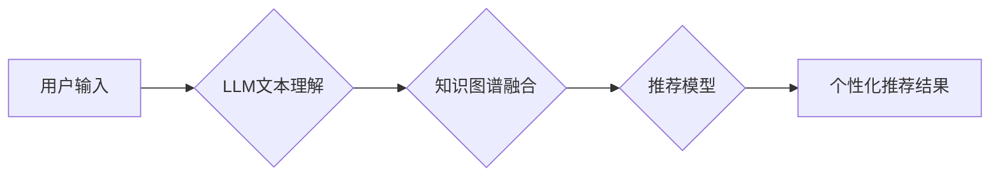

                 

## LLM在多场景多任务推荐中的应用

> 关键词：LLM、多场景多任务推荐、自然语言处理、推荐系统、机器学习、个性化推荐、Transformer、Fine-tuning

## 1. 背景介绍

推荐系统作为信息过滤和个性化内容呈现的重要工具，在电商、社交媒体、视频平台等领域发挥着越来越重要的作用。传统的推荐系统主要依赖于用户行为数据和商品特征，例如点击、购买、评分等，通过协同过滤、内容过滤等算法进行推荐。然而，随着用户行为数据的复杂性和多样性增加，传统的推荐系统面临着以下挑战：

* **数据稀疏性:** 用户行为数据往往存在稀疏性，难以捕捉用户细粒度的兴趣和偏好。
* **冷启动问题:** 新用户和新商品难以获得有效的推荐，因为缺乏历史数据。
* **推荐结果单一性:** 传统的推荐系统往往只提供单一类型的推荐，难以满足用户多样化的需求。

近年来，大语言模型 (LLM) 的快速发展为推荐系统带来了新的机遇。LLM 拥有强大的文本理解和生成能力，能够从用户文本描述中挖掘更深层的意图和需求，并生成更个性化、更丰富的推荐结果。

## 2. 核心概念与联系

LLM 在推荐系统中的应用主要基于以下核心概念：

* **自然语言理解 (NLU):** LLM 可以理解用户自然语言输入，例如文本描述、评论、对话等，并将其转换为机器可理解的格式。
* **文本生成:** LLM 可以根据用户需求生成个性化的推荐文本，例如商品描述、推荐理由、购物清单等。
* **知识图谱:** LLM 可以与知识图谱相结合，利用丰富的知识信息进行推荐，例如商品属性、用户兴趣、商品关系等。

**核心架构**



## 3. 核心算法原理 & 具体操作步骤

### 3.1  算法原理概述

LLM 在多场景多任务推荐中的应用主要基于以下算法原理：

* **Transformer 模型:** Transformer 模型是一种基于注意力机制的深度学习模型，能够有效地捕捉文本序列中的长距离依赖关系，在自然语言理解和文本生成任务中表现出色。
* **Fine-tuning:** 将预训练的 LLM 模型在特定推荐任务上进行微调，使其能够更好地理解用户需求和生成个性化推荐结果。
* **多任务学习:** 将多个推荐任务，例如商品推荐、内容推荐、用户画像等，联合训练，提高模型的泛化能力和推荐效果。

### 3.2  算法步骤详解

1. **数据预处理:** 收集用户行为数据、商品信息、文本评论等数据，并进行清洗、格式化、编码等预处理操作。
2. **LLM 模型选择:** 选择合适的预训练 LLM 模型，例如 BERT、GPT-3 等。
3. **Fine-tuning:** 将预训练的 LLM 模型在特定推荐任务上进行微调，训练数据包括用户文本描述、商品信息、推荐结果等。
4. **多任务学习:** 将多个推荐任务联合训练，例如商品推荐、内容推荐、用户画像等，共享模型参数，提高模型的泛化能力和推荐效果。
5. **推荐结果生成:** 根据用户输入的文本描述，利用微调后的 LLM 模型生成个性化的推荐结果，例如商品列表、推荐理由、购物清单等。

### 3.3  算法优缺点

**优点:**

* **更精准的理解用户需求:** LLM 可以从用户文本描述中挖掘更深层的意图和需求，提供更精准的推荐。
* **更丰富的推荐结果:** LLM 可以生成更个性化、更丰富的推荐结果，例如商品描述、推荐理由、购物清单等。
* **更好的冷启动能力:** LLM 可以利用文本知识和语义关系，对新用户和新商品进行推荐。

**缺点:**

* **训练成本高:** LLM 模型训练需要大量的计算资源和数据。
* **模型解释性差:** LLM 模型的决策过程较为复杂，难以解释推荐结果背后的逻辑。
* **数据安全问题:** LLM 模型需要处理用户敏感信息，需要采取相应的安全措施。

### 3.4  算法应用领域

LLM 在多场景多任务推荐中的应用领域广泛，例如：

* **电商推荐:** 根据用户浏览历史、购买记录、评论等文本信息，推荐个性化的商品。
* **内容推荐:** 根据用户阅读习惯、兴趣爱好、社交行为等文本信息，推荐个性化的文章、视频、音乐等内容。
* **社交媒体推荐:** 根据用户好友关系、兴趣标签、社交行为等文本信息，推荐个性化的好友、话题、群组等内容。

## 4. 数学模型和公式 & 详细讲解 & 举例说明

### 4.1  数学模型构建

LLM 在推荐系统中的应用可以抽象为一个预测问题，即预测用户对特定商品的评分或点击概率。常用的数学模型包括：

* **线性回归:** 

$$
y = \beta_0 + \beta_1x_1 + \beta_2x_2 + ... + \beta_nx_n + \epsilon
$$

其中，$y$ 是预测的评分或点击概率，$x_1, x_2, ..., x_n$ 是用户和商品的特征向量，$\beta_0, \beta_1, ..., \beta_n$ 是模型参数，$\epsilon$ 是误差项。

* **逻辑回归:** 

$$
p(y=1|x) = \frac{1}{1 + e^{-( \beta_0 + \beta_1x_1 + \beta_2x_2 + ... + \beta_nx_n )}}
$$

其中，$p(y=1|x)$ 是用户点击商品的概率，$x$ 是用户和商品的特征向量，$\beta_0, \beta_1, ..., \beta_n$ 是模型参数。

* **深度神经网络:** 

深度神经网络可以学习更复杂的非线性关系，提高推荐效果。常用的深度神经网络模型包括多层感知机 (MLP)、卷积神经网络 (CNN)、循环神经网络 (RNN) 等。

### 4.2  公式推导过程

公式推导过程具体取决于选择的数学模型。例如，线性回归模型的损失函数为均方误差，可以通过梯度下降算法进行优化。逻辑回归模型的损失函数为交叉熵，也可以通过梯度下降算法进行优化。

### 4.3  案例分析与讲解

假设我们想要构建一个商品推荐系统，可以使用线性回归模型进行预测。用户特征包括年龄、性别、购买历史等，商品特征包括价格、类别、品牌等。我们可以将这些特征作为输入，训练线性回归模型，预测用户对特定商品的评分。

## 5. 项目实践：代码实例和详细解释说明

### 5.1  开发环境搭建

推荐系统开发环境通常包括以下软件：

* **Python:** Python 是推荐系统开发的常用编程语言，拥有丰富的机器学习库和工具。
* **深度学习框架:** TensorFlow、PyTorch 等深度学习框架可以用于构建和训练深度神经网络模型。
* **数据处理工具:** Pandas、NumPy 等数据处理工具可以用于数据清洗、预处理和分析。
* **云计算平台:** AWS、Azure、GCP 等云计算平台可以提供计算资源和存储空间，支持大规模数据处理和模型训练。

### 5.2  源代码详细实现

以下是一个使用 Python 和 TensorFlow 构建简单商品推荐系统的代码示例：

```python
import tensorflow as tf

# 定义模型
model = tf.keras.Sequential([
    tf.keras.layers.Dense(64, activation='relu', input_shape=(10,)),
    tf.keras.layers.Dense(1)
])

# 编译模型
model.compile(optimizer='adam', loss='mse')

# 训练模型
model.fit(X_train, y_train, epochs=10)

# 预测
predictions = model.predict(X_test)
```

### 5.3  代码解读与分析

* **模型定义:** 代码定义了一个简单的多层感知机模型，包含一个隐藏层和一个输出层。
* **模型编译:** 使用 Adam 优化器和均方误差损失函数编译模型。
* **模型训练:** 使用训练数据训练模型，训练 epochs 次。
* **模型预测:** 使用测试数据预测商品评分。

### 5.4  运行结果展示

训练完成后，可以评估模型性能，例如使用均方根误差 (RMSE) 衡量预测结果与真实评分之间的差异。

## 6. 实际应用场景

### 6.1  电商推荐

LLM 可以理解用户商品评论和搜索词，推荐更符合用户需求的商品。例如，用户评论“这款衣服太美了，颜色很显白”，LLM 可以理解用户对颜色和款式有偏好，推荐类似风格的商品。

### 6.2  内容推荐

LLM 可以分析用户阅读历史和兴趣标签，推荐个性化的文章、视频、音乐等内容。例如，用户阅读过很多科技新闻，LLM 可以推荐相关的科技博客、视频和音频节目。

### 6.3  社交媒体推荐

LLM 可以分析用户好友关系、兴趣标签和社交行为，推荐个性化的好友、话题和群组。例如，用户关注了很多美食博主，LLM 可以推荐相关的美食话题和群组。

### 6.4  未来应用展望

LLM 在多场景多任务推荐中的应用前景广阔，未来可能在以下方面得到进一步发展：

* **更精准的推荐:** LLM 可以结合更多用户数据和上下文信息，提供更精准的推荐。
* **更个性化的推荐:** LLM 可以根据用户的个性化偏好和需求，生成更个性化的推荐结果。
* **更丰富的推荐形式:** LLM 可以生成更丰富的推荐形式，例如视频、音频、交互式推荐等。
* **跨平台推荐:** LLM 可以跨平台进行推荐，例如将电商平台的商品推荐与社交媒体平台的用户兴趣结合。

## 7. 工具和资源推荐

### 7.1  学习资源推荐

* **书籍:**
    * 《深度学习》
    * 《自然语言处理》
    * 《推荐系统》
* **在线课程:**
    * Coursera: 深度学习
    * edX: 自然语言处理
    * fast.ai: 推荐系统

### 7.2  开发工具推荐

* **Python:** Python 是推荐系统开发的常用编程语言。
* **TensorFlow:** TensorFlow 是一个开源的深度学习框架。
* **PyTorch:** PyTorch 是另一个开源的深度学习框架。
* **Scikit-learn:** Scikit-learn 是一个机器学习库，提供了一些常用的推荐算法。

### 7.3  相关论文推荐

* **BERT: Pre-training of Deep Bidirectional Transformers for Language Understanding**
* **GPT-3: Language Models are Few-Shot Learners**
* **Deep Learning for Recommender Systems**

## 8. 总结：未来发展趋势与挑战

### 8.1  研究成果总结

LLM 在多场景多任务推荐中的应用取得了显著成果，能够提供更精准、更个性化的推荐结果。

### 8.2  未来发展趋势

未来，LLM 在推荐系统中的应用将朝着以下方向发展：

* **更强大的模型:** 研究更强大的 LLMs，例如 Transformer 的升级版，能够更好地理解用户需求和生成更个性化的推荐结果。
* **更丰富的应用场景:** 将 LLM 应用到更多场景，例如医疗、教育、金融等领域。
* **更有效的解释性:** 研究更有效的 LLMs 解释性方法，提高推荐结果的可解释性和透明度。

### 8.3  面临的挑战

LLM 在推荐系统中的应用也面临一些挑战：

* **训练成本高:** 训练大型 LLMs 需要大量的计算资源和数据。
* **模型解释性差:** LLMs 的决策过程较为复杂，难以解释推荐结果背后的逻辑。
* **数据安全问题:** LLMs 需要处理用户敏感信息，需要采取相应的安全措施。

### 8.4  研究展望

未来，需要进一步研究 LLMs 在推荐系统中的应用，解决上述挑战，并探索新的应用场景。


## 9. 附录：常见问题与解答

**Q1: LLM 与传统推荐系统的区别是什么？**

**A1:** LLM 可以理解用户自然语言输入，并生成更个性化、更丰富的推荐结果，而传统推荐系统主要依赖于用户行为数据和商品特征。

**Q2: 如何评估 LLM 在推荐系统中的性能？**

**A2:** 可以使用均方根误差 (RMSE) 衡量预测结果与真实评分之间的差异，也可以使用点击率 (CTR) 和转化率 (CVR) 等指标评估推荐效果。

**Q3: 如何解决 LLM 训练成本高的问题？**

**A3:** 可以使用预训练模型进行微调，减少训练数据和计算资源的需求。也可以使用云计算平台进行训练，共享计算资源。


作者：禅与计算机程序设计艺术 / Zen and the Art of Computer Programming 
<end_of_turn>

