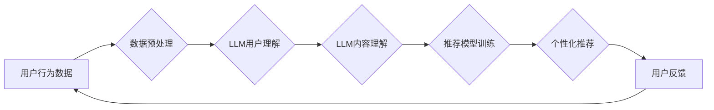

                 

## LLM在推荐系统中的应用探索

> 关键词：大型语言模型（LLM）、推荐系统、个性化推荐、内容生成、用户理解、自然语言处理（NLP）、Transformer模型

## 1. 背景介绍

推荐系统作为互联网时代的重要组成部分，旨在根据用户的历史行为、偏好和上下文信息，为用户推荐最相关的商品、内容或服务。传统的推荐系统主要依赖于协同过滤、内容过滤和基于知识的推荐算法，但这些方法在面对海量数据、用户多样性和冷启动问题时存在一定的局限性。

近年来，大型语言模型（LLM）的快速发展为推荐系统带来了新的机遇。LLM 拥有强大的文本理解和生成能力，能够从海量文本数据中学习用户偏好和内容语义，从而提供更精准、个性化的推荐。

## 2. 核心概念与联系

### 2.1  推荐系统概述

推荐系统旨在预测用户对特定项目的兴趣或偏好，并根据预测结果提供个性化的推荐。

推荐系统通常包含以下核心组件：

* **数据采集:** 收集用户行为数据、项目特征数据等。
* **数据预处理:** 对收集到的数据进行清洗、转换和特征工程。
* **模型训练:** 利用机器学习算法训练推荐模型。
* **推荐策略:** 根据模型预测结果，制定推荐策略，例如排序、过滤和组合推荐。
* **评估指标:** 评估推荐系统的性能，例如准确率、召回率和点击率。

### 2.2  LLM概述

大型语言模型（LLM）是一种基于Transformer架构的深度学习模型，通过训练海量文本数据，学习语言的语法、语义和上下文关系。LLM 能够执行多种自然语言处理任务，例如文本生成、翻译、问答和文本分类。

### 2.3  LLM与推荐系统的融合

LLM 的强大文本理解和生成能力为推荐系统带来了新的可能性。LLM 可以用于以下方面：

* **用户理解:** 通过分析用户的文本评论、搜索历史和社交媒体行为，LLM 可以更好地理解用户的兴趣、偏好和需求。
* **内容理解:** LLM 可以理解项目描述、评论和相关文本，从而更好地捕捉项目的主题、风格和用户评价。
* **个性化推荐:** LLM 可以根据用户的理解和内容理解，生成个性化的推荐文本，例如产品描述、推荐理由和个性化广告。
* **内容生成:** LLM 可以生成推荐相关的文本内容，例如产品描述、推荐理由和个性化广告。

**LLM与推荐系统的融合流程图**



## 3. 核心算法原理 & 具体操作步骤

### 3.1  算法原理概述

LLM 在推荐系统中的应用主要基于以下核心算法原理：

* **Transformer模型:** Transformer模型是一种基于注意力机制的深度学习模型，能够有效地捕捉文本序列中的长距离依赖关系。
* **自监督学习:** LLM通常通过自监督学习方式进行训练，例如语言建模和掩码语言模型，能够从海量文本数据中学习丰富的语言表示。
* **微调:** 将预训练的LLM模型微调到特定推荐任务上，例如用户-项目交互预测和推荐排序。

### 3.2  算法步骤详解

LLM在推荐系统中的应用流程可以概括为以下步骤：

1. **数据收集和预处理:** 收集用户行为数据、项目特征数据和文本数据，并进行清洗、转换和特征工程。
2. **LLM预训练:** 使用公开的预训练LLM模型，例如BERT、GPT-3等，或自行训练LLM模型。
3. **LLM微调:** 将预训练的LLM模型微调到特定推荐任务上，例如用户-项目交互预测和推荐排序。
4. **推荐模型构建:** 基于微调后的LLM模型，构建推荐模型，例如基于LLM的协同过滤模型、内容过滤模型或混合模型。
5. **推荐策略设计:** 根据推荐模型的预测结果，设计推荐策略，例如排序、过滤和组合推荐。
6. **推荐结果展示:** 将推荐结果以用户友好的方式展示给用户。
7. **用户反馈收集:** 收集用户对推荐结果的反馈，并将其用于模型优化和改进。

### 3.3  算法优缺点

**优点:**

* **更精准的个性化推荐:** LLM能够更好地理解用户的兴趣和偏好，从而提供更精准的个性化推荐。
* **更丰富的推荐内容:** LLM能够生成个性化的推荐文本，例如产品描述、推荐理由和个性化广告，丰富用户的推荐体验。
* **应对冷启动问题:** LLM能够通过学习用户和项目的文本语义，缓解冷启动问题，为新用户和新项目提供推荐。

**缺点:**

* **训练成本高:** LLM的训练需要大量的计算资源和时间。
* **数据依赖性强:** LLM的性能依赖于训练数据的质量和数量。
* **可解释性差:** LLM的决策过程较为复杂，难以解释其推荐结果背后的逻辑。

### 3.4  算法应用领域

LLM在推荐系统中的应用领域广泛，包括：

* **电商推荐:** 为用户推荐商品、优惠券和促销活动。
* **内容推荐:** 为用户推荐新闻、视频、音乐和书籍。
* **社交媒体推荐:** 为用户推荐朋友、群组和话题。
* **教育推荐:** 为学生推荐学习资源和课程。

## 4. 数学模型和公式 & 详细讲解 & 举例说明

### 4.1  数学模型构建

LLM在推荐系统中的应用通常基于以下数学模型：

* **用户嵌入:** 将用户转换为低维向量表示，捕捉用户的兴趣和偏好。
* **项目嵌入:** 将项目转换为低维向量表示，捕捉项目的主题和特征。
* **相似度计算:** 计算用户嵌入和项目嵌入之间的相似度，预测用户对项目的兴趣。

### 4.2  公式推导过程

**用户嵌入:**

$$
u_i = \text{Embedding}(user_i)
$$

其中，$u_i$表示用户$i$的嵌入向量，$\text{Embedding}(user_i)$表示将用户$i$的特征转换为嵌入向量的函数。

**项目嵌入:**

$$
v_j = \text{Embedding}(item_j)
$$

其中，$v_j$表示项目$j$的嵌入向量，$\text{Embedding}(item_j)$表示将项目$j$的特征转换为嵌入向量的函数。

**相似度计算:**

$$
score(u_i, v_j) = \text{Similarity}(u_i, v_j)
$$

其中，$score(u_i, v_j)$表示用户$i$对项目$j$的兴趣评分，$\text{Similarity}(u_i, v_j)$表示用户嵌入向量$u_i$和项目嵌入向量$v_j$之间的相似度函数，例如余弦相似度。

### 4.3  案例分析与讲解

假设我们有一个电商平台，用户和商品都拥有文本描述。我们可以使用LLM将用户和商品的文本描述转换为嵌入向量，然后计算用户和商品之间的相似度，从而推荐用户可能感兴趣的商品。

例如，用户A的文本描述是“喜欢看电影，喜欢吃披萨”，商品B的文本描述是“最新上映的科幻电影，配有美味的披萨套餐”。我们可以使用LLM将这两个文本描述转换为嵌入向量，然后计算它们的相似度。如果相似度较高，则表明用户A可能对商品B感兴趣。

## 5. 项目实践：代码实例和详细解释说明

### 5.1  开发环境搭建

推荐系统开发环境通常包含以下软件：

* **Python:** 作为推荐系统开发的主要编程语言。
* **深度学习框架:** 例如TensorFlow、PyTorch等，用于训练LLM模型和推荐模型。
* **数据处理工具:** 例如Pandas、NumPy等，用于数据预处理和分析。
* **云计算平台:** 例如AWS、Azure、GCP等，用于提供计算资源和存储空间。

### 5.2  源代码详细实现

以下是一个基于PyTorch和HuggingFace Transformers库的简单LLM推荐系统代码示例：

```python
from transformers import AutoModelForSequenceClassification, AutoTokenizer

# 加载预训练的LLM模型和分词器
model_name = "bert-base-uncased"
tokenizer = AutoTokenizer.from_pretrained(model_name)
model = AutoModelForSequenceClassification.from_pretrained(model_name)

# 用户文本描述
user_text = "喜欢看电影，喜欢吃披萨"

# 商品文本描述
item_text = "最新上映的科幻电影，配有美味的披萨套餐"

# 将文本转换为嵌入向量
user_embedding = model.encode(user_text)
item_embedding = model.encode(item_text)

# 计算相似度
similarity = cosine_similarity(user_embedding, item_embedding)

# 打印相似度
print(similarity)
```

### 5.3  代码解读与分析

* 该代码首先加载预训练的BERT模型和分词器。
* 然后，将用户和商品的文本描述转换为嵌入向量。
* 最后，计算用户嵌入向量和商品嵌入向量之间的余弦相似度，并打印结果。

### 5.4  运行结果展示

运行该代码后，会输出用户和商品文本描述之间的相似度值。相似度值越高，表明用户对商品的兴趣越大。

## 6. 实际应用场景

### 6.1  电商推荐

LLM可以用于个性化商品推荐、跨界推荐和新商品推荐。例如，根据用户的购物历史和浏览记录，LLM可以推荐用户可能感兴趣的商品，即使这些商品与用户的以往购买行为不完全相同。

### 6.2  内容推荐

LLM可以用于推荐新闻、视频、音乐和书籍。例如，根据用户的阅读习惯和兴趣爱好，LLM可以推荐用户可能感兴趣的新闻文章或书籍。

### 6.3  社交媒体推荐

LLM可以用于推荐朋友、群组和话题。例如，根据用户的社交网络和兴趣爱好，LLM可以推荐用户可能感兴趣的朋友或群组。

### 6.4  未来应用展望

LLM在推荐系统领域的应用前景广阔，未来可能在以下方面得到进一步发展：

* **更精准的个性化推荐:** LLM可以更好地理解用户的复杂需求和偏好，提供更精准的个性化推荐。
* **更丰富的推荐内容:** LLM可以生成更丰富、更个性化的推荐内容，例如推荐理由、产品故事和用户评论。
* **跨模态推荐:** LLM可以融合文本、图像、音频等多模态数据，提供更全面的推荐体验。
* **解释性推荐:** 研究如何提高LLM推荐系统的可解释性，让用户更好地理解推荐结果背后的逻辑。

## 7. 工具和资源推荐

### 7.1  学习资源推荐

* **HuggingFace Transformers库:** https://huggingface.co/docs/transformers/index
* **OpenAI API:** https://beta.openai.com/docs/api-reference/introduction
* **Stanford NLP Group:** https://nlp.stanford.edu/

### 7.2  开发工具推荐

* **TensorFlow:** https://www.tensorflow.org/
* **PyTorch:** https://pytorch.org/
* **Jupyter Notebook:** https://jupyter.org/

### 7.3  相关论文推荐

* **BERT: Pre-training of Deep Bidirectional Transformers for Language Understanding:** https://arxiv.org/abs/1810.04805
* **GPT-3: Language Models are Few-Shot Learners:** https://arxiv.org/abs/2005.14165
* **Recurrent Neural Network Based Language Model for Recommendation:** https://arxiv.org/abs/1609.08144

## 8. 总结：未来发展趋势与挑战

### 8.1  研究成果总结

LLM在推荐系统领域的应用取得了显著进展，能够提供更精准、更个性化的推荐体验。

### 8.2  未来发展趋势

LLM在推荐系统领域的应用未来将朝着以下方向发展：

* **更强大的LLM模型:** 研究更强大的LLM模型，例如多模态LLM和自监督学习LLM，以提升推荐系统的性能。
* **更有效的推荐算法:** 研究更有效的LLM结合推荐算法，例如基于LLM的协同过滤和内容过滤算法。
* **更丰富的推荐内容:** 利用LLM生成更丰富、更个性化的推荐内容，例如推荐理由、产品故事和用户评论。
* **更可解释的推荐系统:** 研究如何提高LLM推荐系统的可解释性，让用户更好地理解推荐结果背后的逻辑。

### 8.3  面临的挑战

LLM在推荐系统领域的应用也面临一些挑战：

* **训练成本高:** 训练大型LLM模型需要大量的计算资源和时间。
* **数据依赖性强:** LLM的性能依赖于训练数据的质量和数量。
* **可解释性差:** LLM的决策过程较为复杂，难以解释其推荐结果背后的逻辑。
* **伦理问题:** LLM可能存在偏见和歧视问题，需要进行伦理审查和监管。

### 8.4  研究展望

未来，LLM在推荐系统领域的应用将继续深入发展，为用户提供更精准、更个性化的推荐体验。


## 9. 附录：常见问题与解答

### 9.1  LLM训练需要多少数据？

LLM的训练数据量通常在数十亿到数万亿个文本数据之间。

### 9.2  LLM训练需要多少计算资源？

LLM的训练需要大量的计算资源，例如数百甚至数千个GPU。

### 9.3  如何评估LLM推荐系统的性能？

常用的评估指标包括准确率、召回率、点击率和用户满意度。

### 9.4  LLM推荐系统存在哪些伦理问题？

LLM推荐系统可能存在偏见、歧视和隐私泄露等伦理问题。

### 9.5  如何解决LLM推荐系统中的伦理问题？

可以通过以下方式解决LLM推荐系统中的伦理问题：

* 使用多样化的训练数据，减少偏见。
* 开发可解释的推荐算法，提高透明度。
* 加强用户隐私保护，防止数据泄露。
* 建立伦理审查机制，规范LLM应用。


作者：禅与计算机程序设计艺术 / Zen and the Art of Computer Programming 
<end_of_turn>

