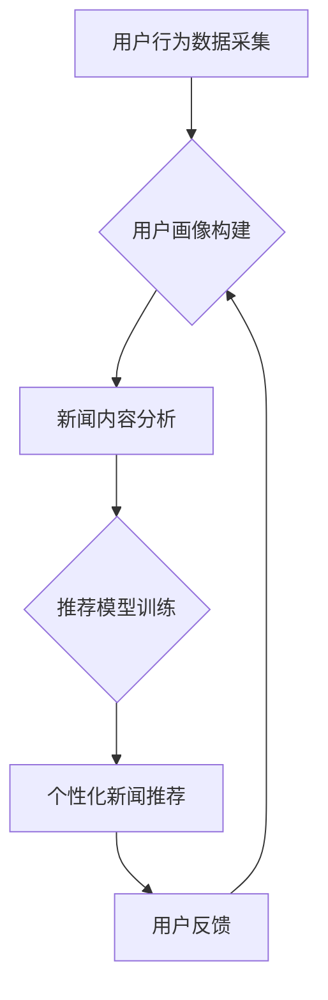

                 

## LLM在智能个性化新闻推送中的应用前景

> 关键词：LLM, 大语言模型, 个性化新闻推送, 信息过滤, 内容生成, 用户行为分析, 深度学习

## 1. 背景介绍

在信息爆炸的时代，海量新闻资讯的涌现使得用户难以筛选出真正感兴趣的内容。传统的新闻推送方式往往依赖于人工编辑和简单的关键词匹配，难以满足用户日益增长的个性化需求。近年来，随着深度学习技术的飞速发展，大语言模型（LLM）的出现为智能个性化新闻推送带来了新的机遇。

LLM 拥有强大的文本理解和生成能力，能够理解用户的阅读偏好、兴趣爱好以及新闻事件的语义关联，从而实现更精准、更智能的新闻推荐。

## 2. 核心概念与联系

### 2.1  大语言模型（LLM）

大语言模型是一种基于深度学习的强大人工智能模型，能够理解和生成人类语言。它通过训练海量文本数据，学习语言的语法、语义和上下文关系，从而具备以下能力：

* **文本理解:** 能够理解文本的含义、情感和意图。
* **文本生成:** 能够生成流畅、自然的文本，包括文章、对话、诗歌等。
* **文本翻译:** 能够将文本从一种语言翻译成另一种语言。
* **文本摘要:** 能够提取文本的关键信息，生成简洁的摘要。

### 2.2  个性化新闻推送

个性化新闻推送是指根据用户的兴趣、偏好和行为，推荐最符合其需求的新闻内容。传统的新闻推送方式往往依赖于人工编辑和简单的关键词匹配，难以满足用户日益增长的个性化需求。

LLM 能够通过分析用户的阅读历史、点赞、评论等行为数据，以及新闻内容的主题、关键词、情感等信息，实现更精准、更智能的新闻推荐。

### 2.3  核心架构

LLM 在智能个性化新闻推送中的应用，通常采用以下核心架构：



**核心流程:**

1. **用户行为数据采集:** 收集用户的阅读历史、点赞、评论等行为数据。
2. **用户画像构建:** 利用机器学习算法，构建用户的兴趣、偏好和行为特征画像。
3. **新闻内容分析:** 对新闻内容进行主题、关键词、情感等信息的提取和分析。
4. **推荐模型训练:** 利用 LLM 和机器学习算法，训练个性化新闻推荐模型。
5. **个性化新闻推荐:** 根据用户的画像和新闻内容信息，推荐最符合其需求的新闻内容。
6. **用户反馈:** 收集用户的反馈信息，用于模型的持续优化和改进。

## 3. 核心算法原理 & 具体操作步骤

### 3.1  算法原理概述

LLM 在个性化新闻推送中的应用，主要依赖于以下核心算法：

* **Transformer 模型:** Transformer 模型是一种基于注意力机制的深度学习模型，能够有效地捕捉文本中的长距离依赖关系，从而实现更精准的文本理解和生成。
* **用户画像构建算法:** 常见的用户画像构建算法包括 K-Means 聚类、层次聚类、深度学习等。
* **推荐算法:** 常见的推荐算法包括协同过滤、内容过滤、混合推荐等。

### 3.2  算法步骤详解

**1. 用户行为数据采集:**

* 从用户设备、网站、APP 等平台收集用户的阅读历史、点赞、评论、分享等行为数据。
* 数据清洗和预处理，去除无效数据、噪声数据，并进行格式转换。

**2. 用户画像构建:**

* 利用 K-Means 聚类算法，将用户按照其行为特征进行分组，构建用户画像。
* 也可以利用深度学习模型，例如 Autoencoder，学习用户的隐含特征，构建更精细的用户画像。

**3. 新闻内容分析:**

* 利用自然语言处理（NLP）技术，对新闻内容进行主题、关键词、情感等信息的提取和分析。
* 可以使用预训练的 LLM 模型，例如 BERT、RoBERTa，进行文本理解和语义分析。

**4. 推荐模型训练:**

* 利用 Transformer 模型，构建个性化新闻推荐模型。
* 模型输入用户的画像信息和新闻内容信息，输出推荐新闻的概率分数。
* 使用交叉熵损失函数，训练推荐模型。

**5. 个性化新闻推荐:**

* 根据模型输出的概率分数，对新闻进行排序，推荐给用户。
* 可以根据用户的反馈信息，动态调整推荐模型的参数，提高推荐效果。

### 3.3  算法优缺点

**优点:**

* **精准度高:** LLM 能够理解用户的阅读偏好和新闻内容的语义关联，实现更精准的新闻推荐。
* **个性化强:** 可以根据用户的不同画像，提供个性化的新闻推荐。
* **可扩展性强:** 可以扩展到其他领域，例如电商推荐、音乐推荐等。

**缺点:**

* **训练成本高:** LLM 的训练需要大量的计算资源和数据。
* **数据依赖性强:** LLM 的性能取决于训练数据的质量和数量。
* **解释性差:** LLM 的决策过程难以解释，难以理解模型是如何进行推荐的。

### 3.4  算法应用领域

LLM 在个性化新闻推送之外，还可应用于以下领域：

* **电商推荐:** 根据用户的购买历史和浏览记录，推荐商品。
* **音乐推荐:** 根据用户的音乐偏好，推荐歌曲和音乐人。
* **电影推荐:** 根据用户的观影历史和评分，推荐电影。
* **教育推荐:** 根据学生的学习进度和兴趣，推荐学习资源。

## 4. 数学模型和公式 & 详细讲解 & 举例说明

### 4.1  数学模型构建

LLM 的核心是 Transformer 模型，其数学模型构建基于注意力机制和多头注意力机制。

**注意力机制:**

注意力机制允许模型关注输入序列中与当前任务最相关的部分。其核心思想是为每个输入元素分配一个权重，权重越高表示该元素对当前任务越重要。

**公式:**

$$
\text{Attention}(Q, K, V) = \text{softmax}\left(\frac{QK^T}{\sqrt{d_k}}\right)V
$$

其中：

* $Q$：查询矩阵
* $K$：键矩阵
* $V$：值矩阵
* $d_k$：键向量的维度
* $\text{softmax}$：softmax 函数

**多头注意力机制:**

多头注意力机制将注意力机制应用于多个不同的子空间，从而捕捉到更丰富的语义信息。

**公式:**

$$
\text{MultiHeadAttention}(Q, K, V) = \text{Concat}(head_1, head_2, ..., head_h)W_o
$$

其中：

* $head_i$：第 $i$ 个注意力头的输出
* $h$：注意力头的数量
* $W_o$：最终输出层的权重矩阵

### 4.2  公式推导过程

注意力机制的公式推导过程如下：

1. 计算查询矩阵 $Q$ 与键矩阵 $K$ 的点积，并进行归一化处理。
2. 应用 softmax 函数，将点积结果转换为概率分布。
3. 将概率分布与值矩阵 $V$ 进行加权求和，得到注意力机制的输出。

多头注意力机制的公式推导过程是将注意力机制应用于多个不同的子空间，并对每个子空间的输出进行拼接和线性变换，最终得到多头注意力机制的输出。

### 4.3  案例分析与讲解

**案例:**

假设我们有一个新闻标题 "苹果发布新款 iPhone"，以及一个用户画像 "喜欢科技新闻"。

**分析:**

* 注意力机制会将 "苹果" 和 "iPhone" 作为关键词，并赋予它们更高的权重，因为它们与科技新闻主题相关。
* 多头注意力机制会将 "苹果" 和 "iPhone" 分别作为不同的子空间进行处理，从而捕捉到它们之间的语义关联。

**讲解:**

通过注意力机制和多头注意力机制，LLM 可以理解新闻标题的主题和用户画像的兴趣，从而判断该新闻是否符合用户的需求。

## 5. 项目实践：代码实例和详细解释说明

### 5.1  开发环境搭建

* **操作系统:** Linux 或 macOS
* **编程语言:** Python
* **深度学习框架:** TensorFlow 或 PyTorch
* **其他工具:** Git、Jupyter Notebook

### 5.2  源代码详细实现

```python
# 导入必要的库
import tensorflow as tf

# 定义 Transformer 模型
class Transformer(tf.keras.Model):
    def __init__(self, vocab_size, embedding_dim, num_heads, num_layers):
        super(Transformer, self).__init__()
        self.embedding = tf.keras.layers.Embedding(vocab_size, embedding_dim)
        self.transformer_layers = tf.keras.layers.StackedRNNCells([
            tf.keras.layers.MultiHeadAttention(num_heads=num_heads, key_dim=embedding_dim)
            for _ in range(num_layers)
        ])

    def call(self, inputs):
        embedded = self.embedding(inputs)
        output = self.transformer_layers(embedded)
        return output

# 实例化 Transformer 模型
model = Transformer(vocab_size=10000, embedding_dim=128, num_heads=8, num_layers=6)

# 训练模型
model.compile(optimizer='adam', loss='mse')
model.fit(x_train, y_train, epochs=10)

# 预测
predictions = model.predict(x_test)
```

### 5.3  代码解读与分析

* **模型定义:** 代码定义了一个 Transformer 模型，包含嵌入层、多头注意力层和全连接层。
* **模型训练:** 使用 Adam 优化器和均方误差损失函数训练模型。
* **模型预测:** 使用训练好的模型对测试数据进行预测。

### 5.4  运行结果展示

运行结果展示包括模型的训练曲线、预测结果的准确率等指标。

## 6. 实际应用场景

### 6.1  新闻推荐引擎

* **个性化新闻推送:** 根据用户的阅读历史、兴趣爱好等信息，推荐个性化的新闻内容。
* **新闻分类:** 利用 LLM 对新闻内容进行分类，例如科技新闻、财经新闻、体育新闻等。
* **新闻摘要:** 利用 LLM 生成新闻的简洁摘要，方便用户快速了解新闻内容。

### 6.2  智能客服系统

* **自动回复:** 利用 LLM 对用户的咨询进行自动回复，例如常见问题解答、预约服务等。
* **情感分析:** 利用 LLM 分析用户的语气和情感，提供更精准的客服服务。
* **对话系统:** 利用 LLM 建立智能对话系统，与用户进行自然流畅的对话。

### 6.3  内容创作工具

* **文章生成:** 利用 LLM 生成新闻文章、博客文章、广告文案等。
* **内容翻译:** 利用 LLM 将文本从一种语言翻译成另一种语言。
* **内容优化:** 利用 LLM 分析文本内容，并提供优化建议，例如关键词优化、语法优化等。

### 6.4  未来应用展望

LLM 在智能个性化新闻推送领域的应用前景广阔，未来可能发展方向包括：

* **更精准的推荐:** 利用更先进的机器学习算法和数据分析技术，实现更精准的新闻推荐。
* **更个性化的体验:** 根据用户的不同需求和偏好，提供更个性化的新闻阅读体验。
* **更丰富的交互:** 利用自然语言处理技术，实现更丰富的用户与新闻平台的交互方式。

## 7. 工具和资源推荐

### 7.1  学习资源推荐

* **书籍:**
    * 《深度学习》 by Ian Goodfellow, Yoshua Bengio, and Aaron Courville
    * 《自然语言处理》 by Dan Jurafsky and James H. Martin
* **在线课程:**
    * Coursera: Deep Learning Specialization
    * Udacity: Natural Language Processing Nanodegree
* **博客和网站:**
    * TensorFlow Blog: https://blog.tensorflow.org/
    * PyTorch Blog: https://pytorch.org/blog/

### 7.2  开发工具推荐

* **深度学习框架:** TensorFlow, PyTorch
* **自然语言处理库:** NLTK, SpaCy, Hugging Face Transformers
* **数据处理工具:** Pandas, NumPy

### 7.3  相关论文推荐

* **Attention Is All You Need:** https://arxiv.org/abs/1706.03762
* **BERT: Pre-training of Deep Bidirectional Transformers for Language Understanding:** https://arxiv.org/abs/1810.04805
* **GPT-3: Language Models are Few-Shot Learners:** https://arxiv.org/abs/2005.14165

## 8. 总结：未来发展趋势与挑战

### 8.1  研究成果总结

LLM 在智能个性化新闻推送领域取得了显著的成果，能够实现更精准、更个性化的新闻推荐。

### 8.2  未来发展趋势

* **模型规模和能力提升:** 未来 LLM 的规模和能力将会进一步提升，能够处理更复杂的任务，提供更丰富的服务。
* **多模态融合:** LLM 将与其他模态数据，例如图像、音频、视频等进行融合，提供更全面的新闻体验。
* **可解释性增强:** 研究者将致力于提高 LLM 的可解释性，使模型的决策过程更加透明。

### 8.3  面临的挑战

* **数据安全和隐私:** LLM 的训练需要大量的用户数据，如何保证数据安全和隐私是一个重要的挑战。
* **算法偏见:** LLM 的训练数据可能存在偏见，导致模型输出结果存在偏差。
* **计算资源消耗:** LLM 的训练和部署需要大量的计算资源，成本较高。

### 8.4  研究展望

未来研究将重点关注以下几个方面:

* **开发更安全、更隐私的 LLM 模型。**
* **解决 LLM 算法偏见问题。**
* **降低 LLM 的训练和部署成本。**


## 9. 附录：常见问题与解答

**Q1: LLM 在新闻推送中有哪些优势？**

**A1:** LLM 在新闻推送中具有以下优势:

* **精准度高:** 能够理解用户的阅读偏好和新闻内容的语义关联，实现更精准的新闻推荐。
* **个性化强:** 可以根据用户的不同画像，提供个性化的新闻推荐。
* **可扩展性强:** 可以扩展到其他领域，例如电商推荐、音乐推荐等。

**Q2: LLM 的训练需要哪些数据？**

**A2:** LLM 的训练需要大量的文本数据，例如新闻文章、书籍、网站内容等。

**Q3: 如何解决 LLM 算法偏见问题？**

**A3:** 

* 使用更公平、更代表性的训练数据。
* 在训练过程中加入对抗训练，减少模型对特定特征的过度依赖。
* 开发可解释性更强的 LLM 模型，以便更好地理解模型的决策过程。


作者：禅与计算机程序设计艺术 / Zen and the Art of Computer Programming<end_of_turn>

