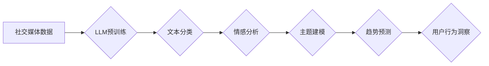

                 

## LLM在社交媒体分析中的应用：洞察用户行为

> 关键词：大型语言模型（LLM）、社交媒体分析、用户行为分析、自然语言处理（NLP）、情感分析、主题建模、趋势预测

## 1. 背景介绍

社交媒体已经成为人们日常生活不可或缺的一部分，用户每天在这些平台上分享着大量的信息，包括文字、图片、视频等。这些数据蕴藏着丰富的用户行为信息，对企业、政府和研究机构都具有重要的价值。传统的社交媒体分析方法主要依赖于规则匹配和统计分析，但随着社交媒体数据的日益庞大复杂，这些方法逐渐显得力不从心。

大型语言模型（LLM）的出现为社交媒体分析带来了新的机遇。LLM 拥有强大的自然语言理解和生成能力，能够从海量文本数据中提取更深层的语义信息，并进行更精准的分析。

## 2. 核心概念与联系

### 2.1  LLM

大型语言模型（LLM）是一种基于深度学习的强大人工智能模型，通过训练海量文本数据，学习语言的语法、语义和上下文关系。LLM 可以执行各种自然语言处理任务，例如文本生成、翻译、问答、情感分析等。

### 2.2  社交媒体分析

社交媒体分析是指利用数据挖掘、机器学习等技术，从社交媒体平台上收集和分析用户生成的内容，以了解用户行为、舆情趋势、品牌形象等信息。

### 2.3  联系

LLM 的强大自然语言处理能力可以有效提升社交媒体分析的精度和深度。

**Mermaid 流程图**



## 3. 核心算法原理 & 具体操作步骤

### 3.1  算法原理概述

LLM 在社交媒体分析中的应用主要基于以下核心算法：

* **文本分类:** 将社交媒体文本分类到预定义的类别中，例如主题、情感、意图等。
* **情感分析:** 分析文本中表达的情感倾向，例如正面、负面、中性等。
* **主题建模:** 从文本数据中提取出潜在的主题，了解用户关注的话题和兴趣。
* **趋势预测:** 基于历史数据，预测未来社交媒体平台上的趋势和热点。

这些算法通常基于深度学习模型，例如 Transformer、BERT 等，通过训练海量文本数据，学习语言的特征和模式，从而实现对文本的理解和分析。

### 3.2  算法步骤详解

**以文本分类为例，详细说明算法步骤：**

1. **数据预处理:** 对社交媒体文本进行清洗、去噪、分词等预处理操作，使其更适合模型训练。
2. **特征提取:** 使用词向量模型（例如 Word2Vec、GloVe）将文本单词映射到向量空间，提取文本的语义特征。
3. **模型训练:** 使用深度学习框架（例如 TensorFlow、PyTorch）训练文本分类模型，例如 CNN、RNN 或 Transformer。
4. **模型评估:** 使用测试数据集评估模型的性能，例如准确率、召回率、F1-score 等。
5. **模型部署:** 将训练好的模型部署到生产环境中，用于对实时社交媒体文本进行分类。

### 3.3  算法优缺点

**优点:**

* **高精度:** LLM 能够学习语言的复杂语义关系，实现更精准的文本分析。
* **自动化:** LLM 可以自动完成文本分类、情感分析等任务，提高效率。
* **可扩展性:** LLM 可以处理海量文本数据，满足社交媒体分析的需求。

**缺点:**

* **训练成本高:** LLM 需要大量的计算资源和训练数据，训练成本较高。
* **解释性差:** LLM 的决策过程较为复杂，难以解释模型的推理逻辑。
* **数据依赖性强:** LLM 的性能依赖于训练数据的质量和数量。

### 3.4  算法应用领域

LLM 在社交媒体分析中的应用领域广泛，包括：

* **品牌监测:** 监控品牌在社交媒体上的舆情，了解用户对品牌的评价和反馈。
* **市场调研:** 分析用户对产品的兴趣和需求，为市场营销提供决策依据。
* **客户服务:** 自动回复用户的问题，提高客户服务效率。
* **内容推荐:** 根据用户的兴趣和行为，推荐相关的内容。
* **风险预警:** 识别潜在的风险和危机，及时采取措施。

## 4. 数学模型和公式 & 详细讲解 & 举例说明

### 4.1  数学模型构建

LLM 的训练过程本质上是一个优化问题，目标是找到一个模型参数，使得模型在训练数据上的预测结果与真实标签尽可能接近。常用的损失函数包括交叉熵损失函数、均方误差损失函数等。

**交叉熵损失函数:**

$$
H(p, q) = -\sum_{i} p(i) \log q(i)
$$

其中：

* $p(i)$ 是真实标签的概率分布。
* $q(i)$ 是模型预测的概率分布。

### 4.2  公式推导过程

交叉熵损失函数的推导过程基于信息论的原理。信息熵衡量了随机变量的不确定性，而交叉熵则衡量了两个概率分布之间的差异。

### 4.3  案例分析与讲解

假设我们训练一个文本分类模型，将文本分类为“正面”和“负面”两类。训练数据包含1000个文本样本，其中500个为“正面”，500个为“负面”。模型训练完成后，对测试数据进行预测，得到以下预测结果：

* 预测为“正面”的样本有480个。
* 预测为“负面”的样本有520个。

使用交叉熵损失函数计算模型的损失值，需要知道真实标签和模型预测的概率分布。假设真实标签为“正面”的样本概率分布为0.5，真实标签为“负面”的样本概率分布为0.5。模型预测的概率分布可以根据模型输出的得分进行计算。

## 5. 项目实践：代码实例和详细解释说明

### 5.1  开发环境搭建

* Python 3.7+
* TensorFlow 2.x 或 PyTorch 1.x
* NLTK、spaCy 等自然语言处理库
* Jupyter Notebook 或 VS Code 等开发环境

### 5.2  源代码详细实现

以下代码示例展示了使用 TensorFlow 构建一个简单的文本分类模型：

```python
import tensorflow as tf
from tensorflow.keras.models import Sequential
from tensorflow.keras.layers import Embedding, LSTM, Dense

# 数据预处理
# ...

# 模型构建
model = Sequential()
model.add(Embedding(input_dim=vocab_size, output_dim=embedding_dim, input_length=max_length))
model.add(LSTM(units=128))
model.add(Dense(units=num_classes, activation='softmax'))

# 模型编译
model.compile(optimizer='adam', loss='sparse_categorical_crossentropy', metrics=['accuracy'])

# 模型训练
model.fit(x_train, y_train, epochs=10, batch_size=32)

# 模型评估
loss, accuracy = model.evaluate(x_test, y_test)
print('Loss:', loss)
print('Accuracy:', accuracy)
```

### 5.3  代码解读与分析

* **数据预处理:** 包括文本清洗、去噪、分词、词向量化等操作。
* **模型构建:** 使用 Embedding、LSTM 和 Dense 层构建一个多层神经网络模型。
* **模型编译:** 使用 Adam 优化器、交叉熵损失函数和准确率作为评估指标。
* **模型训练:** 使用训练数据训练模型，并设置训练轮数和批处理大小。
* **模型评估:** 使用测试数据评估模型的性能。

### 5.4  运行结果展示

训练完成后，可以查看模型的损失值和准确率，评估模型的性能。

## 6. 实际应用场景

### 6.1  品牌监测

利用 LLM 分析社交媒体上的品牌相关话题，识别用户对品牌的正面、负面评价，以及潜在的风险和危机。

### 6.2  市场调研

分析用户对产品的兴趣和需求，了解用户对产品的评价和建议，为市场营销提供决策依据。

### 6.3  客户服务

利用 LLM 自动回复用户的问题，提供快速、高效的客户服务。

### 6.4  未来应用展望

随着 LLM 技术的不断发展，其在社交媒体分析中的应用场景将更加广泛，例如：

* **个性化内容推荐:** 根据用户的兴趣和行为，推荐更精准的内容。
* **社交媒体广告投放:** 利用 LLM 分析用户画像，精准投放广告。
* **社交媒体舆情分析:** 识别和分析社交媒体上的舆情趋势，为政府和企业决策提供参考。

## 7. 工具和资源推荐

### 7.1  学习资源推荐

* **书籍:**
    * 《深度学习》 by Ian Goodfellow, Yoshua Bengio, and Aaron Courville
    * 《自然语言处理》 by Dan Jurafsky and James H. Martin
* **在线课程:**
    * Coursera: Natural Language Processing Specialization
    * edX: Deep Learning
* **博客和网站:**
    * Towards Data Science
    * Machine Learning Mastery

### 7.2  开发工具推荐

* **深度学习框架:** TensorFlow, PyTorch
* **自然语言处理库:** NLTK, spaCy, Gensim
* **文本处理工具:** BeautifulSoup, TextBlob

### 7.3  相关论文推荐

* **BERT: Pre-training of Deep Bidirectional Transformers for Language Understanding**
* **GPT-3: Language Models are Few-Shot Learners**
* **XLNet: Generalized Autoregressive Pretraining for Language Understanding**

## 8. 总结：未来发展趋势与挑战

### 8.1  研究成果总结

LLM 在社交媒体分析领域取得了显著的成果，能够实现更精准的文本分类、情感分析、主题建模等任务。

### 8.2  未来发展趋势

* **模型规模和能力的提升:** 未来 LLM 模型的规模和能力将进一步提升，能够处理更复杂的任务，并提供更深入的分析。
* **多模态分析:** LLM 将与其他模态数据（例如图像、音频）融合，实现多模态分析，提供更全面的用户行为洞察。
* **可解释性增强:** 研究者将致力于提高 LLM 的可解释性，使得模型的决策过程更加透明。

### 8.3  面临的挑战

* **数据隐私和安全:** LLM 的训练需要大量数据，如何保护用户隐私和数据安全是一个重要的挑战。
* **模型偏见:** LLM 的训练数据可能存在偏见，导致模型输出结果存在偏差。如何解决模型偏见是一个需要持续关注的问题。
* **计算资源需求:** LLM 的训练和部署需要大量的计算资源，这对于资源有限的机构来说是一个挑战。

### 8.4  研究展望

未来研究将集中在以下几个方面：

* 开发更强大的 LLM 模型，提升模型的性能和能力。
* 研究 LLM 的可解释性，使得模型的决策过程更加透明。
* 解决 LLM 的数据隐私和安全问题，确保用户数据安全。
* 探索 LLM 在其他领域的应用，例如医疗、教育、金融等。

## 9. 附录：常见问题与解答

**Q1: LLM 在社交媒体分析中有哪些优势？**

**A1:** LLM 能够学习语言的复杂语义关系，实现更精准的文本分析；自动化完成文本分类、情感分析等任务，提高效率；可处理海量文本数据，满足社交媒体分析的需求。

**Q2: LLM 在社交媒体分析中有哪些局限性？**

**A2:** LLM 的训练成本高；解释性差，难以解释模型的推理逻辑；数据依赖性强，性能依赖于训练数据的质量和数量。

**Q3: 如何选择合适的 LLM 模型用于社交媒体分析？**

**A3:** 选择合适的 LLM 模型需要考虑任务类型、数据规模、计算资源等因素。

**Q4: 如何解决 LLM 模型的偏见问题？**

**A4:** 可以通过使用更均衡的数据集、进行数据清洗和去噪、使用正则化技术等方法来解决 LLM 模型的偏见问题。


作者：禅与计算机程序设计艺术 / Zen and the Art of Computer Programming 
<end_of_turn>

