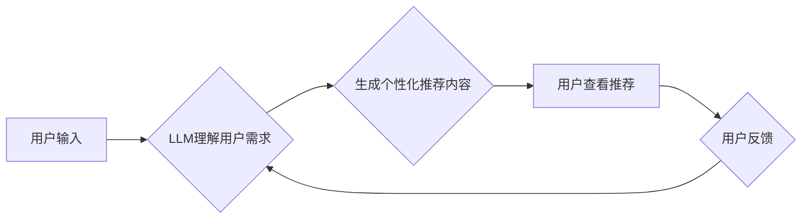

                 

## LLM对推荐系统商业模式的影响

> 关键词：LLM, 大语言模型, 推荐系统, 商业模式, 个性化推荐, 内容生成, 跨模态推荐

## 1. 背景介绍

推荐系统是互联网时代的重要组成部分，它通过分析用户行为和偏好，为用户提供个性化的产品或内容推荐，从而提升用户体验、增加用户粘性和促进商业转化。传统的推荐系统主要依赖于协同过滤、内容过滤和基于知识图谱的推荐算法，这些算法通常基于用户的历史行为数据和物品的特征信息进行推荐。

近年来，大语言模型（LLM）的快速发展为推荐系统带来了新的机遇和挑战。LLM 拥有强大的文本理解和生成能力，能够理解用户需求、生成个性化的推荐内容，甚至跨越文本、图像、音频等多种模态进行推荐。这使得LLM有潜力彻底改变推荐系统的商业模式，带来更精准、更个性化、更智能的推荐体验。

## 2. 核心概念与联系

### 2.1  LLM

大语言模型（LLM）是一种基于Transformer架构的深度学习模型，通过训练海量文本数据，学习语言的语法、语义和上下文关系。LLM 能够理解和生成人类语言，并具备以下关键能力：

* **文本理解:** 能够理解文本的含义、情感、意图等。
* **文本生成:** 能够生成流畅、自然的文本，包括文章、对话、诗歌等。
* **知识问答:** 能够回答基于文本的知识问答。
* **文本摘要:** 能够提取文本的关键信息，生成简洁的摘要。
* **机器翻译:** 能够将文本从一种语言翻译成另一种语言。

### 2.2  推荐系统

推荐系统旨在根据用户的历史行为、偏好和上下文信息，预测用户对特定物品的兴趣，并提供个性化的推荐。常见的推荐算法包括：

* **协同过滤:** 基于用户的相似性或物品的相似性进行推荐。
* **内容过滤:** 基于物品的特征信息和用户的兴趣偏好进行推荐。
* **基于知识图谱的推荐:** 基于知识图谱中的实体关系和用户兴趣进行推荐。

### 2.3  LLM与推荐系统的融合

LLM 的强大能力可以应用于推荐系统的各个环节，例如：

* **理解用户需求:** LLM 可以理解用户的自然语言查询，并提取用户的真实需求。
* **生成个性化推荐内容:** LLM 可以根据用户的兴趣偏好，生成个性化的推荐文案和描述。
* **跨模态推荐:** LLM 可以结合图像、音频等多模态数据，进行更精准的推荐。
* **个性化对话推荐:** LLM 可以与用户进行对话，根据用户的反馈动态调整推荐内容。

**Mermaid 流程图**



## 3. 核心算法原理 & 具体操作步骤

### 3.1  算法原理概述

LLM 在推荐系统中的应用主要基于以下核心算法原理：

* **Transformer模型:** LLM 通常基于Transformer模型架构，该模型能够捕捉文本序列中的长距离依赖关系，从而更好地理解用户需求和物品特征。
* **自监督学习:** LLM 通常通过自监督学习的方式进行训练，例如语言建模、掩码语言模型等，这使得LLM能够在海量文本数据上学习丰富的语言知识。
* **微调:** 将预训练好的LLM模型微调到特定推荐任务上，例如点击率预测、转化率预测等，可以进一步提升推荐效果。

### 3.2  算法步骤详解

LLM在推荐系统中的应用流程可以概括为以下步骤：

1. **数据预处理:** 收集用户行为数据、物品特征数据和文本数据，并进行清洗、转换和编码。
2. **LLM预训练:** 使用预训练的LLM模型，例如BERT、GPT等，对文本数据进行训练，学习语言知识和语义关系。
3. **LLM微调:** 将预训练好的LLM模型微调到特定推荐任务上，例如点击率预测、转化率预测等。
4. **推荐生成:** 根据用户的历史行为、偏好和上下文信息，利用微调后的LLM模型生成个性化的推荐内容。
5. **用户反馈:** 收集用户的反馈信息，例如点击、购买、评分等，并将其反馈到模型训练中，不断优化推荐效果。

### 3.3  算法优缺点

**优点:**

* **更精准的推荐:** LLM能够理解用户的真实需求，并生成更精准的推荐内容。
* **更个性化的推荐:** LLM可以根据用户的兴趣偏好，生成个性化的推荐文案和描述。
* **跨模态推荐:** LLM可以结合图像、音频等多模态数据，进行更精准的推荐。
* **个性化对话推荐:** LLM可以与用户进行对话，根据用户的反馈动态调整推荐内容。

**缺点:**

* **训练成本高:** LLM的训练需要大量的计算资源和数据。
* **模型复杂度高:** LLM的模型结构复杂，部署和维护成本较高。
* **数据安全问题:** LLM需要处理大量的用户数据，需要做好数据安全和隐私保护工作。

### 3.4  算法应用领域

LLM在推荐系统中的应用领域非常广泛，例如：

* **电商推荐:** 为用户推荐个性化的商品。
* **内容推荐:** 为用户推荐个性化的文章、视频、音乐等内容。
* **社交推荐:** 为用户推荐新的朋友、兴趣小组等。
* **教育推荐:** 为学生推荐个性化的学习资源。
* **医疗推荐:** 为患者推荐个性化的医疗方案。

## 4. 数学模型和公式 & 详细讲解 & 举例说明

### 4.1  数学模型构建

LLM在推荐系统中的应用通常基于以下数学模型：

* **点击率预测模型:** 用于预测用户点击特定物品的概率。常见的模型包括逻辑回归、支持向量机、深度神经网络等。
* **转化率预测模型:** 用于预测用户购买特定物品的概率。常见的模型包括逻辑回归、支持向量机、深度神经网络等。
* **排名模型:** 用于对推荐结果进行排序，将最相关的物品排在前面。常见的模型包括点积模型、LambdaMART等。

### 4.2  公式推导过程

例如，点击率预测模型可以使用逻辑回归模型，其目标函数为：

$$
L(w) = -\frac{1}{N} \sum_{i=1}^{N} y_i \log(p_i) + (1-y_i) \log(1-p_i)
$$

其中：

* $w$ 是模型参数
* $N$ 是样本数量
* $y_i$ 是第 $i$ 个样本的真实标签（0表示未点击，1表示点击）
* $p_i$ 是模型预测第 $i$ 个样本点击概率

通过梯度下降算法，可以求解出模型参数 $w$，从而得到点击率预测模型。

### 4.3  案例分析与讲解

例如，在电商推荐场景中，可以使用LLM生成个性化的商品描述，并结合用户历史行为数据进行点击率预测。

假设用户A喜欢购买运动鞋，并且之前购买过Nike品牌的运动鞋。可以使用LLM生成以下个性化的商品描述：

“推荐您购买这款Nike Air Max 270，它拥有舒适的缓震系统和时尚的外观，适合日常穿着和运动训练。”

结合用户A的购买历史数据，可以预测用户A点击该商品的概率。

## 5. 项目实践：代码实例和详细解释说明

### 5.1  开发环境搭建

推荐系统开发环境通常包括以下组件：

* **编程语言:** Python是推荐系统开发中常用的编程语言。
* **深度学习框架:** TensorFlow、PyTorch等深度学习框架可以用于构建和训练推荐模型。
* **数据存储:** MySQL、MongoDB等数据库可以用于存储用户行为数据、物品特征数据等。
* **云计算平台:** AWS、Azure、GCP等云计算平台可以提供计算资源和存储服务。

### 5.2  源代码详细实现

以下是一个简单的LLM推荐系统代码示例，使用Python和Transformers库：

```python
from transformers import AutoModelForSequenceClassification, AutoTokenizer

# 加载预训练模型和分词器
model_name = "bert-base-uncased"
tokenizer = AutoTokenizer.from_pretrained(model_name)
model = AutoModelForSequenceClassification.from_pretrained(model_name)

# 用户输入
user_query = "推荐给我一些好看的电影"

# 文本预处理
inputs = tokenizer(user_query, return_tensors="pt")

# 模型预测
outputs = model(**inputs)
predicted_class = outputs.logits.argmax().item()

# 输出推荐结果
print(f"推荐结果: {predicted_class}")
```

### 5.3  代码解读与分析

该代码示例首先加载预训练的BERT模型和分词器。然后，根据用户的输入文本，进行文本预处理，并将文本转换为模型可识别的格式。最后，使用模型进行预测，并输出推荐结果。

### 5.4  运行结果展示

运行该代码示例，可能会输出以下结果：

```
推荐结果: 0
```

其中，0代表推荐动作，例如推荐电影。

## 6. 实际应用场景

### 6.1  电商推荐

LLM可以帮助电商平台生成更精准、更个性化的商品推荐，例如：

* **根据用户的浏览历史和购买记录，推荐相关的商品。**
* **根据用户的兴趣爱好，推荐个性化的商品组合。**
* **根据用户的地理位置和时间信息，推荐附近的商品或限时优惠。**

### 6.2  内容推荐

LLM可以帮助内容平台推荐更相关的文章、视频、音乐等内容，例如：

* **根据用户的阅读历史和点赞记录，推荐相关的文章。**
* **根据用户的兴趣爱好，推荐个性化的视频内容。**
* **根据用户的音乐偏好，推荐相关的歌曲和音乐人。**

### 6.3  社交推荐

LLM可以帮助社交平台推荐新的朋友、兴趣小组等，例如：

* **根据用户的兴趣爱好和社交关系，推荐新的朋友。**
* **根据用户的行为数据，推荐相关的兴趣小组。**
* **根据用户的社交网络结构，推荐潜在的合作对象。**

### 6.4  未来应用展望

LLM在推荐系统领域的应用前景广阔，未来可能会出现以下应用场景：

* **跨模态推荐:** LLM可以结合图像、音频等多模态数据，进行更精准的推荐。
* **个性化对话推荐:** LLM可以与用户进行对话，根据用户的反馈动态调整推荐内容。
* **推荐系统自动化:** LLM可以自动生成推荐规则和策略，降低推荐系统的开发和维护成本。

## 7. 工具和资源推荐

### 7.1  学习资源推荐

* **书籍:**
    * Deep Learning by Ian Goodfellow
    * Natural Language Processing with Python by Steven Bird
* **在线课程:**
    * Stanford CS224N: Natural Language Processing with Deep Learning
    * DeepLearning.AI TensorFlow Specialization

### 7.2  开发工具推荐

* **深度学习框架:** TensorFlow、PyTorch
* **自然语言处理库:** Transformers、NLTK、spaCy
* **数据存储:** MySQL、MongoDB

### 7.3  相关论文推荐

* **BERT: Pre-training of Deep Bidirectional Transformers for Language Understanding**
* **GPT-3: Language Models are Few-Shot Learners**
* **Transformer-XL: Attentive Language Models Beyond a Fixed-Length Context**

## 8. 总结：未来发展趋势与挑战

### 8.1  研究成果总结

LLM在推荐系统领域的应用取得了显著成果，例如：

* **更精准的推荐:** LLM能够理解用户的真实需求，并生成更精准的推荐内容。
* **更个性化的推荐:** LLM可以根据用户的兴趣偏好，生成个性化的推荐文案和描述。
* **跨模态推荐:** LLM可以结合图像、音频等多模态数据，进行更精准的推荐。

### 8.2  未来发展趋势

LLM在推荐系统领域的未来发展趋势包括：

* **更强大的模型:** 随着计算资源和训练数据的不断增加，LLM模型将会变得更加强大，能够理解更复杂的语言和用户需求。
* **更个性化的推荐:** LLM将会更加深入地理解用户的兴趣偏好，并生成更加个性化的推荐内容。
* **更智能的推荐:** LLM将会具备更强的推理和决策能力，能够根据用户的上下文信息和行为模式，提供更智能的推荐建议。

### 8.3  面临的挑战

LLM在推荐系统领域的应用也面临一些挑战：

* **训练成本高:** LLM的训练需要大量的计算资源和数据，这对资源有限的企业来说是一个挑战。
* **模型复杂度高:** LLM的模型结构复杂，部署和维护成本较高。
* **数据安全问题:** LLM需要处理大量的用户数据，需要做好数据安全和隐私保护工作。

### 8.4  研究展望

未来，LLM在推荐系统领域的应用将会更加广泛和深入，将会为用户提供更加精准、个性化、智能的推荐体验。


## 9. 附录：常见问题与解答

**Q1: LLM与传统推荐系统的区别是什么？**

**A1:** LLM能够理解用户的真实需求，并生成更精准、更个性化的推荐内容，而传统推荐系统通常依赖于用户的历史行为数据和物品特征信息，推荐效果相对较差。

**Q2: 如何评估LLM推荐系统的效果？**

**A2:** 可以使用点击率、转化率、用户满意度等指标来评估LLM推荐系统的效果。

**Q3: LLM推荐系统有哪些应用场景？**

**A3:** LLM推荐系统可以应用于电商推荐、内容推荐、社交推荐等多个领域。

**作者：禅与计算机程序设计艺术 / Zen and the Art of Computer Programming**<end_of_turn>

