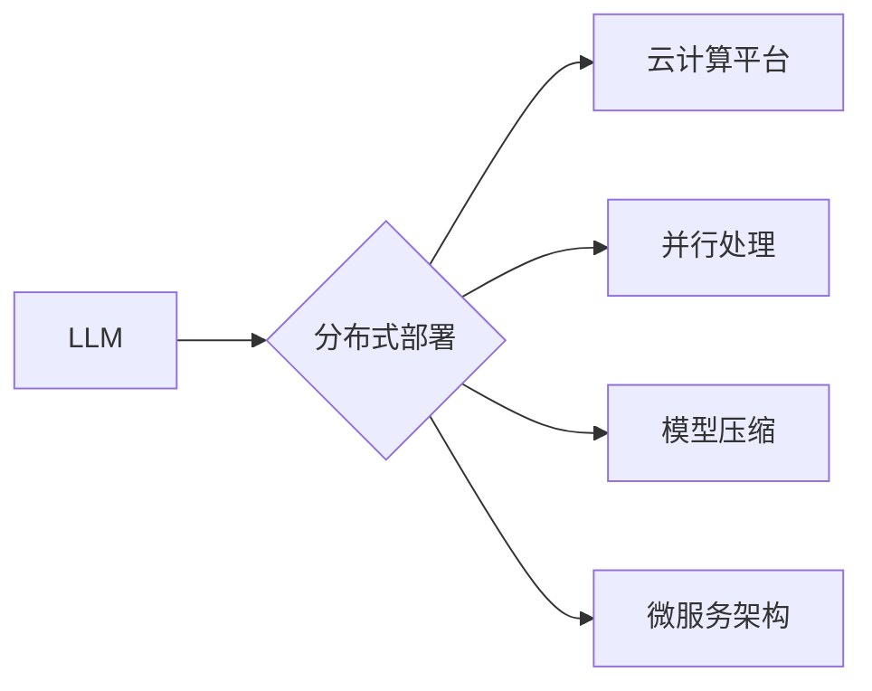

                 

## LLM的分布式部署：AI的云端革命

> 关键词：大型语言模型 (LLM)、分布式部署、云计算、并行处理、模型压缩、微服务架构、高可用性、可扩展性

### 1. 背景介绍

大型语言模型 (LLM) 近年来取得了令人瞩目的进展，在自然语言处理、文本生成、机器翻译等领域展现出强大的能力。然而，这些模型通常具有庞大的参数量和复杂的计算需求，部署和运行这些模型面临着巨大的挑战。传统的集中式部署方式难以满足 LLM 的高性能计算需求，并且缺乏可扩展性和容错能力。

分布式部署成为解决 LLM 部署难题的关键技术。通过将模型参数和计算任务分发到多个节点上进行并行处理，分布式部署可以有效提高模型训练和推理速度，同时增强系统的可扩展性和可靠性。

### 2. 核心概念与联系

**2.1 核心概念**

* **大型语言模型 (LLM):** 指参数量在数十亿甚至数千亿级别的神经网络模型，能够理解和生成人类语言。
* **分布式部署:** 将应用程序或系统分解成多个独立的组件，并在不同的节点上运行，以提高性能、可扩展性和可靠性。
* **云计算:** 提供按需计算资源的网络服务，用户可以根据需要动态分配和释放计算资源。

**2.2 架构关系**



**2.3 核心联系**

分布式部署是 LLM 在云计算平台上高效运行的关键技术。通过将 LLM 分布到多个节点上进行并行处理，可以充分利用云计算平台的计算资源，提高模型训练和推理速度。同时，分布式部署还支持模型压缩和微服务架构，进一步优化模型性能和系统架构。

### 3. 核心算法原理 & 具体操作步骤

**3.1 算法原理概述**

分布式训练的核心算法是**参数服务器**和**异步更新**。参数服务器负责存储模型参数，并协调各个节点的训练过程。每个节点负责处理一部分训练数据，并根据计算结果更新模型参数。

**3.2 算法步骤详解**

1. 将模型参数和训练数据分发到各个节点。
2. 每个节点对局部数据进行训练，并计算梯度。
3. 节点将梯度发送到参数服务器。
4. 参数服务器汇总所有节点的梯度，并更新模型参数。
5. 更新后的模型参数被分发回各个节点。
6. 重复步骤 2-5，直到模型收敛。

**3.3 算法优缺点**

* **优点:**
    * 能够有效利用多核CPU和GPU资源，提高训练速度。
    * 具有较好的可扩展性，可以轻松扩展到更大的数据集和模型规模。
    * 容错性强，单个节点故障不会影响整个训练过程。
* **缺点:**
    * 通信开销较大，可能会影响训练效率。
    * 需要复杂的协调机制，保证参数更新的正确性和一致性。

**3.4 算法应用领域**

分布式训练算法广泛应用于各种深度学习任务，例如图像识别、自然语言处理、语音识别等。

### 4. 数学模型和公式 & 详细讲解 & 举例说明

**4.1 数学模型构建**

假设我们有一个包含 $N$ 个参数的 LLM 模型，每个参数 $w_i$ 都对应一个特定的神经元连接。模型的输出 $y$ 是通过对输入 $x$ 进行一系列的线性变换和非线性激活函数操作得到的。

**4.2 公式推导过程**

模型的损失函数 $L$ 用于衡量模型预测结果与真实结果之间的差异。目标是通过优化模型参数 $w_i$ 来最小化损失函数。

$$
L(w_1, w_2, ..., w_N) = \sum_{i=1}^{m} loss(y_i, \hat{y}_i)
$$

其中，$m$ 是训练样本的数量，$y_i$ 是真实标签，$\hat{y}_i$ 是模型预测结果。

使用梯度下降算法来优化模型参数：

$$
w_i = w_i - \eta \frac{\partial L}{\partial w_i}
$$

其中，$\eta$ 是学习率，$\frac{\partial L}{\partial w_i}$ 是损失函数对参数 $w_i$ 的梯度。

**4.3 案例分析与讲解**

假设我们训练一个文本分类模型，目标是将文本分类为正类或负类。模型的损失函数可以使用交叉熵损失函数：

$$
loss(y, \hat{y}) = -y \log(\hat{y}) - (1-y) \log(1-\hat{y})
$$

其中，$y$ 是真实标签（0 或 1），$\hat{y}$ 是模型预测的概率。

通过计算梯度并更新模型参数，模型可以逐渐学习到文本分类的规律。

### 5. 项目实践：代码实例和详细解释说明

**5.1 开发环境搭建**

* 操作系统：Linux
* 编程语言：Python
* 深度学习框架：TensorFlow 或 PyTorch
* 云计算平台：AWS、Azure 或 GCP

**5.2 源代码详细实现**

以下是一个使用 TensorFlow 分布式训练 LLM 的简单代码示例：

```python
import tensorflow as tf

# 定义模型
model = tf.keras.Sequential([
    tf.keras.layers.Embedding(input_dim=vocab_size, output_dim=embedding_dim),
    tf.keras.layers.LSTM(units=hidden_size),
    tf.keras.layers.Dense(units=num_classes, activation='softmax')
])

# 定义优化器和损失函数
optimizer = tf.keras.optimizers.Adam(learning_rate=0.001)
loss_fn = tf.keras.losses.CategoricalCrossentropy()

# 分布式训练
strategy = tf.distribute.MirroredStrategy()
with strategy.scope():
    model.compile(optimizer=optimizer, loss=loss_fn)
    model.fit(train_data, epochs=10)
```

**5.3 代码解读与分析**

* 使用 `tf.distribute.MirroredStrategy()` 创建分布式训练策略，将模型参数和计算任务分发到多个 GPU 上。
* 使用 `model.compile()` 配置优化器和损失函数。
* 使用 `model.fit()` 进行分布式训练。

**5.4 运行结果展示**

训练完成后，可以评估模型的性能，例如准确率、召回率等。

### 6. 实际应用场景

**6.1 自然语言处理**

* 文本分类：情感分析、垃圾邮件过滤、新闻主题分类
* 文本生成：机器翻译、对话系统、故事创作
* 文本摘要：自动生成文章摘要
* 问答系统：基于文本的智能问答

**6.2 代码生成**

* 代码补全：根据上下文自动生成代码片段
* 代码翻译：将代码从一种编程语言翻译成另一种编程语言
* 代码解释：自动生成代码的解释文档

**6.3 其他应用场景**

* 图像识别
* 语音识别
* 机器人控制

**6.4 未来应用展望**

随着 LLM 技术的不断发展，其应用场景将更加广泛，例如：

* 个性化教育：根据学生的学习情况提供个性化的学习内容和辅导。
* 智能医疗：辅助医生诊断疾病、制定治疗方案。
* 科学研究：加速科学发现，例如药物研发、材料科学。

### 7. 工具和资源推荐

**7.1 学习资源推荐**

* **书籍:**
    * 《深度学习》 by Ian Goodfellow, Yoshua Bengio, and Aaron Courville
    * 《自然语言处理》 by Dan Jurafsky and James H. Martin
* **在线课程:**
    * Coursera: Deep Learning Specialization
    * Udacity: Artificial Intelligence Nanodegree
* **博客和论坛:**
    * TensorFlow Blog
    * PyTorch Blog
    * Reddit: r/MachineLearning

**7.2 开发工具推荐**

* **深度学习框架:** TensorFlow, PyTorch, Keras
* **云计算平台:** AWS, Azure, GCP
* **分布式训练工具:** Horovod, Ray

**7.3 相关论文推荐**

* Attention Is All You Need (Vaswani et al., 2017)
* BERT: Pre-training of Deep Bidirectional Transformers for Language Understanding (Devlin et al., 2018)
* GPT-3: Language Models are Few-Shot Learners (Brown et al., 2020)

### 8. 总结：未来发展趋势与挑战

**8.1 研究成果总结**

分布式部署技术为 LLM 的高效训练和推理提供了关键支撑，推动了 LLM 技术的快速发展。

**8.2 未来发展趋势**

* 模型规模的进一步扩大：随着硬件性能的提升，LLM 的参数量将继续增长，对分布式部署的需求更加迫切。
* 训练效率的提升：研究人员将继续探索新的分布式训练算法和优化策略，以提高训练效率。
* 模型压缩和加速技术：为了降低模型部署成本和延迟，模型压缩和加速技术将得到更广泛的应用。
* 异构计算资源的利用：LLM 将更加充分地利用异构计算资源，例如 CPU、GPU 和 TPU。

**8.3 面临的挑战**

* 通信开销的降低：分布式训练过程中，节点之间的通信开销仍然是一个挑战。
* 模型参数的同步和一致性：保证模型参数在各个节点上的同步和一致性是分布式训练的关键问题。
* 训练过程的监控和调试：分布式训练过程更加复杂，需要更完善的监控和调试工具。

**8.4 研究展望**

未来研究将集中在以下几个方面：

* 开发更有效的分布式训练算法和优化策略。
* 研究模型压缩和加速技术，降低模型部署成本和延迟。
* 探索异构计算资源的利用，提高训练效率。
* 开发更完善的分布式训练工具和平台。

### 9. 附录：常见问题与解答

**9.1 如何选择合适的分布式训练策略？**

选择合适的分布式训练策略取决于模型规模、数据规模、硬件资源等因素。

**9.2 如何解决模型参数的同步和一致性问题？**

可以使用参数服务器架构或异步更新机制来解决模型参数的同步和一致性问题。

**9.3 如何监控和调试分布式训练过程？**

可以使用分布式训练框架提供的监控工具，例如 TensorBoard 或 Weights & Biases。


作者：禅与计算机程序设计艺术 / Zen and the Art of Computer Programming 
<end_of_turn>

